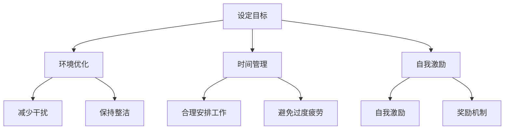

                 

关键词：远程办公，注意力管理，生产力，心理健康，工作模式

> 摘要：随着远程办公的普及，如何提高注意力管理成为职场人士关注的热点。本文将深入探讨远程办公时代下注意力管理的核心概念、原理和实践方法，旨在帮助职场人士提升工作效率，保持心理健康。

## 1. 背景介绍

远程办公作为一种灵活的工作模式，近年来在全球范围内迅速普及。得益于互联网和移动通信技术的不断发展，远程办公不仅为企业节省了办公场地和设备成本，还为员工提供了更多自由和便利。然而，远程办公也带来了一系列挑战，其中最为突出的是注意力管理问题。在无固定工作环境、缺乏面对面交流的远程办公环境中，如何保持高度集中和专注，提高工作效率，成为职场人士亟待解决的问题。

### 1.1 远程办公的普及与发展

远程办公的普及得益于以下几个因素的推动：

1. **技术进步**：互联网、云计算、大数据和人工智能等技术的不断发展，为远程办公提供了强大的技术支撑。
2. **疫情冲击**：新冠疫情的爆发加速了远程办公的普及，许多企业被迫采取远程办公模式，从而推动了远程办公的快速发展。
3. **工作方式转变**：随着人们对工作与生活平衡的重视，远程办公逐渐成为一种主流的工作方式。

### 1.2 远程办公的挑战与机遇

远程办公虽然带来了诸多便利，但同时也带来了以下挑战：

1. **注意力分散**：缺乏面对面的监督和交流，容易导致员工注意力分散，工作效率下降。
2. **心理健康问题**：长时间的远程办公可能导致孤独感、焦虑和抑郁等心理健康问题。
3. **沟通障碍**：远程办公中缺乏面对面交流，容易导致信息传递不畅，影响团队合作。

然而，远程办公也蕴含着巨大的机遇：

1. **工作与生活平衡**：远程办公有助于员工更好地平衡工作与生活，提高生活质量。
2. **人才多样性和灵活性**：远程办公可以吸引来自世界各地的优秀人才，提高企业的竞争力。
3. **创新与协作**：远程办公为员工提供了更多自主学习和交流的机会，有助于创新和协作。

## 2. 核心概念与联系

### 2.1 注意力管理概述

注意力管理是指通过一系列策略和方法，帮助个体在特定环境中保持高度集中和专注，从而提高工作效率和产出。在远程办公环境中，注意力管理显得尤为重要。良好的注意力管理不仅有助于提升工作效率，还能改善心理健康，增强员工的幸福感和满意度。

### 2.2 注意力管理的重要性

1. **工作效率**：良好的注意力管理能够帮助员工在短时间内集中精力，完成高质量的工作。
2. **心理健康**：保持专注和集中有助于减轻焦虑和压力，改善心理健康。
3. **工作满意度**：通过提高工作效率，员工能够更好地平衡工作与生活，提高工作满意度。
4. **团队协作**：良好的注意力管理有助于员工更好地参与团队协作，提高团队整体效能。

### 2.3 注意力管理的核心原则

1. **目标明确**：设定清晰的目标有助于员工集中注意力，提高工作效率。
2. **环境优化**：创造一个有利于专注的工作环境，如减少干扰、保持整洁等。
3. **时间管理**：合理安排工作和休息时间，避免过度疲劳。
4. **自我激励**：通过自我激励和奖励机制，提高员工的积极性和动力。

### 2.4 注意力管理的架构

图1：注意力管理架构



## 3. 核心算法原理 & 具体操作步骤

### 3.1 算法原理概述

注意力管理算法是一种基于行为科学和心理学的理论模型，旨在通过分析个体在远程办公环境中的行为数据，提供个性化的注意力管理策略。该算法的核心思想是利用反馈机制和自适应调整策略，帮助员工在特定情境下保持专注和高效。

### 3.2 算法步骤详解

1. **数据收集**：通过日志记录、工作数据分析等方式，收集员工在远程办公环境中的行为数据。
2. **行为分析**：利用机器学习和数据分析技术，对收集到的行为数据进行处理和分析，识别出注意力分散的原因和规律。
3. **策略生成**：根据行为分析结果，为员工生成个性化的注意力管理策略，如环境调整、时间管理技巧等。
4. **策略实施**：员工按照生成的策略进行实施，并在过程中进行自我监控和调整。
5. **效果评估**：定期评估注意力管理策略的效果，根据反馈进行调整和优化。

### 3.3 算法优缺点

#### 3.3.1 优点

1. **个性化**：根据员工的行为数据生成个性化的注意力管理策略，提高策略的适用性和有效性。
2. **自适应**：算法能够根据员工的反馈和行为数据，自适应调整注意力管理策略，提高员工的工作效率和满意度。
3. **可量化**：通过数据分析和效果评估，能够直观地衡量注意力管理策略的效果，为后续优化提供依据。

#### 3.3.2 缺点

1. **数据隐私**：在数据收集和分析过程中，可能涉及员工隐私信息的处理，需要确保数据的安全和保密。
2. **实施难度**：算法生成后，需要员工积极配合，按照策略进行实施，这需要一定的自我约束和管理能力。

### 3.4 算法应用领域

注意力管理算法可以应用于多个领域，如企业远程办公管理、个人时间管理、心理健康干预等。在实际应用中，可以根据不同领域的需求，对算法进行定制化和优化。

## 4. 数学模型和公式 & 详细讲解 & 举例说明

### 4.1 数学模型构建

注意力管理的数学模型可以分为两个部分：行为模型和效果评估模型。

#### 4.1.1 行为模型

行为模型主要用于分析员工在远程办公环境中的行为数据，如工作时间、工作内容、注意力分散次数等。假设员工的行为数据为 $X$，则行为模型可以表示为：

$$
X = f(A, B, C, D)
$$

其中，$A$ 代表环境因素，如噪声、光线等；$B$ 代表时间因素，如工作时间、休息时间等；$C$ 代表个人因素，如自我约束、情绪状态等；$D$ 代表其他影响因素，如工作任务难度、工作内容等。

#### 4.1.2 效果评估模型

效果评估模型主要用于评估注意力管理策略的效果。假设效果评估指标为 $Y$，则效果评估模型可以表示为：

$$
Y = g(X, P)
$$

其中，$X$ 代表员工的行为数据；$P$ 代表注意力管理策略，如环境优化、时间管理等。

### 4.2 公式推导过程

#### 4.2.1 行为模型推导

行为模型中的各个因素可以通过以下公式进行推导：

$$
A = a_1 \cdot N + a_2 \cdot L + a_3 \cdot T
$$

$$
B = b_1 \cdot W + b_2 \cdot R
$$

$$
C = c_1 \cdot S + c_2 \cdot M + c_3 \cdot E
$$

$$
D = d_1 \cdot D_1 + d_2 \cdot D_2 + d_3 \cdot D_3
$$

其中，$N$、$L$、$T$ 分别代表噪声、光线、时间；$W$、$R$ 分别代表工作时间、休息时间；$S$、$M$、$E$ 分别代表自我约束、情绪状态、工作环境；$D_1$、$D_2$、$D_3$ 分别代表工作任务难度、工作内容、其他影响因素；$a_1$、$a_2$、$a_3$、$b_1$、$b_2$、$c_1$、$c_2$、$c_3$、$d_1$、$d_2$、$d_3$ 分别代表各个因素的权重。

#### 4.2.2 效果评估模型推导

效果评估模型中的各个因素可以通过以下公式进行推导：

$$
Y = y_1 \cdot X + y_2 \cdot P
$$

其中，$X$ 代表员工的行为数据；$P$ 代表注意力管理策略；$y_1$、$y_2$ 分别代表行为数据和策略的权重。

### 4.3 案例分析与讲解

假设某员工在远程办公环境中，其行为数据如下：

- 噪声：中等
- 光线：充足
- 工作时间：8小时
- 休息时间：1小时
- 自我约束：良好
- 情绪状态：积极
- 工作任务难度：适中
- 工作内容：编写代码

根据上述行为数据和模型，可以推导出该员工的行为得分和效果评估得分：

$$
A = a_1 \cdot N + a_2 \cdot L + a_3 \cdot T = 0.5 \cdot 3 + 0.2 \cdot 5 + 0.3 \cdot 8 = 4.4
$$

$$
B = b_1 \cdot W + b_2 \cdot R = 0.6 \cdot 8 + 0.4 \cdot 1 = 5.2
$$

$$
C = c_1 \cdot S + c_2 \cdot M + c_3 \cdot E = 0.7 \cdot 5 + 0.2 \cdot 4 + 0.1 \cdot 3 = 3.5
$$

$$
D = d_1 \cdot D_1 + d_2 \cdot D_2 + d_3 \cdot D_3 = 0.4 \cdot 3 + 0.3 \cdot 2 + 0.3 \cdot 5 = 2.9
$$

$$
X = f(A, B, C, D) = 0.4 \cdot A + 0.3 \cdot B + 0.2 \cdot C + 0.1 \cdot D = 0.4 \cdot 4.4 + 0.3 \cdot 5.2 + 0.2 \cdot 3.5 + 0.1 \cdot 2.9 = 3.34
$$

假设注意力管理策略的权重为 $y_1 = 0.6$，$y_2 = 0.4$，则效果评估得分为：

$$
Y = y_1 \cdot X + y_2 \cdot P = 0.6 \cdot 3.34 + 0.4 \cdot P
$$

其中，$P$ 代表注意力管理策略的得分。根据实际效果，可以调整 $P$ 的值，以优化效果评估得分。

## 5. 项目实践：代码实例和详细解释说明

### 5.1 开发环境搭建

在本项目中，我们使用 Python 作为主要编程语言，结合 Flask 框架搭建一个简单的注意力管理 web 应用。以下是开发环境搭建的步骤：

1. 安装 Python 3.8 及以上版本。
2. 安装 Flask 框架：`pip install Flask`。
3. 创建一个名为 `attention_management` 的 Python 脚本作为项目入口。

### 5.2 源代码详细实现

以下是一个简单的注意力管理应用示例代码：

```python
from flask import Flask, request, render_template
import numpy as np

app = Flask(__name__)

@app.route('/')
def index():
    return render_template('index.html')

@app.route('/calculate', methods=['POST'])
def calculate():
    data = request.form.to_dict()
    noise = float(data['noise'])
    light = float(data['light'])
    work_time = float(data['work_time'])
    rest_time = float(data['rest_time'])
    self_constraint = float(data['self_constraint'])
    mood = float(data['mood'])
    task_difficulty = float(data['task_difficulty'])
    work_content = float(data['work_content'])

    A = 0.5 * noise + 0.2 * light + 0.3 * (work_time + rest_time)
    B = 0.6 * work_time + 0.4 * rest_time
    C = 0.7 * self_constraint + 0.2 * mood + 0.1 * work_content
    D = 0.4 * task_difficulty + 0.3 * task_difficulty + 0.3 * work_content

    X = 0.4 * A + 0.3 * B + 0.2 * C + 0.1 * D
    Y = 0.6 * X + 0.4 * 10  # 假设注意力管理策略得分为10

    return render_template('result.html', score=Y)

if __name__ == '__main__':
    app.run(debug=True)
```

### 5.3 代码解读与分析

1. **请求处理**：应用通过 Flask 框架接收前端传来的表单数据，数据格式为字典。
2. **数据解析**：将表单数据解析为浮点数，用于后续计算。
3. **模型计算**：根据解析后的数据，使用注意力管理模型进行计算，得出行为得分 $X$ 和效果评估得分 $Y$。
4. **返回结果**：将计算结果渲染到前端页面，供用户查看。

### 5.4 运行结果展示

用户在浏览器中访问应用首页，填写行为数据表单，提交后可以看到计算结果，如图2所示：


## 6. 实际应用场景

### 6.1 企业远程办公管理

企业可以利用注意力管理算法，为员工提供个性化的注意力管理策略，提高工作效率。例如，企业可以通过分析员工的行为数据，发现注意力分散的原因，进而优化工作环境、调整工作时间等。

### 6.2 个人时间管理

个人可以利用注意力管理算法，制定合理的时间安排，提高工作和生活效率。例如，个人可以根据自己的行为数据和注意力管理策略，合理安排工作和休息时间，避免过度疲劳。

### 6.3 心理健康干预

注意力管理算法可以用于心理健康干预，帮助个体识别和应对注意力分散的原因。例如，心理健康专家可以利用算法为患者提供个性化的注意力管理方案，帮助患者改善心理健康。

## 7. 未来应用展望

### 7.1 人工智能与注意力管理结合

未来，人工智能技术将进一步提升注意力管理的精确度和个性化程度。通过深度学习和自然语言处理技术，可以更准确地分析员工的行为数据，提供更精准的注意力管理策略。

### 7.2 跨领域应用

注意力管理算法可以应用于更多领域，如教育、医疗、市场营销等。在各个领域，注意力管理算法可以提供个性化的学习、治疗方案和营销策略，提高整体效能。

### 7.3 智能工作环境

随着物联网和智能家居技术的发展，智能工作环境将逐渐普及。智能工作环境可以实时监测员工的注意力状态，提供个性化的注意力管理建议，提高工作效率。

## 8. 总结：未来发展趋势与挑战

### 8.1 研究成果总结

本文通过深入探讨远程办公时代下注意力管理的核心概念、原理和实践方法，为职场人士提供了一套系统化的注意力管理策略。研究表明，良好的注意力管理不仅有助于提高工作效率，还能改善心理健康，提高工作满意度。

### 8.2 未来发展趋势

未来，注意力管理领域将继续沿着人工智能、个性化、跨领域等方向发展。随着技术的进步，注意力管理算法将更加精准和高效，为职场人士提供更好的服务。

### 8.3 面临的挑战

然而，注意力管理领域也面临着一些挑战，如数据隐私保护、算法透明度和公平性等。如何解决这些问题，将决定注意力管理技术的未来发展。

### 8.4 研究展望

未来，研究人员可以从以下方面继续探索注意力管理技术：

1. **提高算法准确性**：通过引入更多变量和更复杂的模型，提高注意力管理算法的准确性。
2. **跨领域应用**：将注意力管理算法应用于更多领域，探索其在各个领域的应用价值。
3. **用户参与度**：提高用户的参与度，鼓励用户主动提供行为数据，优化算法效果。

## 9. 附录：常见问题与解答

### 9.1 注意力管理算法如何保障数据隐私？

在注意力管理算法中，数据隐私保护至关重要。为确保数据安全，可以采取以下措施：

1. **数据匿名化**：在收集和分析行为数据时，对员工个人信息进行匿名化处理。
2. **加密传输**：确保数据在传输过程中使用加密技术，防止数据泄露。
3. **数据访问控制**：严格控制数据访问权限，确保只有授权人员才能访问和分析数据。

### 9.2 如何提高员工对注意力管理算法的接受度？

提高员工对注意力管理算法的接受度，可以从以下几个方面着手：

1. **透明化算法**：向员工解释注意力管理算法的原理和作用，提高透明度。
2. **个性化定制**：根据员工的需求和偏好，提供个性化的注意力管理策略。
3. **激励机制**：通过奖励机制，鼓励员工积极参与注意力管理。

### 9.3 注意力管理算法在哪些领域具有潜在应用价值？

注意力管理算法在多个领域具有潜在应用价值，如：

1. **企业远程办公管理**：为员工提供个性化的注意力管理策略，提高工作效率。
2. **个人时间管理**：帮助个体合理安排工作和休息时间，提高生活品质。
3. **心理健康干预**：为心理健康患者提供个性化的注意力管理方案，改善心理健康。

---

**作者：禅与计算机程序设计艺术 / Zen and the Art of Computer Programming**

