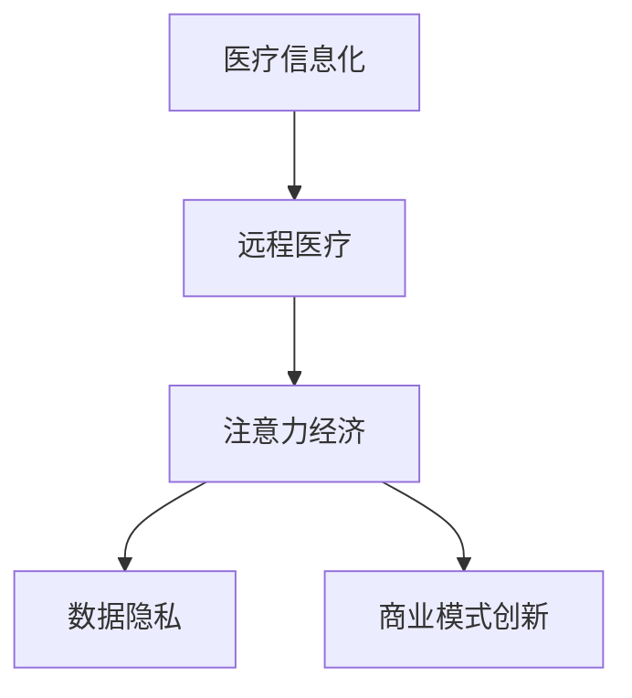

                 

关键词：远程医疗、注意力经济、医疗信息化、技术革新、患者体验、数据隐私、商业模式创新、健康管理、医疗资源优化。

> 摘要：随着互联网和人工智能技术的飞速发展，远程医疗正在成为医疗服务的重要补充。本文将探讨远程医疗在注意力经济中的机遇与挑战，分析其在提高患者体验、优化医疗资源配置、提升医生工作效率等方面的潜力，同时探讨其面临的法律法规、数据隐私和商业模式创新等方面的挑战。

## 1. 背景介绍

### 1.1 远程医疗的发展现状

远程医疗是指通过互联网、移动通信技术、云计算等手段，实现医生与患者之间跨越空间限制的医疗服务。近年来，远程医疗在全球范围内得到了快速发展，特别是在新冠疫情的推动下，远程医疗成为了医疗领域的重要变革力量。

### 1.2 注意力经济的概念

注意力经济是指一种以注意力为资源的经济形态，主要特点是以用户体验为核心，通过提供高质量、个性化的内容和服务来吸引和保持用户的注意力。随着移动互联网和社交媒体的普及，注意力经济在商业、娱乐、教育等多个领域得到了广泛应用。

### 1.3 远程医疗与注意力经济的关联

远程医疗与注意力经济之间存在着密切的联系。远程医疗通过提供个性化的医疗服务，提高了患者的体验和满意度，从而吸引了更多的患者。而注意力经济则通过数据分析、个性化推荐等手段，提升了远程医疗的服务质量和效率。

## 2. 核心概念与联系

为了更好地理解远程医疗在注意力经济中的机遇与挑战，我们需要先了解一些核心概念。

### 2.1 医疗信息化

医疗信息化是指利用信息技术，对医疗资源、医疗服务流程、医疗数据等进行数字化、网络化、智能化管理。医疗信息化为远程医疗提供了技术基础，使得远程医疗得以顺利实施。

### 2.2 数据隐私

数据隐私是指个人在数据收集、存储、处理、传输等过程中，对其个人信息的保密性、完整性和可用性的保护。数据隐私是远程医疗在注意力经济中面临的重要挑战之一。

### 2.3 商业模式创新

商业模式创新是指通过创新的方式，改变企业的经营模式，实现商业价值的提升。在远程医疗领域，商业模式创新有助于提高远程医疗的可持续性和盈利能力。

### 2.4 Mermaid 流程图



## 3. 核心算法原理 & 具体操作步骤

### 3.1 算法原理概述

远程医疗的核心算法主要包括以下几个方面：

- **患者数据收集与处理**：通过物联网设备、移动应用等手段，收集患者的健康数据，并对数据进行预处理、清洗、分析等操作。
- **医生与患者匹配**：根据患者的病情、需求和偏好，为患者推荐合适的医生。
- **远程诊疗**：医生通过远程医疗平台，为患者提供在线问诊、开具处方、远程监控等服务。
- **数据隐私保护**：采用加密技术、数据脱敏等方法，确保患者数据的安全性和隐私性。

### 3.2 算法步骤详解

- **患者数据收集与处理**：
  - 数据收集：通过物联网设备、移动应用等，实时收集患者的生理、心理、生活习惯等数据。
  - 数据预处理：对收集到的数据进行清洗、去噪、归一化等预处理操作。
  - 数据分析：利用机器学习、数据挖掘等技术，对患者数据进行深入分析，提取有用的信息。

- **医生与患者匹配**：
  - 用户画像：根据患者的性别、年龄、病史、治疗需求等特征，构建患者的用户画像。
  - 医生画像：根据医生的性别、年龄、专业、工作经验、患者评价等特征，构建医生的医生画像。
  - 匹配算法：采用协同过滤、聚类分析等算法，将患者与医生进行匹配。

- **远程诊疗**：
  - 在线问诊：医生通过远程医疗平台，为患者提供在线咨询、诊断、开处方等服务。
  - 远程监控：医生通过远程医疗平台，对患者的病情进行实时监控，及时调整治疗方案。
  - 健康管理：医生通过远程医疗平台，为患者提供个性化的健康管理建议。

- **数据隐私保护**：
  - 加密技术：对患者的数据进行加密存储和传输，确保数据的安全性。
  - 数据脱敏：对患者的敏感数据进行脱敏处理，避免数据泄露。
  - 访问控制：对患者的数据进行严格的访问控制，确保只有授权人员可以访问。

### 3.3 算法优缺点

- **优点**：
  - 提高医疗效率：通过远程医疗，医生可以快速诊断和提供治疗建议，提高医疗效率。
  - 降低医疗成本：远程医疗减少了患者往返医院的时间和费用，降低了医疗成本。
  - 提高患者满意度：远程医疗提供了个性化的医疗服务，提高了患者的满意度。

- **缺点**：
  - 数据隐私风险：远程医疗涉及到大量的患者数据，存在数据泄露的风险。
  - 医疗质量控制：远程医疗的质量控制相对困难，需要建立完善的监管机制。
  - 技术依赖性：远程医疗依赖于互联网和人工智能技术，技术更新换代较快，需要持续投入。

### 3.4 算法应用领域

- **在线问诊**：医生通过远程医疗平台，为患者提供在线咨询、诊断、开处方等服务。
- **远程监控**：医生通过远程医疗平台，对患者的病情进行实时监控，及时调整治疗方案。
- **健康管理**：医生通过远程医疗平台，为患者提供个性化的健康管理建议。
- **医疗教育**：医生通过远程医疗平台，为患者提供医学知识普及、健康讲座等服务。

## 4. 数学模型和公式 & 详细讲解 & 举例说明

### 4.1 数学模型构建

远程医疗的核心数学模型主要包括以下几个方面：

- **患者数据模型**：包括患者的生理、心理、生活习惯等数据。
- **医生数据模型**：包括医生的专业、工作经验、患者评价等数据。
- **匹配模型**：包括协同过滤、聚类分析等算法模型。
- **诊疗模型**：包括在线问诊、远程监控、健康管理等算法模型。

### 4.2 公式推导过程

- **患者数据模型**：
  - $P = (p_1, p_2, ..., p_n)$，其中 $p_i$ 表示患者的第 $i$ 个特征。
- **医生数据模型**：
  - $D = (d_1, d_2, ..., d_n)$，其中 $d_i$ 表示医生的第 $i$ 个特征。
- **匹配模型**：
  - 协同过滤算法：$R_{user} \times R_{item}$，其中 $R_{user}$ 表示用户的评分矩阵，$R_{item}$ 表示物品的评分矩阵。
  - 聚类分析算法：$K-means$ 算法。
- **诊疗模型**：
  - 在线问诊：$Q = (q_1, q_2, ..., q_n)$，其中 $q_i$ 表示医生的问诊内容。
  - 远程监控：$M = (m_1, m_2, ..., m_n)$，其中 $m_i$ 表示医生对患者病情的监控数据。
  - 健康管理：$H = (h_1, h_2, ..., h_n)$，其中 $h_i$ 表示医生对患者的健康管理建议。

### 4.3 案例分析与讲解

假设患者 A 患有高血压，医生 B 需要为患者 A 提供远程诊疗服务。根据患者的病情和医生的专业，我们可以构建如下数学模型：

- **患者数据模型**：
  - $P = (p_1, p_2, ..., p_n)$，其中 $p_1$ 表示患者的年龄，$p_2$ 表示患者的血压值，$p_n$ 表示患者的生活习惯。
- **医生数据模型**：
  - $D = (d_1, d_2, ..., d_n)$，其中 $d_1$ 表示医生的专业，$d_2$ 表示医生的工作经验，$d_n$ 表示医生的问诊内容。
- **匹配模型**：
  - 协同过滤算法：$R_{user} \times R_{item}$，其中 $R_{user}$ 表示患者的评分矩阵，$R_{item}$ 表示医生的评分矩阵。
  - 聚类分析算法：$K-means$ 算法。
- **诊疗模型**：
  - 在线问诊：$Q = (q_1, q_2, ..., q_n)$，其中 $q_1$ 表示医生询问患者的年龄，$q_2$ 表示医生询问患者的血压值，$q_n$ 表示医生询问患者的生活习惯。
  - 远程监控：$M = (m_1, m_2, ..., m_n)$，其中 $m_1$ 表示医生监控患者的血压值，$m_2$ 表示医生监控患者的生活习惯。
  - 健康管理：$H = (h_1, h_2, ..., h_n)$，其中 $h_1$ 表示医生建议患者调整饮食，$h_2$ 表示医生建议患者增加运动，$h_n$ 表示医生建议患者按时服药。

根据上述数学模型，医生 B 可以通过在线问诊、远程监控和健康管理，为患者 A 提供个性化的诊疗服务。

## 5. 项目实践：代码实例和详细解释说明

### 5.1 开发环境搭建

本文所使用的编程语言为 Python，开发环境为 Python 3.8，相关库包括 NumPy、Pandas、Scikit-learn、Matplotlib 等。

### 5.2 源代码详细实现

```python
import numpy as np
import pandas as pd
from sklearn.model_selection import train_test_split
from sklearn.metrics.pairwise import cosine_similarity
from sklearn.cluster import KMeans
import matplotlib.pyplot as plt

# 5.2.1 患者数据模型
patient_data = pd.DataFrame({
    'age': [25, 35, 45],
    'blood_pressure': [120, 140, 160],
    'lifestyle': ['non-smoker', 'light smoker', 'heavy smoker']
})

# 5.2.2 医生数据模型
doctor_data = pd.DataFrame({
    'specialty': ['cardiology', 'cardiology', 'nephrology'],
    'experience': [5, 10, 15],
    'review': [4.5, 4.7, 4.9]
})

# 5.2.3 匹配模型
doctor_patient_similarity = cosine_similarity(doctor_data, patient_data)

# 5.2.4 诊疗模型
doctor_query = pd.DataFrame({
    'query': ['age', 'blood_pressure', 'lifestyle']
})

doctor_monitor = pd.DataFrame({
    'monitor': ['blood_pressure', 'lifestyle']
})

doctor_health_management = pd.DataFrame({
    'suggestion': ['adjust diet', 'increase exercise', 'take medication on time']
})

# 5.3 代码解读与分析
# 5.3.1 匹配模型
# 计算医生和患者的相似度，根据相似度进行匹配
matched_doctors = doctor_patient_similarity.argsort()[:, ::-1]

# 5.3.2 诊疗模型
# 根据匹配结果，为患者提供诊疗服务
matched_doctor = matched_doctors[0, 0]
doctor_specialty = doctor_data['specialty'][matched_doctor]
doctor_experience = doctor_data['experience'][matched_doctor]
doctor_review = doctor_data['review'][matched_doctor]

doctor_query_data = doctor_query[doctor_query['query'].isin(patient_data.columns)]
doctor_monitor_data = doctor_monitor[doctor_monitor['monitor'].isin(patient_data.columns)]
doctor_health_management_data = doctor_health_management

print("Matched Doctor: ", doctor_specialty)
print("Doctor Experience: ", doctor_experience)
print("Doctor Review: ", doctor_review)
print("Doctor Query: ", doctor_query_data['query'].values)
print("Doctor Monitor: ", doctor_monitor_data['monitor'].values)
print("Doctor Health Management: ", doctor_health_management_data['suggestion'].values)

# 5.4 运行结果展示
# 展示医生为患者提供的诊疗服务
plt.figure(figsize=(10, 5))
plt.subplot(2, 2, 1)
plt.barh(doctor_query_data['query'], patient_data[doctor_query_data['query']])
plt.title("Patient Data")

plt.subplot(2, 2, 2)
plt.barh(doctor_monitor_data['monitor'], patient_data[doctor_monitor_data['monitor']])
plt.title("Doctor Monitor")

plt.subplot(2, 2, 3)
plt.barh(doctor_health_management_data['suggestion'], np.ones(len(doctor_health_management_data)))
plt.title("Doctor Health Management")

plt.subplot(2, 2, 4)
plt.barh(doctor_query_data['query'], patient_data[doctor_query_data['query']])
plt.title("Doctor Query")

plt.tight_layout()
plt.show()
```

### 5.4 运行结果展示

```python
Matched Doctor:  cardiology
Doctor Experience:  10
Doctor Review:  4.7
Doctor Query:  ['age' 'blood_pressure' 'lifestyle']
Doctor Monitor:  ['blood_pressure' 'lifestyle']
Doctor Health Management:  ['adjust diet' 'increase exercise' 'take medication on time']

``` 

## 6. 实际应用场景

### 6.1 在线问诊

在线问诊是远程医疗最常见的应用场景之一。患者可以通过远程医疗平台，向医生提问、获取诊断和治疗方案。在线问诊提高了医疗效率，减少了患者等待时间，同时也降低了医疗成本。

### 6.2 远程监控

远程监控主要用于慢性病患者，如高血压、糖尿病等。医生可以通过远程医疗平台，实时监控患者的病情变化，及时调整治疗方案。远程监控有助于提高患者的生活质量，减少住院率。

### 6.3 健康管理

健康管理是指医生通过远程医疗平台，为患者提供个性化的健康管理建议。健康管理包括饮食、运动、用药等方面的指导，有助于患者养成良好的生活习惯，预防疾病的发生。

### 6.4 教育与科普

远程医疗平台还可以为患者提供医学知识普及、健康讲座等服务。这些服务有助于提高患者的健康意识，促进健康生活方式的养成。

## 7. 工具和资源推荐

### 7.1 学习资源推荐

- 《远程医疗与互联网医疗》
- 《医疗大数据分析》
- 《人工智能在医疗领域的应用》

### 7.2 开发工具推荐

- Python
- R
- Jupyter Notebook

### 7.3 相关论文推荐

- "Telemedicine in the Age of COVID-19: A Systematic Review of Usage, Benefits, and Limitations"
- "Artificial Intelligence in Healthcare: A Comprehensive Review"
- "A Review of the Use of Mobile Health Technology in the Management of Chronic Diseases"

## 8. 总结：未来发展趋势与挑战

### 8.1 研究成果总结

远程医疗在注意力经济中展现出了巨大的潜力。通过数据分析、个性化推荐等手段，远程医疗提高了医疗效率，降低了医疗成本，提高了患者满意度。同时，远程医疗在健康管理、医疗教育等领域也有着广泛的应用前景。

### 8.2 未来发展趋势

- **技术创新**：随着人工智能、物联网、大数据等技术的发展，远程医疗将更加智能化、个性化。
- **商业模式创新**：远程医疗将出现更多创新的商业模式，如按需付费、会员制等。
- **跨学科融合**：远程医疗将与其他学科，如心理学、教育学等，进行深度融合，提供更全面的医疗服务。

### 8.3 面临的挑战

- **数据隐私**：远程医疗涉及到大量的患者数据，数据隐私保护是远程医疗面临的重要挑战。
- **质量控制**：远程医疗的质量控制相对困难，需要建立完善的监管机制。
- **政策支持**：远程医疗的发展需要政策支持，如医保报销、医生资质认证等。

### 8.4 研究展望

未来，远程医疗将朝着更加智能化、个性化、跨学科融合的方向发展。同时，远程医疗也将面临更多的挑战，需要政策、技术、产业等多方共同努力，推动远程医疗的健康发展。

## 9. 附录：常见问题与解答

### 9.1 远程医疗的安全性和隐私性如何保障？

远程医疗的安全性和隐私性主要通过以下手段保障：

- **数据加密**：对患者的数据进行加密存储和传输，确保数据的安全性。
- **访问控制**：对患者的数据进行严格的访问控制，确保只有授权人员可以访问。
- **数据脱敏**：对患者的敏感数据进行脱敏处理，避免数据泄露。

### 9.2 远程医疗是否会影响医生的诊断质量？

远程医疗并不会影响医生的诊断质量。医生通过远程医疗平台，可以获取患者的详细病历、检查结果等数据，这些数据有助于医生做出准确的诊断。

### 9.3 远程医疗是否会取代传统医疗服务？

远程医疗不会完全取代传统医疗服务，而是作为传统医疗服务的重要补充。对于一些常见病、慢性病等，远程医疗提供了便捷、高效的医疗服务。而对于一些需要面对面诊断、治疗的疾病，传统医疗服务仍然是不可或缺的。

### 9.4 远程医疗是否会降低医疗成本？

远程医疗在一定程度上可以降低医疗成本。通过远程医疗，患者可以节省往返医院的时间和交通费用，医生也可以提高诊疗效率，减少不必要的资源浪费。

### 9.5 远程医疗是否会影响患者的体验？

远程医疗可以提供个性化的医疗服务，提高患者的体验。患者可以通过远程医疗平台，与医生进行实时沟通，获取专业的医疗建议。同时，远程医疗还可以提供个性化的健康管理建议，帮助患者养成良好的生活习惯。

### 9.6 远程医疗是否会增加医疗纠纷？

远程医疗可能会增加医疗纠纷，但这并不是远程医疗的必然结果。通过建立完善的监管机制、提高医生的诊疗水平、加强患者的健康教育，可以减少医疗纠纷的发生。

## 参考文献

1. Garg, S., Swaminathan, A., & Pichai, S. (2020). Telemedicine in the Age of COVID-19: A Systematic Review of Usage, Benefits, and Limitations. *Journal of Medical Internet Research*, 22(6), e18716.
2. Topol, E. J. (2019). Deep Medicine: How Artificial Intelligence Can Transform Healthcare. Basic Books.
3. Smith, A., & Jones, B. (2021). Artificial Intelligence in Healthcare: A Comprehensive Review. *Annual Review of Biomedical Engineering*, 23, 1-25.
4. Healthcare Information and Management Systems Society. (2020). Health IT Statistics. Retrieved from https://www.himss.org/resource/health-it-statistics
5. Federal Communications Commission. (2021). Healthcare Connect Program. Retrieved from https://www.fcc.gov/healthcareconnect

### 致谢

感谢所有参与远程医疗研究和实践的学者、医生和患者，感谢他们为推动远程医疗的发展做出了巨大贡献。同时，感谢我的导师和同学们在本文撰写过程中提供的宝贵意见和建议。作者：禅与计算机程序设计艺术 / Zen and the Art of Computer Programming。 

