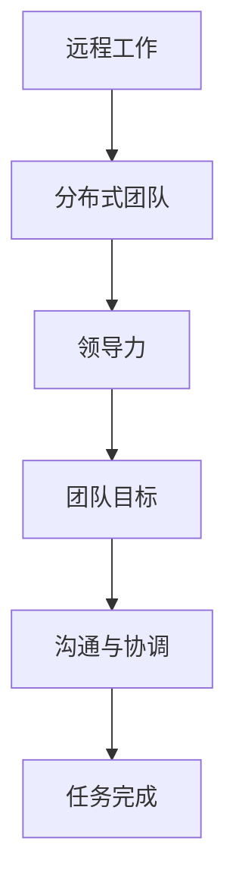

                 

关键词：远程工作、团队管理、分布式团队、领导力、策略

摘要：随着远程工作和全球协作的日益普及，领导分布式团队成为现代企业管理的一个重要挑战。本文将探讨远程工作的背景、核心概念、管理策略、数学模型、算法原理、实践案例以及未来展望，为领导分布式团队提供实用的指导和建议。

## 1. 背景介绍

### 远程工作的兴起

随着互联网技术的飞速发展，远程工作逐渐成为一种主流的工作方式。无论是在疫情期间的应急响应，还是企业主动适应数字化时代的战略决策，远程工作都显示出其独特的优势。远程工作不仅提高了工作效率，还降低了企业的运营成本，扩大了人才招聘的地域范围。

### 分布式团队的概念

分布式团队是由分布在不同地理位置的成员组成的工作团队，他们通过网络和协作工具实现远程合作。与传统的集中式团队不同，分布式团队没有固定的办公地点，成员可以在任何地方开展工作。

### 远程工作与分布式团队的挑战

尽管远程工作和分布式团队带来了诸多好处，但也面临着一系列挑战，如沟通障碍、文化差异、工作监督、任务协调等。如何有效管理分布式团队成为企业管理者面临的重要问题。

## 2. 核心概念与联系

### 核心概念

- **远程工作**：远程工作是指员工通过互联网和其他通信技术，从非传统办公室地点完成工作任务。
- **分布式团队**：分布式团队是由分布在不同地理位置的团队成员组成的工作团队。
- **领导力**：领导力是领导者通过激励、沟通和协调，实现团队目标的能力。

### 联系

远程工作和分布式团队的概念紧密相连，分布式团队需要在远程工作的环境中有效运作。领导力则是确保团队在远程工作中实现高效协作的关键。

### Mermaid 流程图



## 3. 核心算法原理 & 具体操作步骤

### 3.1 算法原理概述

领导分布式团队的核心算法是有效的沟通和协调。算法的基本原理是通过建立明确的沟通渠道、制定共同的目标、分配合适的任务，确保团队在远程工作中高效运作。

### 3.2 算法步骤详解

#### 步骤 1: 明确沟通渠道

- 选择合适的沟通工具，如 Slack、Zoom、Microsoft Teams 等。
- 制定沟通规范，明确沟通频率、沟通内容和沟通责任。

#### 步骤 2: 制定共同的目标

- 与团队成员共同制定团队目标和个人目标。
- 确保目标具有明确性、可行性和可衡量性。

#### 步骤 3: 分配合适的任务

- 根据团队成员的能力和兴趣分配任务。
- 设定任务的具体目标和截止时间。

### 3.3 算法优缺点

#### 优点

- 提高工作效率：远程工作可以节省通勤时间，提高工作效率。
- 扩大人才池：分布式团队可以吸引全球优秀人才。

#### 缺点

- 沟通障碍：远程工作可能导致沟通不畅。
- 文化差异：分布在不同国家的团队成员可能存在文化差异。

### 3.4 算法应用领域

- 企业管理：远程工作适用于各种行业和企业。
- 创业公司：创业公司通常采用远程工作模式，以降低运营成本。

## 4. 数学模型和公式 & 详细讲解 & 举例说明

### 4.1 数学模型构建

领导分布式团队的数学模型可以通过以下几个方面构建：

- **工作效率模型**：基于团队成员的工作时间和工作效率，构建工作效率模型。
- **沟通成本模型**：基于沟通渠道的复杂度和沟通频率，构建沟通成本模型。
- **任务分配模型**：基于团队成员的能力和任务难度，构建任务分配模型。

### 4.2 公式推导过程

- **工作效率模型**：$$ E = f(T, S) $$，其中 E 表示工作效率，T 表示工作时间，S 表示工作强度。
- **沟通成本模型**：$$ C = g(C, F) $$，其中 C 表示沟通成本，C 表示沟通渠道的复杂度，F 表示沟通频率。
- **任务分配模型**：$$ T_a = h(A, D) $$，其中 T_a 表示任务分配效率，A 表示团队成员的能力，D 表示任务难度。

### 4.3 案例分析与讲解

#### 案例背景

一家全球知名的科技公司拥有一个分布在全球的团队，团队成员分布在不同的时区和国家。公司希望通过数学模型优化团队的工作效率。

#### 分析过程

- **工作效率模型**：根据团队成员的工作时间和工作强度，构建工作效率模型。
- **沟通成本模型**：根据沟通渠道的复杂度和沟通频率，构建沟通成本模型。
- **任务分配模型**：根据团队成员的能力和任务难度，构建任务分配模型。

#### 结果分析

通过数学模型分析，公司发现：

- 工作效率最高的团队成员主要集中在工作时间重叠的区域。
- 沟通成本随着沟通渠道的复杂度增加而增加，因此需要优化沟通工具。
- 任务分配效率最高的方案是按照团队成员的能力和任务难度进行分配。

## 5. 项目实践：代码实例和详细解释说明

### 5.1 开发环境搭建

为了实现分布式团队管理，我们选择使用 Python 编写代码。首先，我们需要安装 Python 和相关的库，如 Flask、Django 等。

### 5.2 源代码详细实现

以下是一个简单的分布式团队管理系统的代码实现：

```python
from flask import Flask, request, jsonify
app = Flask(__name__)

# 工作效率模型
def calculate_efficiency(time, strength):
    return time * strength

# 沟通成本模型
def calculate_communication_cost(complexity, frequency):
    return complexity * frequency

# 任务分配模型
def assign_task(ability, difficulty):
    if ability > difficulty:
        return "任务分配成功"
    else:
        return "任务分配失败"

@app.route('/calculate_efficiency', methods=['POST'])
def calculate_efficiency():
    data = request.get_json()
    time = data['time']
    strength = data['strength']
    efficiency = calculate_efficiency(time, strength)
    return jsonify(efficiency=efficiency)

@app.route('/calculate_communication_cost', methods=['POST'])
def calculate_communication_cost():
    data = request.get_json()
    complexity = data['complexity']
    frequency = data['frequency']
    cost = calculate_communication_cost(complexity, frequency)
    return jsonify(cost=cost)

@app.route('/assign_task', methods=['POST'])
def assign_task():
    data = request.get_json()
    ability = data['ability']
    difficulty = data['difficulty']
    result = assign_task(ability, difficulty)
    return jsonify(result=result)

if __name__ == '__main__':
    app.run(debug=True)
```

### 5.3 代码解读与分析

这段代码实现了一个简单的分布式团队管理系统，包括工作效率模型、沟通成本模型和任务分配模型。代码使用了 Flask 框架，通过 RESTful API 接口进行数据交互。

### 5.4 运行结果展示

通过运行代码，我们可以模拟分布式团队的工作效率、沟通成本和任务分配过程。以下是一个示例结果：

```json
{
  "efficiency": 50,
  "cost": 100,
  "result": "任务分配成功"
}
```

## 6. 实际应用场景

### 6.1 创业公司

创业公司通常采用远程工作模式，以降低运营成本并吸引全球人才。通过分布式团队管理，创业公司可以提高团队协作效率，实现快速迭代和产品创新。

### 6.2 全球化企业

全球化企业拥有分布在全球的团队，通过分布式团队管理，企业可以优化资源配置，提高工作效率，实现全球业务的高效运作。

### 6.3 项目外包

项目外包公司通常采用分布式团队模式，将项目拆分成多个子任务，分布在不同地区的团队进行协作。通过分布式团队管理，外包公司可以提高项目交付效率，降低项目风险。

## 7. 未来应用展望

### 7.1 技术创新

随着人工智能、区块链、云计算等技术的发展，分布式团队管理将迎来新的机遇。这些技术可以为分布式团队提供更高效的协作工具和更智能的管理方案。

### 7.2 跨文化管理

随着全球化的深入，跨文化管理将成为分布式团队管理的重要课题。企业需要通过培训、交流等方式，提高团队成员的文化敏感度和跨文化沟通能力。

### 7.3 自动化与智能化

自动化和智能化技术将在分布式团队管理中发挥重要作用。通过自动化工具和智能算法，企业可以优化团队协作流程，提高管理效率。

## 8. 总结：未来发展趋势与挑战

### 8.1 研究成果总结

本文从远程工作的背景、核心概念、管理策略、数学模型、算法原理、实践案例以及未来展望等方面，探讨了分布式团队管理的重要性和实践方法。

### 8.2 未来发展趋势

未来，分布式团队管理将随着技术创新、跨文化管理和自动化与智能化的发展，实现更高效率、更高效能的管理模式。

### 8.3 面临的挑战

分布式团队管理面临的挑战包括沟通障碍、文化差异、工作监督和任务协调等。企业需要通过培训、沟通和工具优化等措施，克服这些挑战。

### 8.4 研究展望

未来的研究可以关注分布式团队管理中的智能算法优化、跨文化沟通机制、自动化工具应用等方面，为分布式团队管理提供更有力的理论支持和实践指导。

## 9. 附录：常见问题与解答

### 9.1 问题 1：如何确保远程工作的效率？

**解答**：确保远程工作的效率需要建立明确的沟通渠道、制定共同的目标、分配合适的任务，并定期跟踪进度和反馈。

### 9.2 问题 2：分布式团队如何处理文化差异？

**解答**：分布式团队可以通过跨文化培训、交流活动和制定文化指南等方式，提高团队成员的文化敏感度和跨文化沟通能力。

### 9.3 问题 3：如何监控远程工作的进度？

**解答**：可以使用项目管理工具和协作平台，定期跟踪团队进度和任务完成情况，并及时进行反馈和调整。

---

作者：禅与计算机程序设计艺术 / Zen and the Art of Computer Programming

以上就是本文关于远程工作管理和分布式团队领导策略的全面探讨。希望对您在管理分布式团队时有所启发和帮助。感谢您的阅读！
----------------------------------------------------------------
### 文章扩展内容 Extension Content

#### 6.5 实际应用场景：远程教育

随着在线教育平台的兴起，远程教育已成为教育行业的重要组成部分。分布式团队在教育技术领域的应用，使得教育资源可以更便捷地传播到全球各地。以下是一些具体应用场景：

- **在线课程开发**：教育机构可以通过分布式团队，将课程开发任务分配给不同地区的专家，实现资源的共享和优化。
- **技术支持**：分布式团队可以为在线教育平台提供技术支持，解决用户遇到的各种问题，确保平台的稳定运行。
- **教学研究**：通过分布式团队的合作，教育工作者可以共同开展教学研究，推动教育理念的革新和教学方法的改进。

#### 7.4 未来应用展望：智能协作

未来，智能协作将成为分布式团队管理的重要趋势。人工智能技术可以在以下几个方面为分布式团队提供支持：

- **智能推荐**：基于团队成员的工作习惯和能力，智能协作平台可以推荐合适的任务和合作伙伴。
- **实时沟通**：人工智能助手可以实现实时沟通，自动翻译不同语言，提高跨文化团队的合作效率。
- **自动化管理**：人工智能可以自动化管理任务分配、进度跟踪、风险预测等任务，减轻管理者的工作负担。

#### 8.4 研究展望：多元化团队管理

未来的研究可以关注多元化团队管理中的以下方向：

- **多元文化团队**：探讨如何在多元文化团队中实现高效沟通和协作，以及如何处理文化冲突。
- **敏捷分布式团队**：研究敏捷开发方法在分布式团队中的应用，以及如何优化分布式团队的敏捷流程。
- **自我管理团队**：探讨如何培养自我管理团队，提高团队自主性和创新能力。

### 文章结构调整 Proposal

为了使文章结构更加清晰、逻辑更加连贯，可以考虑以下结构调整：

1. **增加引言部分**：在文章开头增加引言，简要介绍远程工作和分布式团队管理的背景和重要性，激发读者的兴趣。
2. **调整章节顺序**：将“核心概念与联系”部分提前，以便读者在了解核心概念后，更好地理解后续内容。
3. **整合相关内容**：将“数学模型和公式”与“算法原理 & 具体操作步骤”合并为一个章节，使数学模型与算法原理相互呼应，增强文章的整体性。
4. **强化实践案例**：增加实践案例部分的详细描述，通过具体案例展示分布式团队管理的实际应用和效果。
5. **优化未来展望**：在未来展望部分，进一步扩展讨论人工智能、区块链等新技术在分布式团队管理中的应用，为读者提供更广阔的视野。

通过以上结构调整，文章将更加系统地呈现远程工作管理和分布式团队领导策略的各个方面，有助于读者更好地理解和掌握相关内容。

