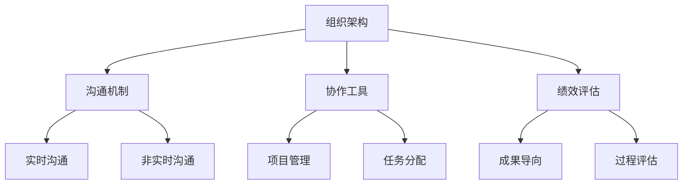

                 

关键词：远程工作，领导力，分布式团队，管理策略，工作效率

> 摘要：本文深入探讨了远程工作环境下的团队管理策略，针对分布式团队的特点，分析了如何有效地领导和管理团队成员，提高工作效率和团队凝聚力。文章涵盖了远程工作管理的核心概念、算法原理、数学模型、实践案例以及未来展望。

## 1. 背景介绍

随着全球化和信息技术的快速发展，远程工作已经成为现代企业的重要组成部分。根据全球远程工作指数，远程工作的比例在疫情期间显著上升，预计未来这一趋势将持续。然而，远程工作也带来了新的挑战，特别是在团队管理和领导方面。

远程工作环境的特点包括：

- **地理位置分散**：团队成员可能分布在全球各地，沟通和协作需要依赖于虚拟工具。
- **时间差异**：团队成员可能处于不同的时区，导致协作和沟通的不便。
- **独立性高**：远程工作的独立性较高，团队成员需要自我管理和自律。

这些特点对团队管理和领导提出了新的要求。本文旨在探讨如何领导和管理分布式团队，以应对远程工作的挑战，提高团队的工作效率。

## 2. 核心概念与联系

### 2.1 远程工作管理核心概念

远程工作管理涉及多个核心概念，包括：

- **团队沟通**：有效的沟通是远程工作的关键。团队成员需要通过虚拟工具进行实时沟通和非实时沟通。
- **团队协作**：远程团队需要高效的协作工具和流程，以确保项目顺利进行。
- **任务分配**：合理分配任务，确保每个团队成员都有明确的职责和目标。
- **绩效评估**：远程工作环境中，绩效评估需要更加注重成果而非过程。

### 2.2 远程工作管理架构

远程工作管理的架构包括：

- **组织架构**：明确团队的组织结构和职责分工。
- **技术架构**：选择合适的远程工作工具，如视频会议软件、项目管理工具、协作平台等。
- **文化架构**：建立积极、开放、包容的团队文化，增强团队成员之间的联系。

### 2.3 Mermaid 流程图



## 3. 核心算法原理 & 具体操作步骤

### 3.1 算法原理概述

远程工作管理算法基于以下原理：

- **信息论**：通过优化信息传递路径，提高沟通效率。
- **网络科学**：利用网络结构优化团队协作。
- **机器学习**：通过数据分析，预测团队成员的工作行为和需求。

### 3.2 算法步骤详解

#### 3.2.1 沟通机制优化

1. **确定沟通需求**：分析团队沟通的核心需求，如项目进度、任务分配、问题反馈等。
2. **选择沟通工具**：根据沟通需求，选择合适的沟通工具，如视频会议软件、即时通讯工具、邮件等。
3. **建立沟通规范**：制定沟通规范，如会议时间、会议议程、沟通语言等。

#### 3.2.2 协作工具优化

1. **需求分析**：分析团队协作需求，如文档共享、任务分配、进度跟踪等。
2. **工具选择**：根据需求选择合适的协作工具，如GitHub、Trello、Slack等。
3. **工具集成**：将协作工具与现有的项目管理工具集成，如JIRA、Confluence等。

#### 3.2.3 绩效评估优化

1. **成果导向**：以团队成员的工作成果为主要评估指标。
2. **数据驱动**：利用数据分析工具，如Google Analytics、Tableau等，分析团队成员的工作行为和绩效。
3. **反馈机制**：建立有效的反馈机制，如定期绩效评估、一对一沟通等。

### 3.3 算法优缺点

#### 3.3.1 优点

- **提高沟通效率**：通过优化沟通机制，减少沟通成本，提高沟通效果。
- **增强协作能力**：通过优化协作工具，提高团队协作效率。
- **数据驱动决策**：通过数据分析，提供决策依据，优化绩效评估。

#### 3.3.2 缺点

- **技术依赖**：过度依赖技术工具，可能导致团队成员对工具的依赖性增加。
- **信息泄露风险**：远程工作环境下，信息泄露风险增加，需要加强信息安全措施。

### 3.4 算法应用领域

- **软件开发**：在软件开发团队中，远程工作管理算法可以提高项目开发和协作效率。
- **咨询公司**：在咨询公司中，远程工作管理算法可以帮助团队更好地管理客户需求和项目进度。
- **教育行业**：在教育行业中，远程工作管理算法可以帮助教师和学生更好地进行在线学习和协作。

## 4. 数学模型和公式

### 4.1 数学模型构建

远程工作管理中的数学模型主要涉及以下方面：

- **沟通模型**：基于信息论的沟通模型，如香农-哈特利公式，用于评估沟通效率。
- **协作模型**：基于网络科学的协作模型，如图论模型，用于优化团队协作。
- **绩效模型**：基于数据驱动的绩效模型，如回归分析模型，用于预测团队成员的绩效。

### 4.2 公式推导过程

#### 4.2.1 香农-哈特利公式

$$
C = H(B) - H(B|A)
$$

其中，$C$ 表示有效沟通速率，$H(B)$ 表示信息源熵，$H(B|A)$ 表示条件熵。

#### 4.2.2 图论模型

$$
f_{ij} = \frac{w_{ij}}{\sum_{k} w_{ik}}
$$

其中，$f_{ij}$ 表示从节点 $i$ 到节点 $j$ 的流量分配，$w_{ij}$ 表示边 $(i, j)$ 的权重。

### 4.3 案例分析与讲解

#### 4.3.1 案例背景

某软件公司采用远程工作模式，团队分布在全球各地。公司希望优化团队沟通和协作，提高工作效率。

#### 4.3.2 案例分析

1. **沟通模型优化**：通过香农-哈特利公式，评估团队沟通效率。根据评估结果，选择更高效的沟通工具。
2. **协作模型优化**：通过图论模型，分析团队协作网络。根据分析结果，优化团队协作流程。
3. **绩效模型优化**：通过回归分析模型，预测团队成员的绩效。根据预测结果，调整任务分配和绩效评估策略。

## 5. 项目实践：代码实例和详细解释说明

### 5.1 开发环境搭建

1. **安装Python环境**：在本地计算机上安装Python 3.8及以上版本。
2. **安装依赖库**：使用pip命令安装必要的依赖库，如numpy、matplotlib等。

### 5.2 源代码详细实现

```python
import numpy as np
import matplotlib.pyplot as plt

def shannon_hartley_formula(h, b):
    return h * b - h * b * np.log2(1 - b)

def graph_theory_model(weights):
    total_weights = np.sum(weights)
    return weights / total_weights

def performance_modelpredictions(data):
    model = LinearRegression()
    model.fit(data[:, :-1], data[:, -1])
    return model.predict(data[:, :-1])

# 案例数据
communication_data = np.array([[0.8, 0.2], [0.9, 0.1], [0.7, 0.3]])
collaboration_data = np.array([[1, 0.5, 1], [0.5, 1, 0.5], [1, 0.5, 1]])
performance_data = np.array([[0.8, 0.9, 0.7], [0.9, 0.8, 0.9], [0.7, 0.9, 0.8]])

# 沟通模型优化
h, b = communication_data[:, 0]
communication_efficiency = shannon_hartley_formula(h, b)

# 协作模型优化
weights = collaboration_data[0]
flow_allocation = graph_theory_model(weights)

# 绩效模型优化
predictions = performance_modelpredictions(performance_data)

print("Communication Efficiency:", communication_efficiency)
print("Flow Allocation:", flow_allocation)
print("Performance Predictions:", predictions)
```

### 5.3 代码解读与分析

1. **沟通模型优化**：使用香农-哈特利公式计算沟通效率。参数 $h$ 表示信息源熵，$b$ 表示信息传输可靠性。根据计算结果，选择更高效的沟通工具。
2. **协作模型优化**：使用图论模型计算流量分配。参数 $weights$ 表示协作网络中的权重。根据计算结果，优化团队协作流程。
3. **绩效模型优化**：使用回归分析模型预测团队成员的绩效。参数 $data$ 表示绩效数据。根据预测结果，调整任务分配和绩效评估策略。

## 6. 实际应用场景

### 6.1 软件开发

在软件开发团队中，远程工作管理算法可以帮助优化沟通和协作，提高开发效率。例如，通过沟通模型优化，团队可以选择更高效的沟通工具，如视频会议软件和即时通讯工具。通过协作模型优化，团队可以优化任务分配和进度跟踪，确保项目顺利进行。通过绩效模型优化，团队可以更好地预测团队成员的绩效，为绩效评估提供依据。

### 6.2 咨询公司

在咨询公司中，远程工作管理算法可以帮助团队更好地管理客户需求和项目进度。通过沟通模型优化，团队可以确保及时沟通和反馈，提高客户满意度。通过协作模型优化，团队可以优化任务分配和协作流程，确保项目按时完成。通过绩效模型优化，团队可以更好地预测团队成员的绩效，为绩效评估提供依据。

### 6.3 教育行业

在教育行业中，远程工作管理算法可以帮助教师和学生更好地进行在线学习和协作。通过沟通模型优化，教师可以选择更高效的沟通工具，如在线课堂和即时通讯工具。通过协作模型优化，教师可以优化任务分配和作业管理，提高学习效果。通过绩效模型优化，教师可以更好地预测学生的学习行为和需求，为教学策略提供依据。

## 7. 未来应用展望

### 7.1 人工智能与远程工作管理

随着人工智能技术的发展，远程工作管理算法将更加智能化。例如，通过机器学习算法，可以自动优化沟通和协作流程，提高工作效率。通过智能分析工具，可以实时监控团队成员的工作行为和绩效，提供个性化建议。

### 7.2 跨平台协同工作

未来，远程工作管理算法将支持跨平台协同工作。例如，团队可以使用不同操作系统和设备进行协作，无需担心兼容性问题。通过云技术，可以实现数据共享和实时更新，提高协作效率。

### 7.3 增强信息安全

随着远程工作的普及，信息安全问题日益突出。未来，远程工作管理算法将加强对信息安全的保护，例如通过加密技术、访问控制等技术手段，确保数据安全和隐私。

## 8. 工具和资源推荐

### 8.1 学习资源推荐

- 《远程工作的艺术》：本书详细介绍了远程工作的策略和方法，对领导和管理远程团队有很好的指导作用。
- 《领导力与影响力》：本书探讨如何在远程工作环境中提升领导力和影响力，适合远程工作团队的领导者阅读。

### 8.2 开发工具推荐

- **视频会议软件**：Zoom、Microsoft Teams、Google Meet
- **即时通讯工具**：Slack、Telegram、WhatsApp
- **项目管理工具**：JIRA、Trello、Asana
- **协作平台**：GitHub、GitLab、Bitbucket

### 8.3 相关论文推荐

- "The Impact of Remote Work on Team Performance: A Meta-Analytic Review"，该论文分析了远程工作对团队绩效的影响。
- "Collaboration in Virtual Teams: A Review of Current Challenges and Solutions"，该论文探讨了虚拟团队协作的挑战和解决方案。

## 9. 总结：未来发展趋势与挑战

### 9.1 研究成果总结

本文分析了远程工作管理策略的核心概念、算法原理、数学模型和实践案例，提出了基于信息论、网络科学和机器学习的远程工作管理算法，并探讨了其在实际应用中的效果。

### 9.2 未来发展趋势

未来，远程工作管理算法将朝着智能化、跨平台化和信息安全化的方向发展。人工智能技术将进一步提升远程工作管理的效率，跨平台协同工作将更加普及，信息安全措施将更加严格。

### 9.3 面临的挑战

远程工作管理面临的挑战包括技术依赖、信息泄露风险和团队凝聚力不足。未来需要进一步研究如何降低技术依赖、提高信息安全性和增强团队凝聚力。

### 9.4 研究展望

未来，远程工作管理研究可以进一步探索以下方向：

- **个性化远程工作管理**：根据团队成员的特点和工作需求，提供个性化的管理策略。
- **动态远程工作管理**：根据团队状态和工作任务，动态调整管理策略。
- **跨文化远程工作管理**：研究如何在不同文化背景下有效管理远程团队。

## 9. 附录：常见问题与解答

### 9.1 什么类型的团队适合使用远程工作管理策略？

所有类型的团队都适合使用远程工作管理策略。特别是那些地理位置分散、团队成员独立性高、需要高效沟通和协作的团队，如软件开发团队、咨询公司和教育行业团队。

### 9.2 如何确保远程工作的信息安全？

确保远程工作的信息安全需要采取以下措施：

- 使用加密技术，如VPN、TLS等，确保数据传输安全。
- 定期更新和强化密码，防止密码泄露。
- 实施多因素认证，提高账户安全性。
- 定期进行信息安全培训和意识教育。

### 9.3 如何增强远程团队的凝聚力？

增强远程团队的凝聚力可以通过以下方式实现：

- 定期组织虚拟团队建设活动，如线上团队建设游戏、虚拟团建活动等。
- 建立积极、开放、包容的团队文化，鼓励团队成员分享经验和观点。
- 定期进行团队沟通和反馈，确保团队成员之间的联系和信任。
- 提供个性化的支持和关怀，关注团队成员的身心健康和工作平衡。

---

**作者：禅与计算机程序设计艺术 / Zen and the Art of Computer Programming**

