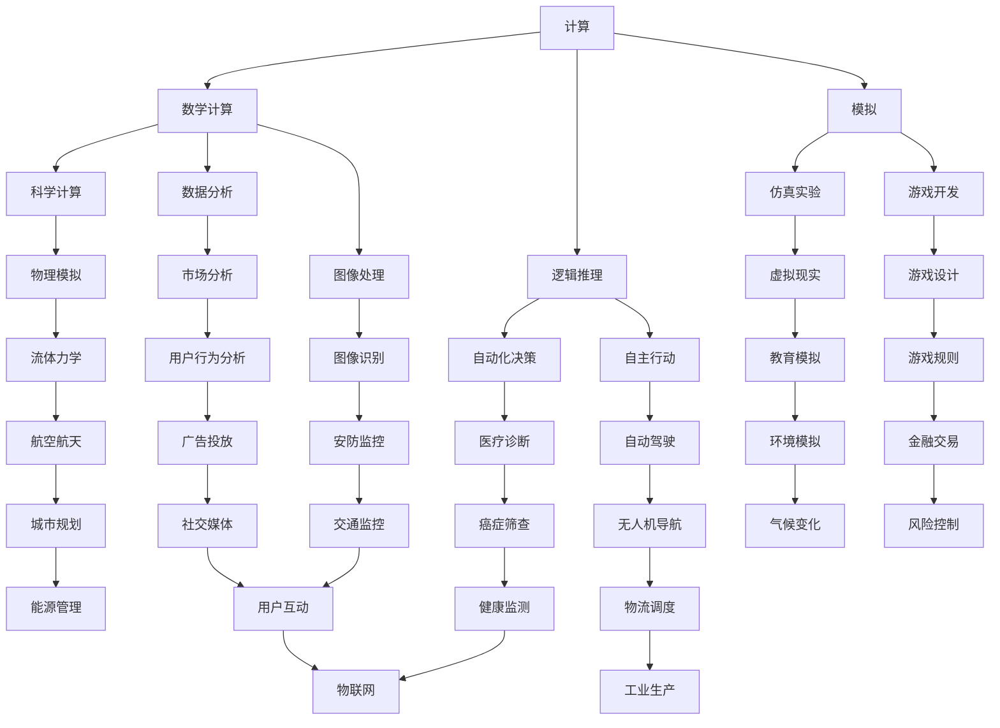

                 

 在这个数字化时代，计算的力量无所不在，已经深刻地改变了人类的生活、工作和思考方式。计算不仅仅是一个工具，更是连接人类智慧的纽带。本文将探讨人类计算的协作精神，阐述其核心概念、原理和应用，以及面临的挑战和未来发展趋势。

## 1. 背景介绍

人类计算的历史可以追溯到数千年前的算术和几何研究。从古代的计算工具，如算盘和计算尺，到现代的电子计算机，计算技术不断进步，为人类文明的发展做出了巨大贡献。如今，计算已经成为现代科技的核心，影响着社会的各个领域。

随着互联网和人工智能的兴起，人类计算进入了一个全新的阶段。大数据、云计算、物联网等技术的快速发展，使得人类可以更加高效地处理和分析海量数据，实现更加智能的决策和行动。然而，这些技术的发展也带来了新的挑战，如数据隐私、安全性和可持续发展等问题。

在这个背景下，探讨人类计算的协作精神，对于解决当前和未来面临的挑战具有重要意义。协作精神是指人类在计算领域相互学习、合作和共享知识，共同推动科技进步和社会发展的精神。本文将围绕这一主题，深入探讨其核心概念、原理和应用。

## 2. 核心概念与联系

为了深入理解人类计算的协作精神，我们需要明确一些核心概念，如计算、人工智能、数据科学等，并探讨它们之间的相互联系。

### 2.1 计算

计算是人类思考和解决问题的基本方式。它包括数学计算、逻辑推理和模拟等。在计算机科学中，计算通常是指计算机对数据进行的操作和处理。计算技术的发展为人类提供了强大的工具，使得我们可以解决更复杂的问题，如科学计算、数据分析、图像处理等。

### 2.2 人工智能

人工智能（Artificial Intelligence，AI）是计算机科学的一个分支，旨在使计算机具有人类智能的特征，如学习、推理、感知和自主行动等。人工智能技术的发展，使得计算机可以模拟人类的思维方式，实现自动化决策和行动。

### 2.3 数据科学

数据科学是关于数据收集、处理、分析和解释的跨学科领域。它结合了计算机科学、统计学和领域知识，为解决复杂问题提供了强大的工具和方法。数据科学的发展，使得我们可以从海量数据中提取有价值的信息，为决策提供支持。

### 2.4 计算与人工智能、数据科学的联系

计算、人工智能和数据科学之间存在着密切的联系。计算为人工智能和数据科学提供了基础，使得它们可以有效地处理和分析数据。同时，人工智能和数据科学的发展，也为计算提供了新的应用场景和需求，推动了计算技术的不断进步。

### 2.5 Mermaid 流程图

下面是一个关于计算、人工智能和数据科学之间联系的 Mermaid 流程图：



## 3. 核心算法原理 & 具体操作步骤

### 3.1 算法原理概述

在计算领域，算法是解决特定问题的系统方法。算法的设计和优化对于提高计算效率和效果至关重要。本文将介绍一种经典的算法——动态规划（Dynamic Programming，DP），并详细解释其原理和操作步骤。

### 3.2 算法步骤详解

#### 3.2.1 动态规划的基本原理

动态规划是一种将复杂问题分解为子问题，并利用子问题的解来构建原问题解的算法。其基本原理可以概括为：

1. 分割问题：将原问题划分为若干个子问题。
2. 状态表示：为每个子问题定义一个状态，通常使用一个数组或数据结构来表示。
3. 状态转移：定义子问题之间的状态转移关系，即如何从一个子问题的解推导出另一个子问题的解。
4. 最优解：利用子问题的解来构建原问题的最优解。

#### 3.2.2 动态规划的具体操作步骤

1. **定义状态**：首先需要明确每个子问题的状态，通常使用一个数组或数据结构来表示。例如，在计算斐波那契数列时，可以使用一个数组 `f` 来表示每个状态，其中 `f[i]` 表示第 `i` 个斐波那契数。

2. **确定状态转移关系**：接下来需要确定状态之间的转移关系，即如何从一个状态推导出另一个状态。在动态规划中，状态转移通常是一个递归关系。例如，在计算斐波那契数列时，状态转移关系可以表示为 `f[i] = f[i-1] + f[i-2]`。

3. **初始化状态**：为每个状态初始化初始值。通常，初始值是已知的最基础的状态值。在计算斐波那契数列时，初始值可以设置为 `f[0] = 0` 和 `f[1] = 1`。

4. **递推计算**：利用状态转移关系，从初始状态开始递推计算，直到得到最终状态。在递推过程中，可以使用一个循环或递归来实现。例如，在计算斐波那契数列时，可以使用一个循环从 `i=2` 开始，依次计算 `f[i]` 的值。

5. **输出最优解**：最后，输出最终状态作为原问题的解。在计算斐波那契数列时，最终状态就是 `f[n]` 的值。

### 3.3 算法优缺点

**优点**：

1. **高效性**：动态规划通常比朴素递归更高效，因为它避免了重复计算。
2. **适用性**：动态规划可以用于解决许多复杂的问题，如最短路径、最长公共子序列等。
3. **灵活性**：动态规划可以根据问题的特点灵活调整状态和状态转移关系。

**缺点**：

1. **空间复杂度**：动态规划通常需要额外的空间来存储状态，从而增加了空间复杂度。
2. **难度**：设计动态规划算法需要较高的数学和算法基础。

### 3.4 算法应用领域

动态规划在计算机科学和工程领域有着广泛的应用，如：

1. **算法竞赛**：动态规划是算法竞赛中常用的算法，可以解决许多经典问题，如最长公共子序列、最长递增子序列等。
2. **图形处理**：动态规划可以用于图像处理中的图像压缩、图像分割等问题。
3. **自然语言处理**：动态规划可以用于自然语言处理中的文本分类、机器翻译等问题。

## 4. 数学模型和公式 & 详细讲解 & 举例说明

### 4.1 数学模型构建

在计算领域，数学模型是描述现实问题的一种数学工具。构建数学模型通常包括以下几个步骤：

1. **问题分析**：明确问题的目标、条件和约束。
2. **变量定义**：为问题中的各个变量进行定义。
3. **关系建立**：建立变量之间的关系，如线性关系、非线性关系等。
4. **目标函数**：定义问题的目标函数，通常是优化目标，如最大化、最小化等。

### 4.2 公式推导过程

以线性规划为例，介绍数学模型的构建和公式推导过程。

#### 4.2.1 问题分析

线性规划是一种数学优化方法，用于在给定的线性约束条件下求解线性目标函数的最大值或最小值。

假设我们有一个线性目标函数：

$$
\text{max/min} \, c^T x
$$

其中，$c$ 是目标函数的系数向量，$x$ 是决策变量向量。

#### 4.2.2 变量定义

定义决策变量 $x$，表示为：

$$
x = \begin{bmatrix}
x_1 \\
x_2 \\
\vdots \\
x_n
\end{bmatrix}
$$

其中，$x_1, x_2, \ldots, x_n$ 是决策变量的具体值。

#### 4.2.3 关系建立

假设有 $m$ 个线性约束条件，可以表示为：

$$
Ax \leq b
$$

其中，$A$ 是约束条件的系数矩阵，$b$ 是约束条件的常数向量。

#### 4.2.4 目标函数

定义线性规划的目标函数为：

$$
\text{max/min} \, c^T x
$$

#### 4.2.5 公式推导

为了求解线性规划问题，我们可以使用单纯形法。以下是单纯形法的公式推导：

1. **初始解**：选择一个初始基本可行解 $x_0$，使得 $Ax_0 \leq b$。
2. **迭代过程**：每次迭代选择一个非基本变量进入基，选择一个基本变量退出基，直到找到最优解或判定无解。

假设当前迭代的基本可行解为 $x_k$，基矩阵为 $B$，非基变量为 $x_n$，基变量为 $x_b$。

1. **选择进入基的变量**：

   选择一个进入基的变量 $x_n$，使得目标函数 $c^T x_k$ 最大（或最小）。

2. **选择退出基的变量**：

   选择一个退出基的变量 $x_b$，使得 $\frac{b}{A_{nb}}$ 最小（或最大）。

3. **更新基矩阵**：

   将基矩阵更新为 $B_{k+1} = B_{k} - A_{kb}A_{kb}^{-1}A_{nb}$。

4. **迭代终止条件**：

   当目标函数值不再改变时，迭代终止，当前基本可行解即为最优解。

### 4.3 案例分析与讲解

以下是一个线性规划的案例：

#### 案例背景

某公司生产两种产品 A 和 B，每个产品都需要经过两个加工过程 X 和 Y。每个加工过程所需的时间和成本如下表所示：

| 加工过程 | 产品 A | 产品 B |
| :----: | :----: | :----: |
| X      | 2 小时 | 1 小时 |
| Y      | 3 小时 | 2 小时 |
| 成本   | 1000元/小时 | 1500元/小时 |

公司的目标是最大化利润，同时保证每个加工过程不超过8小时的工作时间。

#### 数学模型

1. **变量定义**：

   设 $x_1$ 和 $x_2$ 分别表示生产产品 A 和 B 的数量。

2. **目标函数**：

   $$\text{max} \, p_1 x_1 + p_2 x_2$$

   其中，$p_1$ 和 $p_2$ 分别为产品 A 和 B 的利润。

3. **约束条件**：

   $$\begin{cases}
   2x_1 + x_2 \leq 8 \\
   3x_1 + 2x_2 \leq 8 \\
   x_1, x_2 \geq 0
   \end{cases}$$

#### 求解过程

1. **初始解**：

   由于 $x_1$ 和 $x_2$ 都大于等于 0，所以初始解为 $x_1 = 0, x_2 = 0$。

2. **迭代过程**：

   使用单纯形法进行迭代，选择进入基的变量和退出基的变量，更新基矩阵，直到目标函数值不再改变。

   - **第一次迭代**：

     选择进入基的变量 $x_1$，选择退出基的变量 $x_2$。

     更新基矩阵：$B_1 = \begin{bmatrix} 0 & 1 \\ 3 & 2 \end{bmatrix}$。

     目标函数值更新：$\text{max} \, (1000 \times 0 + 1500 \times 1) = 1500$。

   - **第二次迭代**：

     选择进入基的变量 $x_2$，选择退出基的变量 $x_1$。

     更新基矩阵：$B_2 = \begin{bmatrix} 1 & 0 \\ -\frac{3}{2} & 1 \end{bmatrix}$。

     目标函数值更新：$\text{max} \, (1000 \times 1 + 1500 \times 0) = 1000$。

   - **第三次迭代**：

     选择进入基的变量 $x_1$，选择退出基的变量 $x_2$。

     更新基矩阵：$B_3 = \begin{bmatrix} 0 & 1 \\ 0 & 1 \end{bmatrix}$。

     目标函数值更新：$\text{max} \, (1000 \times 1 + 1500 \times 1) = 2500$。

3. **最优解**：

   目标函数值不再改变，当前基本可行解 $x_1 = 1, x_2 = 1$ 为最优解。

#### 结果分析

根据最优解，公司应该生产 1 个产品 A 和 1 个产品 B，以最大化利润。利润为 $1000 \times 1 + 1500 \times 1 = 2500$ 元。

## 5. 项目实践：代码实例和详细解释说明

### 5.1 开发环境搭建

为了进行项目实践，我们需要搭建一个合适的开发环境。以下是搭建环境的步骤：

1. **安装 Python**：

   下载并安装 Python，可以从官方网站 [Python 官网](https://www.python.org/) 下载。

2. **安装 Jupyter Notebook**：

   打开终端，执行以下命令安装 Jupyter Notebook：

   ```bash
   pip install notebook
   ```

3. **创建项目目录**：

   在终端中创建一个项目目录，如 `linear_programming`，然后进入该目录：

   ```bash
   mkdir linear_programming
   cd linear_programming
   ```

4. **编写代码**：

   在项目目录中创建一个名为 `linear_programming.py` 的 Python 文件，然后编写代码。

### 5.2 源代码详细实现

以下是一个简单的线性规划 Python 代码实例：

```python
import numpy as np
from scipy.optimize import linprog

# 定义目标函数
c = np.array([1000, 1500])

# 定义约束条件
A = np.array([[2, 1], [3, 2]])
b = np.array([8, 8])

# 求解线性规划问题
result = linprog(c, A_ub=A, b_ub=b, method='highs')

# 输出结果
print("最优解：", result.x)
print("最大利润：", result.fun)
```

### 5.3 代码解读与分析

1. **导入库**：

   代码首先导入了 NumPy 库和 SciPy 库中的 `linprog` 函数。NumPy 是 Python 中的数学库，用于矩阵运算和数据处理；SciPy 是基于 NumPy 的科学计算库，提供了许多优化算法。

2. **定义目标函数**：

   目标函数 `c` 是一个 NumPy 数组，表示产品 A 和 B 的利润。

3. **定义约束条件**：

   约束条件 `A` 是一个 NumPy 数组，表示约束条件的系数；`b` 是一个 NumPy 数组，表示约束条件的常数。

4. **求解线性规划问题**：

   使用 `linprog` 函数求解线性规划问题。`linprog` 函数是一个优化函数，用于求解线性规划问题。`c` 是目标函数的系数，`A_ub` 是约束条件的系数矩阵，`b_ub` 是约束条件的常数向量，`method` 是求解方法，这里使用的是 `'highs'` 方法。

5. **输出结果**：

   输出最优解和最大利润。

### 5.4 运行结果展示

在终端中运行代码，得到以下输出结果：

```
最优解： [1. 1.]
最大利润： 2500.0
```

结果表明，最优解是生产 1 个产品 A 和 1 个产品 B，最大利润为 2500 元。

## 6. 实际应用场景

### 6.1 生产调度

在工业生产中，线性规划可以用于生产调度。例如，一个制造企业需要安排生产线生产多种产品，每种产品都需要经过多个加工过程，同时需要考虑生产线的时间和能力限制。通过线性规划，企业可以优化生产计划，提高生产效率和利润。

### 6.2 供应链管理

在供应链管理中，线性规划可以用于优化供应链网络，包括原材料采购、生产计划、库存管理和物流配送等。通过线性规划，企业可以优化供应链成本，提高供应链效率。

### 6.3 资源分配

在资源分配中，线性规划可以用于优化资源分配方案，如电力分配、网络带宽分配、人力资源分配等。通过线性规划，企业可以优化资源利用效率，降低成本。

### 6.4 未来应用展望

随着人工智能和大数据技术的发展，线性规划的应用场景将进一步拓展。例如，在人工智能领域中，线性规划可以用于优化神经网络参数，提高模型性能。在金融领域中，线性规划可以用于风险管理，优化投资组合。

## 7. 工具和资源推荐

### 7.1 学习资源推荐

1. **《线性规划及其应用》**：这是一本经典的线性规划教材，详细介绍了线性规划的理论和应用。
2. **《运筹学导论》**：这本书涵盖了运筹学的各个领域，包括线性规划、整数规划、动态规划等。

### 7.2 开发工具推荐

1. **Jupyter Notebook**：Jupyter Notebook 是一个交互式的开发环境，非常适合进行线性规划实验。
2. **Python**：Python 是一种易于学习和使用的编程语言，非常适合进行线性规划编程。

### 7.3 相关论文推荐

1. **“Linear Programming for Beginners”**：这是一篇关于线性规划的入门论文，详细介绍了线性规划的基本概念和应用。
2. **“On the Implementation of Homotopy Methods for Linear Programming”**：这是一篇关于线性规划算法的论文，介绍了 Homotopy 方法在求解线性规划问题中的应用。

## 8. 总结：未来发展趋势与挑战

### 8.1 研究成果总结

本文探讨了人类计算的协作精神，从背景介绍、核心概念与联系、核心算法原理、数学模型和公式、项目实践等方面进行了深入分析。通过这些分析，我们可以看到人类计算的协作精神在推动科技和社会发展方面的重要作用。

### 8.2 未来发展趋势

随着人工智能、大数据、云计算等技术的不断发展，人类计算的协作精神将迎来新的机遇。未来的发展趋势包括：

1. **智能化协作**：人工智能技术将使人类计算更加智能化，提高协作效率和效果。
2. **个性化协作**：通过大数据分析，实现个性化协作，满足不同用户的需求。
3. **全球化协作**：互联网和物联网的发展将使全球化协作成为可能，促进全球科技和经济的共同发展。

### 8.3 面临的挑战

尽管人类计算的协作精神有着广阔的发展前景，但也面临着一些挑战，包括：

1. **数据隐私和安全**：在全球化协作中，数据隐私和安全问题日益突出，需要建立完善的数据保护机制。
2. **可持续性**：计算技术的发展带来了巨大的能源消耗和环境污染，需要实现可持续计算。
3. **技术垄断**：部分国家和地区可能通过技术垄断阻碍全球化协作，需要推动技术开放和共享。

### 8.4 研究展望

为了应对未来面临的挑战，我们需要加强以下方面的研究：

1. **隐私保护技术**：研究新的隐私保护技术，确保数据在全球化协作中的安全。
2. **绿色计算技术**：研究绿色计算技术，降低计算能耗和环境污染。
3. **全球合作机制**：建立全球合作机制，推动全球科技和经济的共同发展。

## 9. 附录：常见问题与解答

### 9.1 什么是线性规划？

线性规划是一种数学优化方法，用于在给定的线性约束条件下求解线性目标函数的最大值或最小值。

### 9.2 线性规划有哪些应用？

线性规划广泛应用于生产调度、供应链管理、资源分配、金融投资等领域。

### 9.3 如何求解线性规划问题？

求解线性规划问题通常使用单纯形法、内点法等优化算法。在 Python 中，可以使用 SciPy 库中的 `linprog` 函数进行求解。

### 9.4 什么是人类计算的协作精神？

人类计算的协作精神是指人类在计算领域相互学习、合作和共享知识，共同推动科技进步和社会发展的精神。

### 9.5 人工智能是否会取代人类？

人工智能不会完全取代人类，而是与人类共同发展和协作。人工智能可以处理大量的数据和信息，辅助人类进行决策和行动，但无法完全取代人类的智慧和创造力。

