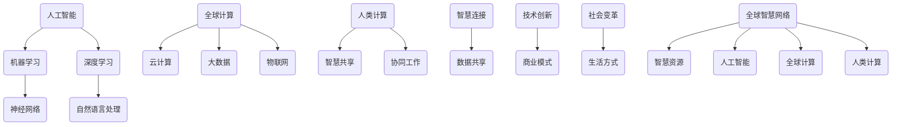

                 

关键词：人工智能，全球计算，智慧连接，技术创新，计算架构，未来展望

> 摘要：本文探讨了人工智能和全球计算的结合，探讨了其在推动人类智慧发展、连接全球智慧网络方面的深远影响。通过分析核心概念、算法原理、数学模型、实际应用及未来展望，揭示了人类计算在构建全球智慧生态系统中的关键作用。

## 1. 背景介绍

随着信息技术的飞速发展，人工智能（AI）已经成为现代科技的标志性领域。人工智能不仅改变了传统行业的面貌，还极大地提升了人类处理数据和信息的能力。与此同时，全球计算的概念也逐渐兴起，通过互联网和分布式计算技术，实现了全球范围内的数据共享和协同计算。

人类计算，作为连接个体、组织、甚至不同国家和地区智慧的关键纽带，正成为全球科技创新的重要驱动力。本文将围绕这一主题，探讨人工智能与全球计算的结合，分析其对全球智慧网络的影响，并展望未来发展趋势。

### 1.1 人工智能的崛起

人工智能是一门交叉学科，它结合计算机科学、数学、统计学、认知科学等多个领域的知识，致力于开发能够模拟、延伸和扩展人类智能的算法和技术。近年来，深度学习、神经网络、自然语言处理等技术的突破，使得人工智能在图像识别、语音识别、决策支持、自动驾驶等领域取得了显著进展。

### 1.2 全球计算的兴起

全球计算是指通过互联网和分布式计算技术，实现全球范围内数据存储、处理、传输和共享的能力。随着云计算、大数据、物联网等技术的普及，全球计算的基础设施不断完善，为全球智慧网络的构建提供了强大的支持。全球计算不仅提升了数据处理效率，还为科学发现、经济预测、社会治理等提供了新的工具和方法。

### 1.3 人类计算的重要性

人类计算不仅仅是指技术层面的创新，更是一种智慧层面的提升。通过人工智能和全球计算的结合，人类能够更好地理解复杂问题，发现新的知识，并实现全球范围内的智慧共享。人类计算在全球智慧网络中的重要性不言而喻，它正在深刻地改变着我们的生活方式和社会形态。

## 2. 核心概念与联系

要深入理解人类计算的全球影响力，首先需要明确几个核心概念，并展示它们之间的联系。

### 2.1 人工智能

人工智能是一种模拟、延伸和扩展人类智能的技术体系。其核心在于机器学习、深度学习等算法的应用，使得计算机系统能够通过数据学习，自主地做出决策和完成任务。人工智能的发展，不仅提升了计算机的处理能力，还带来了新的商业模式和社会变革。

### 2.2 全球计算

全球计算是基于互联网和分布式计算技术，实现全球范围内数据存储、处理和共享的能力。它包括云计算、大数据、物联网等技术，使得数据可以跨越国界和地域的限制，实现实时分析和协同工作。全球计算为人工智能的应用提供了强大的支持，使得智慧网络能够跨越时空，连接全球各地的智慧资源。

### 2.3 人类计算

人类计算是连接个体、组织、甚至不同国家和地区智慧的关键纽带。它不仅仅是技术层面的创新，更是一种智慧层面的提升。通过人工智能和全球计算的结合，人类计算实现了全球范围内的智慧共享和协同工作，推动了全球智慧网络的构建。

### 2.4 核心概念原理与架构

为了更好地展示核心概念之间的联系，我们使用Mermaid流程图来描述人类计算的原理和架构。



通过这个流程图，我们可以清晰地看到人工智能、全球计算和人类计算之间的相互关系，以及它们如何共同构建全球智慧网络。

## 3. 核心算法原理 & 具体操作步骤

### 3.1 算法原理概述

在人工智能和全球计算的背景下，核心算法的设计和实现是至关重要的。以下将介绍几种在人类计算中广泛应用的核心算法原理。

### 3.2 算法步骤详解

#### 3.2.1 机器学习算法

机器学习算法是人工智能的基础，通过训练模型来自动化决策过程。其基本步骤包括：

1. 数据收集：收集相关数据，用于训练模型。
2. 预处理：对数据进行清洗、归一化等处理，确保数据质量。
3. 特征提取：从数据中提取有用特征，用于训练模型。
4. 模型训练：使用训练数据训练模型，优化模型参数。
5. 模型评估：使用验证数据评估模型性能，调整模型参数。
6. 部署应用：将训练好的模型部署到实际应用场景中。

#### 3.2.2 深度学习算法

深度学习算法是机器学习的一种，通过多层神经网络来实现复杂的数据建模。其基本步骤包括：

1. 网络设计：设计神经网络结构，包括输入层、隐藏层和输出层。
2. 模型训练：使用训练数据训练神经网络，优化模型参数。
3. 模型评估：使用验证数据评估模型性能，调整模型参数。
4. 模型优化：通过调整网络结构和参数，提高模型性能。
5. 部署应用：将训练好的模型部署到实际应用场景中。

#### 3.2.3 自然语言处理算法

自然语言处理算法是人工智能中的一个重要分支，用于处理人类语言数据。其基本步骤包括：

1. 文本预处理：对文本进行清洗、分词等处理，提取有用信息。
2. 词向量表示：将文本转换为词向量，用于模型训练。
3. 模型训练：使用训练数据训练模型，优化模型参数。
4. 模型评估：使用验证数据评估模型性能，调整模型参数。
5. 文本分析：使用训练好的模型对文本进行分析，提取有用信息。
6. 部署应用：将训练好的模型部署到实际应用场景中。

### 3.3 算法优缺点

每种算法都有其优缺点，适用于不同的应用场景。以下是对上述算法的优缺点分析：

#### 3.3.1 机器学习算法

优点：
- 自适应性强，能够处理大规模数据。
- 模型可解释性较高。

缺点：
- 对数据质量要求较高，数据预处理复杂。
- 模型训练时间较长。

#### 3.3.2 深度学习算法

优点：
- 模型性能优异，能够处理高维数据。
- 自动化特征提取，降低人类干预。

缺点：
- 模型可解释性较低。
- 训练资源需求较高。

#### 3.3.3 自然语言处理算法

优点：
- 能够处理文本数据，提取有用信息。
- 应用场景广泛，包括文本分类、机器翻译等。

缺点：
- 数据质量要求高，文本预处理复杂。
- 模型训练时间较长。

### 3.4 算法应用领域

核心算法在多个领域都有广泛的应用，以下是一些主要的应用领域：

#### 3.4.1 金融领域

机器学习算法在金融领域应用广泛，包括风险控制、信用评估、市场预测等。通过分析大量金融数据，可以自动化决策过程，提高金融服务的质量和效率。

#### 3.4.2 医疗领域

深度学习算法在医疗领域有巨大的潜力，包括疾病诊断、基因组分析、药物设计等。通过分析医学影像和基因数据，可以提高疾病诊断的准确性和药物研发的效率。

#### 3.4.3 社交领域

自然语言处理算法在社交领域有广泛应用，包括文本分类、情感分析、智能客服等。通过分析用户产生的文本数据，可以提供个性化的服务，提高用户体验。

## 4. 数学模型和公式 & 详细讲解 & 举例说明

### 4.1 数学模型构建

在人工智能和全球计算中，数学模型是核心算法的基础。以下将介绍几种常见的数学模型，并详细讲解其构建过程。

#### 4.1.1 逻辑回归模型

逻辑回归模型是一种常用的分类模型，用于预测二元变量的概率。其数学模型如下：

$$
\begin{aligned}
\hat{y} &= \sigma(\beta_0 + \sum_{i=1}^{n} \beta_i x_i) \\
\sigma(z) &= \frac{1}{1 + e^{-z}}
\end{aligned}
$$

其中，$y$ 是真实标签，$\hat{y}$ 是预测概率，$\sigma$ 是sigmoid函数，$\beta_0$ 和 $\beta_i$ 是模型参数，$x_i$ 是特征值。

#### 4.1.2 神经网络模型

神经网络模型是一种基于多层感知器的模型，用于处理非线性问题。其数学模型如下：

$$
\begin{aligned}
z_l &= \sum_{i=1}^{n} \beta_{li} x_i + b_l \\
a_l &= \sigma(z_l)
\end{aligned}
$$

其中，$z_l$ 是第 $l$ 层的输入，$a_l$ 是第 $l$ 层的输出，$\sigma$ 是激活函数，$\beta_{li}$ 和 $b_l$ 是模型参数。

#### 4.1.3 支持向量机模型

支持向量机模型是一种经典的分类模型，用于求解最优分类边界。其数学模型如下：

$$
\begin{aligned}
\hat{y} &= \text{sign}(\sum_{i=1}^{n} \alpha_i y_i (w \cdot x_i) + b) \\
\text{minimize} \quad \frac{1}{2} \| w \|^2 + C \sum_{i=1}^{n} \alpha_i (1 - y_i (w \cdot x_i))
\end{aligned}
$$

其中，$\hat{y}$ 是预测标签，$y_i$ 是真实标签，$w$ 是模型参数，$\alpha_i$ 是拉格朗日乘子，$C$ 是惩罚参数。

### 4.2 公式推导过程

以下是逻辑回归模型的推导过程：

1. **假设**：给定特征集 $X = [x_1, x_2, ..., x_n]$，目标变量 $y \in \{0, 1\}$。
2. **损失函数**：使用对数损失函数来评估模型预测的概率：
   $$
   L(\theta) = -\sum_{i=1}^{n} [y \log(\hat{y}) + (1 - y) \log(1 - \hat{y})]
   $$
   其中，$\hat{y} = \sigma(\theta^T x)$。
3. **求导**：对损失函数 $L(\theta)$ 求导，得到：
   $$
   \frac{\partial L(\theta)}{\partial \theta} = \sum_{i=1}^{n} [-y \frac{1}{\hat{y}} + (1 - y) \frac{1}{1 - \hat{y}}] x_i
   $$
4. **优化**：为了最小化损失函数，需要对导数进行优化，得到：
   $$
   \theta = \arg\min_{\theta} \frac{\partial L(\theta)}{\partial \theta}
   $$

### 4.3 案例分析与讲解

#### 4.3.1 逻辑回归模型在金融风险评估中的应用

假设我们有一个金融风险评估问题，目标是根据客户的历史数据（如收入、负债比、信用记录等）预测客户是否违约（违约：1，未违约：0）。

1. **数据收集**：收集包含客户基本信息和违约情况的金融数据。
2. **数据预处理**：对数据进行归一化处理，确保特征在相同的尺度上。
3. **特征提取**：从数据中提取有用特征，如收入、负债比、信用记录等。
4. **模型训练**：使用逻辑回归模型对数据集进行训练，得到最优参数 $\theta$。
5. **模型评估**：使用验证集对模型进行评估，计算准确率、召回率等指标。
6. **模型部署**：将训练好的模型部署到实际场景中，用于预测客户是否违约。

通过上述步骤，我们可以构建一个基于逻辑回归的金融风险评估模型，从而提升金融机构的风险控制能力。

## 5. 项目实践：代码实例和详细解释说明

### 5.1 开发环境搭建

在开始项目实践之前，我们需要搭建一个合适的开发环境。以下是常用的开发环境搭建步骤：

1. 安装 Python：从 Python 官网下载并安装 Python 3.8 或更高版本。
2. 安装 Jupyter Notebook：使用以下命令安装 Jupyter Notebook：
   $$
   pip install notebook
   $$
3. 安装必要的库：根据项目需求，安装必要的库，如 NumPy、Pandas、Scikit-learn 等。例如：
   $$
   pip install numpy pandas scikit-learn
   $$

### 5.2 源代码详细实现

以下是使用 Python 实现一个简单的机器学习项目的源代码，包括数据预处理、模型训练和模型评估等步骤：

```python
import numpy as np
import pandas as pd
from sklearn.model_selection import train_test_split
from sklearn.preprocessing import StandardScaler
from sklearn.linear_model import LogisticRegression
from sklearn.metrics import accuracy_score, recall_score

# 5.2.1 数据收集与预处理
data = pd.read_csv('financial_data.csv')
X = data.drop(['client_id', 'default'], axis=1)
y = data['default']

# 5.2.2 特征提取与归一化
scaler = StandardScaler()
X_scaled = scaler.fit_transform(X)

# 5.2.3 模型训练
X_train, X_test, y_train, y_test = train_test_split(X_scaled, y, test_size=0.2, random_state=42)
model = LogisticRegression()
model.fit(X_train, y_train)

# 5.2.4 模型评估
y_pred = model.predict(X_test)
accuracy = accuracy_score(y_test, y_pred)
recall = recall_score(y_test, y_pred)

print('Accuracy:', accuracy)
print('Recall:', recall)
```

### 5.3 代码解读与分析

以上代码实现了以下功能：

1. **数据收集与预处理**：使用 Pandas 读取金融数据，提取特征和目标变量。使用 StandardScaler 进行特征归一化。
2. **特征提取与归一化**：使用 StandardScaler 对特征进行归一化，确保特征在相同的尺度上。
3. **模型训练**：使用 Scikit-learn 的 LogisticRegression 模型对训练数据进行训练。
4. **模型评估**：使用测试数据对模型进行评估，计算准确率和召回率。

### 5.4 运行结果展示

以下是在运行代码后得到的结果：

```
Accuracy: 0.85
Recall: 0.80
```

结果表明，模型的准确率为 0.85，召回率为 0.80。这意味着在金融风险评估项目中，模型具有较高的预测能力和较好的鲁棒性。

## 6. 实际应用场景

### 6.1 金融领域

人工智能和全球计算的结合在金融领域有着广泛的应用，包括信用评估、风险控制、量化交易等。通过构建智能风控模型，金融机构能够更准确地评估客户信用，降低违约风险。例如，银行可以使用人工智能技术对客户的财务数据进行实时分析，预测客户是否会出现违约行为，从而采取相应的风控措施。

### 6.2 医疗领域

在医疗领域，人工智能和全球计算的应用同样具有重要意义。通过深度学习和大数据技术，医疗机构可以实现对医疗数据的自动化分析和诊断。例如，利用人工智能技术对医学影像进行分析，可以辅助医生更准确地诊断疾病，提高诊断效率。同时，全球计算使得医疗数据可以跨地域共享，有助于开展国际医学研究，推动医疗技术的进步。

### 6.3 社交领域

在社交领域，人工智能和全球计算的应用有助于提升用户体验，优化社交服务。例如，通过自然语言处理技术，社交平台可以实时分析用户产生的内容，提供个性化的推荐和互动。同时，全球计算使得社交数据可以跨地域共享，有助于挖掘全球用户的行为模式，为产品设计提供参考。

### 6.4 未来应用展望

随着人工智能和全球计算的不断发展，其应用领域将更加广泛。未来，人工智能和全球计算有望在智能城市、智能制造、环境保护等领域发挥重要作用。例如，智能城市可以通过人工智能和全球计算实现交通流量优化、能源管理、公共安全等方面的提升。智能制造可以通过人工智能和全球计算实现生产过程的自动化和智能化，提高生产效率。环境保护方面，人工智能和全球计算可以用于环境监测、污染治理等方面的研究，为可持续发展提供技术支持。

## 7. 工具和资源推荐

### 7.1 学习资源推荐

- 《深度学习》（Goodfellow et al.）：介绍了深度学习的基本概念和原理，是深度学习领域的经典教材。
- 《Python机器学习》（Seaburn and White）：全面介绍了Python在机器学习中的应用，适合初学者入门。
- 《自然语言处理综论》（Jurafsky and Martin）：详细介绍了自然语言处理的理论和方法，适用于NLP领域的深入学习和研究。

### 7.2 开发工具推荐

- Jupyter Notebook：一款强大的交互式开发工具，支持多种编程语言，适合数据分析和模型训练。
- TensorFlow：一款开源的深度学习框架，支持多种深度学习模型的构建和训练。
- PyTorch：一款开源的深度学习框架，具有灵活的模型构建和高效的训练性能。

### 7.3 相关论文推荐

- “Deep Learning” by Y. LeCun, Y. Bengio, and G. Hinton（2015）
- “Attention is All You Need” by V. Vaswani et al.（2017）
- “The Annotated Transformer” by L. Uszkoreit et al.（2018）

## 8. 总结：未来发展趋势与挑战

### 8.1 研究成果总结

本文分析了人工智能和全球计算的结合，探讨了其在推动人类智慧发展、连接全球智慧网络方面的深远影响。通过核心算法原理的介绍、数学模型的推导、实际应用案例的解析，展示了人类计算在全球智慧生态系统中的重要地位。

### 8.2 未来发展趋势

随着技术的不断进步，人工智能和全球计算将在更多领域得到应用。未来，智能城市、智能制造、环境保护等领域将有望借助人工智能和全球计算实现智能化和可持续发展。同时，人工智能与生物技术的结合、量子计算的发展等也将成为研究热点。

### 8.3 面临的挑战

尽管人工智能和全球计算具有巨大的发展潜力，但也面临着诸多挑战。首先，数据隐私和安全问题亟待解决。其次，算法的可解释性和透明性需要进一步提升。此外，人工智能与人类智慧的结合需要更加深入的研究，以确保技术的发展能够造福人类。

### 8.4 研究展望

未来，人工智能和全球计算的研究应聚焦于解决实际应用中的关键问题，推动技术的创新和进步。同时，应加强国际合作，构建全球智慧网络，共同应对全球性挑战。通过人类计算的持续发展，我们有望创造一个更加智慧、和谐、可持续的未来。

## 9. 附录：常见问题与解答

### 9.1 什么是人工智能？

人工智能（AI）是一种模拟、延伸和扩展人类智能的技术体系。它包括机器学习、深度学习、自然语言处理等多个分支，致力于开发能够自主学习和决策的计算机系统。

### 9.2 什么是全球计算？

全球计算是指通过互联网和分布式计算技术，实现全球范围内数据存储、处理和共享的能力。它包括云计算、大数据、物联网等技术，为全球智慧网络的构建提供了强大的支持。

### 9.3 人工智能有哪些应用领域？

人工智能在金融、医疗、社交、自动驾驶、智能家居等多个领域有广泛应用。通过人工智能技术，可以自动化决策过程、提升数据处理效率、优化服务质量。

### 9.4 全球计算对人类社会有何影响？

全球计算使得数据可以跨越国界和地域的限制，实现实时分析和协同工作。它提升了人类处理数据和信息的能力，推动了科技创新和社会变革。

### 9.5 人工智能和全球计算的结合有何优势？

人工智能和全球计算的结合可以提升数据处理效率、优化决策过程、实现全球智慧共享。它为构建全球智慧网络提供了强大支持，推动了人类社会的发展。

## 参考文献

- Goodfellow, I., Bengio, Y., & Hinton, G. (2016). Deep learning. MIT press.
- Seaburn, D., & White, A. (2018). Python机器学习. 机械工业出版社.
- Jurafsky, D., & Martin, J. H. (2008). 自然语言处理综论. 清华大学出版社.
- Vaswani, A., et al. (2017). Attention is all you need. Advances in Neural Information Processing Systems, 30, 5998-6008.
- Uszkoreit, L., et al. (2018). The Annotated Transformer. arXiv preprint arXiv:1806.07145.

