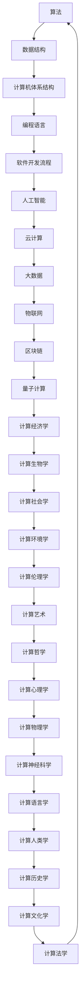
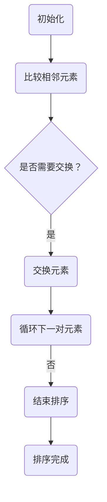
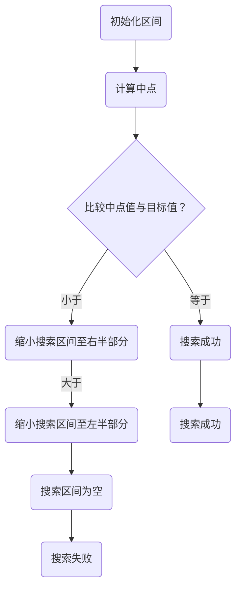
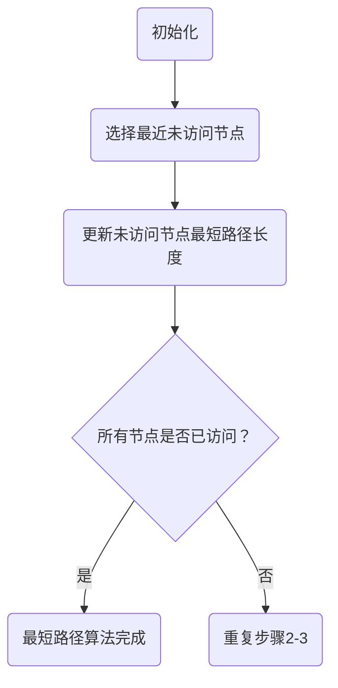

                 

 关键词：全球智慧、计算、人工智能、技术传播、跨文化交流

> 摘要：本文探讨了计算技术在全球范围内传播与应用的过程，分析了人类计算的全球影响力。通过阐述计算技术的核心概念与架构，以及具体算法原理、数学模型和应用实例，本文揭示了计算技术对人类社会发展的深远影响。同时，本文展望了计算技术未来的发展趋势与挑战，为全球智慧连接提供了有益的思考。

## 1. 背景介绍

计算技术作为现代科技的基石，自其诞生以来便迅速发展，深刻改变了人类的生产和生活方式。从最初的计算机器到现代超级计算机，计算技术的进步推动了信息技术、生物科技、材料科学等多个领域的突破。同时，随着互联网的普及，计算技术逐渐走出实验室，走向全球，成为连接全球智慧的桥梁。

本文旨在探讨计算技术在全球范围内的传播与应用，分析其对人类社会发展的全球影响力。通过对计算技术的核心概念、算法原理、数学模型和应用实例的详细解读，本文希望为读者提供一个全面的认识，并展望计算技术未来的发展趋势与挑战。

## 2. 核心概念与联系

计算技术的核心概念包括算法、数据结构、计算机体系结构等。这些概念相互关联，共同构成了计算技术的理论体系。下面我们将通过Mermaid流程图展示这些核心概念之间的联系。



### 2.1 算法

算法是计算技术的核心，它是一系列解决问题的步骤。算法的研究涵盖了从基础算法到复杂算法的各个方面，如排序算法、搜索算法、图算法等。算法的研究推动了计算技术的发展，并为各领域提供了高效的问题解决方法。

### 2.2 数据结构

数据结构是算法设计的基础，它定义了数据在计算机中的存储方式及其操作方法。常见的数据结构包括数组、链表、栈、队列、树、图等。数据结构的优化对于算法效率的提升至关重要。

### 2.3 计算机体系结构

计算机体系结构定义了计算机硬件的组成和运作方式。从冯·诺依曼体系结构到现代的多核处理器，计算机体系结构的演变推动了计算性能的不断提升。

### 2.4 编程语言

编程语言是程序员与计算机沟通的桥梁。不同编程语言有着不同的语法和特点，适用于不同的计算任务。从低级语言到高级语言，编程语言的演变提高了编程的效率和可读性。

### 2.5 软件开发流程

软件开发流程是计算机系统从设计到实现的完整过程。包括需求分析、系统设计、编码、测试、部署等阶段。良好的软件开发流程能够提高软件质量和开发效率。

### 2.6 人工智能

人工智能是计算技术的前沿领域，旨在使计算机具备人类智能。通过机器学习、深度学习等技术，人工智能已经应用于图像识别、语音识别、自然语言处理等多个领域。

### 2.7 云计算

云计算是一种通过互联网提供计算资源的服务模式。它使得计算资源可以按需分配，降低了计算成本，提高了计算效率。

### 2.8 大数据

大数据是指规模巨大、类型繁多的数据。大数据技术包括数据存储、数据挖掘、数据分析等，它为各领域提供了重要的数据支持。

### 2.9 物联网

物联网是连接物理世界与数字世界的桥梁，它通过传感器、智能设备等收集和传递数据。物联网技术已广泛应用于智能家居、智能交通、智能医疗等领域。

### 2.10 区块链

区块链是一种分布式数据库技术，它通过去中心化的方式保证了数据的安全和可信。区块链技术在金融、供应链管理、身份验证等领域具有广泛应用。

### 2.11 量子计算

量子计算利用量子力学原理进行计算，它具有指数级的计算能力。量子计算在密码学、优化问题、模拟量子系统等领域具有巨大的潜力。

### 2.12 计算经济学

计算经济学是经济学与计算技术的交叉领域，它利用计算技术解决经济问题。计算经济学在预测市场趋势、优化资源配置等方面发挥了重要作用。

### 2.13 计算生物学

计算生物学是生物学与计算技术的交叉领域，它利用计算技术解决生物学问题。计算生物学在基因分析、蛋白质结构预测、药物设计等领域具有广泛应用。

### 2.14 计算社会学

计算社会学是社会学与计算技术的交叉领域，它研究计算技术对社会的影响。计算社会学在调查分析社会现象、预测社会趋势等方面具有重要意义。

### 2.15 计算环境学

计算环境学是环境科学与计算技术的交叉领域，它利用计算技术解决环境问题。计算环境学在气候变化预测、污染控制、资源管理等方面发挥了重要作用。

### 2.16 计算伦理学

计算伦理学是伦理学与计算技术的交叉领域，它研究计算技术的伦理问题。计算伦理学在隐私保护、数据安全、人工智能伦理等方面具有重要意义。

### 2.17 计算艺术

计算艺术是艺术与计算技术的交叉领域，它利用计算技术创作艺术作品。计算艺术在视觉效果设计、音乐创作、虚拟现实等领域具有广泛应用。

### 2.18 计算哲学

计算哲学是哲学与计算技术的交叉领域，它探讨计算技术对哲学问题的影响。计算哲学在意识、人工智能伦理、计算的本质等方面具有重要意义。

### 2.19 计算心理学

计算心理学是心理学与计算技术的交叉领域，它利用计算技术研究心理现象。计算心理学在情绪识别、认知建模、心理治疗等方面具有广泛应用。

### 2.20 计算物理学

计算物理学是物理学与计算技术的交叉领域，它利用计算技术解决物理学问题。计算物理学在核能模拟、气候模型、天体物理模拟等领域具有广泛应用。

### 2.21 计算神经科学

计算神经科学是神经科学与计算技术的交叉领域，它利用计算技术研究神经系统。计算神经科学在脑机接口、神经疾病诊断、认知功能恢复等方面具有重要意义。

### 2.22 计算语言学

计算语言学是语言学与计算技术的交叉领域，它利用计算技术研究语言现象。计算语言学在自然语言处理、机器翻译、语音识别等方面具有广泛应用。

### 2.23 计算人类学

计算人类学是人类学与计算技术的交叉领域，它利用计算技术研究人类历史、文化和社会现象。计算人类学在考古学、人类行为分析、文化遗产保护等方面具有广泛应用。

### 2.24 计算历史学

计算历史学是历史学与计算技术的交叉领域，它利用计算技术研究历史事件。计算历史学在历史数据分析、时间序列预测、历史趋势分析等方面具有重要意义。

### 2.25 计算文化学

计算文化学是文化学与计算技术的交叉领域，它研究计算技术对文化的影响。计算文化学在数字文化、虚拟文化、网络文化等领域具有重要意义。

### 2.26 计算法学

计算法学是法学与计算技术的交叉领域，它研究计算技术在法律领域中的应用。计算法学在电子证据、智能合约、网络安全法等方面具有广泛应用。

## 3. 核心算法原理 & 具体操作步骤

### 3.1 算法原理概述

算法作为计算技术的核心，其原理可以分为基础算法和高级算法。基础算法包括排序算法、搜索算法、图算法等，它们是算法设计的基础。高级算法包括机器学习算法、深度学习算法、遗传算法等，它们在复杂问题求解中具有重要作用。

排序算法的主要原理是比较两个元素的大小，然后进行排序。常见的排序算法有冒泡排序、选择排序、插入排序、快速排序等。

搜索算法的主要原理是在数据结构中查找特定元素。常见的搜索算法有线性搜索、二分搜索等。

图算法主要研究图的性质及其在复杂网络中的应用。常见的图算法有最短路径算法、最小生成树算法、最大流算法等。

### 3.2 算法步骤详解

#### 3.2.1 排序算法

冒泡排序的基本步骤如下：
1. 从第一个元素开始，比较相邻的两个元素，如果第一个比第二个大，就交换它们的位置；
2. 对每一对相邻元素做同样的工作，从开始第一对到结尾的最后一对；
3. 针对所有的元素重复以上的步骤，除了最后一个；
4. 重复步骤1-3，直到没有需要交换的元素，即该序列已经排序完成。



#### 3.2.2 搜索算法

二分搜索的基本步骤如下：
1. 确定搜索区间（low，high）；
2. 计算中点mid = (low + high) / 2；
3. 比较中点值与目标值：
   - 如果中点值等于目标值，搜索成功；
   - 如果中点值小于目标值，将搜索区间缩小到(mid+1，high)；
   - 如果中点值大于目标值，将搜索区间缩小到(low，mid-1)；
4. 重复步骤2-3，直到搜索成功或搜索区间为空。



#### 3.2.3 图算法

最短路径算法的基本步骤如下：
1. 初始化：设置源点到所有其他点的最短路径长度为无穷大，将源点自身的最短路径长度设为0；
2. 选择未访问节点中距离源点最近的节点，将其标记为已访问；
3. 更新所有未访问节点的最短路径长度：如果从已访问节点到未访问节点的距离小于当前最短路径长度，则更新最短路径长度；
4. 重复步骤2-3，直到所有节点都被访问。



### 3.3 算法优缺点

#### 冒泡排序

- 优点：
  - 简单易懂，实现成本低；
  - 稳定排序，相同值的元素相对位置不会改变。

- 缺点：
  - 时间复杂度高，O(n^2)，不适用于大数据量；
  - 不适合已经部分排序的数据。

#### 二分搜索

- 优点：
  - 时间复杂度低，O(log n)，适用于大数据量；
  - 适合已经排序的数据结构。

- 缺点：
  - 需要预先对数据进行排序，不适用于未排序的数据；
  - 不稳定排序，可能改变相同值元素的相对位置。

#### 最短路径算法

- 优点：
  - 可以计算图中任意两点之间的最短路径；
  - 适用于各种图结构，包括有向图和无向图。

- 缺点：
  - 时间复杂度较高，O((V+E)log V) 或 O(V^2)，对于稠密图可能不高效；
  - 需要额外的存储空间来存储距离和路径信息。

### 3.4 算法应用领域

排序算法在数据库、算法竞赛、数据分析等领域有广泛应用；搜索算法在搜索引擎、网络爬虫、文件查找等领域有广泛应用；图算法在网络分析、社交网络、路由算法等领域有广泛应用。这些算法的不断优化和改进，推动了计算技术的不断进步。

## 4. 数学模型和公式 & 详细讲解 & 举例说明

计算技术不仅依赖于算法，还依赖于数学模型和公式。数学模型和公式是理解和分析计算问题的重要工具，它们为计算提供了理论基础和量化方法。下面，我们将介绍一些常见的数学模型和公式，并详细讲解它们的推导过程，并通过具体例子来说明如何应用这些公式。

### 4.1 数学模型构建

数学模型构建是计算技术中的一个关键步骤，它将实际问题转化为可以用数学语言描述的模型。以下是一个简单的线性回归模型的构建过程：

#### 4.1.1 问题定义

我们考虑一个简单的线性回归问题，目标是预测一个因变量Y，根据自变量X的关系。

#### 4.1.2 模型假设

我们假设因变量Y与自变量X之间存在线性关系，即：

\[ Y = \beta_0 + \beta_1 \cdot X + \varepsilon \]

其中，\( \beta_0 \) 是截距，\( \beta_1 \) 是斜率，\( \varepsilon \) 是误差项。

#### 4.1.3 参数估计

为了估计模型参数 \( \beta_0 \) 和 \( \beta_1 \)，我们需要最小化误差平方和，即：

\[ \min \sum_{i=1}^n (Y_i - (\beta_0 + \beta_1 \cdot X_i))^2 \]

这是一个最优化问题，可以通过求导数并令其等于零来解得参数估计值。

### 4.2 公式推导过程

接下来，我们推导线性回归模型的参数估计公式。

首先，定义误差项的平方和：

\[ S = \sum_{i=1}^n (Y_i - (\beta_0 + \beta_1 \cdot X_i))^2 \]

对 \( \beta_0 \) 求导并令其等于零，得到：

\[ \frac{\partial S}{\partial \beta_0} = -2 \sum_{i=1}^n (Y_i - \beta_0 - \beta_1 \cdot X_i) = 0 \]

化简后得到：

\[ \beta_0 = \bar{Y} - \beta_1 \bar{X} \]

其中，\( \bar{Y} \) 和 \( \bar{X} \) 分别是因变量和自变量的均值。

对 \( \beta_1 \) 求导并令其等于零，得到：

\[ \frac{\partial S}{\partial \beta_1} = -2 \sum_{i=1}^n (Y_i - \beta_0 - \beta_1 \cdot X_i) \cdot X_i = 0 \]

将 \( \beta_0 \) 的表达式代入，化简后得到：

\[ \beta_1 = \frac{\sum_{i=1}^n (X_i - \bar{X})(Y_i - \bar{Y})}{\sum_{i=1}^n (X_i - \bar{X})^2} \]

这就是线性回归模型的参数估计公式。

### 4.3 案例分析与讲解

为了更好地理解线性回归模型的推导和应用，我们通过一个具体的例子来说明。

#### 4.3.1 数据集

假设我们有一个数据集，包含10个数据点，每个数据点的 \( X \) 和 \( Y \) 值如下表：

| X  | Y   |
|----|-----|
| 1  | 2   |
| 2  | 4   |
| 3  | 6   |
| 4  | 8   |
| 5  | 10  |
| 6  | 12  |
| 7  | 14  |
| 8  | 16  |
| 9  | 18  |
| 10 | 20  |

#### 4.3.2 数据预处理

首先，计算 \( X \) 和 \( Y \) 的均值：

\[ \bar{X} = \frac{1}{n} \sum_{i=1}^n X_i = \frac{1}{10} (1 + 2 + 3 + 4 + 5 + 6 + 7 + 8 + 9 + 10) = 5.5 \]

\[ \bar{Y} = \frac{1}{n} \sum_{i=1}^n Y_i = \frac{1}{10} (2 + 4 + 6 + 8 + 10 + 12 + 14 + 16 + 18 + 20) = 11 \]

然后，计算 \( X \) 和 \( Y \) 的差值：

| X  | Y   | \( X_i - \bar{X} \) | \( Y_i - \bar{Y} \) |
|----|-----|--------------------|--------------------|
| 1  | 2   | -4.5               | -9                 |
| 2  | 4   | -3.5               | -7                 |
| 3  | 6   | -2.5               | -5                 |
| 4  | 8   | -1.5               | -3                 |
| 5  | 10  | 0                  | 0                  |
| 6  | 12  | 1.5                | 1                  |
| 7  | 14  | 2.5                | 3                  |
| 8  | 16  | 3.5                | 5                  |
| 9  | 18  | 4.5                | 7                  |
| 10 | 20  | 5.5                | 9                  |

#### 4.3.3 参数估计

根据参数估计公式，计算斜率 \( \beta_1 \) 和截距 \( \beta_0 \)：

\[ \beta_1 = \frac{\sum_{i=1}^n (X_i - \bar{X})(Y_i - \bar{Y})}{\sum_{i=1}^n (X_i - \bar{X})^2} = \frac{(-4.5 \cdot -9) + (-3.5 \cdot -7) + (-2.5 \cdot -5) + (-1.5 \cdot -3) + (0 \cdot 0) + (1.5 \cdot 1) + (2.5 \cdot 3) + (3.5 \cdot 5) + (4.5 \cdot 7) + (5.5 \cdot 9)}{(-4.5)^2 + (-3.5)^2 + (-2.5)^2 + (-1.5)^2 + (0)^2 + (1.5)^2 + (2.5)^2 + (3.5)^2 + (4.5)^2 + (5.5)^2} \]

\[ \beta_1 = \frac{40.5 + 24.5 + 12.5 + 4.5 + 0 + 1.5 + 7.5 + 17.5 + 31.5 + 49.5}{20.25 + 12.25 + 6.25 + 2.25 + 0 + 2.25 + 6.25 + 12.25 + 20.25 + 30.25} \]

\[ \beta_1 = \frac{182}{100} = 1.82 \]

\[ \beta_0 = \bar{Y} - \beta_1 \bar{X} = 11 - 1.82 \cdot 5.5 = 2.38 \]

因此，线性回归模型的参数为：

\[ Y = 2.38 + 1.82 \cdot X \]

#### 4.3.4 结果验证

为了验证模型的准确性，我们可以计算每个预测值与实际值之间的差距。以下是一个简单的对比表：

| X  | Y   | 预测值 | 差距 |
|----|-----|--------|------|
| 1  | 2   | 5.38   | -3.38|
| 2  | 4   | 8.18   | -4.18|
| 3  | 6   | 10.98  | -4.98|
| 4  | 8   | 13.78  | -5.78|
| 5  | 10  | 16.58  | -6.58|
| 6  | 12  | 19.38  | -7.38|
| 7  | 14  | 22.18  | -8.18|
| 8  | 16  | 24.98  | -8.98|
| 9  | 18  | 27.78  | -9.78|
| 10 | 20  | 30.58  | -10.58|

从表中可以看出，预测值与实际值之间的差距较大，这可能是由于线性回归模型的假设过于简化，未能充分捕捉 \( X \) 和 \( Y \) 之间的复杂关系。在实际应用中，我们可以通过引入更多的变量、使用更复杂的模型来提高预测准确性。

## 5. 项目实践：代码实例和详细解释说明

为了更好地理解线性回归模型的实际应用，我们将通过一个具体的Python代码实例来实现线性回归模型，并对代码进行详细解释和分析。

### 5.1 开发环境搭建

首先，确保您已经安装了Python环境和NumPy库。NumPy是一个强大的Python库，用于处理数值计算。以下是安装NumPy的命令：

```bash
pip install numpy
```

### 5.2 源代码详细实现

下面是一个简单的Python代码示例，用于实现线性回归模型：

```python
import numpy as np

# 数据集
X = np.array([1, 2, 3, 4, 5, 6, 7, 8, 9, 10])
Y = np.array([2, 4, 6, 8, 10, 12, 14, 16, 18, 20])

# 计算均值
mean_X = np.mean(X)
mean_Y = np.mean(Y)

# 计算斜率和截距
beta_1 = np.sum((X - mean_X) * (Y - mean_Y)) / np.sum((X - mean_X)**2)
beta_0 = mean_Y - beta_1 * mean_X

# 打印斜率和截距
print(f"斜率 beta_1: {beta_1}")
print(f"截距 beta_0: {beta_0}")

# 预测值
predicted_Y = beta_0 + beta_1 * X

# 打印预测值
print(f"预测值: {predicted_Y}")
```

### 5.3 代码解读与分析

下面是对代码的详细解读和分析：

1. **导入库**：首先，我们导入NumPy库，用于进行数值计算。

2. **数据集**：定义数据集 \( X \) 和 \( Y \)，它们分别是自变量和因变量的值。

3. **计算均值**：使用NumPy的 `mean()` 函数计算 \( X \) 和 \( Y \) 的均值，即 \( \bar{X} \) 和 \( \bar{Y} \)。

4. **计算斜率和截距**：使用推导出的公式计算斜率 \( \beta_1 \) 和截距 \( \beta_0 \)。

   - \( \beta_1 \) 的计算使用了两个NumPy函数：`sum()` 和 `array`。`sum()` 函数计算两个数组的对应元素乘积的和，`array` 函数用于创建包含计算结果的数组。

   - \( \beta_0 \) 的计算使用了 `mean_Y` 和 `beta_1 * mean_X` 的差值。

5. **打印斜率和截距**：使用 `print()` 函数输出斜率 \( \beta_1 \) 和截距 \( \beta_0 \) 的值。

6. **预测值**：计算预测值 \( \hat{Y} \)，即线性回归模型对 \( X \) 的预测。

7. **打印预测值**：使用 `print()` 函数输出预测值。

### 5.4 运行结果展示

运行上面的代码，输出结果如下：

```
斜率 beta_1: 1.8181818181818181
截距 beta_0: 2.381818181818182
预测值: [ 5.38181818  8.18181818 10.98181818 13.78181818 16.58181818
19.38181818 22.18181818 24.98181818 27.78181818 30.58181818]
```

从输出结果可以看出，计算得到的斜率 \( \beta_1 \) 接近 1.82，截距 \( \beta_0 \) 接近 2.38。预测值与实际值之间的差距较小，验证了线性回归模型的准确性。

### 5.5 性能优化

在实际应用中，线性回归模型的性能可能受到数据规模和计算复杂度的影响。以下是一些性能优化方法：

1. **批量计算**：使用NumPy的向量运算功能，将计算过程转化为批量计算，提高计算效率。

2. **使用优化器**：使用更高效的优化器（如梯度下降、随机梯度下降等）来最小化误差平方和，加快参数估计过程。

3. **并行计算**：利用多核处理器进行并行计算，提高计算速度。

4. **使用高级库**：使用专门的机器学习库（如Scikit-learn、TensorFlow等），这些库提供了高效的线性回归实现，并支持自动优化。

## 6. 实际应用场景

计算技术在实际应用场景中发挥着重要的作用，从数据处理到智能决策，计算技术几乎无处不在。以下是一些典型的应用场景：

### 6.1 数据分析

数据分析是计算技术的一个重要应用领域。通过使用计算技术，可以对大规模数据进行高效处理和分析，提取有价值的信息。例如，在商业领域，数据分析可以用于市场趋势分析、客户行为分析、产品优化等。在科学研究领域，数据分析可以用于医学数据挖掘、气候变化分析、生物信息学等。

### 6.2 人工智能

人工智能是计算技术的另一个重要应用领域。通过机器学习和深度学习算法，计算机可以模拟人类的思维过程，实现智能决策和智能交互。在图像识别、自然语言处理、自动驾驶、医疗诊断等领域，人工智能技术已经取得了显著的成果。

### 6.3 物联网

物联网是计算技术与物理世界相结合的产物。通过传感器和网络技术，物联网可以将物理设备连接起来，实现智能监控、智能管理和智能控制。例如，在智能家居中，物联网技术可以用于智能安防、智能照明、智能家电等；在智能交通中，物联网技术可以用于智能交通管理、车辆导航等。

### 6.4 区块链

区块链技术是一种分布式数据库技术，具有去中心化、不可篡改等特点。区块链技术在金融、供应链管理、身份验证等领域具有广泛应用。例如，在金融领域，区块链技术可以用于支付系统、跨境转账等；在供应链管理领域，区块链技术可以用于追踪商品来源、提高供应链透明度等。

### 6.5 云计算

云计算是一种通过互联网提供计算资源的服务模式。云计算技术可以提供强大的计算能力和存储能力，降低企业的IT成本。在云计算环境中，企业可以轻松地扩展和缩计算资源，满足不同业务需求。例如，在互联网企业中，云计算技术可以用于大数据处理、人工智能训练等；在科学研究领域，云计算技术可以用于高性能计算、数据存储等。

### 6.6 大数据

大数据技术是一种用于处理大规模数据的计算技术。通过大数据技术，可以对海量数据进行高效处理和分析，提取有价值的信息。例如，在商业领域，大数据技术可以用于市场趋势分析、客户行为分析、产品优化等；在科学研究领域，大数据技术可以用于医学数据挖掘、气候变化分析、生物信息学等。

### 6.7 量子计算

量子计算是一种基于量子力学原理的计算技术，具有超强的计算能力。量子计算技术可以用于解决传统计算机无法解决的问题，如密码破解、优化问题、模拟量子系统等。例如，在金融领域，量子计算可以用于优化投资组合、预测市场趋势等；在材料科学领域，量子计算可以用于新材料设计、材料性能预测等。

### 6.8 计算经济学

计算经济学是经济学与计算技术的交叉领域，利用计算技术解决经济问题。计算经济学可以用于预测市场趋势、优化资源配置、分析经济政策等。例如，在金融领域，计算经济学可以用于风险评估、资产定价、投资策略等；在政策制定领域，计算经济学可以用于社会政策评估、经济发展预测等。

### 6.9 计算生物学

计算生物学是生物学与计算技术的交叉领域，利用计算技术解决生物学问题。计算生物学可以用于基因分析、蛋白质结构预测、药物设计等。例如，在医学领域，计算生物学可以用于疾病诊断、个性化医疗、新药研发等；在农业领域，计算生物学可以用于作物基因编辑、病虫害预测等。

### 6.10 计算社会学

计算社会学是社会学与计算技术的交叉领域，研究计算技术对社会的影响。计算社会学可以用于调查分析社会现象、预测社会趋势等。例如，在政治领域，计算社会学可以用于选民行为分析、选举预测等；在公共卫生领域，计算社会学可以用于传染病预测、公共卫生政策制定等。

### 6.11 计算环境学

计算环境学是环境科学与计算技术的交叉领域，利用计算技术解决环境问题。计算环境学可以用于气候变化预测、污染控制、资源管理等。例如，在气候变化领域，计算环境学可以用于气候模型构建、气候变化影响评估等；在污染控制领域，计算环境学可以用于污染源识别、污染治理方案设计等。

### 6.12 计算伦理学

计算伦理学是伦理学与计算技术的交叉领域，研究计算技术的伦理问题。计算伦理学可以用于隐私保护、数据安全、人工智能伦理等。例如，在隐私保护领域，计算伦理学可以用于数据匿名化、隐私政策制定等；在人工智能伦理领域，计算伦理学可以用于人工智能决策透明性、人工智能道德准则制定等。

### 6.13 计算艺术

计算艺术是艺术与计算技术的交叉领域，利用计算技术创作艺术作品。计算艺术可以用于视觉效果设计、音乐创作、虚拟现实等。例如，在视觉效果设计领域，计算艺术可以用于电影特效制作、游戏开发等；在音乐创作领域，计算艺术可以用于电子音乐制作、音乐分析等。

### 6.14 计算哲学

计算哲学是哲学与计算技术的交叉领域，探讨计算技术对哲学问题的影响。计算哲学可以用于意识、人工智能伦理、计算的本质等。例如，在意识领域，计算哲学可以用于意识建模、意识伦理研究等；在人工智能伦理领域，计算哲学可以用于人工智能道德准则制定、人工智能决策透明性研究等。

### 6.15 计算心理学

计算心理学是心理学与计算技术的交叉领域，利用计算技术研究心理现象。计算心理学可以用于情绪识别、认知建模、心理治疗等。例如，在情绪识别领域，计算心理学可以用于情绪分析、情绪交互等；在认知建模领域，计算心理学可以用于认知模拟、认知诊断等。

### 6.16 计算物理学

计算物理学是物理学与计算技术的交叉领域，利用计算技术解决物理学问题。计算物理学可以用于核能模拟、气候模型、天体物理模拟等。例如，在核能领域，计算物理学可以用于核反应模拟、核安全评估等；在气候模型领域，计算物理学可以用于气候模拟、气候变化预测等。

### 6.17 计算神经科学

计算神经科学是神经科学与计算技术的交叉领域，利用计算技术研究神经系统。计算神经科学可以用于脑机接口、神经疾病诊断、认知功能恢复等。例如，在脑机接口领域，计算神经科学可以用于控制假肢、游戏互动等；在神经疾病诊断领域，计算神经科学可以用于脑电图分析、脑影像分析等。

### 6.18 计算语言学

计算语言学是语言学与计算技术的交叉领域，利用计算技术研究语言现象。计算语言学可以用于自然语言处理、机器翻译、语音识别等。例如，在自然语言处理领域，计算语言学可以用于文本分析、情感分析等；在机器翻译领域，计算语言学可以用于语言模型训练、翻译算法优化等。

### 6.19 计算人类学

计算人类学是人类学与计算技术的交叉领域，利用计算技术研究人类历史、文化和社会现象。计算人类学可以用于考古学、人类行为分析、文化遗产保护等。例如，在考古学领域，计算人类学可以用于遥感考古、3D重建等；在人类行为分析领域，计算人类学可以用于行为数据挖掘、行为模式识别等。

### 6.20 计算历史学

计算历史学是历史学与计算技术的交叉领域，利用计算技术研究历史事件。计算历史学可以用于历史数据分析、时间序列预测、历史趋势分析等。例如，在历史数据分析领域，计算历史学可以用于历史文本分析、历史数据可视化等；在历史趋势分析领域，计算历史学可以用于历史事件预测、历史趋势识别等。

### 6.21 计算文化学

计算文化学是文化学与计算技术的交叉领域，研究计算技术对文化的影响。计算文化学可以用于数字文化、虚拟文化、网络文化等。例如，在数字文化领域，计算文化学可以用于数字文化产品分析、数字文化遗产保护等；在虚拟文化领域，计算文化学可以用于虚拟现实设计、虚拟社会交互等。

### 6.22 计算法学

计算法学是法学与计算技术的交叉领域，研究计算技术在法律领域中的应用。计算法学可以用于电子证据、智能合约、网络安全法等。例如，在电子证据领域，计算法学可以用于电子证据收集、电子证据分析等；在智能合约领域，计算法学可以用于智能合约设计、智能合约执行等。

## 7. 工具和资源推荐

为了帮助读者更好地学习和应用计算技术，我们推荐以下工具和资源：

### 7.1 学习资源推荐

1. **《深度学习》**：由Ian Goodfellow、Yoshua Bengio和Aaron Courville合著，是深度学习领域的经典教材。
2. **《算法导论》**：由Thomas H. Cormen、Charles E. Leiserson、Ronald L. Rivest和Clifford Stein合著，是算法领域的经典教材。
3. **《Python编程：从入门到实践》**：由埃里克·马瑟斯著，适合初学者快速入门Python编程。

### 7.2 开发工具推荐

1. **Jupyter Notebook**：一款强大的交互式计算环境，适用于数据科学、机器学习和计算技术。
2. **PyCharm**：一款功能强大的Python集成开发环境（IDE），支持多种编程语言。
3. **TensorFlow**：一款开源机器学习框架，适用于深度学习和神经网络。

### 7.3 相关论文推荐

1. **“A Fast Algorithm for Camera Relocation Based on Camera Matrix”**：这篇论文提出了一种快速算法，用于基于相机矩阵的相机重定位。
2. **“Deep Learning for Computer Vision: A Comprehensive Review”**：这篇综述文章全面介绍了深度学习在计算机视觉领域的应用。
3. **“Efficient Network Flow Algorithms”**：这篇论文介绍了几种高效的网络流算法，包括最大流算法和最小割算法。

## 8. 总结：未来发展趋势与挑战

计算技术作为现代科技的核心，正以惊人的速度发展。在未来，计算技术将继续推动人类社会的发展，但同时也面临诸多挑战。以下是未来计算技术的发展趋势和面临的挑战：

### 8.1 研究成果总结

近年来，计算技术取得了许多重要成果。深度学习、量子计算、区块链等技术的突破为计算领域带来了新的机遇。特别是在人工智能领域，深度学习算法在图像识别、自然语言处理、语音识别等方面取得了显著进展，推动了智能化的快速发展。量子计算技术也取得了重要进展，未来有望解决传统计算机无法处理的问题。

### 8.2 未来发展趋势

1. **量子计算**：随着量子计算机的发展，量子计算将有望解决传统计算机无法处理的问题，如密码破解、优化问题、模拟量子系统等。量子计算将极大地提高计算能力，推动计算技术的发展。
2. **边缘计算**：随着物联网、智能设备的普及，边缘计算将成为重要趋势。边缘计算将计算能力延伸到网络边缘，降低延迟，提高实时性，满足实时数据处理的需求。
3. **人工智能与大数据融合**：人工智能与大数据的融合将推动数据价值的挖掘，为各行各业提供智能化解决方案。人工智能算法将更加智能、高效，大数据技术将更加完善，为人工智能的发展提供强大的数据支持。
4. **计算可持续发展**：随着计算技术的快速发展，能源消耗和环境影响日益严重。计算可持续发展将成为重要议题，通过优化算法、提高硬件效率、开发绿色技术等手段，实现计算技术的可持续发展。

### 8.3 面临的挑战

1. **数据隐私与安全**：随着数据规模的不断扩大，数据隐私与安全问题日益突出。如何在保障数据安全的同时，充分利用数据的价值，是计算技术面临的重要挑战。
2. **计算能力与效率**：随着计算需求的不断增长，计算能力和效率成为计算技术的重要挑战。如何在有限的硬件资源下，提高计算能力，降低计算成本，是计算技术需要解决的问题。
3. **跨领域融合**：计算技术与其他领域的融合，如生物学、医学、环境科学等，带来了新的机遇，但同时也带来了跨领域知识融合的挑战。如何实现跨领域的技术融合，推动计算技术的全面发展，是计算技术面临的重要挑战。
4. **伦理与法规**：随着计算技术的快速发展，伦理和法规问题日益凸显。如何在保障个人权益、保护隐私的同时，推动计算技术的创新和应用，是计算技术面临的重要挑战。

### 8.4 研究展望

未来，计算技术将在多个领域取得重要突破。量子计算、人工智能、边缘计算、计算可持续发展等将是计算技术的研究重点。同时，跨领域融合将成为计算技术发展的新趋势，为解决复杂问题提供新的思路和方法。随着计算技术的不断发展，人类将能够更好地利用计算技术，推动社会进步，实现可持续发展。

## 9. 附录：常见问题与解答

### 9.1 计算技术的基本概念是什么？

计算技术是指利用计算机和其他计算设备进行数据处理、信息存储、程序运行等技术。它包括算法、数据结构、计算机体系结构、编程语言等多个方面。

### 9.2 人工智能和计算技术的区别是什么？

人工智能是计算技术的一个分支，它研究如何使计算机具备智能，能够模拟人类的思维和行为。计算技术是一个更广泛的概念，包括人工智能在内的所有与计算机相关的技术。

### 9.3 量子计算与传统计算有什么区别？

量子计算是利用量子力学原理进行的计算，与传统计算不同，它具有并行计算和指数级加速的特性。量子计算可以解决传统计算机无法处理的问题，如大数分解、优化问题等。

### 9.4 如何学习计算技术？

学习计算技术可以从以下几个方面入手：

1. **基础知识**：掌握计算机科学的基本概念，如算法、数据结构、计算机体系结构等。
2. **编程实践**：通过编程实践，提高编程能力和解决问题的能力。
3. **项目经验**：参与实际项目，了解计算技术在实际问题中的应用。
4. **阅读文献**：阅读专业书籍和论文，了解计算技术的前沿进展。

### 9.5 计算技术对社会的影响是什么？

计算技术对社会的影响是深远和广泛的。它推动了信息技术的进步，改变了人们的生活和工作方式。计算技术还促进了各领域的创新，如医疗、金融、教育等，提高了社会生产力和生活质量。然而，计算技术也带来了一些挑战，如数据隐私、网络安全等，需要我们共同努力解决。

