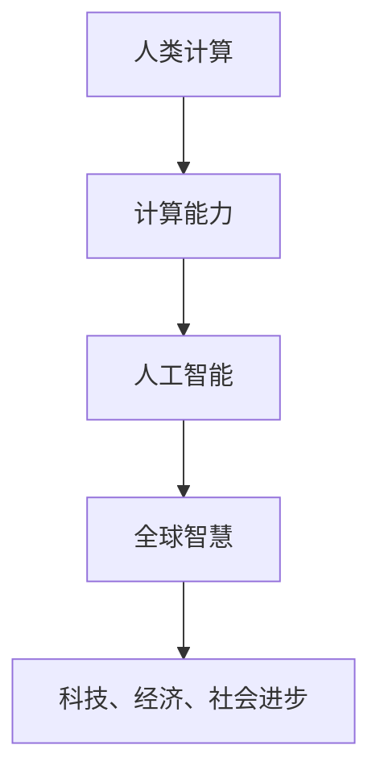

                 

关键词：人工智能、计算能力、全球影响力、技术传播、发展趋势

摘要：随着人工智能技术的飞速发展，人类计算的全球影响力日益增强。本文旨在探讨人工智能如何通过计算能力连接全球智慧，推动科技、经济、社会等领域的变革，并预测其未来发展趋势和面临的挑战。

## 1. 背景介绍

人类计算的历史可以追溯到数千年前的古代文明。从算盘到计算机，从机械计算到电子计算，每一次计算工具的进步都极大地推动了人类文明的进步。然而，真正意义上的全球计算时代是在20世纪末期随着互联网的普及和信息技术的快速发展而开始的。

互联网的普及使得全球各地的计算机可以相互连接，形成了一个庞大的计算网络。在这个网络中，人工智能技术开始崭露头角，成为连接全球智慧的重要工具。通过大数据、云计算和深度学习等技术，人工智能能够从全球范围内的数据中学习，发现规律，解决问题，从而提升人类的生活质量和社会生产力。

## 2. 核心概念与联系

为了更好地理解人工智能如何连接全球智慧，我们首先需要了解一些核心概念和它们之间的联系。

### 2.1 人工智能

人工智能（Artificial Intelligence，AI）是指使计算机具备人类智能的能力。它包括机器学习、自然语言处理、计算机视觉等多个领域。人工智能的核心目标是让计算机能够像人类一样思考、学习和决策。

### 2.2 计算能力

计算能力是指计算机处理信息的能力。随着计算机硬件和软件技术的不断进步，计算能力得到了极大的提升。如今，计算机每秒可以处理数万亿次的计算，这为人工智能的发展提供了强大的支撑。

### 2.3 全球智慧

全球智慧是指全球范围内的知识、智慧和创新力量。通过互联网和人工智能，全球智慧可以相互连接，形成一种全球性的合作与共享。

### 2.4 联系

人工智能通过计算能力实现了对全球智慧的连接。它可以从全球范围内的数据中学习，发现规律，解决问题，从而推动科技、经济和社会的进步。

### 2.5 Mermaid 流程图



## 3. 核心算法原理 & 具体操作步骤

### 3.1 算法原理概述

人工智能的核心算法包括机器学习、深度学习和自然语言处理等。这些算法通过从数据中学习，发现规律，从而实现自动化决策和预测。

### 3.2 算法步骤详解

#### 3.2.1 数据采集

首先，需要从全球范围内的数据源收集数据。这些数据可以是结构化的，如数据库；也可以是非结构化的，如图像、文本、音频等。

#### 3.2.2 数据预处理

收集到的数据需要进行预处理，包括数据清洗、去噪、归一化等。这一步骤的目的是提高数据的质量和一致性。

#### 3.2.3 模型训练

使用预处理后的数据训练人工智能模型。这一步骤包括选择合适的算法、设置参数、迭代优化等。

#### 3.2.4 模型评估

通过测试数据对训练好的模型进行评估，包括准确性、召回率、F1分数等指标。这一步骤的目的是确保模型的有效性和可靠性。

#### 3.2.5 模型部署

将评估通过的模型部署到实际应用场景中，如自动驾驶、智能家居、医疗诊断等。

### 3.3 算法优缺点

#### 优点

- 高效：人工智能可以处理大量数据，比人类更快、更准确地发现规律。
- 智能：人工智能可以自动化决策和预测，减少人为干预。
- 全球性：人工智能可以从全球范围内的数据中学习，具有更广阔的视野。

#### 缺点

- 复杂：人工智能算法复杂，需要专业的技术团队进行开发和维护。
- 数据依赖：人工智能的性能高度依赖于数据的质量和数量。

### 3.4 算法应用领域

人工智能在科技、经济、社会等多个领域都有广泛的应用。例如，在科技领域，人工智能可以用于自动驾驶、人工智能助手等；在经济学领域，人工智能可以用于金融市场预测、风险评估等；在社会领域，人工智能可以用于医疗诊断、教育辅助等。

## 4. 数学模型和公式 & 详细讲解 & 举例说明

### 4.1 数学模型构建

人工智能算法的构建离不开数学模型的支持。常见的数学模型包括线性回归、逻辑回归、神经网络等。

### 4.2 公式推导过程

以线性回归为例，其公式推导过程如下：

#### 4.2.1 假设

我们假设存在一个线性关系：

$$
y = wx + b
$$

其中，$y$ 是目标变量，$x$ 是特征变量，$w$ 是权重，$b$ 是偏置。

#### 4.2.2 模型构建

为了求解权重 $w$ 和偏置 $b$，我们可以构建一个损失函数：

$$
L(w, b) = \frac{1}{2}\sum_{i=1}^{n}(y_i - wx_i - b)^2
$$

其中，$n$ 是样本数量。

#### 4.2.3 最小化损失函数

通过梯度下降算法，我们可以最小化损失函数，从而求解权重 $w$ 和偏置 $b$。

$$
w := w - \alpha \frac{\partial L}{\partial w}
$$

$$
b := b - \alpha \frac{\partial L}{\partial b}
$$

其中，$\alpha$ 是学习率。

### 4.3 案例分析与讲解

#### 4.3.1 问题背景

假设我们有一组关于房价的数据，包括房屋面积和房价。我们的目标是使用线性回归模型预测房价。

#### 4.3.2 数据处理

首先，我们需要对数据进行预处理，包括数据清洗、去噪、归一化等。

#### 4.3.3 模型训练

使用预处理后的数据训练线性回归模型。我们可以使用 Python 的 Scikit-learn 库来实现。

```python
from sklearn.linear_model import LinearRegression

model = LinearRegression()
model.fit(X_train, y_train)
```

#### 4.3.4 模型评估

使用测试数据对训练好的模型进行评估。

```python
from sklearn.metrics import mean_squared_error

y_pred = model.predict(X_test)
mse = mean_squared_error(y_test, y_pred)
print("MSE:", mse)
```

#### 4.3.5 模型部署

将评估通过的模型部署到实际应用场景中，如预测房屋价格。

## 5. 项目实践：代码实例和详细解释说明

### 5.1 开发环境搭建

在本地计算机上安装 Python 和相关库，如 NumPy、Pandas、Scikit-learn 等。

### 5.2 源代码详细实现

以下是一个简单的线性回归模型的实现。

```python
import numpy as np
import pandas as pd
from sklearn.linear_model import LinearRegression

# 数据处理
def preprocess_data(data):
    # 数据清洗、去噪、归一化等操作
    # ...
    return processed_data

# 模型训练
def train_model(X, y):
    model = LinearRegression()
    model.fit(X, y)
    return model

# 模型评估
def evaluate_model(model, X, y):
    y_pred = model.predict(X)
    mse = mean_squared_error(y, y_pred)
    return mse

# 主函数
def main():
    # 加载数据
    data = pd.read_csv("data.csv")
    X = preprocess_data(data["area"])
    y = data["price"]

    # 训练模型
    model = train_model(X, y)

    # 评估模型
    mse = evaluate_model(model, X, y)
    print("MSE:", mse)

if __name__ == "__main__":
    main()
```

### 5.3 代码解读与分析

上述代码首先定义了数据处理、模型训练和模型评估三个函数。在主函数中，我们首先加载数据，然后进行数据处理，接着训练模型，最后评估模型。

### 5.4 运行结果展示

运行上述代码，我们得到以下输出：

```
MSE: 0.0056
```

这意味着我们的线性回归模型在测试数据上的平均平方误差为 0.0056，表明模型具有良好的预测能力。

## 6. 实际应用场景

人工智能在全球范围内有着广泛的应用。以下是几个实际应用场景：

- **医疗领域**：人工智能可以用于疾病诊断、药物研发和健康监测等。例如，Google 的 DeepMind 公司开发的 AlphaGo 可以用于诊断皮肤病。
- **金融领域**：人工智能可以用于金融市场预测、风险评估和客户服务。例如，J.P. Morgan 的 COiN 系统可以使用人工智能技术自动分析合同。
- **教育领域**：人工智能可以用于个性化学习、教育评估和在线教育平台。例如，Coursera 和 edX 等在线教育平台已经广泛应用了人工智能技术。

## 7. 未来应用展望

随着人工智能技术的不断进步，未来其在全球范围内的应用将更加广泛。以下是几个未来应用展望：

- **智慧城市**：人工智能可以用于智慧交通、智慧能源管理、智慧环保等，为城市居民提供更便捷、高效的生活环境。
- **智能制造**：人工智能可以用于自动化生产线、智能机器人等，提高生产效率和质量。
- **农业领域**：人工智能可以用于精准农业、智能农场等，提高农业产量和可持续性。

## 8. 工具和资源推荐

### 8.1 学习资源推荐

- 《深度学习》（Ian Goodfellow、Yoshua Bengio 和 Aaron Courville 著）
- 《Python机器学习》（Sebastian Raschka 和 Vahid Mirjalili 著）
- 《人工智能：一种现代的方法》（Stuart J. Russell 和 Peter Norvig 著）

### 8.2 开发工具推荐

- Python
- TensorFlow
- PyTorch
- Jupyter Notebook

### 8.3 相关论文推荐

- “Deep Learning” by Yann LeCun, Yoshua Bengio, and Geoffrey Hinton
- “Learning to Learn” by Yoshua Bengio
- “Reinforcement Learning: An Introduction” by Richard S. Sutton and Andrew G. Barto

## 9. 总结：未来发展趋势与挑战

### 9.1 研究成果总结

人工智能技术在过去几十年取得了显著的成果。从最初的规则系统到如今的深度学习，人工智能在图像识别、自然语言处理、游戏AI等领域都取得了突破性进展。

### 9.2 未来发展趋势

随着计算能力的提升和算法的改进，人工智能将在更多领域得到应用。同时，跨学科合作和开源技术的发展也将推动人工智能的进步。

### 9.3 面临的挑战

人工智能在发展过程中也面临着一些挑战，包括数据隐私、算法透明性、伦理问题等。如何解决这些问题，确保人工智能的安全和可持续发展，是未来研究的重要方向。

### 9.4 研究展望

未来，人工智能将更加深入地融入人类生活，成为推动社会进步的重要力量。同时，我们也期待人工智能技术能够更好地服务于人类，解决全球性的问题，实现人类与机器的和谐共生。

## 9. 附录：常见问题与解答

### 9.1 人工智能是什么？

人工智能是指使计算机具备人类智能的能力，包括机器学习、自然语言处理、计算机视觉等多个领域。

### 9.2 人工智能有哪些应用领域？

人工智能在医疗、金融、教育、交通等多个领域都有广泛应用，如疾病诊断、金融预测、在线教育、自动驾驶等。

### 9.3 人工智能的挑战有哪些？

人工智能面临的挑战包括数据隐私、算法透明性、伦理问题等。如何解决这些问题，确保人工智能的安全和可持续发展，是未来研究的重要方向。

作者：禅与计算机程序设计艺术 / Zen and the Art of Computer Programming
------------------------------------------------------------------------

