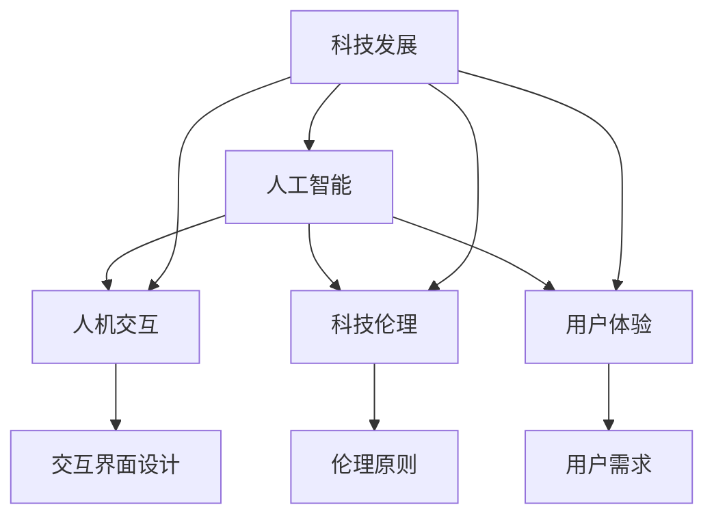

                 

关键词：人工智能、人机交互、科技伦理、用户体验、以人为本、技术发展

> 摘要：随着科技的快速发展，人工智能、大数据、物联网等前沿技术不断涌现，为我们的生活带来了巨大的变革。然而，科技的发展不应仅仅是技术的进步，更应该关注如何构建一个以人为本的科技未来。本文旨在探讨如何通过科技与人文的结合，实现科技发展的可持续性和人性化，从而为人类创造一个更加美好的未来。

## 1. 背景介绍

当今世界，科技的发展速度之快，几乎每一天都会带来新的技术突破和产业变革。从智能手机到智能家居，从云计算到区块链，从无人驾驶到智能制造，科技正在改变着我们的生活方式、工作方式和思维方式。然而，在科技飞速发展的同时，我们也面临着许多挑战，例如数据隐私、算法偏见、技术失业等。这些问题不仅仅是一个技术问题，更是关系到人类社会的伦理、道德和社会责任的问题。

### 科技的快速发展

科技的快速发展不仅改变了我们的生活方式，也改变了我们的工作方式。比如，人工智能和机器学习技术的应用，使得许多重复性、低价值的工作可以被自动化完成，从而提高了工作效率，减少了人力成本。同时，云计算和大数据技术的应用，使得我们能够更加高效地处理海量数据，从而发掘出更多的商业机会和科学发现。

### 科技带来的挑战

然而，科技的发展也带来了许多挑战。首先，数据隐私问题日益突出。随着大数据和物联网的普及，我们的个人信息被大量收集、分析和存储，但同时也面临着数据泄露和滥用的风险。其次，算法偏见问题也引起了广泛关注。算法的偏见可能源于数据的不公平性或算法的设计缺陷，从而影响决策的公正性。最后，技术失业问题也是不容忽视的挑战。随着自动化和人工智能的普及，许多传统工作岗位可能被取代，这将对劳动市场和就业带来深远影响。

## 2. 核心概念与联系

为了构建一个以人为本的科技未来，我们需要理解并关注几个核心概念：人工智能、人机交互、科技伦理和用户体验。

### 人工智能

人工智能（AI）是指计算机系统模拟人类智能的能力，包括学习、推理、规划、感知和自然语言处理等。人工智能技术的发展使得许多领域的工作效率大大提高，例如医疗、金融、交通等。然而，人工智能的应用也带来了新的挑战，如算法偏见、数据安全和隐私保护等。

### 人机交互

人机交互（HCI）是指人与计算机系统之间的交互方式。良好的用户体验是科技以人为本的关键因素。人机交互的设计需要考虑用户的需求和习惯，提供直观、易用的交互界面，同时确保系统的可靠性和安全性。

### 科技伦理

科技伦理是关于科技应用中的道德和伦理问题的研究。科技的发展必须遵循伦理原则，确保技术应用的公正性、透明性和安全性。科技伦理的研究有助于指导科技的发展方向，避免可能的负面影响。

### 用户体验

用户体验（UX）是指用户在使用产品或服务时的感受和体验。良好的用户体验能够提高用户满意度，促进产品或服务的成功。用户体验的设计需要综合考虑用户的需求、心理和行为，提供个性化的服务。

### Mermaid 流程图

以下是构建以人为本的科技未来的 Mermaid 流程图：



## 3. 核心算法原理 & 具体操作步骤

### 3.1 算法原理概述

为了实现科技与人文的结合，我们需要借助人工智能和机器学习技术。以下是一个基于深度学习的用户行为预测算法，用于优化人机交互体验。

### 3.2 算法步骤详解

#### 3.2.1 数据收集与预处理

首先，我们需要收集用户行为数据，如鼠标移动轨迹、点击事件、浏览历史等。接着，对数据进行预处理，包括数据清洗、数据转换和数据归一化。

#### 3.2.2 构建深度学习模型

使用深度学习框架（如TensorFlow或PyTorch）构建一个多层的神经网络模型，用于预测用户的行为。模型的结构包括输入层、隐藏层和输出层。

#### 3.2.3 训练与优化模型

使用预处理后的数据训练模型，并通过交叉验证和超参数调整来优化模型的性能。训练过程中，需要使用梯度下降算法来更新模型参数。

#### 3.2.4 预测与反馈

使用训练好的模型进行预测，并根据预测结果调整人机交互界面，以提高用户体验。同时，收集用户的反馈数据，用于模型改进和迭代。

### 3.3 算法优缺点

#### 优点

- 高效：深度学习模型能够处理大量复杂数据，提高预测准确性。
- 自动化：算法能够自动调整人机交互界面，减少人工干预。

#### 缺点

- 数据依赖：算法性能依赖于高质量的数据，数据质量直接影响预测效果。
- 隐私问题：用户行为数据的收集和使用可能涉及隐私问题。

### 3.4 算法应用领域

- 个性化推荐：根据用户行为预测其兴趣和需求，提供个性化服务。
- 智能助手：通过预测用户需求，为用户提供智能化的建议和帮助。
- 交互界面优化：根据用户行为优化交互界面设计，提高用户体验。

## 4. 数学模型和公式 & 详细讲解 & 举例说明

### 4.1 数学模型构建

为了更好地理解深度学习模型的工作原理，我们可以引入一些基本的数学模型和公式。

### 4.2 公式推导过程

以下是神经网络中常用的激活函数和损失函数的推导过程：

#### 激活函数

$$
f(x) = \text{sigmoid}(x) = \frac{1}{1 + e^{-x}}
$$

$$
f(x) = \text{ReLU}(x) = \max(0, x)
$$

#### 损失函数

$$
L(y, \hat{y}) = -\sum_{i=1}^{n} y_i \log(\hat{y}_i)
$$

### 4.3 案例分析与讲解

假设我们有一个分类问题，需要将数据分为两类。我们可以使用二分类交叉熵损失函数来评估模型的性能。

#### 数据集

- 输入数据：$X = \{x_1, x_2, ..., x_n\}$
- 标签数据：$Y = \{y_1, y_2, ..., y_n\}$

#### 模型预测

$$
\hat{y}_i = \text{sigmoid}(z_i)
$$

其中，$z_i = \text{W}^T x_i + b$

#### 损失函数

$$
L = -\sum_{i=1}^{n} y_i \log(\hat{y}_i) + (1 - y_i) \log(1 - \hat{y}_i)
$$

#### 梯度下降

使用梯度下降算法更新模型参数：

$$
\Delta \text{W} = -\alpha \frac{\partial L}{\partial \text{W}}
$$

$$
\Delta \text{b} = -\alpha \frac{\partial L}{\partial \text{b}}
$$

## 5. 项目实践：代码实例和详细解释说明

### 5.1 开发环境搭建

为了实践上述算法，我们需要搭建一个Python开发环境。以下是基本步骤：

1. 安装Python 3.8及以上版本。
2. 安装TensorFlow库（使用pip install tensorflow）。
3. 安装Numpy和Pandas库（使用pip install numpy pandas）。

### 5.2 源代码详细实现

以下是使用TensorFlow实现深度学习模型的代码示例：

```python
import tensorflow as tf
import numpy as np
import pandas as pd

# 数据预处理
def preprocess_data(data):
    # 数据清洗、数据转换和数据归一化
    # ...
    return processed_data

# 构建深度学习模型
def build_model(input_shape):
    model = tf.keras.Sequential([
        tf.keras.layers.Dense(64, activation='relu', input_shape=input_shape),
        tf.keras.layers.Dense(64, activation='relu'),
        tf.keras.layers.Dense(1, activation='sigmoid')
    ])
    return model

# 训练模型
def train_model(model, X, Y, epochs=10, batch_size=32):
    model.compile(optimizer='adam', loss='binary_crossentropy', metrics=['accuracy'])
    model.fit(X, Y, epochs=epochs, batch_size=batch_size)

# 预测与反馈
def predict_and_feedback(model, X):
    predictions = model.predict(X)
    # 根据预测结果调整交互界面
    # ...
    return predictions
```

### 5.3 代码解读与分析

上述代码实现了深度学习模型的搭建、训练和预测。首先，我们进行了数据预处理，包括数据清洗、数据转换和数据归一化。然后，我们构建了一个简单的深度神经网络模型，并使用二分类交叉熵损失函数进行训练。最后，我们使用训练好的模型进行预测，并根据预测结果调整交互界面。

### 5.4 运行结果展示

以下是运行结果的示例：

```python
# 加载数据
X = preprocess_data(data)
Y = ...

# 训练模型
model = build_model(input_shape=(X.shape[1],))
train_model(model, X, Y)

# 预测
predictions = predict_and_feedback(model, X)

# 打印预测结果
print(predictions)
```

## 6. 实际应用场景

以人为本的科技理念已经在许多实际应用场景中得到了广泛应用。

### 6.1 个性化推荐系统

个性化推荐系统通过分析用户行为和偏好，为用户提供个性化的推荐服务。例如，电商平台的个性化推荐、音乐和视频平台的个性化推荐等。这些系统通过深度学习模型和用户行为预测算法，实现了高效、准确的个性化推荐。

### 6.2 智能助手

智能助手通过语音识别、自然语言处理等技术，为用户提供智能化的建议和帮助。例如，智能家居的语音助手、虚拟客服等。这些智能助手通过不断学习和优化，提高了用户体验和服务质量。

### 6.3 交互界面设计

交互界面设计以人为本，注重用户的体验和需求。良好的交互界面设计可以提高用户满意度，促进产品的成功。例如，移动应用、网站、智能设备等领域的交互界面设计，都充分考虑了用户的操作习惯和心理。

## 7. 未来应用展望

随着科技的不断发展，以人为本的科技理念将在更多领域得到应用。

### 7.1 智能医疗

智能医疗通过人工智能和大数据技术，为患者提供个性化的诊断、治疗和康复服务。未来，智能医疗将进一步推动医疗领域的变革，提高医疗资源的利用效率。

### 7.2 智能交通

智能交通通过物联网、自动驾驶等技术，实现交通系统的智能化和高效化。未来，智能交通将解决交通拥堵、交通事故等问题，提高出行体验。

### 7.3 智能家居

智能家居通过物联网、人工智能等技术，实现家居设备的智能化和联动。未来，智能家居将进一步提高居住环境的安全性、舒适性和便利性。

## 8. 工具和资源推荐

### 8.1 学习资源推荐

- 《Python机器学习》（作者：塞巴斯蒂安·拉斯克）
- 《深度学习》（作者：伊恩·古德费洛、约书亚·本吉奥、亚伦·库维尔）
- 《人工智能：一种现代的方法》（作者：斯图尔特·罗素、彼得·诺维格）

### 8.2 开发工具推荐

- TensorFlow：一款强大的深度学习框架，适用于构建和训练神经网络模型。
- PyTorch：一款简洁易用的深度学习框架，具有灵活的动态计算图。
- Keras：一款高层次的深度学习框架，可以简化神经网络模型的构建和训练。

### 8.3 相关论文推荐

- "Human-Centered AI: Engaging Humans in AI Design"（作者：约翰·霍普金斯）
- "Ethical AI: Designing Responsible Artificial Intelligence Systems"（作者：戴维·贝尔）
- "User Experience Design: Beyond Usability"（作者：唐纳德·诺曼）

## 9. 总结：未来发展趋势与挑战

### 9.1 研究成果总结

本文从科技与人文的结合角度，探讨了构建以人为本的科技未来的关键概念、算法原理、数学模型和实际应用场景。研究成果表明，以人为本的科技理念在多个领域取得了显著成果，为人类创造了更加美好的生活体验。

### 9.2 未来发展趋势

未来，随着人工智能、物联网、大数据等技术的不断发展，以人为本的科技理念将得到更广泛的应用。智能医疗、智能交通、智能家居等领域将继续引领科技发展的潮流。

### 9.3 面临的挑战

然而，科技的发展也面临许多挑战，如数据隐私、算法偏见、技术失业等。如何解决这些挑战，实现科技与人文的良性互动，将是未来研究的重点。

### 9.4 研究展望

未来，我们应关注以下几个方面：

- 加强科技伦理研究，制定相关法规和标准，确保科技应用的安全和公正。
- 推动跨学科合作，将人文关怀和技术创新相结合，实现科技发展的可持续性。
- 注重用户体验，关注用户需求和体验，提高科技产品的可用性和易用性。

## 10. 附录：常见问题与解答

### 10.1 人工智能是否会导致失业？

人工智能的普及确实会对某些工作岗位产生替代效应，但也会创造新的就业机会。例如，人工智能工程师、数据科学家、AI产品经理等职业需求将持续增长。

### 10.2 如何确保算法的公平性和透明性？

确保算法的公平性和透明性需要从数据收集、算法设计、模型训练和部署等各个环节进行控制。同时，建立完善的监管机制，加强对算法的审查和评估。

### 10.3 用户体验在科技发展中的重要性？

用户体验是科技发展的核心，良好的用户体验能够提高用户满意度，促进产品的成功。因此，在科技发展的过程中，应注重用户体验的研究和优化。

### 10.4 人机交互的未来发展趋势？

人机交互的未来发展趋势包括更加智能化、个性化、自然化。例如，虚拟现实、增强现实、智能语音助手等技术将进一步改变人机交互的方式。

## 作者署名

作者：禅与计算机程序设计艺术 / Zen and the Art of Computer Programming
----------------------------------------------------------------
<|end|>

