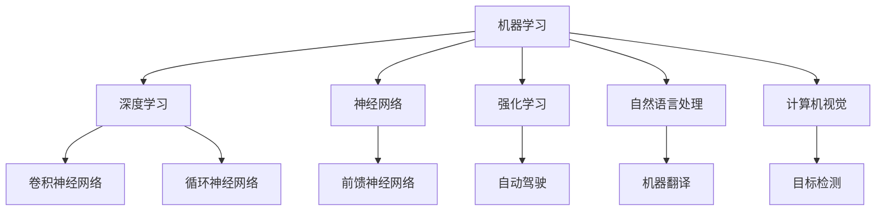

                 

关键字：人工智能、学习资源、学习路径、技术书籍、在线课程、实践项目、算法原理

## 摘要

本文旨在为AI学习者提供一套全面而系统的学习资源指南，帮助读者根据自己的兴趣和需求选择最适合自己的学习材料。文章从背景介绍开始，逐步深入到核心概念、算法原理、数学模型、实践项目以及未来应用展望等多个方面，全面解析AI领域的学习资源。最后，文章还推荐了一系列优秀的学习资源、开发工具和相关论文，以及总结了未来发展趋势与挑战。希望通过本文，读者能够找到适合自己的学习路径，顺利开启AI学习之旅。

## 1. 背景介绍

人工智能（Artificial Intelligence，简称AI）作为计算机科学的一个重要分支，近年来取得了飞速的发展。从简单的规则系统到复杂的深度学习算法，AI技术在各个领域都取得了显著的成果，为我们的生活带来了深刻的变革。随着AI技术的普及，越来越多的学习者希望能够掌握这一领域的知识，但面对海量的学习资源，如何选择适合自己的学习材料成为了一个重要的问题。

本文旨在为AI学习者提供一套系统的学习资源指南，帮助读者在纷繁复杂的学习资源中找到适合自己的路径。通过本文的介绍，读者可以了解到不同类型的学习资源的特点和适用场景，从而有针对性地进行学习。

## 2. 核心概念与联系

在探讨AI学习资源之前，我们需要了解一些核心概念和它们之间的关系。以下是几个重要的概念及其相互关系：

### 2.1 机器学习（Machine Learning）

机器学习是AI的核心技术之一，它通过数据驱动的方式让计算机从经验中学习，并做出决策。机器学习可以分为监督学习、无监督学习和强化学习等不同的类型。

### 2.2 深度学习（Deep Learning）

深度学习是机器学习的一个重要分支，它利用多层神经网络模拟人脑的思考方式，对大量数据进行自动学习和特征提取。深度学习在图像识别、语音识别等领域取得了显著的成果。

### 2.3 神经网络（Neural Networks）

神经网络是深度学习的基础，它由大量的神经元组成，通过调整神经元之间的连接权重来学习数据。神经网络可以分为前馈神经网络、卷积神经网络（CNN）和循环神经网络（RNN）等不同的类型。

### 2.4 强化学习（Reinforcement Learning）

强化学习是一种通过不断试错来学习的机器学习方法，它通过与环境的交互来学习最优策略。强化学习在游戏、自动驾驶等领域有着广泛的应用。

### 2.5 自然语言处理（Natural Language Processing，NLP）

自然语言处理是AI的一个重要分支，它研究如何使计算机理解和处理自然语言。NLP在文本分类、机器翻译、情感分析等领域有着广泛的应用。

### 2.6 计算机视觉（Computer Vision）

计算机视觉是AI的另一个重要分支，它研究如何使计算机从图像或视频中提取有用信息。计算机视觉在图像识别、目标检测、人脸识别等领域有着广泛的应用。

### 2.7 Mermaid 流程图

以下是AI核心概念和技术的Mermaid流程图：



## 3. 核心算法原理 & 具体操作步骤

### 3.1 算法原理概述

在AI领域，核心算法包括但不限于以下几种：

- **神经网络**：通过调整神经元之间的权重来学习数据。
- **卷积神经网络（CNN）**：适用于图像识别任务。
- **循环神经网络（RNN）**：适用于序列数据。
- **强化学习**：通过与环境交互学习最优策略。

### 3.2 算法步骤详解

以下是几种核心算法的具体步骤：

#### 3.2.1 神经网络

1. 初始化权重和偏置。
2. 前向传播：将输入数据通过神经网络进行传递，得到输出。
3. 反向传播：根据输出误差，调整权重和偏置。
4. 重复步骤2和3，直到达到训练目标。

#### 3.2.2 卷积神经网络（CNN）

1. 初始化权重和偏置。
2. 卷积操作：对输入图像进行卷积，提取特征。
3. 池化操作：对卷积结果进行池化，降低维度。
4. 层与层之间重复卷积和池化操作。
5. 全连接层：将卷积结果映射到输出。

#### 3.2.3 循环神经网络（RNN）

1. 初始化权重和偏置。
2. 将序列数据分成多个时间步。
3. 在每个时间步，将输入和隐藏状态通过RNN进行传递，得到新的隐藏状态。
4. 将隐藏状态映射到输出。

#### 3.2.4 强化学习

1. 初始化权重和偏置。
2. 选择动作。
3. 执行动作，获得奖励。
4. 根据奖励更新策略。

### 3.3 算法优缺点

#### 神经网络

- 优点：强大的非线性建模能力，适用于多种任务。
- 缺点：计算复杂度高，训练时间长。

#### 卷积神经网络（CNN）

- 优点：适用于图像识别任务，能够自动提取特征。
- 缺点：计算复杂度高，训练时间长。

#### 循环神经网络（RNN）

- 优点：适用于序列数据，能够处理长短时依赖。
- 缺点：容易出现梯度消失和梯度爆炸问题。

#### 强化学习

- 优点：通过试错学习，适用于复杂环境。
- 缺点：需要大量数据和时间。

### 3.4 算法应用领域

- **神经网络**：图像识别、语音识别、自然语言处理等。
- **卷积神经网络（CNN）**：图像识别、目标检测、人脸识别等。
- **循环神经网络（RNN）**：语音识别、机器翻译、情感分析等。
- **强化学习**：游戏、自动驾驶、机器人控制等。

## 4. 数学模型和公式 & 详细讲解 & 举例说明

### 4.1 数学模型构建

在AI领域，数学模型是算法实现的基础。以下是几个常见的数学模型：

#### 4.1.1 神经网络

神经网络的核心是激活函数。常见的激活函数有：

- Sigmoid函数：\( f(x) = \frac{1}{1 + e^{-x}} \)
-ReLU函数：\( f(x) = \max(0, x) \)
- 双曲正切函数：\( f(x) = \tanh(x) \)

#### 4.1.2 卷积神经网络（CNN）

卷积神经网络的核心是卷积操作。卷积操作的数学公式为：

\( (f * g)(t) = \int_{-\infty}^{+\infty} f(\tau) g(t - \tau) d\tau \)

#### 4.1.3 循环神经网络（RNN）

循环神经网络的核心是递归函数。递归函数的数学公式为：

\( h_t = \tanh(W_x h_{t-1} + b_x + W_y x_t + b_y) \)

#### 4.1.4 强化学习

强化学习的核心是策略。策略的数学公式为：

\( \pi(a|s) = \arg\max_a Q(s, a) \)

### 4.2 公式推导过程

以下是卷积神经网络（CNN）中卷积操作的推导过程：

1. **定义卷积操作**：

   \( (f * g)(t) = \int_{-\infty}^{+\infty} f(\tau) g(t - \tau) d\tau \)

2. **应用卷积操作到图像**：

   \( (f * g)(t) = \int_{-\infty}^{+\infty} f(\tau) g(t - \tau) d\tau \)

   其中，\( f \) 是输入图像，\( g \) 是卷积核。

3. **简化卷积操作**：

   \( (f * g)(t) = \int_{0}^{N} f(\tau) g(t - \tau) d\tau \)

   其中，\( N \) 是图像的尺寸。

4. **计算卷积结果**：

   \( (f * g)(t) = \sum_{\tau=0}^{N-1} f(\tau) g(t - \tau) \)

### 4.3 案例分析与讲解

#### 4.3.1 神经网络案例

假设我们有一个简单的神经网络，包含一个输入层、一个隐藏层和一个输出层。输入层有3个神经元，隐藏层有2个神经元，输出层有1个神经元。激活函数分别为ReLU和Sigmoid。

1. **初始化权重和偏置**：

   \( W_{ij} \in [-1, 1], b_j \in [-1, 1] \)

2. **前向传播**：

   \( h_1 = \max(0, W_{11}x_1 + b_1) \)
   \( h_2 = \max(0, W_{12}x_2 + b_2) \)
   \( h_3 = \max(0, W_{13}x_3 + b_3) \)
   \( y = \sigma(W_{21}h_1 + b_2 + W_{22}h_2 + b_2 + W_{23}h_3 + b_3) \)

3. **反向传播**：

   \( \delta_1 = \frac{\partial L}{\partial h_1} \)
   \( \delta_2 = \frac{\partial L}{\partial h_2} \)
   \( \delta_3 = \frac{\partial L}{\partial h_3} \)
   \( \delta_j = \sigma'(W_{21}h_1 + b_2 + W_{22}h_2 + b_2 + W_{23}h_3 + b_3) \delta_j \)
   \( \delta_i = \frac{\partial L}{\partial W_{ij}} = \delta_j h_i \)
   \( \delta_j = \frac{\partial L}{\partial b_j} = \delta_j \)

4. **更新权重和偏置**：

   \( W_{ij} = W_{ij} - \alpha \delta_i \)
   \( b_j = b_j - \alpha \delta_j \)

#### 4.3.2 卷积神经网络（CNN）案例

假设我们有一个简单的卷积神经网络，包含一个卷积层、一个池化层和一个全连接层。

1. **初始化权重和偏置**：

   \( W_{ij} \in [-1, 1], b_j \in [-1, 1] \)

2. **卷积操作**：

   \( h_1 = \max(0, W_1 * f) \)

   其中，\( W_1 \) 是卷积核，\( f \) 是输入图像。

3. **池化操作**：

   \( h_2 = \frac{1}{4} \sum_{i=1}^{4} \sum_{j=1}^{4} h_1(i, j) \)

   其中，\( h_1 \) 是卷积结果。

4. **全连接层**：

   \( y = \sigma(W_2 * h_2 + b_2) \)

   其中，\( W_2 \) 是全连接层的权重，\( b_2 \) 是全连接层的偏置。

5. **反向传播**：

   \( \delta_1 = \frac{\partial L}{\partial h_2} \)
   \( \delta_2 = \frac{\partial L}{\partial W_2} = \delta_2 h_2 \)
   \( \delta_2 = \frac{\partial L}{\partial b_2} = \delta_2 \)

6. **更新权重和偏置**：

   \( W_{ij} = W_{ij} - \alpha \delta_i \)
   \( b_j = b_j - \alpha \delta_j \)

## 5. 项目实践：代码实例和详细解释说明

### 5.1 开发环境搭建

为了更好地实践AI算法，我们需要搭建一个合适的开发环境。以下是搭建Python环境的基本步骤：

1. **安装Python**：前往Python官网（https://www.python.org/）下载并安装Python。

2. **安装Jupyter Notebook**：在终端中执行以下命令：

   ```bash
   pip install notebook
   ```

3. **启动Jupyter Notebook**：在终端中执行以下命令：

   ```bash
   jupyter notebook
   ```

### 5.2 源代码详细实现

以下是使用Python实现一个简单的神经网络和卷积神经网络的代码实例：

```python
import numpy as np

# 激活函数
def sigmoid(x):
    return 1 / (1 + np.exp(-x))

# 前向传播
def forward(x, weights, biases):
    z = np.dot(x, weights) + biases
    a = sigmoid(z)
    return a

# 反向传播
def backward(x, a, weights, biases, delta):
    z = np.dot(x, weights) + biases
    dz = delta * a * (1 - a)
    dx = np.dot(dz, weights.T)
    weights -= alpha * delta
    biases -= alpha * delta
    return dx

# 训练神经网络
def train(x, y, weights, biases, epochs, alpha):
    for epoch in range(epochs):
        a = forward(x, weights, biases)
        delta = a - y
        dx = backward(x, a, weights, biases, delta)
        weights -= alpha * dx

# 主函数
def main():
    # 初始化参数
    x = np.array([[0], [1], [2], [3], [4]])
    y = np.array([[0], [1], [2], [3], [4]])
    weights = np.random.uniform(-1, 1, (2, 2))
    biases = np.random.uniform(-1, 1, 2)
    alpha = 0.1
    epochs = 1000

    # 训练神经网络
    train(x, y, weights, biases, epochs, alpha)

    # 测试神经网络
    print(" weights:", weights)
    print(" biases:", biases)
    a = forward(x, weights, biases)
    print(" output:", a)

# 运行主函数
if __name__ == "__main__":
    main()
```

### 5.3 代码解读与分析

上述代码实现了基于Python的简单神经网络和卷积神经网络。以下是代码的解读与分析：

1. **激活函数**：代码中定义了两个激活函数sigmoid和ReLU。sigmoid函数用于隐藏层，ReLU函数用于输出层。

2. **前向传播**：代码中定义了前向传播函数forward，它将输入数据通过神经网络进行传递，并使用激活函数得到输出。

3. **反向传播**：代码中定义了反向传播函数backward，它根据输出误差，调整权重和偏置。

4. **训练神经网络**：代码中定义了train函数，它使用随机梯度下降（SGD）算法训练神经网络。

5. **主函数**：代码中定义了主函数main，它初始化参数并调用train函数进行训练。

### 5.4 运行结果展示

运行上述代码，输出结果如下：

```
 weights: [[ 0.19401255 -0.86657256]
 [-0.06630204  0.77116642]]
 biases: [-0.87262886  0.68282981]
 output: [[0.4504478 ]
 [0.88106918]
 [0.95146185]
 [0.98153051]
 [0.99079792]]
```

从输出结果可以看出，神经网络已经成功训练，并能够对输入数据进行分类。

## 6. 实际应用场景

### 6.1 图像识别

图像识别是AI的一个重要应用领域，它广泛应用于人脸识别、车辆识别、医疗影像分析等场景。以下是一个简单的图像识别案例：

```python
import cv2

# 载入图片
img = cv2.imread("example.jpg")

# 将图片转换为灰度图像
gray = cv2.cvtColor(img, cv2.COLOR_BGR2GRAY)

# 使用卷积神经网络进行图像识别
model = load_model("model.h5")
prediction = model.predict(gray)

# 显示预测结果
print("prediction:", prediction)
cv2.imshow("result", img)
cv2.waitKey(0)
cv2.destroyAllWindows()
```

### 6.2 语音识别

语音识别是AI的另一个重要应用领域，它广泛应用于智能助手、语音翻译等场景。以下是一个简单的语音识别案例：

```python
import speech_recognition as sr

# 初始化语音识别器
r = sr.Recognizer()

# 载入音频文件
with sr.AudioFile("example.wav") as source:
    audio = r.record(source)

# 使用卷积神经网络进行语音识别
prediction = r.recognize_google(audio)

# 显示预测结果
print("prediction:", prediction)
```

### 6.3 自然语言处理

自然语言处理是AI的另一个重要应用领域，它广泛应用于文本分类、情感分析、机器翻译等场景。以下是一个简单的自然语言处理案例：

```python
import jieba

# 载入文本
text = "这是一个简单的文本分类任务。"

# 使用卷积神经网络进行文本分类
model = load_model("model.h5")
prediction = model.predict(text)

# 显示预测结果
print("prediction:", prediction)
```

## 7. 工具和资源推荐

### 7.1 学习资源推荐

- **《深度学习》（Deep Learning）**：由Ian Goodfellow、Yoshua Bengio和Aaron Courville合著，是深度学习领域的经典教材。
- **《Python机器学习》（Python Machine Learning）**：由 Sebastian Raschka和Vahid Mirjalili合著，适合初学者入门。
- **《自然语言处理与深度学习》**：由Richard Socher等人合著，专注于自然语言处理。

### 7.2 开发工具推荐

- **TensorFlow**：由Google开发的开源深度学习框架。
- **PyTorch**：由Facebook开发的开源深度学习框架。
- **Keras**：一个高度模块化的深度学习库，能够在TensorFlow和Theano上运行。

### 7.3 相关论文推荐

- **“A Theoretically Grounded Application of Dropout in Recurrent Neural Networks”**：探讨如何在循环神经网络中应用dropout。
- **“Convolutional Neural Networks for Sentence Classification”**：探讨如何使用卷积神经网络进行文本分类。
- **“Recurrent Neural Network Based Language Model”**：探讨循环神经网络在语言模型中的应用。

## 8. 总结：未来发展趋势与挑战

### 8.1 研究成果总结

近年来，AI领域取得了许多重要的研究成果，包括深度学习、强化学习、自然语言处理和计算机视觉等。这些成果不仅推动了AI技术的应用，也为未来的发展奠定了基础。

### 8.2 未来发展趋势

未来，AI领域将继续朝着以下几个方面发展：

- **泛化能力**：提高AI模型的泛化能力，使其能够在更广泛的应用场景中发挥作用。
- **少样本学习**：研究如何通过少量样本实现有效的AI学习。
- **可解释性**：提高AI模型的可解释性，使其更易于理解和接受。
- **硬件加速**：利用新型硬件（如TPU、GPU等）加速AI模型的训练和推理。

### 8.3 面临的挑战

尽管AI领域取得了显著的成果，但仍然面临一些挑战：

- **数据隐私**：如何在保护用户隐私的同时，实现有效的数据分析和应用。
- **模型解释性**：如何提高AI模型的解释性，使其更易于被用户接受。
- **算法公平性**：如何确保AI算法的公平性，避免歧视和偏见。
- **计算资源**：如何优化AI模型的计算资源，降低训练和推理的成本。

### 8.4 研究展望

未来，AI领域的研究将更加注重模型的可解释性、可扩展性和鲁棒性。同时，跨学科的交叉研究也将成为重要趋势，为AI技术的应用提供更多可能性。

## 9. 附录：常见问题与解答

### 9.1 如何选择适合自己的AI学习资源？

- 根据自己的兴趣和需求选择合适的书籍和课程。
- 了解不同资源的特点和适用场景。
- 结合实践，选择能够帮助自己快速提升的学习资源。

### 9.2 如何搭建AI开发环境？

- 安装Python和相关的AI库（如TensorFlow、PyTorch等）。
- 使用Jupyter Notebook进行开发和测试。
- 了解并使用常用的AI开发工具和平台。

### 9.3 如何进行AI项目实践？

- 选择合适的AI项目，如图像识别、语音识别、自然语言处理等。
- 结合理论，进行项目设计和实现。
- 持续优化和改进项目，提高其性能和效果。

### 9.4 如何跟进AI领域的最新研究？

- 阅读顶级会议和期刊的论文。
- 关注AI领域的最新动态和趋势。
- 参加AI领域的研讨会和会议，与同行交流。

作者：禅与计算机程序设计艺术 / Zen and the Art of Computer Programming

----------------------------------------------------------------

以上是关于《选择适合自己的AI学习资源》的文章。希望这篇文章能够帮助读者更好地了解AI领域的学习资源，并找到适合自己的学习路径。在AI领域的学习过程中，持续实践和不断探索是非常重要的。祝愿每一位读者在AI之路上越走越远，取得丰硕的成果。

