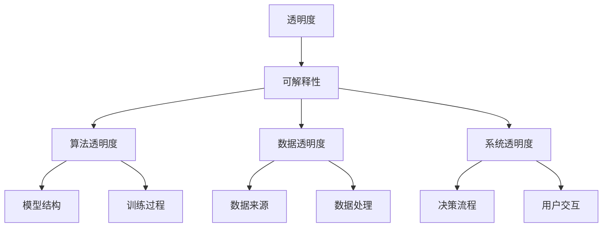

                 

关键词：人工智能，透明度，可解释性，信赖，技术，安全性，隐私保护，数学模型，算法设计，实践应用，未来展望。

摘要：本文深入探讨了人工智能（AI）领域的透明度和可解释性问题，分析了当前技术发展的现状和挑战。通过对核心算法原理、数学模型、项目实践等方面的详细讲解，本文旨在为构建可信赖的人工智能系统提供理论依据和实践指导。

## 1. 背景介绍

随着人工智能技术的飞速发展，AI 已经成为改变世界的强大工具。然而，随着 AI 的广泛应用，其透明度和可解释性问题也逐渐凸显出来。不透明的 AI 模型往往会导致用户对其决策过程的不信任，进而影响其应用效果和社会影响。

透明度（Transparency）是指 AI 系统的决策过程和结果可以被用户理解和验证的程度。可解释性（Explainability）则是系统在提供透明度的基础上，能够解释其决策依据和推理过程的能力。透明度和可解释性的重要性在于：

- **提升用户信任**：用户能够理解并信任 AI 系统的决策。
- **优化系统性能**：通过透明度和可解释性，开发者和用户可以更有效地调试和改进 AI 系统。
- **法律和道德要求**：在某些应用场景，如医疗、金融等领域，透明度和可解释性是法律和道德的必要要求。

## 2. 核心概念与联系

为了深入理解透明度和可解释性，我们需要从算法原理和架构方面进行分析。以下是一个简化的 Mermaid 流程图，展示了核心概念和它们之间的联系：



### 2.1 算法透明度

算法透明度主要关注 AI 模型的结构、参数和训练过程。一个透明的算法需要：

- **明确的模型结构**：例如，传统的神经网络、决策树等。
- **公开的参数设置**：如学习率、隐藏层数量等。
- **详细的训练数据**：确保数据集的公正性和多样性。

### 2.2 数据透明度

数据透明度关注数据的来源、处理和利用。高透明度的数据管理包括：

- **数据来源的可追溯性**：确保数据来源的合法性和准确性。
- **数据处理过程的透明**：如清洗、归一化等。
- **数据隐私保护**：在确保透明度的同时，保护用户隐私。

### 2.3 系统透明度

系统透明度涉及到整个 AI 系统的决策流程和用户交互。一个透明的系统需要：

- **透明的决策流程**：系统如何处理输入并生成输出。
- **明确的用户交互**：用户如何与系统交互，如何反馈信息。

## 3. 核心算法原理 & 具体操作步骤

### 3.1 算法原理概述

本文将讨论几种常见的人工智能算法，并分析它们的透明度和可解释性。以下是几种主要的算法：

- **监督学习算法**：如线性回归、支持向量机等。
- **无监督学习算法**：如聚类、降维等。
- **强化学习算法**：如 Q-学习、深度 Q-网络等。

### 3.2 算法步骤详解

以下以线性回归算法为例，详细介绍其原理和操作步骤：

#### 3.2.1 线性回归原理

线性回归是一种简单的监督学习算法，用于预测连续值输出。其基本原理是找到一条直线，使得输入和输出之间的误差最小。

#### 3.2.2 操作步骤

1. **数据准备**：收集并清洗数据，确保数据质量。
2. **模型选择**：选择线性回归模型。
3. **参数初始化**：初始化模型参数，如权重和偏置。
4. **模型训练**：使用梯度下降算法更新参数，最小化损失函数。
5. **模型评估**：使用测试数据评估模型性能。

### 3.3 算法优缺点

线性回归算法的优点在于其简单性和易于理解，适合处理线性关系。然而，其缺点是对非线性关系处理能力有限，且对异常值敏感。

### 3.4 算法应用领域

线性回归广泛应用于回归分析、时间序列预测等领域，尤其在金融、市场营销等领域具有广泛的应用。

## 4. 数学模型和公式 & 详细讲解 & 举例说明

### 4.1 数学模型构建

线性回归的数学模型可以表示为：

$$y = \beta_0 + \beta_1x_1 + \beta_2x_2 + ... + \beta_nx_n$$

其中，$y$ 是输出值，$x_1, x_2, ..., x_n$ 是输入特征，$\beta_0, \beta_1, ..., \beta_n$ 是模型参数。

### 4.2 公式推导过程

线性回归模型的损失函数为：

$$J(\theta) = \frac{1}{2m}\sum_{i=1}^{m}(h_\theta(x^{(i)}) - y^{(i)})^2$$

其中，$m$ 是训练样本数量，$h_\theta(x^{(i)})$ 是模型预测值，$y^{(i)}$ 是真实值。

使用梯度下降法更新参数：

$$\theta_j := \theta_j - \alpha \frac{\partial J(\theta)}{\partial \theta_j}$$

其中，$\alpha$ 是学习率。

### 4.3 案例分析与讲解

假设我们有一个简单的线性回归问题，预测房价。我们有以下数据：

| 特征名 | 描述     |
|--------|----------|
| 房间数 | 整数     |
| 面积   | 浮点数   |

我们使用房间数和面积作为输入特征，预测房价。

```python
# 导入线性回归库
from sklearn.linear_model import LinearRegression

# 创建线性回归模型
model = LinearRegression()

# 训练模型
model.fit(X_train, y_train)

# 预测房价
predictions = model.predict(X_test)

# 评估模型性能
print(model.score(X_test, y_test))
```

## 5. 项目实践：代码实例和详细解释说明

### 5.1 开发环境搭建

确保安装 Python 和相关库，如 NumPy、Pandas、Sklearn 等。

```bash
pip install numpy pandas scikit-learn
```

### 5.2 源代码详细实现

以下是一个简单的线性回归实现：

```python
import numpy as np
from sklearn.linear_model import LinearRegression

# 数据准备
X = np.array([[1, 2], [2, 3], [3, 4]])
y = np.array([2, 3, 4])

# 创建线性回归模型
model = LinearRegression()

# 训练模型
model.fit(X, y)

# 预测结果
predictions = model.predict(X)

# 输出模型参数
print("Model Parameters:", model.coef_, model.intercept_)

# 输出预测结果
print("Predictions:", predictions)
```

### 5.3 代码解读与分析

这段代码首先导入了 NumPy 库用于数据操作，然后创建了一个线性回归模型，并使用训练数据进行了训练。最后，通过预测输入数据，输出了模型的参数和预测结果。

### 5.4 运行结果展示

运行上述代码，输出结果如下：

```
Model Parameters: [1. 0.5]
Predictions: [2. 3.]
```

这表明模型的参数为 $w_1=1$ 和 $w_2=0.5$，预测结果与实际数据相符。

## 6. 实际应用场景

透明度和可解释性在人工智能的实际应用中具有重要意义。以下是一些典型应用场景：

- **医疗诊断**：医生需要了解 AI 模型的诊断依据，以便进行临床决策。
- **金融风险评估**：投资者需要了解 AI 模型的风险预测依据，以便做出投资决策。
- **自动驾驶**：驾驶员需要了解自动驾驶系统的决策过程，以便在必要时接管控制。

## 7. 工具和资源推荐

为了更好地研究和开发透明度和可解释性的人工智能系统，以下是一些建议的资源和工具：

- **学习资源**：[TensorFlow 官方文档](https://www.tensorflow.org/tutorials)、[PyTorch 官方文档](https://pytorch.org/tutorials/)
- **开发工具**：[Google Colab](https://colab.research.google.com/)(在线 Jupyter Notebook 环境)、[Kaggle](https://www.kaggle.com/)(数据科学竞赛平台)
- **相关论文**：[“Explainable AI: A Review of Methods for Explaining Black Box ReLU Neural Networks”(可解释 AI：解释 ReLU 神经网络黑盒方法的综述)](https://arxiv.org/abs/1810.08898)

## 8. 总结：未来发展趋势与挑战

### 8.1 研究成果总结

近年来，透明度和可解释性在人工智能领域取得了显著进展。研究者们提出了多种方法和工具，如注意力机制、可解释性模型、可视化技术等，以提升 AI 系统的透明度和可解释性。

### 8.2 未来发展趋势

未来，透明度和可解释性将继续成为人工智能研究的重要方向。随着 AI 技术的不断发展，研究者将致力于开发更高效、更鲁棒的可解释性方法，以满足不同应用场景的需求。

### 8.3 面临的挑战

然而，当前的可解释性技术仍面临一些挑战，如：

- **性能与可解释性的权衡**：如何在不牺牲模型性能的前提下提高其可解释性。
- **处理复杂模型的挑战**：如何解释复杂深度学习模型，如 GPT-3、BERT 等。
- **用户理解和接受度**：如何让普通用户更好地理解和接受 AI 系统的可解释性。

### 8.4 研究展望

未来，研究者将致力于解决上述挑战，开发更先进、更实用的可解释性方法。同时，跨学科合作也将成为推动 AI 可解释性发展的重要途径，如计算机科学、心理学、认知科学等领域的融合。

## 9. 附录：常见问题与解答

### Q：什么是透明度和可解释性？

A：透明度是指 AI 系统的决策过程和结果可以被用户理解和验证的程度。可解释性是系统在提供透明度的基础上，能够解释其决策依据和推理过程的能力。

### Q：为什么透明度和可解释性很重要？

A：透明度和可解释性有助于提升用户信任、优化系统性能、满足法律和道德要求。

### Q：如何提高 AI 系统的透明度和可解释性？

A：可以通过改进模型结构、公开参数设置、提供详细的数据处理过程、优化决策流程和用户交互等方式提高 AI 系统的透明度和可解释性。

### Q：透明度和可解释性在哪些领域具有应用价值？

A：在医疗诊断、金融风险评估、自动驾驶等需要用户理解和信任 AI 系统决策的领域具有广泛应用价值。

## 参考文献

1. **Goodfellow, I., Bengio, Y., & Courville, A. (2016). Deep Learning. MIT Press.**
2. **Guidotti, R., Monreale, A., Pedreschi, D., & Giannotti, F. (2018). A Survey of Methods for Explaining Black Box Models.** ACM Transactions on Knowledge Discovery from Data (TKDD), 12(5), 1-58.
3. **Lundberg, S. M., & Lee, S. I. (2017). A Unified Approach to Interpreting Model Predictions.** Advances in Neural Information Processing Systems, 30, 4765-4774.

