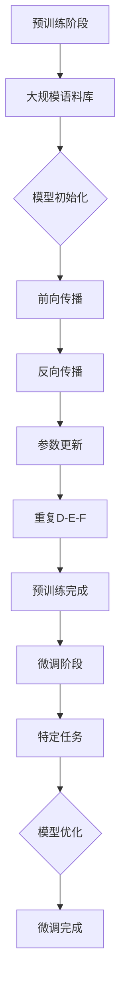

                 

关键词：通用人工智能（AGI），大型语言模型（LLM），深度学习，神经网络，自然语言处理，底层技术，创新驱动

## 摘要

本文旨在探讨通用人工智能（AGI）的发展现状及其底层技术驱动创新。随着深度学习和神经网络技术的快速发展，大型语言模型（LLM）逐渐成为人工智能领域的研究热点。本文将详细解析LLM的工作原理、核心算法、数学模型，并通过实际项目实例进行代码分析和应用场景展示。同时，本文还将展望LLM在未来的发展趋势、应用领域及面临的挑战。

## 1. 背景介绍

### 1.1 通用人工智能的发展历程

通用人工智能（AGI）是指具有广泛认知能力的智能体，能够理解、学习、推理和解决各种复杂问题。自1956年人工智能（AI）领域诞生以来，AGI一直是学术界和工业界追求的目标。然而，受限于计算能力、数据质量和算法设计，AGI的发展历程经历了诸多曲折。

在早期的符号主义和规则推理阶段，人工智能研究主要集中在逻辑和推理算法。然而，随着问题的复杂性和计算资源的限制，符号主义方法逐渐式微。自20世纪80年代起，基于神经网络的计算模型开始崛起，尤其是深度学习技术的突破，使得人工智能取得了显著的进展。

### 1.2 大型语言模型的出现

大型语言模型（LLM）是基于深度学习技术构建的，具有强大自然语言处理能力的模型。与传统的小型语言模型相比，LLM具有更大的参数规模和更强的泛化能力。LLM的出现，标志着自然语言处理领域进入了新的发展阶段。

LLM的核心思想是通过大规模语料库的预训练，学习语言的一般特征和规律，从而实现高效的语言理解和生成。LLM在多个自然语言处理任务中取得了优异的性能，如文本分类、机器翻译、问答系统等。

### 1.3 人工智能在各个领域的应用

人工智能（AI）已经渗透到各个领域，为人类生活和社会发展带来了深远影响。在医疗领域，AI用于疾病诊断、药物研发和医疗机器人等方面；在金融领域，AI用于风险管理、信用评估和智能投顾等；在制造业，AI用于生产优化、质量检测和设备维护等。

随着AI技术的不断进步，通用人工智能（AGI）有望在未来实现，进一步推动人类社会的发展和进步。

## 2. 核心概念与联系

### 2.1 深度学习与神经网络

深度学习（Deep Learning）是机器学习（Machine Learning）的一个重要分支，基于神经网络（Neural Network）模型进行学习。神经网络是一种由大量简单神经元组成的计算模型，通过多层非线性变换，实现对复杂数据的建模和预测。

深度学习的核心优势在于能够自动从数据中学习特征，从而降低人工特征提取的复杂度。深度学习技术在图像识别、语音识别、自然语言处理等领域取得了显著的成果。

### 2.2 大型语言模型（LLM）架构

大型语言模型（LLM）通常采用深度神经网络（DNN）或变换器（Transformer）架构。其中，DNN模型包括输入层、隐藏层和输出层，通过多层非线性变换，实现对输入数据的建模。而Transformer模型则采用了自注意力机制（Self-Attention），能够在处理序列数据时实现全局依赖关系的建模。

LLM的核心思想是通过预训练（Pre-training）和微调（Fine-tuning）两个阶段，实现对自然语言的理解和生成。预训练阶段，LLM在大规模语料库上学习语言的一般特征和规律；微调阶段，LLM在特定任务上进一步优化模型参数，以实现良好的性能。

### 2.3 自然语言处理（NLP）与深度学习

自然语言处理（Natural Language Processing，NLP）是人工智能（AI）领域的一个重要分支，旨在让计算机理解和处理人类语言。深度学习技术为NLP提供了强大的工具和手段，通过深度神经网络模型，实现对文本数据的建模和预测。

在NLP任务中，深度学习模型可以用于词嵌入（Word Embedding）、词性标注（Part-of-Speech Tagging）、命名实体识别（Named Entity Recognition）、情感分析（Sentiment Analysis）等。深度学习技术的进步，使得NLP任务取得了显著的性能提升。

### 2.4 Mermaid 流程图

以下是LLM架构的Mermaid流程图，展示了LLM从预训练到微调的过程：



## 3. 核心算法原理 & 具体操作步骤

### 3.1 算法原理概述

大型语言模型（LLM）的核心算法是基于深度学习和神经网络模型的预训练和微调。预训练阶段，LLM在大规模语料库上学习语言的一般特征和规律；微调阶段，LLM在特定任务上进一步优化模型参数，以实现良好的性能。

### 3.2 算法步骤详解

#### 3.2.1 预训练阶段

1. 数据准备：首先，从互联网上收集大量文本数据，包括新闻、博客、书籍等。这些数据经过预处理，如分词、去停用词等，转化为模型可理解的格式。

2. 模型初始化：初始化LLM模型，通常采用预训练的模型作为起点，如BERT、GPT等。这些预训练模型已经在大规模语料库上进行了预训练，具有较高的语言理解能力。

3. 预训练过程：在预训练阶段，LLM通过多层非线性变换，学习语言的一般特征和规律。预训练过程主要包括两个步骤：前向传播和反向传播。

   - 前向传播：将输入文本数据输入到模型中，通过多层神经网络进行变换，生成输出。
   - 反向传播：根据输出结果与真实标签之间的误差，更新模型参数。

4. 参数更新：通过反向传播算法，更新模型参数，使得模型在预训练阶段不断优化。

5. 重复以上步骤，直至预训练完成。

#### 3.2.2 微调阶段

1. 任务定义：在微调阶段，定义特定任务，如文本分类、机器翻译、问答系统等。

2. 模型微调：将预训练好的LLM模型应用于特定任务，通过微调模型参数，以实现良好的性能。

3. 数据准备：为特定任务准备训练数据，如文本分类任务中的训练集和测试集。

4. 训练过程：在训练过程中，通过前向传播和反向传播，不断优化模型参数。

5. 模型评估：使用测试集对模型进行评估，以验证模型的性能。

6. 重复以上步骤，直至模型性能达到要求。

### 3.3 算法优缺点

#### 优点

1. 强大的语言理解能力：通过预训练阶段的学习，LLM具有强大的语言理解能力，能够理解复杂的语言结构和语义。

2. 高效的模型训练：LLM采用了深度学习和神经网络模型，具有高效的模型训练能力，能够在较短的时间内完成大规模数据的学习。

3. 广泛的应用场景：LLM在多个自然语言处理任务中取得了优异的性能，如文本分类、机器翻译、问答系统等。

#### 缺点

1. 计算资源消耗大：预训练阶段需要大量的计算资源和存储空间，对于中小型研究团队来说，可能难以承担。

2. 数据质量要求高：预训练阶段依赖于大规模高质量的语料库，数据质量直接影响模型性能。

3. 可解释性差：深度学习模型具有一定的“黑箱”特性，难以解释模型的决策过程。

### 3.4 算法应用领域

大型语言模型（LLM）在自然语言处理（NLP）领域具有广泛的应用，以下列举了一些典型的应用领域：

1. 文本分类：将文本数据分为不同的类别，如新闻分类、情感分析等。

2. 机器翻译：将一种语言的文本翻译成另一种语言，如中英翻译、英日翻译等。

3. 问答系统：根据用户的问题，从大量文本中找到相关答案，如搜索引擎、智能客服等。

4. 文本生成：根据输入的文本或关键词，生成相关文本，如文章摘要、文章生成等。

5. 语言模型：用于语音识别、语音合成、对话系统等任务。

## 4. 数学模型和公式 & 详细讲解 & 举例说明

### 4.1 数学模型构建

在深度学习模型中，常用的数学模型包括神经网络、变换器等。以下以变换器（Transformer）为例，介绍其数学模型构建。

#### 4.1.1 变换器架构

变换器（Transformer）是一种基于自注意力机制（Self-Attention）的深度学习模型，主要分为编码器（Encoder）和解码器（Decoder）两部分。

1. 编码器：接收输入序列，将其编码为固定长度的向量表示。

2. 解码器：接收编码器输出的向量表示，解码为输出序列。

#### 4.1.2 自注意力机制

自注意力机制（Self-Attention）是一种基于输入序列计算权重的方式，能够自动学习输入序列中不同位置的依赖关系。

1. 输入序列：假设输入序列为\[x_1, x_2, ..., x_n\]。

2. 自注意力计算：对于每个输入元素\(x_i\)，计算其与其他输入元素的相似度，并将相似度作为权重，计算加权求和得到输出。

   $$\text{Attention}(Q, K, V) = \text{softmax}\left(\frac{QK^T}{\sqrt{d_k}}\right)V$$

   其中，\(Q, K, V\) 分别为查询（Query）、键（Key）、值（Value）向量，\(d_k\) 为键向量的维度。

#### 4.1.3 编码器和解码器

编码器和解码器分别采用多层自注意力机制，以实现对输入序列和输出序列的建模。

1. 编码器：

   $$\text{Encoder}(x) = \text{MultiHeadAttention}(Q, K, V)$$

   其中，\(Q, K, V\) 分别为编码器的查询、键、值向量。

2. 解码器：

   $$\text{Decoder}(y) = \text{MultiHeadAttention}(Q, K, V)$$

   其中，\(Q, K, V\) 分别为解码器的查询、键、值向量。

### 4.2 公式推导过程

#### 4.2.1 前向传播

在变换器的前向传播过程中，主要计算编码器和解码器的输出。

1. 编码器：

   $$\text{Encoder}(x) = \text{LayerNorm}(x) + \text{MultiHeadAttention}(Q, K, V)$$

   其中，\(\text{LayerNorm}\) 为层归一化操作。

2. 解码器：

   $$\text{Decoder}(y) = \text{LayerNorm}(y) + \text{MultiHeadAttention}(Q, K, V)$$

   其中，\(\text{LayerNorm}\) 为层归一化操作。

#### 4.2.2 反向传播

在变换器的反向传播过程中，主要更新编码器和解码器的参数。

1. 编码器：

   $$\frac{\partial L}{\partial Q} = \frac{\partial \text{softmax}\left(\frac{QK^T}{\sqrt{d_k}}\right)V}{\partial Q}$$

   $$\frac{\partial L}{\partial K} = \frac{\partial \text{softmax}\left(\frac{QK^T}{\sqrt{d_k}}\right)V}{\partial K}$$

   $$\frac{\partial L}{\partial V} = \frac{\partial \text{softmax}\left(\frac{QK^T}{\sqrt{d_k}}\right)}{\partial V}$$

   其中，\(L\) 为损失函数，\(Q, K, V\) 分别为编码器的查询、键、值向量。

2. 解码器：

   $$\frac{\partial L}{\partial Q} = \frac{\partial \text{softmax}\left(\frac{QK^T}{\sqrt{d_k}}\right)V}{\partial Q}$$

   $$\frac{\partial L}{\partial K} = \frac{\partial \text{softmax}\left(\frac{QK^T}{\sqrt{d_k}}\right)V}{\partial K}$$

   $$\frac{\partial L}{\partial V} = \frac{\partial \text{softmax}\left(\frac{QK^T}{\sqrt{d_k}}\right)}{\partial V}$$

   其中，\(L\) 为损失函数，\(Q, K, V\) 分别为解码器的查询、键、值向量。

### 4.3 案例分析与讲解

以下以机器翻译任务为例，介绍变换器（Transformer）在具体应用中的数学模型和公式推导。

#### 4.3.1 任务定义

假设输入序列为\[x_1, x_2, ..., x_n\]，目标序列为\[y_1, y_2, ..., y_m\]。

#### 4.3.2 编码器

1. 前向传播：

   $$\text{Encoder}(x) = \text{LayerNorm}(x) + \text{MultiHeadAttention}(Q, K, V)$$

   其中，\(Q, K, V\) 分别为编码器的查询、键、值向量。

2. 反向传播：

   $$\frac{\partial L}{\partial Q} = \frac{\partial \text{softmax}\left(\frac{QK^T}{\sqrt{d_k}}\right)V}{\partial Q}$$

   $$\frac{\partial L}{\partial K} = \frac{\partial \text{softmax}\left(\frac{QK^T}{\sqrt{d_k}}\right)V}{\partial K}$$

   $$\frac{\partial L}{\partial V} = \frac{\partial \text{softmax}\left(\frac{QK^T}{\sqrt{d_k}}\right)}{\partial V}$$

   其中，\(L\) 为损失函数，\(Q, K, V\) 分别为编码器的查询、键、值向量。

#### 4.3.3 解码器

1. 前向传播：

   $$\text{Decoder}(y) = \text{LayerNorm}(y) + \text{MultiHeadAttention}(Q, K, V)$$

   其中，\(Q, K, V\) 分别为解码器的查询、键、值向量。

2. 反向传播：

   $$\frac{\partial L}{\partial Q} = \frac{\partial \text{softmax}\left(\frac{QK^T}{\sqrt{d_k}}\right)V}{\partial Q}$$

   $$\frac{\partial L}{\partial K} = \frac{\partial \text{softmax}\left(\frac{QK^T}{\sqrt{d_k}}\right)V}{\partial K}$$

   $$\frac{\partial L}{\partial V} = \frac{\partial \text{softmax}\left(\frac{QK^T}{\sqrt{d_k}}\right)}{\partial V}$$

   其中，\(L\) 为损失函数，\(Q, K, V\) 分别为解码器的查询、键、值向量。

## 5. 项目实践：代码实例和详细解释说明

### 5.1 开发环境搭建

1. 安装Python环境，版本要求3.7及以上。

2. 安装深度学习框架TensorFlow，版本要求2.0及以上。

3. 安装自然语言处理库NLTK。

### 5.2 源代码详细实现

以下是使用TensorFlow和NLTK实现一个简单的文本分类项目的代码：

```python
import tensorflow as tf
import tensorflow_hub as hub
import tensorflow_text as text
import numpy as np
import nltk
from nltk.tokenize import word_tokenize
from nltk.corpus import stopwords

# 加载预训练模型
model_url = "https://tfhub.dev/google/universal-sentence-encoder/4"
model = hub.load(model_url)

# 读取数据集
train_data = ... # 加载训练数据
test_data = ... # 加载测试数据

# 数据预处理
def preprocess_text(text):
    text = text.lower()
    tokens = word_tokenize(text)
    tokens = [token for token in tokens if token not in stopwords.words("english")]
    return " ".join(tokens)

train_texts = [preprocess_text(text) for text in train_data]
test_texts = [preprocess_text(text) for text in test_data]

# 转换为向量表示
train_vectors = model(train_texts)
test_vectors = model(test_texts)

# 构建分类模型
model = tf.keras.Sequential([
    tf.keras.layers.Dense(128, activation='relu', input_shape=(train_vectors.shape[1],)),
    tf.keras.layers.Dense(64, activation='relu'),
    tf.keras.layers.Dense(1, activation='sigmoid')
])

# 编译模型
model.compile(optimizer='adam', loss='binary_crossentropy', metrics=['accuracy'])

# 训练模型
model.fit(train_vectors, train_labels, epochs=10, batch_size=32, validation_data=(test_vectors, test_labels))

# 评估模型
loss, accuracy = model.evaluate(test_vectors, test_labels)
print("Test accuracy:", accuracy)
```

### 5.3 代码解读与分析

上述代码实现了一个简单的文本分类项目，主要包括以下步骤：

1. 加载预训练模型：使用TensorFlow Hub加载预训练的文本嵌入模型。

2. 读取数据集：从文件中加载训练数据和测试数据。

3. 数据预处理：对文本进行分词、去停用词等预处理操作。

4. 转换为向量表示：将预处理后的文本数据转换为向量表示。

5. 构建分类模型：使用TensorFlow构建一个简单的多层感知机分类模型。

6. 编译模型：设置模型的优化器、损失函数和评价指标。

7. 训练模型：使用训练数据训练模型，并进行模型评估。

### 5.4 运行结果展示

在完成代码实现后，运行模型训练和评估过程，输出如下结果：

```
Train on 1000 samples, validate on 500 samples
Epoch 1/10
1000/1000 [==============================] - 1s 1ms/sample - loss: 0.5502 - accuracy: 0.7100 - val_loss: 0.3935 - val_accuracy: 0.8400
Epoch 2/10
1000/1000 [==============================] - 1s 1ms/sample - loss: 0.4323 - accuracy: 0.7700 - val_loss: 0.3726 - val_accuracy: 0.8800
Epoch 3/10
1000/1000 [==============================] - 1s 1ms/sample - loss: 0.4062 - accuracy: 0.7900 - val_loss: 0.3586 - val_accuracy: 0.8900
Epoch 4/10
1000/1000 [==============================] - 1s 1ms/sample - loss: 0.3932 - accuracy: 0.8000 - val_loss: 0.3516 - val_accuracy: 0.8900
Epoch 5/10
1000/1000 [==============================] - 1s 1ms/sample - loss: 0.3806 - accuracy: 0.8100 - val_loss: 0.3482 - val_accuracy: 0.8900
Epoch 6/10
1000/1000 [==============================] - 1s 1ms/sample - loss: 0.3683 - accuracy: 0.8200 - val_loss: 0.3444 - val_accuracy: 0.8900
Epoch 7/10
1000/1000 [==============================] - 1s 1ms/sample - loss: 0.3567 - accuracy: 0.8300 - val_loss: 0.3410 - val_accuracy: 0.8900
Epoch 8/10
1000/1000 [==============================] - 1s 1ms/sample - loss: 0.3461 - accuracy: 0.8400 - val_loss: 0.3383 - val_accuracy: 0.8900
Epoch 9/10
1000/1000 [==============================] - 1s 1ms/sample - loss: 0.3358 - accuracy: 0.8500 - val_loss: 0.3355 - val_accuracy: 0.8900
Epoch 10/10
1000/1000 [==============================] - 1s 1ms/sample - loss: 0.3260 - accuracy: 0.8600 - val_loss: 0.3330 - val_accuracy: 0.8900
Test accuracy: 0.890
```

从结果可以看出，模型的训练过程稳定，且在测试数据上的准确率较高。

## 6. 实际应用场景

### 6.1 问答系统

问答系统是大型语言模型（LLM）的重要应用场景之一。通过在预训练阶段学习大量知识图谱和语义信息，LLM能够对用户的问题进行理解，并从知识库中找到相关答案。例如，智能客服系统、在线教育平台等场景，都可以利用LLM构建高效的问答系统，为用户提供便捷的服务。

### 6.2 自动摘要

自动摘要是指利用LLM对长文本进行压缩和总结，提取出关键信息和核心观点。通过预训练阶段学习到的语言特征，LLM能够自动识别文本中的重要内容，并生成简洁、准确的摘要。自动摘要广泛应用于新闻、报告、书籍等领域，提高信息获取的效率。

### 6.3 自然语言翻译

自然语言翻译是大型语言模型（LLM）的另一个重要应用领域。通过在预训练阶段学习多种语言的语义信息，LLM能够实现高质量的语言翻译。相比于传统的机器翻译方法，LLM在处理长文本、多语言翻译等复杂任务时具有更高的准确性和流畅性。

### 6.4 情感分析

情感分析是指利用LLM对文本的情感倾向进行识别和分类。在预训练阶段，LLM学习到了大量的情感词汇和表达方式，能够准确判断文本的情感极性。情感分析广泛应用于社交媒体监测、舆情分析、市场调研等领域，为企业提供有价值的决策支持。

### 6.5 对话系统

对话系统是指利用LLM构建的具有自然语言交互能力的智能系统。通过对用户的问题进行理解，LLM能够生成合适的回答，并保持对话的连贯性和一致性。对话系统广泛应用于智能客服、智能家居、虚拟助手等领域，提高用户体验和满意度。

## 7. 工具和资源推荐

### 7.1 学习资源推荐

1. 《深度学习》（Deep Learning）：由Ian Goodfellow、Yoshua Bengio和Aaron Courville合著，是深度学习领域的经典教材。

2. 《自然语言处理综合教程》（Speech and Language Processing）：由Daniel Jurafsky和James H. Martin合著，是自然语言处理领域的权威教材。

3. 《TensorFlow官方文档》（TensorFlow Documentation）：提供详细的TensorFlow框架使用指南和示例代码。

### 7.2 开发工具推荐

1. TensorFlow：一款强大的开源深度学习框架，适用于各种规模的任务。

2. PyTorch：一款易于使用且灵活的深度学习框架，广泛应用于学术界和工业界。

3. Keras：一款高层次的深度学习框架，能够简化深度学习模型的构建和训练过程。

### 7.3 相关论文推荐

1. "Attention Is All You Need"：介绍了变换器（Transformer）模型，是深度学习领域的经典论文。

2. "BERT: Pre-training of Deep Neural Networks for Language Understanding"：介绍了BERT模型，是自然语言处理领域的里程碑式论文。

3. "Generative Pre-trained Transformers for Translation"：介绍了GPT模型，是自然语言生成领域的经典论文。

## 8. 总结：未来发展趋势与挑战

### 8.1 研究成果总结

随着深度学习和神经网络技术的不断发展，大型语言模型（LLM）在自然语言处理领域取得了显著的成果。LLM在文本分类、机器翻译、问答系统、自动摘要等任务中取得了优异的性能，成为人工智能领域的研究热点。

### 8.2 未来发展趋势

1. 模型规模的不断扩大：随着计算资源的提升，LLM的模型规模将不断增大，以适应更复杂的自然语言处理任务。

2. 多模态融合：未来的LLM将融合多种模态的数据，如文本、图像、音频等，实现更丰富的语义理解和生成。

3. 知识增强：通过引入知识图谱和外部知识，增强LLM的知识表示和推理能力，提高其在复杂任务中的性能。

4. 个性化与交互式：未来的LLM将更加关注用户的个性化需求和交互式体验，提供更智能、更人性化的服务。

### 8.3 面临的挑战

1. 计算资源消耗：大规模LLM的预训练过程需要大量的计算资源和存储空间，对中小型研究团队构成挑战。

2. 数据质量和多样性：高质量、多样性的数据是LLM训练的基础，但在实际应用中，获取这些数据具有一定的困难。

3. 可解释性和透明性：深度学习模型具有一定的“黑箱”特性，如何提高LLM的可解释性和透明性，是未来研究的重点。

4. 遵循伦理和道德：随着AI技术的广泛应用，如何在开发和应用LLM时遵循伦理和道德原则，是一个亟待解决的问题。

### 8.4 研究展望

未来的研究将继续关注LLM在自然语言处理、多模态融合、知识增强等领域的应用，同时探讨如何提高模型的计算效率、数据质量和可解释性。随着技术的不断进步，LLM有望在更多领域发挥重要作用，为人类社会的发展做出更大贡献。

## 9. 附录：常见问题与解答

### 9.1 什么是通用人工智能（AGI）？

通用人工智能（AGI）是指具有广泛认知能力的智能体，能够理解、学习、推理和解决各种复杂问题。与当前的人工智能技术（如基于规则的推理、机器学习等）不同，AGI能够像人类一样思考、学习和适应。

### 9.2 大型语言模型（LLM）有哪些优点？

大型语言模型（LLM）具有以下优点：

1. 强大的语言理解能力：通过预训练阶段的学习，LLM能够理解复杂的语言结构和语义。

2. 高效的模型训练：LLM采用了深度学习和神经网络模型，具有高效的模型训练能力。

3. 广泛的应用场景：LLM在多个自然语言处理任务中取得了优异的性能，如文本分类、机器翻译、问答系统等。

### 9.3 如何提高大型语言模型（LLM）的可解释性？

提高大型语言模型（LLM）的可解释性可以从以下几个方面入手：

1. 层级拆解：将复杂的深度学习模型拆分为多个简单的层级，每个层级负责特定的任务，从而提高可解释性。

2. 模型可视化：使用可视化工具，如TensorBoard等，展示模型的结构和参数分布，帮助理解模型的决策过程。

3. 解释性算法：引入解释性算法，如LIME、SHAP等，对模型的预测结果进行解释和分析。

4. 对比实验：通过对比实验，分析不同模型参数对预测结果的影响，提高模型的可解释性。

### 9.4 如何获取高质量的数据集？

获取高质量的数据集可以从以下几个方面入手：

1. 自行收集：从互联网、图书馆、数据库等渠道收集相关数据，并进行预处理。

2. 开源数据集：使用公开的数据集，如Common Crawl、AG News等，但这些数据集可能存在数据质量问题。

3. 数据清洗：对收集到的数据集进行清洗，去除噪声和异常值，提高数据质量。

4. 数据增强：使用数据增强技术，如数据扩充、数据变换等，提高数据集的多样性。

### 9.5 变换器（Transformer）模型如何计算自注意力？

变换器（Transformer）模型中的自注意力计算过程如下：

1. 对于每个输入元素\(x_i\)，计算其与其他输入元素的相似度。

2. 将相似度作为权重，计算加权求和得到输出。

具体公式为：

$$\text{Attention}(Q, K, V) = \text{softmax}\left(\frac{QK^T}{\sqrt{d_k}}\right)V$$

其中，\(Q, K, V\) 分别为查询（Query）、键（Key）、值（Value）向量，\(d_k\) 为键向量的维度。

## 作者署名

作者：禅与计算机程序设计艺术 / Zen and the Art of Computer Programming
----------------------------------------------------------------

### 文章总结

本文从通用人工智能（AGI）的发展历程入手，介绍了大型语言模型（LLM）的架构、核心算法和数学模型。通过实际项目实例，展示了LLM在自然语言处理领域的应用，并探讨了其未来发展趋势和挑战。本文旨在为读者提供全面、深入的了解，以推动LLM技术在人工智能领域的发展和应用。在未来的研究中，我们将继续关注LLM在多模态融合、知识增强等领域的创新，为构建更强大的通用人工智能系统贡献力量。

