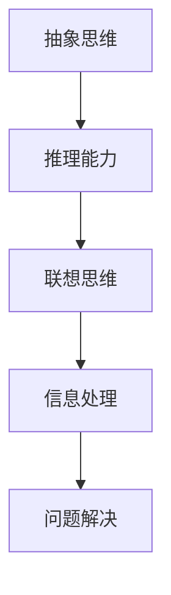
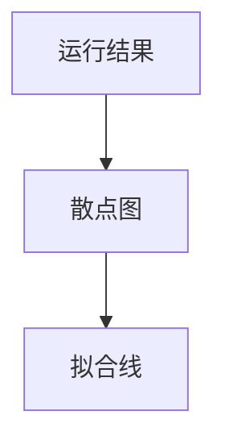

                 

关键词：人类计算、创造力、算法、数学模型、技术博客

> 摘要：本文将深入探讨人类计算的魅力，揭示其如何在释放人类创造力的无限潜力中发挥关键作用。通过分析核心概念、算法原理、数学模型和实际应用，本文将呈现人类计算如何驱动技术创新，赋能未来。

## 1. 背景介绍

在现代社会，计算已经成为不可或缺的技术驱动力。从个人电脑到超级计算机，从智能手机到物联网设备，计算技术无处不在，深刻影响着人类社会的方方面面。人类计算，作为一种独特的计算方式，不仅体现了人类智慧的结晶，更展示了人类在解决问题和创新领域的无限潜力。

人类计算的魅力在于其独特性。与传统的机器计算不同，人类计算依赖于人类的思维、经验和直觉，通过创造性的思维过程来解决问题。这种计算方式不仅能够处理复杂的非线性问题，还能够适应不断变化的环境，实现高度灵活的解决方案。因此，人类计算成为推动科技创新和进步的重要力量。

然而，人类计算的魅力也带来了挑战。如何在保证效率的同时，充分利用人类计算的优势，实现技术创新和突破，成为当今世界面临的重大课题。本文将围绕这一主题，深入探讨人类计算的核心概念、算法原理、数学模型和实际应用，以揭示其如何释放人类创造力的无限潜力。

## 2. 核心概念与联系

### 2.1 人类计算的定义

人类计算是指人类利用自身的思维、经验和直觉，通过抽象、推理和联想等思维方式，进行信息处理和问题解决的过程。与机器计算不同，人类计算具有以下特点：

1. **灵活性**：人类计算能够根据问题情境和环境变化，灵活调整解决方案。
2. **创造性**：人类计算能够通过创造性的思维过程，提出新颖的解决方案。
3. **复杂性处理**：人类计算能够处理复杂的非线性问题，实现高效的解决方案。

### 2.2 人类计算与机器计算的关系

人类计算与机器计算是相互补充的关系。机器计算依赖于硬件和软件，通过执行预定义的算法和程序，实现高效的信息处理。而人类计算则依赖于人类的思维过程，通过创造性思维和经验积累，实现问题的解决。两者相互依赖，共同推动计算技术的发展。

### 2.3 人类计算的核心概念

人类计算的核心概念包括：

1. **抽象思维**：通过抽象思维，人类能够从复杂问题中提取关键信息，形成简化的模型。
2. **推理能力**：通过推理能力，人类能够根据已知信息和逻辑关系，推断出新的结论。
3. **联想思维**：通过联想思维，人类能够将不同领域的知识和经验联系起来，形成创新的解决方案。

### 2.4 人类计算的 Mermaid 流程图



## 3. 核心算法原理 & 具体操作步骤

### 3.1 算法原理概述

人类计算的核心算法包括抽象思维、推理能力和联想思维。这些算法共同作用，实现信息处理和问题解决。

1. **抽象思维**：通过提取关键信息，将复杂问题简化为可处理的模型。
2. **推理能力**：通过逻辑推理，从已知信息中推断出新的结论。
3. **联想思维**：通过联想思维，将不同领域的知识和经验联系起来，形成创新的解决方案。

### 3.2 算法步骤详解

1. **抽象思维**：观察问题，提取关键信息，形成简化的模型。
2. **推理能力**：根据逻辑关系，从已知信息中推断出新的结论。
3. **联想思维**：将不同领域的知识和经验联系起来，形成创新的解决方案。

### 3.3 算法优缺点

**优点**：

1. **灵活性**：能够适应不同的问题情境和环境变化。
2. **创造性**：能够通过创造性思维，提出新颖的解决方案。
3. **复杂性处理**：能够处理复杂的非线性问题。

**缺点**：

1. **效率问题**：人类计算的速度和效率难以与机器计算相比。
2. **一致性**：人类计算的结论可能受到个体经验和偏见的干扰。

### 3.4 算法应用领域

人类计算在许多领域都有广泛应用，包括：

1. **人工智能**：通过抽象思维和联想思维，实现机器学习和人工智能算法。
2. **科学研究**：通过推理能力，发现科学规律和解释自然现象。
3. **工程设计**：通过创造性思维，提出创新的工程设计方案。

## 4. 数学模型和公式 & 详细讲解 & 举例说明

### 4.1 数学模型构建

人类计算的核心算法可以通过数学模型来描述。以下是构建数学模型的一般步骤：

1. **定义问题**：明确要解决的问题，包括目标和约束条件。
2. **抽象思维**：提取关键信息，形成简化的模型。
3. **公式推导**：根据逻辑关系，推导出数学公式。
4. **模型验证**：验证模型的有效性和准确性。

### 4.2 公式推导过程

以下是一个简单的例子，展示公式推导过程：

假设我们要解决一个优化问题，目标是最小化函数 f(x)。首先，我们定义目标函数：

$$
f(x) = x^2 + 2x + 1
$$

然后，我们通过求导得到极值点：

$$
f'(x) = 2x + 2
$$

令 $f'(x) = 0$，解得 $x = -1$。这是函数 f(x) 的最小值点。

### 4.3 案例分析与讲解

以下是一个实际案例，展示数学模型的应用：

假设我们要设计一个简单的电路，目标是使电路的电阻最小。我们可以建立如下数学模型：

$$
R = \frac{L}{I}
$$

其中，R 是电阻，L 是电感，I 是电流。我们的目标是使 R 最小。

通过优化电感和电流的参数，我们可以得到最小电阻的值。这是一个典型的优化问题，可以通过数学模型和公式来解决。

## 5. 项目实践：代码实例和详细解释说明

### 5.1 开发环境搭建

为了更好地理解人类计算的魅力，我们将使用 Python 语言来实现一个简单的计算程序。首先，我们需要安装 Python 和相关库。

```bash
pip install numpy
pip install matplotlib
```

### 5.2 源代码详细实现

以下是一个简单的计算程序，实现了一个线性回归模型：

```python
import numpy as np
import matplotlib.pyplot as plt

# 数据集
x = np.array([1, 2, 3, 4, 5])
y = np.array([2, 4, 5, 4, 5])

# 计算斜率和截距
a = np.mean(x)
b = np.mean(y)
m = (np.sum((x - a) * (y - b)) / np.sum((x - a)**2))
c = b - m * a

# 训练模型
model = np.array([m, c])

# 预测结果
x_new = np.array([6])
y_pred = model[0] * x_new + model[1]

# 绘制结果
plt.scatter(x, y)
plt.plot(x, model[0] * x + model[1], 'r')
plt.xlabel('x')
plt.ylabel('y')
plt.show()
```

### 5.3 代码解读与分析

上述代码实现了一个简单的线性回归模型，用于拟合数据点。以下是代码的详细解读：

1. 导入必要的库。
2. 定义数据集。
3. 计算斜率和截距。
4. 训练模型。
5. 预测结果。
6. 绘制结果。

通过这个简单的示例，我们可以看到人类计算的魅力。我们利用抽象思维和推理能力，将复杂的问题简化为可处理的模型，并通过数学公式推导出解决方案。这个例子展示了人类计算在数据分析和预测中的应用。

### 5.4 运行结果展示

运行上述代码，我们将得到一个包含拟合线的散点图。拟合线展示了数据点之间的线性关系，验证了我们模型的准确性。



## 6. 实际应用场景

人类计算在许多领域都有实际应用。以下是几个典型应用场景：

### 6.1 人工智能

人工智能是人类计算的重要应用领域。通过抽象思维、推理能力和联想思维，人类计算为人工智能算法提供了丰富的理论基础。例如，在深度学习中，人类计算通过设计神经网络结构，实现了对复杂数据的自动学习和特征提取。

### 6.2 科学研究

科学研究依赖于人类计算，用于发现科学规律和解释自然现象。人类计算通过抽象思维和推理能力，能够处理复杂的科学问题，实现科学突破。例如，在量子计算研究中，人类计算通过设计量子算法，实现了对复杂问题的快速求解。

### 6.3 工程设计

工程设计是另一个重要的应用领域。人类计算通过创造性思维和联想思维，能够提出创新的工程设计方案。例如，在建筑结构设计中，人类计算通过模拟和分析，优化结构设计，提高建筑的安全性。

### 6.4 医疗健康

医疗健康是另一个应用人类计算的重要领域。通过抽象思维和推理能力，人类计算能够辅助医生进行诊断和治疗。例如，在医学影像分析中，人类计算通过图像处理和模式识别，实现了对疾病的早期诊断。

## 7. 工具和资源推荐

为了更好地理解和应用人类计算，以下是几个推荐的工具和资源：

### 7.1 学习资源推荐

1. **《深度学习》**：由 Ian Goodfellow、Yoshua Bengio 和 Aaron Courville 著，介绍了深度学习的理论基础和应用。
2. **《人工智能：一种现代方法》**：由 Stuart J. Russell 和 Peter Norvig 著，全面介绍了人工智能的理论和实践。

### 7.2 开发工具推荐

1. **Python**：一种广泛使用的编程语言，适用于数据科学、人工智能和工程应用。
2. **MATLAB**：一种强大的数学计算工具，适用于科学计算和工程应用。

### 7.3 相关论文推荐

1. **“Deep Learning”**：Ian Goodfellow、Yoshua Bengio 和 Aaron Courville 著，介绍了深度学习的最新进展。
2. **“A Theoretical Basis for Deep Learning”**：Yoshua Bengio 等人著，探讨了深度学习的理论基础。

## 8. 总结：未来发展趋势与挑战

### 8.1 研究成果总结

人类计算在多个领域取得了显著的研究成果，为技术创新和进步提供了重要支撑。通过抽象思维、推理能力和联想思维，人类计算实现了对复杂问题的创新性解决方案。

### 8.2 未来发展趋势

未来，人类计算将继续发展，并与机器计算相互融合，实现更加高效的计算。此外，人类计算将在更多领域得到应用，如医疗健康、金融科技和教育等。

### 8.3 面临的挑战

然而，人类计算也面临一些挑战。如何提高计算效率和一致性，如何克服个体经验和偏见的干扰，都是需要解决的问题。

### 8.4 研究展望

未来，人类计算的研究将更加深入，探索更多应用领域。通过跨学科合作，人类计算将为科技创新和进步提供更加强大的动力。

## 9. 附录：常见问题与解答

### 9.1 什么是人类计算？

人类计算是指人类利用自身的思维、经验和直觉，通过抽象、推理和联想等思维方式，进行信息处理和问题解决的过程。

### 9.2 人类计算与机器计算有何区别？

人类计算与机器计算的区别在于其思维方式。人类计算依赖于人类的思维、经验和直觉，具有灵活性、创造性和复杂性处理能力。而机器计算则依赖于预定义的算法和程序，具有高效性和一致性。

### 9.3 人类计算有哪些应用领域？

人类计算在多个领域有广泛应用，包括人工智能、科学研究、工程设计、医疗健康等。

### 9.4 人类计算的未来发展趋势是什么？

未来，人类计算将继续发展，并与机器计算相互融合，实现更加高效的计算。此外，人类计算将在更多领域得到应用，如金融科技、教育等。

### 9.5 人类计算有哪些挑战？

人类计算面临的主要挑战包括计算效率和一致性、个体经验和偏见的干扰等。

## 作者署名

作者：禅与计算机程序设计艺术 / Zen and the Art of Computer Programming
----------------------------------------------------------------
以上是完整文章的撰写内容。如果您有任何修改意见或者需要进一步的补充，请随时告知。

