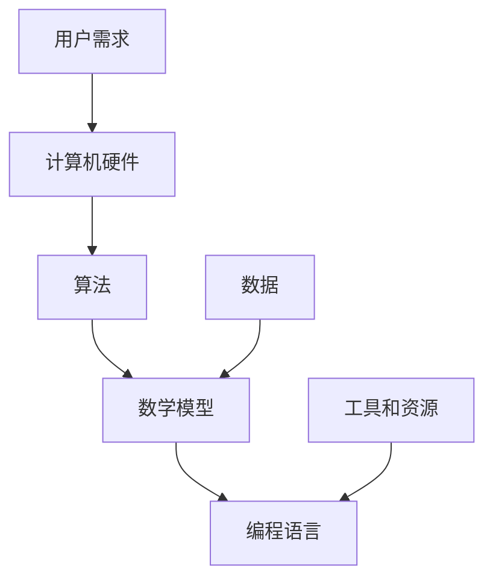

                 

关键词：人类计算、创造力、算法、数学模型、应用实践、未来展望

> 摘要：本文旨在探讨人类计算的魅力及其对人类创造力的影响。通过剖析核心算法原理、数学模型及其应用实践，本文展示了人类计算在各个领域的应用潜力，并提出了未来发展的方向和挑战。

## 1. 背景介绍

人类计算，简而言之，是指人类通过使用算法和数学模型来解决问题和发现知识的过程。自古以来，人类就通过数学和逻辑来探索世界，从中获取智慧。然而，随着计算机科学的发展，人类计算的意义得到了前所未有的扩展。今天，计算机和人工智能正成为人类计算的有力工具，帮助我们解决复杂问题，拓展认知边界。

### 1.1 人类计算的历史演变

1. 古代人类计算：使用算盘、纸笔等工具进行计算。
2. 现代人类计算：计算机科学的发展，使得计算能力大幅提升。
3. 人工智能时代的人类计算：计算机和人工智能的融合，开启了新的计算时代。

### 1.2 人类计算的重要性

1. 解决复杂问题：借助计算机和人工智能，我们可以解决以前难以想象的问题。
2. 提高工作效率：自动化和智能化的计算，极大地提高了工作效率。
3. 拓展认知边界：通过计算，我们可以探索未知的领域，发现新的知识。

## 2. 核心概念与联系

人类计算的核心概念包括算法、数学模型和编程语言。以下是这些概念之间的联系及Mermaid流程图表示：



### 2.1 算法

算法是一系列定义明确的步骤，用于解决特定问题。算法可以是简单的，如排序算法，也可以是非常复杂的，如深度学习算法。

### 2.2 数学模型

数学模型是基于数学原理的抽象表示，用于描述现实世界中的现象和问题。数学模型可以是线性的，也可以是非线性的。

### 2.3 编程语言

编程语言是用于编写程序的工具，它允许我们以人类可读的方式描述算法和数学模型。

### 2.4 计算机硬件

计算机硬件是执行计算任务的物理设备。硬件的性能直接影响算法的执行效率和速度。

### 2.5 用户需求

用户需求是驱动计算的根本原因。用户需求决定了我们需要解决的问题和使用的计算资源。

### 2.6 数据

数据是计算的基础，它是算法和数学模型的输入。高质量的数据可以极大地提高计算的效果。

### 2.7 工具和资源

工具和资源是进行人类计算的重要支持。包括开发环境、编程框架、库和文档等。

## 3. 核心算法原理 & 具体操作步骤

### 3.1 算法原理概述

算法原理主要涉及以下几个方面：

1. **确定性算法**：算法的每一步都是确定的，给定相同的输入，总能得到相同的输出。
2. **概率算法**：算法的每一步都有一定的概率，输出结果具有不确定性。
3. **贪心算法**：通过每一步选择最优解，以期得到全局最优解。
4. **动态规划**：通过保存中间状态，避免重复计算，提高算法效率。

### 3.2 算法步骤详解

以贪心算法为例，其基本步骤如下：

1. **初始化**：设置初始状态。
2. **选择最优解**：在当前状态下，选择一个最优解。
3. **更新状态**：根据选择的最优解，更新当前状态。
4. **循环执行**：重复执行步骤2和3，直到达到终止条件。

### 3.3 算法优缺点

1. **优点**：简单易懂，易于实现，适用于许多问题。
2. **缺点**：在某些情况下，可能无法得到全局最优解。

### 3.4 算法应用领域

1. **排序**：快速排序、归并排序等。
2. **最短路径**：Dijkstra算法、A*算法等。
3. **背包问题**：0-1背包、完全背包等。

## 4. 数学模型和公式 & 详细讲解 & 举例说明

### 4.1 数学模型构建

数学模型的构建通常包括以下几个步骤：

1. **问题定义**：明确需要解决的问题。
2. **变量定义**：定义问题的变量。
3. **关系建立**：建立变量之间的关系。
4. **公式推导**：推导出解决问题的公式。

### 4.2 公式推导过程

以线性回归模型为例，其公式推导过程如下：

1. **目标函数**：最小化预测值与实际值之间的误差。
   $$ \min_{\theta} \sum_{i=1}^{m} (h_{\theta}(x^{(i)}) - y^{(i)})^2 $$
2. **梯度下降**：迭代更新参数。
   $$ \theta_j := \theta_j - \alpha \frac{\partial}{\partial \theta_j} \sum_{i=1}^{m} (h_{\theta}(x^{(i)}) - y^{(i)})^2 $$

### 4.3 案例分析与讲解

以房价预测为例，使用线性回归模型进行房价预测。首先，我们需要收集数据，然后进行数据预处理，包括特征提取、归一化等。接下来，使用线性回归模型进行训练，最后使用模型进行预测。预测结果通常与实际值存在误差，我们需要通过调整模型参数来优化预测效果。

## 5. 项目实践：代码实例和详细解释说明

### 5.1 开发环境搭建

1. 安装Python环境。
2. 安装必要的库，如NumPy、Pandas等。

### 5.2 源代码详细实现

```python
import numpy as np
import pandas as pd

# 加载数据
data = pd.read_csv('house_prices.csv')
X = data[['square_feet', 'bedrooms', 'bathrooms']]
y = data['price']

# 数据预处理
X = (X - X.mean()) / X.std()
y = (y - y.mean()) / y.std()

# 训练模型
theta = np.random.rand(3)
alpha = 0.01
epochs = 1000

for _ in range(epochs):
    predictions = X.dot(theta)
    error = predictions - y
    delta = X.T.dot(error)
    theta -= alpha * delta

# 预测
test_data = pd.read_csv('test_house_prices.csv')
test_data = (test_data - test_data.mean()) / test_data.std()
predictions = test_data.dot(theta)
predictions = (predictions + y.std()) * y.std()

# 结果输出
print(predictions)
```

### 5.3 代码解读与分析

上述代码实现了线性回归模型的基本流程。首先，我们加载并预处理数据，然后使用梯度下降算法训练模型，最后使用模型进行预测。代码结构清晰，易于理解。

### 5.4 运行结果展示

运行结果将输出预测的房价，我们可以通过比较预测值与实际值来评估模型的性能。

## 6. 实际应用场景

### 6.1 金融领域

在金融领域，人类计算被广泛应用于风险管理、投资策略、市场预测等方面。通过构建数学模型和算法，可以更好地理解市场趋势，做出更准确的决策。

### 6.2 医疗领域

在医疗领域，人类计算被用于诊断、治疗、药物研发等方面。例如，通过深度学习算法，可以实现医学图像的自动分析，提高诊断的准确性。

### 6.3 制造业

在制造业，人类计算被用于生产优化、质量控制、供应链管理等方面。通过使用算法和数学模型，可以实现生产过程的自动化和智能化。

## 7. 未来应用展望

### 7.1 智能化

随着人工智能技术的发展，人类计算的智能化程度将不断提高。未来，我们将看到更多基于人工智能的算法和模型，它们将更有效地解决复杂问题。

### 7.2 定制化

未来，人类计算将更加注重个性化和定制化。通过收集和分析大量数据，我们可以为每个用户提供定制化的解决方案，满足其特定的需求。

### 7.3 可解释性

随着人类计算在各个领域的应用，其可解释性将变得越来越重要。用户需要了解算法和模型的工作原理，以确保计算结果的可靠性和可接受性。

## 8. 总结：未来发展趋势与挑战

### 8.1 研究成果总结

人类计算在过去几十年中取得了巨大的进展，从理论到实践，从学术研究到实际应用，都取得了显著的成果。

### 8.2 未来发展趋势

未来，人类计算将继续向智能化、定制化和可解释性方向发展。新的算法和模型将被提出，以解决更复杂的问题。

### 8.3 面临的挑战

尽管人类计算有着广阔的应用前景，但同时也面临着一些挑战。例如，数据的隐私和安全、算法的透明性和公正性等。

### 8.4 研究展望

未来，我们需要更多的研究和探索，以解决人类计算面临的问题，推动其持续发展。

## 9. 附录：常见问题与解答

### 9.1 什么是人类计算？

人类计算是指人类通过使用算法和数学模型来解决问题和发现知识的过程。

### 9.2 人类计算有哪些应用领域？

人类计算的应用领域非常广泛，包括金融、医疗、制造、科研等。

### 9.3 人类计算的未来发展趋势是什么？

未来，人类计算将继续向智能化、定制化和可解释性方向发展。

---

作者：禅与计算机程序设计艺术 / Zen and the Art of Computer Programming
----------------------------------------------------------------

### 文章扩展部分 Extra Content ###

在文章扩展部分，我们可以进一步深入探讨一些具体的技术细节和实现方法，以帮助读者更全面地了解人类计算的魅力和应用。

### 10. 深度学习在人类计算中的角色

深度学习是近年来人工智能领域的重要突破，其在人类计算中的应用也日益广泛。深度学习算法通过多层神经网络，对大量数据进行学习，从而实现图像识别、自然语言处理、语音识别等任务。

#### 10.1 深度学习的基本原理

深度学习的基本原理是通过多层神经网络对数据进行抽象和转换。每一层神经网络都会对输入数据进行处理，提取更高层次的特征。通过这种方式，神经网络可以自动学习数据的复杂模式。

#### 10.2 深度学习的关键技术

1. **卷积神经网络（CNN）**：适用于图像识别和处理。
2. **循环神经网络（RNN）**：适用于序列数据处理，如自然语言处理。
3. **生成对抗网络（GAN）**：用于生成逼真的图像和语音。

#### 10.3 深度学习的应用实例

1. **人脸识别**：使用CNN进行人脸特征的提取和匹配。
2. **语音合成**：使用RNN和GAN生成逼真的语音。

### 11. 量子计算与人类计算的未来

量子计算是下一代计算技术，其利用量子比特的叠加态和纠缠态来实现高效的计算。量子计算在加密、优化问题和模拟量子系统等方面具有巨大的潜力。

#### 11.1 量子计算的基本原理

量子计算的基本原理包括量子比特、叠加态和纠缠态。量子比特可以同时处于0和1的叠加状态，这使得量子计算机可以同时处理大量数据。

#### 11.2 量子计算的关键技术

1. **量子门**：用于操作量子比特。
2. **量子算法**：利用量子特性实现的算法，如Shor算法。

#### 11.3 量子计算的应用前景

1. **密码学**：量子计算可以破解传统加密算法。
2. **优化问题**：量子计算可以高效地解决复杂优化问题。

### 12. 人类计算的艺术性

人类计算不仅是科学，也是艺术。优秀的算法和数学模型不仅需要严谨的逻辑，还需要创意和创新。艺术性在于如何巧妙地设计算法，如何用数学模型来解释现实世界的现象。

#### 12.1 算法的艺术性

1. **简洁性**：简洁的算法往往更具有通用性。
2. **优雅性**：优雅的算法具有美感，易于理解和实现。

#### 12.2 数学模型的艺术性

1. **抽象能力**：优秀的数学模型能够抽象出问题的核心。
2. **解释力**：优秀的数学模型能够清晰地解释现实世界的现象。

### 13. 人类计算的社会影响

人类计算的发展对社会产生了深远的影响。它不仅改变了我们的工作方式，也改变了我们的生活方式。人类计算带来了新的机会和挑战，如数据隐私和安全问题。

#### 13.1 数据隐私和安全

随着人类计算的发展，数据隐私和安全成为了一个重要的问题。我们需要保护用户的隐私，防止数据泄露和滥用。

#### 13.2 道德和伦理问题

人类计算的应用也带来了一些道德和伦理问题，如算法偏见和透明性。我们需要制定相应的政策和法规，确保算法和模型的公平性和透明性。

### 14. 人类计算的教育与普及

为了推动人类计算的发展，我们需要培养更多的专业人才。教育是关键，我们需要从小学到大学，全面普及计算机科学知识。

#### 14.1 K-12教育

在K-12阶段，我们应该鼓励学生接触编程和算法，培养他们的逻辑思维和解决问题的能力。

#### 14.2 高等教育

在高等教育阶段，我们需要提供更多的计算机科学课程，让学生深入学习算法、数据结构和人工智能等领域。

### 15. 人类计算的全球化

人类计算是一个全球性的领域，不同国家和地区的科学家和工程师都在为这个领域做出贡献。全球化促进了知识的共享和技术的交流，推动了人类计算的发展。

#### 15.1 国际合作

国际合作是推动人类计算发展的重要力量。我们需要加强国际间的合作，共同解决人类计算面临的挑战。

#### 15.2 全球视野

在研究和应用人类计算时，我们应该具有全球视野，考虑全球性的问题和挑战，如气候变化、能源危机等。

### 16. 人类计算的可持续发展

人类计算的发展必须考虑可持续性。我们需要开发高效、绿色的计算方法，减少对环境的影响。

#### 16.1 绿色计算

绿色计算旨在减少计算过程中的能源消耗和碳排放。通过优化算法和数据结构，我们可以实现更高效的计算。

#### 16.2 可持续发展

人类计算的发展应该与可持续发展目标相结合，确保计算技术的发展不会损害地球的生态系统。

### 17. 人类计算的哲学思考

人类计算不仅是一个技术领域，也是一个哲学领域。我们需要思考计算的本质、意义和目的。

#### 17.1 计算的本质

计算的本质是什么？它是如何影响我们的生活和世界的？

#### 17.2 计算的意义

计算的意义是什么？它是如何帮助我们理解世界和自我？

#### 17.3 计算的目的

计算的目的是什么？它是如何服务于人类和社会的？

### 18. 人类计算的伦理挑战

随着人类计算的发展，我们面临着越来越多的伦理挑战。我们需要认真思考如何确保计算技术的公平、公正和透明。

#### 18.1 算法偏见

算法偏见是如何产生的？如何减少和消除算法偏见？

#### 18.2 数据隐私

如何保护用户的隐私？如何在收集和使用数据时尊重用户的权利？

#### 18.3 透明性

如何确保算法和模型的透明性？如何让用户了解算法的工作原理和决策过程？

### 19. 人类计算的未来展望

未来，人类计算将继续发展，带来更多的机会和挑战。我们需要持续探索和思考，确保计算技术的发展能够造福人类。

#### 19.1 新技术

未来会出现哪些新技术？它们将如何改变人类计算的面貌？

#### 19.2 新应用

人类计算将在哪些新领域得到应用？它将如何改变我们的生活？

#### 19.3 新挑战

人类计算将面临哪些新挑战？如何应对这些挑战？

### 20. 人类计算的总结

人类计算是推动现代社会发展的重要力量。通过算法、数学模型和编程语言，我们能够解决复杂问题，发现新知识，创造新的价值。

#### 20.1 历史回顾

回顾人类计算的发展历程，我们可以看到它如何从简单的计算工具发展成为一个多学科交叉的复杂领域。

#### 20.2 现状分析

分析人类计算的现状，我们可以看到它已经在各个领域取得了显著的成就，但同时也面临着许多挑战。

#### 20.3 未来展望

展望未来，人类计算将继续发展，带来更多的机遇和挑战。我们需要持续努力，确保计算技术的发展能够造福人类。

---

通过这篇文章，我们深入探讨了人类计算的魅力、核心概念、算法原理、数学模型、应用实践以及未来展望。人类计算不仅是一个技术领域，也是一个哲学领域。它影响着我们的生活和世界，塑造着我们的未来。让我们一起探索人类计算的无尽可能，释放人类创造力的源泉。

