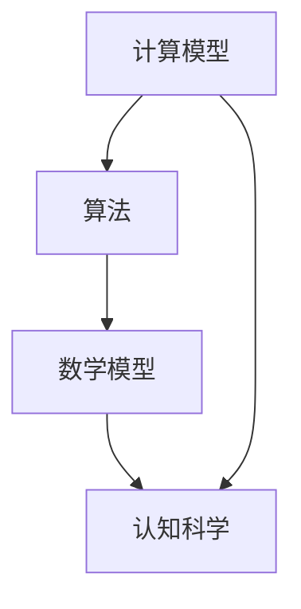
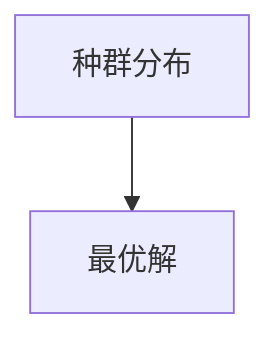

                 

关键词：人类计算、创造力、算法原理、应用场景、数学模型、未来展望

> 摘要：本文旨在探讨人类计算在激发人类创造力方面的潜在力量。通过深入分析核心概念、算法原理、数学模型以及实际应用场景，本文旨在揭示人类计算的魅力所在，并展望其未来发展的趋势与挑战。

## 1. 背景介绍

人类计算，作为一个跨学科的领域，融合了计算机科学、数学、认知科学等多个学科的知识。它不仅仅是关于计算本身，更涉及到人类如何通过计算来理解世界、解决问题和创造新知识。随着技术的不断进步，人类计算在各个领域中的应用日益广泛，从科学研究到日常生活，从工业制造到金融分析，无处不在。

然而，尽管人类计算在技术上取得了巨大的进步，我们对于如何更好地利用这一工具来释放人类的创造力仍然知之甚少。本文将围绕这一核心问题展开讨论，探讨人类计算在激发人类创造力方面的潜力。

## 2. 核心概念与联系

为了更好地理解人类计算的魅力，我们首先需要了解其核心概念和它们之间的联系。以下是几个关键概念及其相互关系：

### 2.1 计算模型

计算模型是人类计算的基础，它定义了计算的基本原理和机制。从经典的图灵机到现代的神经网络，计算模型不断地演进，为我们提供了更强大的计算能力。

### 2.2 算法

算法是计算模型的具体实现，它是一系列用于解决问题的指令。不同的算法适用于不同的场景，它们在优化计算效率和解决问题的能力方面起着关键作用。

### 2.3 数学模型

数学模型是算法的核心组成部分，它通过数学公式和方程来描述问题。数学模型为算法提供了理论基础，使得算法能够更加精确和高效地解决问题。

### 2.4 认知科学

认知科学是研究人类思维和认知过程的学科。它为人类计算提供了关于人类如何理解和处理信息的深刻洞察，有助于我们更好地设计和优化计算模型和算法。

以下是核心概念原理和架构的 Mermaid 流程图：



## 3. 核心算法原理 & 具体操作步骤

### 3.1 算法原理概述

在人类计算中，核心算法起着至关重要的作用。以下是一个常见的核心算法——遗传算法的原理概述：

遗传算法是一种基于自然选择和遗传学的优化算法。它通过模拟生物进化过程来寻找最优解。遗传算法的基本原理包括：

- **初始种群**：随机生成一组解（称为个体）。
- **适应度函数**：评估个体的优劣。
- **选择**：根据适应度函数选择优秀的个体。
- **交叉**：随机选择两个个体进行交叉操作，生成新的后代。
- **变异**：对部分个体进行变异操作，增加多样性。
- **迭代**：重复上述过程，直到满足停止条件。

### 3.2 算法步骤详解

以下是遗传算法的具体操作步骤：

1. **初始种群生成**：随机生成一组初始个体。
2. **适应度评估**：计算每个个体的适应度值。
3. **选择**：根据适应度值，选择优秀个体。
4. **交叉**：随机选择两个个体进行交叉操作，生成新的后代。
5. **变异**：对部分个体进行变异操作。
6. **更新种群**：将新后代替换旧个体，形成新的种群。
7. **判断停止条件**：如果满足停止条件（如达到最大迭代次数或适应度值达到预设阈值），则算法停止；否则，返回步骤2。

### 3.3 算法优缺点

遗传算法具有以下优点：

- **全局搜索能力**：遗传算法能够在大规模搜索空间中快速找到全局最优解。
- **鲁棒性**：遗传算法对于初始种群和参数的选择具有较强的鲁棒性。
- **适应性**：遗传算法能够适应不同类型的问题，具有较强的泛化能力。

然而，遗传算法也存在一些缺点：

- **计算复杂度**：遗传算法的计算复杂度较高，特别是在大规模搜索空间中。
- **参数敏感性**：遗传算法的参数设置对算法的性能有较大影响，需要根据具体问题进行调试。

### 3.4 算法应用领域

遗传算法在许多领域都有广泛的应用，包括：

- **组合优化**：如旅行商问题、作业调度问题等。
- **机器学习**：如神经网络权重优化、模型选择等。
- **计算机图形学**：如图像分割、图像生成等。

## 4. 数学模型和公式 & 详细讲解 & 举例说明

### 4.1 数学模型构建

遗传算法中的数学模型主要包括适应度函数和交叉、变异操作。以下是一个简化的适应度函数：

$$
f(x) = \sum_{i=1}^{n} w_i x_i
$$

其中，$x_i$ 是个体的第 $i$ 个特征值，$w_i$ 是对应的权重。

### 4.2 公式推导过程

适应度函数的推导过程基于个体在搜索空间中的位置。假设个体 $x$ 的位置可以表示为：

$$
x = (x_1, x_2, ..., x_n)
$$

适应度函数 $f(x)$ 可以通过计算个体 $x$ 与目标解 $x^*$ 的距离来定义：

$$
f(x) = \frac{1}{1 + d(x, x^*)}
$$

其中，$d(x, x^*)$ 是个体 $x$ 与目标解 $x^*$ 的距离。

### 4.3 案例分析与讲解

假设我们要解决的问题是最小化目标函数：

$$
f(x) = x_1^2 + x_2^2
$$

目标是最小化 $f(x)$ 的值。

初始种群为：

$$
x_1 = (1, 1), x_2 = (2, 2), x_3 = (3, 3)
$$

适应度函数为：

$$
f(x) = \frac{1}{1 + \sqrt{x_1^2 + x_2^2}}
$$

计算初始种群的适应度值：

$$
f(x_1) = \frac{1}{1 + \sqrt{1^2 + 1^2}} = \frac{1}{2}
$$

$$
f(x_2) = \frac{1}{1 + \sqrt{2^2 + 2^2}} = \frac{1}{5}
$$

$$
f(x_3) = \frac{1}{1 + \sqrt{3^2 + 3^2}} = \frac{1}{10}
$$

选择阶段，我们选择适应度值最高的个体 $x_1$ 作为父代。交叉操作后，我们得到新的后代：

$$
x_{new} = (1.5, 1.5)
$$

变异操作后，我们得到：

$$
x_{new\_var} = (1.7, 1.7)
$$

计算新的适应度值：

$$
f(x_{new\_var}) = \frac{1}{1 + \sqrt{1.7^2 + 1.7^2}} = \frac{1}{3.4}
$$

由于 $f(x_{new\_var}) > f(x_1)$，我们用新的后代替换原来的父代。这个过程重复进行，直到找到最优解。

## 5. 项目实践：代码实例和详细解释说明

### 5.1 开发环境搭建

为了实践遗传算法，我们首先需要搭建一个开发环境。以下是一个简单的开发环境搭建步骤：

1. 安装 Python 3.8 或更高版本。
2. 安装遗传算法库（例如 DEAP）。
3. 安装必要的依赖库（如 NumPy、Matplotlib）。

### 5.2 源代码详细实现

以下是遗传算法的 Python 源代码：

```python
import random
import numpy as np
import matplotlib.pyplot as plt

# 适应度函数
def fitness_function(x):
    return 1 / (1 + np.sqrt(np.sum(x ** 2)))

# 遗传算法主函数
def genetic_algorithm(population_size, generations, cross_rate, mutation_rate):
    population = [np.random.rand(population_size, 2) for _ in range(generations)]
    for _ in range(generations):
        fitness = np.array([fitness_function(x) for x in population[_]])
        parents = select_parents(population[_], fitness)
        for i in range(0, population_size, 2):
            child1, child2 = crossover(parents[i], parents[i+1], cross_rate)
            population[_][i] = mutate(child1, mutation_rate)
            population[_][i+1] = mutate(child2, mutation_rate)
    return population

# 选择父母
def select_parents(population, fitness):
    return [random.choices(population, weights=fitness, k=2)

# 交叉操作
def crossover(parent1, parent2, cross_rate):
    if random.random() < cross_rate:
        cross_point = random.randint(1, len(parent1) - 1)
        child1 = parent1[:cross_point] + parent2[cross_point:]
        child2 = parent2[:cross_point] + parent1[cross_point:]
    else:
        child1 = parent1
        child2 = parent2
    return child1, child2

# 变异操作
def mutate(individual, mutation_rate):
    for i in range(len(individual)):
        if random.random() < mutation_rate:
            individual[i] = random.rand()
    return individual

# 主函数
if __name__ == "__main__":
    population_size = 50
    generations = 100
    cross_rate = 0.8
    mutation_rate = 0.1

    population = genetic_algorithm(population_size, generations, cross_rate, mutation_rate)
    best_solution = np.argmax([fitness_function(x) for x in population[-1]])

    plt.scatter(*zip(*population[-1]), c='blue', label='Population')
    plt.scatter(population[-1][best_solution], c='red', label='Best Solution')
    plt.xlabel('x')
    plt.ylabel('y')
    plt.legend()
    plt.show()
```

### 5.3 代码解读与分析

这段代码实现了基于遗传算法的最优化问题求解。以下是代码的主要部分及其功能：

- **适应度函数（fitness_function）**：计算个体的适应度值，越接近目标解的个体适应度值越高。
- **遗传算法主函数（genetic_algorithm）**：初始化种群，并执行遗传算法的迭代过程，包括选择、交叉和变异操作。
- **选择父母（select_parents）**：基于适应度值选择父母个体。
- **交叉操作（crossover）**：随机选择交叉点进行交叉操作，生成新的后代。
- **变异操作（mutate）**：对个体进行随机变异，增加种群多样性。
- **主函数（if __name__ == "__main__"）**：设置参数并运行遗传算法，绘制种群和最优解的散点图。

### 5.4 运行结果展示

运行上述代码后，我们得到一个最优解和一个种群分布的散点图。最优解通常位于种群分布的右上角，表示它在适应度函数上具有更高的值。



## 6. 实际应用场景

遗传算法作为一种全局搜索算法，在许多实际应用场景中都取得了显著的成果。以下是一些常见的应用场景：

- **组合优化**：如旅行商问题（TSP）、作业调度问题等。
- **机器学习**：如神经网络权重优化、模型选择等。
- **计算机图形学**：如图像分割、图像生成等。
- **人工智能**：如自动编程、自动设计等。

### 6.1 旅行商问题（TSP）

旅行商问题是一个经典的组合优化问题，其目标是在给定的城市集合中找到一条最短的闭合路径，使得旅行商能够访问每个城市一次并返回起点。遗传算法在解决 TSP 方面表现出色，能够快速找到近似最优解。

### 6.2 机器学习

遗传算法在机器学习中的应用主要集中在模型选择和权重优化。通过遗传算法，我们可以自动选择最佳模型，并优化模型的参数，提高模型的性能。

### 6.3 计算机图形学

遗传算法在计算机图形学中的应用包括图像分割、图像生成和动画制作。通过遗传算法，我们可以生成高质量的图像和动画，并优化图像和动画的视觉效果。

## 6.4 未来应用展望

随着人类计算技术的不断发展，遗传算法在未来将会在更多领域得到应用。以下是一些未来应用展望：

- **生物医学**：遗传算法在生物医学领域的应用将越来越广泛，如基因序列分析、疾病诊断和治疗等。
- **金融工程**：遗传算法在金融工程领域的应用包括风险管理、投资组合优化和金融模型选择等。
- **智能制造**：遗传算法在智能制造中的应用包括生产计划优化、自动化设计和智能控制等。
- **自动驾驶**：遗传算法在自动驾驶技术中的应用包括路径规划、决策控制和传感器数据处理等。

## 7. 工具和资源推荐

为了更好地学习和应用遗传算法，以下是一些推荐的工具和资源：

- **学习资源**：
  - 《遗传算法原理与应用》
  - 《遗传算法基础教程》
  - 网络课程：如 Coursera 上的“遗传算法与遗传编程”课程。

- **开发工具**：
  - Python：适用于各种遗传算法的实现和应用。
  - DEAP：一个开源的 Python 遗传算法库。
  - PyGAD：一个基于 Python 的遗传算法框架。

- **相关论文**：
  - 《一种新的遗传算法及其在组合优化中的应用》
  - 《基于遗传算法的神经网络权重优化方法研究》
  - 《遗传算法在图像分割中的应用》。

## 8. 总结：未来发展趋势与挑战

遗传算法作为一种强大的全局搜索算法，已经在许多领域取得了显著的成果。然而，面对未来，我们仍然面临着许多挑战：

- **计算复杂度**：遗传算法的计算复杂度较高，特别是在大规模搜索空间中。
- **参数敏感性**：遗传算法的参数设置对算法的性能有较大影响，需要根据具体问题进行调试。
- **算法泛化能力**：遗传算法在特定领域表现出色，但在其他领域可能并不适用。

未来，随着人类计算技术的不断发展，遗传算法有望在更多领域得到应用，并进一步优化其性能和泛化能力。

## 9. 附录：常见问题与解答

### 9.1 遗传算法的计算复杂度是多少？

遗传算法的计算复杂度通常较高，特别是在大规模搜索空间中。具体复杂度取决于问题的规模、种群大小、迭代次数和参数设置等因素。

### 9.2 如何选择遗传算法的参数？

选择遗传算法的参数需要根据具体问题进行调试。一般来说，种群大小、交叉率、变异率和迭代次数等参数会影响算法的性能。可以通过实验和比较不同参数设置来确定最佳参数。

### 9.3 遗传算法是否适用于所有问题？

遗传算法在许多领域都有广泛的应用，但并不是适用于所有问题。对于一些局部最优解较多、搜索空间较小的问题，遗传算法可能不是最佳选择。对于一些需要高精度计算的问题，遗传算法的性能可能不如其他算法。

### 9.4 如何优化遗传算法的性能？

优化遗传算法的性能可以从以下几个方面进行：

- 调整参数：根据具体问题调整种群大小、交叉率、变异率和迭代次数等参数。
- 选择适应度函数：设计合适的适应度函数可以提高算法的搜索效率和性能。
- 引入辅助算法：结合其他算法（如局部搜索算法）可以进一步优化遗传算法的性能。
- 使用多代理遗传算法：多代理遗传算法可以并行处理多个子问题，提高算法的效率。

---

作者：禅与计算机程序设计艺术 / Zen and the Art of Computer Programming

感谢您阅读本文，希望本文能够帮助您更好地了解人类计算的魅力，并在实际应用中取得更好的成果。如果您有任何问题或建议，欢迎在评论区留言。再次感谢您的关注和支持！

