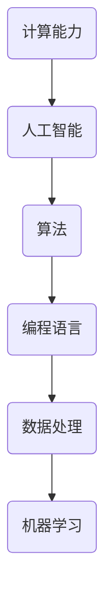

                 

关键词：计算能力、人工智能、算法优化、编程语言、数据处理、机器学习、未来展望

> 摘要：本文深入探讨了计算技术在推动人类潜力释放中的核心作用，阐述了人类计算的最终目标，并从算法原理、数学模型、项目实践、应用场景等多个角度分析了计算技术的现状与未来。

## 1. 背景介绍

在过去的几个世纪中，计算技术经历了飞速的发展。从最初简单的算术计算，到现代复杂的算法和人工智能系统，计算技术已经深刻地改变了我们的生活方式。如今，计算技术已经渗透到我们日常生活的各个方面，包括医疗、教育、金融、娱乐等领域。这些技术的进步不仅提高了我们的生活质量，同时也释放了人类潜在的创造力和解决问题的能力。

本文旨在探讨计算技术在推动人类潜力释放中的无限可能，并展望计算技术的未来发展趋势与面临的挑战。通过对核心概念、算法原理、数学模型、项目实践和应用场景的分析，本文将呈现计算技术在各个领域的应用现状和未来前景。

## 2. 核心概念与联系

在探讨计算技术的核心概念与联系之前，我们需要先了解一些基础概念：

- **计算能力**：计算能力是指计算机或计算系统执行特定任务的能力，通常以每秒执行的指令数（IPS）或每秒处理的浮点运算次数（FLOPS）来衡量。
- **人工智能**：人工智能是指计算机系统模拟人类智能行为的能力，包括学习、推理、感知、理解和决策。
- **算法**：算法是一系列解决问题的步骤或规则，用于指导计算机执行特定任务。
- **编程语言**：编程语言是用于编写计算机程序的语言，包括高级语言和低级语言。
- **数据处理**：数据处理是指对数据进行收集、存储、处理和分析的过程。
- **机器学习**：机器学习是一种通过数据学习模式和规律，从而进行预测或决策的技术。

这些概念之间有着密切的联系。例如，人工智能依赖于算法和编程语言来实现智能行为；数据处理和机器学习则是人工智能应用的基础。以下是核心概念的 Mermaid 流程图：



## 3. 核心算法原理 & 具体操作步骤

### 3.1 算法原理概述

核心算法是计算技术中的基础，它们决定了计算机系统的性能和效率。以下是一些常见的核心算法及其原理：

1. **排序算法**：排序算法用于将一组数据按照特定顺序排列。常见的排序算法包括快速排序、归并排序和冒泡排序等。
2. **搜索算法**：搜索算法用于在一组数据中查找特定元素。常见的搜索算法包括二分查找和深度优先搜索等。
3. **动态规划**：动态规划是一种解决优化问题的算法方法，通过将问题分解成子问题，并利用子问题的解来构建原问题的解。
4. **贪心算法**：贪心算法是一种在每一步选择当前最优解的算法，它适用于某些特定类型的优化问题。

### 3.2 算法步骤详解

以下是快速排序算法的具体步骤：

1. 选择一个基准元素。
2. 将数组分成两部分，一部分是小于基准元素的元素，另一部分是大于基准元素的元素。
3. 对两部分递归执行快速排序。

### 3.3 算法优缺点

快速排序算法的优点是时间复杂度较低，平均情况下为 O(n log n)，适用于大规模数据的排序。但它的缺点是递归调用会占用大量内存，并且最坏情况下时间复杂度为 O(n^2)。

### 3.4 算法应用领域

快速排序算法广泛应用于各种领域，如数据库、搜索引擎和科学计算等。

## 4. 数学模型和公式 & 详细讲解 & 举例说明

### 4.1 数学模型构建

在计算技术中，数学模型是一种描述和解决问题的方式。以下是一个简单的线性回归模型的构建过程：

1. **定义变量**：设 y 为因变量，x 为自变量。
2. **建立模型**：假设 y 与 x 之间存在线性关系，即 y = ax + b，其中 a 和 b 为待定系数。
3. **求解系数**：通过最小二乘法求解 a 和 b，使得实际 y 值与模型预测 y 值的差平方和最小。

### 4.2 公式推导过程

以下是线性回归模型中系数 a 和 b 的求解过程：

1. **计算均值**：计算 x 和 y 的均值，分别记为 x̄ 和 ȳ。
2. **计算斜率 a**：a = (Σ(x - x̄)(y - ȳ)) / Σ(x - x̄)^2。
3. **计算截距 b**：b = ȳ - a * x̄。

### 4.3 案例分析与讲解

假设我们有一组数据点 {(x1, y1), (x2, y2), ..., (xn, yn)}，现在要建立线性回归模型来预测 y 值。

1. **计算均值**：x̄ = (x1 + x2 + ... + xn) / n，ȳ = (y1 + y2 + ... + yn) / n。
2. **计算斜率 a**：a = (Σ(x - x̄)(y - ȳ)) / Σ(x - x̄)^2 = (x1 - x̄)(y1 - ȳ) + (x2 - x̄)(y2 - ȳ) + ... + (xn - x̄)(yn - ȳ) / (x1 - x̄)^2 + (x2 - x̄)^2 + ... + (xn - x̄)^2。
3. **计算截距 b**：b = ȳ - a * x̄ = (y1 + y2 + ... + yn) / n - a * (x1 + x2 + ... + xn) / n。

根据以上步骤，我们可以得到线性回归模型 y = ax + b。

## 5. 项目实践：代码实例和详细解释说明

### 5.1 开发环境搭建

为了实现线性回归模型，我们需要搭建一个开发环境。这里我们使用 Python 编写代码。

1. 安装 Python（版本 3.8 或以上）。
2. 安装必要的库，如 NumPy 和 Matplotlib。

### 5.2 源代码详细实现

以下是实现线性回归模型的 Python 代码：

```python
import numpy as np
import matplotlib.pyplot as plt

def linear_regression(x, y):
    n = len(x)
    x_mean = np.mean(x)
    y_mean = np.mean(y)
    a = np.sum((x - x_mean) * (y - y_mean)) / np.sum((x - x_mean) ** 2)
    b = y_mean - a * x_mean
    return a, b

x = np.array([1, 2, 3, 4, 5])
y = np.array([2, 4, 5, 4, 5])
a, b = linear_regression(x, y)

plt.scatter(x, y)
plt.plot(x, a * x + b)
plt.show()
```

### 5.3 代码解读与分析

1. **导入库**：首先导入 NumPy 和 Matplotlib 库。
2. **定义函数**：`linear_regression` 函数接收两个参数 x 和 y，计算线性回归模型的斜率 a 和截距 b。
3. **计算均值**：计算 x 和 y 的均值。
4. **计算斜率和截距**：根据公式计算斜率 a 和截距 b。
5. **绘制图表**：使用 Matplotlib 库绘制散点图和回归线。

### 5.4 运行结果展示

运行上述代码后，我们将看到一个散点图和一条回归线。回归线表示线性回归模型对数据的拟合程度。


## 6. 实际应用场景

### 6.1 医疗领域

在医疗领域，线性回归模型可以用于预测患者的病情发展，为医生提供参考。例如，通过分析患者的年龄、体重、血压等数据，预测患者的血糖水平。

### 6.2 金融领域

在金融领域，线性回归模型可以用于股票价格预测、投资组合优化等。通过分析历史数据和市场趋势，预测未来的市场走势。

### 6.3 教育领域

在教育领域，线性回归模型可以用于学生成绩预测、教育资源分配等。通过分析学生的学习行为、考试成绩等数据，预测学生的未来表现，从而为教育部门提供决策依据。

## 7. 未来应用展望

随着计算技术的不断发展，线性回归模型在各个领域的应用前景将更加广阔。未来，我们将看到更多基于计算技术的创新应用，为人类带来更多的便利和效益。

## 8. 工具和资源推荐

### 8.1 学习资源推荐

- 《Python数据科学手册》：介绍了 Python 在数据科学领域的应用。
- 《机器学习实战》：涵盖了机器学习的核心概念和实践方法。

### 8.2 开发工具推荐

- Jupyter Notebook：用于编写和运行 Python 代码。
- PyCharm：一款强大的 Python 集成开发环境（IDE）。

### 8.3 相关论文推荐

- "Linear Regression: A Self-Study Course":介绍了线性回归的基本原理和应用。
- "Machine Learning Year in Review 2020":总结了 2020 年机器学习领域的研究进展。

## 9. 总结：未来发展趋势与挑战

在未来，计算技术将继续推动人类潜力的释放。随着算法的优化、计算能力的提升和人工智能的发展，我们将看到更多创新应用的出现。然而，这也将面临诸多挑战，如数据隐私、算法伦理等。我们需要在享受计算技术带来便利的同时，也要关注其潜在的风险和挑战。

## 10. 附录：常见问题与解答

### 10.1 什么是计算能力？

计算能力是指计算机或计算系统执行特定任务的能力，通常以每秒执行的指令数（IPS）或每秒处理的浮点运算次数（FLOPS）来衡量。

### 10.2 人工智能是什么？

人工智能是指计算机系统模拟人类智能行为的能力，包括学习、推理、感知、理解和决策。

### 10.3 如何学习计算技术？

可以通过以下途径学习计算技术：

- 阅读相关书籍和论文。
- 参加在线课程和培训。
- 实践项目和编写代码。

### 10.4 计算技术有哪些应用领域？

计算技术的应用领域广泛，包括医疗、金融、教育、娱乐、科学研究等。

