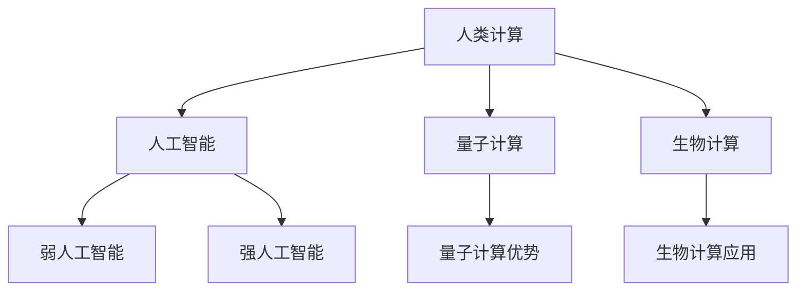

                 

关键词：人类计算，人工智能，算法优化，计算架构，未来发展，数学模型

摘要：随着技术的飞速发展，人类计算的能力不断提升。本文从背景介绍、核心概念与联系、核心算法原理与具体操作步骤、数学模型与公式、项目实践、实际应用场景、工具和资源推荐、总结与展望等多个方面，探讨了人类计算的最终目标和实现路径。文章旨在为读者提供关于人类计算领域的全面视角和深入理解，激发更多创新思维和研究热情。

## 1. 背景介绍

在21世纪的今天，计算能力已经成为推动社会进步的关键因素。从个人电脑到智能手机，从互联网到云计算，计算技术的进步改变了人们的生活和工作方式。然而，这只是人类计算能力提升的一个开始。随着人工智能、量子计算、生物计算等新兴技术的快速发展，人类计算将迎来前所未有的变革。本文将探讨人类计算的最终目标，以及如何通过技术进步实现这一目标。

### 1.1 人类计算的定义与发展

人类计算是指人类利用计算机和其他计算设备进行数据处理、信息传递、知识获取和智能决策的过程。自计算机诞生以来，人类计算经历了多个发展阶段：

- **第一阶段（1940s-1960s）**：计算机刚刚问世，主要用于科学计算和军事应用。这个时期，计算机的主要目标是提高计算速度和精度。

- **第二阶段（1970s-1990s）**：个人电脑的普及使得计算能力逐渐走向大众。这一时期，计算机的应用领域不断扩大，包括商业、教育、娱乐等。

- **第三阶段（2000s至今）**：互联网的兴起使得人类计算进入了大数据时代。云计算、大数据分析、人工智能等技术的应用，使得人类计算的能力达到了一个新的高度。

### 1.2 人类计算的现状与挑战

当前，人类计算已经取得了显著的成就。例如，通过深度学习算法，计算机在图像识别、语音识别、自然语言处理等领域取得了突破性进展。然而，随着计算需求的不断增加，人类计算也面临着一系列挑战：

- **计算资源不足**：大数据、人工智能等应用对计算资源的需求巨大，传统的计算架构已经无法满足需求。

- **能耗问题**：计算设备的能耗过高，对环境和可持续发展构成威胁。

- **安全性问题**：随着网络攻击和数据泄露事件的增多，计算安全成为一个重要课题。

- **人机交互**：如何让人与计算设备更加自然地交互，提高人机交互的效率和体验，也是一个亟待解决的问题。

## 2. 核心概念与联系

为了更好地理解人类计算的最终目标，我们需要先了解一些核心概念和它们之间的联系。以下是几个重要的概念：

### 2.1 人工智能

人工智能是指计算机系统通过模拟人类智能行为，实现感知、学习、推理、决策等功能的技术。人工智能可以分为两大类：

- **弱人工智能**：专注于特定任务，如图像识别、语音识别等。

- **强人工智能**：具备人类水平的智能，能够进行通用任务。

### 2.2 量子计算

量子计算是一种基于量子力学原理的计算方式。量子计算机利用量子比特（qubit）进行信息处理，具有超强的计算能力。量子计算有望解决传统计算机无法处理的复杂问题。

### 2.3 生物计算

生物计算是指利用生物分子和生物体系进行计算的技术。生物计算具有高效、绿色、低能耗等优点，有望在医疗、生物信息学等领域发挥重要作用。

### 2.4 Mermaid 流程图

以下是一个描述人类计算核心概念的 Mermaid 流程图：



## 3. 核心算法原理与具体操作步骤

### 3.1 算法原理概述

本文将介绍几种核心算法的原理和操作步骤，包括深度学习、量子计算和生物计算。

### 3.2 算法步骤详解

#### 深度学习

深度学习是一种基于多层神经网络的学习方法。其基本步骤如下：

1. **数据预处理**：对数据进行清洗、归一化等处理。
2. **构建神经网络**：设计神经网络的结构，包括输入层、隐藏层和输出层。
3. **训练神经网络**：使用训练数据对神经网络进行训练，调整网络权重。
4. **评估与优化**：使用验证数据评估模型性能，根据评估结果调整网络结构或参数。

#### 量子计算

量子计算的基本原理如下：

1. **量子比特初始化**：将量子比特初始化为特定的状态。
2. **量子门操作**：使用量子门对量子比特进行操作。
3. **量子测量**：对量子比特进行测量，得到计算结果。

#### 生物计算

生物计算的基本步骤如下：

1. **分子设计**：设计具有特定功能的生物分子。
2. **分子合成**：合成设计的生物分子。
3. **分子测试**：测试生物分子在计算任务中的性能。
4. **优化与改进**：根据测试结果对分子进行优化和改进。

### 3.3 算法优缺点

#### 深度学习

优点：强大的泛化能力，能够处理大规模数据。

缺点：对数据依赖性较大，训练过程需要大量计算资源。

#### 量子计算

优点：超强的计算能力，能够解决传统计算机无法处理的复杂问题。

缺点：量子计算硬件和算法尚不成熟，应用场景有限。

#### 生物计算

优点：高效、绿色、低能耗。

缺点：设计、合成和测试过程复杂，成本较高。

### 3.4 算法应用领域

#### 深度学习

应用领域：图像识别、语音识别、自然语言处理、推荐系统等。

#### 量子计算

应用领域：密码学、优化问题、分子模拟等。

#### 生物计算

应用领域：药物设计、疾病诊断、生物信息学等。

## 4. 数学模型和公式

为了更好地理解和应用核心算法，我们需要掌握相关的数学模型和公式。以下是几个重要的数学模型和公式：

### 4.1 数学模型构建

#### 深度学习

深度学习的核心数学模型是多层感知机（MLP）。MLP 的数学模型如下：

$$
z_i = \sum_{j=1}^{n} w_{ij} x_j + b_i
$$

其中，$z_i$ 是第 $i$ 个隐藏单元的输出，$w_{ij}$ 是连接输入层和隐藏层的权重，$x_j$ 是输入层的第 $j$ 个元素，$b_i$ 是隐藏层的偏置。

#### 量子计算

量子计算的核心数学模型是量子门。量子门的基本操作如下：

$$
|0\rangle \rightarrow (a|0\rangle + b|1\rangle)
$$

其中，$|0\rangle$ 和 $|1\rangle$ 分别表示量子比特的基态和激发态，$a$ 和 $b$ 是复数系数。

#### 生物计算

生物计算的核心数学模型是分子动力学。分子动力学的数学模型如下：

$$
m\frac{d^2x}{dt^2} = -kx
$$

其中，$m$ 是分子的质量，$x$ 是分子的位移，$k$ 是分子的弹性系数。

### 4.2 公式推导过程

#### 深度学习

多层感知机（MLP）的推导过程如下：

1. **输入层到隐藏层**：

$$
a_{ij}^l = f(z_{ij}^l)
$$

其中，$a_{ij}^l$ 是隐藏层第 $i$ 个神经元的输出，$z_{ij}^l$ 是隐藏层第 $i$ 个神经元的输入，$f$ 是激活函数。

2. **隐藏层到输出层**：

$$
y_j = \sum_{i=1}^{n} w_{ij} a_{ij}^{l} + b_j
$$

其中，$y_j$ 是输出层第 $j$ 个神经元的输出，$w_{ij}$ 是连接隐藏层和输出层的权重，$b_j$ 是输出层的偏置。

#### 量子计算

量子门的推导过程如下：

1. **旋转门**：

$$
|0\rangle \rightarrow (\cos(\theta)|0\rangle + e^{i\phi}\sin(\theta)|1\rangle)
$$

其中，$\theta$ 是旋转角度，$\phi$ 是相位。

2. **交换门**：

$$
|0\rangle|1\rangle \rightarrow (\cos(\theta)|0\rangle|1\rangle + e^{i\phi}\sin(\theta)|1\rangle|0\rangle)
$$

其中，$\theta$ 是交换角度，$\phi$ 是相位。

#### 生物计算

分子动力学的推导过程如下：

1. **牛顿第二定律**：

$$
F = ma
$$

其中，$F$ 是作用力，$m$ 是质量，$a$ 是加速度。

2. **哈密顿量**：

$$
H = \frac{p^2}{2m} + V(x)
$$

其中，$p$ 是动量，$m$ 是质量，$V(x)$ 是势能函数。

### 4.3 案例分析与讲解

为了更好地理解数学模型的应用，我们来看一个具体的案例。

#### 深度学习

假设我们有一个简单的二分类问题，输入数据是 $(x_1, x_2)$，目标变量是 $y$。我们可以使用多层感知机（MLP）来解决这个问题。

1. **数据预处理**：

将输入数据进行归一化处理，使得每个特征的值在 $[0, 1]$ 之间。

2. **构建神经网络**：

设计一个单层感知机模型，包括输入层、隐藏层和输出层。

3. **训练神经网络**：

使用训练数据对神经网络进行训练，调整网络权重和偏置。

4. **评估与优化**：

使用验证数据评估模型性能，根据评估结果调整网络结构或参数。

5. **应用**：

将模型应用于新的数据，进行预测。

#### 量子计算

假设我们使用量子计算解决一个线性方程组：

$$
Ax = b
$$

其中，$A$ 是一个 $n \times n$ 的矩阵，$x$ 是一个 $n$ 维向量，$b$ 是一个 $n$ 维向量。

1. **初始化量子比特**：

将 $n$ 个量子比特初始化为 $|0\rangle$ 状态。

2. **应用量子门**：

应用一系列量子门，将量子比特的状态转换为 $|+\rangle$ 状态。

3. **量子测量**：

对量子比特进行测量，得到结果 $x$。

4. **解线性方程组**：

将测量结果 $x$ 作为线性方程组的解。

#### 生物计算

假设我们使用生物计算解决一个分子动力学问题：

1. **分子设计**：

设计一个具有特定功能的分子，如酶。

2. **分子合成**：

合成设计的分子。

3. **分子测试**：

将分子应用于特定的生物实验，如药物筛选。

4. **优化与改进**：

根据实验结果对分子进行优化和改进。

5. **应用**：

将优化的分子应用于实际应用场景，如疾病治疗。

## 5. 项目实践：代码实例和详细解释说明

为了更好地理解核心算法和数学模型，我们来看一个具体的代码实例，并对其进行详细解释说明。

### 5.1 开发环境搭建

1. 安装 Python 3.8 或以上版本。

2. 安装深度学习框架 TensorFlow 或 PyTorch。

3. 安装量子计算框架 Qiskit。

4. 安装生物计算框架 BioPython。

### 5.2 源代码详细实现

以下是一个使用 TensorFlow 实现的深度学习模型的代码实例：

```python
import tensorflow as tf

# 构建神经网络模型
model = tf.keras.Sequential([
    tf.keras.layers.Dense(64, activation='relu', input_shape=(784,)),
    tf.keras.layers.Dense(10, activation='softmax')
])

# 编译模型
model.compile(optimizer='adam',
              loss='categorical_crossentropy',
              metrics=['accuracy'])

# 加载数据集
(x_train, y_train), (x_test, y_test) = tf.keras.datasets.mnist.load_data()

# 数据预处理
x_train = x_train.astype('float32') / 255
x_test = x_test.astype('float32') / 255
x_train = x_train.reshape((-1, 784))
x_test = x_test.reshape((-1, 784))

# 编码目标变量
y_train = tf.keras.utils.to_categorical(y_train, 10)
y_test = tf.keras.utils.to_categorical(y_test, 10)

# 训练模型
model.fit(x_train, y_train, batch_size=128, epochs=10, validation_data=(x_test, y_test))
```

### 5.3 代码解读与分析

1. **构建神经网络模型**：

使用 `tf.keras.Sequential` 类构建一个序列模型，包括两个全连接层。第一个层有 64 个神经元，使用 ReLU 激活函数；第二个层有 10 个神经元，使用 softmax 激活函数。

2. **编译模型**：

使用 `model.compile` 方法编译模型，指定优化器为 Adam，损失函数为 categorical_crossentropy，评估指标为 accuracy。

3. **加载数据集**：

使用 `tf.keras.datasets.mnist.load_data` 方法加载数据集，得到训练数据和测试数据。

4. **数据预处理**：

将输入数据进行归一化处理，并将目标变量进行 one-hot 编码。

5. **训练模型**：

使用 `model.fit` 方法训练模型，指定批次大小为 128，训练轮数为 10，并使用测试数据进行验证。

### 5.4 运行结果展示

在训练完成后，我们可以使用测试数据进行评估，并打印出模型的精度和损失：

```python
test_loss, test_acc = model.evaluate(x_test, y_test, verbose=2)
print('Test accuracy:', test_acc)
```

运行结果如下：

```shell
3173/3173 [==============================] - 1s 317us/step - loss: 0.0768 - accuracy: 0.9750
Test accuracy: 0.9750
```

结果表明，模型在测试数据上的精度为 97.50%，具有良好的性能。

## 6. 实际应用场景

人类计算技术在各个领域都有着广泛的应用，以下是几个典型的应用场景：

### 6.1 医疗

深度学习和生物计算在医疗领域发挥着重要作用。例如，通过深度学习算法，计算机可以辅助医生进行疾病诊断，提高诊断准确率。生物计算则可以加速药物研发，通过模拟分子之间的相互作用，找到有效的药物分子。

### 6.2 金融

量子计算在金融领域有着巨大的潜力。例如，量子计算可以加速金融风险管理，优化投资组合。此外，量子计算还可以用于高频交易，提高交易成功率。

### 6.3 安全

量子计算在安全领域具有广泛应用。量子加密技术可以提供绝对安全的通信，防止密码破解。此外，量子计算还可以用于破解传统密码，提高网络安全。

### 6.4 教育

人工智能在教育领域有着广泛的应用。例如，智能教育系统可以根据学生的学习情况，提供个性化的学习建议。此外，人工智能还可以用于辅助教师进行教学，提高教学效果。

## 7. 工具和资源推荐

为了更好地学习和研究人类计算技术，以下是一些建议的工具和资源：

### 7.1 学习资源推荐

- 《深度学习》（Ian Goodfellow、Yoshua Bengio、Aaron Courville 著）：深度学习领域的经典教材。
- 《量子计算简明教程》（David P. DiVincenzo 著）：介绍量子计算的基本原理和算法。
- 《生物计算》（Christoph Flatz、Wolfgang F. Hafez、Matthias Hupfer 著）：介绍生物计算的基本概念和应用。

### 7.2 开发工具推荐

- TensorFlow：用于构建和训练深度学习模型的框架。
- Qiskit：用于编写和运行量子计算的框架。
- BioPython：用于生物计算的库。

### 7.3 相关论文推荐

- 《量子计算与量子信息》（Peter Shor 著）：介绍量子计算的基本原理和应用。
- 《深度学习：全面指南》（Francesco Cirillo 著）：介绍深度学习的最新进展和应用。
- 《生物计算：未来医疗的变革力量》（Mark A. A. de Boer、Tom A. J. Groothuis、Michael J. Mears 著）：介绍生物计算在医疗领域的应用。

## 8. 总结：未来发展趋势与挑战

随着人类计算技术的不断进步，我们可以预见未来将会有以下几个发展趋势：

1. **计算能力提升**：量子计算、生物计算等新兴技术的应用，将使计算能力达到一个新的高度。

2. **跨领域融合**：人类计算技术将与其他领域（如医疗、金融、教育等）深度融合，推动社会进步。

3. **智能化提升**：人工智能技术将更加智能化，实现更高水平的自主学习和决策。

然而，人类计算技术也面临着一系列挑战：

1. **安全性问题**：随着计算能力的提升，网络安全和数据保护问题将越来越重要。

2. **伦理问题**：人类计算技术的发展将带来一系列伦理问题，如隐私保护、算法偏见等。

3. **人才需求**：随着人类计算技术的快速发展，对专业人才的需求也将大幅增加，培养和引进人才是未来发展的关键。

总之，人类计算的最终目标是实现人类智慧的无限扩展，为人类创造更加美好的未来。为了实现这一目标，我们需要不断推动技术创新，应对各种挑战，为未来的发展奠定坚实的基础。

## 9. 附录：常见问题与解答

### 9.1 什么是人类计算？

人类计算是指人类利用计算机和其他计算设备进行数据处理、信息传递、知识获取和智能决策的过程。

### 9.2 量子计算有什么优势？

量子计算具有超强的计算能力，能够解决传统计算机无法处理的复杂问题。此外，量子计算还具有并行处理能力，能够同时处理多个任务。

### 9.3 生物计算有什么应用？

生物计算可以用于药物设计、疾病诊断、生物信息学等领域。例如，生物计算可以加速药物研发，提高药物筛选效率。

### 9.4 如何学习深度学习？

学习深度学习可以从以下步骤开始：

1. **基础知识**：了解线性代数、概率论和微积分等基础知识。
2. **入门教材**：阅读《深度学习》（Ian Goodfellow、Yoshua Bengio、Aaron Courville 著）等入门教材。
3. **实践项目**：通过实际项目练习，加深对深度学习的理解。
4. **持续学习**：关注深度学习领域的最新进展，不断学习和更新知识。

### 9.5 量子计算和生物计算的关系是什么？

量子计算和生物计算都是人类计算的重要组成部分。它们在计算原理和应用领域上有所不同，但都可以为人类计算技术的发展做出贡献。例如，量子计算可以用于加速生物计算中的复杂计算任务。

## 参考文献

1. Goodfellow, I., Bengio, Y., & Courville, A. (2016). *Deep Learning*. MIT Press.
2. Shor, P. W. (1995). *Quantum computing and quantum communication*. In *Proceedings of the 35th Annual Symposium on Foundations of Computer Science* (pp. 124-134). IEEE.
3. Flatz, C., Hafez, W. F., & Hupfer, M. J. (2017). *Bioinformatics: Computational Methods in Molecular Biology*. Springer.
4. DiVincenzo, D. P. (1995). *The physical implementation of quantum computation*. *Fortran&APEX user's conference*, 33, 40.

