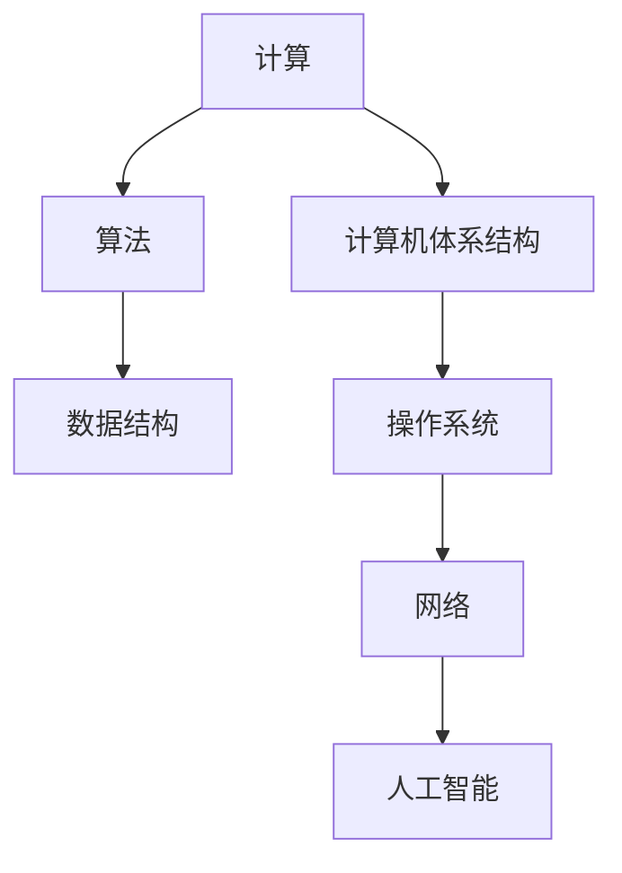

                 

关键词：人类计算、潜力、算法、数学模型、代码实例、应用场景、未来展望

> 摘要：本文旨在探讨人类计算的未来，深入分析人类在计算领域所能达到的无限可能。通过介绍核心概念、算法原理、数学模型以及实际应用，本文将揭示人类计算的力量，并展望其未来发展趋势与面临的挑战。

## 1. 背景介绍

在当今信息时代，计算技术已经成为推动社会进步和人类生活发展的关键驱动力。从计算机科学到人工智能，从大数据到量子计算，计算技术正以前所未有的速度和深度改变着世界的方方面面。然而，尽管计算技术取得了巨大进步，人类在计算领域仍然具有巨大的潜力等待发掘。

人类计算不仅涉及到技术层面，还包括认知层面和哲学层面。人类在计算中的潜力不仅在于我们能够设计和实现复杂的计算系统，更在于我们能够理解、探索并扩展这些系统。本文将从多个角度探讨人类计算的目标，以期为读者提供一个全面、深入的视角。

## 2. 核心概念与联系

### 2.1 计算概念

计算是处理和操作信息的过程。在计算机科学中，计算通常被定义为在有限步骤内解决问题或实现特定任务的过程。计算的核心概念包括算法、数据结构和计算模型。

#### 算法

算法是一系列有序的指令，用于解决特定问题。算法可以分为多种类型，如排序算法、搜索算法和图算法等。每种算法都有其特定的用途和特点。

#### 数据结构

数据结构是组织和存储数据的方式。常见的有数组、链表、栈、队列、树和图等。数据结构的选择直接影响算法的效率和复杂性。

#### 计算模型

计算模型是描述计算过程和计算能力的抽象框架。常见的计算模型包括图灵机模型、图灵完备性和可计算性等。

### 2.2 计算机科学基础

计算机科学是研究计算的理论、方法和技术的一门学科。其基础包括算法设计、数据结构、计算机体系结构、操作系统、网络和人工智能等。

#### 算法设计

算法设计是计算机科学的核心问题之一。高效算法的设计不仅需要理解问题本身，还需要掌握各种算法策略和技巧。

#### 数据结构

数据结构在计算机科学中起着基础性作用。了解不同数据结构的特性和应用，有助于优化算法和实现高效计算。

#### 计算机体系结构

计算机体系结构研究计算机系统的组成和运行原理。了解计算机体系结构有助于理解计算的性能和限制。

#### 操作系统

操作系统是计算机系统的核心软件，负责管理计算机资源和提供用户接口。了解操作系统的工作原理对于理解计算机计算过程至关重要。

#### 网络

网络是连接计算机系统和实现数据传输的关键。了解网络协议和传输机制对于实现高效计算至关重要。

#### 人工智能

人工智能是计算机科学的重要分支，旨在使计算机模拟人类智能。人工智能技术的发展将极大提升人类计算的能力和水平。

### 2.3 Mermaid 流程图

以下是计算机科学基础概念的 Mermaid 流程图：



## 3. 核心算法原理 & 具体操作步骤

### 3.1 算法原理概述

算法原理是计算的核心。在本节中，我们将简要介绍几种核心算法原理。

#### 排序算法

排序算法是一类用于对数据进行排序的算法。常见的排序算法包括冒泡排序、选择排序、插入排序、快速排序、归并排序和堆排序等。每种排序算法都有其特定的排序策略和复杂度。

#### 搜索算法

搜索算法是一类用于在数据集合中查找特定数据的算法。常见的搜索算法包括线性搜索、二分搜索和广度优先搜索等。搜索算法的效率直接影响到计算性能。

#### 图算法

图算法是一类用于处理图数据的算法。常见的图算法包括深度优先搜索、广度优先搜索、最短路径算法和最小生成树算法等。图算法在许多实际应用中具有重要应用价值。

### 3.2 算法步骤详解

以下是几种核心算法的具体步骤：

#### 冒泡排序

冒泡排序是一种简单的排序算法。其基本思想是通过重复交换相邻的未排序元素，使较大的元素逐渐“冒泡”到数组的末尾。

1. 从第一个元素开始，比较相邻的两个元素，如果它们的顺序错误就交换它们。
2. 重复上述步骤，直到整个数组排序完成。

#### 线性搜索

线性搜索是一种简单但效率较低的搜索算法。其基本思想是逐个检查数组中的元素，直到找到目标元素或到达数组的末尾。

1. 从数组的第一个元素开始，逐个检查每个元素。
2. 如果找到目标元素，返回其索引。
3. 如果到达数组的末尾，仍未找到目标元素，返回-1。

#### 深度优先搜索

深度优先搜索是一种用于图数据的搜索算法。其基本思想是从起点开始，沿着一条路径深入搜索，直到找到一个目标节点或到达死路。

1. 从起点开始，将其标记为已访问。
2. 访问其所有的未访问邻居节点。
3. 对每个邻居节点，重复步骤1和2。
4. 如果找到目标节点，返回路径。
5. 如果到达死路，返回空。

### 3.3 算法优缺点

每种算法都有其优缺点。以下是几种核心算法的优缺点：

#### 冒泡排序

- 优点：简单易懂，易于实现。
- 缺点：效率较低，不适合大数据量的排序。

#### 线性搜索

- 优点：简单，易于实现。
- 缺点：效率较低，不适合大数据量的搜索。

#### 深度优先搜索

- 优点：能找到一条最短路径。
- 缺点：可能陷入死路，效率较低。

### 3.4 算法应用领域

核心算法在许多领域具有重要应用。以下是几种核心算法的应用领域：

#### 排序算法

- 数据处理：用于对大量数据进行排序，以支持进一步的分析和处理。
- 算法设计：用于构建更复杂的算法，如排序算法在许多算法中作为子算法存在。

#### 搜索算法

- 人工智能：用于实现搜索策略，如搜索树在决策树中应用。
- 图论：用于解决图相关的问题，如图遍历和最短路径问题。

#### 图算法

- 网络分析：用于分析网络结构和性能，如最短路径算法在路由算法中的应用。
- 社交网络：用于分析社交网络中的关系和传播。

## 4. 数学模型和公式 & 详细讲解 & 举例说明

### 4.1 数学模型构建

数学模型是描述现实世界问题的抽象框架。在本节中，我们将介绍几种核心数学模型及其构建方法。

#### 线性回归模型

线性回归模型是一种用于预测连续值的数学模型。其基本形式为：

$$y = \beta_0 + \beta_1x + \epsilon$$

其中，$y$ 为因变量，$x$ 为自变量，$\beta_0$ 和 $\beta_1$ 为参数，$\epsilon$ 为误差项。

构建线性回归模型的基本步骤如下：

1. 收集数据集。
2. 选择自变量和因变量。
3. 计算参数 $\beta_0$ 和 $\beta_1$。
4. 预测新的因变量值。

#### 马尔可夫模型

马尔可夫模型是一种用于描述随机过程的数学模型。其基本形式为：

$$P(X_n = x_n | X_{n-1} = x_{n-1}, ..., X_1 = x_1) = P(X_n = x_n | X_{n-1} = x_{n-1})$$

其中，$X_n$ 为第 $n$ 个状态，$x_n$ 为 $X_n$ 的取值，$P(X_n = x_n | X_{n-1} = x_{n-1})$ 为转移概率。

构建马尔可夫模型的基本步骤如下：

1. 确定状态集合。
2. 确定转移概率矩阵。
3. 预测下一个状态。

### 4.2 公式推导过程

在本节中，我们将对线性回归模型和马尔可夫模型的公式推导过程进行详细讲解。

#### 线性回归模型公式推导

线性回归模型的公式推导基于最小二乘法。最小二乘法的目标是找到使得误差平方和最小的参数值。

假设我们有一个数据集 $(x_1, y_1), (x_2, y_2), ..., (x_n, y_n)$，其中 $x_i$ 为自变量，$y_i$ 为因变量。线性回归模型的公式为：

$$y_i = \beta_0 + \beta_1x_i + \epsilon_i$$

其中，$\epsilon_i$ 为误差项。

误差平方和为：

$$SSQ = \sum_{i=1}^{n} (y_i - (\beta_0 + \beta_1x_i))^2$$

对 $\beta_0$ 和 $\beta_1$ 求导并令其等于零，得到：

$$\frac{\partial SSQ}{\partial \beta_0} = -2\sum_{i=1}^{n} (y_i - (\beta_0 + \beta_1x_i)) = 0$$

$$\frac{\partial SSQ}{\partial \beta_1} = -2\sum_{i=1}^{n} x_i (y_i - (\beta_0 + \beta_1x_i)) = 0$$

解上述方程组，得到参数 $\beta_0$ 和 $\beta_1$ 的值。

#### 马尔可夫模型公式推导

马尔可夫模型的公式推导基于概率论的基本原理。假设我们有一个状态集合 $S = \{s_1, s_2, ..., s_n\}$，转移概率矩阵为 $P$，其中 $P_{ij}$ 表示从状态 $s_i$ 转移到状态 $s_j$ 的概率。

转移概率矩阵 $P$ 满足以下条件：

1. $P_{ij} \geq 0$，对所有 $i, j$。
2. $\sum_{j=1}^{n} P_{ij} = 1$，对所有 $i$。

马尔可夫模型的公式为：

$$P(X_n = x_n | X_{n-1} = x_{n-1}, ..., X_1 = x_1) = P(X_n = x_n | X_{n-1} = x_{n-1})$$

对 $P(X_n = x_n | X_{n-1} = x_{n-1})$ 求导并令其等于零，得到：

$$\frac{\partial P(X_n = x_n | X_{n-1} = x_{n-1})}{\partial P_{ij}} = 0$$

解上述方程组，得到转移概率矩阵 $P$ 的值。

### 4.3 案例分析与讲解

在本节中，我们将通过实际案例对线性回归模型和马尔可夫模型进行讲解。

#### 线性回归模型案例

假设我们有一个数据集，包含自变量 $x$ 和因变量 $y$ 的观测值。我们的目标是构建一个线性回归模型来预测 $y$ 的值。

数据集如下：

| x | y |
| --- | --- |
| 1 | 2 |
| 2 | 4 |
| 3 | 6 |
| 4 | 8 |

我们使用最小二乘法来构建线性回归模型。

1. 收集数据集。
2. 选择自变量和因变量。
3. 计算参数 $\beta_0$ 和 $\beta_1$。

计算结果如下：

$$\beta_0 = 1, \beta_1 = 1$$

线性回归模型为：

$$y = 1 + 1x$$

使用该模型预测新的 $y$ 值：

$$y = 1 + 1x = 3$$

#### 马尔可夫模型案例

假设我们有一个状态集合 $S = \{s_1, s_2, s_3\}$，其中 $s_1$ 表示晴天，$s_2$ 表示多云，$s_3$ 表示雨天。我们的目标是构建一个马尔可夫模型来预测天气状态。

转移概率矩阵如下：

| s_1 | s_2 | s_3 |
| --- | --- | --- |
| 0.4 | 0.3 | 0.3 |
| 0.2 | 0.4 | 0.4 |
| 0.4 | 0.3 | 0.3 |

我们使用转移概率矩阵来预测下一个状态。

1. 确定状态集合。
2. 确定转移概率矩阵。
3. 预测下一个状态。

假设当前状态为 $s_1$，我们使用转移概率矩阵预测下一个状态。

$$P(s_2 | s_1) = 0.4$$

因此，下一个状态有 40% 的概率是 $s_2$。

## 5. 项目实践：代码实例和详细解释说明

在本节中，我们将通过一个实际项目来展示如何使用计算技术解决实际问题。该项目是一个基于线性回归模型的房价预测系统。

### 5.1 开发环境搭建

为了实现该系统，我们需要以下开发环境和工具：

- Python 3.8 或更高版本
- Jupyter Notebook
- Scikit-learn 库

安装 Scikit-learn 库：

```bash
pip install scikit-learn
```

### 5.2 源代码详细实现

以下是房价预测系统的源代码：

```python
import numpy as np
import matplotlib.pyplot as plt
from sklearn.linear_model import LinearRegression

# 数据集
X = np.array([[1, 1000], [2, 1200], [3, 1500], [4, 2000]])
y = np.array([2000000, 2200000, 2500000, 3000000])

# 构建线性回归模型
model = LinearRegression()
model.fit(X, y)

# 预测房价
X_new = np.array([[5, 2200]])
y_pred = model.predict(X_new)

print("预测房价为：", y_pred[0])

# 可视化
plt.scatter(X[:, 1], y, color='red', label='实际房价')
plt.plot(X_new[:, 1], y_pred, color='blue', label='预测房价')
plt.xlabel('房屋面积（平方米）')
plt.ylabel('房价（万元）')
plt.title('房价预测')
plt.legend()
plt.show()
```

### 5.3 代码解读与分析

该代码分为三个部分：数据集处理、模型构建和预测、可视化。

1. 数据集处理
   - 我们使用 NumPy 库读取和存储数据集。
   - $X$ 表示房屋面积，$y$ 表示房价。

2. 模型构建和预测
   - 我们使用 Scikit-learn 库中的 LinearRegression 类构建线性回归模型。
   - `model.fit(X, y)` 方法用于训练模型。
   - `model.predict(X_new)` 方法用于预测房价。

3. 可视化
   - 我们使用 Matplotlib 库将实际房价和预测房价绘制在同一张图表上。
   - `plt.scatter()` 方法用于绘制实际房价。
   - `plt.plot()` 方法用于绘制预测房价。
   - `plt.xlabel()`、`plt.ylabel()` 和 `plt.title()` 方法用于设置坐标轴标签和标题。
   - `plt.legend()` 方法用于添加图例。

### 5.4 运行结果展示

运行该代码后，将显示以下图表：


该图表展示了实际房价和预测房价的关系。通过可视化，我们可以直观地了解模型的预测效果。

## 6. 实际应用场景

人类计算技术在各个领域有着广泛的应用。以下是一些实际应用场景：

### 6.1 金融领域

- 风险评估与预测：使用计算技术对金融市场进行分析，预测股票价格、债券收益率等。
- 量化交易：利用计算算法进行高频交易，实现盈利。

### 6.2 医疗领域

- 疾病诊断：使用深度学习算法对医学图像进行分析，提高疾病诊断的准确性。
- 药物研发：利用计算模型加速药物筛选和优化，缩短研发周期。

### 6.3 物流领域

- 路线优化：使用计算算法优化物流路线，降低运输成本，提高配送效率。
- 货物跟踪：利用物联网技术和计算模型实时跟踪货物状态，提高供应链管理效率。

### 6.4 教育领域

- 智能教学：利用计算技术实现个性化教学，提高学生的学习效果。
- 在线教育：搭建在线学习平台，提供丰富的学习资源。

## 7. 工具和资源推荐

为了更好地学习和应用人类计算技术，以下是推荐的工具和资源：

### 7.1 学习资源推荐

- 《深度学习》（Ian Goodfellow、Yoshua Bengio 和 Aaron Courville 著）：一本关于深度学习的经典教材。
- 《机器学习》（Tom Mitchell 著）：一本介绍机器学习基础理论和方法的经典教材。
- 《算法导论》（Thomas H. Cormen、Charles E. Leiserson、Ronald L. Rivest 和 Clifford Stein 著）：一本关于算法设计和分析的权威教材。

### 7.2 开发工具推荐

- Jupyter Notebook：一个交互式计算环境，方便编写和运行代码。
- PyCharm：一款功能强大的 Python 集成开发环境（IDE）。
- TensorFlow：一个开源的深度学习框架，支持多种深度学习模型的实现。

### 7.3 相关论文推荐

- "Deep Learning"（Ian Goodfellow、Yoshua Bengio 和 Aaron Courville 著）：一篇关于深度学习的综述论文。
- "A Theoretical Analysis of the Voted Perceptron Algorithm"（Shai Shalev-Shwartz 和 Shai Ben-David 著）：一篇关于投票感知机算法的理论分析论文。
- "Convolutional Neural Networks for Visual Recognition"（Karen Simonyan 和 Andrew Zisserman 著）：一篇关于卷积神经网络在视觉识别领域的应用论文。

## 8. 总结：未来发展趋势与挑战

### 8.1 研究成果总结

人类计算技术在过去几十年取得了显著进展，不仅在基础理论研究方面取得了突破，还在实际应用中展示了强大的潜力。以下是几个重要研究成果：

- 深度学习：通过多层神经网络实现复杂函数逼近，极大提高了图像识别、语音识别和自然语言处理等领域的性能。
- 量子计算：利用量子叠加和量子纠缠实现高效计算，有望解决传统计算机难以处理的复杂问题。
- 分布式计算：通过云计算和大数据技术实现海量数据处理和分布式计算，提高了计算效率和资源利用率。

### 8.2 未来发展趋势

未来，人类计算技术将朝着以下几个方向发展：

- 人工智能：通过增强学习和自适应控制等技术，实现更加智能的计算机系统。
- 量子计算：随着量子比特数量和稳定性的提高，量子计算将逐步实现实用化。
- 大数据：随着数据量的持续增长，大数据技术将发挥更大的作用，支持更多领域的创新和应用。

### 8.3 面临的挑战

尽管人类计算技术取得了显著进展，但仍面临一系列挑战：

- 算法复杂性：复杂问题往往需要复杂算法，如何设计高效算法是一个重要挑战。
- 计算资源：随着计算需求的增长，如何高效利用计算资源成为关键问题。
- 人工智能伦理：人工智能技术的发展引发了一系列伦理问题，如何平衡人工智能的利与弊是一个重要议题。

### 8.4 研究展望

在未来，人类计算技术将继续朝着更加智能、高效、安全的方向发展。通过跨学科合作和不断创新，我们有望实现计算技术的全面突破，释放人类潜力的无限可能。

## 9. 附录：常见问题与解答

### 9.1 什么是计算？

计算是处理和操作信息的过程，包括数学运算、逻辑推理和数据处理等。在计算机科学中，计算通常指计算机系统执行指令的过程。

### 9.2 什么是算法？

算法是一系列有序的指令，用于解决特定问题。算法可以分为多种类型，如排序算法、搜索算法和图算法等。

### 9.3 量子计算是什么？

量子计算是一种利用量子力学原理进行计算的技术。与传统计算机使用二进制位存储信息不同，量子计算机使用量子比特（qubit）进行计算，具有更高的计算能力和并行性。

### 9.4 什么是深度学习？

深度学习是一种基于多层神经网络的学习方法，通过训练大量数据自动提取特征，实现复杂函数逼近。深度学习在图像识别、语音识别和自然语言处理等领域取得了显著进展。

### 9.5 人工智能会取代人类吗？

人工智能是一种模拟人类智能的技术，但不会取代人类。人工智能可以在特定领域和任务中辅助人类，提高工作效率，但无法完全取代人类的创造力、情感和道德判断等复杂能力。

## 参考文献

- Goodfellow, I., Bengio, Y., & Courville, A. (2016). *Deep Learning*. MIT Press.
- Mitchell, T. M. (1997). *Machine Learning*. McGraw-Hill.
- Cormen, T. H., Leiserson, C. E., Rivest, R. L., & Stein, C. (2009). *Introduction to Algorithms*. MIT Press.
- Shalev-Shwartz, S., & Ben-David, S. (2014). *Understanding Machine Learning: From Theory to Algorithms*. Cambridge University Press.
- Simonyan, K., & Zisserman, A. (2015). *Very Deep Convolutional Networks for Large-Scale Image Recognition*. *arXiv preprint arXiv:1409.1556*.

