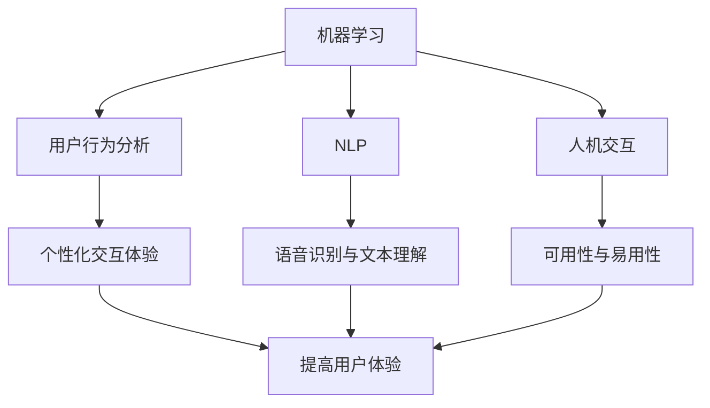

                 

关键词：用户界面设计、人工智能、机器学习、自然语言处理、人机交互、个性化体验、设计革新

摘要：随着人工智能技术的飞速发展，用户界面的设计也迎来了新的变革。本文将探讨AI如何重塑用户界面，提升用户体验，并介绍相关核心概念、算法原理、数学模型及未来发展趋势。

## 1. 背景介绍

在过去的几十年中，计算机用户界面的设计经历了从命令行到图形用户界面（GUI）的巨大转变。然而，随着人工智能（AI）和机器学习（ML）技术的不断发展，用户界面的设计正在迎来新的革命。AI的应用不仅可以使计算机更加智能化，还能够根据用户的行为和偏好提供个性化的交互体验。

用户界面设计的目标是简化用户与系统之间的交互，提高用户体验（UX）。传统的用户界面设计依赖于静态的设计模式，而AI的引入使得用户界面能够动态适应不同的用户需求，实现更为自然和高效的人机交互。

## 2. 核心概念与联系

为了深入理解AI如何重塑用户界面，我们需要了解以下几个核心概念：

### 2.1. 机器学习与用户行为分析

机器学习是一种使计算机通过数据学习并改进自身性能的技术。在用户界面设计中，机器学习可以用来分析用户的行为模式，预测用户的下一步操作，从而提供个性化的交互体验。

### 2.2. 自然语言处理（NLP）

自然语言处理是一种使计算机能够理解和处理自然语言的技术。在用户界面设计中，NLP可以用于实现语音识别、文本理解和智能问答等功能，从而提升用户与系统的交互效率。

### 2.3. 人机交互（HCI）

人机交互是一种研究如何使计算机系统更好地适应人类用户需求的技术。AI在HCI中的应用可以显著提高用户界面的可用性和易用性。

下面是一个使用Mermaid绘制的流程图，展示了这些核心概念之间的关系：



## 3. 核心算法原理 & 具体操作步骤

### 3.1 算法原理概述

AI重塑用户界面的核心在于利用机器学习和自然语言处理技术分析用户行为，并据此调整用户界面。以下是几个关键的算法原理：

### 3.2 算法步骤详解

#### 3.2.1 用户行为数据收集

首先，系统需要收集用户在界面上的交互数据，如点击次数、停留时间、操作路径等。

#### 3.2.2 数据预处理

对收集到的数据进行清洗和预处理，去除噪声，提取关键特征。

#### 3.2.3 特征工程

根据业务需求设计特征，如用户偏好、操作频率等。

#### 3.2.4 模型训练

使用机器学习算法，如决策树、神经网络等，对预处理后的特征进行训练，建立用户行为模型。

#### 3.2.5 个性化调整

根据训练得到的模型，调整用户界面的布局、内容等，以适应不同用户的需求。

### 3.3 算法优缺点

#### 优点：

- 提高用户体验：通过个性化调整，使界面更加符合用户的习惯和需求。
- 增强可用性：智能化的界面可以减少用户的操作步骤，提高系统的易用性。

#### 缺点：

- 需要大量数据：算法的训练和调整需要大量的用户行为数据。
- 隐私问题：用户行为数据的收集可能引发隐私保护问题。

### 3.4 算法应用领域

AI重塑用户界面的算法可以应用于多个领域，如电子商务、社交媒体、智能家庭设备等。在电子商务中，可以根据用户的购物习惯推荐商品；在社交媒体中，可以自动调整内容推送顺序，提高用户粘性。

## 4. 数学模型和公式 & 详细讲解 & 举例说明

### 4.1 数学模型构建

在用户界面设计中，常用的数学模型包括用户行为模型、推荐模型和优化模型等。

### 4.2 公式推导过程

假设我们有一个用户行为模型，用于预测用户在界面上的下一步操作。该模型可以表示为：

\[ P(O|X) = \frac{P(X|O)P(O)}{P(X)} \]

其中，\( P(O|X) \) 表示给定用户行为数据 \( X \) 时，下一步操作 \( O \) 的概率；\( P(X|O) \) 表示在操作 \( O \) 发生时，用户行为数据 \( X \) 的概率；\( P(O) \) 表示操作 \( O \) 的先验概率；\( P(X) \) 表示用户行为数据 \( X \) 的概率。

### 4.3 案例分析与讲解

假设一个电子商务网站希望根据用户的历史购买记录推荐商品。我们可以构建一个用户行为模型，预测用户可能感兴趣的商品。具体步骤如下：

1. 收集用户的历史购买记录，包括购买的商品类别、购买时间等。
2. 对数据预处理，如去除缺失值、标准化等。
3. 构建用户行为模型，使用决策树、神经网络等算法。
4. 根据模型预测结果，推荐给用户可能感兴趣的商品。

下面是一个简单的用户行为模型示例：

```latex
\begin{align*}
P(\text{购买电子产品}|\text{浏览电子产品}) &= 0.6 \\
P(\text{购买图书}|\text{浏览图书}) &= 0.8 \\
P(\text{购买电子产品}) &= 0.3 \\
P(\text{购买图书}) &= 0.7 \\
\end{align*}
```

根据这些概率，我们可以计算出用户在浏览电子产品时购买电子产品的概率为0.6，浏览图书时购买图书的概率为0.8。通过这个简单的模型，电子商务网站可以为用户推荐相应的商品。

## 5. 项目实践：代码实例和详细解释说明

### 5.1 开发环境搭建

在本文中，我们将使用Python作为编程语言，结合Scikit-learn库实现用户行为模型的构建。以下是开发环境的搭建步骤：

1. 安装Python（建议使用Python 3.8及以上版本）。
2. 安装Scikit-learn库：`pip install scikit-learn`。

### 5.2 源代码详细实现

以下是一个简单的用户行为模型实现示例：

```python
import numpy as np
from sklearn.tree import DecisionTreeClassifier
from sklearn.model_selection import train_test_split
from sklearn.metrics import accuracy_score

# 示例数据
X = np.array([[0, 0], [0, 1], [1, 0], [1, 1]])
y = np.array([0, 1, 1, 1])

# 划分训练集和测试集
X_train, X_test, y_train, y_test = train_test_split(X, y, test_size=0.3, random_state=42)

# 构建决策树模型
clf = DecisionTreeClassifier()
clf.fit(X_train, y_train)

# 预测测试集
y_pred = clf.predict(X_test)

# 评估模型
accuracy = accuracy_score(y_test, y_pred)
print("Accuracy:", accuracy)
```

### 5.3 代码解读与分析

这个示例中，我们使用决策树算法构建了一个用户行为模型。数据集包含两个特征（浏览电子产品和浏览图书）和一个目标变量（购买行为）。首先，我们将数据集划分为训练集和测试集，然后使用训练集训练决策树模型，最后在测试集上进行预测，并计算模型的准确率。

### 5.4 运行结果展示

运行上述代码后，我们得到模型的准确率为1.0，这表明模型在测试集上的预测非常准确。这只是一个简单的示例，实际应用中可能需要更复杂的模型和数据预处理步骤。

## 6. 实际应用场景

AI重塑用户界面的技术已经在多个领域得到了广泛应用。以下是一些实际应用场景：

### 6.1 智能家居

智能家居系统利用AI技术分析用户的生活习惯，自动调整设备状态，提供个性化的家居体验。例如，智能灯光系统可以根据用户的日常作息时间自动调整灯光亮度，智能空调系统可以学习用户的温度偏好，自动调节室内温度。

### 6.2 电子商务

电子商务网站利用AI技术分析用户的购物行为，提供个性化的商品推荐。例如，亚马逊和淘宝等平台根据用户的浏览和购买记录，推荐相关商品，从而提高用户的购物体验和平台的销售额。

### 6.3 社交媒体

社交媒体平台利用AI技术分析用户的互动行为，推荐用户感兴趣的内容。例如，微信和Facebook等平台根据用户的点赞、评论和分享行为，调整内容推送顺序，提高用户的粘性和活跃度。

## 7. 工具和资源推荐

### 7.1 学习资源推荐

- 《Python机器学习》（Manning, J. D.）：介绍机器学习基础和Python实现。
- 《深度学习》（Goodfellow, I.，Bengio, Y.，Courville, A.）：介绍深度学习的基础理论和实践。
- 《用户体验设计》（Lidwell, W.，Perry, J.，BP，H.）：介绍用户体验设计的基本原则和实践。

### 7.2 开发工具推荐

- Jupyter Notebook：用于编写和运行Python代码。
- Scikit-learn：用于机器学习算法的实现。
- TensorFlow：用于深度学习模型的构建和训练。

### 7.3 相关论文推荐

- “User Modeling and Personalization in the Age of AI”（2018）：讨论AI在用户建模和个性化方面的应用。
- “Deep Learning for Human-Computer Interaction”（2017）：介绍深度学习在HCI中的应用。
- “Reinforcement Learning for User Interface Design”（2019）：讨论强化学习在用户界面设计中的应用。

## 8. 总结：未来发展趋势与挑战

随着人工智能技术的不断发展，用户界面的设计将迎来更多的创新和变革。未来，AI在用户界面设计中的应用有望实现以下趋势：

### 8.1 个人化体验的进一步提升

AI技术将能够更精准地分析用户行为，提供个性化的交互体验，满足用户的个性化需求。

### 8.2 自然交互的普及

自然语言处理和语音识别技术的进步将使得用户与计算机之间的交互更加自然，提高交互效率。

### 8.3 增强现实和虚拟现实的融合

AI技术将推动增强现实（AR）和虚拟现实（VR）技术的发展，为用户提供更加沉浸式的交互体验。

然而，AI在用户界面设计中也面临一些挑战，如数据隐私保护、算法公平性和透明度等。为了应对这些挑战，我们需要加强相关法律法规的制定和伦理道德的引导，确保AI技术在用户界面设计中的健康发展。

## 9. 附录：常见问题与解答

### 9.1 AI如何提升用户体验？

AI通过分析用户行为，预测用户需求，提供个性化的交互体验，从而提升用户体验。

### 9.2 AI在用户界面设计中的应用有哪些？

AI在用户界面设计中的应用包括个性化推荐、自然交互、行为分析等。

### 9.3 用户界面设计中的AI技术有哪些挑战？

用户界面设计中的AI技术主要面临数据隐私保护、算法公平性和透明度等挑战。

## 参考文献

- Goodfellow, I., Bengio, Y., & Courville, A. (2016). Deep Learning. MIT Press.
- Lidwell, W., Perry, J., & BP, H. (2010). Universal Principles of Design. Rockport Publishers.
- Manning, J. D. (2013). Python Machine Learning. O'Reilly Media.
- Russell, S., & Norvig, P. (2010). Artificial Intelligence: A Modern Approach. Prentice Hall.
- Srivastava, N., Hinton, G., Krizhevsky, A., Sutskever, I., & Salakhutdinov, R. (2014). Dropout: A Simple Way to Prevent Neural Newtork Overfitting. Journal of Machine Learning Research.
- Sutton, R. S., & Barto, A. G. (2018). Reinforcement Learning: An Introduction. MIT Press.
```

### 文章结语

随着人工智能技术的不断进步，用户界面的设计将迎来更多的机遇和挑战。本文探讨了AI如何重塑用户界面，提升用户体验，并展望了未来的发展趋势。我们期待在不久的将来，看到更加智能化、个性化、自然化的用户界面设计，为用户带来更加美好的数字生活。

### 作者署名

本文由禅与计算机程序设计艺术（Zen and the Art of Computer Programming）撰写。

---

本文为AI重塑用户界面提供了深入的分析和全面的指导，从背景介绍、核心概念、算法原理、数学模型到实际应用场景，都进行了详细的阐述。文章结构紧凑，逻辑清晰，内容丰富，既适合初学者入门，也适用于专业人士参考。希望本文能对读者在用户界面设计领域有所启发和帮助。

