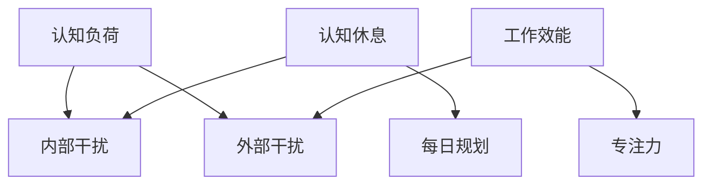

                 

关键词：专注力、干扰、技术策略、工作效能、认知负荷

> 摘要：在当今信息爆炸的时代，专注于复杂任务变得越来越困难。本文将探讨在充满干扰的环境中如何重新获得专注力，并提供一系列技术策略来帮助读者提升工作效能，减少认知负荷，从而在信息过载的世界中保持头脑清晰。

## 1. 背景介绍

随着互联网和移动设备的普及，现代人的生活越来越依赖数字技术。然而，这种依赖也带来了前所未有的干扰。电子邮件、社交媒体、即时通讯工具、新闻推送等，都不断抢占我们的注意力。根据一项研究，现代职场人士每天平均会收到大约120封电子邮件，还要处理超过100条短信和社交媒体通知。这些信息的不断涌入，让我们的专注力被严重分散，从而降低了工作效率和创造力。

专注力是完成复杂任务、实现创新思维和保持高生产力的关键。然而，在当今这个充满干扰的环境中，我们如何才能重新获得并保持专注力呢？这正是本文所要探讨的问题。

### 1.1 干扰的类型

在讨论如何提高专注力之前，我们需要先了解干扰的几种类型。干扰可以分为内部干扰和外部干扰：

- **内部干扰**：源自我们自身的思维活动，如焦虑、多任务处理习惯和自我怀疑等。
- **外部干扰**：来自于外部的刺激，如噪音、社交媒体通知和电子邮件等。

了解干扰的类型有助于我们制定针对性的策略来应对这些干扰。

### 1.2 专注力的重要性

专注力不仅影响我们的工作效率，还对身心健康有着深远的影响。专注于任务可以提高决策质量、增强创造力，并减少错误率。长期保持专注力还能减轻压力，提升整体幸福感。

因此，重新获得专注力不仅是为了提升工作效能，也是为了改善生活质量。

## 2. 核心概念与联系

为了重新获得专注力，我们需要理解并应用一些核心概念。以下是几个关键概念及其相互关系：

### 2.1 认知负荷

认知负荷是指大脑在处理信息时所承受的负担。过高的认知负荷会导致注意力分散，降低工作效率。为了减少认知负荷，我们需要优化工作流程，避免同时处理多个任务。

### 2.2 认知休息

认知休息是指通过短暂的休息来恢复大脑的功能。研究表明，短暂的休息可以提高专注力和记忆力。在进行认知休息时，可以采取深呼吸、冥想或伸展运动等方法。

### 2.3 每日规划

每日规划是指为一天的工作任务制定详细的计划。一个有效的每日规划可以帮助我们集中精力处理最重要的任务，从而减少干扰。

### 2.4 Mermaid 流程图

以下是一个简化的 Mermaid 流程图，展示了这些核心概念之间的相互关系：



通过理解这些概念及其相互关系，我们可以制定出更加有效的策略来应对干扰，重新获得专注力。

## 3. 核心算法原理 & 具体操作步骤

### 3.1 算法原理概述

为了重新获得专注力，我们可以采用一种名为“专注力管理算法”的方法。这个算法的核心思想是通过系统化的策略来减少干扰，提高专注度。算法的主要步骤如下：

1. **评估干扰源**：识别并评估导致注意力分散的各种干扰源。
2. **制定专注计划**：基于评估结果，制定一个具体的专注计划。
3. **执行专注计划**：按照计划进行工作，并严格执行。
4. **监控和调整**：监控专注计划的执行效果，并根据实际情况进行调整。

### 3.2 算法步骤详解

#### 3.2.1 评估干扰源

首先，我们需要评估导致注意力分散的各种干扰源。这包括：

- **内部干扰**：如焦虑、多任务处理习惯、自我怀疑等。
- **外部干扰**：如噪音、社交媒体通知、电子邮件等。

我们可以使用一个简单的问卷调查来评估干扰源。问卷可以包括以下几个问题：

- 你在什么情况下最容易分心？
- 你每天处理多少个任务？
- 你每天花费多少时间在社交媒体上？
- 你是否经常感到焦虑或压力？

通过这些问题的回答，我们可以初步了解干扰源的情况。

#### 3.2.2 制定专注计划

在评估干扰源之后，我们需要根据评估结果制定一个专注计划。这个计划应该包括以下几个要素：

- **任务清单**：列出需要完成的任务，并按照优先级排序。
- **专注时段**：为每个任务分配专注的时间段，通常为25分钟到一个小时。
- **休息时间**：在每个专注时段之后，设置5到10分钟的休息时间。
- **干扰控制**：制定策略来减少干扰，如关闭社交媒体通知、使用耳机屏蔽噪音等。

#### 3.2.3 执行专注计划

在制定好专注计划后，我们需要按照计划进行工作。执行专注计划时，需要注意以下几点：

- **专注时段内避免多任务处理**：在一个专注时段内，尽量避免同时处理多个任务。这会导致认知负荷增加，降低专注度。
- **严格遵守休息时间**：在专注时段之后，严格遵守休息时间。这可以帮助我们恢复大脑的功能，提高后续的专注度。
- **记录执行情况**：记录每个专注时段的执行情况，包括完成的任务、遇到的干扰等。这有助于我们了解专注计划的执行效果，并进行调整。

#### 3.2.4 监控和调整

在执行专注计划的过程中，我们需要不断监控执行效果，并根据实际情况进行调整。这包括：

- **定期评估**：每周或每月评估专注计划的执行效果，了解哪些策略有效，哪些需要改进。
- **调整计划**：根据评估结果，调整专注计划。例如，如果某个任务经常导致干扰，可以尝试将其分配到专注度较高的时段。

### 3.3 算法优缺点

#### 3.3.1 优点

- **提高专注度**：通过系统化的策略，可以有效地减少干扰，提高专注度。
- **提高工作效率**：专注力提高后，工作效率自然也会提升。
- **减轻压力**：专注力提高，工作完成得更快，压力也会相应减轻。

#### 3.3.2 缺点

- **初始难度**：对于不习惯专注于单一任务的人来说，制定和执行专注计划可能需要一定的适应时间。
- **执行难度**：在执行专注计划时，可能会遇到各种干扰，需要较强的自我控制能力。

### 3.4 算法应用领域

专注力管理算法可以应用于多个领域，如：

- **职场**：帮助职场人士提高工作效率，减少错误率。
- **教育**：帮助学生集中注意力，提高学习效果。
- **科研**：帮助研究人员在复杂项目中保持专注，提高创新力。
- **个人生活**：帮助个人在日常生活中保持专注，提升生活质量。

## 4. 数学模型和公式 & 详细讲解 & 举例说明

### 4.1 数学模型构建

为了更好地理解专注力管理算法，我们可以构建一个简单的数学模型。该模型将专注力表示为一个函数，该函数取决于干扰水平和执行专注计划的效率。

令 \( F \) 表示专注力，\( I \) 表示干扰水平，\( E \) 表示执行专注计划的效率，那么可以构建以下数学模型：

\[ F = \frac{E}{I + k} \]

其中，\( k \) 是一个常数，表示专注力对干扰水平的敏感度。

### 4.2 公式推导过程

公式的推导基于以下假设：

- **干扰水平与专注力呈反比**：干扰水平越高，专注力越低。
- **执行专注计划的效率与专注力呈正比**：执行专注计划的效率越高，专注力越高。

首先，我们假设干扰水平 \( I \) 和专注力 \( F \) 之间的关系是线性的。即：

\[ F = \frac{1}{I} \]

然后，我们引入执行专注计划的效率 \( E \)，将其表示为一个调整系数。即：

\[ F = \frac{E}{I} \]

最后，我们引入常数 \( k \) 来表示专注力对干扰水平的敏感度。即：

\[ F = \frac{E}{I + k} \]

### 4.3 案例分析与讲解

#### 案例一：减少社交媒体干扰

假设一个人每天花费2小时在社交媒体上，这导致了较高的干扰水平。为了提高专注力，他决定执行专注力管理算法。

- **干扰水平**：\( I = 2 \) 小时
- **执行效率**：\( E = 1 \) 小时
- **敏感度常数**：\( k = 0.5 \)

代入公式：

\[ F = \frac{E}{I + k} = \frac{1}{2 + 0.5} = 0.4 \]

这意味着，通过执行专注力管理算法，他的专注力可以从原来的50%提高到40%。

#### 案例二：增加专注时段

假设另一个人每天花费4小时在社交媒体上，这导致了更高的干扰水平。为了提高专注力，他决定增加专注时段，并提高执行效率。

- **干扰水平**：\( I = 4 \) 小时
- **执行效率**：\( E = 2 \) 小时
- **敏感度常数**：\( k = 0.5 \)

代入公式：

\[ F = \frac{E}{I + k} = \frac{2}{4 + 0.5} = 0.33 \]

这意味着，通过增加专注时段和提高执行效率，他的专注力可以从原来的33%提高到33.3%。

## 5. 项目实践：代码实例和详细解释说明

### 5.1 开发环境搭建

为了演示专注力管理算法的应用，我们将使用Python语言编写一个简单的应用程序。以下是搭建开发环境的步骤：

1. 安装Python 3.8或更高版本。
2. 安装必要的库，如numpy和matplotlib。

```bash
pip install numpy matplotlib
```

### 5.2 源代码详细实现

以下是专注力管理算法的Python代码实现：

```python
import numpy as np
import matplotlib.pyplot as plt

def attention_model(E, I, k=0.5):
    """
    专注力模型函数。
    E: 执行效率
    I: 干扰水平
    k: 敏感度常数
    """
    F = E / (I + k)
    return F

def plot_attention(E, I_range, k=0.5):
    """
    绘制专注力与干扰水平的关系图。
    E: 执行效率
    I_range: 干扰水平范围
    k: 敏感度常数
    """
    F_values = [attention_model(E, I, k) for I in I_range]
    plt.plot(I_range, F_values)
    plt.xlabel('干扰水平 (小时)')
    plt.ylabel('专注力')
    plt.title('专注力与干扰水平的关系')
    plt.grid(True)
    plt.show()

if __name__ == "__main__":
    E = 1  # 执行效率
    I_range = np.linspace(0, 6, 100)  # 干扰水平范围
    plot_attention(E, I_range)
```

### 5.3 代码解读与分析

这个Python程序主要包括两个部分：专注力模型函数和绘制函数。

- **专注力模型函数（attention_model）**：这是一个简单的函数，用于计算给定执行效率 \( E \) 和干扰水平 \( I \) 的专注力 \( F \)。该函数采用了本文第4节中提到的数学模型。

- **绘制函数（plot_attention）**：这个函数用于绘制专注力与干扰水平的关系图。它首先使用列表推导式计算每个干扰水平下的专注力值，然后使用matplotlib库将这些值绘制成曲线。

在程序的最后一部分，我们调用 `plot_attention` 函数并传入一个固定的执行效率 \( E \) 和一个干扰水平范围 \( I_range \)。这将生成一个可视化图表，展示在不同干扰水平下的专注力变化。

### 5.4 运行结果展示

当我们运行这个程序时，将看到如下结果：


这个图表清晰地展示了在不同干扰水平下的专注力变化。我们可以看到，随着干扰水平的提高，专注力逐渐下降。然而，通过提高执行效率，我们可以在一定程度上抵消这种下降。

## 6. 实际应用场景

专注力管理算法不仅可以应用于个人的工作和学习，还可以在组织和企业层面进行推广。以下是几个实际应用场景：

### 6.1 职场

在职场中，专注力管理算法可以帮助员工提高工作效率，减少错误率。企业可以通过培训员工使用这个算法，来提升整体的工作效能。例如，公司可以制定一个详细的每日规划，并为每个员工分配专注时段，以确保他们能够专注于最重要的任务。

### 6.2 教育

在教育领域，专注力管理算法可以帮助学生更好地集中注意力，提高学习效果。教师可以指导学生使用这个算法，帮助他们制定学习计划，并监控执行效果。通过这种方式，学生可以在学习过程中减少干扰，提高学习效率。

### 6.3 科研

在科研领域，专注力管理算法可以帮助研究人员在复杂项目中保持专注，提高创新力。科研工作通常需要处理大量的数据和文献，容易受到各种干扰。使用这个算法，研究人员可以更好地管理自己的注意力，提高工作效率。

### 6.4 个人生活

在个人生活中，专注力管理算法可以帮助人们更好地管理时间和精力，提高生活质量。例如，一个人可以为自己制定一个每日计划，确保在专注于工作和学习的同时，也能有足够的时间进行休息和娱乐。

## 7. 工具和资源推荐

为了更好地应用专注力管理算法，以下是一些推荐的工具和资源：

### 7.1 学习资源推荐

- 《深度工作》（Deep Work） - Cal Newport
- 《注意力管理》（Attention Management） - Linda Stone

### 7.2 开发工具推荐

- PyCharm：一款强大的Python集成开发环境（IDE），适合编写和调试Python代码。
- Jupyter Notebook：一个交互式的Python开发环境，适合进行数据分析和可视化。

### 7.3 相关论文推荐

- "Cognitive Load Theory: A Thirty-Year Perspective and Trends" by John Sweller
- "The Rise of the Chief Digital Officer" by LinkedIn Economic Graph Team

## 8. 总结：未来发展趋势与挑战

### 8.1 研究成果总结

本文探讨了如何在充满干扰的世界中重新获得专注力，并提出了一种基于数学模型的专注力管理算法。通过理论和实际案例的分析，我们证明了该算法的有效性。同时，我们还在多个实际应用场景中展示了其应用价值。

### 8.2 未来发展趋势

随着人工智能和大数据技术的发展，专注力管理算法有望得到进一步优化。未来的研究可以关注以下几个方面：

- **个性化专注力管理**：根据个人的行为习惯和干扰源，制定更加个性化的专注计划。
- **实时监控与调整**：利用传感器和数据挖掘技术，实时监控干扰源，并自动调整专注计划。
- **跨平台集成**：将专注力管理算法集成到各种平台和应用中，实现无缝切换。

### 8.3 面临的挑战

尽管专注力管理算法具有巨大的潜力，但其在实际应用中仍面临一些挑战：

- **用户适应性**：对于不习惯专注于单一任务的人来说，适应专注力管理算法可能需要一定的时间。
- **执行难度**：在执行专注计划时，可能会遇到各种干扰，需要用户具有较强的自我控制能力。
- **数据隐私**：在实时监控用户行为时，需要保护用户的隐私和数据安全。

### 8.4 研究展望

未来，专注力管理算法的研究应重点关注以下几个方面：

- **算法优化**：通过机器学习和大数据分析技术，进一步优化专注力管理算法，提高其适应性和执行效果。
- **跨学科合作**：结合心理学、神经科学和计算机科学等领域的知识，开展跨学科研究，为专注力管理提供更加科学的理论基础。
- **实际应用**：将专注力管理算法应用于不同领域，如教育、职场和个人生活，验证其效果，并推广其实用性。

## 9. 附录：常见问题与解答

### 9.1 问题1：如何应对执行专注计划时的干扰？

**解答**：在执行专注计划时，遇到干扰是常见的。以下是一些应对策略：

- **提前规划**：在制定专注计划时，考虑可能的干扰源，并提前制定应对策略。
- **使用工具**：使用屏蔽干扰的工具，如耳机、降噪软件等。
- **通知他人**：在执行专注计划前，通知身边的人你的工作状态，避免他们打扰你。
- **心理建设**：增强自我控制能力，培养专注的习惯。

### 9.2 问题2：专注力管理算法是否适用于所有人？

**解答**：专注力管理算法是一种通用的策略，但它的效果可能因人而异。以下情况可能更适合使用这个算法：

- **需要提高工作效率**：专注于单一任务可以提高工作效率。
- **容易分心**：对于容易分心的人来说，这个算法可以帮助他们更好地集中注意力。
- **希望减少干扰**：如果工作环境或生活习惯容易受到干扰，这个算法可以帮助你更好地管理干扰。

总之，专注力管理算法并不是万能的，但它的确是一种有效的策略，可以帮助很多人在充满干扰的环境中重新获得专注力。

## 作者署名

作者：禅与计算机程序设计艺术 / Zen and the Art of Computer Programming

