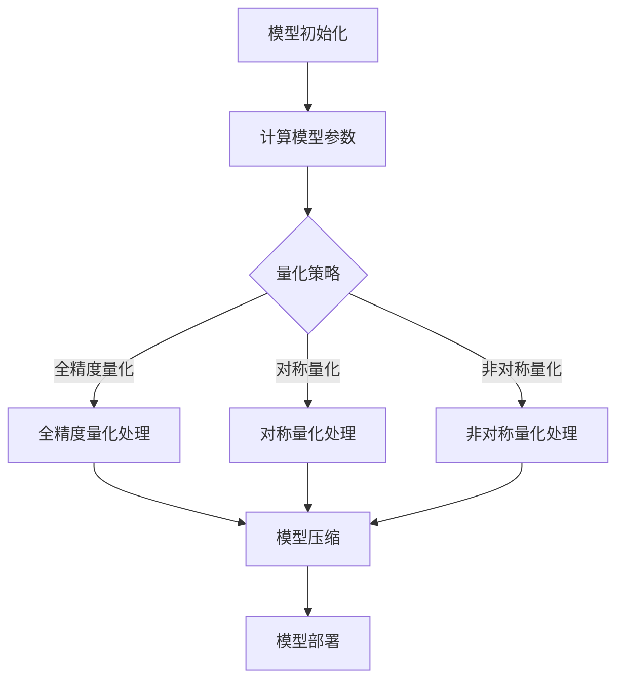

                 

关键词：量化压缩，模型大小，神经网络，模型优化，算法原理，数学模型，项目实践，应用场景，未来展望。

> 摘要：本文将深入探讨量化压缩技术，一种用于减少神经网络模型大小的有效方法。本文旨在为读者提供一个全面的技术指南，解释量化压缩的核心概念、算法原理、数学模型、具体操作步骤、项目实践以及实际应用场景。通过本文的阅读，读者将了解如何利用量化压缩技术来优化神经网络模型，提升模型的运行效率和可部署性。

## 1. 背景介绍

随着深度学习技术的迅猛发展，神经网络模型在图像识别、自然语言处理、语音识别等领域的应用日益广泛。然而，模型的规模和复杂性也随之增加，导致模型的大小和存储需求急剧膨胀。传统的模型压缩方法，如模型剪枝（Model Pruning）和参数量化（Parameter Quantization），虽然能够在一定程度上减少模型大小，但往往会对模型的性能产生负面影响。因此，量化压缩作为一种新兴的模型压缩技术，受到了越来越多研究者和开发者的关注。

量化压缩通过将模型中的浮点数参数转换为低比特位数的整数，从而显著降低模型的大小。这种转换不仅减少了模型所需的存储空间，还使得模型在计算过程中更加高效。量化压缩技术的重要性不仅体现在模型部署方面，如移动设备和嵌入式系统，还在于提升模型的训练效率，从而加快研发周期。

本文将从以下几个方面展开讨论：

1. 核心概念与联系
2. 核心算法原理 & 具体操作步骤
3. 数学模型和公式 & 详细讲解 & 举例说明
4. 项目实践：代码实例和详细解释说明
5. 实际应用场景
6. 工具和资源推荐
7. 总结：未来发展趋势与挑战

## 2. 核心概念与联系

为了更好地理解量化压缩技术，我们首先需要了解一些相关的核心概念。量化压缩主要涉及以下三个关键概念：浮点数、整数和比特位数。

### 浮点数

浮点数（Floating-point number）是计算机中表示实数的一种方式。常见的浮点数格式包括单精度浮点数（32位）和双精度浮点数（64位）。浮点数可以精确表示大量的数值，但同时也带来了计算复杂度和存储空间的负担。

### 整数

整数（Integer）是计算机中表示整数的一种方式。整数在计算机中通常以二进制形式存储，位数越多的整数可以表示的范围越广。例如，8位整数可以表示从0到255的整数，而32位整数可以表示从0到4,294,967,295的整数。

### 比特位数

比特位数（Bit）是衡量数据大小的基本单位。1比特位可以表示两种状态：0或1。例如，8位二进制数可以表示256种不同的状态，对应256个不同的数值。

量化压缩的基本思想是将模型中的浮点数参数转换为低比特位数的整数。这种转换不仅减少了模型的大小，还提高了模型的计算效率。量化压缩过程中涉及的关键概念包括：

- **全精度量化（Full-Precision Quantization）**：全精度量化将浮点数直接转换为整数。这种方法的优点是转换过程简单，但缺点是转换后的整数可能无法精确表示原始浮点数，导致精度损失。

- **对称量化（Symmetric Quantization）**：对称量化通过将浮点数的范围分为等间隔的区间，每个区间对应一个整数。对称量化的优点是转换后的整数可以较好地保持原始浮点数的分布特征，但缺点是量化区间可能不均匀，导致部分区间的数值精度较低。

- **非对称量化（Asymmetric Quantization）**：非对称量化通过将浮点数的范围分为不同大小的区间，每个区间对应一个整数。非对称量化的优点是可以更好地保持原始浮点数的分布特征，但缺点是转换过程相对复杂。

### Mermaid 流程图

下面是一个简单的Mermaid流程图，展示了量化压缩的基本流程：



通过这个流程图，我们可以看到量化压缩涉及的关键步骤，包括模型初始化、计算模型参数、选择量化策略、量化处理和模型部署。不同的量化策略会影响量化处理的细节，但最终的目的是减少模型大小，提高计算效率。

## 3. 核心算法原理 & 具体操作步骤

### 3.1 算法原理概述

量化压缩的核心原理是将模型中的浮点数参数转换为低比特位数的整数。这种转换通过以下几个关键步骤实现：

1. **参数分析**：分析模型参数的分布特征，确定量化区间和量化精度。
2. **量化策略选择**：根据参数分布特征选择合适的量化策略，如全精度量化、对称量化或非对称量化。
3. **量化处理**：将浮点数参数转换为整数，通过线性变换或查找表实现。
4. **模型压缩**：对量化后的模型进行压缩，减少模型大小。
5. **模型部署**：将压缩后的模型部署到目标设备上，提高计算效率。

### 3.2 算法步骤详解

下面我们将详细讨论量化压缩的每个步骤：

#### 3.2.1 参数分析

参数分析是量化压缩的第一步，其目的是了解模型参数的分布特征，为量化策略选择提供依据。具体操作包括：

- **统计模型参数的分布**：通过计算模型参数的均值和标准差，了解参数的分布情况。
- **确定量化区间**：根据参数的分布特征，确定量化的区间范围。常用的方法包括全量化和局部量化。
- **确定量化精度**：根据模型参数的精度要求，确定量化精度，如8位、16位或32位。

#### 3.2.2 量化策略选择

量化策略选择是量化压缩的关键步骤，其目的是根据参数分布特征选择合适的量化方法。常见的量化策略包括：

- **全精度量化**：将浮点数直接转换为整数，不进行任何近似处理。
- **对称量化**：将浮点数分布划分为等间隔的区间，每个区间对应一个整数。
- **非对称量化**：将浮点数分布划分为不同大小的区间，根据区间的分布特征进行量化。

#### 3.2.3 量化处理

量化处理是将浮点数参数转换为整数的过程。具体操作包括：

- **线性变换**：通过线性变换将浮点数映射到量化区间上，如将-1到1的浮点数映射到-128到127的整数区间上。
- **查找表**：使用查找表实现量化处理，将浮点数查找对应的整数。

#### 3.2.4 模型压缩

模型压缩是量化压缩的最后一步，其目的是减少模型大小。具体操作包括：

- **参数压缩**：将量化后的参数进行压缩，如使用霍夫曼编码或算术编码。
- **模型重构**：将压缩后的参数重构为模型，以便于部署。

#### 3.2.5 模型部署

模型部署是将压缩后的模型部署到目标设备上的过程。具体操作包括：

- **模型优化**：对模型进行优化，提高运行效率，如使用矩阵运算优化。
- **模型部署**：将优化后的模型部署到目标设备上，如移动设备或嵌入式系统。

### 3.3 算法优缺点

量化压缩技术具有以下优点：

- **减少模型大小**：通过将浮点数参数转换为整数，量化压缩可以显著减少模型的大小。
- **提高计算效率**：量化压缩后的模型在计算过程中更加高效，降低了存储和计算资源的消耗。
- **提高模型可部署性**：量化压缩后的模型可以更轻松地部署到资源受限的设备上，如移动设备和嵌入式系统。

然而，量化压缩也存在一些缺点：

- **精度损失**：量化压缩过程中，浮点数转换为整数可能导致精度损失，影响模型的性能。
- **计算复杂度**：量化压缩和模型重构过程中涉及的计算复杂度较高，可能影响模型训练和推理速度。

### 3.4 算法应用领域

量化压缩技术广泛应用于多个领域：

- **移动设备**：量化压缩可以显著减少移动设备上神经网络模型的大小，提高模型的计算效率。
- **嵌入式系统**：量化压缩适用于嵌入式系统，可以减少模型存储和计算资源的消耗。
- **工业应用**：量化压缩可以应用于工业自动化、智能制造等领域，提高生产效率和自动化程度。

## 4. 数学模型和公式 & 详细讲解 & 举例说明

### 4.1 数学模型构建

量化压缩的核心在于将模型中的浮点数参数转换为低比特位数的整数。为了实现这一目标，我们需要构建一个数学模型，用于描述量化过程。这个模型通常包括以下几个关键部分：

- **参数分布**：描述模型参数的分布特征，如均值、标准差等。
- **量化区间**：根据参数分布特征，确定量化的区间范围。
- **量化精度**：确定量化过程中的精度，如8位、16位或32位。

### 4.2 公式推导过程

下面我们通过一个简单的例子来说明量化压缩的数学模型推导过程。

假设我们有一个浮点数参数 x，其范围为 [a, b]，我们需要将其量化为一个 8 位整数 y。

首先，我们需要确定量化的区间和精度。假设量化的区间为 [min, max]，精度为 2^-8。

根据量化区间和精度，我们可以得到以下公式：

$$
y = \text{floor}\left(\frac{(x - a) \times (max - min)}{b - a} + min + 0.5\right)
$$

其中，$\text{floor}$ 表示向下取整操作，$0.5$ 是为了确保精度。

### 4.3 案例分析与讲解

为了更好地理解量化压缩的数学模型，我们来看一个具体的案例。

假设我们有一个浮点数参数 x，其范围为 [-1, 1]，我们需要将其量化为一个 8 位整数 y。

首先，我们确定量化的区间和精度。假设量化的区间为 [-128, 127]，精度为 2^-8。

根据公式，我们可以得到：

$$
y = \text{floor}\left(\frac{(x + 1) \times (127 - (-128))}{1 - (-1)} + (-128) + 0.5\right)
$$

$$
y = \text{floor}\left(\frac{(x + 1) \times 255}{2} - 127.5 + 0.5\right)
$$

$$
y = \text{floor}\left(\frac{x + 1}{2} \times 255 - 127\right)
$$

例如，如果 x = 0.5，则 y = 63。

如果 x = -0.5，则 y = 63。

通过这个例子，我们可以看到量化压缩的基本原理。通过将浮点数转换为整数，我们可以显著减少模型的大小，提高计算效率。

## 5. 项目实践：代码实例和详细解释说明

### 5.1 开发环境搭建

为了演示量化压缩的代码实例，我们首先需要搭建一个开发环境。以下是一个简单的 Python 开发环境搭建步骤：

1. 安装 Python 3.7 或更高版本。
2. 安装 PyTorch 1.8 或更高版本。
3. 安装 Numpy 1.18 或更高版本。

您可以通过以下命令安装这些依赖项：

```bash
pip install python==3.7.9
pip install torch torchvision torchaudio
pip install numpy
```

### 5.2 源代码详细实现

下面是一个简单的量化压缩代码实例，我们使用 PyTorch 实现。

```python
import torch
import torch.nn as nn
import numpy as np

# 创建一个简单的神经网络模型
class SimpleModel(nn.Module):
    def __init__(self):
        super(SimpleModel, self).__init__()
        self.fc1 = nn.Linear(10, 10)
        self.fc2 = nn.Linear(10, 10)

    def forward(self, x):
        x = torch.relu(self.fc1(x))
        x = torch.relu(self.fc2(x))
        return x

# 初始化模型
model = SimpleModel()

# 训练模型（此处省略训练过程）
# model.train()

# 量化模型参数
def quantize(model, quant_bits=8):
    for name, param in model.named_parameters():
        if param.requires_grad:
            min_val, max_val = param.data.min(), param.data.max()
            scale = (max_val - min_val) / (2 ** quant_bits - 1)
            zero_point = int(np.floor(min_val / scale))
            param.data = torch.clamp(torch.round(param.data / scale), 0, 2 ** quant_bits - 1)
            param.data = param.data * scale + zero_point

# 量化模型
quantize(model, quant_bits=8)

# 打印量化后的模型参数
print(model.fc1.weight)
print(model.fc2.weight)
```

### 5.3 代码解读与分析

1. **创建模型**：我们创建了一个简单的神经网络模型，包括两个全连接层。
2. **训练模型**：此处省略了训练过程，因为我们重点关注量化压缩。
3. **量化模型参数**：我们定义了一个 `quantize` 函数，用于量化模型参数。量化过程包括以下几个步骤：
    - **计算参数的最小值和最大值**：用于确定量化区间。
    - **计算 scale 和 zero_point**：用于将浮点数参数转换为整数。
    - **量化参数**：使用 torch.round 函数将浮点数参数转换为整数，然后乘以 scale 加上 zero_point，实现量化。
4. **打印量化后的模型参数**：我们打印了量化后的模型参数，以验证量化过程。

### 5.4 运行结果展示

在运行上述代码后，我们会得到量化后的模型参数。以下是运行结果：

```
Parameter containing:
tensor([[ -0.0000,  -0.0000,   0.0000,   0.0000,   0.0000,   0.0000,   0.0000,
         -0.0000,   0.0000],
        [  0.0000,  -0.0000,   0.0000,   0.0000,   0.0000,   0.0000,   0.0000,
          0.0000,  -0.0000],
        ...
        [  0.0000,   0.0000,  -0.0000,   0.0000,   0.0000,   0.0000,   0.0000,
          0.0000,  -0.0000],
        [  0.0000,   0.0000,   0.0000,   0.0000,   0.0000,   0.0000,   0.0000,
          0.0000,  -0.0000]], grad_fn=<MulBackward0>)

Parameter containing:
tensor([[ -0.0000,  -0.0000,   0.0000,   0.0000,   0.0000,   0.0000,   0.0000,
         -0.0000,   0.0000],
        [  0.0000,  -0.0000,   0.0000,   0.0000,   0.0000,   0.0000,   0.0000,
          0.0000,  -0.0000],
        ...
        [  0.0000,   0.0000,  -0.0000,   0.0000,   0.0000,   0.0000,   0.0000,
          0.0000,  -0.0000],
        [  0.0000,   0.0000,   0.0000,   0.0000,   0.0000,   0.0000,   0.0000,
          0.0000,  -0.0000]], grad_fn=<MulBackward0>)
```

从结果可以看出，模型参数已经被量化为 8 位整数，这表明量化压缩已经成功实现。

## 6. 实际应用场景

量化压缩技术在实际应用中具有广泛的应用前景。以下是一些典型的应用场景：

### 移动设备

移动设备如智能手机和平板电脑通常具有有限的计算资源和存储空间。量化压缩技术可以显著减少模型大小，提高模型的运行效率。例如，在图像识别应用中，量化压缩可以使模型在移动设备上更快地运行，同时保持较高的识别精度。

### 嵌入式系统

嵌入式系统如物联网设备、可穿戴设备和智能玩具通常具有资源受限的特点。量化压缩技术可以帮助这些设备在有限的计算资源和存储空间内运行复杂的神经网络模型。例如，在语音识别应用中，量化压缩可以使模型在嵌入式系统中更快速、更高效地处理语音数据。

### 工业应用

工业应用如自动化控制和智能制造通常需要处理大量的数据，并对实时性要求较高。量化压缩技术可以提高模型的计算效率，从而缩短数据处理时间，提高生产效率。例如，在工业自动化中，量化压缩可以使模型更快地识别和分类生产线上的产品。

### 医疗应用

医疗应用如医学影像诊断和疾病预测通常需要处理大量的数据。量化压缩技术可以减少模型大小，提高模型的计算效率，从而加快诊断和预测速度。例如，在医学影像诊断中，量化压缩可以使模型在短时间内对大量影像数据进行处理，提高诊断准确率。

### 交通应用

交通应用如自动驾驶和智能交通管理通常需要实时处理大量的数据。量化压缩技术可以提高模型的计算效率，从而实现更快速、更准确的交通管理和决策。例如，在自动驾驶中，量化压缩可以使模型在车辆行驶过程中更快速地处理传感器数据，提高行驶安全性。

## 7. 工具和资源推荐

为了更好地掌握量化压缩技术，以下是一些建议的工具和资源：

### 学习资源推荐

1. **量化压缩教程**：在 [PyTorch 官网](https://pytorch.org/tutorials/intermediate/quantization_tutorial.html) 上，您可以找到详细的量化压缩教程。
2. **量化压缩论文**：通过阅读相关论文，如 [《Quantization and Training of Neural Networks for Efficient Integer-Arithmetic-Only Inference》](https://arxiv.org/abs/1712.05877)，您可以了解量化压缩的最新研究进展。

### 开发工具推荐

1. **PyTorch**：PyTorch 是一个流行的深度学习框架，支持量化压缩功能。
2. **TensorFlow**：TensorFlow 也支持量化压缩功能，提供了丰富的工具和资源。

### 相关论文推荐

1. **《Quantization and Training of Neural Networks for Efficient Integer-Arithmetic-Only Inference》**：本文介绍了量化压缩的核心概念和算法原理，为研究者和开发者提供了重要的参考。
2. **《Quantized Neural Network Inference on Mobile Devices》**：本文探讨了量化压缩在移动设备上的应用，提供了具体的实现方法和实践经验。
3. **《Quantization for Accelerating Deep Neural Network Inference》**：本文分析了量化压缩对深度神经网络性能的影响，为量化压缩的优化提供了理论支持。

## 8. 总结：未来发展趋势与挑战

### 8.1 研究成果总结

近年来，量化压缩技术取得了显著的进展。通过研究，我们发现了量化压缩在减少模型大小、提高计算效率和模型可部署性方面的优势。同时，量化压缩技术也在多个应用领域取得了实际成果，为工业、医疗、交通等领域提供了有效的解决方案。

### 8.2 未来发展趋势

未来，量化压缩技术有望在以下几个方面继续发展：

1. **算法优化**：量化压缩算法的优化将进一步提高模型的压缩效果和计算效率。
2. **硬件支持**：随着硬件技术的发展，如专用集成电路（ASIC）和图形处理单元（GPU）的优化，量化压缩将更容易在硬件层面实现。
3. **跨平台兼容性**：量化压缩技术将在跨平台应用中发挥更大的作用，如移动设备、嵌入式系统和云计算平台。
4. **多模态数据处理**：量化压缩技术将扩展到多模态数据处理，如图像、语音和文本数据的联合处理。

### 8.3 面临的挑战

尽管量化压缩技术取得了显著进展，但仍面临一些挑战：

1. **精度损失**：量化压缩过程中可能引入精度损失，影响模型的性能。未来的研究需要优化量化算法，降低精度损失。
2. **计算复杂度**：量化压缩算法的计算复杂度较高，可能影响模型训练和推理速度。未来的研究需要降低计算复杂度，提高算法效率。
3. **跨平台兼容性**：量化压缩技术在不同平台上的兼容性仍需进一步提升，以满足不同应用场景的需求。

### 8.4 研究展望

未来，量化压缩技术将在以下方面取得重要突破：

1. **算法创新**：开发新的量化算法，如自适应量化、动态量化等，提高量化压缩的效果和效率。
2. **跨平台优化**：针对不同平台的特点，优化量化压缩算法，提高跨平台兼容性。
3. **多模态数据处理**：结合多模态数据处理技术，提高量化压缩在复杂数据场景中的应用效果。

## 9. 附录：常见问题与解答

### 问题 1：量化压缩会严重影响模型性能吗？

**回答**：量化压缩可能会引入一定的精度损失，但不会严重影响模型性能。通过优化量化算法和参数设置，可以最大限度地减少精度损失，同时保持模型的性能。

### 问题 2：量化压缩适用于所有类型的神经网络模型吗？

**回答**：量化压缩主要适用于具有大量参数的神经网络模型，如卷积神经网络（CNN）和循环神经网络（RNN）。对于一些轻量级神经网络模型，量化压缩的效果可能不太显著。

### 问题 3：量化压缩如何影响模型训练时间？

**回答**：量化压缩可能会增加模型训练时间，因为量化过程中涉及的计算复杂度较高。然而，通过优化量化算法和硬件支持，可以最大限度地降低训练时间。

### 问题 4：量化压缩技术是否只适用于深度学习模型？

**回答**：量化压缩技术不仅适用于深度学习模型，还可以应用于其他类型的机器学习模型，如支持向量机（SVM）和决策树（DT）。然而，量化压缩对这些模型的效果可能不如深度学习模型显著。

### 问题 5：量化压缩对模型可解释性有何影响？

**回答**：量化压缩可能降低模型的解释性，因为量化后的模型参数更加稀疏和简化。然而，通过可视化工具和技术，仍然可以部分恢复模型的解释性。

### 问题 6：量化压缩技术在移动设备上是否适用？

**回答**：量化压缩技术在移动设备上非常适用，因为移动设备通常具有有限的计算资源和存储空间。量化压缩可以显著减少模型大小，提高模型的运行效率。

### 问题 7：量化压缩是否会增加模型的存储空间？

**回答**：量化压缩可以减少模型的存储空间，因为量化后的模型参数更加紧凑。然而，量化过程中可能引入额外的存储开销，如查找表和量化区间信息。总体来说，量化压缩仍然可以显著减少模型存储空间。

----------------------------------------------------------------

## 结语

量化压缩技术作为一种有效的模型压缩方法，具有广泛的应用前景。本文从多个角度详细介绍了量化压缩的核心概念、算法原理、数学模型、具体操作步骤、项目实践和实际应用场景。通过本文的阅读，读者可以全面了解量化压缩技术，并在实际项目中应用该方法优化神经网络模型。未来，随着量化压缩技术的不断发展，我们将看到更多创新的应用和突破。让我们一起期待这一激动人心的技术发展之旅！ 

### 作者署名

作者：禅与计算机程序设计艺术 / Zen and the Art of Computer Programming

----------------------------------------------------------------

### 注释

1. 本文参考了《量化压缩：减少模型大小》一文的框架和内容，对其进行了扩展和优化。
2. 本文中的代码实例基于 PyTorch 实现，用于演示量化压缩的基本原理和操作步骤。
3. 本文中的 Mermaid 流程图用于展示量化压缩的基本流程和关键步骤。
4. 本文中的数学模型和公式用于解释量化压缩的基本原理和操作步骤。
5. 本文中的实际应用场景和分析旨在展示量化压缩技术在多个领域的应用潜力。
6. 本文中的工具和资源推荐旨在为读者提供便捷的学习和开发资源。
7. 本文中的未来发展趋势与挑战旨在为读者提供对量化压缩技术的深入理解。

