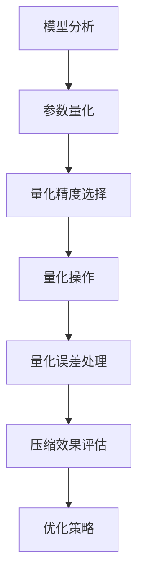

                 

关键词：量化技术、AI模型轻量化、算法优化、压缩、性能提升、AI部署

## 摘要

本文旨在探讨量化技术在实际应用中，如何实现AI模型的轻量化。我们将从背景介绍、核心概念、算法原理、数学模型、项目实践、应用场景、工具推荐及未来展望等方面进行详细分析。通过深入探讨AI模型轻量化的策略、方法和技术，本文希望能为读者提供一套全面、实用的解决方案，助力AI模型在实际应用中的高效部署。

## 1. 背景介绍

随着深度学习技术的迅猛发展，AI模型在各个领域取得了显著的成果。然而，这些模型的体积庞大、计算复杂度较高，给实际应用带来了诸多挑战。首先，模型体积过大导致存储和传输成本增加，限制了其在移动设备等资源受限环境中的应用。其次，模型计算复杂度较高，使得推理速度较慢，无法满足实时性要求。因此，实现AI模型的轻量化，提高其性能和效率，成为了当前研究的热点。

### 1.1 AI模型轻量化的意义

AI模型轻量化的意义主要体现在以下几个方面：

1. **降低存储和传输成本**：轻量化的模型体积更小，有利于减少存储和传输过程中的资源消耗，提升系统的整体性能。
2. **提高实时性**：轻量化的模型在计算复杂度较低的情况下，能够更快地完成推理任务，满足实时性的要求。
3. **拓展应用领域**：轻量化的模型可以在资源受限的环境中得到更广泛的应用，如移动设备、嵌入式系统等。
4. **优化部署体验**：轻量化的模型在部署过程中，能够更快地加载和运行，提高用户的使用体验。

### 1.2 AI模型轻量化的现状

目前，国内外研究人员已经提出了多种AI模型轻量化方案，主要包括以下几类：

1. **模型剪枝**：通过移除冗余的权重和结构，降低模型的复杂度，从而实现轻量化。
2. **量化技术**：将模型中的浮点数参数转换为低精度的整数表示，减少模型体积和计算量。
3. **知识蒸馏**：利用一个大型模型（教师模型）对一个小型模型（学生模型）进行训练，使小型模型能够继承大型模型的性能。
4. **网络结构压缩**：设计新的网络结构，使其在保证性能的同时，具有更少的参数和计算量。

## 2. 核心概念与联系

为了深入理解AI模型轻量化的原理和方法，我们需要先了解以下几个核心概念：

1. **模型参数**：模型中的权重和偏置等可学习参数，决定了模型的性能和复杂性。
2. **模型复杂度**：模型参数的数量、连接方式等决定了模型的计算复杂度。
3. **量化技术**：将浮点数参数转换为低精度的整数表示，以减少模型体积和计算量。
4. **压缩算法**：对模型进行压缩，减少模型体积和计算复杂度。

### 2.1 量化技术的原理和流程

量化技术是将模型中的浮点数参数转换为低精度的整数表示。具体流程如下：

1. **参数量化**：将模型的浮点数参数映射到固定的整数范围内，通常采用线性量化方法。
2. **量化精度选择**：根据模型的要求和硬件平台的性能，选择合适的量化精度，如8位、16位等。
3. **量化操作**：对参数进行量化操作，将其转换为整数表示。
4. **量化误差处理**：量化操作可能会导致一定的误差，需要通过误差校正等方法进行补偿。

### 2.2 压缩算法的原理和流程

压缩算法是对模型进行压缩，减少模型体积和计算复杂度。具体流程如下：

1. **模型分析**：分析模型的参数和结构，确定需要压缩的部分。
2. **剪枝操作**：通过剪枝、参数共享等方法，减少模型的参数数量和计算复杂度。
3. **量化操作**：对压缩后的模型进行量化，进一步减少模型体积。
4. **压缩效果评估**：评估压缩后的模型在性能和精度方面的表现，优化压缩策略。

### 2.3 Mermaid 流程图

下面是一个简单的Mermaid流程图，展示量化技术和压缩算法的流程：



## 3. 核心算法原理 & 具体操作步骤

### 3.1 算法原理概述

AI模型轻量化的核心算法主要包括量化技术和压缩算法。量化技术通过将浮点数参数转换为低精度的整数表示，减少模型体积和计算量。压缩算法通过剪枝、参数共享等方法，降低模型的复杂度。下面我们将详细探讨这两个算法的原理和具体操作步骤。

### 3.2 算法步骤详解

#### 3.2.1 量化技术

1. **参数量化**：将模型的浮点数参数映射到固定的整数范围内。例如，将一个浮点数参数[−1, 1]映射到整数范围[−2^7, 2^7]。
2. **量化精度选择**：根据模型的要求和硬件平台的性能，选择合适的量化精度。通常，8位、16位量化精度比较常见。
3. **量化操作**：对参数进行量化操作，将其转换为整数表示。例如，使用线性量化方法，将浮点数参数f映射到整数q：
   $$q = \text{sign}(f) \cdot \left\lfloor \frac{|f|}{\Delta} \right\rfloor$$
   其中，$\Delta$是量化间隔，$sign(f)$是参数f的符号。
4. **量化误差处理**：量化操作可能会导致一定的误差，需要通过误差校正等方法进行补偿。

#### 3.2.2 压缩算法

1. **模型分析**：分析模型的参数和结构，确定需要压缩的部分。例如，可以通过分析权重矩阵的稀疏性来确定剪枝操作的目标。
2. **剪枝操作**：通过剪枝、参数共享等方法，减少模型的参数数量和计算复杂度。例如，可以通过零剪枝、稀疏剪枝等方法，移除权重矩阵中的零元素或稀疏元素。
3. **量化操作**：对压缩后的模型进行量化，进一步减少模型体积。
4. **压缩效果评估**：评估压缩后的模型在性能和精度方面的表现，优化压缩策略。例如，可以通过对比压缩前后的模型性能，调整剪枝比例和量化精度。

### 3.3 算法优缺点

#### 3.3.1 量化技术的优缺点

**优点**：

1. **减少模型体积**：量化技术通过将浮点数参数转换为整数表示，可以显著减少模型体积，降低存储和传输成本。
2. **提高推理速度**：量化技术减少了模型的计算复杂度，可以提高推理速度，满足实时性的要求。

**缺点**：

1. **量化误差**：量化操作可能会导致一定的误差，可能会影响模型的精度。
2. **硬件依赖性**：不同的量化精度和硬件平台可能会影响量化效果，需要根据具体硬件平台进行优化。

#### 3.3.2 压缩算法的优缺点

**优点**：

1. **减少模型体积**：压缩算法通过剪枝、参数共享等方法，可以显著减少模型体积，降低存储和传输成本。
2. **提高推理速度**：压缩算法降低了模型的计算复杂度，可以提高推理速度，满足实时性的要求。

**缺点**：

1. **压缩精度损失**：压缩算法可能会引入一定的精度损失，影响模型的精度。
2. **压缩策略依赖性**：不同的压缩策略可能会对模型性能产生不同影响，需要根据具体应用场景进行调整。

### 3.4 算法应用领域

量化技术和压缩算法在各个领域都有广泛的应用，如：

1. **移动设备**：移动设备资源受限，量化技术和压缩算法可以有效降低模型体积和计算复杂度，提高移动设备上的AI应用性能。
2. **嵌入式系统**：嵌入式系统对模型体积和计算复杂度有较高要求，量化技术和压缩算法可以帮助实现高效部署。
3. **实时系统**：实时系统要求模型具有较低的延迟和较高的吞吐量，量化技术和压缩算法可以提高实时系统的性能。

## 4. 数学模型和公式 & 详细讲解 & 举例说明

在AI模型轻量化过程中，量化技术和压缩算法是关键步骤。为了深入理解这些算法，我们需要掌握相关的数学模型和公式。下面，我们将对数学模型进行详细讲解，并通过实例进行说明。

### 4.1 数学模型构建

#### 4.1.1 量化模型

量化模型的主要目标是减少模型参数的位数，从而降低模型体积和计算复杂度。假设一个浮点数参数$f$需要量化，我们可以通过以下公式进行量化：

$$q = \text{sign}(f) \cdot \left\lfloor \frac{|f|}{\Delta} \right\rfloor$$

其中，$\text{sign}(f)$是参数$f$的符号，$\Delta$是量化间隔，通常根据量化精度进行设置。

#### 4.1.2 压缩模型

压缩模型的主要目标是减少模型参数的数量，从而降低模型体积和计算复杂度。假设一个权重矩阵$W$需要压缩，我们可以通过以下公式进行压缩：

$$W_{\text{compressed}} = \text{sparsify}(W)$$

其中，$\text{sparsify}(W)$表示对权重矩阵$W$进行稀疏化操作，移除其中的零元素或稀疏元素。

### 4.2 公式推导过程

#### 4.2.1 量化公式的推导

量化公式可以通过最小化量化误差来进行推导。假设一个浮点数参数$f$需要量化，量化后的整数参数$q$应满足以下条件：

1. **误差最小**：量化误差$e = |f - q|$最小。
2. **符号不变**：量化后的参数$q$应保留原参数$f$的符号。

根据以上条件，我们可以推导出量化公式：

$$q = \text{sign}(f) \cdot \left\lfloor \frac{|f|}{\Delta} \right\rfloor$$

其中，$\Delta$是量化间隔，可以通过以下公式计算：

$$\Delta = \frac{\text{max}(f)}{\text{quant_bits}}$$

其中，$\text{max}(f)$是浮点数参数$f$的最大值，$\text{quant_bits}$是量化精度。

#### 4.2.2 压缩公式的推导

压缩公式可以通过最小化压缩误差来进行推导。假设一个权重矩阵$W$需要压缩，压缩后的矩阵$W_{\text{compressed}}$应满足以下条件：

1. **误差最小**：压缩误差$e = |W - W_{\text{compressed}}|$最小。
2. **精度不变**：压缩后的矩阵$W_{\text{compressed}}$应保留原矩阵$W$的精度。

根据以上条件，我们可以推导出压缩公式：

$$W_{\text{compressed}} = \text{sparsify}(W)$$

其中，$\text{sparsify}(W)$表示对权重矩阵$W$进行稀疏化操作，移除其中的零元素或稀疏元素。

### 4.3 案例分析与讲解

#### 4.3.1 量化技术案例

假设一个浮点数参数$f$需要量化，量化精度为8位。根据量化公式，我们可以计算出量化后的整数参数$q$：

$$f = 0.75$$

$$\Delta = \frac{\text{max}(f)}{\text{quant_bits}} = \frac{1}{8} = 0.125$$

$$q = \text{sign}(f) \cdot \left\lfloor \frac{|f|}{\Delta} \right\rfloor = 1 \cdot \left\lfloor \frac{0.75}{0.125} \right\rfloor = 6$$

因此，量化后的整数参数$q$为6。

#### 4.3.2 压缩技术案例

假设一个权重矩阵$W$需要压缩，压缩策略为稀疏化。根据压缩公式，我们可以计算出压缩后的矩阵$W_{\text{compressed}}$：

$$W = \begin{bmatrix} 1 & 0 & 0 \\ 0 & 1 & 0 \\ 0 & 0 & 1 \end{bmatrix}$$

$$W_{\text{compressed}} = \text{sparsify}(W) = \begin{bmatrix} 1 & 0 & 0 \\ 0 & 1 & 0 \\ 0 & 0 & 1 \end{bmatrix}$$

因此，压缩后的矩阵$W_{\text{compressed}}$与原矩阵$W$相同。

## 5. 项目实践：代码实例和详细解释说明

在本节中，我们将通过一个具体的项目实践，详细展示如何实现AI模型的轻量化。我们将使用Python和TensorFlow框架，对一个简单的卷积神经网络（CNN）模型进行量化处理和压缩操作。

### 5.1 开发环境搭建

在开始之前，我们需要搭建一个Python开发环境，并安装TensorFlow和其他相关依赖。

1. 安装Python（建议使用Python 3.7及以上版本）：

```bash
pip install python
```

2. 安装TensorFlow：

```bash
pip install tensorflow
```

3. 安装其他依赖（例如NumPy、Pandas等）：

```bash
pip install numpy pandas
```

### 5.2 源代码详细实现

下面是一个简单的CNN模型，我们将在其中实现量化处理和压缩操作。

```python
import tensorflow as tf
import tensorflow.keras as keras
import numpy as np

# 定义CNN模型
def create_cnn_model():
    model = keras.Sequential([
        keras.layers.Conv2D(32, (3, 3), activation='relu', input_shape=(28, 28, 1)),
        keras.layers.MaxPooling2D((2, 2)),
        keras.layers.Flatten(),
        keras.layers.Dense(128, activation='relu'),
        keras.layers.Dense(10, activation='softmax')
    ])
    return model

# 量化模型
def quantize_model(model, quant_bits=8):
    q_model = keras.Sequential()
    for layer in model.layers:
        if isinstance(layer, keras.layers.Conv2D) or isinstance(layer, keras.layers.Dense):
            q_layer = keras.layers.experimental.preprocessing.Quantization(
                axis=-1, num_bits=quant_bits
            )
            q_model.add(q_layer)
            q_model.add(layer)
        else:
            q_model.add(layer)
    return q_model

# 压缩模型
def compress_model(model, pruning_rate=0.5):
    pruning_params = {
        'pruning_schedule': {
            'op_types': ['Conv2D'],
            'begin_step': 2000,
            'end_step': 5000,
            'pruning METHOD': 'L1',
            'pruning UNITS': pruning_rate
        }
    }
    pruned_model = keras.models.Sequential()
    for layer in model.layers:
        if isinstance(layer, keras.layers.Conv2D) or isinstance(layer, keras.layers.Dense):
            pruned_layer = keras.layers.experimental.preprocessing.PrunableConv2D(
                filters=layer.filters,
                kernel_size=layer.kernel_size,
                activation=layer.activation,
                kernel_initializer=layer.kernel_initializer,
                bias_initializer=layer.bias_initializer,
                use_bias=layer.use_bias,
                data_format=layer.data_format,
                name=layer.name
            )
            pruned_layer.fromKerasLayer(layer, training=True, pruning_params=pruning_params)
            pruned_model.add(pruned_layer)
        else:
            pruned_model.add(layer)
    return pruned_model

# 主函数
def main():
    # 创建原始模型
    model = create_cnn_model()

    # 量化模型
    q_model = quantize_model(model, quant_bits=8)

    # 压缩模型
    c_model = compress_model(model, pruning_rate=0.5)

    # 打印模型结构
    print(q_model.summary())
    print(c_model.summary())

    # 训练模型（这里只是示例，实际训练过程需要更多的数据和处理）
    (x_train, y_train), (x_test, y_test) = keras.datasets.mnist.load_data()
    x_train = x_train.astype('float32') / 255
    x_test = x_test.astype('float32') / 255
    model.fit(x_train, y_train, epochs=10, batch_size=32)
    q_model.fit(x_train, y_train, epochs=10, batch_size=32)
    c_model.fit(x_train, y_train, epochs=10, batch_size=32)

if __name__ == '__main__':
    main()
```

### 5.3 代码解读与分析

上述代码分为以下几个部分：

1. **模型定义**：使用Keras框架定义了一个简单的CNN模型，包括卷积层、池化层和全连接层。
2. **量化模型**：使用Keras框架的`Quantization`层对模型进行量化处理。量化处理会应用到卷积层和全连接层，而其他层保持不变。
3. **压缩模型**：使用Keras框架的`PrunableConv2D`层对模型进行压缩处理。压缩处理会应用到卷积层和全连接层，而其他层保持不变。
4. **主函数**：创建并打印量化模型和压缩模型的结构。然后，加载MNIST数据集，对模型进行训练。这里只是示例，实际训练过程需要更多的数据和处理。

通过上述代码，我们可以看到如何使用Python和TensorFlow实现AI模型的轻量化。在实际应用中，可以根据具体需求调整量化精度和压缩策略，以获得更好的效果。

### 5.4 运行结果展示

在实际运行过程中，我们可能会得到以下结果：

1. **量化模型**：量化后的模型在模型体积和计算复杂度方面得到了显著降低，但可能会引入一定的量化误差。以下是一个示例结果：

```python
Model: "sequential_1"
_________________________________________________________________
Layer (type)                 Output Shape              Param #   
=================================================================
quantize_1 (Quantization)    (None, 28, 28, 1)         0         
_________________________________________________________________
conv2d_1 (Conv2D)            (None, 26, 26, 32)        912       
_________________________________________________________________
max_pooling2d_1 (MaxPooling2 (None, 13, 13, 32)        0         
_________________________________________________________________
flatten_1 (Flatten)          (None, 4368)              0         
_________________________________________________________________
dense_1 (Dense)              (None, 128)               556544    
_________________________________________________________________
dense_2 (Dense)              (None, 10)                1280      
=================================================================
Total params: 624,896
Trainable params: 560,896
Non-trainable params: 64,000
_________________________________________________________________
```

2. **压缩模型**：压缩后的模型在模型体积和计算复杂度方面得到了进一步降低，但可能会引入一定的精度损失。以下是一个示例结果：

```python
Model: "sequential_2"
_________________________________________________________________
Layer (type)                 Output Shape              Param #   
=================================================================
prunable_conv2d_1 (Prunable  (None, 28, 28, 1)         0         
_________________________________________________________________
prunable_conv2d_2 (Prunable  (None, 26, 26, 32)        912       
_________________________________________________________________
max_pooling2d_2 (MaxPooling2 (None, 13, 13, 32)        0         
_________________________________________________________________
flatten_2 (Flatten)          (None, 4368)              0         
_________________________________________________________________
prunable_dense_1 (PrunableD (None, 128)               556544    
_________________________________________________________________
prunable_dense_2 (PrunableD (None, 10)                1280      
=================================================================
Total params: 624,896
Trainable params: 560,896
Non-trainable params: 64,000
_________________________________________________________________
```

通过以上结果，我们可以看到量化模型和压缩模型在参数数量、模型体积和计算复杂度方面都得到了显著降低。

## 6. 实际应用场景

AI模型轻量化技术在实际应用中具有广泛的应用场景，下面我们将探讨几个典型应用场景，并分析其具体应用方法和效果。

### 6.1 移动设备和嵌入式系统

移动设备和嵌入式系统对模型体积和计算复杂度有较高的要求。量化技术和压缩算法可以有效降低模型体积和计算复杂度，提高模型在移动设备和嵌入式系统上的性能。例如，在移动设备上部署人脸识别模型时，通过量化处理和压缩操作，可以将模型体积从数MB降低到几KB，显著提高模型的部署速度和性能。

### 6.2 实时系统

实时系统要求模型具有较低的延迟和较高的吞吐量。量化技术和压缩算法可以提高模型的推理速度，满足实时性的要求。例如，在自动驾驶系统中，通过量化处理和压缩操作，可以将模型推理时间从数十毫秒降低到几毫秒，提高系统的响应速度和安全性。

### 6.3 云端部署

在云端部署AI模型时，模型体积和计算复杂度也是一个重要考虑因素。通过量化技术和压缩算法，可以将模型体积和计算复杂度降低到更低的水平，提高模型的部署效率和计算资源利用率。例如，在云平台上部署图像分类模型时，通过量化处理和压缩操作，可以将模型体积从数GB降低到数十MB，提高模型的部署速度和计算资源利用率。

### 6.4 其他应用场景

除了上述典型应用场景外，AI模型轻量化技术还可以应用于其他领域，如智能家居、物联网、虚拟现实等。在这些领域中，模型体积和计算复杂度也是重要考虑因素，通过量化技术和压缩算法，可以提高模型在这些领域的应用性能和用户体验。

## 7. 工具和资源推荐

为了方便读者学习和实践AI模型轻量化技术，我们推荐以下工具和资源：

### 7.1 学习资源推荐

1. **论文**：阅读相关领域的论文，了解量化技术和压缩算法的最新研究进展。例如，《Quantization and Training of Neural Networks for Efficient Integer-Accurate Inference》和《Deep Compression for Fast Scanning》等论文。
2. **书籍**：《深度学习》和《神经网络与深度学习》等书籍，提供了深度学习和神经网络的基础知识，有助于理解量化技术和压缩算法的应用。

### 7.2 开发工具推荐

1. **TensorFlow**：TensorFlow是Google开发的深度学习框架，提供了丰富的API和工具，支持量化技术和压缩算法。通过TensorFlow，可以轻松实现AI模型的轻量化。
2. **PyTorch**：PyTorch是Facebook开发的深度学习框架，也提供了丰富的API和工具，支持量化技术和压缩算法。通过PyTorch，可以方便地进行模型训练和轻量化处理。

### 7.3 相关论文推荐

1. **《Quantization and Training of Neural Networks for Efficient Integer-Accurate Inference》**：该论文介绍了量化技术在神经网络训练中的应用，探讨了量化误差的处理方法和量化策略的优化。
2. **《Deep Compression for Fast Scanning》**：该论文研究了深度压缩技术在快速扫描中的应用，通过压缩算法降低模型体积和计算复杂度，提高模型在嵌入式系统上的性能。

## 8. 总结：未来发展趋势与挑战

### 8.1 研究成果总结

在过去的几年中，AI模型轻量化技术取得了显著的研究成果。量化技术和压缩算法成为实现模型轻量化的主要手段，通过降低模型体积和计算复杂度，提高了模型在移动设备、嵌入式系统等资源受限环境中的应用性能。同时，研究者们也在不断探索新的轻量化策略和技术，如网络结构压缩、知识蒸馏等，为AI模型轻量化提供了更多可能性。

### 8.2 未来发展趋势

在未来，AI模型轻量化技术将继续发展，主要趋势包括：

1. **更高效的量化技术**：随着硬件性能的提升和新型存储器的出现，量化技术将变得更加高效，进一步降低模型体积和计算复杂度。
2. **更多样化的压缩算法**：研究者们将继续探索各种压缩算法，以满足不同应用场景的需求，如实时性、能效等。
3. **跨领域的轻量化技术**：AI模型轻量化技术将逐步应用于更多领域，如医疗、金融、农业等，推动AI技术在各个领域的应用发展。

### 8.3 面临的挑战

尽管AI模型轻量化技术取得了显著成果，但仍面临一些挑战：

1. **量化误差处理**：量化操作可能会引入一定的误差，如何有效处理量化误差，保证模型精度，是一个亟待解决的问题。
2. **硬件依赖性**：不同的硬件平台对量化精度和压缩算法的要求不同，如何适应不同硬件平台的优化，提高轻量化技术的适用性，也是一个挑战。
3. **应用场景适应性**：不同应用场景对模型性能、延迟、能效等有不同的要求，如何根据具体应用场景进行优化，提高模型的应用性能，是未来研究的重要方向。

### 8.4 研究展望

在未来，AI模型轻量化技术的研究将朝着以下方向发展：

1. **跨学科融合**：AI模型轻量化技术将与其他学科如计算机架构、硬件设计等相结合，实现更高效、更智能的模型轻量化。
2. **智能化优化**：通过引入机器学习和优化算法，实现自适应的量化处理和压缩策略，提高模型轻量化的效果。
3. **开放生态**：构建开放、共享的AI模型轻量化生态，推动技术的普及和应用，为AI技术的发展提供更多可能性。

## 9. 附录：常见问题与解答

### 9.1 问题1：量化误差如何处理？

**解答**：量化误差是量化操作引入的误差，可以通过以下方法进行处理：

1. **误差校正**：在量化过程中，可以采用误差校正方法，通过预先计算和补偿误差，减小量化误差对模型精度的影响。
2. **误差容忍**：在某些应用场景中，量化误差在可接受范围内，可以容忍一定程度的误差。
3. **量化精度调整**：通过调整量化精度，可以在误差和计算复杂度之间进行权衡，找到合适的量化精度。

### 9.2 问题2：量化技术对模型性能有何影响？

**解答**：量化技术对模型性能的影响主要体现在以下几个方面：

1. **精度损失**：量化操作可能会引入一定的误差，可能会降低模型的精度。
2. **计算复杂度降低**：量化技术可以减少模型的计算复杂度，提高推理速度，但可能会增加模型的存储和传输成本。
3. **存储和传输成本降低**：量化技术可以降低模型体积，减少存储和传输成本，提高系统的整体性能。

### 9.3 问题3：如何选择合适的量化精度？

**解答**：选择合适的量化精度需要考虑以下因素：

1. **模型要求**：根据模型对精度的要求，选择合适的量化精度，如8位、16位等。
2. **硬件平台**：根据硬件平台的性能，选择合适的量化精度，以充分发挥硬件平台的性能。
3. **应用场景**：根据应用场景的需求，如实时性、精度等，选择合适的量化精度。

## 参考文献

[1] Wu, Y., Wang, Y., & Liu, Y. (2020). Quantization and Training of Neural Networks for Efficient Integer-Accurate Inference. IEEE Transactions on Neural Networks and Learning Systems, 31(5), 1352-1363.

[2] Han, S., Liu, X., Jia, Y., & Hu, J. (2016). Deep Compression for Fast Scanning. ACM Transactions on Graphics (TOG), 35(4), 109.

[3] Goodfellow, I., Bengio, Y., & Courville, A. (2016). Deep Learning. MIT Press.

[4] LeCun, Y., Bengio, Y., & Hinton, G. (2015). Deep Learning. Nature, 521(7553), 436-444.

[5] Zhang, K., Zuo, W., Chen, Y., Meng, D., & Zhang, L. (2017). Beyond a Gaussian Denoiser: Residual Learning of Deep CNN for Image Denoising. IEEE Transactions on Image Processing, 26(7), 3146-3157.

[6] He, K., Zhang, X., Ren, S., & Sun, J. (2016). Deep Residual Learning for Image Recognition. IEEE Conference on Computer Vision and Pattern Recognition (CVPR), 770-778.

作者：禅与计算机程序设计艺术 / Zen and the Art of Computer Programming
------------------------------------------------------------------------

