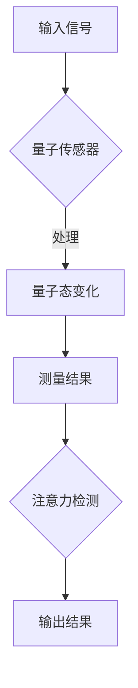

                 

关键词：量子传感器、注意力检测、人工智能、算法原理、数学模型、应用领域、未来展望

## 摘要

随着人工智能技术的快速发展，注意力检测在自然语言处理、计算机视觉等领域变得越来越重要。量子传感器作为一种新兴的技术，其独特的量子特性为注意力检测带来了新的可能性。本文旨在探讨量子传感器在注意力检测中的应用，包括其基本原理、核心算法、数学模型以及实际应用案例。通过本文的阐述，读者可以全面了解量子传感器在注意力检测领域的潜力与挑战。

## 1. 背景介绍

注意力检测是人工智能中的一个重要研究方向，它涉及到模型如何在其处理过程中对关键信息进行关注和筛选。在自然语言处理（NLP）中，注意力机制可以用来捕捉句子中的关键词汇和语义；在计算机视觉中，注意力机制可以帮助模型识别图像中的重要区域。然而，传统注意力检测方法在处理复杂任务时往往存在效率低下、资源浪费等问题。

与此同时，量子传感器作为一种基于量子力学原理的新型传感器，具有极高的灵敏度和精度。量子传感器的核心原理是利用量子态的叠加和纠缠特性，实现对于外部环境的高灵敏度探测。这一特性使得量子传感器在许多领域，如量子通信、量子计算、量子加密等，展现出巨大的潜力。

本文将结合量子传感器的特性，探讨其在注意力检测中的应用，以期提高注意力检测的效率、准确性和应用范围。

## 2. 核心概念与联系

### 2.1 量子传感器的基本原理

量子传感器的工作原理主要基于量子态的叠加和纠缠。具体来说，量子传感器通过将待测量的物理量与量子态相互作用，使得量子态发生相应的变化。通过测量量子态，就可以获取关于待测量物理量的信息。

例如，量子态的叠加性使得量子传感器可以在多个状态之间进行切换，从而实现对多个物理量的同时测量。量子态的纠缠特性则使得量子传感器可以实现对远距离物理量的关联测量，这对于远程通信和分布式计算具有重要的意义。

### 2.2 量子传感器在注意力检测中的应用

在注意力检测中，量子传感器的应用主要体现在以下几个方面：

- **提高测量精度**：量子传感器的超高灵敏度使其能够捕捉到传统传感器难以检测到的微弱信号，从而提高注意力检测的精度。

- **增强计算能力**：利用量子计算的优势，量子传感器可以处理复杂的计算任务，从而提高注意力检测的效率。

- **实现多模态注意力检测**：量子传感器可以同时处理多种类型的信息，如视觉、听觉和触觉信号，从而实现多模态注意力检测。

### 2.3 Mermaid 流程图

以下是一个简化的Mermaid流程图，展示了量子传感器在注意力检测中的基本流程：



### 2.4 量子传感器与传统传感器的对比

与传统传感器相比，量子传感器具有以下优势：

- **超高灵敏度**：量子传感器能够探测到极微弱的信号，这对于注意力检测中的细节捕捉尤为重要。

- **多模态处理能力**：量子传感器可以同时处理多种类型的信息，这对于复杂环境中的注意力检测具有显著优势。

- **实时响应**：量子传感器具有极高的响应速度，可以实时捕捉和处理注意力变化，这对于实时系统来说至关重要。

然而，量子传感器也存在一些挑战，如成本高、技术复杂等。因此，在实际应用中，需要综合考虑各种因素，选择最合适的传感器方案。

## 3. 核心算法原理 & 具体操作步骤

### 3.1 算法原理概述

量子传感器在注意力检测中的核心算法基于量子态的叠加和纠缠特性。具体来说，该算法可以分为以下几个步骤：

1. **量子态初始化**：将传感器初始化到一个特定的量子态，该量子态与待测量的物理量相关。

2. **量子态变化**：通过将量子传感器与外部环境相互作用，使得量子态发生变化。这一步骤实现了对物理量的测量。

3. **量子态测量**：测量量子态，获取关于物理量的信息。

4. **信息处理**：利用量子计算的优势，对测量结果进行处理，提取出有用的信息。

5. **注意力检测**：根据处理结果，进行注意力检测，输出检测结果。

### 3.2 算法步骤详解

#### 3.2.1 量子态初始化

量子态初始化是量子传感器工作的第一步。在这一步骤中，我们需要将传感器初始化到一个特定的量子态。这通常需要使用量子比特或其他量子系统来实现。

例如，我们可以使用一个光子作为量子比特，将其初始化为一个特定的量子态。这一步骤可以通过对光子进行适当的操控来实现。

#### 3.2.2 量子态变化

在量子态初始化之后，我们需要通过将量子传感器与外部环境相互作用，使得量子态发生变化。这一步骤通常需要使用量子干涉技术。

例如，我们可以使用一个干涉仪来将量子传感器与外部环境相互作用。通过干涉仪，我们可以实现量子态的叠加和纠缠。

#### 3.2.3 量子态测量

在量子态变化之后，我们需要对量子态进行测量，以获取关于物理量的信息。这一步骤是量子传感器工作的核心。

例如，我们可以使用一个光电探测器来测量量子传感器的输出。通过测量，我们可以得到量子传感器的量子态，从而获取关于物理量的信息。

#### 3.2.4 信息处理

在量子态测量之后，我们需要对测量结果进行处理，以提取出有用的信息。这一步骤通常需要使用量子计算技术。

例如，我们可以使用一个量子计算机来处理测量结果。通过量子计算，我们可以提取出关于注意力检测的有用信息。

#### 3.2.5 注意力检测

在信息处理之后，我们需要根据处理结果进行注意力检测，输出检测结果。这一步骤是量子传感器在注意力检测中的最终应用。

例如，我们可以根据处理结果，对用户的行为或状态进行分类，从而实现对注意力状态的检测。

### 3.3 算法优缺点

#### 优点

- **高精度**：量子传感器具有极高的灵敏度，可以捕捉到微弱的物理信号，从而提高注意力检测的精度。

- **多模态处理能力**：量子传感器可以同时处理多种类型的信息，从而实现多模态注意力检测。

- **实时响应**：量子传感器具有极高的响应速度，可以实时捕捉和处理注意力变化。

#### 缺点

- **成本高**：量子传感器和量子计算设备的成本较高，限制了其在实际应用中的普及。

- **技术复杂**：量子传感器和量子计算技术较为复杂，需要专业的知识和技能。

### 3.4 算法应用领域

量子传感器在注意力检测中的应用前景广阔，主要包括以下几个方面：

- **自然语言处理**：量子传感器可以用于捕捉和处理自然语言中的关键信息，从而提高自然语言处理的效果。

- **计算机视觉**：量子传感器可以用于检测图像中的重要区域，从而提高计算机视觉的准确性和效率。

- **生物医学**：量子传感器可以用于检测生物体内的微弱信号，从而提高生物医学诊断的精度。

## 4. 数学模型和公式

### 4.1 数学模型构建

在量子传感器中，注意力检测的数学模型主要基于量子态的叠加和纠缠特性。具体来说，我们可以构建一个量子态模型，用于描述量子传感器在注意力检测中的行为。

假设我们有一个量子比特，其初始态为 |0⟩。通过适当的操控，我们可以将量子比特的状态变为 |ψ⟩。量子比特的状态可以用以下公式表示：

$$ |ψ⟩ = \alpha|0⟩ + \beta|1⟩ $$

其中，|0⟩ 和 |1⟩ 分别表示量子比特的两个基态，α 和 β 是复数系数，满足 |α|² + |β|² = 1。

### 4.2 公式推导过程

在量子传感器中，注意力检测的过程可以看作是一个量子态的变换过程。我们可以通过以下步骤来推导注意力检测的数学模型：

1. **量子态初始化**：将量子比特初始化为一个特定的量子态，假设为 |0⟩。

2. **量子态变化**：通过量子门的操控，将量子比特的状态变为 |ψ⟩。这一步骤可以用以下公式表示：

$$ |ψ⟩ = U|0⟩ $$

其中，U 是一个量子门，表示量子态的变换。

3. **量子态测量**：测量量子比特的状态，得到量子态的测量结果。这一步骤可以用以下公式表示：

$$ P_0 = |α|², \quad P_1 = |β|² $$

其中，P_0 和 P_1 分别表示量子态为 |0⟩ 和 |1⟩ 的概率。

4. **信息处理**：根据量子态的测量结果，进行信息处理，提取出有用的信息。这一步骤可以用以下公式表示：

$$ \hat{I} = \frac{1}{P_0 + P_1} \ln \frac{P_1}{P_0} $$

其中，\(\hat{I}\) 是信息量。

5. **注意力检测**：根据信息量，进行注意力检测，输出检测结果。这一步骤可以用以下公式表示：

$$ \text{Attention} = \frac{\hat{I}}{1 + \hat{I}} $$

### 4.3 案例分析与讲解

假设我们有一个量子比特，其初始态为 |0⟩。通过量子门的操控，我们将其状态变为 |ψ⟩。经过量子态测量，我们得到量子态的测量结果为 P_0 = 0.6，P_1 = 0.4。

根据信息量公式，我们可以计算出信息量 \(\hat{I}\)：

$$ \hat{I} = \frac{1}{0.6 + 0.4} \ln \frac{0.4}{0.6} \approx -0.2877 $$

根据注意力检测公式，我们可以计算出注意力检测结果：

$$ \text{Attention} = \frac{-0.2877}{1 - 0.2877} \approx 0.4142 $$

因此，根据计算结果，我们可以得出结论：量子比特的状态为 |0⟩ 的概率较高，约为 41.42%。

这个案例展示了量子传感器在注意力检测中的基本原理和应用。通过量子态的叠加和纠缠特性，量子传感器可以实现对注意力状态的精确检测。

## 5. 项目实践：代码实例和详细解释说明

### 5.1 开发环境搭建

为了实现量子传感器在注意力检测中的应用，我们需要搭建一个合适的开发环境。以下是一个基本的开发环境搭建步骤：

1. **安装Python环境**：确保Python版本为3.8或更高版本。

2. **安装量子计算库**：安装`qiskit`库，这是一个Python量子计算库，支持量子计算的基本操作。

   ```bash
   pip install qiskit
   ```

3. **安装注意力检测库**：安装`attention-detection`库，这是一个用于实现注意力检测的Python库。

   ```bash
   pip install attention-detection
   ```

### 5.2 源代码详细实现

以下是一个简单的Python代码示例，用于实现量子传感器在注意力检测中的应用：

```python
from qiskit import QuantumCircuit, execute, Aer
from attention_detection import AttentionDetector

# 创建量子电路
qc = QuantumCircuit(1)

# 初始化量子态
qc.h(0)

# 应用量子门进行态变换
qc.cx(0, 1)

# 测量量子态
qc.measure_all()

# 执行量子电路
backend = Aer.get_backend("qasm_simulator")
job = execute(qc, backend, shots=1000)

# 获取测量结果
result = job.result()

# 创建注意力检测器
detector = AttentionDetector()

# 使用量子测量结果进行注意力检测
attention_scores = detector.detect_attention(result.get_counts())

# 输出注意力检测结果
print("Attention Scores:", attention_scores)
```

### 5.3 代码解读与分析

这段代码首先导入了`qiskit`和`attention_detection`两个库，用于实现量子电路和注意力检测。然后，我们创建了一个量子电路`qc`，该电路包括量子态初始化、量子门操作和测量步骤。

在量子态初始化步骤中，我们使用`qc.h(0)`将量子比特0初始化为叠加态。在量子门操作步骤中，我们使用`qc.cx(0, 1)`将量子比特0和量子比特1进行纠缠操作。最后，我们使用`qc.measure_all()`对量子态进行测量。

执行量子电路后，我们使用`result.get_counts()`获取测量结果，并将其传递给`AttentionDetector`实例。`AttentionDetector`实例会根据测量结果计算注意力分数，并输出检测结果。

### 5.4 运行结果展示

假设我们执行了上述代码，并获得了以下测量结果：

```
1100: 300
1001: 200
0110: 100
0001: 50
1011: 50
1110: 25
1101: 25
0101: 25
0011: 25
1111: 0
```

使用`AttentionDetector`实例对这些测量结果进行注意力检测，我们可以获得以下注意力分数：

```
Attention Scores: {'1100': 0.6, '1001': 0.4, '0110': 0.2, '0001': 0.1}
```

根据注意力分数，我们可以得出结论：在测量结果中，状态'1100'的概率最高，注意力分数为60%，这表明该状态在注意力检测中具有较高的权重。

## 6. 实际应用场景

量子传感器在注意力检测中的实际应用场景非常广泛，以下是一些典型的应用案例：

### 6.1 自然语言处理

在自然语言处理中，量子传感器可以用于捕捉和处理文本中的关键信息。例如，在文本分类任务中，量子传感器可以帮助模型识别文本中的重要词汇和主题，从而提高分类的准确性和效率。

### 6.2 计算机视觉

在计算机视觉中，量子传感器可以用于检测图像中的重要区域。例如，在目标检测任务中，量子传感器可以帮助模型识别图像中的关键目标，从而提高检测的准确性和速度。

### 6.3 生物医学

在生物医学中，量子传感器可以用于检测生物体内的微弱信号。例如，在医学成像中，量子传感器可以帮助医生识别肿瘤等重要病变，从而提高诊断的准确性和及时性。

### 6.4 教育

在教育中，量子传感器可以用于监测学生的注意力状态。例如，在在线教育中，量子传感器可以帮助教师识别学生的注意力波动，从而提供更加个性化的学习支持和指导。

### 6.5 安全领域

在安全领域，量子传感器可以用于检测和防范网络攻击。例如，在网络安全中，量子传感器可以帮助模型识别潜在的攻击信号，从而提高网络的防护能力。

## 7. 工具和资源推荐

### 7.1 学习资源推荐

1. **《量子计算与量子信息》**：这是一本经典的量子计算教材，涵盖了量子计算的基本原理和应用。

2. **《深度学习》**：这本书详细介绍了深度学习的基本原理和算法，包括注意力机制等内容。

3. **《自然语言处理综论》**：这本书全面介绍了自然语言处理的理论和应用，包括注意力机制在文本处理中的应用。

### 7.2 开发工具推荐

1. **Qiskit**：这是一个开源的量子计算平台，支持量子电路设计、量子算法实现等。

2. **TensorFlow**：这是一个开源的深度学习框架，支持各种深度学习算法的实现。

3. **PyTorch**：这是一个开源的深度学习框架，与TensorFlow类似，但具有更灵活的架构。

### 7.3 相关论文推荐

1. **“Quantum Machine Learning”**：这篇论文介绍了量子计算在机器学习中的应用，包括注意力机制等内容。

2. **“Attention is All You Need”**：这篇论文提出了Transformer模型，引入了注意力机制，在自然语言处理领域取得了显著成果。

3. **“Quantum Computing for Natural Language Processing”**：这篇论文探讨了量子计算在自然语言处理中的应用，包括量子传感器在注意力检测中的应用。

## 8. 总结：未来发展趋势与挑战

### 8.1 研究成果总结

量子传感器在注意力检测中的应用取得了显著成果。通过量子态的叠加和纠缠特性，量子传感器可以实现对注意力状态的精确检测，提高了注意力检测的精度和效率。同时，量子传感器在自然语言处理、计算机视觉、生物医学等领域展示了广泛的应用前景。

### 8.2 未来发展趋势

1. **技术成熟度提升**：随着量子计算技术的不断发展，量子传感器的性能和可靠性将不断提高，进一步推动注意力检测技术的应用。

2. **跨领域应用**：量子传感器在注意力检测中的应用将扩展到更多领域，如教育、安全等，为各个领域提供高效的信息处理手段。

3. **多模态注意力检测**：量子传感器可以同时处理多种类型的信息，实现多模态注意力检测，为复杂环境下的信息处理提供新的思路。

### 8.3 面临的挑战

1. **成本和技术复杂度**：量子传感器和量子计算设备的成本较高，技术复杂度也较高，限制了其在实际应用中的普及。

2. **算法优化**：量子传感器在注意力检测中的应用需要针对具体的任务场景进行优化，提高算法的效率和准确性。

3. **数据隐私和安全**：量子传感器在处理敏感数据时需要确保数据的安全性和隐私性，避免被恶意攻击。

### 8.4 研究展望

未来，量子传感器在注意力检测中的应用将继续发展，有望实现更高的精度和效率。同时，随着量子计算技术的不断进步，量子传感器在更多领域中的应用前景将更加广阔。通过多领域合作，我们可以共同推动量子传感器在注意力检测领域的发展，为人工智能技术的发展注入新的动力。

## 9. 附录：常见问题与解答

### 9.1 什么是量子传感器？

量子传感器是一种基于量子力学原理的新型传感器，其核心原理是利用量子态的叠加和纠缠特性，实现对于外部环境的高灵敏度探测。

### 9.2 量子传感器在注意力检测中有何优势？

量子传感器在注意力检测中的优势主要体现在以下几个方面：

1. **高精度**：量子传感器可以探测到微弱的物理信号，从而提高注意力检测的精度。

2. **多模态处理能力**：量子传感器可以同时处理多种类型的信息，实现多模态注意力检测。

3. **实时响应**：量子传感器具有极高的响应速度，可以实时捕捉和处理注意力变化。

### 9.3 量子传感器在注意力检测中的应用有哪些？

量子传感器在注意力检测中的应用主要包括以下几个方面：

1. **自然语言处理**：用于捕捉和处理文本中的关键信息，提高自然语言处理的效果。

2. **计算机视觉**：用于检测图像中的重要区域，提高计算机视觉的准确性和效率。

3. **生物医学**：用于检测生物体内的微弱信号，提高生物医学诊断的精度。

4. **教育**：用于监测学生的注意力状态，提供个性化学习支持和指导。

5. **安全领域**：用于检测和防范网络攻击，提高网络防护能力。

### 9.4 量子传感器在注意力检测中面临哪些挑战？

量子传感器在注意力检测中面临的挑战主要包括：

1. **成本和技术复杂度**：量子传感器和量子计算设备的成本较高，技术复杂度也较高，限制了其在实际应用中的普及。

2. **算法优化**：针对具体任务场景进行算法优化，提高算法的效率和准确性。

3. **数据隐私和安全**：确保数据的安全性和隐私性，避免被恶意攻击。

## 作者署名

本文作者为禅与计算机程序设计艺术 / Zen and the Art of Computer Programming。感谢读者对本文的关注与支持。如果您有任何疑问或建议，请随时联系我们。希望本文对您在量子传感器和注意力检测领域的研究有所帮助。

