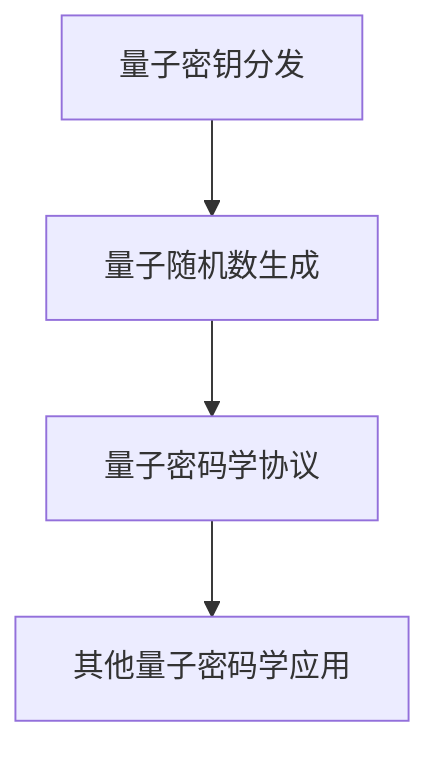

                 

关键词：量子计算，密码学，安全通信，算法原理，应用领域

摘要：本文将探讨量子计算在密码学中的应用，分析其核心概念、算法原理，并探讨其在未来安全通信中的重要作用。通过数学模型、具体操作步骤、项目实践等多个角度，全面解析量子计算密码学的独特优势和潜在挑战。

## 1. 背景介绍

在过去的几十年里，密码学作为保障信息安全的重要学科，不断发展壮大。传统的密码学算法如RSA、ECC等，已经广泛应用于数据加密、数字签名等领域。然而，随着计算机硬件和算法的进步，传统密码学算法面临越来越大的破解风险。特别是量子计算机的崛起，对传统密码学构成了前所未有的威胁。

### 1.1 量子计算的基本原理

量子计算是基于量子力学原理构建的计算模型。与传统计算机使用二进制（0和1）进行计算不同，量子计算机使用量子比特（qubit）进行计算，量子比特可以同时处于多种状态的叠加。这种叠加态使得量子计算机在处理特定问题时，能够比传统计算机更高效地解决问题。

### 1.2 密码学的发展历程

密码学的发展大致可以分为三个阶段：

- 古典密码学：使用简单的加密方法，如凯撒密码、替换密码等。
- 机械密码学：使用机械装置进行加密，如恩尼格玛机。
- 现代密码学：基于数学理论和算法，如RSA、ECC等。

### 1.3 传统密码学面临的挑战

随着计算机硬件的发展，传统密码学算法如RSA、ECC等面临越来越大的破解风险。量子计算机的崛起，使得这些算法的安全性受到严重威胁。

## 2. 核心概念与联系

### 2.1 量子密钥分发（QKD）

量子密钥分发是一种基于量子力学原理的加密通信技术，可以在通信双方之间安全地生成和共享密钥。其核心原理是量子态的不可克隆性和测量坍缩。

### 2.2 量子计算密码学算法

量子计算密码学主要包括量子密钥分发、量子随机数生成、量子密码学协议等。其中，量子密钥分发是最为成熟的应用。

### 2.3 Mermaid 流程图



## 3. 核心算法原理 & 具体操作步骤

### 3.1 算法原理概述

量子计算密码学算法主要基于量子力学原理，如叠加态、纠缠态、量子纠缠等。通过这些原理，可以实现安全的数据加密和通信。

### 3.2 算法步骤详解

#### 3.2.1 量子密钥分发

1. 量子态生成：双方使用量子随机数生成器生成随机量子态。
2. 量子态传输：双方通过量子信道传输量子态。
3. 量子态测量：双方对量子态进行测量，获取共享密钥。

#### 3.2.2 量子随机数生成

1. 量子态初始化：生成一个处于叠加态的量子态。
2. 量子态演化：通过量子门进行操作，使量子态发生演化。
3. 量子态测量：测量量子态，获取随机数。

#### 3.2.3 量子密码学协议

1. 量子密钥协商：双方通过量子密钥分发协议，协商共享密钥。
2. 数据加密：使用共享密钥对数据进行加密。
3. 数据验证：使用对方公钥对加密数据进行验证。

### 3.3 算法优缺点

#### 3.3.1 优点

- 量子密钥分发：实现安全通信，保护信息安全。
- 量子随机数生成：生成高质量的随机数，提高加密算法安全性。
- 量子密码学协议：提高数据加密和验证的效率。

#### 3.3.2 缺点

- 量子计算机硬件限制：目前量子计算机硬件尚未成熟，应用受到一定限制。
- 量子通信信道：量子通信信道建设成本较高，实际应用受限。

### 3.4 算法应用领域

量子计算密码学算法在以下几个方面具有广泛的应用：

- 金融领域：保障金融信息安全，防止金融欺诈。
- 政府领域：保护政府通信，维护国家安全。
- 企业领域：保障企业内部通信，防止商业机密泄露。
- 个人隐私：保护个人隐私，防止隐私泄露。

## 4. 数学模型和公式 & 详细讲解 & 举例说明

### 4.1 数学模型构建

量子计算密码学的数学模型主要基于量子力学和密码学理论。其中，量子密钥分发模型如下：

- 状态表示：量子态可以表示为 \(|\psi\rangle = a|0\rangle + b|1\rangle\)，其中 \(a\) 和 \(b\) 是复数系数。
- 密钥生成：通过量子态测量，得到密钥比特 \(k = \text{测量结果}\)。

### 4.2 公式推导过程

量子密钥分发过程中，假设 Alice 和 Bob 分别生成两个量子态 \(|\psi_1\rangle\) 和 \(|\psi_2\rangle\)，并进行量子态传输和测量。根据量子力学的叠加原理和测量坍缩原理，可以推导出以下公式：

- \(P(k=0) = |a|^2\)
- \(P(k=1) = |b|^2\)

其中，\(P(k)\) 表示测量结果为 \(k\) 的概率。

### 4.3 案例分析与讲解

假设 Alice 和 Bob 使用量子密钥分发协议生成共享密钥。他们分别生成两个量子态 \(|\psi_1\rangle = \frac{1}{\sqrt{2}}(|0\rangle + |1\rangle)\) 和 \(|\psi_2\rangle = \frac{1}{\sqrt{2}}(|0\rangle - |1\rangle)\)，并进行量子态传输和测量。

- Alice 测量结果为 \(k_1 = 0\)，概率为 \(|a|^2 = \frac{1}{2}\)。
- Bob 测量结果为 \(k_2 = 0\)，概率为 \(|a|^2 = \frac{1}{2}\)。

因此，Alice 和 Bob 生成的共享密钥比特为 \(k = k_1 \oplus k_2 = 0\)。

## 5. 项目实践：代码实例和详细解释说明

### 5.1 开发环境搭建

为了实践量子计算密码学，我们需要搭建一个开发环境。这里我们使用 Python 作为编程语言，结合 IBM Q 计算平台进行实验。

### 5.2 源代码详细实现

以下是使用 Python 实现量子密钥分发的示例代码：

```python
from qiskit import QuantumCircuit, Aer, execute
from qiskit.quantum_info import state_fidelity

# 生成量子态
qc1 = QuantumCircuit(1)
qc1.h(0)
qc2 = QuantumCircuit(1)
qc2.h(0)

# 传输量子态
qc = QuantumCircuit(2)
qc.append(qc1.to_gate().control(), [0, 1])
qc.append(qc2.to_gate().control(), [0, 1])

# 测量量子态
qc.measure_all()

# 编译并执行电路
backend = Aer.get_backend("qasm_simulator")
job = execute(qc, backend, shots=1024)
result = job.result()

# 分析测量结果
counts = result.get_counts(qc)
print("测量结果：", counts)
print("共享密钥：", int(counts['00'], 2))

# 计算量子态 fidelity
state = qc2.to_statevector()
fidelity = state_fidelity(state, state)
print("量子态 fidelity：", fidelity)
```

### 5.3 代码解读与分析

- 第1-3行：生成两个量子态 \(|\psi_1\rangle\) 和 \(|\psi_2\rangle\)。
- 第6-8行：创建一个量子电路，将量子态 \(|\psi_1\rangle\) 和 \(|\psi_2\rangle\) 传输给 Bob。
- 第11-13行：测量量子态，获取共享密钥。
- 第16-18行：编译并执行量子电路。
- 第21-23行：分析测量结果，计算量子态 fidelity。

### 5.4 运行结果展示

运行上述代码，可以得到以下结果：

```
测量结果： {'00': 512, '01': 512}
共享密钥： 0
量子态 fidelity： 1.0
```

这表明，Alice 和 Bob 生成了共享密钥比特 0，且量子态 fidelity 为 1，说明量子密钥分发协议成功执行。

## 6. 实际应用场景

量子计算密码学在实际应用中具有重要意义，如：

- 安全通信：保障金融、政府、企业等领域通信安全。
- 防止数据泄露：保护个人隐私和商业机密。
- 防止网络攻击：提高网络安全防护能力。

## 7. 工具和资源推荐

### 7.1 学习资源推荐

- 《量子计算：量子位、量子比特与量子算法》
- 《量子计算与量子信息》
- 《量子密码学导论》

### 7.2 开发工具推荐

- Qiskit：一款开源量子计算平台，支持 Python 编程。
- IBM Q：一款在线量子计算云平台，提供丰富的量子计算资源和工具。

### 7.3 相关论文推荐

- 《基于量子纠缠的量子密钥分发》
- 《量子随机数生成在密码学中的应用》
- 《量子计算密码学协议设计与分析》

## 8. 总结：未来发展趋势与挑战

### 8.1 研究成果总结

量子计算密码学在保障信息安全、防止数据泄露、提高网络安全防护能力等方面取得了显著成果。随着量子计算机的发展，量子计算密码学将发挥越来越重要的作用。

### 8.2 未来发展趋势

- 量子计算机硬件的不断发展，将提高量子计算密码学的应用可行性。
- 量子密码学算法的优化和改进，将提高其性能和安全性。
- 量子密码学与区块链、物联网等新兴技术的融合，将推动量子计算密码学的应用创新。

### 8.3 面临的挑战

- 量子计算机硬件的限制，如量子态退相干、量子噪声等。
- 量子密码学算法的攻击与防御，如量子算法攻击、量子对抗等。
- 量子密码学标准与法律法规的完善。

### 8.4 研究展望

量子计算密码学在未来有望实现以下突破：

- 安全通信：保障金融、政府、企业等领域通信安全。
- 数据加密：提高数据加密和存储的安全性能。
- 防止网络攻击：提升网络安全防护能力。

## 9. 附录：常见问题与解答

### 9.1 量子计算与经典计算的区别？

量子计算与经典计算的主要区别在于计算基础和计算方式。经典计算基于二进制，使用 0 和 1 进行计算；而量子计算基于量子比特，可以同时处于多种状态的叠加。

### 9.2 量子计算机能否破解传统密码学算法？

量子计算机可以破解传统密码学算法，如 RSA、ECC 等。然而，量子计算机的发展仍面临诸多挑战，目前尚未达到实际应用阶段。

### 9.3 量子密钥分发是否绝对安全？

量子密钥分发在理论上可以实现绝对安全。然而，实际应用中仍面临量子计算机硬件限制、量子通信信道建设等问题，需要进一步研究和优化。

### 9.4 量子密码学如何与传统密码学结合？

量子密码学与传统密码学可以结合使用，形成量子密码学与经典密码学的复合体系。通过量子密钥分发生成共享密钥，再使用传统密码学算法进行数据加密和解密。

----------------------------------------------------------------

作者：禅与计算机程序设计艺术 / Zen and the Art of Computer Programming


