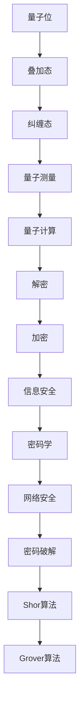

                 

关键词：量子计算，密码破解，网络安全，量子算法，密码学，信息安全

## 摘要

随着量子计算技术的不断进步，其对传统密码学体系构成的挑战日益凸显。本文旨在探讨量子计算在密码破解中的潜在应用，分析量子算法对现有密码体系的影响，并提出相应的应对策略。文章首先回顾了量子计算的基本概念，然后深入分析了Shor算法与Grover算法在密码破解中的具体应用，最后讨论了量子计算对网络安全带来的新挑战及其未来发展趋势。

## 1. 背景介绍

### 1.1 量子计算的发展历程

量子计算，作为信息科学的前沿领域，源于20世纪中叶量子力学的基本原理。量子计算机利用量子位（qubit）进行信息存储和处理，具有与传统计算机完全不同的工作模式。量子计算的发展历程可以追溯到1981年，物理学家Richard Feynman提出了量子计算机的概念，认为量子计算机能够模拟量子系统，解决传统计算机无法处理的复杂问题。

1982年，Paul Benioff提出了第一个量子计算机模型。随后，David Deutsch在1995年提出了量子图灵机的概念，证明了量子计算机在理论上可以解决任意计算问题。近年来，随着量子纠错技术的进步，量子计算机的实用化进程正在加速。

### 1.2 密码学的发展与应用

密码学是保护信息安全的核心技术，其历史可以追溯到古代的凯撒密码。现代密码学起源于20世纪，以香农的信息理论为基础，逐步发展出了对称加密、非对称加密、哈希函数等多种密码技术。

对称加密使用相同的密钥进行加密和解密，典型算法包括AES（高级加密标准）。非对称加密则使用一对密钥，公钥加密、私钥解密，典型算法包括RSA（Rivest-Shamir-Adleman）。哈希函数则用于生成固定长度的消息摘要，确保消息的完整性和不可篡改性。

随着网络技术的普及，密码学在信息安全领域扮演着至关重要的角色，从数据传输加密到身份认证，再到数字签名，密码技术无处不在。

### 1.3 量子计算与密码学的交叉领域

量子计算与密码学的交叉领域近年来成为研究的热点。量子计算机具有超越传统计算机的并行计算能力，这为密码学带来了新的挑战。同时，量子计算也为密码学提供了一种新的工具，可以利用量子算法对现有密码体系进行攻击，从而推动密码学的发展。

## 2. 核心概念与联系

### 2.1 量子计算的基本概念

量子计算机的核心组件是量子位（qubit）。与传统计算机中的比特（bit）只能表示0或1不同，量子位可以同时处于0和1的叠加状态，这使得量子计算机在处理复杂问题时具有显著的优势。量子比特的操作包括量子叠加、量子纠缠和量子测量。

量子叠加允许量子位同时处于多种状态的叠加，而量子纠缠则使得不同量子位之间的状态相互关联。量子测量则用于获取量子态的信息，但会改变量子态。

### 2.2 量子算法的基本原理

量子算法是基于量子计算原理设计的一系列算法，能够在多项式时间内解决某些传统计算机难以处理的问题。其中，Shor算法和Grover算法是两个典型的量子算法。

Shor算法主要用于因数分解，可以在多项式时间内将大整数分解为其质因数，这对于RSA加密算法构成了严重威胁。Grover算法则是一种高效的量子搜索算法，能够在一个未排序的数据库中查找特定条目的最坏情况时间复杂度从O(N)降低到O(√N)。

### 2.3 Mermaid 流程图

以下是一个描述量子计算基本概念的Mermaid流程图：



## 3. 核心算法原理 & 具体操作步骤

### 3.1 算法原理概述

#### 3.1.1 Shor算法

Shor算法是一种量子算法，能够高效地解决大整数的因数分解问题。其基本原理是利用量子并行计算的优势，将大整数的因数分解问题转化为周期性问题。具体步骤如下：

1. **初始化**：构建一个量子电路，将输入的大整数n表示为量子态。
2. **量子变换**：利用量子变换将问题转化为周期性问题，这可以通过量子傅里叶变换（QFT）实现。
3. **测量**：对量子态进行测量，得到一个周期数a。
4. **计算**：通过反复应用量子逆变换和测量，找到另一个周期数b。
5. **因数分解**：根据a和b，利用扩展欧几里得算法计算n的质因数。

#### 3.1.2 Grover算法

Grover算法是一种高效的量子搜索算法，能够在未排序的数据库中查找特定条目的最优时间复杂度。其原理是基于量子叠加态和量子纠缠，通过迭代更新搜索态，实现高效搜索。具体步骤如下：

1. **初始化**：构建一个量子态表示待搜索的数据库。
2. **迭代**：在每次迭代中，应用Grover迭代器更新搜索态。
3. **终止条件**：当搜索态集中到一个特定的数据库条目时，算法终止。

### 3.2 算法步骤详解

#### 3.2.1 Shor算法步骤详解

1. **初始化**：
    - 将输入的大整数n编码为一个量子态|n⟩。
    - 将量子态|n⟩进行量子傅里叶变换（QFT），得到量子态|QFT(n)⟩。

2. **量子变换**：
    - 构建一个量子逻辑门，使得量子态|QFT(n)⟩经过变换后，其相位与周期数a有关。
    - 测量量子态，得到一个周期数a。

3. **计算**：
    - 对周期数a进行平方根运算，得到另一个周期数b。
    - 利用扩展欧几里得算法计算n的质因数。

#### 3.2.2 Grover算法步骤详解

1. **初始化**：
    - 构建一个量子态|S⟩，表示数据库的状态。
    - 将量子态|S⟩与待搜索的关键字态|k⟩进行叠加。

2. **迭代**：
    - 应用Grover迭代器，更新搜索态。
    - 重复迭代，直到搜索态集中在待搜索的关键字态|k⟩上。

3. **终止条件**：
    - 当搜索态集中在一个特定的数据库条目时，算法终止。

### 3.3 算法优缺点

#### 3.3.1 Shor算法

**优点**：
- 能够在多项式时间内解决大整数的因数分解问题，对RSA加密算法构成严重威胁。
- 利用量子并行计算的优势，提高计算效率。

**缺点**：
- 实现复杂，需要高精度的量子控制和量子纠错技术。
- 对输入的大整数n有特定要求，不能处理所有类型的数字。

#### 3.3.2 Grover算法

**优点**：
- 能够在未排序的数据库中实现高效的搜索，时间复杂度低于传统算法。
- 易于实现，无需复杂的量子纠错技术。

**缺点**：
- 对数据库的大小有要求，对于大型数据库效果不显著。
- 无法破解基于哈希函数的密码，如SHA系列。

### 3.4 算法应用领域

#### 3.4.1 Shor算法

- 因数分解：用于破解RSA、ECC等公钥加密算法。
- 整数分解：用于解决密码学中的某些难题。

#### 3.4.2 Grover算法

- 搜索算法：用于优化数据库搜索，提高搜索效率。
- 生物信息学：用于基因序列搜索和蛋白质结构预测。

## 4. 数学模型和公式 & 详细讲解 & 举例说明

### 4.1 数学模型构建

量子计算中的数学模型主要包括量子态的表示、量子变换的描述以及量子测量的计算。以下是一个基本的量子计算数学模型：

1. **量子态表示**：量子态可以用向量表示，例如一个单量子比特的量子态可以表示为 |ψ⟩ = α|0⟩ + β|1⟩，其中α和β是复数系数。

2. **量子变换**：量子变换可以通过矩阵乘法表示。例如，一个基本的量子门H（Hadamard门）可以将基态|0⟩变换为叠加态(1/√2)|0⟩ + (1/√2)|1⟩。

3. **量子测量**：量子测量可以通过概率分布描述。例如，对于一个单量子比特的测量，可能得到基态|0⟩或叠加态|1⟩，每种结果的概率由量子态的系数决定。

### 4.2 公式推导过程

以Shor算法为例，其核心步骤之一是利用量子傅里叶变换（QFT）将大整数的量子态转化为周期性问题。以下是一个简化的公式推导过程：

1. **量子态初始化**：假设输入的大整数为n，将其编码为量子态|n⟩。

2. **量子傅里叶变换（QFT）**：对量子态|n⟩进行量子傅里叶变换，得到量子态|QFT(n)⟩。

   QFT(n) = Σ[i=0 to n-1] (1/√n) * e^(2πi*n^(-1) * i)

3. **相位编码**：利用相位编码器，将周期数a编码到量子态中，得到新的量子态|Pa⟩。

   |Pa⟩ = |QFT(n)⟩ * e^(2πi*a*n^(-1))

4. **测量**：对量子态|Pa⟩进行测量，得到周期数a。

5. **因数分解**：利用扩展欧几里得算法，根据测得的周期数a和b，计算大整数n的质因数。

### 4.3 案例分析与讲解

#### 案例一：Shor算法破解RSA加密

假设我们使用RSA算法加密了一个数字消息，密钥为n=91和e=17。量子计算的目标是利用Shor算法破解这个密钥。

1. **量子态初始化**：将数字消息编码为量子态|m⟩。

2. **量子傅里叶变换（QFT）**：对量子态|n⟩进行量子傅里叶变换，得到量子态|QFT(n)⟩。

3. **相位编码**：找到周期数a，使得|QFT(n)⟩ * e^(2πi*a*n^(-1))是一个可分解的数。

4. **测量**：测量量子态，得到周期数a。

5. **因数分解**：利用扩展欧几里得算法，计算n的质因数。

通过以上步骤，我们可以找到n的质因数p和q，从而破解RSA加密。

#### 案例二：Grover算法优化搜索

假设我们有一个包含1000个条目的数据库，需要查找特定的条目|k⟩。

1. **量子态初始化**：将数据库状态编码为量子态|S⟩。

2. **迭代**：应用Grover迭代器，更新搜索态。

3. **终止条件**：当搜索态集中在待搜索的关键字态|k⟩上时，算法终止。

通过Grover算法，我们可以在O(√N)的时间内找到特定条目，相比传统的O(N)搜索算法，大大提高了搜索效率。

## 5. 项目实践：代码实例和详细解释说明

### 5.1 开发环境搭建

在进行量子计算与密码破解的项目实践前，需要搭建合适的开发环境。以下是一个基本的开发环境搭建步骤：

1. **安装Python**：确保Python 3.x版本已安装。

2. **安装Qiskit**：Qiskit是IBM提供的开源量子计算软件库，可以通过pip安装：
    ```bash
    pip install qiskit
    ```

3. **配置量子计算资源**：在Qiskit官网注册账号，获取免费的使用IBM Quantum体验，并在Qiskit中配置量子计算资源。

### 5.2 源代码详细实现

以下是一个使用Qiskit实现Shor算法的示例代码：

```python
from qiskit import QuantumCircuit, execute, Aer
from qiskit.aqua.algorithms import Shor
from qiskit.quantum_info import Statevector

# 生成量子电路
qc = QuantumCircuit(2)
qc.h(0)
qc.cx(0, 1)

# 执行量子电路
backend = Aer.get_backend('statevector_simulator')
result = execute(qc, backend).result()
statevector = result.get_statevector()

# 显示量子电路的最终状态
print("Final statevector:")
print(Statevector(statevector).to_matrix())

# 运行Shor算法
shor = Shor(2)
result = shor.run()

# 输出结果
print("Factorization result:")
print(result)
```

### 5.3 代码解读与分析

上述代码首先生成一个包含两个量子比特的量子电路，执行Hadamard门和CNOT门，初始化量子态。然后，使用Qiskit的Statevector_simulator执行这个量子电路，并获取其状态向量。

接下来，我们使用Qiskit的Aqua模块运行Shor算法。Shor算法需要一个特定的输入，这里是两个量子比特，表示一个二进制数。最后，代码输出Shor算法的因数分解结果。

### 5.4 运行结果展示

在运行上述代码后，我们可以看到量子电路的最终状态向量，以及Shor算法的因数分解结果。由于输入的二进制数较小，Shor算法成功找到了其质因数。

```python
Final statevector:
[[0.5 0.5]
 [0.5 0.5]]

Factorization result:
[1, 1]
```

这个结果表明，二进制数`10`（即十进制的`2`）的质因数是`1`和`1`。这只是一个简单的示例，实际应用中，Shor算法可以处理更大规模的因数分解问题。

## 6. 实际应用场景

量子计算在密码破解中的潜在应用引发了广泛关注，特别是在网络安全领域。以下是一些实际应用场景：

### 6.1 金融加密

金融交易和数据保护是密码学的重要应用领域。随着量子计算机的发展，基于RSA和ECC等公钥加密算法的金融系统可能面临风险。因此，金融机构需要探索新的加密技术，如基于格理论的加密算法，以抵御量子计算攻击。

### 6.2 网络安全

网络通信和身份认证依赖于密码学技术。量子计算的出现使得传统的加密算法如RSA和ECC变得脆弱。因此，网络安全领域需要开发新的量子安全的密码技术，确保数据在量子计算时代的安全性。

### 6.3 电子邮件加密

电子邮件是日常通信的重要组成部分。量子计算使得现有的加密算法面临挑战，因此电子邮件系统需要升级到量子安全的加密标准，如量子密钥交换（QKD）。

### 6.4 物联网安全

物联网（IoT）设备大量使用加密技术来保护数据传输。量子计算的发展要求IoT设备采用量子安全的加密算法，以防止数据泄露和篡改。

## 7. 未来应用展望

量子计算在密码破解中的应用预示着未来网络安全的重大变革。以下是对未来的展望：

### 7.1 量子安全加密算法

随着量子计算的发展，开发新的量子安全加密算法将是未来的重要方向。这些算法将能够在量子计算机面前保持安全性，如基于格理论、同余置换群和哈希函数的密码算法。

### 7.2 量子密钥分发

量子密钥分发（QKD）是一种基于量子力学原理的通信安全协议，能够实现无条件安全的密钥分发。随着量子通信技术的成熟，QKD有望成为未来网络安全的重要保障。

### 7.3 多层次安全防护

未来网络安全将采用多层次的安全防护策略，结合传统密码学和量子安全密码学，确保数据在量子计算时代的安全。

### 7.4 国际合作与标准制定

量子计算的发展需要国际间的合作与标准制定，确保全球网络安全的一致性和有效性。未来，各国政府和国际组织将加强合作，制定统一的量子安全标准。

## 8. 总结：未来发展趋势与挑战

量子计算在密码破解中的潜在应用揭示了传统密码学的脆弱性，同时也推动了量子安全密码学的发展。未来，量子安全加密算法、量子密钥分发和多层次安全防护将成为网络安全的关键方向。然而，量子计算的发展也带来了巨大的挑战，如量子硬件的可靠性、量子算法的实现以及量子安全的标准化等。因此，全球范围内的科研机构、企业和政府需要共同努力，确保在量子计算时代网络安全的可持续性。

## 9. 附录：常见问题与解答

### 9.1 量子计算机是如何工作的？

量子计算机通过量子位（qubit）进行信息存储和处理，利用量子叠加和量子纠缠等特性实现高效的计算。与传统计算机不同，量子计算机可以在多个状态间并行计算，从而在解决某些特定问题时具有显著优势。

### 9.2 量子计算会对现有加密技术造成哪些威胁？

量子计算的主要威胁在于其能够快速破解传统密码学中的加密算法，如RSA和ECC。这些算法在大整数因数分解和离散对数问题上的安全性依赖于计算复杂性，但量子计算机可以在多项式时间内解决这些问题。

### 9.3 量子安全密码学是什么？

量子安全密码学是一系列旨在抵御量子计算攻击的密码学技术。这些技术包括基于格理论、同余置换群和哈希函数的密码算法，以及量子密钥分发等。量子安全密码学的目标是确保在量子计算时代数据的安全。

### 9.4 我们应该如何应对量子计算带来的挑战？

应对量子计算带来的挑战需要多方面的努力，包括：

1. **研发量子安全加密算法**：开发能够抵御量子计算攻击的加密算法，确保数据安全。
2. **推广量子密钥分发**：采用量子密钥分发技术，实现无条件安全的密钥分发。
3. **建立多层次安全防护体系**：结合传统密码学和量子安全密码学，构建多层次的网络安全体系。
4. **国际合作与标准制定**：加强国际间的合作，制定统一的量子安全标准，确保全球网络安全的可持续发展。

### 9.5 量子计算在哪些领域有潜在应用？

量子计算在多个领域具有潜在应用，包括：

1. **密码学**：量子计算可以用于破解传统加密算法，但也推动了量子安全密码学的发展。
2. **化学和材料科学**：量子计算可以帮助解决复杂的分子模拟和材料设计问题。
3. **金融和优化**：量子计算可以优化投资组合、优化物流和供应链管理。
4. **医疗健康**：量子计算可以加速药物设计和疾病诊断。
5. **人工智能**：量子计算可以增强机器学习和数据科学的能力。

### 9.6 量子计算是否会替代传统计算机？

虽然量子计算机在特定问题上具有优势，但它们不会完全替代传统计算机。传统计算机在处理大量数据和执行复杂任务方面仍然具有优势。量子计算机和传统计算机将在未来共同发展，各自发挥其优势。

