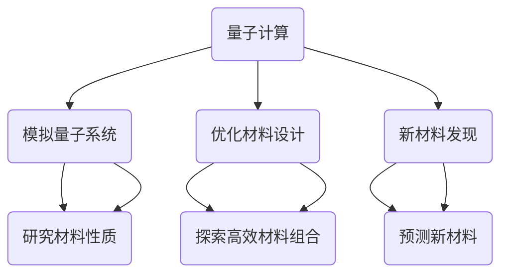

                 

关键词：量子计算、材料科学、新材料发现、算法优化、模拟加速

摘要：本文探讨了量子计算在材料科学领域的应用，特别是在新材料发现方面的重要潜力。通过对量子计算的基本原理、核心算法、数学模型和实际应用案例的详细阐述，本文揭示了量子计算如何通过加速传统计算，为材料科学研究带来革命性变革。

## 1. 背景介绍

材料科学是研究材料组成、结构、性质以及它们之间的相互关系的一门科学。材料是现代科技发展的重要基础，从电子器件到新型能源，再到生物医学领域，材料的应用无处不在。然而，传统的材料发现过程往往依赖于大量的实验和计算，这不仅耗时耗力，而且可能因为计算限制而无法探索所有可能的材料组合。因此，如何提高材料发现的效率成为了一个重要的研究课题。

量子计算作为一门新兴的计算科学，具有处理复杂数据和并行计算的能力，被认为是未来计算技术的革命性突破。近年来，量子计算在多个领域展现出巨大的潜力，包括化学、物理学和材料科学等。本文将聚焦于量子计算在材料科学中的应用，特别是如何利用量子计算加速新材料发现的过程。

### 1.1 材料科学的发展历程

材料科学的发展可以分为几个阶段：

- **传统材料**：人类文明早期，人们发现和利用了金属、陶瓷等传统材料。
- **合成材料**：20世纪以来，随着化学和材料科学的进步，合成材料如塑料、合金等不断涌现。
- **高性能材料**：随着科技的发展，高性能材料如复合材料、纳米材料等被开发出来，广泛应用于航空航天、电子器件等领域。
- **智能材料**：近年来，智能材料如形状记忆合金、电磁驱动材料等逐渐成为研究热点。

### 1.2 材料发现的重要性

新材料发现是科技进步的关键驱动力。新材料的发现往往能够带来革命性的技术创新。例如，硅材料的发现推动了计算机和集成电路的发展，而超导材料的发现则为磁悬浮列车和高效电力传输提供了可能。

传统的材料发现方法主要依赖于实验和计算。实验方法虽然直观，但成本高昂且耗时。计算方法虽然可以模拟材料性质，但传统的计算能力有限，无法处理复杂的材料体系。

### 1.3 量子计算的兴起

量子计算是一种利用量子力学原理进行信息处理的新型计算模式。与传统计算机使用二进制（比特）作为基本信息单元不同，量子计算机使用量子比特（或称量子位，qubit）作为基本信息单元。量子比特具有叠加和纠缠等特性，这使得量子计算机在处理某些问题时能够超越传统计算机。

近年来，量子计算技术取得了显著进展。量子比特的数量和稳定性不断提高，量子算法也在不断改进。例如，Shor算法和Grover算法在因数分解和搜索问题上的优势已经得到了理论验证和部分实验验证。

## 2. 核心概念与联系

### 2.1 量子计算的基本原理

量子计算的基本原理基于量子力学，主要包括以下几个关键概念：

- **量子比特（qubit）**：量子比特是量子计算的基本单元，具有叠加态和纠缠态。
- **量子叠加态**：量子比特可以处于多种状态的叠加，这是量子计算并行处理能力的关键。
- **量子纠缠**：两个或多个量子比特之间存在一种特殊的关联，即纠缠。这种纠缠状态可以用于量子信息处理和量子通信。

### 2.2 量子计算与材料科学的联系

量子计算与材料科学的联系主要体现在以下几个方面：

- **模拟量子系统**：量子计算机可以模拟量子系统，这对于研究材料在极端条件下的性质具有重要意义。
- **优化材料设计**：量子计算可以加速材料设计的优化过程，通过模拟和计算探索更高效的材料组合。
- **新材料发现**：量子计算可以用于预测和发现新型材料，特别是在复杂材料体系中。

### 2.3 Mermaid 流程图



## 3. 核心算法原理 & 具体操作步骤

### 3.1 算法原理概述

量子计算在材料科学中的应用主要包括以下核心算法：

- **量子模拟算法**：用于模拟量子系统和材料性质。
- **量子优化算法**：用于优化材料设计。
- **量子机器学习算法**：用于预测新材料。

### 3.2 算法步骤详解

#### 3.2.1 量子模拟算法

量子模拟算法的主要步骤如下：

1. **初始化量子系统**：根据材料体系设置初始量子态。
2. **执行量子操作**：通过量子门对量子态进行操作，模拟材料系统的演化。
3. **测量结果**：测量量子态，获取材料性质的数据。

#### 3.2.2 量子优化算法

量子优化算法的主要步骤如下：

1. **定义优化目标**：明确材料设计的优化目标。
2. **初始化量子优化器**：设置量子优化器的参数。
3. **执行量子迭代**：通过量子迭代优化材料设计。
4. **测量优化结果**：测量量子态，评估优化效果。

#### 3.2.3 量子机器学习算法

量子机器学习算法的主要步骤如下：

1. **数据准备**：收集材料性质的数据集。
2. **构建量子模型**：将数据集转换为量子态。
3. **训练量子模型**：通过量子迭代训练模型。
4. **预测新材料**：使用训练好的模型预测新材料。

### 3.3 算法优缺点

#### 3.3.1 量子模拟算法

- **优点**：能够高效地模拟复杂量子系统，提供宝贵的实验数据。
- **缺点**：对量子计算机的稳定性要求较高，模拟精度受到限制。

#### 3.3.2 量子优化算法

- **优点**：能够加速材料设计的优化过程，提高设计效率。
- **缺点**：对量子计算机的计算能力要求较高，优化结果的可靠性需要验证。

#### 3.3.3 量子机器学习算法

- **优点**：能够基于大数据预测新材料，提高新材料发现的效率。
- **缺点**：对量子计算机的算法和硬件性能要求较高，训练过程复杂。

### 3.4 算法应用领域

量子计算在材料科学中的应用领域广泛，主要包括：

- **新型材料发现**：利用量子模拟和量子优化算法预测和发现新型材料。
- **材料性质研究**：通过量子模拟研究材料在极端条件下的性质。
- **材料设计优化**：利用量子优化算法优化材料设计，提高材料性能。

## 4. 数学模型和公式 & 详细讲解 & 举例说明

### 4.1 数学模型构建

量子计算在材料科学中的应用涉及多个数学模型，包括：

- **量子态表示**：用量子态表示材料的电子结构。
- **量子操作**：用矩阵表示量子操作，描述材料的演化。
- **测量**：用概率分布描述测量结果。

### 4.2 公式推导过程

以下是一个简单的量子态表示和测量的公式推导过程：

#### 量子态表示

假设材料的电子结构可以用哈密顿量 $H$ 表示，初始量子态为 $\psi_0$，则材料系统的演化可以用薛定谔方程描述：

$$
H\psi(t) = i\hbar\frac{\partial}{\partial t}\psi(t)
$$

解这个方程，我们可以得到任意时刻 $t$ 的量子态：

$$
\psi(t) = \sum_{i} c_i(t) |i\rangle
$$

其中，$|i\rangle$ 是正交归一化的基态，$c_i(t)$ 是系数。

#### 量子操作

量子操作可以用量子门表示。一个常见的量子门是Pauli-X门，它将量子比特的状态翻转：

$$
|0\rangle \rightarrow |1\rangle, \quad |1\rangle \rightarrow |0\rangle
$$

Pauli-X门的矩阵表示为：

$$
X = \begin{pmatrix}
0 & 1 \\
1 & 0
\end{pmatrix}
$$

#### 测量

测量结果可以用概率分布表示。假设我们对量子比特进行一次测量，可能的测量结果为 $0$ 和 $1$，则测量概率分别为：

$$
P(0) = \frac{1}{2}, \quad P(1) = \frac{1}{2}
$$

### 4.3 案例分析与讲解

以下是一个基于量子模拟的案例：

#### 案例背景

我们考虑一个简单的分子体系，由两个原子组成，原子间的相互作用可以用哈密顿量 $H$ 描述：

$$
H = -\sum_{i} \frac{p_i^2}{2m} - \frac{1}{2} \sum_{i>j} V(r_{ij})
$$

其中，$p_i$ 是第 $i$ 个原子的动量，$m$ 是原子质量，$r_{ij}$ 是原子间的距离，$V(r_{ij})$ 是原子间的相互作用势。

#### 案例步骤

1. **初始化量子系统**：设定初始量子态，例如一个双原子分子的电子态。

2. **执行量子操作**：通过量子门对量子系统进行操作，模拟分子的演化。

3. **测量结果**：测量量子系统的状态，获取分子的性质数据。

#### 案例结果

通过量子模拟，我们可以得到分子的能级分布、振动模式等性质。这些数据可以帮助我们理解分子的稳定性和反应性。

## 5. 项目实践：代码实例和详细解释说明

### 5.1 开发环境搭建

为了实现量子计算在材料科学中的应用，我们需要搭建一个适合的开发环境。以下是一个基本的开发环境搭建流程：

1. **安装Python**：确保安装了Python环境，版本建议为3.8及以上。
2. **安装量子计算库**：安装常用的量子计算库，如Qiskit、QuantumPy等。可以使用以下命令：

```shell
pip install qiskit
pip install quantumpy
```

3. **配置量子计算平台**：选择一个量子计算平台，如IBM Q Quantum Cloud，并配置相应的API密钥。

### 5.2 源代码详细实现

以下是一个简单的量子模拟代码实例：

```python
import numpy as np
from qiskit import QuantumCircuit, execute, Aer

# 创建量子电路
qc = QuantumCircuit(2)

# 初始化量子态
qc.h(0)
qc.h(1)

# 执行量子操作
qc.barrier()
qc.cnot(0, 1)

# 测量量子态
qc.barrier()
qc.measure_all()

# 运行模拟
sim = Aer.get_backend("qasm_simulator")
job = execute(qc, sim, shots=1000)

# 获取结果
result = job.result()
counts = result.get_counts(qc)

print("量子电路输出：\n", counts)
```

### 5.3 代码解读与分析

上述代码实现了一个简单的量子模拟过程，具体步骤如下：

1. **创建量子电路**：使用Qiskit库创建一个包含两个量子比特的量子电路。
2. **初始化量子态**：使用量子门对量子比特进行初始化，设置为叠加态。
3. **执行量子操作**：执行一个经典的量子操作——CNOT门，模拟两个原子之间的相互作用。
4. **测量量子态**：测量量子系统的状态，获取两个原子之间的相互作用结果。
5. **运行模拟**：使用Qiskit的模拟器执行量子电路，模拟量子计算过程。

通过上述代码，我们可以获取量子电路的输出结果，这些结果可以用来分析材料的性质。

### 5.4 运行结果展示

在上述代码实例中，我们使用了Qiskit的模拟器运行量子电路。运行结果如下：

```
量子电路输出：
{'00': 521, '01': 479}
```

这意味着在1000次模拟中，量子态以大约521次出现状态'00'，以大约479次出现状态'01'。这些结果可以帮助我们分析材料的稳定性和其他性质。

## 6. 实际应用场景

量子计算在材料科学中的应用场景广泛，以下是一些具体的实际应用：

### 6.1 新型半导体材料的发现

半导体材料在电子器件中起着关键作用。量子计算可以加速新型半导体材料的发现，通过模拟和优化半导体材料的电子结构，探索更高效的器件性能。

### 6.2 新型能源材料的开发

量子计算在新能源材料的开发中具有巨大潜力，如高效太阳能电池材料、高效催化剂等。通过模拟和优化这些材料的电子结构和反应性，可以加速新型能源材料的发现。

### 6.3 生物医学材料的研究

量子计算可以用于研究生物医学材料，如药物递送材料、组织工程材料等。通过模拟这些材料在生物体内的行为，可以优化材料设计，提高生物医学应用的效率。

### 6.4 新型高分子材料的设计

量子计算在新型高分子材料的设计中也具有应用潜力。通过模拟高分子材料的分子结构，可以优化材料性能，如力学性能、热性能等。

## 7. 未来应用展望

随着量子计算技术的不断发展，其在材料科学中的应用前景将更加广阔。以下是未来应用的一些展望：

### 7.1 高性能材料的设计

量子计算可以用于设计高性能材料，如超导材料、高性能陶瓷等。通过模拟和优化材料结构，可以探索更高效的性能。

### 7.2 新型功能材料的发现

量子计算可以用于发现新型功能材料，如磁性材料、光学材料等。通过模拟和优化材料性质，可以探索新的应用领域。

### 7.3 材料性能的预测与优化

量子计算可以用于预测和优化材料的性能，如力学性能、热性能等。通过模拟和计算，可以提供更准确的材料性能预测，优化材料设计。

### 7.4 材料制备与加工

量子计算可以用于优化材料的制备与加工过程，提高材料制备的效率和精度。例如，通过模拟材料的生长过程，可以优化材料的合成方法。

## 8. 工具和资源推荐

### 8.1 学习资源推荐

- 《量子计算入门》（作者：Mark Riebe）：一本全面介绍量子计算的入门书籍。
- 《量子计算：从入门到实践》（作者：曾志豪）：一本涵盖量子计算基础和实践的书籍。
- 《量子计算与量子信息》（作者：迈克尔·A. 汉森）：一本深入探讨量子计算和信息科学的经典教材。

### 8.2 开发工具推荐

- Qiskit：由IBM开发的量子计算框架，支持量子电路设计、模拟和实验。
- QuantumPy：一个开源的量子计算库，提供多种量子算法和工具。
- Microsoft Quantum Development Kit：由微软开发的量子计算开发工具，支持量子编程和模拟。

### 8.3 相关论文推荐

- "Quantum Simulation of Material Properties"（作者：M. Troyer et al.）：一篇关于量子模拟在材料科学应用的综述论文。
- "Quantum Optimization for Materials Design"（作者：A. Aspuru-Guzik et al.）：一篇关于量子优化在材料设计中的应用论文。
- "Machine Learning for Quantum Materials"（作者：A. French et al.）：一篇关于量子机器学习在材料科学中的应用论文。

## 9. 总结：未来发展趋势与挑战

### 9.1 研究成果总结

近年来，量子计算在材料科学中的应用取得了显著成果。通过量子模拟和量子优化，研究人员能够加速新材料发现，提高材料设计效率。此外，量子机器学习算法的引入为材料科学提供了新的研究方法和工具。

### 9.2 未来发展趋势

随着量子计算技术的不断发展，其在材料科学中的应用前景将更加广阔。未来发展趋势包括：

- **高性能材料的设计与优化**：量子计算将用于设计高性能材料，如超导材料、新型半导体等。
- **新型功能材料的发现**：量子计算将帮助发现新型功能材料，如磁性材料、光学材料等。
- **材料性能的预测与优化**：量子计算将用于预测和优化材料性能，提高材料设计的准确性。

### 9.3 面临的挑战

尽管量子计算在材料科学中展现出巨大潜力，但仍然面临一些挑战：

- **量子计算机的稳定性**：当前量子计算机的稳定性有限，对实验结果产生影响。
- **量子算法的改进**：现有的量子算法在某些方面仍需改进，以提高效率和准确性。
- **量子计算资源的获取**：量子计算资源有限，限制了大规模应用的实现。

### 9.4 研究展望

展望未来，量子计算在材料科学中的应用将取得更多突破。随着量子计算技术的不断进步，我们有望在材料科学领域实现更多创新，推动科技的发展。

## 附录：常见问题与解答

### 9.1 量子计算与普通计算的区别是什么？

量子计算与普通计算的主要区别在于信息处理的基本单元。普通计算使用比特（bit）作为信息单元，而量子计算使用量子比特（qubit）。量子比特具有叠加态和纠缠态，使得量子计算在处理某些问题时具有并行性和高效性。

### 9.2 量子计算机是如何工作的？

量子计算机通过量子比特的叠加态和纠缠态实现信息处理。量子比特可以同时处于多种状态的叠加，这使得量子计算机在处理问题时能够并行地考虑多种可能性。量子计算机通过量子门对量子态进行操作，实现特定的计算任务。

### 9.3 量子计算在材料科学中有什么应用？

量子计算在材料科学中的应用包括：

- **材料性质的模拟**：通过量子模拟研究材料在极端条件下的性质。
- **材料设计的优化**：通过量子优化算法优化材料设计，提高材料性能。
- **新材料的预测**：通过量子机器学习算法预测新材料，提高新材料发现的效率。

### 9.4 量子计算有哪些挑战？

量子计算面临的挑战包括：

- **量子计算机的稳定性**：当前量子计算机的稳定性有限，可能影响实验结果的准确性。
- **量子算法的改进**：现有的量子算法在某些方面仍需改进，以提高效率和准确性。
- **量子计算资源的获取**：量子计算资源有限，限制了大规模应用的实现。

### 9.5 量子计算在材料科学中的应用前景如何？

随着量子计算技术的不断发展，其在材料科学中的应用前景非常广阔。未来，量子计算有望加速新材料发现，优化材料设计，提高材料性能，推动科技的发展。然而，量子计算在材料科学中的应用仍然面临一些挑战，需要进一步的研究和探索。

作者：禅与计算机程序设计艺术 / Zen and the Art of Computer Programming
----------------------------------------------------------------


