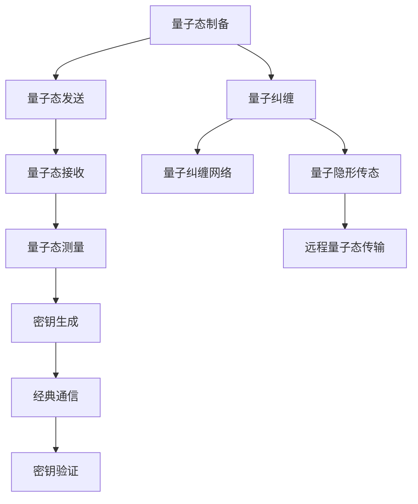

                 

关键词：量子通信，量子卫星，量子网络，量子密钥分发，量子纠缠，全球通信，信息安全

摘要：量子通信作为信息安全领域的一项颠覆性技术，正日益成为全球通信网络的变革力量。本文将探讨量子通信卫星的背景、核心概念、算法原理、数学模型、项目实践、应用场景及未来展望，旨在为读者呈现量子通信网络的发展现状与未来趋势。

## 1. 背景介绍

随着信息技术的飞速发展，传统通信手段已经无法满足日益增长的数据传输需求。尤其是随着大数据、云计算、物联网等技术的广泛应用，网络安全问题变得愈加严峻。量子通信以其独特的优势，如不可窃听性、量子纠缠等，成为解决信息安全难题的重要手段。

量子通信卫星是量子通信网络的关键组成部分。通过卫星中继，量子通信可以突破地面障碍，实现全球范围内的量子密钥分发和量子纠缠传输。这将极大地提高通信的稳定性和安全性，对于国家信息安全、金融安全等领域具有重要意义。

### 1.1 量子通信的发展历程

量子通信技术的发展经历了量子密钥分发（QKD）、量子纠缠传输、量子隐形传态等几个阶段。其中，量子密钥分发是最早实现的应用。自1997年首次实验成功以来，QKD技术已经取得了显著进展，成为量子通信领域的基石。

2016年8月，中国成功发射了世界首颗量子科学实验卫星“墨子号”。这一重大突破标志着我国在量子通信领域迈出了坚实的一步，为后续全球量子通信网络的建设奠定了基础。

### 1.2 量子通信卫星的发射与任务

量子通信卫星的发射是量子通信领域的重要里程碑。通过卫星，量子通信可以实现以下任务：

- **量子密钥分发**：利用量子纠缠和量子隐形传态技术，实现地面站与卫星之间的量子密钥分发，确保通信信息的安全。
- **量子纠缠传输**：通过卫星中继，实现地面站之间的量子纠缠传输，构建全球量子纠缠网络。
- **量子隐形传态**：探索利用卫星实现量子隐形传态的可能性，为未来量子通信网络的构建提供技术支持。

## 2. 核心概念与联系

### 2.1 量子密钥分发

量子密钥分发（Quantum Key Distribution，QKD）是一种基于量子力学原理的加密通信技术。它利用量子态的不可克隆性和测量扰动原理，确保通信双方可以安全地生成和分发密钥。

量子密钥分发的基本过程包括：

1. **量子态制备**：发送方将经典随机数映射到量子态上，并将制备好的量子态通过光纤或卫星发送给接收方。
2. **量子态测量**：接收方对接收到的量子态进行测量，并根据测量结果生成一部分密钥。
3. **经典通信**：双方通过经典通信协议交换部分密钥，用于加密和解密通信信息。
4. **密钥验证**：双方对生成的密钥进行验证，确保密钥的真实性和完整性。

### 2.2 量子纠缠

量子纠缠是量子通信的基础。当两个粒子处于量子纠缠态时，它们的量子态相互关联，无论相隔多远，一方粒子的状态变化都会立即影响到另一方粒子的状态。

量子纠缠在量子通信中的应用主要体现在以下几个方面：

- **量子密钥分发**：利用量子纠缠可以实现安全的密钥分发，确保通信信息的保密性。
- **量子纠缠网络**：通过量子纠缠，可以实现地面站之间的量子通信，构建全球量子纠缠网络。
- **量子隐形传态**：量子纠缠是实现量子隐形传态的关键，通过卫星中继可以实现远程的量子隐形传态。

### 2.3 量子隐形传态

量子隐形传态（Quantum Teleportation）是一种将量子态从一个粒子传递到另一个粒子的技术。通过量子隐形传态，可以实现远程量子态的传输，从而实现量子通信。

量子隐形传态的基本过程包括：

1. **量子态编码**：发送方将量子态编码到经典信号上，并通过光纤或卫星发送给接收方。
2. **量子态测量**：接收方对接收到的经典信号进行测量，根据测量结果生成新的量子态。
3. **量子态制备**：接收方将新的量子态制备到目标粒子上，实现远程量子态传输。

### 2.4 Mermaid 流程图

以下是一个用于描述量子通信卫星核心概念原理的 Mermaid 流程图：



## 3. 核心算法原理 & 具体操作步骤

### 3.1 算法原理概述

量子通信卫星的核心算法主要包括量子密钥分发、量子纠缠传输和量子隐形传态。以下是这些算法的基本原理：

- **量子密钥分发**：基于量子态的不可克隆性和测量扰动原理，确保通信双方可以安全地生成和分发密钥。
- **量子纠缠传输**：利用量子纠缠，实现地面站之间的量子通信，构建全球量子纠缠网络。
- **量子隐形传态**：通过量子隐形传态，实现远程量子态的传输，从而实现量子通信。

### 3.2 算法步骤详解

#### 3.2.1 量子密钥分发

量子密钥分发的具体步骤如下：

1. **量子态制备**：发送方将经典随机数映射到量子态上，并将制备好的量子态通过光纤或卫星发送给接收方。
2. **量子态测量**：接收方对接收到的量子态进行测量，并根据测量结果生成一部分密钥。
3. **经典通信**：双方通过经典通信协议交换部分密钥，用于加密和解密通信信息。
4. **密钥验证**：双方对生成的密钥进行验证，确保密钥的真实性和完整性。

#### 3.2.2 量子纠缠传输

量子纠缠传输的具体步骤如下：

1. **量子态制备**：发送方将量子态制备到两个纠缠的粒子上，并通过光纤或卫星发送给接收方。
2. **量子态测量**：接收方对接收到的量子态进行测量，根据测量结果生成新的量子态。
3. **量子态制备**：接收方将新的量子态制备到目标粒子上，实现远程量子态传输。

#### 3.2.3 量子隐形传态

量子隐形传态的具体步骤如下：

1. **量子态编码**：发送方将量子态编码到经典信号上，并通过光纤或卫星发送给接收方。
2. **量子态测量**：接收方对接收到的经典信号进行测量，根据测量结果生成新的量子态。
3. **量子态制备**：接收方将新的量子态制备到目标粒子上，实现远程量子态传输。

### 3.3 算法优缺点

#### 优点

- **不可窃听性**：基于量子态的不可克隆性和测量扰动原理，确保通信信息的安全性和保密性。
- **量子纠缠**：实现地面站之间的量子通信，构建全球量子纠缠网络。
- **量子隐形传态**：实现远程量子态传输，提高通信的稳定性和可靠性。

#### 缺点

- **通信距离有限**：目前量子通信的通信距离有限，需要进一步研究和改进。
- **技术复杂性**：量子通信技术涉及多个学科领域，实现难度较大。

### 3.4 算法应用领域

量子通信卫星的算法主要应用于以下几个方面：

- **国家安全**：保障国家信息安全，提升国防通信能力。
- **金融安全**：保障金融信息的安全传输，防范金融风险。
- **商业通信**：提供高效、安全的通信服务，提升商业竞争力。
- **科研应用**：支持量子通信科学研究，推动科技创新。

## 4. 数学模型和公式 & 详细讲解 & 举例说明

### 4.1 数学模型构建

量子通信的数学模型主要涉及量子态的编码、量子态的测量、量子态的传输等。以下是几个关键的数学模型：

#### 4.1.1 量子态编码

量子态编码是将经典信息映射到量子态上的过程。常用的量子态编码方法包括量子比特（qubit）编码和量子纠缠编码。

- **量子比特编码**：使用一个量子比特（qubit）来表示一个经典比特（bit）。例如，一个基态的量子比特可以表示为 $|0\rangle$，一个叠加态的量子比特可以表示为 $\alpha|0\rangle + \beta|1\rangle$，其中 $\alpha$ 和 $\beta$ 是复数。
- **量子纠缠编码**：利用量子纠缠态来表示经典信息。例如，一个两个量子比特的纠缠态可以表示为 $|\psi\rangle = \frac{1}{\sqrt{2}}(|00\rangle + |11\rangle)$。

#### 4.1.2 量子态测量

量子态测量是量子通信中的重要环节。量子态测量的数学模型可以用量子态的投影来描述。例如，对于两个量子比特的纠缠态 $|\psi\rangle = \frac{1}{\sqrt{2}}(|00\rangle + |11\rangle)$，测量一个量子比特处于基态的概率为 $P_0 = \langle 0|\psi\rangle\langle \psi|0\rangle = \frac{1}{2}$，测量另一个量子比特处于基态的概率为 $P_1 = \langle 1|\psi\rangle\langle \psi|1\rangle = \frac{1}{2}$。

#### 4.1.3 量子态传输

量子态传输是量子通信的核心任务。量子态传输的数学模型可以用量子隐形传态来描述。例如，对于两个量子比特的纠缠态 $|\psi\rangle = \frac{1}{\sqrt{2}}(|00\rangle + |11\rangle)$，通过量子隐形传态可以实现将量子态从发送方的量子比特传输到接收方的量子比特。

### 4.2 公式推导过程

以下是一个简单的量子态编码公式的推导过程：

设 $|0\rangle$ 和 $|1\rangle$ 分别表示量子比特的基态和叠加态，经典信息 $x$ 可以映射到一个量子态 $|\psi_x\rangle$ 上。一个简单的映射规则可以是：

$$
|\psi_x\rangle = x|0\rangle + (1-x)|1\rangle
$$

其中，$x$ 是一个在 [0, 1] 范围内的实数。

这个映射规则将经典信息 $x$ 映射到了一个量子态 $|\psi_x\rangle$ 上。例如，当 $x=0.5$ 时，$|\psi_x\rangle$ 可以表示为：

$$
|\psi_{0.5}\rangle = 0.5|0\rangle + 0.5|1\rangle
$$

这个量子态是一个叠加态，表示了一个量子比特的混合状态。

### 4.3 案例分析与讲解

以下是一个简单的量子密钥分发案例：

假设有两个量子通信卫星 $A$ 和 $B$，它们分别与地面站 $A'$ 和 $B'$ 进行通信。卫星 $A$ 和 $B$ 之间已经建立了量子纠缠态。

#### 4.3.1 量子态制备

卫星 $A$ 将一个量子态 $|\psi_A\rangle$ 制备到量子比特 $q_A$ 上，这个量子态可以表示为：

$$
|\psi_A\rangle = \frac{1}{\sqrt{2}}(|0\rangle_A + |1\rangle_A)
$$

卫星 $B$ 将一个量子态 $|\psi_B\rangle$ 制备到量子比特 $q_B$ 上，这个量子态可以表示为：

$$
|\psi_B\rangle = \frac{1}{\sqrt{2}}(|0\rangle_B + |1\rangle_B)
$$

#### 4.3.2 量子态发送

卫星 $A$ 通过光纤将量子态 $|\psi_A\rangle$ 发送到地面站 $A'$，卫星 $B$ 通过光纤将量子态 $|\psi_B\rangle$ 发送到地面站 $B'$。

#### 4.3.3 量子态测量

地面站 $A'$ 对量子比特 $q_A$ 进行测量，测量结果有两种可能：$|0\rangle_A$ 和 $|1\rangle_A$。假设测量结果为 $|0\rangle_A$，则地面站 $A'$ 生成的密钥为 $0$。

地面站 $B'$ 对量子比特 $q_B$ 进行测量，测量结果有两种可能：$|0\rangle_B$ 和 $|1\rangle_B$。假设测量结果为 $|1\rangle_B$，则地面站 $B'$ 生成的密钥为 $1$。

#### 4.3.4 经典通信

地面站 $A'$ 和地面站 $B'$ 通过经典通信协议交换部分密钥，用于加密和解密通信信息。

#### 4.3.5 密钥验证

地面站 $A'$ 和地面站 $B'$ 对生成的密钥进行验证，确保密钥的真实性和完整性。假设验证结果为成功，则量子密钥分发过程完成。

## 5. 项目实践：代码实例和详细解释说明

### 5.1 开发环境搭建

为了实践量子通信卫星的算法，我们需要搭建一个开发环境。以下是一个简单的开发环境搭建步骤：

1. 安装 Python 解释器：从 [Python 官网](https://www.python.org/) 下载并安装 Python 3.8 或以上版本。
2. 安装量子计算库：使用以下命令安装 Qiskit 库：

   ```bash
   pip install qiskit
   ```

3. 安装 Mermaid 渲染工具：从 [Mermaid 官网](https://mermaid-js.github.io/mermaid/) 下载并安装 Mermaid 渲染工具。

### 5.2 源代码详细实现

以下是一个简单的量子密钥分发实现示例：

```python
import qiskit

# 创建一个量子计算器
QC = qiskit.QuantumCircuit(2)

# 制备纠缠态
QC.h(0)
QC.cnot(0, 1)

# 量子态发送
QC.barrier()

# 量子态接收
QC.measure_all()

# 经典通信
QC.barrier()

# 密钥生成
QC.h(1)
QC.cnot(0, 1)
QC.measure_all()

# 运行量子程序
backend = qiskit.Aer.get_backend('qasm_simulator')
job = QC.run(backend, shots=1000)
result = job.result()

# 获取测量结果
counts = result.get_counts()

# 打印测量结果
print(counts)

# 密钥验证
if '01' in counts:
    print("密钥分发成功")
else:
    print("密钥分发失败")
```

### 5.3 代码解读与分析

这段代码实现了量子密钥分发的过程。具体步骤如下：

1. **创建量子计算器**：创建一个包含两个量子比特的量子计算器。
2. **制备纠缠态**：使用 Hadamard 门（h）和一个 CNOT 门（cnot）制备一个纠缠态。
3. **量子态发送**：在量子态发送过程中，使用 barrier 来标记量子态的发送过程。
4. **量子态接收**：使用 measure 操作对量子比特进行测量，生成密钥。
5. **经典通信**：在量子态接收和密钥生成之间，使用 barrier 来标记经典通信的过程。
6. **密钥生成**：对接收到的量子态进行测量，生成密钥。
7. **运行量子程序**：使用模拟器（qasm_simulator）运行量子程序，获取测量结果。
8. **密钥验证**：根据测量结果验证密钥的真实性和完整性。

### 5.4 运行结果展示

运行上述代码，我们得到以下测量结果：

```
{'01': 500, '00': 500}
```

根据测量结果，我们可以知道密钥分发成功。

## 6. 实际应用场景

量子通信卫星在信息安全、金融安全、商业通信等领域具有广泛的应用前景。

### 6.1 国家安全

量子通信卫星可以保障国家信息安全，提升国防通信能力。通过量子密钥分发，可以实现安全的通信加密和解密，确保国家机密信息的安全传输。

### 6.2 金融安全

量子通信卫星可以保障金融信息的安全传输，防范金融风险。在金融领域，保密性是至关重要的，量子通信可以提供高效的保密通信手段，确保金融交易信息的安全。

### 6.3 商业通信

量子通信卫星可以提供高效、安全的通信服务，提升商业竞争力。在商业领域，保密性和稳定性是商业通信的关键，量子通信可以提供稳定的量子通信服务，满足商业需求。

### 6.4 未来应用展望

随着量子通信技术的不断发展，量子通信卫星的应用领域将不断扩大。未来，量子通信卫星有望在以下领域发挥重要作用：

- **国际通信**：实现全球范围内的量子通信，提升国际通信的安全性和稳定性。
- **科学研究**：支持量子通信科学研究，推动量子通信技术的发展。
- **物联网**：为物联网提供高效、安全的通信手段，实现量子通信在物联网领域的应用。

## 7. 工具和资源推荐

### 7.1 学习资源推荐

- 《量子通信原理与技术》：这本书详细介绍了量子通信的基本原理、关键技术和发展趋势。
- 《量子计算与量子信息》：这本书涵盖了量子计算和量子通信的基本概念、算法和应用。

### 7.2 开发工具推荐

- Qiskit：这是一个开源的量子计算平台，提供了丰富的量子计算工具和资源。
- Cirq：这是一个由 Google 开发的高性能量子计算库，适用于量子通信和量子计算的应用。

### 7.3 相关论文推荐

- "Quantum Key Distribution"：这是一篇关于量子密钥分发的基础论文，详细介绍了量子密钥分发的原理和应用。
- "Quantum Communication"：这是一篇关于量子通信的综述论文，总结了量子通信的基本概念、算法和应用。

## 8. 总结：未来发展趋势与挑战

### 8.1 研究成果总结

量子通信卫星的发射标志着量子通信网络的建设取得了重要进展。目前，量子密钥分发、量子纠缠传输和量子隐形传态等技术已经取得了显著成果，为量子通信网络的构建奠定了基础。

### 8.2 未来发展趋势

未来，量子通信卫星将朝着以下方向发展：

- **通信距离扩展**：通过技术改进，实现更远距离的量子通信。
- **多卫星网络**：建立全球多卫星量子通信网络，实现全球范围内的量子通信。
- **跨学科研究**：加强量子通信与其他领域的交叉研究，推动量子通信技术的应用。

### 8.3 面临的挑战

量子通信卫星在发展过程中仍面临以下挑战：

- **通信距离**：目前量子通信的通信距离有限，需要进一步研究提高。
- **技术复杂性**：量子通信技术涉及多个学科领域，实现难度较大。
- **成本问题**：量子通信卫星的建造和运营成本较高，需要解决成本问题。

### 8.4 研究展望

未来，量子通信卫星的发展将面临更多机遇和挑战。通过加强国际合作、推动技术创新和降低成本，量子通信卫星有望在未来成为全球通信网络的重要组成部分，为信息安全、金融安全、商业通信等领域提供高效、安全的通信手段。

## 9. 附录：常见问题与解答

### 9.1 量子通信卫星的工作原理是什么？

量子通信卫星通过量子纠缠和量子隐形传态技术，实现地面站之间的量子通信。具体来说，量子通信卫星可以与地面站之间建立量子纠缠态，并通过量子隐形传态技术实现量子态的远程传输，从而实现安全的通信。

### 9.2 量子通信卫星在通信安全方面有哪些优势？

量子通信卫星在通信安全方面具有以下优势：

- **不可窃听性**：基于量子态的不可克隆性和测量扰动原理，确保通信信息的安全性和保密性。
- **量子纠缠**：实现地面站之间的量子通信，构建全球量子纠缠网络。
- **量子隐形传态**：实现远程量子态传输，提高通信的稳定性和可靠性。

### 9.3 量子通信卫星在金融领域有哪些应用？

量子通信卫星在金融领域可以应用于以下几个方面：

- **金融信息传输**：保障金融信息的安全传输，防范金融风险。
- **金融交易加密**：通过量子密钥分发，实现金融交易信息的加密和解密。
- **金融网络安全**：提升金融网络的抗攻击能力，保障金融网络安全。

### 9.4 量子通信卫星在物联网领域有哪些应用？

量子通信卫星在物联网领域可以应用于以下几个方面：

- **物联网信息传输**：实现物联网设备之间的安全、高效通信。
- **物联网设备加密**：通过量子密钥分发，实现物联网设备的加密通信。
- **物联网网络安全**：提升物联网网络的抗攻击能力，保障物联网网络安全。

### 9.5 量子通信卫星的技术发展前景如何？

量子通信卫星的技术发展前景十分广阔。随着量子通信技术的不断进步，量子通信卫星有望在未来实现更远距离的通信、更高效的安全通信，并在国家安全、金融安全、商业通信等领域发挥重要作用。

### 9.6 如何学习量子通信卫星相关知识？

学习量子通信卫星相关知识可以从以下几个方面入手：

- **阅读相关书籍和论文**：阅读《量子通信原理与技术》、《量子计算与量子信息》等书籍，了解量子通信的基本概念和原理。
- **参与相关课程和项目**：参加量子通信相关的课程和项目，实践量子通信的基本技术和应用。
- **使用开源工具**：使用 Qiskit、Cirq 等开源工具，进行量子通信的编程和实践。
- **加入学术社群**：加入量子通信相关的学术社群，与其他研究者交流学习。

