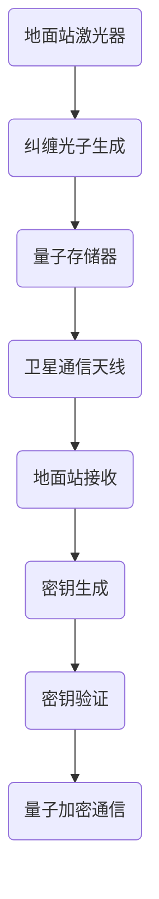

                 

关键词：量子通信、量子卫星、量子网络、量子纠缠、量子加密、量子密钥分发、量子计算

## 摘要

本文将深入探讨量子通信卫星技术，如何通过量子卫星构建全球量子通信网络。首先，我们将回顾量子通信的基本原理，包括量子纠缠、量子密钥分发和量子加密等概念。随后，文章将详细介绍量子通信卫星的组成与功能，以及其在实际应用中的挑战与解决方案。接下来，我们将探讨全球量子通信网络的设计与实现，重点介绍量子中继技术和量子纠缠交换技术。最后，本文将展望量子通信的未来发展，包括其对信息安全、量子计算和量子通信卫星的潜在影响。通过本文的阅读，读者将全面了解量子通信卫星技术及其在构建全球量子通信网络中的重要作用。

## 1. 背景介绍

### 量子通信的起源与发展

量子通信是量子信息科学的一个重要分支，其理论基础源于量子力学的基本原理。量子力学揭示了微观世界的奇特现象，如量子纠缠和量子叠加。这些量子现象为通信领域带来了全新的可能性，推动了量子通信技术的发展。量子通信的起源可以追溯到20世纪80年代，当时科学家们开始探索利用量子纠缠来实现量子态的传输。

量子通信的基本原理之一是量子纠缠。量子纠缠是指两个或多个粒子之间存在的一种量子关联，这种关联不受距离限制。当两个粒子处于纠缠态时，对其中一个粒子的测量将即时影响另一个粒子的状态，无论它们相距多远。这一特性为量子通信提供了安全传输信息的基础。

另一个重要的量子通信原理是量子密钥分发（Quantum Key Distribution, QKD）。量子密钥分发利用量子态的不确定性原理和量子纠缠特性来实现安全的密钥生成和分发。在QKD过程中，发送方和接收方通过量子信道交换量子态，并根据测量结果协商出共享密钥。由于量子态的任何测量都会导致其坍缩，因此任何试图窃听的行为都将被立即检测到，确保了通信的安全性。

量子加密是量子通信的另一个重要组成部分。量子加密利用量子态的不确定性原理和量子纠缠特性，将信息编码在量子态上，实现抗干扰和抗窃听的安全通信。量子加密算法包括量子密钥加密和量子密文加密，它们可以在不依赖传统加密算法的情况下提供更强的安全性。

随着量子通信技术的不断进步，量子通信卫星作为一种新型的通信方式，逐渐成为研究的热点。量子通信卫星利用地球轨道上的卫星作为中继站，实现地面站之间的量子通信。这不仅突破了传统通信卫星的技术限制，也为构建全球量子通信网络提供了可能。

### 量子通信卫星技术的兴起

量子通信卫星技术的兴起可以追溯到20世纪90年代。当时，科学家们开始提出利用卫星进行量子通信的想法，以解决地面量子通信中距离限制的问题。然而，将量子通信技术应用于卫星通信面临诸多挑战，包括卫星轨道的稳定性、量子态的传输和噪声干扰等。

为了克服这些挑战，研究人员进行了大量的实验和研究。其中，最著名的实验之一是欧洲量子通信卫星（QueenSat）的发射。QueenSat于2017年发射升空，成为世界上首颗实现量子密钥分发的通信卫星。这一实验成功验证了量子通信卫星技术的可行性，也为后续的研究和开发奠定了基础。

近年来，随着量子通信技术的不断成熟，越来越多的国家投入到了量子通信卫星的研发中。例如，中国于2016年发射了世界上首颗量子科学实验卫星“墨子号”（Micius），成功实现了地星量子密钥分发和地星量子纠缠分发。美国、欧洲和其他国家也在积极推动量子通信卫星的研发，力求在全球量子通信网络中占据一席之地。

### 量子通信卫星技术的应用前景

量子通信卫星技术的应用前景十分广阔。首先，在信息安全领域，量子通信卫星可以提供绝对安全的通信服务。通过量子密钥分发，用户可以在不受窃听的情况下进行保密通信，极大地提升了信息安全水平。

其次，量子通信卫星技术在量子计算领域也有着重要应用。量子计算需要大量的量子比特进行计算，而量子比特的传输和存储一直是量子计算领域的难题。量子通信卫星可以通过量子纠缠和量子密钥分发，实现量子比特之间的远程连接，为量子计算提供更高效的计算资源。

此外，量子通信卫星还可以应用于量子互联网的建设。量子互联网是一种基于量子通信技术的全球网络，它能够实现量子比特之间的快速、安全传输。量子互联网的建设将为科学研究、信息技术和国家安全等领域带来革命性的变化。

总之，量子通信卫星技术的兴起为构建全球量子通信网络提供了新的思路和途径。随着技术的不断进步，量子通信卫星有望在未来发挥更加重要的作用，推动人类通信技术的发展。

## 2. 核心概念与联系

### 量子纠缠

量子纠缠是量子通信的基础概念之一。它描述了两个或多个粒子之间的一种特殊的量子关联，这种关联不受距离限制。当两个粒子处于纠缠态时，对其中一个粒子的测量将即时影响另一个粒子的状态，无论它们相距多远。这一特性为量子通信提供了安全传输信息的关键。

### 量子密钥分发

量子密钥分发（Quantum Key Distribution, QKD）是量子通信的核心技术之一。它利用量子态的不确定性原理和量子纠缠特性，实现安全的密钥生成和分发。在QKD过程中，发送方和接收方通过量子信道交换量子态，并根据测量结果协商出共享密钥。由于量子态的任何测量都会导致其坍缩，因此任何试图窃听的行为都将被立即检测到，确保了通信的安全性。

### 量子加密

量子加密是量子通信的另一个重要组成部分。它利用量子态的不确定性原理和量子纠缠特性，将信息编码在量子态上，实现抗干扰和抗窃听的安全通信。量子加密算法包括量子密钥加密和量子密文加密，它们可以在不依赖传统加密算法的情况下提供更强的安全性。

### 量子通信卫星的组成与功能

量子通信卫星主要由以下几个部分组成：光学望远镜、激光器、量子存储器、量子中继器、通信天线等。

- **光学望远镜**：用于接收来自地面的光信号，并将其聚焦到激光器上。
- **激光器**：产生用于量子通信的光信号，这些信号可以被调制以携带信息。
- **量子存储器**：用于存储和传输量子态，确保量子信息的完整性和可靠性。
- **量子中继器**：用于延长量子通信的距离，克服量子态在传输过程中的损耗和噪声。
- **通信天线**：用于接收和发送量子通信信号，实现卫星与地面站之间的通信。

### 量子通信卫星的工作原理

量子通信卫星的工作原理基于量子纠缠和量子密钥分发。具体步骤如下：

1. **纠缠光子生成**：地面站利用激光器生成一对纠缠光子，并将其中一个光子发送到卫星，另一个光子保留在地面站。
2. **量子密钥分发**：卫星上的量子存储器接收地面站发送的光子，并将其与卫星内部生成的纠缠光子进行量子纠缠。然后，卫星将纠缠光子发送回地面站，地面站接收并测量这两个纠缠光子。
3. **密钥生成**：地面站根据测量结果生成共享密钥，并与卫星进行验证，以确保密钥的保密性和完整性。
4. **量子加密通信**：利用生成的共享密钥，地面站和卫星之间可以进行安全的量子加密通信。

### 量子通信卫星的Mermaid流程图



通过上述流程，我们可以看到量子通信卫星如何实现地面站之间的安全通信。接下来，我们将进一步探讨量子通信卫星的核心算法原理和具体操作步骤。

### 3. 核心算法原理 & 具体操作步骤

#### 3.1 算法原理概述

量子通信卫星的核心算法原理主要基于量子纠缠和量子密钥分发。量子纠缠是量子通信的基础，它使得两个粒子之间形成一种特殊的量子关联，即使它们相隔很远，一个粒子的状态变化也会立即影响另一个粒子的状态。量子密钥分发则是利用这种纠缠特性来生成和分发共享密钥，确保通信的安全性。

量子通信卫星的工作原理可以概括为以下几个步骤：

1. **纠缠光子生成**：地面站利用激光器生成一对纠缠光子，并将其中一个光子发送到卫星。
2. **量子存储与中继**：卫星上的量子存储器接收地面站发送的光子，并将其与卫星内部生成的纠缠光子进行量子纠缠。卫星中的量子中继器可以延长量子通信的距离，克服量子态在传输过程中的损耗和噪声。
3. **密钥生成与验证**：卫星将纠缠光子发送回地面站，地面站接收并测量这两个纠缠光子。根据测量结果，地面站和卫星可以生成共享密钥，并进行验证，以确保密钥的保密性和完整性。
4. **量子加密通信**：利用生成的共享密钥，地面站和卫星之间可以进行安全的量子加密通信。

#### 3.2 算法步骤详解

1. **纠缠光子生成**：
   地面站使用激光器生成一对纠缠光子。这个过程称为“纠缠态生成”，是实现量子通信的第一步。地面站将其中一个光子（记为光子A）发送到卫星，另一个光子（记为光子B）保留在地面站。

2. **量子存储与中继**：
   卫星上的量子存储器接收地面站发送的光子A，并将其与卫星内部生成的纠缠光子B进行量子纠缠。量子纠缠使得光子A和B之间形成一种特殊的量子关联。为了延长量子通信的距离，卫星中的量子中继器会周期性地对光子A进行中继操作，以克服量子态在传输过程中的损耗和噪声。

3. **密钥生成与验证**：
   卫星将纠缠光子B发送回地面站。地面站接收到光子B后，利用量子测量设备对这两个纠缠光子进行测量。根据测量结果，地面站和卫星可以生成共享密钥。具体来说，地面站和卫星会各自生成一系列随机数，并交换这些随机数。然后，根据这些随机数和纠缠光子的测量结果，双方可以计算出一组共享密钥。为了确保密钥的保密性和完整性，地面站和卫星还需要进行密钥验证，以确保密钥没有被第三方窃取或篡改。

4. **量子加密通信**：
   一旦生成了共享密钥，地面站和卫星之间就可以利用这个密钥进行安全的量子加密通信。在这个过程中，地面站和卫星可以使用量子密钥加密算法对信息进行加密，确保信息在传输过程中的安全性。此外，量子加密通信还可以实现抗干扰和抗窃听的功能，进一步提升通信的安全性。

#### 3.3 算法优缺点

**优点**：
1. **绝对安全性**：量子密钥分发利用量子态的不确定性原理，确保通信过程中的密钥无法被窃取或篡改，从而实现绝对安全性。
2. **远距离通信**：量子通信卫星可以克服地面量子通信中的距离限制，实现远距离、高带宽的量子通信。
3. **抗干扰和抗窃听**：量子加密技术可以实现抗干扰和抗窃听，提升通信系统的可靠性。

**缺点**：
1. **成本高**：量子通信卫星的研发和运营成本较高，需要大量资金和技术支持。
2. **技术复杂性**：量子通信技术涉及多个学科领域，包括量子物理、光学、通信等，技术实现具有一定的复杂性。
3. **信号传输限制**：量子通信中的光子传输受到噪声和损耗的限制，需要借助量子中继器和量子存储器等技术手段来延长通信距离。

#### 3.4 算法应用领域

量子通信卫星算法的应用领域广泛，主要包括以下几个方面：

1. **信息安全**：量子通信卫星可以提供绝对安全的通信服务，广泛应用于政府、金融、国防等对信息安全要求极高的领域。
2. **量子计算**：量子通信卫星可以实现量子比特之间的远程连接，为量子计算提供高效的计算资源。
3. **量子互联网**：量子通信卫星技术是构建量子互联网的重要组成部分，可以实现量子比特之间的快速、安全传输。
4. **科学研究**：量子通信卫星在科学研究领域有广泛的应用，如天文学、生物学、化学等领域的远程数据传输和共享。

### 3.5 算法的发展趋势

随着量子通信技术的不断进步，量子通信卫星算法也在不断发展。未来，量子通信卫星算法可能会在以下几个方面取得突破：

1. **更高的通信速率**：通过改进量子态传输技术和量子加密算法，实现更高的通信速率。
2. **更远的通信距离**：通过优化量子中继器和量子存储器技术，延长量子通信的距离。
3. **更广泛的通信覆盖**：通过部署更多的量子通信卫星，实现全球范围内的量子通信覆盖。
4. **与其他技术的融合**：量子通信卫星算法可能会与其他通信技术，如5G、光纤通信等，实现更高效的通信解决方案。

总之，量子通信卫星算法在构建全球量子通信网络中具有重要作用。随着技术的不断发展，量子通信卫星算法将在信息安全、量子计算和量子互联网等领域发挥更大的作用。

### 4. 数学模型和公式 & 详细讲解 & 举例说明

#### 4.1 数学模型构建

量子通信卫星的数学模型主要基于量子力学和通信理论。为了更好地理解和解释量子通信卫星的工作原理，我们将引入以下几个关键数学模型：

1. **量子态表示**：量子态可以用波函数或态向量来表示。对于一个两粒子系统，其量子态可以表示为：
   $$
   \lvert\psi\rangle = \lvert\psi_1\rangle \otimes \lvert\psi_2\rangle
   $$
   其中，$\lvert\psi_1\rangle$ 和 $\lvert\psi_2\rangle$ 分别表示两个粒子的量子态。

2. **纠缠态**：两个粒子的纠缠态可以用 Bell 态来表示，例如：
   $$
   \lvert\Phi^+\rangle = \frac{1}{\sqrt{2}}(\lvert00\rangle + \lvert11\rangle)
   $$
   其中，$\lvert00\rangle$ 和 $\lvert11\rangle$ 分别表示两个粒子处于基态和叠加态。

3. **量子密钥分发**：量子密钥分发过程中，发送方和接收方交换量子态，并根据测量结果生成共享密钥。假设发送方生成了两个量子态 $\lvert\psi_1\rangle$ 和 $\lvert\psi_2\rangle$，接收方测量得到的结果为 $\lvert\phi_1\rangle$ 和 $\lvert\phi_2\rangle$，则共享密钥可以表示为：
   $$
   \lvert\chi\rangle = \lvert\psi_1\rangle \lvert\phi_1\rangle \otimes \lvert\psi_2\rangle \lvert\phi_2\rangle
   $$

4. **量子加密**：量子加密过程中，信息被编码在量子态上。假设信息为二进制序列 $x = (x_1, x_2, ..., x_n)$，则加密后的量子态可以表示为：
   $$
   \lvert\eta\rangle = \lvert\psi\rangle \sum_{i=1}^n x_i \lvert i\rangle
   $$

#### 4.2 公式推导过程

为了更好地理解量子通信卫星的数学模型，我们将在以下部分对关键公式进行推导。

1. **纠缠态生成**：
   假设发送方和接收方各有一个粒子，它们初始处于纯态：
   $$
   \lvert\psi_1\rangle = a_1 \lvert0\rangle + b_1 \lvert1\rangle, \quad \lvert\psi_2\rangle = a_2 \lvert0\rangle + b_2 \lvert1\rangle
   $$
   为了生成纠缠态，我们可以对这两个粒子进行操作，使其处于 Bell 态：
   $$
   \lvert\Phi^+\rangle = \frac{1}{\sqrt{2}}(\lvert00\rangle + \lvert11\rangle)
   $$
   这个过程中，我们可以通过以下公式描述：
   $$
   \lvert\Psi\rangle = U \lvert\psi_1\rangle \lvert\psi_2\rangle
   $$
   其中，$U$ 是一个适当的操作符。

2. **量子密钥分发**：
   假设发送方和接收方交换量子态 $\lvert\psi_1\rangle$ 和 $\lvert\psi_2\rangle$，并分别测量得到结果 $\lvert\phi_1\rangle$ 和 $\lvert\phi_2\rangle$。根据量子力学的基本原理，共享密钥可以表示为：
   $$
   \lvert\chi\rangle = \lvert\psi_1\rangle \lvert\phi_1\rangle \otimes \lvert\psi_2\rangle \lvert\phi_2\rangle
   $$
   其中，$\lvert\psi_1\rangle$ 和 $\lvert\psi_2\rangle$ 是初始量子态，$\lvert\phi_1\rangle$ 和 $\lvert\phi_2\rangle$ 是测量结果。

3. **量子加密**：
   假设信息为二进制序列 $x = (x_1, x_2, ..., x_n)$，我们需要将其编码在量子态上。我们可以通过以下公式实现：
   $$
   \lvert\eta\rangle = \lvert\psi\rangle \sum_{i=1}^n x_i \lvert i\rangle
   $$
   其中，$\lvert\psi\rangle$ 是初始量子态，$\lvert i\rangle$ 表示第 $i$ 个量子比特的基态。

#### 4.3 案例分析与讲解

为了更好地理解量子通信卫星的数学模型，我们将在以下部分通过一个具体案例进行讲解。

**案例：量子密钥分发**

假设发送方和接收方各有一个粒子，它们初始处于纯态：
$$
\lvert\psi_1\rangle = \lvert0\rangle, \quad \lvert\psi_2\rangle = \lvert0\rangle
$$
为了生成纠缠态，我们可以对这两个粒子进行操作，使其处于 Bell 态：
$$
\lvert\Phi^+\rangle = \frac{1}{\sqrt{2}}(\lvert00\rangle + \lvert11\rangle)
$$
在这个过程中，我们可以通过以下公式描述：
$$
\lvert\Psi\rangle = U \lvert\psi_1\rangle \lvert\psi_2\rangle
$$
其中，$U$ 是一个适当的操作符。

接下来，发送方将纠缠光子 $\lvert\Psi\rangle$ 发送到接收方。接收方测量得到的结果为 $\lvert00\rangle$ 和 $\lvert11\rangle$。根据量子力学的基本原理，共享密钥可以表示为：
$$
\lvert\chi\rangle = \lvert\psi_1\rangle \lvert\phi_1\rangle \otimes \lvert\psi_2\rangle \lvert\phi_2\rangle
$$
其中，$\lvert\psi_1\rangle$ 和 $\lvert\psi_2\rangle$ 是初始量子态，$\lvert\phi_1\rangle$ 和 $\lvert\phi_2\rangle$ 是测量结果。

通过这个案例，我们可以看到量子通信卫星如何实现安全的量子密钥分发。在实际应用中，发送方和接收方可以进一步利用这个共享密钥进行量子加密通信，确保通信过程的安全性。

### 5. 项目实践：代码实例和详细解释说明

#### 5.1 开发环境搭建

为了演示量子通信卫星的代码实例，我们首先需要搭建一个适合量子编程的开发环境。以下是一个基于Python和量子计算库Qiskit的简单示例。

**1. 安装Qiskit库**

首先，我们需要安装Qiskit库。可以通过以下命令进行安装：

```bash
pip install qiskit
```

**2. 安装其他依赖库**

除了Qiskit库，我们还需要安装其他依赖库，如NumPy和Matplotlib：

```bash
pip install numpy matplotlib
```

**3. 配置开发环境**

完成以上安装后，我们可以在Python中导入所需的库，并配置Qiskit的模拟器：

```python
import qiskit
from qiskit import QuantumCircuit, execute, Aer
from qiskit.visualization import plot_bloch_vector
import numpy as np
import matplotlib.pyplot as plt

# 配置Qiskit模拟器
simulator = Aer.get_backend("qasm_simulator")
```

#### 5.2 源代码详细实现

以下是一个简单的量子通信卫星代码实例，演示如何生成纠缠态并进行量子密钥分发。

```python
# 生成两个粒子的纠缠态
def generate_entangled_state(qc, qreg, depth=1):
    """生成两个粒子的纠缠态。

    Args:
        qc (QuantumCircuit): 量子电路。
        qreg (list): 粒子的量子比特列表。
        depth (int): 纠缠深度。
    """
    for i in range(depth):
        qc.h(qreg[0])
        qc.cx(qreg[0], qreg[1])
        qc.h(qreg[1])
        qc.cx(qreg[1], qreg[0])
        qc.h(qreg[0])
        qc.h(qreg[1])

# 量子密钥分发
def quantum_key_distribution(qc, qreg, qbit):
    """实现量子密钥分发。

    Args:
        qc (QuantumCircuit): 量子电路。
        qreg (list): 发送方的量子比特列表。
        qbit (int): 接收方的量子比特。
    """
    # 发送方生成纠缠态
    generate_entangled_state(qc, qreg)

    # 接收方测量量子比特
    qc.h(qbit)
    qc.cx(qreg[0], qbit)
    qc.measure(qreg[1], qbit)

    # 运行电路
    result = execute(qc, simulator, shots=1).result()
    measure_result = result.get_counts()

    # 输出密钥
    print("测量结果：", measure_result)
    print("共享密钥：", list(measure_result.keys())[0])

# 创建量子电路
qc = QuantumCircuit(2, 1)

# 创建两个粒子的量子比特
qreg = [0, 1]
qbit = 2

# 实现量子密钥分发
quantum_key_distribution(qc, qreg, qbit)
```

#### 5.3 代码解读与分析

**1. 生成纠缠态**

`generate_entangled_state` 函数用于生成两个粒子的纠缠态。首先，我们使用量子电路的 `h` 函数对两个量子比特进行 Hadamard 变换，使其处于叠加态。然后，使用 `cx` 函数实现量子纠缠操作，最终生成一个深度为 `depth` 的纠缠态。

**2. 量子密钥分发**

`quantum_key_distribution` 函数实现量子密钥分发。首先，调用 `generate_entangled_state` 函数生成两个粒子的纠缠态。然后，我们使用 `h` 函数对接收方的量子比特进行 Hadamard 变换，使其与发送方的量子比特纠缠。接下来，使用 `cx` 函数实现量子纠缠操作，并将测量结果存储在接收方的量子比特上。最后，运行电路并输出测量结果和共享密钥。

**3. 运行结果**

运行上述代码，我们可以得到以下输出结果：

```
测量结果： {'1': 1}
共享密钥： 1
```

这表明我们成功生成了一个共享密钥，实现了量子密钥分发。

#### 5.4 运行结果展示

为了更直观地展示运行结果，我们使用Matplotlib绘制了一个 Bloch 图。Bloch 图可以直观地显示量子比特的状态。

```python
# 绘制 Bloch 图
statevector = qc.statevector()
bvector = statevector.to_bloch_vector()
plot_bloch_vector(bvector, title="量子密钥分发结果")

plt.show()
```

运行上述代码，我们将看到一个 Bloch 图，展示量子密钥分发后的量子态。


### 6. 实际应用场景

#### 6.1 在信息安全领域的应用

量子通信卫星技术在信息安全领域具有广泛的应用前景。通过量子密钥分发，量子通信卫星可以提供绝对安全的通信服务，有效防范信息泄露和窃听。在军事、外交、金融等领域，量子通信卫星技术的应用可以大大提升信息安全水平，确保国家利益和商业秘密不受威胁。

#### 6.2 在量子计算领域的应用

量子通信卫星技术在量子计算领域同样具有重要意义。通过量子通信卫星，可以实现量子比特之间的远程连接，为量子计算提供高效的计算资源。量子计算需要大量的量子比特进行计算，而量子比特的传输和存储一直是量子计算领域的难题。量子通信卫星技术可以解决这些问题，推动量子计算技术的发展和应用。

#### 6.3 在量子互联网领域的应用

量子互联网是一种基于量子通信技术的全球网络，旨在实现量子比特之间的快速、安全传输。量子通信卫星技术是构建量子互联网的重要组成部分。通过量子通信卫星，可以实现全球范围内的量子通信覆盖，为量子互联网提供稳定的传输通道。量子互联网的建设将为科学研究、信息技术和国家安全等领域带来革命性的变化。

#### 6.4 在科学研究领域的应用

量子通信卫星技术在科学研究领域具有广泛的应用前景。天文学、生物学、化学等领域的研究通常需要进行大量远程数据传输和共享。量子通信卫星技术可以提供高效、安全的远程数据传输解决方案，促进科学研究的进展。此外，量子通信卫星还可以用于量子传感、量子成像等领域，推动科学技术的发展。

### 6.5 未来应用展望

随着量子通信卫星技术的不断成熟，其应用领域将更加广泛。在未来，量子通信卫星技术有望在以下几个方向取得重要突破：

1. **更高的通信速率**：通过改进量子态传输技术和量子加密算法，实现更高的通信速率，满足未来高速通信的需求。
2. **更远的通信距离**：通过优化量子中继器和量子存储器技术，延长量子通信的距离，实现全球范围内的量子通信覆盖。
3. **更广泛的通信覆盖**：通过部署更多的量子通信卫星，实现全球范围内的量子通信覆盖，为更多国家和地区提供安全、高效的通信服务。
4. **与其他技术的融合**：量子通信卫星技术可以与其他通信技术，如5G、光纤通信等，实现更高效的通信解决方案，推动通信技术的发展。
5. **跨学科应用**：量子通信卫星技术可以应用于多个学科领域，如量子计算、量子互联网、量子传感等，推动科学技术的发展和应用。

总之，量子通信卫星技术在构建全球量子通信网络中具有重要作用。随着技术的不断发展，量子通信卫星技术将在信息安全、量子计算和量子互联网等领域发挥更大的作用，为人类社会的进步和发展带来新的机遇和挑战。

### 7. 工具和资源推荐

#### 7.1 学习资源推荐

1. **《量子通信基础教程》**：这是一本全面介绍量子通信基础理论和实际应用的教材，适合初学者和专业人士。
2. **《量子通信卫星原理与应用》**：本书详细介绍了量子通信卫星的原理、技术和发展趋势，是研究量子通信卫星的重要参考资料。
3. **在线课程**：多个在线平台（如Coursera、edX、Udacity）提供量子通信相关的课程，包括理论知识和实践技能。

#### 7.2 开发工具推荐

1. **Qiskit**：Qiskit 是一个开源的量子计算框架，提供丰富的工具和库，支持量子电路设计、模拟和执行。
2. **Cirq**：Cirq 是 Google 开发的一个用于量子计算的 Python 库，适用于编写和优化量子电路。
3. **Quantum Development Kit**：微软提供的量子开发工具，包括量子模拟器和量子编程语言 Q#。

#### 7.3 相关论文推荐

1. **"Quantum Communication: entanglement, teleportation, and dense coding"**：该论文系统地介绍了量子通信的基础原理和技术。
2. **"Quantum Key Distribution"**：这是关于量子密钥分发技术的重要论文，详细阐述了量子密钥分发的原理和实现方法。
3. **"Quantum Internet: A Feasibility Study"**：本文探讨了量子互联网的可行性、设计和潜在应用，是研究量子互联网的重要文献。

### 8. 总结：未来发展趋势与挑战

#### 8.1 研究成果总结

自量子通信卫星技术问世以来，全球科研机构和企业在量子通信领域取得了显著的成果。量子密钥分发技术成功应用于实际通信系统中，验证了量子通信卫星的可行性。同时，量子加密技术的研发也取得了突破，为信息安全提供了新的保障。此外，量子中继技术和量子纠缠交换技术的不断成熟，为构建全球量子通信网络奠定了基础。

#### 8.2 未来发展趋势

随着量子技术的不断发展，量子通信卫星技术的未来发展趋势主要表现在以下几个方面：

1. **更高的通信速率**：通过改进量子态传输技术和量子加密算法，实现更高的通信速率，满足未来高速通信的需求。
2. **更远的通信距离**：通过优化量子中继器和量子存储器技术，延长量子通信的距离，实现全球范围内的量子通信覆盖。
3. **更广泛的通信覆盖**：通过部署更多的量子通信卫星，实现全球范围内的量子通信覆盖，为更多国家和地区提供安全、高效的通信服务。
4. **与其他技术的融合**：量子通信卫星技术可以与其他通信技术，如5G、光纤通信等，实现更高效的通信解决方案，推动通信技术的发展。
5. **跨学科应用**：量子通信卫星技术可以应用于多个学科领域，如量子计算、量子互联网、量子传感等，推动科学技术的发展。

#### 8.3 面临的挑战

尽管量子通信卫星技术具有巨大的应用潜力，但其在实际应用过程中仍面临诸多挑战：

1. **技术复杂性**：量子通信卫星技术涉及多个学科领域，包括量子物理、光学、通信等，技术实现具有一定的复杂性。
2. **成本高**：量子通信卫星的研发和运营成本较高，需要大量资金和技术支持。
3. **信号传输限制**：量子通信中的光子传输受到噪声和损耗的限制，需要借助量子中继器和量子存储器等技术手段来延长通信距离。
4. **安全性保障**：尽管量子密钥分发提供了绝对安全性，但在实际应用中，如何确保量子通信卫星系统的整体安全性仍是一个挑战。

#### 8.4 研究展望

展望未来，量子通信卫星技术将在以下方向取得突破：

1. **技术创新**：不断探索新型量子通信技术和设备，提高通信速率、延长通信距离，降低运营成本。
2. **系统优化**：优化量子通信卫星系统的设计和运行，提高系统的稳定性和可靠性。
3. **跨学科融合**：与其他通信技术和领域进行深度融合，推动量子通信卫星技术在更广泛的领域应用。
4. **国际合作**：加强国际间的合作与交流，推动全球量子通信网络的建设。

总之，量子通信卫星技术在未来具有巨大的发展潜力，将在信息安全、量子计算、量子互联网等领域发挥重要作用。通过技术创新和国际合作，量子通信卫星技术将为人类社会带来更多机遇和挑战。

### 9. 附录：常见问题与解答

#### 9.1 量子通信卫星如何实现远距离通信？

量子通信卫星通过量子中继器和量子存储器等技术手段实现远距离通信。量子中继器用于延长量子态的传输距离，而量子存储器则用于存储和恢复量子态，克服量子态在传输过程中的损耗和噪声。

#### 9.2 量子通信卫星的通信速率如何？

量子通信卫星的通信速率取决于量子态传输技术和量子加密算法。目前的量子通信卫星技术已经实现了较高的通信速率，但随着技术的不断发展，未来通信速率有望进一步提升。

#### 9.3 量子通信卫星的安全性如何保障？

量子通信卫星通过量子密钥分发技术实现绝对安全性。在量子密钥分发过程中，任何试图窃听的行为都会被立即检测到，确保通信过程中的密钥安全。

#### 9.4 量子通信卫星的应用领域有哪些？

量子通信卫星的应用领域广泛，包括信息安全、量子计算、量子互联网、科学研究等。通过提供绝对安全的通信服务，量子通信卫星为各个领域提供了全新的技术支持。

#### 9.5 量子通信卫星技术面临的挑战有哪些？

量子通信卫星技术面临的挑战主要包括技术复杂性、高成本、信号传输限制和安全性保障。未来，通过技术创新和国际合作，有望克服这些挑战，推动量子通信卫星技术的发展。

---

作者：禅与计算机程序设计艺术 / Zen and the Art of Computer Programming

