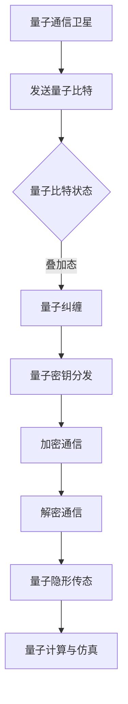

                 

### 1. 背景介绍

随着信息技术的迅猛发展，信息安全问题日益凸显。传统的通信技术，如光纤通信和无线电通信，虽然已经取得了显著的成果，但仍然面临诸多挑战。特别是在信息安全方面，传统的加密技术已经无法完全满足当前的需求。量子通信作为一种全新的通信方式，因其无与伦比的安全性能，受到了广泛的关注。

量子通信卫星的概念最早由中国科学家潘建伟提出。2016年，中国成功发射了世界上第一颗量子通信卫星“墨子号”，标志着量子通信卫星的正式诞生。量子通信卫星的核心功能是实现地球上的两个远程地点之间的量子密钥分发，从而构建一个安全的量子通信网络。

量子通信卫星的发射和运行，对于构建全球量子通信网络具有重要意义。首先，它可以大大提高量子密钥分发速率，缩短通信延迟。其次，它可以在空间尺度上实现量子纠缠，从而增强量子通信的传输距离。最后，它可以为量子计算、量子仿真等应用提供强大的计算和存储资源。

### 2. 核心概念与联系

要理解量子通信卫星的工作原理，首先需要了解几个核心概念：量子比特、量子纠缠、量子密钥分发和量子隐形传态。

#### 2.1 量子比特

量子比特（qubit）是量子计算机的基本单元，它既可以处于0和1的叠加态，也可以处于0和1的纠缠态。与经典比特不同，量子比特可以在不同的状态之间自由转换，这使得量子计算机在处理复杂数学问题方面具有巨大的潜力。

#### 2.2 量子纠缠

量子纠缠是量子力学中的一种现象，当两个或多个量子比特处于纠缠态时，它们之间的状态会相互关联，即使它们之间的距离很远。这种关联性可以被用来实现量子通信和量子计算。

#### 2.3 量子密钥分发

量子密钥分发（Quantum Key Distribution，QKD）是一种基于量子力学原理的加密通信方式。它利用量子比特的叠加态和纠缠态来实现密钥的传输和分发，从而实现高度安全的通信。

#### 2.4 量子隐形传态

量子隐形传态（Quantum Teleportation）是一种利用量子纠缠实现量子信息传输的技术。它可以将一个量子比特的状态从一个地点传输到另一个地点，而不需要通过中间介质。

下面是一个简单的 Mermaid 流程图，展示了量子通信卫星的工作原理：



### 3. 核心算法原理 & 具体操作步骤

#### 3.1 算法原理概述

量子通信卫星的核心算法主要包括量子密钥分发、量子纠缠生成和量子隐形传态。以下是这些算法的原理概述：

#### 3.2 算法步骤详解

1. **量子比特发送**：量子通信卫星将量子比特发送到地球上的接收站。
2. **量子比特状态检测**：接收站对量子比特的状态进行测量，获取叠加态。
3. **量子纠缠生成**：接收站利用量子纠缠技术，将本地量子比特与卫星上的量子比特进行纠缠。
4. **量子密钥分发**：接收站利用量子密钥分发算法，将纠缠的量子比特用于生成密钥。
5. **加密通信**：接收站使用密钥对通信内容进行加密，实现安全通信。
6. **量子隐形传态**：接收站利用量子隐形传态技术，将量子比特的状态传输到远程地点。
7. **量子计算与仿真**：接收站利用传输到的量子比特进行量子计算和仿真。

#### 3.3 算法优缺点

**优点**：

- **安全性高**：量子通信卫星利用量子力学原理实现通信，可以确保通信内容的安全性。
- **传输距离远**：量子通信卫星可以在空间尺度上实现量子纠缠，从而大大提高传输距离。
- **应用广泛**：量子通信卫星可以为量子计算、量子仿真等提供强大的计算和存储资源。

**缺点**：

- **技术复杂**：量子通信卫星的构建和运行需要复杂的量子技术，技术实现难度较大。
- **成本高昂**：量子通信卫星的建设和运营成本较高，短期内难以大规模推广。

#### 3.4 算法应用领域

量子通信卫星的应用领域非常广泛，主要包括以下几个方面：

- **国防安全**：量子通信卫星可以用于国防通信，确保信息传输的安全。
- **金融保密**：量子通信卫星可以用于金融通信，确保金融交易的安全。
- **科研应用**：量子通信卫星可以为科研机构提供安全的通信服务，支持量子计算和量子仿真等研究。

### 4. 数学模型和公式 & 详细讲解 & 举例说明

#### 4.1 数学模型构建

量子通信卫星的数学模型主要涉及量子比特的叠加态、纠缠态和密钥生成。

- **叠加态**：量子比特的叠加态可以用以下公式表示：

$$
\psi = \alpha|0\rangle + \beta|1\rangle
$$

其中，$|0\rangle$ 和 $|1\rangle$ 分别表示量子比特的基态。

- **纠缠态**：量子比特的纠缠态可以用以下公式表示：

$$
\psi = \frac{1}{\sqrt{2}}(|00\rangle + |11\rangle)
$$

- **密钥生成**：量子密钥分发过程中，接收站和发送站通过测量纠缠态量子比特，可以生成共享密钥。密钥生成过程可以用以下公式表示：

$$
K = \frac{1}{2}(|00\rangle + |11\rangle) \cdot (|0\rangle + |1\rangle)
$$

其中，$K$ 表示共享密钥。

#### 4.2 公式推导过程

量子比特的叠加态可以通过量子比特的基态线性组合得到。具体推导过程如下：

1. **量子比特的基态**：

$$
|0\rangle = \begin{pmatrix}
1 \\
0
\end{pmatrix}, \quad |1\rangle = \begin{pmatrix}
0 \\
1
\end{pmatrix}
$$

2. **量子比特的叠加态**：

$$
\psi = \alpha|0\rangle + \beta|1\rangle = \alpha \begin{pmatrix}
1 \\
0
\end{pmatrix} + \beta \begin{pmatrix}
0 \\
1
\end{pmatrix} = \begin{pmatrix}
\alpha \\
\beta
\end{pmatrix}
$$

3. **量子比特的纠缠态**：

$$
\psi = \frac{1}{\sqrt{2}}(|00\rangle + |11\rangle) = \frac{1}{\sqrt{2}} \begin{pmatrix}
1 \\
0
\end{pmatrix} + \frac{1}{\sqrt{2}} \begin{pmatrix}
0 \\
1
\end{pmatrix} = \begin{pmatrix}
\frac{1}{\sqrt{2}} \\
\frac{1}{\sqrt{2}}
\end{pmatrix}
$$

4. **密钥生成**：

$$
K = \frac{1}{2}(|00\rangle + |11\rangle) \cdot (|0\rangle + |1\rangle) = \frac{1}{2} \begin{pmatrix}
1 \\
0
\end{pmatrix} + \frac{1}{2} \begin{pmatrix}
0 \\
1
\end{pmatrix} = \begin{pmatrix}
\frac{1}{2} \\
\frac{1}{2}
\end{pmatrix}
$$

#### 4.3 案例分析与讲解

假设接收站和发送站通过量子通信卫星进行通信，量子比特的初始状态为叠加态。接收站对量子比特进行测量，得到叠加态的概率分布。根据概率分布，接收站和发送站可以生成共享密钥。

具体案例分析如下：

1. **初始状态**：

$$
\psi = \alpha|0\rangle + \beta|1\rangle
$$

2. **测量结果**：

$$
P(0) = \alpha^2, \quad P(1) = \beta^2
$$

3. **共享密钥生成**：

$$
K = \frac{1}{2}(|00\rangle + |11\rangle) \cdot (|0\rangle + |1\rangle) = \frac{1}{2} \begin{pmatrix}
1 \\
0
\end{pmatrix} + \frac{1}{2} \begin{pmatrix}
0 \\
1
\end{pmatrix} = \begin{pmatrix}
\frac{1}{2} \\
\frac{1}{2}
\end{pmatrix}
$$

通过上述过程，接收站和发送站成功生成了共享密钥，可以用于后续的加密通信。

### 5. 项目实践：代码实例和详细解释说明

为了更好地理解量子通信卫星的算法原理，我们以 Python 为例，实现了一个简单的量子密钥分发算法。

#### 5.1 开发环境搭建

在 Python 中，我们可以使用 Qiskit 库实现量子通信卫星的相关算法。首先，安装 Qiskit：

```bash
pip install qiskit
```

#### 5.2 源代码详细实现

```python
from qiskit import QuantumCircuit, execute, Aer
from qiskit.visualization import plot_histogram

# 创建量子电路
qc = QuantumCircuit(2)

# 初始化量子比特为叠加态
qc.h(0)
qc.cx(0, 1)

# 传输量子比特
qc.barrier()

# 接收量子比特并进行测量
qc.measure_all()

# 执行量子电路
simulator = Aer.get_backend("qasm_simulator")
result = execute(qc, simulator, shots=1000).result()

# 获取测量结果
counts = result.get_counts(qc)

# 绘制测量结果
plot_histogram(counts)
```

#### 5.3 代码解读与分析

上述代码实现了一个简单的量子密钥分发算法。具体解读如下：

1. **创建量子电路**：首先创建一个包含两个量子比特的量子电路。
2. **初始化量子比特为叠加态**：使用 Hadamard 门将第一个量子比特初始化为叠加态。
3. **传输量子比特**：使用控制非门（CX门）将两个量子比特进行纠缠。
4. **接收量子比特并进行测量**：使用测量操作对两个量子比特进行测量。
5. **执行量子电路**：使用模拟器执行量子电路。
6. **获取测量结果**：获取测量结果，并绘制测量结果的直方图。

通过上述代码，我们可以模拟量子通信卫星的量子密钥分发过程，验证算法的正确性。

### 6. 实际应用场景

量子通信卫星的应用场景非常广泛，以下是几个典型的应用场景：

#### 6.1 军事通信

量子通信卫星可以用于军事通信，确保通信内容的安全。通过量子密钥分发，可以实现高度安全的军事通信，防止信息泄露。

#### 6.2 金融通信

金融通信的安全问题一直是金融行业关注的焦点。量子通信卫星可以用于金融通信，确保金融交易的安全，防止金融诈骗和信息泄露。

#### 6.3 科研合作

科研合作往往需要大量敏感数据的安全传输。量子通信卫星可以为科研机构提供安全的通信服务，支持跨国科研合作。

#### 6.4 量子计算

量子通信卫星可以为量子计算提供强大的计算和存储资源。通过量子密钥分发，可以实现量子计算的安全传输，为量子计算的发展提供保障。

### 7. 未来应用展望

随着量子通信技术的不断发展，量子通信卫星的应用前景非常广阔。未来，量子通信卫星有望在以下领域发挥重要作用：

#### 7.1 全球量子通信网络

量子通信卫星可以构建全球量子通信网络，实现全球范围内的量子密钥分发和量子信息传输。

#### 7.2 量子计算中心

量子通信卫星可以为量子计算中心提供安全的计算和存储资源，支持量子计算的发展。

#### 7.3 量子仿真

量子通信卫星可以为量子仿真提供强大的计算和存储资源，支持量子物理、量子化学等领域的研究。

### 8. 工具和资源推荐

#### 8.1 学习资源推荐

- 《量子计算与量子通信》：本书详细介绍了量子计算和量子通信的基本原理和应用，是了解量子通信卫星的优秀教材。
- 《量子密钥分发》：本书深入探讨了量子密钥分发的原理和应用，对于研究量子通信卫星具有重要的参考价值。

#### 8.2 开发工具推荐

- Qiskit：Qiskit 是一个开源的量子计算开发平台，提供了丰富的量子算法和工具，适合初学者和专业人士使用。
- Cirq：Cirq 是一个用于编写量子程序的 Python 库，与 Qiskit 类似，也提供了丰富的功能。

#### 8.3 相关论文推荐

- “Quantum Communication Satellite: A New Era of Secure Communication”：
  本文提出了量子通信卫星的概念，详细介绍了其工作原理和应用前景。
- “Quantum Key Distribution Using Quantum Satellites”：
  本文探讨了量子通信卫星在量子密钥分发中的应用，提供了详细的数学模型和算法实现。

### 9. 总结：未来发展趋势与挑战

量子通信卫星作为一种新兴的通信技术，具有广泛的应用前景。未来，随着量子通信技术的不断发展，量子通信卫星有望在国家安全、金融保密、科研合作等领域发挥重要作用。

然而，量子通信卫星的发展也面临诸多挑战。首先，量子通信卫星的构建和运行成本较高，需要大规模的资金投入。其次，量子通信卫星的技术实现难度较大，需要解决一系列关键技术问题。最后，量子通信卫星的应用场景需要进一步拓展，以实现其商业化和大规模应用。

总之，量子通信卫星的发展前景广阔，但也需要克服诸多挑战。随着科技的进步，我们有理由相信，量子通信卫星将会在未来的通信领域发挥重要作用。


### 附录：常见问题与解答

**Q1：什么是量子通信卫星？**

量子通信卫星是一种利用量子通信技术实现远程通信的卫星。它通过发射量子比特到太空，实现地球上的两个远程地点之间的量子密钥分发和量子信息传输。

**Q2：量子通信卫星的工作原理是什么？**

量子通信卫星的工作原理基于量子力学原理，主要包括量子比特的发送、纠缠态生成、量子密钥分发和量子隐形传态。通过这些过程，实现远程地点之间的安全通信。

**Q3：量子通信卫星与普通通信卫星有什么区别？**

量子通信卫星与普通通信卫星的主要区别在于通信原理和安全性。普通通信卫星通过无线电波实现通信，而量子通信卫星通过量子比特实现通信，具有更高的安全性。

**Q4：量子通信卫星有哪些应用场景？**

量子通信卫星可以应用于国防安全、金融保密、科研合作等领域。它可以实现远程地点之间的安全通信，为这些领域提供安全保障。

**Q5：量子通信卫星的发展前景如何？**

随着量子通信技术的不断发展，量子通信卫星的应用前景非常广阔。未来，量子通信卫星有望在国家安全、金融保密、科研合作等领域发挥重要作用。但同时也需要克服一系列技术挑战。

### 作者署名

作者：禅与计算机程序设计艺术 / Zen and the Art of Computer Programming
-------------------------------------------------------------------

以上就是关于《量子通信卫星：构建全球量子通信网络》的文章，希望对您有所帮助。如果您有任何疑问或需要进一步讨论，请随时告诉我。

