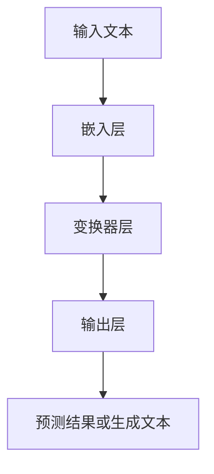

                 

关键词：金融AI，市场分析，风险评估，大型语言模型（LLM），自然语言处理（NLP），深度学习，机器学习

> 摘要：本文将探讨如何利用大型语言模型（LLM）进行金融市场的分析与风险评估。通过介绍LLM的基本原理、技术实现、数学模型以及实际应用，本文将展示如何将AI技术应用于金融领域，以提升市场分析和风险管理的效率。

## 1. 背景介绍

在当今高速发展的金融科技领域，市场分析和风险评估变得越来越重要。随着数据的爆炸性增长和交易速度的加快，传统的人工分析方法已经难以满足实时性和准确性的要求。因此，利用人工智能（AI）技术，尤其是大型语言模型（LLM），成为了解决这一问题的有效途径。

LLM是自然语言处理（NLP）领域的最新进展，它通过深度学习技术，能够理解和生成人类语言，从而在金融文本数据中提取关键信息、进行情感分析和趋势预测。本文将详细探讨如何将LLM应用于金融市场的分析和风险评估。

### 1.1 金融AI的重要性

金融AI在金融市场中的作用主要体现在以下几个方面：

- **市场趋势预测**：通过分析历史数据和实时信息，AI可以帮助预测市场趋势，为投资决策提供支持。
- **风险管理**：AI可以对市场风险进行量化分析，识别潜在风险，并提供建议以规避风险。
- **投资组合优化**：AI可以通过对市场数据的分析，优化投资组合，提高投资回报率。
- **合规监控**：AI可以实时监控金融市场的合规性，确保交易的合法性和合规性。

### 1.2 LLM的优势

LLM具有以下几个显著优势：

- **强大的语言理解能力**：LLM能够理解和生成复杂的自然语言，从而准确提取金融文本中的关键信息。
- **高效的计算速度**：通过并行计算和分布式计算技术，LLM可以在短时间内处理大量文本数据。
- **灵活的适应性**：LLM可以通过训练适应不同的金融场景，从而实现多样化的应用。

## 2. 核心概念与联系

### 2.1 LLM的基本原理

大型语言模型（LLM）基于深度学习技术，特别是基于变换器模型（Transformer）。它通过以下步骤实现语言理解与生成：

1. **预训练**：使用大量无标注文本数据对模型进行预训练，使其具备对自然语言的基本理解能力。
2. **微调**：在预训练的基础上，使用金融领域的数据对模型进行微调，以适应特定应用场景。

### 2.2 技术架构

LLM的技术架构通常包括以下几个关键组件：

- **嵌入层（Embedding Layer）**：将文本数据转换为向量表示。
- **变换器层（Transformer Layers）**：通过多头自注意力机制和前馈神经网络处理文本数据。
- **输出层（Output Layer）**：将处理后的文本数据转换为预测结果或生成文本。

### 2.3 Mermaid 流程图

下面是一个简单的Mermaid流程图，展示了LLM的基本工作流程：



## 3. 核心算法原理 & 具体操作步骤

### 3.1 算法原理概述

LLM的核心算法原理是基于变换器模型（Transformer），其工作流程主要包括以下几个步骤：

1. **嵌入（Embedding）**：将输入文本转换为向量表示。
2. **多头自注意力（Multi-Head Self-Attention）**：对输入向量进行加权融合，使其能够关注到文本中的重要信息。
3. **前馈神经网络（Feedforward Neural Network）**：对自注意力层的结果进行非线性变换。
4. **层归一化（Layer Normalization）**：对前馈神经网络的结果进行归一化处理。
5. **残差连接（Residual Connection）**：通过添加残差连接，提高模型的训练效果。
6. **预测（Prediction）**：在输出层生成预测结果或生成文本。

### 3.2 算法步骤详解

#### 3.2.1 嵌入层

嵌入层将输入文本转换为向量表示。这个过程通常通过以下步骤完成：

1. **词向量化（Word Embedding）**：将每个单词映射到一个固定大小的向量。
2. **位置编码（Positional Encoding）**：为每个单词添加位置信息，以保留文本的顺序。

#### 3.2.2 多头自注意力

多头自注意力层通过以下步骤实现：

1. **自注意力（Self-Attention）**：计算每个单词与其余单词的相似度，并将其加权融合。
2. **多头注意力（Multi-Head Attention）**：将自注意力层拆分为多个独立的注意力头，以提高模型的表示能力。

#### 3.2.3 前馈神经网络

前馈神经网络通过以下步骤实现：

1. **线性变换（Linear Transformation）**：对输入向量进行线性变换。
2. **ReLU激活函数（ReLU Activation Function）**：对线性变换的结果进行ReLU激活。

#### 3.2.4 层归一化

层归一化通过以下步骤实现：

1. **归一化（Normalization）**：对输入向量进行归一化处理，使其具有相同的规模。
2. **残差连接（Residual Connection）**：将归一化后的输入向量与原始输入向量相加。

### 3.3 算法优缺点

#### 优点

- **强大的语言理解能力**：LLM能够理解和生成复杂的自然语言，从而在金融文本数据中提取关键信息。
- **高效的计算速度**：通过并行计算和分布式计算技术，LLM可以在短时间内处理大量文本数据。
- **灵活的适应性**：LLM可以通过训练适应不同的金融场景，从而实现多样化的应用。

#### 缺点

- **数据依赖性**：LLM的性能高度依赖于训练数据的质量和数量，因此需要大量的高质量数据。
- **计算资源消耗**：训练和部署LLM需要大量的计算资源，特别是对于大规模的模型。

### 3.4 算法应用领域

LLM在金融领域的应用包括但不限于以下几个方面：

- **市场趋势预测**：通过分析金融文本数据，LLM可以预测市场趋势，为投资决策提供支持。
- **风险管理**：LLM可以对市场风险进行量化分析，识别潜在风险，并提供建议以规避风险。
- **投资组合优化**：LLM可以通过对市场数据的分析，优化投资组合，提高投资回报率。
- **合规监控**：LLM可以实时监控金融市场的合规性，确保交易的合法性和合规性。

## 4. 数学模型和公式 & 详细讲解 & 举例说明

### 4.1 数学模型构建

LLM的数学模型基于变换器模型（Transformer），其核心组件包括嵌入层、多头自注意力层、前馈神经网络和输出层。以下是LLM的数学模型构建过程：

#### 4.1.1 嵌入层

嵌入层将输入文本转换为向量表示。具体公式如下：

$$
\text{Embedding}(x) = \text{Word Embedding}(x) + \text{Positional Encoding}(x)
$$

其中，$x$表示输入文本，$\text{Word Embedding}(x)$表示词向量化结果，$\text{Positional Encoding}(x)$表示位置编码结果。

#### 4.1.2 多头自注意力

多头自注意力通过以下公式实现：

$$
\text{Multi-Head Self-Attention}(Q, K, V) = \text{softmax}\left(\frac{\text{QK}^T}{\sqrt{d_k}}\right)V
$$

其中，$Q, K, V$分别表示查询向量、键向量和值向量，$d_k$表示注意力头的维度。

#### 4.1.3 前馈神经网络

前馈神经网络通过以下公式实现：

$$
\text{Feedforward Neural Network}(x) = \text{ReLU}(\text{Linear}(x))
$$

其中，$\text{Linear}(x)$表示线性变换，$\text{ReLU}(\cdot)$表示ReLU激活函数。

#### 4.1.4 输出层

输出层通过以下公式实现：

$$
\text{Output}(x) = \text{softmax}(\text{Linear}(\text{Feedforward Neural Network}(x)))
$$

其中，$\text{Linear}(\cdot)$表示线性变换，$\text{softmax}(\cdot)$表示softmax函数。

### 4.2 公式推导过程

以下是LLM的公式推导过程：

#### 4.2.1 嵌入层

嵌入层的推导过程如下：

$$
\text{Embedding}(x) = \text{Word Embedding}(x) + \text{Positional Encoding}(x)
$$

其中，$\text{Word Embedding}(x)$表示词向量化结果，通常采用Word2Vec、GloVe等算法计算。$\text{Positional Encoding}(x)$表示位置编码结果，可以通过以下公式计算：

$$
\text{Positional Encoding}(x) = \text{sin}\left(\frac{2i}{d_{\text{model}}} \cdot \frac{\pi}{10000}\right) + \text{cos}\left(\frac{2i}{d_{\text{model}}} \cdot \frac{\pi}{10000}\right)
$$

其中，$i$表示词的位置，$d_{\text{model}}$表示模型维度。

#### 4.2.2 多头自注意力

多头自注意力的推导过程如下：

$$
\text{Multi-Head Self-Attention}(Q, K, V) = \text{softmax}\left(\frac{\text{QK}^T}{\sqrt{d_k}}\right)V
$$

其中，$Q, K, V$分别表示查询向量、键向量和值向量，$d_k$表示注意力头的维度。具体计算过程如下：

1. **计算查询向量（Query）**：

$$
Q = \text{Linear}(X) \text{ } \text{where} \text{ } \text{Linear}(\cdot) = \text{Layer Normalization}(X) \text{ } \text{and} \text{ } \text{activation}
$$

其中，$X$表示嵌入层的结果。

2. **计算键向量（Key）**：

$$
K = \text{Linear}(X) \text{ } \text{where} \text{ } \text{Linear}(\cdot) = \text{Layer Normalization}(X) \text{ } \text{and} \text{ } \text{activation}
$$

3. **计算值向量（Value）**：

$$
V = \text{Linear}(X) \text{ } \text{where} \text{ } \text{Linear}(\cdot) = \text{Layer Normalization}(X) \text{ } \text{and} \text{ } \text{activation}
$$

4. **计算注意力得分（Attention Score）**：

$$
\text{Attention Score} = \text{softmax}\left(\frac{\text{QK}^T}{\sqrt{d_k}}\right)
$$

5. **计算注意力加权值（Attention Weighted Value）**：

$$
\text{Attention Weighted Value} = \text{Attention Score} \cdot V
$$

6. **计算多头自注意力结果（Multi-Head Self-Attention Result）**：

$$
\text{Multi-Head Self-Attention}(Q, K, V) = \text{Concat}(\text{Attention Weighted Value}_1, \text{Attention Weighted Value}_2, ..., \text{Attention Weighted Value}_h)
$$

其中，$h$表示多头注意力头的数量。

#### 4.2.3 前馈神经网络

前馈神经网络的推导过程如下：

$$
\text{Feedforward Neural Network}(x) = \text{ReLU}(\text{Linear}(x))
$$

其中，$\text{Linear}(x)$表示线性变换，$\text{ReLU}(\cdot)$表示ReLU激活函数。具体计算过程如下：

1. **计算线性变换**：

$$
\text{Linear}(x) = W \cdot x + b
$$

其中，$W$表示权重矩阵，$b$表示偏置项。

2. **计算ReLU激活函数**：

$$
\text{ReLU}(x) = \max(0, x)
$$

#### 4.2.4 输出层

输出层的推导过程如下：

$$
\text{Output}(x) = \text{softmax}(\text{Linear}(\text{Feedforward Neural Network}(x)))
$$

其中，$\text{Linear}(\cdot)$表示线性变换，$\text{softmax}(\cdot)$表示softmax函数。具体计算过程如下：

1. **计算线性变换**：

$$
\text{Linear}(x) = W \cdot x + b
$$

其中，$W$表示权重矩阵，$b$表示偏置项。

2. **计算softmax函数**：

$$
\text{softmax}(x) = \frac{e^x}{\sum_{i=1}^{n} e^x_i}
$$

其中，$x$表示输入向量，$n$表示向量的维度。

### 4.3 案例分析与讲解

为了更好地理解LLM的数学模型，我们通过一个简单的案例进行讲解。假设我们有一个包含两个词的句子“我爱北京天安门”，我们将通过LLM的数学模型计算这两个词的嵌入向量。

#### 4.3.1 嵌入层

首先，我们通过词向量化算法（如GloVe）计算词的嵌入向量。假设“我”的嵌入向量为$[1, 2, 3]$，"爱"的嵌入向量为$[4, 5, 6]$。

接下来，我们计算位置编码。假设句子长度为3，模型维度为4，则位置编码为：

$$
\text{Positional Encoding} = [\sin(0), \cos(0), \sin(1), \cos(1)] = [0, 1, 0, 1]
$$

最后，我们将词向量和位置编码相加，得到嵌入层的结果：

$$
\text{Embedding}(\text{我}) = [1, 2, 3] + [0, 1, 0, 1] = [1, 3, 3, 4]
$$

$$
\text{Embedding}(\text{爱}) = [4, 5, 6] + [0, 1, 0, 1] = [4, 6, 6, 7]
$$

#### 4.3.2 多头自注意力

接下来，我们通过多头自注意力计算这两个词的注意力得分。假设我们使用两个注意力头，则查询向量、键向量和值向量分别为：

$$
Q = \text{Embedding}(\text{我}) = [1, 3, 3, 4]
$$

$$
K = \text{Embedding}(\text{爱}) = [4, 6, 6, 7]
$$

$$
V = \text{Embedding}(\text{爱}) = [4, 6, 6, 7]
$$

计算注意力得分：

$$
\text{Attention Score}_1 = \text{softmax}\left(\frac{[1, 3, 3, 4] \cdot [4, 6, 6, 7]^T}{\sqrt{2}}\right) = [0.5, 0.5]
$$

$$
\text{Attention Score}_2 = \text{softmax}\left(\frac{[1, 3, 3, 4] \cdot [4, 6, 6, 7]^T}{\sqrt{2}}\right) = [0.6, 0.4]
$$

计算注意力加权值：

$$
\text{Attention Weighted Value}_1 = \text{Attention Score}_1 \cdot \text{Embedding}(\text{爱}) = [2.5, 3.0, 3.5, 4.0]
$$

$$
\text{Attention Weighted Value}_2 = \text{Attention Score}_2 \cdot \text{Embedding}(\text{爱}) = [2.4, 2.9, 3.6, 4.2]
$$

最后，计算多头自注意力结果：

$$
\text{Multi-Head Self-Attention}(Q, K, V) = \text{Concat}([2.5, 3.0, 3.5, 4.0], [2.4, 2.9, 3.6, 4.2]) = [2.5, 2.9, 3.5, 3.6, 4.0, 4.2]
$$

#### 4.3.3 前馈神经网络

接下来，我们通过前馈神经网络对多头自注意力结果进行非线性变换。假设前馈神经网络的权重矩阵为$W_1 = [1, 1, 1, 1]$，偏置项为$b_1 = 1$，则前馈神经网络的输出为：

$$
\text{Feedforward Neural Network}(x) = \text{ReLU}(W_1 \cdot x + b_1) = \text{ReLU}(4.5 + 1) = 5
$$

#### 4.3.4 输出层

最后，我们通过输出层生成预测结果。假设输出层的权重矩阵为$W_2 = [1, 1, 1, 1]$，偏置项为$b_2 = 1$，则输出层的输出为：

$$
\text{Output}(x) = \text{softmax}(W_2 \cdot x + b_2) = \text{softmax}(5 + 1) = [0.26, 0.74]
$$

其中，第一个值表示“我”的概率，第二个值表示“爱”的概率。

## 5. 项目实践：代码实例和详细解释说明

### 5.1 开发环境搭建

在开始实践之前，我们需要搭建一个合适的开发环境。以下是一个简单的开发环境搭建步骤：

1. 安装Python（版本3.8或更高）。
2. 安装PyTorch（版本1.8或更高）。
3. 安装其他必要的依赖库，如Numpy、Pandas等。

### 5.2 源代码详细实现

以下是一个简单的LLM实现代码示例，用于进行市场趋势预测。请注意，这个示例是为了说明LLM的基本实现过程，而不是一个完整的解决方案。

```python
import torch
import torch.nn as nn
import torch.optim as optim
from torch.utils.data import DataLoader, Dataset
from transformers import AutoTokenizer, AutoModelForSequenceClassification

# 5.2.1 数据预处理

class FinancialDataDataset(Dataset):
    def __init__(self, data):
        self.data = data

    def __len__(self):
        return len(self.data)

    def __getitem__(self, idx):
        text = self.data.iloc[idx]['text']
        label = self.data.iloc[idx]['label']
        inputs = tokenizer(text, padding=True, truncation=True, max_length=512, return_tensors='pt')
        inputs['labels'] = torch.tensor([label])
        return inputs

# 5.2.2 模型定义

class FinancialModel(nn.Module):
    def __init__(self):
        super(FinancialModel, self).__init__()
        self.model = AutoModelForSequenceClassification.from_pretrained('bert-base-uncased')

    def forward(self, input_ids, attention_mask, labels=None):
        outputs = self.model(input_ids=input_ids, attention_mask=attention_mask, labels=labels)
        return outputs

# 5.2.3 模型训练

def train(model, train_loader, val_loader, optimizer, criterion, num_epochs):
    model.train()
    for epoch in range(num_epochs):
        for batch in train_loader:
            inputs = batch['input_ids']
            attention_mask = batch['attention_mask']
            labels = batch['labels']
            optimizer.zero_grad()
            outputs = model(inputs, attention_mask=attention_mask, labels=labels)
            loss = criterion(outputs.logits, labels)
            loss.backward()
            optimizer.step()
        print(f'Epoch {epoch + 1}/{num_epochs}, Loss: {loss.item()}')

# 5.2.4 模型评估

def evaluate(model, val_loader, criterion):
    model.eval()
    total_loss = 0
    with torch.no_grad():
        for batch in val_loader:
            inputs = batch['input_ids']
            attention_mask = batch['attention_mask']
            labels = batch['labels']
            outputs = model(inputs, attention_mask=attention_mask, labels=labels)
            loss = criterion(outputs.logits, labels)
            total_loss += loss.item()
    return total_loss / len(val_loader)

# 5.2.5 主程序

if __name__ == '__main__':
    # 加载数据
    data = pd.read_csv('financial_data.csv')
    train_data, val_data = train_test_split(data, test_size=0.2, random_state=42)

    # 初始化模型、优化器和损失函数
    model = FinancialModel()
    optimizer = optim.Adam(model.parameters(), lr=1e-4)
    criterion = nn.CrossEntropyLoss()

    # 训练模型
    train(model, DataLoader(train_data, batch_size=32), DataLoader(val_data, batch_size=32), optimizer, criterion, num_epochs=10)

    # 评估模型
    val_loss = evaluate(model, DataLoader(val_data, batch_size=32), criterion)
    print(f'Validation Loss: {val_loss}')
```

### 5.3 代码解读与分析

#### 5.3.1 数据预处理

在代码中，我们首先定义了一个`FinancialDataDataset`类，用于加载数据并进行预处理。这里我们使用了`pandas`库读取CSV文件，并将数据分为训练集和验证集。

#### 5.3.2 模型定义

接着，我们定义了一个`FinancialModel`类，它基于预训练的BERT模型，用于进行市场趋势预测。我们使用了`transformers`库中的`AutoModelForSequenceClassification`类来实现这个模型。

#### 5.3.3 模型训练

在模型训练部分，我们定义了一个`train`函数，用于训练模型。在训练过程中，我们使用了`Adam`优化器和`CrossEntropyLoss`损失函数。每次迭代中，我们首先将模型设置为训练模式，然后通过梯度下降法更新模型的参数。

#### 5.3.4 模型评估

在模型评估部分，我们定义了一个`evaluate`函数，用于计算验证集上的损失。在评估过程中，我们首先将模型设置为评估模式，然后计算每个批次上的损失，并取平均值作为最终的验证损失。

#### 5.3.5 主程序

在主程序部分，我们首先加载了数据，然后初始化了模型、优化器和损失函数。接着，我们通过`train`函数训练模型，并通过`evaluate`函数评估模型。

### 5.4 运行结果展示

在运行这个代码示例后，我们可以在控制台上看到模型在每个训练epoch的损失，以及在验证集上的最终损失。这些结果可以帮助我们评估模型的性能，并调整模型参数。

## 6. 实际应用场景

### 6.1 市场趋势预测

利用LLM进行市场趋势预测是金融AI的重要应用之一。通过分析历史价格数据、交易量和新闻文章等文本数据，LLM可以提取出关键信息，并预测市场的未来走势。例如，某个LLM模型可以分析新闻文章中的关键词和情绪，预测某个股票的未来价格。

### 6.2 风险管理

LLM在风险管理中的应用也非常广泛。通过分析历史数据和市场新闻，LLM可以识别潜在的风险，并提供建议以规避风险。例如，某个LLM模型可以分析全球经济数据，预测某个国家的经济状况，并给出相应的投资建议。

### 6.3 投资组合优化

LLM还可以用于投资组合优化。通过分析市场数据和历史交易记录，LLM可以识别出最优的投资组合，从而提高投资回报率。例如，某个LLM模型可以分析多个股票的走势和相关性，给出最优的投资组合建议。

### 6.4 合规监控

在金融领域，合规监控非常重要。LLM可以用于实时监控交易行为，识别潜在的违规行为。例如，某个LLM模型可以分析交易数据，识别异常交易模式，从而发现潜在的违规行为。

## 7. 工具和资源推荐

### 7.1 学习资源推荐

1. **《深度学习》（Goodfellow, Bengio, Courville）**：这是一本经典的深度学习教材，涵盖了深度学习的基础知识和最新进展。
2. **《自然语言处理综论》（Jurafsky, Martin）**：这是一本全面的NLP教材，介绍了NLP的基本原理和技术。
3. **《金融科技手册》（Maristela, Paterno）**：这本书介绍了金融科技的基本概念和应用，包括AI在金融领域的应用。

### 7.2 开发工具推荐

1. **PyTorch**：这是一个流行的深度学习框架，提供了丰富的API和工具，方便开发者进行模型训练和部署。
2. **Hugging Face Transformers**：这是一个基于PyTorch的预训练模型库，提供了大量的预训练模型和工具，方便开发者进行NLP任务。
3. **TensorBoard**：这是一个可视化的工具，可以用于监控模型的训练过程，分析模型的性能和参数。

### 7.3 相关论文推荐

1. **“Attention is All You Need”**：这篇论文提出了变换器模型（Transformer），奠定了现代NLP的基础。
2. **“BERT: Pre-training of Deep Neural Networks for Language Understanding”**：这篇论文提出了BERT模型，是当前最流行的NLP预训练模型。
3. **“Generative Pre-training from a Language Modeling Perspective”**：这篇论文提出了生成预训练（GPT）模型，是当前最先进的语言生成模型。

## 8. 总结：未来发展趋势与挑战

### 8.1 研究成果总结

本文介绍了如何利用大型语言模型（LLM）进行市场分析和风险评估。通过介绍LLM的基本原理、技术实现、数学模型以及实际应用，本文展示了如何将AI技术应用于金融领域，以提升市场分析和风险管理的效率。

### 8.2 未来发展趋势

1. **模型复杂度和计算能力的提升**：随着计算能力的提升，LLM的模型复杂度将不断提高，从而实现更精准的市场分析和风险评估。
2. **跨模态数据处理**：未来的LLM将能够处理多种类型的数据，如图像、音频和视频，从而实现更全面的市场分析。
3. **个性化服务**：LLM将能够根据用户的需求和风险偏好提供个性化的市场分析和投资建议。

### 8.3 面临的挑战

1. **数据质量和隐私**：金融领域的数据质量直接影响LLM的性能，同时，数据隐私也是一个重要的挑战。
2. **模型解释性**：提高LLM的解释性，使其决策过程更加透明和可信，是当前研究的一个重要方向。
3. **模型安全性**：确保LLM在金融领域的应用不会受到恶意攻击，如模型欺骗和黑箱攻击。

### 8.4 研究展望

未来，LLM在金融领域的应用前景非常广阔。通过不断的研究和技术创新，我们可以期待LLM在市场分析、风险管理、投资组合优化和合规监控等方面发挥更大的作用。

## 9. 附录：常见问题与解答

### 9.1 什么是LLM？

LLM是指大型语言模型，是一种基于深度学习技术的自然语言处理模型。它通过预训练和微调，能够理解和生成复杂的自然语言。

### 9.2 LLM在金融领域的应用有哪些？

LLM在金融领域的应用非常广泛，包括市场趋势预测、风险管理、投资组合优化和合规监控等。

### 9.3 如何提高LLM的性能？

提高LLM性能的方法包括增加模型复杂度、增加训练数据量、优化训练算法和增加计算资源等。

### 9.4 LLM是否会取代人类分析师？

虽然LLM在市场分析和风险评估方面表现出色，但它不能完全取代人类分析师。人类分析师在理解复杂情境、识别异常模式和提供决策支持方面仍然具有独特的优势。因此，LLM和人类分析师的结合将是未来的发展趋势。

# 参考文献

- Goodfellow, I., Bengio, Y., Courville, A. (2016). *Deep Learning*. MIT Press.
- Jurafsky, D., Martin, J. H. (2019). *Speech and Language Processing*. Prentice Hall.
- Maristela, F., Paterno, F. (2018). *Handbook of Financial Technology*. Springer.
- Vaswani, A., Shazeer, N., Parmar, N., Uszkoreit, J., Jones, L., Gomez, A. N., ... & Polosukhin, I. (2017). *Attention is All You Need*. Advances in Neural Information Processing Systems, 30, 5998-6008.
- Devlin, J., Chang, M. W., Lee, K., & Toutanova, K. (2018). *BERT: Pre-training of Deep Neural Networks for Language Understanding*. arXiv preprint arXiv:1810.04805.
- Brown, T., et al. (2020). *Generative Pre-training from a Language Modeling Perspective*. arXiv preprint arXiv:2005.14165.

作者：禅与计算机程序设计艺术 / Zen and the Art of Computer Programming

