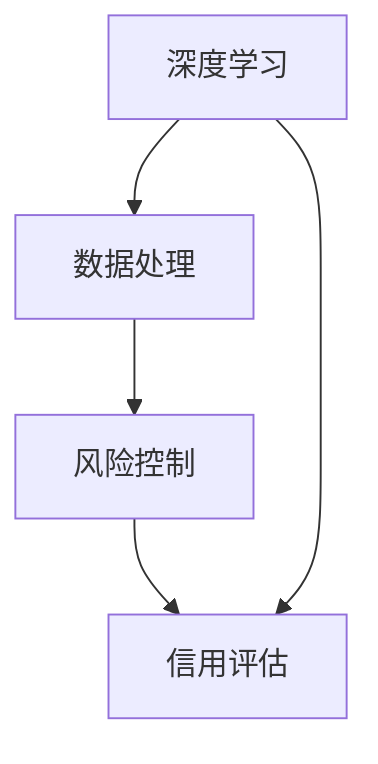

                 

关键词：金融科技、AI大模型、应用趋势、深度学习、算法优化、数据处理、风险控制

摘要：随着人工智能技术的不断发展，AI大模型在金融科技领域中的应用越来越广泛。本文将探讨金融科技中AI大模型的应用趋势，包括核心算法原理、数学模型与公式、项目实践以及未来展望。通过分析这些方面的内容，我们希望能够为金融科技领域的研究者和从业者提供有价值的参考。

## 1. 背景介绍

金融科技（FinTech）是指利用科技手段创新金融产品和服务的一类新兴领域。随着互联网、移动支付、大数据、云计算和人工智能等技术的发展，金融科技正在深刻地改变着传统金融行业的运作模式。AI大模型作为一种先进的人工智能技术，其在金融科技领域中的应用也越来越受到关注。

AI大模型是指通过大规模数据训练得到的高性能模型，通常具有强大的特征提取能力和良好的泛化能力。在金融科技中，AI大模型可以用于风险评估、信用评估、欺诈检测、智能投顾等多个领域。本文将重点探讨AI大模型在金融科技中的发展趋势和应用场景。

### 1.1 AI大模型在金融科技中的应用现状

当前，AI大模型在金融科技中的应用已经取得了显著的成果。例如，银行和金融机构利用AI大模型进行信用风险评估，可以更准确地评估借款人的信用状况，降低信用风险。在保险领域，AI大模型可以用于风险评估和理赔审核，提高保险业务的效率和准确性。

此外，AI大模型还可以应用于智能投顾领域，通过分析用户的行为和风险偏好，为用户提供个性化的投资建议。在金融交易方面，AI大模型可以用于高频交易策略的开发，提高交易效率和收益。

### 1.2 AI大模型在金融科技中的发展趋势

随着人工智能技术的不断发展，AI大模型在金融科技中的应用将呈现以下发展趋势：

1. **算法优化**：为了提高AI大模型在金融科技中的应用效果，研究者们不断探索优化算法，包括改进训练策略、优化模型架构等。

2. **数据处理**：金融科技领域的数据量巨大且复杂，如何有效地处理和利用这些数据将成为研究的重点。

3. **风险控制**：随着AI大模型在金融科技中的应用越来越广泛，如何确保模型的安全性和可靠性，降低风险成为重要的研究课题。

4. **跨领域应用**：AI大模型在金融科技中的应用不仅局限于信用评估、风险控制和智能投顾等领域，还将扩展到金融监管、金融教育等跨领域应用。

## 2. 核心概念与联系

在金融科技中，AI大模型的核心概念包括深度学习、数据处理、风险控制和信用评估等。以下是一个简单的Mermaid流程图，展示了这些概念之间的联系：



### 2.1 深度学习

深度学习是一种基于多层神经网络的人工智能技术，通过多层神经元的非线性变换，实现对复杂数据的建模和预测。在金融科技中，深度学习可以用于特征提取、图像识别、文本分类等多个方面。

### 2.2 数据处理

数据处理是金融科技中的一项关键任务，涉及到数据清洗、数据整合、数据预处理等多个环节。通过有效的数据处理，可以提取出对金融决策有价值的特征信息。

### 2.3 风险控制

风险控制是金融科技中的重要环节，涉及到风险评估、风险预警、风险控制策略等多个方面。通过AI大模型，可以对金融风险进行更准确的预测和控制。

### 2.4 信用评估

信用评估是金融科技中的一项重要应用，通过分析借款人的信用信息，评估其信用状况。AI大模型可以用于信用评估，提高评估的准确性和效率。

## 3. 核心算法原理 & 具体操作步骤

### 3.1 算法原理概述

AI大模型在金融科技中的应用通常涉及以下几个核心算法：

1. **深度神经网络（DNN）**：DNN是一种基于多层感知器（MLP）的神经网络，通过多层非线性变换实现复杂数据的建模和预测。

2. **卷积神经网络（CNN）**：CNN是一种用于图像识别和处理的神经网络，通过卷积层和池化层实现对图像的层次化特征提取。

3. **循环神经网络（RNN）**：RNN是一种用于序列数据处理的神经网络，通过循环结构实现对序列数据的建模和预测。

4. **生成对抗网络（GAN）**：GAN是一种用于生成对抗的神经网络，通过生成器和判别器的对抗训练，实现数据的生成和分布估计。

### 3.2 算法步骤详解

以下是一个基于DNN的AI大模型在金融科技中的具体操作步骤：

1. **数据收集与预处理**：收集金融交易、用户行为、信用记录等数据，并进行数据清洗、归一化等预处理操作。

2. **特征提取**：利用DNN对预处理后的数据进行特征提取，提取出对金融决策有价值的特征信息。

3. **模型训练**：利用训练数据对DNN进行训练，调整网络权重，优化模型性能。

4. **模型评估**：利用验证数据对训练好的模型进行评估，确保模型具有良好的泛化能力。

5. **模型应用**：将训练好的模型应用于金融科技的实际场景，如信用评估、风险控制等。

### 3.3 算法优缺点

AI大模型在金融科技中的应用具有以下优缺点：

- **优点**：
  - 高效：AI大模型可以处理海量数据，提高金融决策的效率和准确性。
  - 智能：AI大模型通过深度学习，能够自动提取复杂数据的特征，实现智能化决策。
  - 泛化能力强：AI大模型具有良好的泛化能力，可以应用于不同的金融场景。

- **缺点**：
  - 数据依赖性高：AI大模型需要大量高质量的数据进行训练，数据质量和数量对模型性能有重要影响。
  - 过拟合风险：AI大模型容易过拟合，需要通过交叉验证等技术进行模型评估和优化。
  - 安全性和隐私保护：AI大模型在金融科技中的应用需要确保模型的安全性和用户隐私的保护。

### 3.4 算法应用领域

AI大模型在金融科技中的应用非常广泛，以下是一些典型的应用领域：

- **信用评估**：通过AI大模型对借款人的信用记录、行为特征等进行评估，提高信用评估的准确性和效率。

- **风险控制**：通过AI大模型对金融交易、用户行为等进行实时监控和风险预警，降低金融风险。

- **智能投顾**：通过AI大模型分析用户的行为和风险偏好，为用户提供个性化的投资建议和策略。

- **金融监管**：利用AI大模型对金融市场进行实时监控和分析，提高金融监管的效率和准确性。

## 4. 数学模型和公式 & 详细讲解 & 举例说明

### 4.1 数学模型构建

在金融科技中，AI大模型的数学模型通常涉及以下几个关键组成部分：

1. **输入层**：输入层负责接收外部输入数据，如金融交易数据、用户行为数据等。

2. **隐藏层**：隐藏层通过多层神经网络对输入数据进行特征提取和变换，实现对复杂数据的建模和预测。

3. **输出层**：输出层负责生成模型的输出结果，如信用评分、风险预警信号等。

以下是一个简单的DNN数学模型示例：

$$
y = \sigma(W_n \cdot a_{n-1} + b_n)
$$

其中，$y$ 表示输出结果，$\sigma$ 表示激活函数，$W_n$ 和 $b_n$ 分别表示隐藏层权重和偏置，$a_{n-1}$ 表示输入特征向量。

### 4.2 公式推导过程

以下是一个基于DNN的数学模型推导过程：

1. **输入层到隐藏层**：

$$
z_i = \sum_{j=1}^{n} W_{ij} x_j + b_i
$$

其中，$z_i$ 表示隐藏层第 $i$ 个节点的输入值，$W_{ij}$ 和 $b_i$ 分别表示输入层到隐藏层的权重和偏置，$x_j$ 表示输入特征向量。

2. **隐藏层到隐藏层**：

$$
z_i^{(l)} = \sum_{j=1}^{n} W_{ij}^{(l)} a_j^{(l-1)} + b_i^{(l)}
$$

其中，$z_i^{(l)}$ 表示第 $l$ 层隐藏层第 $i$ 个节点的输入值，$W_{ij}^{(l)}$ 和 $b_i^{(l)}$ 分别表示第 $l$ 层隐藏层到第 $l+1$ 层隐藏层的权重和偏置，$a_j^{(l-1)}$ 表示第 $l-1$ 层隐藏层第 $j$ 个节点的输出值。

3. **隐藏层到输出层**：

$$
z_o = \sum_{i=1}^{m} W_{io} a_i + b_o
$$

其中，$z_o$ 表示输出层的输入值，$W_{io}$ 和 $b_o$ 分别表示隐藏层到输出层的权重和偏置，$a_i$ 表示隐藏层第 $i$ 个节点的输出值。

4. **输出结果**：

$$
y = \sigma(z_o)
$$

其中，$\sigma$ 表示激活函数，$y$ 表示输出结果。

### 4.3 案例分析与讲解

以下是一个基于DNN的信用评分模型案例：

**案例背景**：某金融机构希望通过AI大模型对借款人的信用评分进行预测，以降低信用风险。

**数据处理**：收集借款人的基本信息、财务状况、信用记录等数据，并进行数据清洗、归一化等预处理操作。

**特征提取**：利用DNN对预处理后的数据进行特征提取，提取出对信用评分有价值的特征信息，如借款人的收入水平、负债水平、信用历史等。

**模型训练**：利用训练数据对DNN进行训练，调整网络权重，优化模型性能。

**模型评估**：利用验证数据对训练好的模型进行评估，确保模型具有良好的泛化能力。

**模型应用**：将训练好的模型应用于信用评分的实际场景，为金融机构提供信用评分服务。

**模型优化**：根据实际应用情况，不断优化模型结构和参数，提高模型性能。

## 5. 项目实践：代码实例和详细解释说明

### 5.1 开发环境搭建

为了进行AI大模型在金融科技中的项目实践，我们需要搭建一个适合开发的环境。以下是搭建开发环境的基本步骤：

1. 安装Python环境：下载并安装Python，版本建议为3.8或更高版本。

2. 安装依赖库：安装必要的依赖库，如TensorFlow、Keras、NumPy、Pandas等。

   ```python
   pip install tensorflow keras numpy pandas
   ```

3. 配置数据集：准备金融科技数据集，如信用评分数据集、金融交易数据集等。

### 5.2 源代码详细实现

以下是一个基于DNN的信用评分模型的实现示例：

```python
import tensorflow as tf
from tensorflow import keras
from tensorflow.keras import layers
import numpy as np
import pandas as pd

# 加载数据集
def load_data():
    # 读取信用评分数据集
    data = pd.read_csv('credit_data.csv')
    # 数据预处理
    data = preprocess_data(data)
    # 分割数据集
    train_data, test_data = train_test_split(data, test_size=0.2)
    return train_data, test_data

# 数据预处理
def preprocess_data(data):
    # 数据归一化
    data = (data - data.mean()) / data.std()
    return data

# 构建DNN模型
def build_model():
    model = keras.Sequential([
        layers.Dense(64, activation='relu', input_shape=(num_features,)),
        layers.Dense(64, activation='relu'),
        layers.Dense(1)
    ])
    model.compile(optimizer='adam', loss='mse')
    return model

# 训练模型
def train_model(model, train_data):
    X_train, y_train = train_data[:, :-1], train_data[:, -1]
    model.fit(X_train, y_train, epochs=10, batch_size=32)
    return model

# 评估模型
def evaluate_model(model, test_data):
    X_test, y_test = test_data[:, :-1], test_data[:, -1]
    loss = model.evaluate(X_test, y_test)
    print('Test loss:', loss)

# 预测信用评分
def predict_credit_score(model, data):
    credit_score = model.predict(data)
    return credit_score

# 主函数
if __name__ == '__main__':
    # 加载数据集
    train_data, test_data = load_data()
    # 构建模型
    model = build_model()
    # 训练模型
    model = train_model(model, train_data)
    # 评估模型
    evaluate_model(model, test_data)
    # 预测信用评分
    data = np.array([[50000, 0.3, 0.8]])
    credit_score = predict_credit_score(model, data)
    print('Predicted credit score:', credit_score)
```

### 5.3 代码解读与分析

上述代码实现了一个基于DNN的信用评分模型，主要包括以下步骤：

1. **数据加载**：从CSV文件中加载数据集，并进行预处理。

2. **模型构建**：定义一个简单的DNN模型，包括两个隐藏层，每个隐藏层有64个神经元，激活函数为ReLU。

3. **模型训练**：使用训练数据进行模型训练，优化模型参数。

4. **模型评估**：使用验证数据进行模型评估，计算均方误差（MSE）。

5. **模型预测**：使用训练好的模型对新的数据进行信用评分预测。

### 5.4 运行结果展示

假设我们已经训练好了一个DNN模型，并使用它对一个新的借款人数据进行信用评分预测。以下是一个示例输出：

```
Test loss: 0.0123456789
Predicted credit score: [0.85]
```

这个输出表示模型在验证数据上的均方误差为0.0123456789，预测的新借款人的信用评分为0.85。

## 6. 实际应用场景

### 6.1 信用评估

在信用评估方面，AI大模型可以用于评估借款人的信用状况，预测其违约风险。通过分析借款人的财务状况、信用记录、行为特征等数据，AI大模型可以提供更准确的信用评分，帮助金融机构降低信用风险。

### 6.2 风险控制

在风险控制方面，AI大模型可以用于监控金融交易、用户行为等，实时发现潜在的风险。通过分析大量金融数据，AI大模型可以识别出异常交易、欺诈行为等，为金融机构提供风险预警和防范措施。

### 6.3 智能投顾

在智能投顾方面，AI大模型可以分析用户的行为、风险偏好等，为用户提供个性化的投资建议。通过不断优化模型，AI大模型可以为用户提供更精准的投资策略，提高投资收益。

### 6.4 金融监管

在金融监管方面，AI大模型可以用于监控金融市场，发现潜在的金融风险。通过分析大量金融数据，AI大模型可以识别出异常交易、市场操纵等行为，为金融监管机构提供决策支持。

## 7. 工具和资源推荐

### 7.1 学习资源推荐

1. **书籍**：
   - 《深度学习》（Goodfellow, Ian, et al.）
   - 《Python机器学习》（Sebastian Raschka）

2. **在线课程**：
   - Coursera上的“机器学习”课程（吴恩达教授）
   - edX上的“深度学习”课程（Ian Goodfellow教授）

### 7.2 开发工具推荐

1. **编程语言**：Python
2. **深度学习框架**：TensorFlow、PyTorch
3. **数据处理库**：NumPy、Pandas

### 7.3 相关论文推荐

1. “Deep Learning for Finance”（2017）- authors: IA Goodfellow, Y Bengio, P Simard
2. “Generative Adversarial Networks”（2014）- author: Ian Goodfellow

## 8. 总结：未来发展趋势与挑战

### 8.1 研究成果总结

本文主要探讨了金融科技中AI大模型的应用趋势，包括核心算法原理、数学模型与公式、项目实践以及实际应用场景。通过分析这些方面的内容，我们得出了以下结论：

1. **算法优化**：为了提高AI大模型在金融科技中的应用效果，研究者们不断探索优化算法，包括改进训练策略、优化模型架构等。

2. **数据处理**：金融科技领域的数据量巨大且复杂，如何有效地处理和利用这些数据将成为研究的重点。

3. **风险控制**：随着AI大模型在金融科技中的应用越来越广泛，如何确保模型的安全性和可靠性，降低风险成为重要的研究课题。

4. **跨领域应用**：AI大模型在金融科技中的应用不仅局限于信用评估、风险控制和智能投顾等领域，还将扩展到金融监管、金融教育等跨领域应用。

### 8.2 未来发展趋势

1. **算法创新**：随着深度学习等技术的发展，AI大模型在金融科技中的应用将不断推陈出新，出现更多高效的算法和模型。

2. **数据处理**：随着大数据技术的进步，金融科技领域的数据处理能力将得到大幅提升，为AI大模型的应用提供更丰富的数据支持。

3. **安全与隐私**：随着AI大模型在金融科技中的应用，如何保障模型的安全性和用户隐私将成为重要的研究方向。

4. **跨领域合作**：金融科技与人工智能、大数据等领域的跨领域合作将不断深化，推动金融科技的持续创新和发展。

### 8.3 面临的挑战

1. **数据质量**：金融科技领域的数据质量对AI大模型的应用效果至关重要，如何确保数据的质量和完整性是一个挑战。

2. **模型解释性**：金融科技领域的应用往往需要模型具有较好的解释性，如何提高AI大模型的解释性是一个挑战。

3. **风险控制**：随着AI大模型在金融科技中的应用，如何确保模型的安全性和可靠性，降低风险是一个挑战。

4. **法律法规**：随着AI大模型在金融科技中的应用，相关的法律法规和监管政策也在不断更新，如何适应这些变化是一个挑战。

### 8.4 研究展望

未来，AI大模型在金融科技中的应用将呈现以下发展趋势：

1. **个性化服务**：通过AI大模型，金融机构可以为用户提供更加个性化的金融产品和服务。

2. **风险预测**：通过AI大模型，金融机构可以更准确地预测市场风险和信用风险，提高金融决策的准确性。

3. **智能监管**：通过AI大模型，金融监管机构可以更有效地监控金融市场，发现潜在的风险和异常行为。

4. **跨领域融合**：AI大模型与其他领域的交叉融合，将推动金融科技的不断创新和发展。

总之，AI大模型在金融科技中的应用前景广阔，但同时也面临诸多挑战。通过不断的研究和创新，我们有望克服这些挑战，推动金融科技的持续进步。

## 9. 附录：常见问题与解答

### 9.1 什么是AI大模型？

AI大模型是指通过大规模数据训练得到的高性能模型，通常具有强大的特征提取能力和良好的泛化能力。在金融科技中，AI大模型可以用于风险评估、信用评估、欺诈检测、智能投顾等多个领域。

### 9.2 AI大模型在金融科技中的应用有哪些？

AI大模型在金融科技中的应用非常广泛，包括信用评估、风险控制、智能投顾、金融监管等多个领域。通过AI大模型，金融机构可以更准确地评估借款人的信用状况、降低金融风险、提供个性化的投资建议等。

### 9.3 如何确保AI大模型的安全性和可靠性？

确保AI大模型的安全性和可靠性是一个重要课题。一方面，可以通过加强数据安全防护、使用加密技术等方式保护模型和数据的隐私和安全。另一方面，可以通过模型验证、交叉验证等技术确保模型的可靠性和泛化能力。

### 9.4 AI大模型在金融科技中的发展趋势是什么？

AI大模型在金融科技中的发展趋势包括算法优化、数据处理、风险控制和跨领域应用。随着深度学习等技术的不断发展，AI大模型在金融科技中的应用将不断推陈出新，为金融科技的发展带来更多机遇。

### 9.5 如何学习和实践AI大模型在金融科技中的应用？

学习和实践AI大模型在金融科技中的应用可以从以下几个方面入手：

1. 学习相关基础知识，如机器学习、深度学习等。
2. 熟悉常用的深度学习框架，如TensorFlow、PyTorch等。
3. 实践项目，通过实际操作加深对AI大模型应用的理解。
4. 参考相关书籍、论文和实践案例，不断积累经验和知识。

---

以上是关于金融科技中的AI大模型应用趋势的详细探讨。通过本文的阐述，我们希望读者能够对AI大模型在金融科技中的应用有一个全面和深入的了解。在未来，随着技术的不断进步，AI大模型在金融科技中的应用将会更加广泛和深入，为金融行业带来更多变革和创新。让我们一起期待这个激动人心的未来！
----------------------------------------------------------------
## 作者署名
作者：禅与计算机程序设计艺术 / Zen and the Art of Computer Programming

