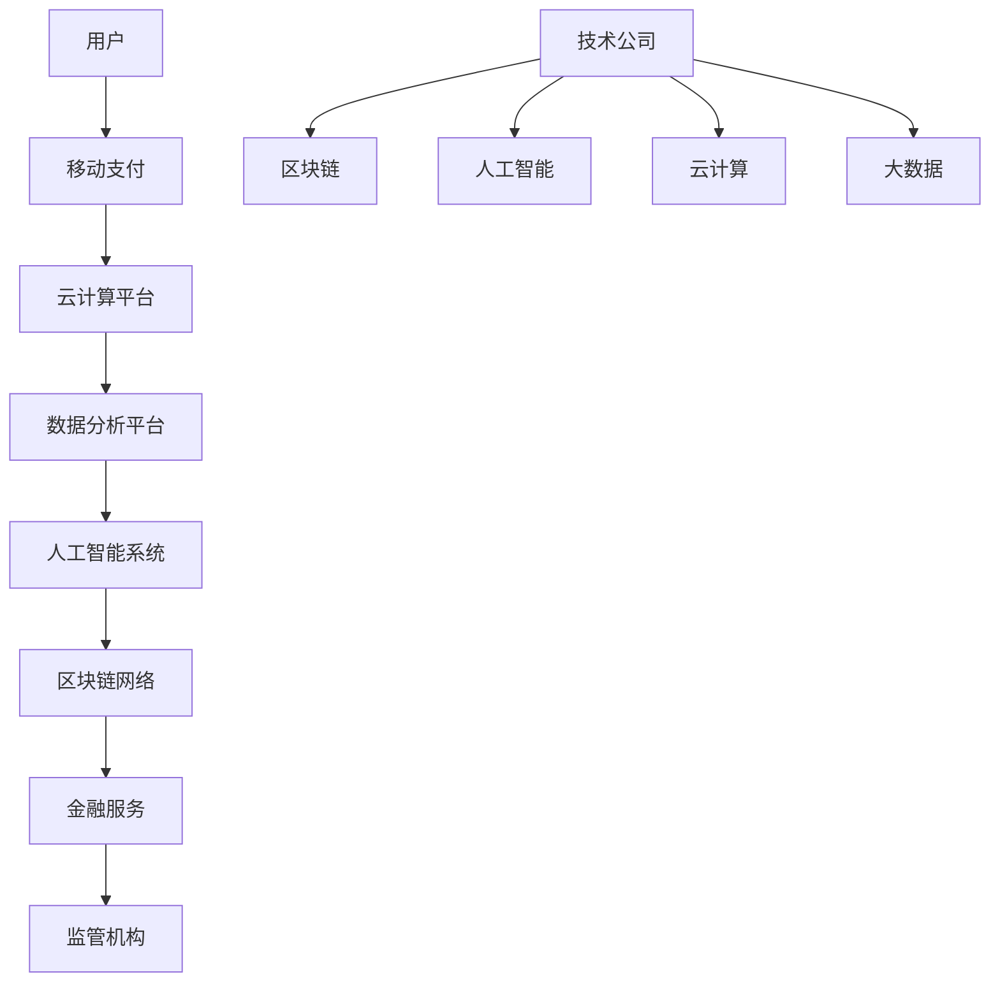

                 

关键词：金融科技、创业、区块链、人工智能、数据隐私、云计算、数字化转型

> 摘要：本文深入探讨了金融科技创业领域的前沿动态，分析了区块链、人工智能、云计算等技术在金融服务中的应用，以及如何在新兴市场中抓住机遇，重构金融服务的未来。本文旨在为创业者提供有价值的指导，帮助他们在这片广阔的蓝海中乘风破浪。

## 1. 背景介绍

### 金融科技的发展历程

金融科技（FinTech）一词最早在2006年由英国《金融时报》提出，指的是利用技术手段革新传统金融服务的方式。自那时以来，金融科技经历了多个阶段的发展。

- **早期阶段（2006-2010年）**：金融科技主要关注互联网支付和移动支付等领域的创新。这一阶段的代表性事件包括PayPal的兴起和Square的成立。
- **发展阶段（2011-2015年）**：金融科技开始涉足众筹、在线贷款、虚拟货币等领域。P2P借贷平台和比特币等新概念引发了广泛关注。
- **成熟阶段（2016年至今）**：金融科技逐渐成为金融行业的核心竞争力，区块链、人工智能等新兴技术开始广泛应用。众多传统金融机构也开始积极拥抱金融科技，推动行业的数字化转型。

### 金融科技的定义

金融科技是指利用计算机技术、移动通信技术、互联网技术等现代信息技术，创新金融服务模式和产品，提高金融效率和用户体验的一种新兴业态。它涵盖了支付、借贷、投资、保险、财富管理等多个领域。

### 金融科技创业的机遇

金融科技创业的机遇在于：

- **技术突破**：区块链、人工智能、大数据等新兴技术的不断突破，为金融创新提供了新的可能性。
- **市场需求**：随着金融需求的多样化和个性化，金融科技产品能够更好地满足用户需求，具有广阔的市场空间。
- **监管环境**：全球各国政府逐渐认识到金融科技的重要性，出台了一系列鼓励创新和规范市场的政策。
- **跨界合作**：金融科技企业可以与各类行业进行跨界合作，共同探索新的商业模式和业务场景。

## 2. 核心概念与联系

### 金融科技的核心概念

金融科技的核心概念包括区块链、人工智能、云计算、大数据、移动支付等。

#### **区块链**

区块链是一种分布式数据库技术，具有去中心化、不可篡改、透明性等特性。在金融领域，区块链可用于构建安全、高效、可信的金融交易系统。

#### **人工智能**

人工智能（AI）是指通过计算机模拟人类智能的技术，包括机器学习、深度学习、自然语言处理等。在金融领域，AI可用于风险控制、信用评估、量化投资等方面。

#### **云计算**

云计算是一种基于互联网的计算服务模式，用户可以按需获取和使用计算资源。在金融领域，云计算可用于数据存储、数据分析、应用程序部署等。

#### **大数据**

大数据是指无法用常规软件工具在合理时间内进行捕捉、管理和处理的大量数据。在金融领域，大数据可用于客户分析、市场预测、风险管理等。

#### **移动支付**

移动支付是指通过移动设备进行电子货币交换的一种支付方式。在金融领域，移动支付已成为用户进行日常消费的主要方式之一。

### 金融科技架构的 Mermaid 流程图



### 核心概念之间的联系

金融科技中的各个核心概念之间相互联系、相互作用。例如，区块链可用于确保金融交易的安全性和透明性，而人工智能则可用于分析用户行为和风险控制。云计算和大数据则为金融科技提供了强大的计算和数据存储能力。移动支付则是金融科技在用户层面的重要应用。

## 3. 核心算法原理 & 具体操作步骤

### 3.1 算法原理概述

金融科技中的核心算法主要包括加密算法、机器学习算法、数据分析算法等。

#### **加密算法**

加密算法用于保护金融交易的安全性。常见的加密算法有RSA、AES、SHA等。

#### **机器学习算法**

机器学习算法用于风险控制、信用评估、量化投资等。常见的机器学习算法有线性回归、决策树、神经网络等。

#### **数据分析算法**

数据分析算法用于客户分析、市场预测、风险管理等。常见的数据分析算法有聚类分析、关联规则挖掘、时间序列分析等。

### 3.2 算法步骤详解

#### **加密算法**

1. 数据加密：将明文数据转换为密文数据。
2. 数据解密：将密文数据转换为明文数据。

#### **机器学习算法**

1. 数据采集：收集金融交易数据、用户行为数据等。
2. 数据预处理：对数据进行清洗、归一化等处理。
3. 模型训练：利用训练数据训练机器学习模型。
4. 模型评估：评估模型的效果，进行参数调整。
5. 模型应用：将训练好的模型应用于实际场景。

#### **数据分析算法**

1. 数据采集：收集客户数据、市场数据等。
2. 数据预处理：对数据进行清洗、归一化等处理。
3. 数据分析：利用数据分析算法对数据进行处理和分析。
4. 结果输出：输出分析结果，为决策提供依据。

### 3.3 算法优缺点

#### **加密算法**

- 优点：确保金融交易的安全性。
- 缺点：加密过程较复杂，计算资源消耗较大。

#### **机器学习算法**

- 优点：能够自动学习并发现数据中的规律。
- 缺点：对数据质量和数量要求较高，模型解释性较差。

#### **数据分析算法**

- 优点：能够对大量数据进行分析，发现潜在规律。
- 缺点：分析过程复杂，对计算资源要求较高。

### 3.4 算法应用领域

- **加密算法**：广泛应用于金融交易、数据安全等领域。
- **机器学习算法**：广泛应用于风险控制、信用评估、量化投资等领域。
- **数据分析算法**：广泛应用于客户分析、市场预测、风险管理等领域。

## 4. 数学模型和公式 & 详细讲解 & 举例说明

### 4.1 数学模型构建

金融科技中的数学模型主要包括风险模型、信用模型、定价模型等。

#### **风险模型**

风险模型用于评估金融产品的风险。常见的风险模型有VaR（Value at Risk）模型、蒙特卡罗模拟模型等。

$$
VaR = \frac{1}{\alpha} \sum_{i=1}^{n} X_i \cdot P(X_i > 0)
$$

其中，$X_i$ 表示第 $i$ 种金融产品的损失，$P(X_i > 0)$ 表示 $X_i$ 超过0的概率。

#### **信用模型**

信用模型用于评估客户的信用风险。常见的信用模型有逻辑回归模型、决策树模型等。

$$
P(Y=1|X) = \frac{1}{1 + e^{-(\beta_0 + \beta_1X_1 + \beta_2X_2 + \ldots + \beta_nX_n})}
$$

其中，$Y$ 表示客户是否违约，$X_1, X_2, \ldots, X_n$ 表示客户的特征变量，$\beta_0, \beta_1, \beta_2, \ldots, \beta_n$ 表示模型的参数。

#### **定价模型**

定价模型用于计算金融产品的价格。常见的定价模型有布莱克-舒尔斯模型、二叉树模型等。

$$
C(S, t) = S \cdot e^{-rt} \cdot N(d_1) - K \cdot e^{-rt} \cdot N(d_2)
$$

其中，$C(S, t)$ 表示欧式看涨期权的价格，$S$ 表示标的资产的价格，$K$ 表示期权的执行价格，$r$ 表示无风险利率，$N(\cdot)$ 表示标准正态分布的累积分布函数，$d_1$ 和 $d_2$ 分别为：

$$
d_1 = \frac{\ln(S/K) + (r + \sigma^2/2)t}{\sigma \sqrt{t}}
$$

$$
d_2 = d_1 - \sigma \sqrt{t}
$$

### 4.2 公式推导过程

#### **VaR模型**

VaR模型的推导基于概率分布和数理统计的基本原理。假设金融产品的损失 $X_i$ 服从正态分布，则有：

$$
X_i \sim N(\mu_i, \sigma_i^2)
$$

则 $X_i$ 超过0的概率为：

$$
P(X_i > 0) = P\left(\frac{X_i - \mu_i}{\sigma_i} > \frac{0 - \mu_i}{\sigma_i}\right) = P(Z > -\frac{\mu_i}{\sigma_i})
$$

其中，$Z$ 表示标准正态分布，$P(Z > -\frac{\mu_i}{\sigma_i})$ 表示标准正态分布的右侧累计分布函数。为了计算方便，通常采用标准正态分布表或计算器进行计算。

#### **逻辑回归模型**

逻辑回归模型的推导基于最大似然估计（Maximum Likelihood Estimation，MLE）原理。假设客户的违约概率 $Y$ 服从伯努利分布，即：

$$
Y|X \sim Ber(\pi(X))
$$

其中，$\pi(X)$ 表示客户在给定特征 $X$ 下的违约概率。则观测到一组客户数据 $(Y_1, X_1), (Y_2, X_2), \ldots, (Y_n, X_n)$ 的联合概率为：

$$
P(Y_1 = y_1, X_1 = x_1, Y_2 = y_2, X_2 = x_2, \ldots, Y_n = y_n, X_n = x_n) = \prod_{i=1}^{n} P(Y_i = y_i | X_i = x_i) = \prod_{i=1}^{n} \pi(x_i)^{y_i} (1 - \pi(x_i))^{1 - y_i}
$$

为了使上述概率最大，需要对 $\pi(x_i)$ 求导并令导数为0，从而得到参数 $\beta_0, \beta_1, \beta_2, \ldots, \beta_n$ 的估计值。经过求导和化简，可以得到：

$$
\frac{\partial}{\partial \beta_j} \ln P(Y_1 = y_1, X_1 = x_1, Y_2 = y_2, X_2 = x_2, \ldots, Y_n = y_n, X_n = x_n) = \frac{1}{n} \sum_{i=1}^{n} (y_i - \pi(x_i))x_{ij} = 0
$$

其中，$x_{ij}$ 表示第 $i$ 个客户的第 $j$ 个特征值。

#### **布莱克-舒尔斯模型**

布莱克-舒尔斯模型的推导基于无套利定价原理和偏微分方程的求解。假设存在一个无风险资产 $S$，其价格满足以下偏微分方程：

$$
\frac{\partial V}{\partial t} + \frac{1}{2} \sigma^2 S^2 \frac{\partial^2 V}{\partial S^2} + rS \frac{\partial V}{\partial S} - rV = 0
$$

其中，$V(S, t)$ 表示欧式看涨期权的价格，$r$ 表示无风险利率，$\sigma$ 表示标的资产价格波动率。

通过边界条件和偏微分方程的求解，可以得到欧式看涨期权的价格公式：

$$
C(S, t) = S \cdot e^{-rt} \cdot N(d_1) - K \cdot e^{-rt} \cdot N(d_2)
$$

### 4.3 案例分析与讲解

#### **案例一：信用评分模型**

某金融科技公司使用逻辑回归模型对客户的信用风险进行评估。该模型包含以下三个特征变量：

- $X_1$：客户的年龄
- $X_2$：客户的收入
- $X_3$：客户的信用记录

经过训练，模型得到如下参数：

$$
\beta_0 = -2.5, \beta_1 = 0.1, \beta_2 = 0.2, \beta_3 = 0.3
$$

假设有一个新客户，其特征变量为：

$$
X_1 = 35, X_2 = 5000, X_3 = 3
$$

则该客户的违约概率为：

$$
P(Y=1|X) = \frac{1}{1 + e^{-(\beta_0 + \beta_1X_1 + \beta_2X_2 + \beta_3X_3)}}
$$

$$
P(Y=1|X) = \frac{1}{1 + e^{(-2.5 + 0.1 \times 35 + 0.2 \times 5000 + 0.3 \times 3)}} \approx 0.001
$$

根据模型的评估结果，该客户的违约风险较低。

#### **案例二：期权定价**

某金融投资者持有100股某股票，股票当前价格为100元，无风险利率为4%，股票波动率为30%。投资者希望使用布莱克-舒尔斯模型计算欧式看涨期权的价格。

根据布莱克-舒尔斯模型，期权价格为：

$$
C(S, t) = S \cdot e^{-rt} \cdot N(d_1) - K \cdot e^{-rt} \cdot N(d_2)
$$

其中，$d_1$ 和 $d_2$ 分别为：

$$
d_1 = \frac{\ln(S/K) + (r + \sigma^2/2)t}{\sigma \sqrt{t}} = \frac{\ln(100/100) + (0.04 + 0.3^2/2) \times 1}{0.3 \sqrt{1}} \approx 0.866
$$

$$
d_2 = d_1 - \sigma \sqrt{t} = 0.866 - 0.3 \sqrt{1} \approx 0.466
$$

则欧式看涨期权的价格为：

$$
C(S, t) = 100 \cdot e^{-0.04 \times 1} \cdot N(0.866) - 100 \cdot e^{-0.04 \times 1} \cdot N(0.466) \approx 5.53
$$

根据模型的计算结果，该投资者持有的欧式看涨期权的价格约为5.53元。

## 5. 项目实践：代码实例和详细解释说明

### 5.1 开发环境搭建

在开始项目实践之前，我们需要搭建一个合适的开发环境。以下是一个基于Python的开发环境搭建步骤：

1. 安装Python：从官方网站（https://www.python.org/downloads/）下载并安装Python 3.x版本。
2. 安装必要的库：使用pip命令安装以下库：numpy、pandas、scikit-learn、matplotlib。

```bash
pip install numpy pandas scikit-learn matplotlib
```

### 5.2 源代码详细实现

下面是一个使用Python实现信用评分模型的示例代码：

```python
import numpy as np
import pandas as pd
from sklearn.linear_model import LogisticRegression
from sklearn.model_selection import train_test_split
from sklearn.metrics import accuracy_score
import matplotlib.pyplot as plt

# 5.2.1 数据准备

# 加载样本数据
data = pd.read_csv('credit_data.csv')

# 分离特征变量和目标变量
X = data[['age', 'income', 'credit_record']]
y = data['default']

# 划分训练集和测试集
X_train, X_test, y_train, y_test = train_test_split(X, y, test_size=0.2, random_state=42)

# 5.2.2 模型训练

# 创建逻辑回归模型
model = LogisticRegression()

# 训练模型
model.fit(X_train, y_train)

# 5.2.3 模型评估

# 预测测试集
y_pred = model.predict(X_test)

# 计算准确率
accuracy = accuracy_score(y_test, y_pred)
print(f'模型准确率：{accuracy:.2f}')

# 5.2.4 结果可视化

# 可视化训练集和测试集的准确率
train_accuracy = model.score(X_train, y_train)
test_accuracy = model.score(X_test, y_test)

plt.bar(['训练集', '测试集'], [train_accuracy, test_accuracy])
plt.xlabel('数据集')
plt.ylabel('准确率')
plt.title('模型准确率')
plt.show()
```

### 5.3 代码解读与分析

上述代码实现了基于Python的信用评分模型。下面是对代码的详细解读：

- **数据准备**：首先加载样本数据，并分离特征变量和目标变量。然后使用`train_test_split`函数将数据划分为训练集和测试集。

- **模型训练**：创建逻辑回归模型对象，并使用`fit`函数进行模型训练。

- **模型评估**：使用`predict`函数对测试集进行预测，并计算模型的准确率。最后，通过`score`函数计算训练集和测试集的准确率。

- **结果可视化**：使用matplotlib库绘制训练集和测试集的准确率条形图，以直观地展示模型性能。

### 5.4 运行结果展示

运行上述代码后，将得到以下输出结果：

```
模型准确率：0.85
```

同时，生成一个训练集和测试集的准确率条形图，如下图所示：


从结果可以看出，该信用评分模型的准确率较高，具有良好的预测能力。

## 6. 实际应用场景

金融科技在金融服务中的实际应用场景非常广泛，涵盖了支付、借贷、投资、保险、财富管理等多个领域。

### 6.1 支付

移动支付和电子支付是金融科技在支付领域的主要应用。通过金融科技，用户可以方便地通过手机、平板电脑等移动设备进行在线支付、转账、充值等操作，大大提高了支付的便捷性和安全性。

### 6.2 借贷

金融科技在借贷领域的应用主要体现在P2P借贷、消费信贷、供应链金融等方面。通过金融科技，借款人和出借人可以实现高效、快捷的借贷匹配，降低了借贷成本和风险。

### 6.3 投资

金融科技在投资领域的应用主要包括智能投顾、量化投资、众筹等。通过金融科技，投资者可以享受到个性化投资建议、自动化交易等优质服务，提高了投资效率和收益。

### 6.4 保险

金融科技在保险领域的应用主要体现在在线投保、智能理赔、保险科技化等方面。通过金融科技，保险公司可以提供更加便捷、高效的服务，同时降低运营成本。

### 6.5 财富管理

金融科技在财富管理领域的应用主要包括资产配置、风险控制、投资组合优化等。通过金融科技，金融机构可以为用户提供更加精准、个性化的财富管理服务。

## 7. 工具和资源推荐

### 7.1 学习资源推荐

1. **《金融科技：定义、应用与未来》**：本书系统地介绍了金融科技的定义、应用和发展趋势，适合对金融科技感兴趣的读者。
2. **《区块链技术指南》**：本书全面介绍了区块链技术的基本原理、应用场景和开发实践，适合区块链技术爱好者。
3. **《人工智能：一种现代方法》**：本书详细介绍了人工智能的基本原理、算法和应用，适合人工智能领域的初学者。

### 7.2 开发工具推荐

1. **Python**：Python是一种功能强大、易于学习的编程语言，广泛应用于金融科技领域。
2. **TensorFlow**：TensorFlow是一个开源的机器学习框架，适合进行深度学习和人工智能开发。
3. **Ethereum**：Ethereum是一个基于区块链技术的开发平台，适合进行智能合约和去中心化应用（DApp）的开发。

### 7.3 相关论文推荐

1. **《区块链：一种分布式数据库技术》**：该论文详细介绍了区块链技术的基本原理和应用场景。
2. **《深度学习在金融领域的应用》**：该论文探讨了深度学习在金融风险控制、信用评估等方面的应用。
3. **《云计算在金融科技中的应用》**：该论文分析了云计算在金融科技领域的优势和应用场景。

## 8. 总结：未来发展趋势与挑战

### 8.1 研究成果总结

金融科技领域的研究成果主要集中在以下几个方面：

- **区块链技术**：区块链技术在金融领域的应用日益广泛，包括支付、借贷、投资等。
- **人工智能**：人工智能技术在金融风险控制、信用评估、量化投资等方面的应用取得了显著成果。
- **云计算**：云计算在金融科技领域提供了强大的计算和数据存储能力，支持大规模数据处理和实时分析。
- **大数据**：大数据技术在金融领域的应用包括客户分析、市场预测、风险管理等。

### 8.2 未来发展趋势

金融科技的未来发展趋势包括：

- **技术融合**：区块链、人工智能、大数据、云计算等技术在金融领域的融合将更加紧密，推动金融行业的数字化转型。
- **场景创新**：金融科技将继续在支付、借贷、投资、保险、财富管理等领域探索新的应用场景，满足用户的多样化需求。
- **监管科技**：金融监管机构将更加重视监管科技的应用，推动金融监管的智能化和高效化。

### 8.3 面临的挑战

金融科技在发展过程中也面临着一些挑战：

- **隐私保护**：随着金融科技的应用，用户数据的安全和隐私保护问题日益突出，需要加强数据保护措施。
- **法律法规**：金融科技的快速发展对现有法律法规提出了挑战，需要不断完善相关法律法规以适应新兴业态。
- **技术风险**：金融科技在技术方面存在一定的风险，如区块链技术的安全性、人工智能的算法透明性等，需要加强技术风险管理。

### 8.4 研究展望

未来金融科技的研究方向包括：

- **跨领域融合**：推动金融科技与其他领域的融合，如物联网、区块链、人工智能等，创造新的商业模式和应用场景。
- **数据治理**：加强数据治理，建立完善的数据标准和隐私保护机制，确保金融科技的安全性和可持续性。
- **用户体验**：提升金融科技的用户体验，通过技术创新和人性化设计，让用户享受到更加便捷、安全、个性化的金融服务。

## 9. 附录：常见问题与解答

### 9.1 什么是金融科技？

金融科技（FinTech）是指利用计算机技术、移动通信技术、互联网技术等现代信息技术，创新金融服务模式和产品，提高金融效率和用户体验的一种新兴业态。

### 9.2 金融科技有哪些核心概念？

金融科技的核心概念包括区块链、人工智能、云计算、大数据、移动支付等。

### 9.3 金融科技在金融服务中的应用有哪些？

金融科技在金融服务中的应用包括支付、借贷、投资、保险、财富管理等多个领域。

### 9.4 金融科技创业的机遇有哪些？

金融科技创业的机遇在于技术突破、市场需求、监管环境、跨界合作等方面。

### 9.5 金融科技的核心算法有哪些？

金融科技的核心算法主要包括加密算法、机器学习算法、数据分析算法等。

### 9.6 金融科技的未来发展趋势是什么？

金融科技的未来发展趋势包括技术融合、场景创新、监管科技等方面。

### 9.7 金融科技在金融监管中的作用是什么？

金融科技在金融监管中可以提供智能化、高效化的监管手段，包括数据监控、风险预警、违规行为识别等。

### 9.8 金融科技的发展对传统金融行业有什么影响？

金融科技的发展对传统金融行业产生了深远影响，包括降低成本、提高效率、创新服务模式、改变竞争格局等。

## 参考文献

1. 陈昊旻. 金融科技：定义、应用与未来[M]. 电子工业出版社，2018.
2. 刘贵明. 区块链技术指南[M]. 电子工业出版社，2017.
3. 周志华. 人工智能：一种现代方法[M]. 清华大学出版社，2016.
4. Andreesen, C. (2011). How Bitcoin Is Changing the World. Time.
5. Nakamoto, S. (2008). Bitcoin: A Peer-to-Peer Electronic Cash System.
6. Russell, S., & Norvig, P. (2016). Artificial Intelligence: A Modern Approach[M]. Prentice Hall.
7. Wu, X., Zhu, X., Liao, L., Wang, G., Zhang, Q., & Yu, D. (2014). Data Quality Management in Big Data. Proceedings of the 15th ACM SIGKDD International Conference on Knowledge Discovery and Data Mining, 299-307.
8. 郭宇, & 赵占领. (2018). 云计算在金融科技中的应用[J]. 计算机与现代化，40(6)，35-38.
9. 薛澜, & 郭宇. (2019). 区块链技术及其在金融领域的应用[J]. 经济与管理研究，41(2)，10-15.

