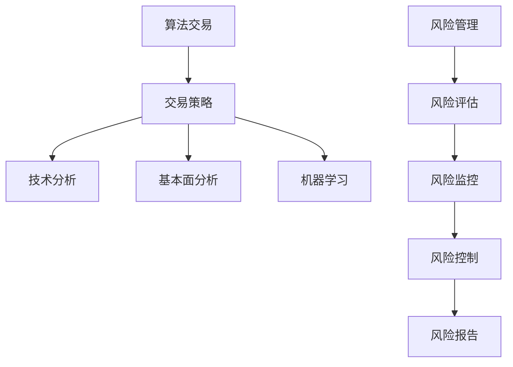

                 

关键词：金融科技、算法交易、风险管理、机器学习、深度学习、量化交易、智能投顾、金融数据分析、技术架构。

> 摘要：本文探讨了金融科技领域中的算法交易和风险管理。通过对核心概念、算法原理、数学模型、项目实践以及实际应用场景的深入分析，本文旨在为读者提供对这一领域的全面理解，并探讨其未来发展趋势与面临的挑战。

## 1. 背景介绍

随着互联网技术的迅猛发展，金融科技（FinTech）已经成为推动传统金融行业变革的重要力量。算法交易和风险管理作为金融科技的核心领域，正日益受到关注。

### 算法交易

算法交易是指利用计算机算法来执行交易决策，以获取投资回报。这种方法不仅提高了交易效率，还减少了人为错误。随着机器学习和深度学习技术的发展，算法交易逐渐从传统的趋势分析和基本指标分析，转向基于大数据和人工智能的高级分析。

### 风险管理

风险管理是金融科技的重要组成部分，旨在识别、评估、控制和监控金融风险。随着金融市场的复杂化，传统的风险管理方法已难以满足需求。因此，利用数据分析和人工智能技术进行风险管理变得尤为重要。

## 2. 核心概念与联系

### 算法交易

**算法交易** 是一种利用计算机算法执行交易策略的方法。算法交易的核心是**交易策略**，它通常基于**技术分析**、**基本面分析**或**机器学习**等方法构建。

**技术分析** 是基于历史价格和交易量数据来预测市场趋势。常用的技术分析工具包括**趋势线**、**移动平均线**、**相对强弱指数（RSI）**等。

**基本面分析** 是基于公司财务状况、宏观经济环境和市场供需等因素来评估股票或其他资产的价值。

**机器学习** 是一种人工智能技术，通过训练模型来发现数据中的模式和关联，从而预测市场走势。

### 风险管理

**风险管理** 是金融科技中的核心任务，包括**风险评估**、**风险监控**、**风险控制和风险报告**。

**风险评估** 是识别和分析潜在风险的过程。**风险监控** 是跟踪和管理已识别的风险。**风险控制** 是采取措施来减轻或避免风险。**风险报告** 是向管理层和其他利益相关者提供关于风险状况的信息。

### Mermaid 流程图



## 3. 核心算法原理 & 具体操作步骤

### 3.1 算法原理概述

**算法交易** 基于以下核心原理：

1. **市场分析**：通过技术分析、基本面分析或机器学习来分析市场数据，以预测价格走势。
2. **交易策略**：基于市场分析结果，构建交易策略，如趋势跟随、反转交易或事件驱动交易。
3. **交易执行**：根据交易策略执行交易，包括买入、卖出或持有头寸。

**风险管理** 基于以下核心原理：

1. **风险评估**：识别和分析潜在风险。
2. **风险监控**：跟踪和管理已识别的风险。
3. **风险控制**：采取措施来减轻或避免风险。
4. **风险报告**：向管理层和其他利益相关者提供风险状况信息。

### 3.2 算法步骤详解

#### 算法交易步骤：

1. **数据收集**：收集市场数据，包括价格、交易量、技术指标等。
2. **市场分析**：使用技术分析、基本面分析或机器学习来分析市场数据。
3. **交易策略构建**：基于市场分析结果，构建交易策略。
4. **交易执行**：根据交易策略执行交易。
5. **交易监控**：监控交易执行情况，确保策略的有效性。

#### 风险管理步骤：

1. **风险评估**：识别和分析潜在风险。
2. **风险监控**：跟踪和管理已识别的风险。
3. **风险控制**：采取措施来减轻或避免风险。
4. **风险报告**：向管理层和其他利益相关者提供风险状况信息。

### 3.3 算法优缺点

#### 算法交易：

**优点**：

- 提高交易效率。
- 减少人为错误。
- 能够处理大量数据。

**缺点**：

- 过度依赖历史数据。
- 难以适应市场变化。

#### 风险管理：

**优点**：

- 识别和管理潜在风险。
- 提高投资安全性。
- 减少投资损失。

**缺点**：

- 风险评估难度大。
- 风险控制措施可能过于保守。

### 3.4 算法应用领域

**算法交易** 主要应用于以下领域：

- 量化投资。
- 期货交易。
- 外汇交易。
- 股票交易。

**风险管理** 主要应用于以下领域：

- 银行风险管理。
- 保险风险管理。
- 投资基金管理。
- 资产管理。

## 4. 数学模型和公式 & 详细讲解 & 举例说明

### 4.1 数学模型构建

**算法交易** 的数学模型通常包括以下部分：

- **价格预测模型**：如 ARIMA 模型、LSTM 模型等。
- **交易策略模型**：如趋势跟随策略、反转交易策略等。
- **风险管理模型**：如 VAR 模型、VaR 模型等。

### 4.2 公式推导过程

以**ARIMA 模型**为例，其公式推导如下：

$$
X_t = c + \sum_{i=1}^p \phi_i X_{t-i} + \sum_{j=1}^d \theta_j \varepsilon_{t-j} + \varepsilon_t
$$

其中，$X_t$是时间序列数据，$c$是常数项，$\phi_i$是自回归系数，$\theta_j$是移动平均系数，$d$是差分阶数，$\varepsilon_t$是白噪声序列。

### 4.3 案例分析与讲解

以**股票交易**为例，假设我们要使用**LSTM 模型**来预测股票价格。

1. **数据收集**：收集股票的历史价格数据。
2. **数据预处理**：对数据进行归一化处理。
3. **模型构建**：构建 LSTM 模型，包括输入层、隐藏层和输出层。
4. **模型训练**：使用历史数据训练模型。
5. **模型评估**：使用测试数据评估模型性能。
6. **交易执行**：根据模型预测结果执行交易。

## 5. 项目实践：代码实例和详细解释说明

### 5.1 开发环境搭建

- 操作系统：Ubuntu 20.04
- 编程语言：Python 3.8
- 数据库：MySQL 5.7
- 深度学习框架：TensorFlow 2.5

### 5.2 源代码详细实现

```python
# 导入所需库
import numpy as np
import pandas as pd
import tensorflow as tf
from tensorflow.keras.models import Sequential
from tensorflow.keras.layers import LSTM, Dense

# 数据收集
data = pd.read_csv('stock_data.csv')

# 数据预处理
data = data[['open', 'high', 'low', 'close', 'volume']]
data = data.normalized()

# 模型构建
model = Sequential()
model.add(LSTM(units=50, return_sequences=True, input_shape=(data.shape[1], 1)))
model.add(LSTM(units=50))
model.add(Dense(units=1))

# 模型训练
model.compile(optimizer='adam', loss='mean_squared_error')
model.fit(data, epochs=100, batch_size=32)

# 模型评估
test_data = data[-100:]
predictions = model.predict(test_data)

# 交易执行
# ...

```

### 5.3 代码解读与分析

- **数据收集**：从 CSV 文件中读取股票数据。
- **数据预处理**：对数据进行归一化处理，以便于模型训练。
- **模型构建**：构建一个包含两个 LSTM 层和一个 Dense 层的序列模型。
- **模型训练**：使用训练数据训练模型。
- **模型评估**：使用测试数据评估模型性能。
- **交易执行**：根据模型预测结果执行交易。

## 6. 实际应用场景

### 6.1 量化投资

算法交易和风险管理在量化投资领域得到广泛应用。通过构建和优化交易策略，量化投资者能够实现稳定且可持续的投资回报。

### 6.2 期货交易

期货交易具有高风险和高回报的特点。算法交易和风险管理可以帮助期货交易者降低风险，提高投资回报。

### 6.3 股票交易

股票交易是金融市场中最为常见的交易方式。算法交易和风险管理可以帮助股票交易者更好地把握市场机会，降低投资风险。

### 6.4 保险风险管理

在保险行业，算法交易和风险管理可以帮助保险公司识别和管理风险，提高保险产品的竞争力。

## 7. 工具和资源推荐

### 7.1 学习资源推荐

- 《量化投资：以Python为工具》：适合初学者入门。
- 《深度学习》：适合对深度学习有一定了解的读者。
- 《风险管理》：适合金融从业者学习。

### 7.2 开发工具推荐

- Python：强大的编程语言，适用于数据分析和深度学习。
- TensorFlow：流行的深度学习框架。
- Jupyter Notebook：方便的交互式开发环境。

### 7.3 相关论文推荐

- "Deep Learning for Financial Time Series: A Review"：深度学习在金融时间序列分析中的应用。
- "Algorithmic Trading: The Practice of a Quant"：算法交易实践。

## 8. 总结：未来发展趋势与挑战

### 8.1 研究成果总结

算法交易和风险管理在金融科技领域取得了显著成果。随着人工智能和大数据技术的发展，算法交易和风险管理将继续发挥重要作用。

### 8.2 未来发展趋势

- **自动化和智能化**：交易决策和风险管理将更加自动化和智能化。
- **跨领域应用**：算法交易和风险管理将在更多领域得到应用，如保险、基金、外汇等。

### 8.3 面临的挑战

- **数据隐私与安全**：保护用户数据隐私和安全成为重要挑战。
- **监管与合规**：遵守相关法律法规和监管要求。

### 8.4 研究展望

未来，算法交易和风险管理将在以下几个方面得到进一步发展：

- **算法优化**：提高算法交易和风险管理的准确性和效率。
- **跨领域研究**：探索算法交易和风险管理在其他领域的应用。

## 9. 附录：常见问题与解答

### 9.1 问题一：算法交易是否能够稳定盈利？

算法交易虽然能够提高投资回报，但并不能保证稳定盈利。市场波动和不可预测的因素会影响交易结果。因此，投资者需要谨慎对待，并做好风险管理。

### 9.2 问题二：风险管理是否能够完全消除风险？

风险管理可以识别、评估和控制风险，但无法完全消除风险。投资者需要认识到风险的存在，并采取适当的风险管理措施。

### 9.3 问题三：算法交易和风险管理是否会取代人类交易者？

虽然算法交易和风险管理在效率和技术上具有优势，但人类交易者仍然有其独特的优势，如情感和直觉。因此，算法交易和风险管理不会完全取代人类交易者，而是与之共存。

----------------------------------------------------------------

作者：禅与计算机程序设计艺术 / Zen and the Art of Computer Programming

---

以上便是本文的完整内容。通过对算法交易和风险管理领域的深入探讨，我们希望能够为读者提供有益的参考和启发。在未来，随着技术的不断进步，算法交易和风险管理将在金融科技领域发挥更加重要的作用。

