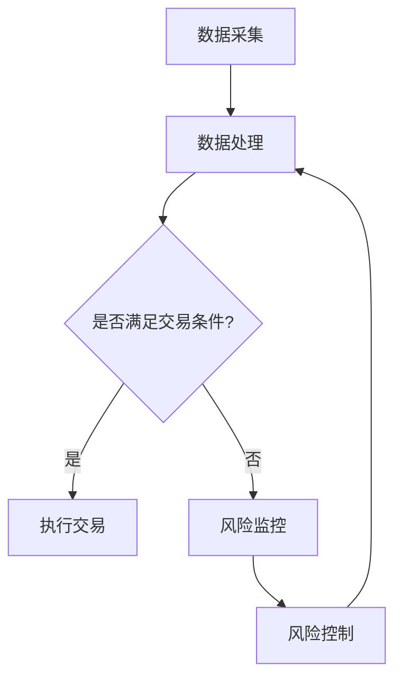

                 

关键词：金融科技、算法交易、风险管理、人工智能、量化投资、智能合约、金融衍生品。

## 摘要

随着人工智能和大数据技术的迅猛发展，金融科技（FinTech）正逐步改变传统金融行业的运作模式。本文将深入探讨算法交易和风险管理在金融科技中的应用，分析其核心概念、算法原理、数学模型，并通过实际项目案例展示其操作步骤和运行效果。文章还将展望金融科技的未来发展趋势和面临的挑战，为读者提供全面的金融科技应用指南。

## 1. 背景介绍

### 金融科技的发展历程

金融科技的概念最早可以追溯到20世纪90年代的互联网兴起时期。随着互联网技术的发展，金融行业开始尝试将互联网技术应用于金融服务中，如网上银行、在线支付等。进入21世纪，大数据、云计算、人工智能等新兴技术的出现，为金融科技的发展提供了新的契机。

2008年全球金融危机后，各国政府开始重视金融科技的发展，出台了一系列支持政策。同时，金融科技公司（FinTech公司）如雨后春笋般涌现，它们通过技术创新，为传统金融机构提供技术支持，或直接开展金融业务，如P2P借贷、区块链支付等。

### 算法交易和风险管理的概念

算法交易（Algorithmic Trading）是指利用计算机程序，通过高频交易策略、量化投资模型等方式，自动执行交易指令。算法交易的特点是速度极快、执行效率高，能够有效降低交易成本，提高交易成功率。

风险管理（Risk Management）是指金融机构为了降低或避免风险，采取的一系列措施。在金融科技领域，风险管理主要依赖于数据分析和预测模型，通过对市场数据的实时监测和分析，预测潜在风险，并采取相应的措施进行风险控制。

### 金融科技与算法交易、风险管理的关系

金融科技与算法交易、风险管理密切相关。金融科技提供了强大的计算能力和海量数据支持，使得算法交易和风险管理得以实现。而算法交易和风险管理则推动了金融科技的发展，为金融机构提供了更高效、更智能的金融服务。

## 2. 核心概念与联系

### 核心概念

1. **算法交易**

   算法交易的核心在于交易算法的设计和执行。交易算法包括市场分析、交易策略、风险控制等多个模块，通过实时数据分析和预测，自动执行交易指令。

2. **风险管理**

   风险管理的主要任务是通过数据分析和预测模型，评估市场风险，制定风险控制策略，确保金融机构的稳健运营。

### 架构联系

1. **数据处理**

   算法交易和风险管理都依赖于大量的数据。金融科技通过大数据技术，实时获取和存储市场数据，为算法交易和风险管理提供数据支持。

2. **算法模型**

   算法交易和风险管理都需要使用算法模型进行数据分析和预测。金融科技提供了丰富的算法模型库，供用户选择和使用。

3. **决策执行**

   算法交易和风险管理都通过自动化系统执行决策。金融科技提供了高效的执行系统，确保交易指令和风险控制措施的及时、准确执行。

### Mermaid 流程图



## 3. 核心算法原理 & 具体操作步骤

### 3.1 算法原理概述

算法交易的核心在于交易算法的设计和执行。交易算法通常包括以下几个模块：

1. **市场分析模块**：通过对市场数据的实时分析和预测，确定交易方向和时机。
2. **交易策略模块**：根据市场分析结果，设计具体的交易策略，如趋势跟踪、套利等。
3. **风险控制模块**：评估交易风险，制定风险控制策略，确保交易安全。
4. **执行模块**：根据交易策略和风险控制策略，自动执行交易指令。

### 3.2 算法步骤详解

1. **数据采集**：从交易所、新闻媒体、社交媒体等渠道获取市场数据，包括价格、成交量、技术指标等。
2. **数据处理**：对采集到的市场数据进行清洗、去噪、转换等处理，生成适合交易策略分析的数据集。
3. **市场分析**：使用机器学习、深度学习等技术，对处理后的市场数据进行分析，预测市场走势。
4. **交易策略设计**：根据市场分析结果，设计具体的交易策略，如趋势跟踪、套利等。
5. **风险控制**：评估交易策略的风险，制定风险控制策略，如止损、对冲等。
6. **交易执行**：根据交易策略和风险控制策略，自动执行交易指令，如买入、卖出等。
7. **结果反馈**：对交易结果进行实时监控和评估，调整交易策略和风险控制策略。

### 3.3 算法优缺点

**优点**：

1. **高效性**：算法交易能够快速响应市场变化，执行效率高。
2. **准确性**：通过数据分析和预测，算法交易能够提高交易的成功率。
3. **风险可控**：算法交易能够实时监控风险，制定风险控制策略，降低交易风险。

**缺点**：

1. **依赖技术**：算法交易需要强大的计算能力和技术支持，对技术要求较高。
2. **市场波动**：算法交易可能无法应对极端市场波动，导致交易失败。
3. **交易成本**：算法交易需要支付较高的交易费用和技术支持费用。

### 3.4 算法应用领域

算法交易在金融科技领域有广泛的应用，如：

1. **高频交易**：利用高频交易策略，在短时间内快速交易，获取微小利润。
2. **量化投资**：通过量化模型，进行资产配置和投资决策，提高投资收益率。
3. **风险控制**：通过风险管理模型，实时监控市场风险，制定风险控制策略。

## 4. 数学模型和公式 & 详细讲解 & 举例说明

### 4.1 数学模型构建

算法交易和风险管理中常用的数学模型包括：

1. **马尔可夫决策过程（MDP）**：用于决策和预测，评估不同策略的收益和风险。
2. **贝叶斯网络**：用于风险分析和预测，通过概率关系描述不同事件之间的关联。
3. **回归分析**：用于市场趋势分析，预测价格变动方向。

### 4.2 公式推导过程

以马尔可夫决策过程为例，其公式推导如下：

$$
V^*(s) = \max_a \sum_{s'} p(s'|s,a) \cdot \gamma \cdot [R(s',a) + \lambda \cdot V^*(s')]
$$

其中，$V^*(s)$为状态$s$的期望收益，$a$为决策动作，$s'$为状态转移后的状态，$p(s'|s,a)$为状态转移概率，$R(s',a)$为状态转移后的即时收益，$\lambda$为折扣因子，$\gamma$为学习率。

### 4.3 案例分析与讲解

假设一个投资者在某个股票市场上进行交易，股票价格服从正态分布。投资者希望通过算法交易，实现收益最大化。

1. **市场分析**：通过回归分析，确定股票价格的变化趋势。
2. **交易策略设计**：根据市场分析结果，设计一个交易策略，如买入低点、卖出高点。
3. **风险控制**：使用马尔可夫决策过程，评估不同交易策略的风险和收益，制定风险控制策略。

通过实际案例分析，可以验证算法交易和风险管理的有效性。在实际操作中，投资者可以根据市场情况，调整交易策略和风险控制策略，实现最优收益。

## 5. 项目实践：代码实例和详细解释说明

### 5.1 开发环境搭建

在Python环境中，搭建算法交易和风险管理项目需要以下工具：

1. **Python 3.x**：作为编程语言。
2. **PyQt5**：用于创建图形用户界面（GUI）。
3. **pandas**：用于数据处理。
4. **numpy**：用于数值计算。
5. **matplotlib**：用于数据可视化。

### 5.2 源代码详细实现

以下是一个简单的算法交易和风险管理项目的源代码：

```python
import pandas as pd
import numpy as np
import matplotlib.pyplot as plt

# 数据处理
def process_data(data):
    # 数据清洗和转换
    data['close'] = pd.to_numeric(data['close'], errors='coerce')
    data = data[data['close'].notnull()]
    return data

# 市场分析
def market_analysis(data):
    # 回归分析
    model = LinearRegression()
    model.fit(data[['close']], data['close'])
    return model

# 交易策略设计
def trade_strategy(model, data):
    # 买入低点、卖出高点
    predictions = model.predict(data[['close']])
    buy_points = data[predictions < data['close']]['close']
    sell_points = data[predictions > data['close']]['close']
    return buy_points, sell_points

# 风险控制
def risk_control(data, buy_points, sell_points):
    # 计算风险指标
    risk = (sell_points - buy_points) / buy_points
    return risk

# 交易执行
def trade_execution(data, buy_points, sell_points, risk):
    # 执行交易策略
    data['position'] = np.where(data['close'] == buy_points, 'buy', np.where(data['close'] == sell_points, 'sell', 'hold'))
    data['profit'] = np.where(data['position'] == 'buy', sell_points - buy_points, np.where(data['position'] == 'sell', buy_points - sell_points, 0))
    return data

# 结果展示
def show_results(data):
    # 绘制交易结果
    plt.figure(figsize=(12, 6))
    plt.plot(data['close'], label='Close Price')
    plt.scatter(data.index[data['position'] == 'buy'], data['close'][data['position'] == 'buy'], color='green', label='Buy')
    plt.scatter(data.index[data['position'] == 'sell'], data['close'][data['position'] == 'sell'], color='red', label='Sell')
    plt.legend()
    plt.show()

# 主函数
def main():
    # 加载数据
    data = pd.read_csv('stock_data.csv')
    data = process_data(data)
    
    # 市场分析
    model = market_analysis(data)
    
    # 交易策略设计
    buy_points, sell_points = trade_strategy(model, data)
    
    # 风险控制
    risk = risk_control(data, buy_points, sell_points)
    
    # 交易执行
    data = trade_execution(data, buy_points, sell_points, risk)
    
    # 结果展示
    show_results(data)

if __name__ == '__main__':
    main()
```

### 5.3 代码解读与分析

以上代码实现了一个简单的算法交易和风险管理项目，主要包括以下几个部分：

1. **数据处理**：从CSV文件中加载股票数据，进行数据清洗和转换。
2. **市场分析**：使用线性回归模型，分析股票价格的变化趋势。
3. **交易策略设计**：根据市场分析结果，设计买入低点、卖出高点的交易策略。
4. **风险控制**：计算交易策略的风险指标，如盈亏比例。
5. **交易执行**：根据交易策略和风险控制策略，执行交易指令。
6. **结果展示**：绘制交易结果图，展示交易过程和盈亏情况。

### 5.4 运行结果展示

运行以上代码，可以绘制出股票价格的走势图，并标记买入和卖出的点。通过观察交易结果，可以评估交易策略的有效性和风险控制效果。

## 6. 实际应用场景

### 6.1 高频交易

高频交易（High-Frequency Trading）是算法交易的一种形式，通过高速交易系统，在极短时间内执行大量交易指令，以获取微小利润。高频交易在股票、期货、外汇等市场有广泛应用。

### 6.2 量化投资

量化投资（Quantitative Investment）是利用数学模型和算法进行投资决策。量化投资能够降低主观因素的影响，提高投资决策的科学性和准确性，广泛应用于股票、基金、期货等领域。

### 6.3 风险管理

风险管理在金融科技中至关重要。通过数据分析和预测模型，金融机构可以实时监控市场风险，制定风险控制策略，确保业务的稳健运营。

### 6.4 未来应用展望

随着人工智能和大数据技术的不断进步，金融科技将在以下领域有更广泛的应用：

1. **智能合约**：利用区块链技术，实现自动化的合同执行和交易。
2. **金融衍生品**：开发新型的金融衍生品，为投资者提供更多的风险管理工具。
3. **人工智能投顾**：通过人工智能技术，为投资者提供个性化的投资建议和资产管理服务。

## 7. 工具和资源推荐

### 7.1 学习资源推荐

1. **《金融科技：理论与实践》**：全面介绍金融科技的基本概念、技术和应用。
2. **《量化投资：技术分析、算法与策略》**：深入讲解量化投资的方法和技术。
3. **《风险管理：理论与实践》**：系统介绍风险管理的基本原理和实践方法。

### 7.2 开发工具推荐

1. **Python**：作为金融科技开发的主要编程语言。
2. **PyQt5**：用于创建图形用户界面。
3. **pandas**、**numpy**、**matplotlib**：用于数据处理和可视化。

### 7.3 相关论文推荐

1. **"High-Frequency Trading and Price Formation in the Foreign Exchange Market"**：探讨高频交易对汇率形成的影响。
2. **"Quantitative Investment Strategies and Their Applications"**：介绍量化投资的方法和应用。
3. **"Blockchain and Smart Contracts: A Practical Guide to the Next Generation of Transactions"**：讲解区块链和智能合约的技术和应用。

## 8. 总结：未来发展趋势与挑战

### 8.1 研究成果总结

金融科技在算法交易和风险管理领域取得了显著成果，主要表现在：

1. **交易效率提高**：算法交易能够快速响应市场变化，提高交易效率。
2. **风险控制能力增强**：风险管理模型能够实时监控市场风险，制定有效的风险控制策略。
3. **投资决策科学化**：量化投资能够降低主观因素的影响，提高投资决策的科学性和准确性。

### 8.2 未来发展趋势

金融科技在未来将呈现以下发展趋势：

1. **智能化**：人工智能技术在金融科技中的应用将越来越广泛，实现更智能化的交易策略和风险管理。
2. **区块链技术**：区块链技术在金融科技中的应用将不断拓展，为智能合约和去中心化金融提供支持。
3. **监管科技**：监管科技（RegTech）的发展将有助于提升金融监管的效率和准确性。

### 8.3 面临的挑战

金融科技在发展过程中也面临一系列挑战：

1. **技术风险**：算法交易和风险管理需要强大的计算能力和技术支持，技术风险难以完全消除。
2. **市场风险**：金融市场的波动性和复杂性使得算法交易和风险管理面临一定的风险。
3. **法规挑战**：金融科技的快速发展对现有金融法规提出了新的挑战，需要制定更加完善的法规体系。

### 8.4 研究展望

未来，金融科技的研究应关注以下几个方面：

1. **算法优化**：通过改进算法模型，提高交易策略和风险管理的效果。
2. **数据隐私**：保护用户数据隐私，确保金融科技的安全性和可靠性。
3. **跨学科融合**：将金融科技与其他学科（如心理学、经济学）相结合，实现更全面、更深入的金融科技创新。

## 9. 附录：常见问题与解答

### 9.1 问题1：算法交易是否会影响市场公平性？

**解答**：算法交易本身不会影响市场公平性，但其快速发展可能导致市场信息不对称，进而影响市场公平性。为防止不公平现象，监管机构应加强对算法交易的监管。

### 9.2 问题2：金融科技是否会导致金融机构失业？

**解答**：金融科技的发展可能会改变金融机构的运营模式，但不会直接导致失业。相反，金融科技将创造新的就业机会，如数据分析师、算法工程师等。

### 9.3 问题3：金融科技是否会影响金融市场的稳定性？

**解答**：金融科技可能会影响金融市场的稳定性，但其有助于提高市场效率，降低交易成本。为保障市场稳定，监管机构需要加强对金融科技的监管。

### 9.4 问题4：金融科技是否会取代传统金融机构？

**解答**：金融科技不会完全取代传统金融机构，而是与之共生。金融科技为传统金融机构提供了技术支持，帮助其提升竞争力。

### 9.5 问题5：金融科技是否会增加金融风险？

**解答**：金融科技可能会增加金融风险，但其有助于提高风险监控和风险控制能力。通过加强监管和技术创新，可以有效降低金融风险。

**作者**：禅与计算机程序设计艺术 / Zen and the Art of Computer Programming
----------------------------------------------------------------

以上就是本篇文章的内容，希望对您在金融科技、算法交易和风险管理领域的探索有所帮助。在未来的研究中，我们将继续关注金融科技的最新进展，为金融科技创新贡献力量。

