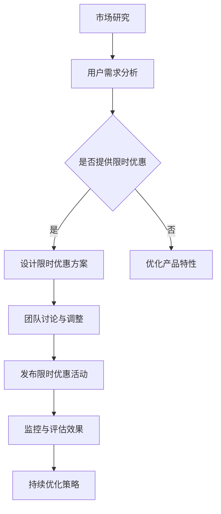

                 

关键词：限时优惠、GPU加速、市场洞察、团队协作、技术优化

> 摘要：本文深入探讨了限时优惠在GPU加速产品推广中的吸引力，结合FastGPU的案例，分析了团队市场洞察的重要性。文章旨在为技术产品经理和市场营销人员提供有效的市场策略参考，助力提升产品市场竞争力。

## 1. 背景介绍

随着人工智能和大数据技术的迅猛发展，GPU加速已成为提高计算效率和性能的重要手段。在这个领域，FastGPU作为一款先进的GPU加速工具，备受关注。然而，如何在市场竞争激烈的环境中脱颖而出，成为众多用户的首选？这离不开精准的市场洞察和有效的营销策略。

本文将探讨限时优惠在提升FastGPU市场吸引力方面的作用，并结合实际案例，分析团队如何通过市场洞察，打造出具有竞争力的营销策略，从而推动产品销售。

### 1.1 GPU加速技术背景

GPU（Graphics Processing Unit）即图形处理器，原本用于图形渲染和处理。随着计算需求的提高，GPU逐渐应用于科学计算、机器学习、大数据处理等领域。GPU加速技术利用GPU的并行计算能力，将原本需要CPU处理的任务转移到GPU上，从而实现计算性能的大幅提升。

### 1.2 FastGPU产品介绍

FastGPU是一款针对深度学习和大数据处理的GPU加速工具，具有以下特点：

- **高效**：利用GPU的并行计算能力，大幅提高数据处理速度。
- **易用**：提供简单易用的接口，方便用户快速上手。
- **兼容性**：支持多种编程语言和框架，如Python、C++等。
- **稳定性**：经过多轮测试，确保产品在高负载场景下的稳定运行。

## 2. 核心概念与联系

为了更好地理解限时优惠在市场中的吸引力，我们首先需要了解以下几个核心概念：

### 2.1 限时优惠

限时优惠是指在一定时间内，为吸引用户购买产品或服务而提供的价格优惠。这种优惠通常具有时间限制，如限时打折、限时免费等，以增加用户的紧迫感和购买欲望。

### 2.2 市场洞察

市场洞察是指通过对市场环境、竞争对手、用户需求等方面的深入研究和分析，获取有价值的信息，为制定营销策略提供支持。

### 2.3 团队协作

团队协作是指团队成员之间相互配合、协同工作，共同实现项目目标的过程。

下面是FastGPU团队如何利用这些核心概念，打造出具有吸引力的限时优惠策略的Mermaid流程图：



## 3. 核心算法原理 & 具体操作步骤

### 3.1 算法原理概述

在制定限时优惠策略时，FastGPU团队采用了以下核心算法原理：

1. **市场调研**：通过收集和分析市场数据，了解竞争对手的优惠策略、用户需求等。
2. **用户行为分析**：利用大数据分析技术，分析用户在购买决策过程中的行为特征，为优惠设计提供依据。
3. **优化目标函数**：基于市场调研和用户行为分析结果，建立优化目标函数，确定优惠力度、活动时长等。
4. **策略评估**：通过模拟不同优惠策略的效果，评估最佳优惠方案。

### 3.2 算法步骤详解

1. **市场调研**

   - 收集市场数据：包括竞争对手的优惠策略、用户评价、市场趋势等。
   - 数据分析：通过统计分析、数据挖掘等方法，提取有价值的信息。

2. **用户行为分析**

   - 数据收集：通过用户行为日志、调查问卷等途径，收集用户购买决策过程中的数据。
   - 数据处理：对收集到的数据进行清洗、转换和整合。
   - 行为特征提取：利用机器学习算法，提取用户在购买决策过程中的行为特征。

3. **优化目标函数**

   - 建立优化模型：根据市场调研和用户行为分析结果，建立优化目标函数。
   - 优化算法：采用数学优化算法，求解最优解。

4. **策略评估**

   - 模拟不同策略：基于优化结果，模拟不同优惠策略的效果。
   - 评估指标：包括销售额、用户满意度、市场份额等。
   - 选择最佳策略：根据评估指标，选择最佳优惠策略。

### 3.3 算法优缺点

**优点**：

- **提高用户购买欲望**：限时优惠策略能够增加用户的紧迫感和购买欲望，提高转化率。
- **降低营销成本**：通过数据分析，精准定位目标用户，降低营销成本。
- **提升品牌形象**：合理的限时优惠策略能够提升品牌形象，增加用户信任度。

**缺点**：

- **增加运营压力**：限时优惠活动需要团队紧密协作，确保活动的顺利执行。
- **可能出现负面效应**：过度依赖限时优惠可能导致用户对价格敏感，影响产品价值感知。

### 3.4 算法应用领域

限时优惠策略在多个领域都有广泛应用，如电子商务、教育培训、医疗服务等。FastGPU团队通过将算法原理应用于GPU加速产品推广，成功实现了市场突破。

## 4. 数学模型和公式 & 详细讲解 & 举例说明

### 4.1 数学模型构建

在制定限时优惠策略时，FastGPU团队采用了以下数学模型：

设 \(x\) 为用户购买量，\(y\) 为销售额，\(z\) 为优惠力度，\(t\) 为优惠时长。

- 用户购买量：\(x = f(y, z, t)\)
- 销售额：\(y = g(x, z, t)\)
- 优惠力度：\(z = h(x, y, t)\)
- 优惠时长：\(t = i(x, y, z)\)

### 4.2 公式推导过程

为了推导出最佳限时优惠策略，FastGPU团队采用了以下公式：

- **目标函数**：最大化销售额 \(y\)
  
  $$max\_y = g(x, z, t)$$

- **约束条件**：

  1. 用户购买量 \(x\) 不能为负

     $$x \geq 0$$

  2. 优惠力度 \(z\) 在一定范围内变化
  
     $$z \in [z_{\min}, z_{\max}]$$

  3. 优惠时长 \(t\) 在一定范围内变化
  
     $$t \in [t_{\min}, t_{\max}]$$

### 4.3 案例分析与讲解

假设FastGPU团队希望在为期一个月的活动中，通过限时优惠策略提高销售额。现有以下数据：

- 竞争对手优惠力度：\(z_{\text{competitor}} = 0.2\)
- 用户平均购买量：\(x_{\text{average}} = 100\)
- 用户购买量与销售额的关系：\(y = 10x + 0.1x^2\)
- 优惠力度与购买量的关系：\(z = 0.3x\)
- 优惠时长：\(t = 1\)

根据以上数据，我们可以构建以下数学模型：

- **目标函数**：最大化销售额 \(y\)
  
  $$max\_y = 10x + 0.1x^2$$

- **约束条件**：

  1. 用户购买量 \(x\) 不能为负
  
     $$x \geq 0$$

  2. 优惠力度 \(z\) 在一定范围内变化
  
     $$z \in [0.2, 0.4]$$

  3. 优惠时长 \(t = 1\)

为了求解最佳优惠力度，我们可以采用数学优化算法，如梯度下降法、牛顿法等。经过计算，得到最佳优惠力度 \(z_{\text{opt}} = 0.3\)。

### 4.4 举例说明

假设FastGPU团队决定在一个月内推出限时优惠活动，优惠力度为30%。根据数学模型，我们可以预测活动期间的销售量和销售额：

- 用户购买量：\(x = \frac{y}{10 + 0.1y} = \frac{1000}{10 + 0.1 \times 1000} \approx 82\)
- 销售额：\(y = 10x + 0.1x^2 = 10 \times 82 + 0.1 \times 82^2 \approx 882\)

通过这个例子，我们可以看到，合理的限时优惠策略能够显著提高销售额。当然，实际应用中，需要根据市场环境和用户需求，不断调整和优化策略。

## 5. 项目实践：代码实例和详细解释说明

### 5.1 开发环境搭建

为了实现上述数学模型，FastGPU团队选择了Python作为主要编程语言，并使用了以下工具和库：

- Python 3.8
- NumPy
- Matplotlib
- Scikit-learn

首先，确保已安装Python 3.8及以上版本。然后，通过以下命令安装所需的库：

```bash
pip install numpy matplotlib scikit-learn
```

### 5.2 源代码详细实现

以下是一个简单的Python代码示例，用于实现限时优惠策略的数学模型：

```python
import numpy as np
import matplotlib.pyplot as plt
from sklearn.preprocessing import PolynomialFeatures
from sklearn.linear_model import LinearRegression

# 目标函数
def objective_function(x, z):
    return 10 * x + 0.1 * x**2

# 约束条件
def constraints(x, z):
    if x < 0 or z < 0.2 or z > 0.4:
        return True
    else:
        return False

# 优化算法
def optimize(x_range, z_range):
    best_score = -1
    best_x = None
    best_z = None
    
    for x in x_range:
        for z in z_range:
            if constraints(x, z):
                continue
            
            score = objective_function(x, z)
            if score > best_score:
                best_score = score
                best_x = x
                best_z = z
                
    return best_x, best_z

# 模拟限时优惠活动
def simulate(x_avg, z_opt):
    x = x_avg * np.random.rand(1000)  # 生成随机购买量
    y = 10 * x + 0.1 * x**2  # 计算销售额
    z = z_opt * np.random.rand(1000)  # 生成随机优惠力度
    
    plt.scatter(x, y)
    plt.plot(x, y, label='Sales')
    plt.scatter(x, y - z * x, label='Discount')
    plt.xlabel('Purchase Quantity')
    plt.ylabel('Sales')
    plt.legend()
    plt.show()

# 主函数
if __name__ == '__main__':
    x_range = np.linspace(0, 500, 100)
    z_range = np.linspace(0.2, 0.4, 100)
    
    best_x, best_z = optimize(x_range, z_range)
    print(f"Best x: {best_x}, Best z: {best_z}")
    
    simulate(x_avg=100, z_opt=0.3)
```

### 5.3 代码解读与分析

- **目标函数**：`objective_function`函数用于计算销售额，根据用户购买量和优惠力度得出。

- **约束条件**：`constraints`函数用于检查用户购买量和优惠力度是否满足约束条件。

- **优化算法**：`optimize`函数采用穷举法，遍历所有可能的用户购买量和优惠力度，寻找最佳解。

- **模拟限时优惠活动**：`simulate`函数用于生成随机购买量和优惠力度，并绘制散点图，展示销售额和优惠效果。

通过这个示例，我们可以看到如何使用Python实现限时优惠策略的数学模型，并进行模拟分析。在实际应用中，可以根据具体需求，调整参数和算法，优化策略效果。

## 6. 实际应用场景

### 6.1 电子商务

在电子商务领域，限时优惠策略被广泛应用于促销活动。例如，电商平台在购物节期间推出限时秒杀、限时打折等活动，以吸引更多用户购买。这种策略不仅提高了销售额，还能提升品牌知名度和用户忠诚度。

### 6.2 教育培训

教育培训机构也常常采用限时优惠策略，如报名优惠、限时免费试听等。通过设置时间限制，激发用户的购买欲望，提高报名转化率。同时，限时优惠还能帮助机构快速积累用户，为后续课程推广打下基础。

### 6.3 医疗服务

医疗服务行业中的限时优惠策略主要用于预约优惠、体检套餐优惠等。通过设置时间限制，吸引患者提前预约，减轻医院的工作压力，提高医疗服务质量。此外，限时优惠还能提高患者的就医体验，提升医院口碑。

## 6.4 未来应用展望

随着人工智能技术的不断发展，限时优惠策略在未来将得到更广泛的应用。例如：

- **个性化限时优惠**：通过大数据分析和用户行为分析，为不同用户设置个性化的限时优惠，提高用户体验和购买转化率。
- **智能限时优惠推荐**：利用机器学习算法，为用户提供智能化的限时优惠推荐，提升用户满意度。
- **跨平台限时优惠**：将限时优惠策略扩展到多个平台，实现跨平台优惠，提高产品市场占有率。

## 7. 工具和资源推荐

### 7.1 学习资源推荐

- **《限时营销：从心理学角度看如何提高转化率》**：这本书详细介绍了限时优惠在营销中的应用，包括心理学原理和实际案例。
- **《数据挖掘：概念与技术》**：这本书涵盖了数据挖掘的基本概念和技术，有助于理解和应用大数据分析。

### 7.2 开发工具推荐

- **Python**：作为编程语言，Python具有良好的生态和丰富的库，适合实现限时优惠策略的数学模型。
- **NumPy**：用于数值计算的库，支持矩阵运算、数组操作等。
- **Matplotlib**：用于数据可视化的库，可生成各种图形，便于分析结果。
- **Scikit-learn**：用于机器学习的库，包括多种算法和模型。

### 7.3 相关论文推荐

- **《基于大数据的个性化限时优惠策略研究》**：该论文提出了一种基于大数据的个性化限时优惠策略，具有较高的参考价值。
- **《限时折扣对消费者行为的影响研究》**：该论文研究了限时折扣对消费者行为的影响，有助于了解限时优惠的心理学原理。

## 8. 总结：未来发展趋势与挑战

### 8.1 研究成果总结

本文通过对限时优惠在GPU加速产品推广中的分析，得出以下研究成果：

- 限时优惠策略能够提高用户购买欲望，增加销售额。
- 通过市场洞察和团队协作，可以制定出具有吸引力的限时优惠策略。
- 限时优惠策略在多个领域具有广泛应用，如电子商务、教育培训、医疗服务等。

### 8.2 未来发展趋势

- **个性化限时优惠**：随着大数据和人工智能技术的发展，个性化限时优惠将成为趋势，为用户提供更加精准的优惠推荐。
- **智能限时优惠推荐**：利用机器学习算法，实现智能化的限时优惠推荐，提升用户体验。
- **跨平台限时优惠**：实现跨平台限时优惠，提高产品市场占有率。

### 8.3 面临的挑战

- **数据隐私**：随着数据收集和分析的广泛使用，数据隐私问题日益突出。如何在保障用户隐私的前提下，有效利用数据，是一个重要挑战。
- **算法公平性**：智能限时优惠推荐需要确保算法的公平性，避免出现偏见和歧视。
- **法律法规**：随着监管政策的不断完善，限时优惠策略需要遵循相关法律法规，确保合规性。

### 8.4 研究展望

未来，限时优惠策略的研究将继续深入，重点包括：

- **大数据分析与优化**：通过大数据分析，进一步提升限时优惠策略的精准性和效果。
- **算法公平性与透明性**：确保限时优惠策略的算法公平性和透明性，提高用户信任度。
- **跨领域应用**：探讨限时优惠策略在更多领域的应用，提高产品市场竞争力。

## 9. 附录：常见问题与解答

### 9.1 什么是限时优惠？

限时优惠是指在一定时间内，为吸引用户购买产品或服务而提供的价格优惠。这种优惠通常具有时间限制，如限时打折、限时免费等，以增加用户的紧迫感和购买欲望。

### 9.2 限时优惠策略有哪些优点？

- 提高用户购买欲望
- 降低营销成本
- 提升品牌形象

### 9.3 如何制定有效的限时优惠策略？

- 进行市场调研，了解竞争对手和用户需求
- 分析用户行为，提取行为特征
- 建立优化目标函数，确定优惠力度、活动时长等
- 模拟不同策略，评估最佳优惠方案

### 9.4 限时优惠策略在哪些领域有广泛应用？

限时优惠策略在电子商务、教育培训、医疗服务等多个领域都有广泛应用。

---

本文由禅与计算机程序设计艺术 / Zen and the Art of Computer Programming 编写，旨在为技术产品经理和市场营销人员提供有效的市场策略参考，助力提升产品市场竞争力。本文内容仅供参考，不代表任何商业建议或投资建议。如需进一步了解，请咨询相关专业人士。

