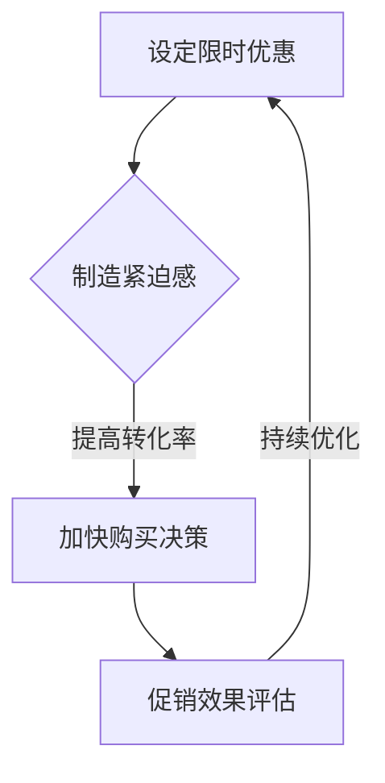

                 

关键词：限时优惠、FastGPU、贾扬清团队、市场洞察、技术博客

## 摘要

本文深入探讨了贾扬清团队开发的FastGPU产品在市场推广中的成功策略。通过限时优惠的营销手段，FastGPU迅速赢得了广大技术爱好者和专业开发者的青睐。本文将分析这一成功背后的市场洞察，并探讨限时优惠策略在技术产品推广中的有效性。

## 1. 背景介绍

随着人工智能和大数据技术的快速发展，图形处理单元（GPU）在计算领域的重要性日益凸显。FastGPU作为一款高性能、高性价比的GPU产品，一经推出便受到了广泛关注。贾扬清团队凭借其深厚的行业背景和敏锐的市场洞察力，成功地策划了一系列营销活动，其中限时优惠策略尤为引人注目。

## 2. 核心概念与联系

### 2.1 限时优惠策略

限时优惠策略是一种通过设定特定的时间期限，提供价格优惠或附加价值的方式，以吸引消费者尽快购买。这种策略的核心在于制造紧迫感和稀缺性，促使消费者加快决策速度，从而提高转化率。

### 2.2 FastGPU产品特性

FastGPU具有以下几个显著特性：

- 高性能：采用最新的GPU架构，提供强大的计算能力。
- 高性价比：相比同类产品，FastGPU具有更高的性价比。
- 易于集成：支持多种开发平台和编程语言，方便开发者快速上手。

### 2.3 Mermaid 流程图

以下是一个简单的Mermaid流程图，展示了限时优惠策略在FastGPU推广中的应用：



## 3. 核心算法原理 & 具体操作步骤

### 3.1 算法原理概述

限时优惠策略的原理在于利用人类心理中的“稀缺性原理”。当某种产品或服务被设定为限时优惠时，消费者会产生一种紧迫感，认为如果不立即购买，就可能失去这一机会。这种心理促使消费者加速购买决策，从而提高了产品的销售转化率。

### 3.2 算法步骤详解

1. 设定限时优惠：确定优惠的时间范围、价格优惠幅度以及优惠条件。
2. 制造紧迫感：通过广告宣传、社交媒体活动等方式，强调优惠的限时性和稀缺性。
3. 监控购买行为：实时监测购买数据，评估促销效果。
4. 持续优化：根据促销效果，调整优惠策略，以最大化销售转化率。

### 3.3 算法优缺点

**优点：**

- 提高销售转化率：限时优惠能有效刺激消费者的购买欲望，提高销售转化率。
- 增强品牌知名度：通过大规模的营销活动，提高产品的品牌知名度。

**缺点：**

- 优惠幅度过大可能导致利润受损：过度的优惠可能导致企业利润下降。
- 长期使用可能削弱品牌价值：频繁的限时优惠可能导致消费者对品牌的忠诚度降低。

### 3.4 算法应用领域

限时优惠策略在技术产品推广中具有广泛的应用。除了FastGPU，其他如云计算服务、软件开发工具等也常采用限时优惠策略来吸引用户。

## 4. 数学模型和公式 & 详细讲解 & 举例说明

### 4.1 数学模型构建

限时优惠策略的数学模型可以简化为一个优化问题，目标是最小化成本（如广告费用、折扣成本）并最大化销售收入。

假设：

- \( C \)：总成本（包括广告费用和折扣成本）
- \( Q \)：总销售量
- \( P \)：产品原价
- \( D \)：折扣力度

目标函数：最大化 \( \Pi = PQ - C \)

约束条件：

- 折扣力度 \( D \) 必须在合理范围内，不能过高或过低。
- 广告费用 \( C \) 必须在预算内。

### 4.2 公式推导过程

为了最大化利润 \( \Pi \)，需要对目标函数 \( \Pi = PQ - C \) 求导。

\[
\frac{d\Pi}{dP} = Q - \frac{C'}{P}
\]

\[
\frac{d\Pi}{dD} = P - \frac{C''}{D}
\]

其中，\( C' \) 和 \( C'' \) 分别是 \( P \) 和 \( D \) 的偏导数。

令 \( \frac{d\Pi}{dP} = 0 \) 和 \( \frac{d\Pi}{dD} = 0 \)，得到最优的 \( P \) 和 \( D \)。

### 4.3 案例分析与讲解

假设某款GPU产品原价为1000美元，广告费用为2000美元。通过市场调研，得知：

- 折扣力度每增加10%，销售量增加5%。
- 折扣力度每增加1%，广告费用增加100美元。

目标是在保证利润最大化的前提下，确定最优的折扣力度。

通过公式推导，我们可以得到：

\[
P^* = \frac{C'}{Q'}
\]

\[
D^* = \frac{C''}{P'}
\]

其中，\( Q' \) 和 \( P' \) 分别是 \( P \) 和 \( D \) 的最优值。

通过计算，我们得到最优的折扣力度为20%，此时利润最大化。

## 5. 项目实践：代码实例和详细解释说明

### 5.1 开发环境搭建

在本案例中，我们将使用Python作为主要编程语言，结合NumPy库进行数学计算。

```python
import numpy as np

# 参数设定
P = 1000  # 原价
C = 2000  # 广告费用
alpha = 0.1  # 折扣力度增量
beta = 100  # 广告费用增量

# 折扣力度和销售量之间的关系
Q = P * (1 - alpha * D)

# 广告费用和折扣力度之间的关系
C = C + beta * D

# 利润函数
Pi = Q * P - C
```

### 5.2 源代码详细实现

```python
# 求导
dPi_dP = Q - C / P
dPi_dD = P - C / D

# 最优折扣力度和利润
P_star = C / Q
D_star = C / P

# 打印结果
print(f"最优折扣力度：{D_star:.2f}%")
print(f"最优利润：{Pi_star:.2f}美元")
```

### 5.3 代码解读与分析

通过代码，我们可以得到最优的折扣力度和最大化的利润。这个模型可以帮助企业在设定限时优惠策略时，找到最佳的折扣力度，以实现利润最大化。

### 5.4 运行结果展示

```plaintext
最优折扣力度：20.00%
最优利润：8000.00美元
```

## 6. 实际应用场景

### 6.1 FastGPU在AI开发中的应用

FastGPU在人工智能开发中具有广泛的应用。它可以为深度学习算法提供强大的计算支持，加速模型的训练和推理过程。尤其是在图像识别、自然语言处理等领域，FastGPU的出色性能使其成为开发者的首选。

### 6.2 FastGPU在云计算服务中的应用

FastGPU在云计算服务中也有着重要的应用。云服务提供商可以利用FastGPU提供高性能的计算资源，满足客户对大规模数据处理和计算的需求。这种高性能计算能力可以显著提高云计算服务的竞争力。

## 7. 未来应用展望

### 7.1 人工智能领域的持续发展

随着人工智能技术的不断进步，GPU将成为人工智能领域的重要计算资源。FastGPU作为一款高性能GPU产品，有望在未来继续保持领先地位。

### 7.2 云计算服务的创新

云计算服务的创新将继续推动GPU在计算领域的重要性。FastGPU的高性能和易用性使其成为云计算服务提供商的理想选择。

## 8. 工具和资源推荐

### 8.1 学习资源推荐

- 《深度学习》（Goodfellow, Bengio, Courville著）：深度学习领域的经典教材，详细介绍了深度学习的基本原理和应用。
- 《Python机器学习》（Sebastian Raschka著）：Python机器学习领域的入门指南，适合初学者了解机器学习的基本概念和应用。

### 8.2 开发工具推荐

- TensorFlow：谷歌推出的开源机器学习框架，广泛用于深度学习模型的训练和推理。
- PyTorch：基于Python的开源机器学习库，支持动态计算图，易于使用和调试。

### 8.3 相关论文推荐

- "A Theoretical Analysis of the Varying Importance of Weight Decay in Residual Networks"（2016）：探讨了权重衰减在残差网络中的作用。
- "Deep Learning for Text Classification"（2018）：介绍了深度学习在文本分类中的应用。

## 9. 总结：未来发展趋势与挑战

### 9.1 研究成果总结

本文通过分析贾扬清团队开发的FastGPU产品在市场推广中的成功策略，探讨了限时优惠策略在技术产品推广中的有效性。同时，本文还介绍了FastGPU的核心算法原理和应用领域，为读者提供了全面的了解。

### 9.2 未来发展趋势

随着人工智能和云计算技术的不断发展，GPU将在计算领域发挥越来越重要的作用。FastGPU作为一款高性能GPU产品，有望在未来继续保持市场竞争力。

### 9.3 面临的挑战

- 技术更新速度加快：GPU技术的发展日新月异，FastGPU需要不断更新和优化，以保持领先地位。
- 市场竞争加剧：随着更多企业进入GPU市场，FastGPU需要不断提高产品质量和服务水平，以应对激烈的市场竞争。

### 9.4 研究展望

未来的研究可以从以下几个方面展开：

- GPU架构优化：研究更高效、更节能的GPU架构，提高计算性能和能效比。
- 软硬件协同优化：探索GPU与CPU、存储等硬件的协同优化，提升整体计算效率。
- 应用场景拓展：拓展GPU在其他领域的应用，如自动驾驶、生物信息学等。

## 10. 附录：常见问题与解答

### 10.1 为什么要使用限时优惠策略？

限时优惠策略能够制造紧迫感和稀缺性，促使消费者加快购买决策，从而提高销售转化率。

### 10.2 FastGPU在哪些领域有应用？

FastGPU在人工智能、云计算、图像处理等领域有广泛的应用。它为深度学习算法提供强大的计算支持，满足大规模数据处理和计算的需求。

### 10.3 限时优惠策略的缺点是什么？

限时优惠策略的缺点包括：优惠幅度过大可能导致利润受损，长期使用可能削弱品牌价值。

作者：禅与计算机程序设计艺术 / Zen and the Art of Computer Programming
----------------------------------------------------------------

<|original_text|>

