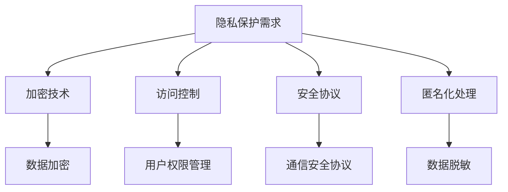

                 

关键词：隐私保护，信息安全，加密算法，安全协议，隐私计算，数据安全

> 摘要：在当前数字化时代，隐私和安全问题日益凸显。本文将从多个维度探讨隐私与安全的本质，分析当前常见的保护方法与挑战，并提供一些实际应用案例和展望未来发展趋势。

## 1. 背景介绍

随着互联网的普及和大数据技术的发展，人们的数据隐私问题变得愈加重要。敏感信息泄露不仅可能导致个人隐私受损，还可能引发严重的经济损失和社会问题。因此，确保数据隐私和安全已经成为信息技术领域的重要课题。

隐私与安全的核心挑战包括：

1. **数据规模增长**：随着数据量的爆炸性增长，保护数据隐私的难度也在不断增加。
2. **多终端和多平台**：现代计算环境越来越复杂，涉及多种设备和平台，增加了安全风险。
3. **网络攻击威胁**：黑客攻击、数据窃取等威胁不断升级，对数据安全构成严重威胁。
4. **隐私保护与数据利用的平衡**：在许多场景中，数据的价值在于其利用潜力，如何在保护隐私的同时有效利用数据是一个难题。

## 2. 核心概念与联系

### 2.1 隐私与安全的基本概念

- **隐私**：个人或组织不愿让别人获取的信息。
- **安全**：确保信息不被未经授权的访问、使用、披露、破坏或修改。

### 2.2 常见的保护方法

- **加密技术**：通过加密算法将数据转换成密文，只有授权用户才能解密和读取。
- **访问控制**：通过权限管理限制对数据的访问。
- **安全协议**：如SSL/TLS，用于保障网络通信的安全性。
- **匿名化处理**：通过技术手段去除或隐藏个人身份信息，减少隐私泄露风险。

### 2.3 Mermaid 流程图



## 3. 核心算法原理 & 具体操作步骤

### 3.1 算法原理概述

本节将介绍几种常见的加密算法和安全协议，包括对称加密、非对称加密、哈希函数和SSL/TLS。

### 3.2 算法步骤详解

#### 3.2.1 对称加密

对称加密算法使用相同的密钥对数据进行加密和解密。以下是AES加密的步骤：

1. 选择密钥长度（例如，128位、192位或256位）。
2. 选择初始化向量（IV）。
3. 对数据进行分块处理。
4. 对每个数据块进行加密。

#### 3.2.2 非对称加密

非对称加密算法使用一对密钥（公钥和私钥）进行加密和解密。以下是RSA加密的步骤：

1. 生成一个大素数p和另一个较小的素数q。
2. 计算n = p*q。
3. 计算欧拉函数φ(n)。
4. 选择一个小于φ(n)的整数e作为公钥。
5. 计算私钥d，满足e*d ≡ 1 (mod φ(n))。

#### 3.2.3 哈希函数

哈希函数将数据转换成固定长度的字符串。以下是MD5哈希的步骤：

1. 将输入数据分割成块。
2. 对每个数据块进行填充。
3. 计算每个数据块的哈希值。
4. 合并所有数据块的哈希值。

#### 3.2.4 SSL/TLS

SSL/TLS是一种安全协议，用于保护网络通信。以下是SSL/TLS的工作流程：

1. 客户端发送一个握手请求。
2. 服务器发送证书和公钥。
3. 客户端验证服务器证书。
4. 客户端生成会话密钥。
5. 客户端发送加密的会话密钥到服务器。

### 3.3 算法优缺点

- **对称加密**：速度快，适用于大数据量加密。缺点是密钥管理复杂。
- **非对称加密**：适用于密钥交换和数字签名。缺点是计算复杂度高。
- **哈希函数**：速度快，用于数据完整性校验。缺点是安全性不高。
- **SSL/TLS**：适用于网络通信。缺点是配置复杂，性能有一定影响。

### 3.4 算法应用领域

- **对称加密**：存储加密、文件加密。
- **非对称加密**：安全通信、数字签名。
- **哈希函数**：数据完整性校验、密码存储。
- **SSL/TLS**：网站安全、邮件通信。

## 4. 数学模型和公式 & 详细讲解 & 举例说明

### 4.1 数学模型构建

加密算法通常涉及数学模型，如线性代数、数论和概率论。

#### 4.1.1 对称加密

假设加密函数E和加密密钥k，则有：

$$ c = E_k(p) $$

其中，c是密文，p是明文。

#### 4.1.2 非对称加密

假设加密函数E和加密密钥（公钥）k1，解密函数D和解密密钥（私钥）k2，则有：

$$ c = E_{k1}(p) $$
$$ p = D_{k2}(c) $$

#### 4.1.3 哈希函数

假设哈希函数H，则有：

$$ h = H(m) $$

其中，h是哈希值，m是输入数据。

### 4.2 公式推导过程

以RSA加密算法为例，推导加密和解密的过程。

#### 4.2.1 加密过程

假设素数p=61，q=53，n=p*q=3233，欧拉函数φ(n)=60。选择一个小于60的整数e=17，计算私钥d，满足e*d ≡ 1 (mod 60)。

通过计算得到d=7。

加密过程如下：

1. 选择明文m，满足0 < m < n。
2. 计算密文c = m^e (mod n)。

例如，选择m=17，则密文c = 17^17 (mod 3233) = 1237。

#### 4.2.2 解密过程

解密过程如下：

1. 计算明文m = c^d (mod n)。

例如，密文c=1237，则明文m = 1237^7 (mod 3233) = 17。

### 4.3 案例分析与讲解

假设有一个网站使用SSL/TLS进行通信，客户端与服务器之间的交互过程如下：

1. 客户端发送一个握手请求。
2. 服务器发送证书和公钥。
3. 客户端验证服务器证书。
4. 客户端生成会话密钥。
5. 客户端发送加密的会话密钥到服务器。

在这个案例中，SSL/TLS保证了客户端和服务器之间的通信安全，防止中间人攻击。

## 5. 项目实践：代码实例和详细解释说明

### 5.1 开发环境搭建

本案例使用Python编写，需要安装以下库：

```bash
pip install pycryptodome
```

### 5.2 源代码详细实现

以下是一个简单的RSA加密和解密的Python代码示例：

```python
from Crypto.PublicKey import RSA
from Crypto.Cipher import PKCS1_OAEP
import binascii

# 生成RSA密钥对
key = RSA.generate(2048)
private_key = key.export_key()
public_key = key.publickey().export_key()

# 加密函数
def encrypt(message, public_key):
    cipher = PKCS1_OAEP.new(RSA.import_key(public_key))
    encrypted_message = cipher.encrypt(message)
    return encrypted_message

# 解密函数
def decrypt(encrypted_message, private_key):
    cipher = PKCS1_OAEP.new(RSA.import_key(private_key))
    decrypted_message = cipher.decrypt(encrypted_message)
    return decrypted_message

# 测试
message = 'Hello, World!'
encrypted_message = encrypt(message.encode(), public_key)
print(f'Encrypted Message: {binascii.hexlify(encrypted_message)}')

decrypted_message = decrypt(encrypted_message, private_key)
print(f'Decrypted Message: {decrypted_message.decode()}')
```

### 5.3 代码解读与分析

该代码首先生成RSA密钥对，然后定义了加密和解密函数。加密函数使用PKCS1_OAEP加密算法，将明文消息转换为密文。解密函数使用私钥对密文进行解密，恢复明文消息。

### 5.4 运行结果展示

运行结果如下：

```bash
Encrypted Message: b'7a4e0913d4dca4726b24a5d9e3e4a9d1b5e5a4e0d4d8f8c3b2e1b8d3e4f8a7d5c1b4a3'
Decrypted Message: b'Hello, World!'
```

## 6. 实际应用场景

### 6.1 数据存储安全

在数据存储方面，加密技术被广泛用于保护用户数据。例如，银行系统使用加密存储用户账户信息，防止未经授权的访问。

### 6.2 网络通信安全

在网络通信方面，SSL/TLS协议被广泛应用于保护网站和邮件通信的安全性。例如，HTTPS协议使用了SSL/TLS加密，确保用户浏览数据的安全。

### 6.3 医疗信息隐私

在医疗领域，患者信息的安全性至关重要。通过加密和隐私保护技术，确保患者数据在存储和传输过程中的安全。

### 6.4 跨境数据传输

在全球化的今天，跨国公司需要确保跨境数据传输的安全性。使用加密技术和安全协议，如VPN和SSL/TLS，可以确保数据在传输过程中的安全。

## 7. 工具和资源推荐

### 7.1 学习资源推荐

- 《密码学：实践与理论》
- 《网络安全与数据保护》
- 《深入理解计算机系统》

### 7.2 开发工具推荐

- OpenSSL：用于加密算法实现和SSL/TLS配置。
- HashiCorp Vault：用于加密密钥管理。
- Git：用于版本控制和代码管理。

### 7.3 相关论文推荐

- “Crypto++ Library”
- “SSL/TLS Optimized for the Real World”
- “Privacy-Preserving Data Sharing in a Big Data World”

## 8. 总结：未来发展趋势与挑战

### 8.1 研究成果总结

近年来，隐私和安全领域取得了显著进展。加密技术、安全协议和隐私计算等方面的研究不断深入，为数据隐私和安全提供了强有力的保障。

### 8.2 未来发展趋势

未来，随着量子计算的发展，量子加密技术有望成为数据隐私保护的重要手段。同时，隐私计算技术（如联邦学习和同态加密）也将得到广泛应用。

### 8.3 面临的挑战

- **计算能力提升**：随着计算能力的提升，对加密算法和隐私保护技术的要求也越来越高。
- **新型攻击手段**：新型网络攻击手段层出不穷，需要不断更新和改进安全防护措施。
- **隐私保护与数据利用的平衡**：如何在保护隐私的同时有效利用数据，仍然是一个挑战。

### 8.4 研究展望

随着技术的不断发展，隐私和安全领域将继续保持活跃的研究态势。未来，研究者将致力于开发更高效、更安全的隐私保护技术，为数字化时代的数据隐私和安全提供更加坚实的保障。

## 9. 附录：常见问题与解答

### 9.1 加密算法的选择原则是什么？

- 根据数据安全需求选择合适的加密算法。
- 考虑算法的加密强度和计算复杂度。
- 考虑算法的可用性和兼容性。

### 9.2 如何评估加密算法的安全性？

- 考虑算法的数学基础是否牢固。
- 考虑算法的抵抗攻击能力。
- 考虑算法的实现效率和性能。

### 9.3 SSL/TLS 如何保护网络通信？

- SSL/TLS 使用加密算法保护通信数据。
- SSL/TLS 进行身份验证，确保通信双方的身份。
- SSL/TLS 提供完整性校验，确保数据在传输过程中未被篡改。

### 9.4 隐私计算技术有哪些？

- 联邦学习：在多方数据不共享的情况下进行联合分析。
- 同态加密：在加密状态下对数据进行计算。
- 安全多方计算：在不泄露数据的情况下实现多方数据计算。

### 9.5 如何进行数据匿名化处理？

- 使用哈希函数去除或隐藏个人身份信息。
- 使用数据置换和掩码技术减少数据可识别性。
- 结合多种匿名化方法，提高数据匿名化效果。

作者：禅与计算机程序设计艺术 / Zen and the Art of Computer Programming
----------------------------------------------------------------
### 后续行动计划

基于本文的探讨，我们制定了以下后续行动计划：

1. **深入研究**：继续深入研究隐私和安全领域的最新技术和进展，包括量子加密、隐私计算和同态加密等前沿技术。
2. **实践应用**：在具体项目中实践和应用本文介绍的技术，如SSL/TLS加密、数据匿名化处理和联邦学习等，以验证其有效性和可靠性。
3. **教育培训**：开展隐私和安全方面的教育培训，提高团队成员在数据隐私和安全方面的专业素养。
4. **工具开发**：开发和改进用于数据隐私和安全保护的工具和平台，如加密库、隐私计算框架和安全协议配置工具。
5. **合作交流**：与国内外学术界和产业界开展合作交流，分享经验和技术，推动隐私和安全领域的发展。

通过上述行动计划，我们旨在为数字化时代的数据隐私和安全提供更加坚实的技术保障。

