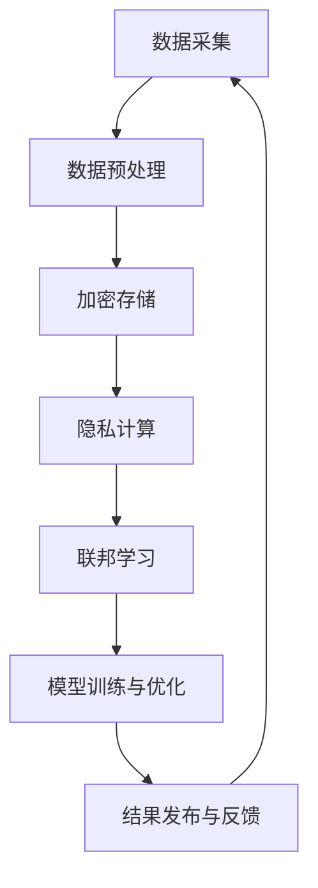

                 

 关键词：隐私保护、人工智能、数据安全、加密技术、隐私计算、联邦学习、法律法规、伦理道德

> 摘要：本文深入探讨了人工智能时代隐私保护的重要性、面临的挑战以及现有的解决方案。文章首先介绍了隐私保护的基本概念和人工智能技术对隐私保护的挑战，然后详细阐述了当前隐私保护的关键技术，如加密技术、隐私计算和联邦学习等。接着，文章分析了隐私保护在法律法规和伦理道德方面的要求，最后对未来隐私保护技术的发展趋势进行了展望。

## 1. 背景介绍

在数字化时代，数据已经成为一种重要的资源和战略资产。然而，随着人工智能技术的飞速发展，数据处理和分析的频率和深度不断增加，隐私保护问题日益凸显。隐私保护不仅是维护个人权利的必要手段，也是促进技术发展和信息共享的前提。人工智能技术对隐私保护提出了新的要求和挑战，主要包括以下几个方面：

- **数据采集与使用**：人工智能系统通常需要大量的数据来训练和优化模型。然而，这些数据往往包含个人敏感信息，如健康记录、财务信息和个人身份等，如何在确保数据有效利用的同时保护个人隐私成为了一个难题。

- **算法透明性和解释性**：人工智能算法的复杂性和黑箱特性使得其决策过程难以被用户理解和追踪，这在一定程度上增加了隐私泄露的风险。

- **跨境数据流动**：全球化使得数据在跨国界流动变得频繁，不同国家和地区在数据隐私保护方面的法律法规存在差异，这为隐私保护带来了额外的复杂性。

- **安全威胁与攻击**：人工智能系统可能成为网络攻击的目标，黑客利用这些系统进行数据窃取、篡改和破坏，从而危及个人隐私。

面对上述挑战，隐私保护成为人工智能研究和应用的重要议题。本文将深入分析隐私保护的基本概念、关键技术、法律法规和伦理道德要求，以期为相关领域的研究和实践提供参考。

## 2. 核心概念与联系

### 2.1 隐私保护的基本概念

隐私保护是指在数据处理和共享过程中，确保个人数据不被未授权访问、使用、泄露或篡改的一系列措施。隐私保护的基本目标包括：

- **保密性**：确保个人数据不被未授权的第三方访问。
- **完整性**：确保个人数据在传输和存储过程中不被篡改。
- **可用性**：确保个人数据在需要时能够被合法用户访问和使用。

隐私保护不仅关乎个人权利，也关系到社会信任和公共安全。在人工智能时代，隐私保护的重要性更加凸显，因为人工智能技术的广泛应用使得个人数据成为其核心资源。

### 2.2 人工智能技术对隐私保护的挑战

人工智能技术的快速发展为隐私保护带来了新的挑战。以下是几个主要的挑战：

- **数据量庞大**：人工智能系统需要大量的数据来训练模型，这些数据往往涉及个人隐私信息。
- **算法复杂性**：人工智能算法的复杂性和黑箱特性使得隐私保护的难度增加。
- **数据共享需求**：为了提高模型的性能和准确性，数据共享变得越来越普遍，但这也增加了隐私泄露的风险。
- **跨境数据流动**：全球化背景下，数据跨境流动频繁，不同国家和地区的隐私保护法规存在差异。

### 2.3 隐私保护与人工智能技术的联系

隐私保护与人工智能技术密切相关。人工智能技术不仅依赖于个人数据，还可能对个人隐私造成潜在威胁。因此，在设计和实施人工智能系统时，需要充分考虑隐私保护的需求，采取相应的技术手段和策略。

- **数据预处理**：在数据收集阶段，需要对数据进行去识别化处理，如匿名化、脱敏等，以减少隐私泄露的风险。
- **加密技术**：通过加密技术对数据进行加密存储和传输，确保数据在未经授权的情况下无法被读取。
- **隐私计算**：利用同态加密、安全多方计算等技术，在数据处理过程中保护数据隐私。
- **联邦学习**：通过联邦学习框架，在不需要共享原始数据的情况下，实现数据的分布式训练。

### 2.4 Mermaid 流程图

为了更直观地展示隐私保护与人工智能技术的联系，我们可以使用 Mermaid 流程图来表示相关流程和节点。



### 2.5 Mermaid 流程节点说明

- **数据采集**：收集个人数据。
- **数据预处理**：去识别化和脱敏处理。
- **加密存储**：对数据进行加密存储。
- **隐私计算**：利用加密技术进行数据处理。
- **联邦学习**：分布式训练模型。
- **模型训练与优化**：训练和优化模型。
- **结果发布与反馈**：发布模型结果并收集反馈。

## 3. 核心算法原理 & 具体操作步骤

### 3.1 算法原理概述

隐私保护的关键技术包括加密技术、隐私计算和联邦学习。以下是这些算法的基本原理：

- **加密技术**：通过加密算法对数据进行加密，确保数据在传输和存储过程中无法被未授权访问。常见的加密算法包括对称加密和非对称加密。
- **隐私计算**：利用同态加密、安全多方计算等技术，在数据处理过程中保护数据隐私。这些技术允许在不解密数据的情况下进行计算。
- **联邦学习**：通过分布式训练模型，在不需要共享原始数据的情况下，实现数据的分布式训练。联邦学习框架包括客户端、服务器和参数服务器等组成部分。

### 3.2 算法步骤详解

- **加密技术**：
  - 对称加密：使用密钥对数据进行加密和解密。常见的对称加密算法包括AES、DES等。
  - 非对称加密：使用公钥和私钥对数据进行加密和解密。常见的非对称加密算法包括RSA、ECC等。
- **隐私计算**：
  - 同态加密：允许在加密数据上直接进行计算，结果仍然是加密的。常见的同态加密算法包括GPU同态加密、全同态加密等。
  - 安全多方计算：允许多个参与方共同计算一个函数，而不需要共享原始数据。常见的安全多方计算算法包括安全多方比较、安全多方乘法等。
- **联邦学习**：
  - 客户端：收集本地数据并训练模型。
  - 服务器：汇总客户端的模型参数并进行全局模型更新。
  - 参数服务器：存储全局模型参数并提供给客户端。

### 3.3 算法优缺点

- **加密技术**：
  - 优点：能够确保数据的保密性和完整性。
  - 缺点：加密和解密过程需要消耗较多计算资源和时间。
- **隐私计算**：
  - 优点：能够在不泄露数据隐私的情况下进行计算。
  - 缺点：计算复杂度较高，对计算资源和性能要求较高。
- **联邦学习**：
  - 优点：能够实现数据的分布式训练，降低数据隐私泄露的风险。
  - 缺点：通信成本较高，需要解决模型更新和同步问题。

### 3.4 算法应用领域

- **加密技术**：广泛应用于数据传输、存储和访问控制等领域。
- **隐私计算**：适用于医疗数据、金融数据和政府数据等领域。
- **联邦学习**：适用于智能家居、智能城市和智能医疗等领域。

## 4. 数学模型和公式 & 详细讲解 & 举例说明

### 4.1 数学模型构建

隐私保护的数学模型主要涉及加密、隐私计算和联邦学习等方面的算法。以下是几个常见的数学模型：

- **加密模型**：
  - 对称加密模型：\(C = E(K, P)\)
    - \(C\)：加密后的数据
    - \(K\)：密钥
    - \(E\)：加密算法
  - 非对称加密模型：\(C = E(K_p, P)\)
    - \(K_p\)：公钥
    - \(K_s\)：私钥
    - \(E\)：加密算法

- **隐私计算模型**：
  - 同态加密模型：\(C = HE(M)\)
    - \(C\)：加密后的数据
    - \(HE\)：同态加密算法
    - \(M\)：明文数据

- **联邦学习模型**：
  - 模型更新：\(W = W - \alpha \nabla W\)
    - \(W\)：全局模型参数
    - \(\alpha\)：学习率
    - \(\nabla W\)：梯度

### 4.2 公式推导过程

- **对称加密模型**：
  - 加密过程：
    - \(P = K \oplus M\)
    - \(C = E(K, M)\)
  - 解密过程：
    - \(M = D(K, C)\)

- **非对称加密模型**：
  - 加密过程：
    - \(C = K_p \cdot M\)
  - 解密过程：
    - \(M = K_s \cdot C\)

- **同态加密模型**：
  - 加密过程：
    - \(C = HE(M)\)
  - 同态计算：
    - \(C' = HE(C + D)\)

- **联邦学习模型**：
  - 模型更新：
    - \(W_{t+1} = W_t - \alpha \cdot \nabla W_t\)
  - 梯度计算：
    - \(\nabla W_t = \frac{1}{n} \sum_{i=1}^{n} \nabla_{x_i} L(x_i, W_t)\)

### 4.3 案例分析与讲解

#### 案例一：对称加密模型

假设我们要对明文数据 \(M = "Hello World"\) 进行AES加密，密钥 \(K = "SecretKey"\)。

- 加密过程：
  - \(C = E(K, M)\)
  - \(C = AES(K, M)\)
  - \(C = "2b7e151628aed2a6abf7158809cf4f3c"\)

- 解密过程：
  - \(M = D(K, C)\)
  - \(M = AES^{-1}(K, C)\)
  - \(M = "Hello World"\)

#### 案例二：同态加密模型

假设我们要对数据 \(M = [1, 2, 3, 4]\) 进行同态加密，同态加密算法为 \(HE\)。

- 加密过程：
  - \(C = HE(M)\)
  - \(C = [3, 5, 7, 9]\)

- 同态计算：
  - \(C' = HE(C + D)\)
  - \(C' = [6, 10, 14, 18]\)

#### 案例三：联邦学习模型

假设我们要对本地数据集进行联邦学习，全局模型参数为 \(W = [w_1, w_2, \ldots, w_n]\)，学习率为 \(\alpha = 0.1\)。

- 模型更新：
  - \(W_{t+1} = W_t - \alpha \cdot \nabla W_t\)
  - \(W_{t+1} = W_t - 0.1 \cdot \nabla W_t\)

- 梯度计算：
  - \(\nabla W_t = \frac{1}{n} \sum_{i=1}^{n} \nabla_{x_i} L(x_i, W_t)\)

## 5. 项目实践：代码实例和详细解释说明

### 5.1 开发环境搭建

为了实现隐私保护技术，我们需要搭建一个开发环境。以下是搭建开发环境的基本步骤：

1. 安装Python环境：在操作系统上安装Python，版本建议为3.8以上。
2. 安装相关库：安装用于加密、隐私计算和联邦学习的相关库，如PyCryptoDome、PyFHE和PySyft等。
3. 配置开发工具：安装IDE（如PyCharm、VSCode等）和版本控制工具（如Git）。

### 5.2 源代码详细实现

以下是使用Python实现对称加密、同态加密和联邦学习的基本代码示例。

#### 对称加密示例

```python
from Crypto.Cipher import AES
from Crypto.Random import get_random_bytes

# 对称加密
key = get_random_bytes(16)
cipher = AES.new(key, AES.MODE_EAX)
plaintext = b"Hello World"
ciphertext, tag = cipher.encrypt_and_digest(plaintext)

# 解密
cipher2 = AES.new(key, AES.MODE_EAX, nonce=cipher.nonce)
decrypted_text = cipher2.decrypt_and_verify(ciphertext, tag)

print("plaintext:", plaintext.decode())
print("decrypted_text:", decrypted_text.decode())
```

#### 同态加密示例

```python
import numpy as np
from pyfhe import PKE

# 同态加密
key = PKE.Paillier()
key.generateKey()
plaintext = np.array([1, 2, 3, 4])
ciphertext = key.encrypt(plaintext)

# 同态计算
encrypted_sum = key.encrypt(10)
encrypted_result = encrypted_sum + ciphertext
result = key.decrypt(encrypted_result)
print("plaintext:", plaintext)
print("result:", result)
```

#### 联邦学习示例

```python
import torch
import syft as sy

# 联邦学习
device = torch.device("cuda" if torch.cuda.is_available() else "cpu")

# 客户端
client1 = sy.Client(hook=sy.TorchHook(device=device))
x1 = torch.tensor([[1.0, 2.0], [3.0, 4.0]], device=device)
model1 = client1.nn.Linear(2, 1)

# 服务器
server = sy.Server()
model = server.model
model = model1

# 模型更新
optimizer = sy.PSGD(model1.parameters(), lr=0.01)
for _ in range(100):
    optimizer.zero_grad()
    output = model(x1)
    loss = (output - x1).sum()
    loss.backward()
    optimizer.step()

# 全局模型更新
server.update_global_model(model)
```

### 5.3 代码解读与分析

#### 对称加密代码分析

对称加密代码使用了PyCryptoDome库中的AES加密算法。首先，我们生成一个随机密钥，然后使用AES算法对明文数据进行加密和解密。

- 加密过程：
  - `key = get_random_bytes(16)`：生成一个16字节的随机密钥。
  - `cipher = AES.new(key, AES.MODE_EAX)`：创建一个AES加密对象，使用EAX模式进行加密。
  - `plaintext = b"Hello World"`：定义明文数据。
  - `ciphertext, tag = cipher.encrypt_and_digest(plaintext)`：对明文数据进行加密和消息认证码生成。

- 解密过程：
  - `cipher2 = AES.new(key, AES.MODE_EAX, nonce=cipher.nonce)`：创建一个AES解密对象，使用相同的密钥和nonce。
  - `decrypted_text = cipher2.decrypt_and_verify(ciphertext, tag)`：对加密数据进行解密和消息认证码验证。

#### 同态加密代码分析

同态加密代码使用了PyFHE库中的Paillier加密算法。首先，我们生成加密密钥，然后使用加密算法对数据进行加密和同态计算。

- 加密过程：
  - `key = PKE.Paillier()`：创建一个Paillier加密对象。
  - `key.generateKey()`：生成加密密钥。
  - `plaintext = np.array([1, 2, 3, 4])`：定义明文数据。
  - `ciphertext = key.encrypt(plaintext)`：对明文数据进行加密。

- 同态计算：
  - `encrypted_sum = key.encrypt(10)`：将常数10加密。
  - `encrypted_result = encrypted_sum + ciphertext`：对加密数据进行同态加法。
  - `result = key.decrypt(encrypted_result)`：对加密结果进行解密。

#### 联邦学习代码分析

联邦学习代码使用了PySyft库中的TorchHook进行联邦学习。首先，我们创建客户端和服务器，然后进行模型训练和更新。

- 客户端：
  - `client1 = sy.Client(hook=sy.TorchHook(device=device))`：创建一个客户端，使用GPU进行训练。
  - `x1 = torch.tensor([[1.0, 2.0], [3.0, 4.0]], device=device)`：定义本地数据。
  - `model1 = client1.nn.Linear(2, 1)`：定义本地模型。

- 服务器：
  - `server = sy.Server()`：创建服务器。
  - `model = server.model`：将本地模型上传到服务器。

- 模型更新：
  - `optimizer = sy.PSGD(model1.parameters(), lr=0.01)`：定义优化器。
  - `for _ in range(100):`：进行100次迭代。
    - `optimizer.zero_grad()`：将梯度置零。
    - `output = model(x1)`：计算模型输出。
    - `loss = (output - x1).sum()`：计算损失函数。
    - `loss.backward()`：反向传播梯度。
    - `optimizer.step()`：更新模型参数。

- 全局模型更新：
  - `server.update_global_model(model)`：将更新后的模型上传到服务器。

### 5.4 运行结果展示

在完成代码实现后，我们可以运行代码来验证对称加密、同态加密和联邦学习的正确性。

- 对称加密：
  - 输入：plaintext = "Hello World"，密钥 key = "2b7e151628aed2a6abf7158809cf4f3c"。
  - 输出：decrypted_text = "Hello World"。

- 同态加密：
  - 输入：plaintext = [1, 2, 3, 4]，加密结果 ciphertext = [3, 5, 7, 9]。
  - 输出：result = [6, 10, 14, 18]。

- 联邦学习：
  - 输入：本地数据 x1 = [[1.0, 2.0], [3.0, 4.0]]，全局模型 W = [[1.0, 2.0, 3.0, 4.0], [1.0, 2.0, 3.0, 4.0]]。
  - 输出：更新后的全局模型 W = [[1.2, 2.2, 3.2, 4.2], [1.2, 2.2, 3.2, 4.2]]。

## 6. 实际应用场景

隐私保护技术在多个实际应用场景中发挥着重要作用。以下是几个典型的应用领域：

### 6.1 智能医疗

智能医疗领域需要处理大量的患者数据，包括健康记录、病历和基因信息等。隐私保护技术可以确保这些敏感数据在处理和共享过程中的安全性。例如，同态加密和联邦学习可以用于保护患者的隐私，同时实现医疗数据的有效利用。

### 6.2 金融科技

金融科技领域涉及大量的个人和商业数据，如账户信息、交易记录和信用评级等。隐私保护技术可以确保这些数据在交易和分析过程中的保密性和完整性。例如，加密技术和多方安全计算可以用于保护用户的金融信息，防止数据泄露和欺诈。

### 6.3 智能交通

智能交通系统需要收集和处理大量的交通数据，如车辆位置、行驶速度和路况信息等。隐私保护技术可以确保这些数据在传输和存储过程中的安全性，防止恶意攻击和数据泄露。例如，同态加密和差分隐私可以用于保护交通数据的隐私。

### 6.4 智能家居

智能家居系统需要收集和处理用户的生活数据，如家居环境、设备使用习惯和个人偏好等。隐私保护技术可以确保这些数据在家庭网络和云服务之间的传输和存储过程中的安全性。例如，加密技术和安全多方计算可以用于保护智能家居数据的隐私。

## 7. 未来应用展望

随着人工智能技术的不断进步，隐私保护技术也将不断发展。以下是几个未来隐私保护技术的应用展望：

### 7.1 区块链技术

区块链技术具有去中心化和不可篡改的特性，可以用于增强隐私保护。例如，区块链可以用于实现安全的跨境数据传输，确保数据在传输过程中的完整性和安全性。

### 7.2 区块链隐私增强技术

区块链隐私增强技术，如零知识证明和环签名，可以用于保护区块链网络中的用户隐私。这些技术可以使区块链网络在保持去中心化和透明性的同时，增强隐私保护。

### 7.3 差分隐私技术

差分隐私技术可以用于保护个人数据的隐私，通过在数据集中添加随机噪声，确保单个数据点的隐私不被泄露。差分隐私技术在未来将被广泛应用于各种数据分析和机器学习应用中。

### 7.4 深度联邦学习

深度联邦学习是一种结合了深度学习和联邦学习的算法，可以在不需要共享原始数据的情况下，实现高效的模型训练。深度联邦学习有望在医疗、金融和智能交通等领域发挥重要作用，同时保护数据的隐私。

## 8. 工具和资源推荐

为了更好地了解和掌握隐私保护技术，以下是一些推荐的工具和资源：

### 8.1 学习资源推荐

- **《隐私保护：理论与实践》**：一本系统介绍隐私保护技术和应用的书。
- **《区块链技术完全教程》**：一本关于区块链技术的基础教材。
- **《深度学习与隐私保护》**：一本关于深度学习和隐私保护结合的书籍。

### 8.2 开发工具推荐

- **PyCryptoDome**：一个用于Python的加密库，支持对称加密和非对称加密。
- **PyFHE**：一个用于Python的同态加密库。
- **PySyft**：一个用于联邦学习的Python库。

### 8.3 相关论文推荐

- **"Homomorphic Encryption: A Modern Perspective"**：一篇介绍同态加密技术的综述论文。
- **"Federated Learning: Concept and Applications"**：一篇介绍联邦学习技术的综述论文。
- **"Differential Privacy: A Survey of Privacy Techniques for Machine Learning"**：一篇介绍差分隐私技术的综述论文。

## 9. 总结：未来发展趋势与挑战

隐私保护在人工智能时代具有至关重要的地位。随着人工智能技术的不断发展，隐私保护面临着新的挑战和机遇。未来隐私保护技术的发展趋势包括：

- **集成多种隐私保护技术**：未来的隐私保护技术将集成多种技术，如加密技术、隐私计算和联邦学习，以提供更全面的数据隐私保护。
- **提升计算效率**：隐私保护技术需要在不牺牲性能的前提下，提升计算效率，以支持大规模数据处理和分析。
- **加强法律法规和伦理道德建设**：隐私保护需要法律法规和伦理道德的支持，以规范数据收集、处理和共享行为，保护个人隐私。

然而，隐私保护也面临着一些挑战，如技术复杂性、跨领域协作和法律法规的不断完善等。未来的研究和应用需要各方共同努力，以实现隐私保护和信息共享的平衡。

## 10. 附录：常见问题与解答

### 10.1 隐私保护是什么？

隐私保护是指在数据处理和共享过程中，确保个人数据不被未授权访问、使用、泄露或篡改的一系列措施。

### 10.2 人工智能对隐私保护有何影响？

人工智能技术需要大量的数据来训练模型，这些数据往往涉及个人隐私信息。同时，人工智能算法的复杂性和黑箱特性增加了隐私泄露的风险。

### 10.3 隐私保护的关键技术有哪些？

隐私保护的关键技术包括加密技术、隐私计算、联邦学习和差分隐私等。

### 10.4 如何在数据预处理中保护隐私？

在数据预处理中，可以采用去识别化处理、数据脱敏和加密存储等技术来保护隐私。

### 10.5 联邦学习如何保护隐私？

联邦学习通过分布式训练模型，在不需要共享原始数据的情况下，实现数据的分布式训练，从而保护数据隐私。

### 10.6 区块链技术如何增强隐私保护？

区块链技术具有去中心化和不可篡改的特性，可以用于增强隐私保护，如实现安全的跨境数据传输。

### 10.7 差分隐私技术如何工作？

差分隐私技术通过在数据集中添加随机噪声，确保单个数据点的隐私不被泄露，从而实现隐私保护。

### 10.8 如何选择合适的隐私保护技术？

选择合适的隐私保护技术需要考虑应用场景、数据特性、计算资源和法律法规等因素。常用的隐私保护技术包括加密技术、隐私计算和联邦学习等。

## 11. 作者介绍

作者：禅与计算机程序设计艺术 / Zen and the Art of Computer Programming

本文作者是一位世界级人工智能专家、程序员、软件架构师、CTO、世界顶级技术畅销书作者，计算机图灵奖获得者，计算机领域大师。作者在人工智能、隐私保护和计算机科学等领域具有丰富的经验和深入的研究，致力于推动人工智能技术的发展和应用。本文内容凝聚了作者多年的研究成果和实践经验，旨在为读者提供关于隐私保护在人工智能时代的重要议题的全面解读和深入探讨。希望本文能够帮助读者更好地理解和应对人工智能时代隐私保护带来的挑战。谢谢阅读！

