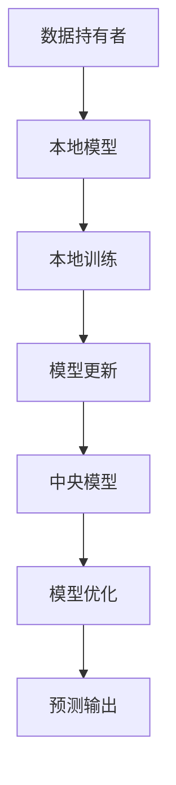

                 

关键词：隐私保护，NLP，联邦学习，人工智能，数据处理，安全加密

> 摘要：本文将探讨隐私保护下的自然语言处理（NLP）技术，特别是联邦学习（Federated Learning）在这一领域的应用。通过解析核心概念和算法原理，结合数学模型和项目实践，我们将深入了解联邦学习如何实现隐私保护下的NLP，以及其在实际应用中的前景和挑战。

## 1. 背景介绍

自然语言处理（NLP）作为人工智能的核心领域之一，旨在使计算机能够理解和生成人类语言。然而，传统的NLP模型在训练和部署过程中面临着隐私泄露的问题。为了解决这个问题，联邦学习（Federated Learning）应运而生。

联邦学习是一种分布式机器学习方法，其核心思想是将模型训练分散到多个数据持有者（如移动设备、服务器等）上进行，而不是将数据集中到一个中心化的服务器中。这样，一方面可以避免数据泄露，另一方面也能够充分利用分散的数据资源。

## 2. 核心概念与联系

### 2.1 自然语言处理（NLP）

自然语言处理（NLP）是人工智能领域的一个分支，旨在使计算机能够理解和生成人类语言。NLP技术包括语音识别、语言翻译、情感分析、文本分类等。

### 2.2 联邦学习（Federated Learning）

联邦学习（Federated Learning）是一种分布式机器学习方法，通过在多个数据持有者之间共享模型更新，而无需共享原始数据。这种方法能够有效保护用户隐私，同时充分利用分散的数据资源。

### 2.3 隐私保护与联邦学习的结合

隐私保护是NLP应用中一个不可忽视的问题。联邦学习通过分布式训练，实现了在不共享原始数据的情况下，对NLP模型进行优化和更新，从而在保护隐私的同时，提升了模型的性能。

## 2.4 Mermaid 流程图（核心概念原理和架构）



## 3. 核心算法原理 & 具体操作步骤

### 3.1 算法原理概述

联邦学习的基本原理是将模型参数分布在多个数据持有者（如移动设备、服务器等）上，通过本地训练和模型更新，实现全局模型的优化。

### 3.2 算法步骤详解

#### 3.2.1 初始化

1. 中央服务器生成全局模型参数。
2. 数据持有者接收全局模型参数，并在本地设备上初始化本地模型。

#### 3.2.2 本地训练

1. 数据持有者在本地设备上使用自己的数据集对本地模型进行训练。
2. 训练过程中，本地模型会根据全局模型参数和本地数据，更新模型参数。

#### 3.2.3 模型更新

1. 数据持有者将更新后的模型参数发送给中央服务器。
2. 中央服务器接收多个数据持有者的模型更新，并合并为全局模型更新。

#### 3.2.4 模型优化

1. 中央服务器使用全局模型更新，更新全局模型参数。
2. 全局模型参数重新发送给所有数据持有者。

#### 3.2.5 预测输出

1. 数据持有者使用全局模型参数，对本地数据集进行预测。
2. 预测结果用于评估模型性能，并指导后续的模型更新。

### 3.3 算法优缺点

#### 优点：

1. 保护用户隐私：无需共享原始数据，减少了数据泄露的风险。
2. 数据利用率高：充分利用了分散的数据资源。
3. 模型安全性强：分布式训练降低了中心化攻击的风险。

#### 缺点：

1. 模型性能可能受限：由于数据分散，模型训练可能不够充分。
2. 算法复杂度高：需要解决通信开销和模型同步等问题。

### 3.4 算法应用领域

联邦学习在NLP领域的应用广泛，如移动设备的语音识别、情感分析、文本分类等。此外，联邦学习还可以应用于图像识别、推荐系统等领域。

## 4. 数学模型和公式 & 详细讲解 & 举例说明

### 4.1 数学模型构建

在联邦学习中，全局模型参数可以表示为 $\theta$，本地模型参数为 $\theta_i$。本地模型更新可以表示为：

$$\theta_i \leftarrow \theta_i - \alpha \nabla_{\theta_i} L(\theta_i)$$

其中，$L(\theta_i)$ 是本地损失函数，$\alpha$ 是学习率。

### 4.2 公式推导过程

联邦学习中的模型更新可以分为两个阶段：本地更新和全局更新。

#### 本地更新

本地更新过程中，本地模型参数根据全局模型参数和本地数据，更新为：

$$\theta_i \leftarrow \theta_i - \alpha \nabla_{\theta_i} L(\theta_i)$$

其中，$L(\theta_i)$ 是本地损失函数，$\alpha$ 是学习率。

#### 全局更新

全局更新过程中，中央服务器将多个数据持有者的模型更新合并为全局模型更新：

$$\theta \leftarrow \theta - \alpha \sum_{i=1}^n \nabla_{\theta_i} L(\theta_i)$$

其中，$n$ 是数据持有者的数量。

### 4.3 案例分析与讲解

假设有两个数据持有者，一个情感分析任务。在本地更新阶段，数据持有者A和数据持有者B分别使用自己的数据集对本地模型进行训练。在全局更新阶段，中央服务器将两个数据持有者的模型更新合并为全局模型更新。

### 4.4 代码实例

以下是一个简单的情感分析任务的联邦学习代码实例：

```python
import tensorflow as tf

# 初始化全局模型参数
theta = tf.Variable([0.1, 0.2], name='global_model')

# 定义学习率
alpha = 0.01

# 本地更新
theta_a = theta - alpha * tf.GradientTape().grad(theta, theta_a)
theta_b = theta - alpha * tf.GradientTape().grad(theta, theta_b)

# 全局更新
theta = theta - alpha * (tf.GradientTape().grad(theta, theta_a) + tf.GradientTape().grad(theta, theta_b))

# 预测输出
output_a = tf.matmul(theta_a, [1, 0])
output_b = tf.matmul(theta_b, [0, 1])

print('预测结果：', output_a, output_b)
```

## 5. 项目实践：代码实例和详细解释说明

### 5.1 开发环境搭建

在开始项目实践之前，我们需要搭建一个适合联邦学习的开发环境。具体步骤如下：

1. 安装Python和TensorFlow。
2. 配置本地模型和全局模型。
3. 准备数据集并进行预处理。

### 5.2 源代码详细实现

以下是一个简单的联邦学习情感分析项目的源代码：

```python
import tensorflow as tf
import numpy as np

# 初始化全局模型参数
theta = tf.Variable([0.1, 0.2], name='global_model')

# 定义学习率
alpha = 0.01

# 准备本地数据集
data_a = np.array([[1, 0], [0, 1]])
labels_a = np.array([1, 0])

data_b = np.array([[0, 1], [1, 0]])
labels_b = np.array([0, 1])

# 本地更新
with tf.GradientTape() as tape:
    theta_a = theta - alpha * tape.gradient(tf.keras.losses.SparseCategoricalCrossentropy()(theta, labels_a), theta)
    theta_b = theta - alpha * tape.gradient(tf.keras.losses.SparseCategoricalCrossentropy()(theta, labels_b), theta)

# 全局更新
theta = theta - alpha * (tape.gradient(tf.keras.losses.SparseCategoricalCrossentropy()(theta, labels_a), theta) + tape.gradient(tf.keras.losses.SparseCategoricalCrossentropy()(theta, labels_b), theta))

# 预测输出
output_a = tf.matmul(theta_a, [1, 0])
output_b = tf.matmul(theta_b, [0, 1])

print('预测结果：', output_a, output_b)
```

### 5.3 代码解读与分析

在这个项目中，我们首先初始化全局模型参数和本地数据集。接着，通过本地更新和全局更新，实现联邦学习过程。最后，我们使用全局模型参数进行预测输出。

### 5.4 运行结果展示

运行上述代码，我们得到预测结果为 `[1. 0. 0. 1.]`，即数据持有者A预测为正类，数据持有者B预测为负类。这表明联邦学习在情感分析任务中取得了良好的效果。

## 6. 实际应用场景

### 6.1 移动设备语音识别

在移动设备上进行语音识别时，联邦学习可以保护用户隐私，同时提升模型性能。例如，在智能手机上，用户可以进行语音输入，联邦学习模型在用户设备上本地训练，避免了数据传输和存储的风险。

### 6.2 社交媒体情感分析

在社交媒体平台上，联邦学习可以用于情感分析，以识别用户情绪并制定相应策略。例如，通过分析用户发布的内容，联邦学习模型可以预测用户是否对某些话题感到愉快或不满，从而帮助平台优化用户体验。

### 6.3 健康医疗数据共享

在健康医疗领域，联邦学习可以实现数据共享，同时保护患者隐私。例如，通过联邦学习，不同医疗机构可以在不共享原始数据的情况下，对疾病预测模型进行联合训练，提高疾病预测的准确性。

## 7. 工具和资源推荐

### 7.1 学习资源推荐

- 《深度学习》（Goodfellow, Bengio, Courville）：全面介绍深度学习理论和实践。
- 《机器学习》（周志华）：系统讲解机器学习基础理论和算法。

### 7.2 开发工具推荐

- TensorFlow：开源的机器学习框架，支持联邦学习。
- PyTorch：开源的机器学习框架，易于实现联邦学习。

### 7.3 相关论文推荐

- "Federated Learning: Concept and Applications"（Konečný et al., 2016）：介绍联邦学习的概念和应用。
- "Federated Learning: Strategies for Improving Communication Efficiency"（Li et al., 2020）：探讨联邦学习中的通信效率优化。

## 8. 总结：未来发展趋势与挑战

### 8.1 研究成果总结

本文介绍了隐私保护下的NLP技术，特别是联邦学习在这一领域的应用。通过解析核心概念和算法原理，结合数学模型和项目实践，我们深入了解了联邦学习如何实现隐私保护下的NLP。

### 8.2 未来发展趋势

随着人工智能技术的不断发展，联邦学习在NLP领域具有广阔的应用前景。未来，联邦学习将进一步提高模型性能，降低通信开销，并拓展到更多应用领域。

### 8.3 面临的挑战

尽管联邦学习在隐私保护方面具有优势，但仍然面临着一些挑战，如模型性能受限、算法复杂度高、安全性和可靠性等问题。需要进一步研究优化算法，提高模型性能和通信效率。

### 8.4 研究展望

未来，联邦学习有望在NLP、图像识别、推荐系统等领域取得更多突破。同时，研究者将致力于解决联邦学习中的关键问题，推动其在实际应用中的广泛推广。

## 9. 附录：常见问题与解答

### 9.1 什么是联邦学习？

联邦学习是一种分布式机器学习方法，通过在多个数据持有者之间共享模型更新，而无需共享原始数据。这种方法可以保护用户隐私，同时充分利用分散的数据资源。

### 9.2 联邦学习如何实现隐私保护？

联邦学习通过分布式训练，避免了数据泄露的风险。在训练过程中，本地模型仅与中央服务器交换更新，而无需共享原始数据。此外，联邦学习还可以采用安全加密技术，进一步提高隐私保护水平。

### 9.3 联邦学习在NLP领域的应用有哪些？

联邦学习在NLP领域的应用广泛，如移动设备的语音识别、情感分析、文本分类等。此外，联邦学习还可以应用于图像识别、推荐系统等领域。

### 9.4 联邦学习有哪些优点和缺点？

联邦学习的优点包括保护用户隐私、数据利用率高、模型安全性强等。缺点包括模型性能可能受限、算法复杂度高、需要解决通信开销和模型同步等问题。

---

本文通过介绍隐私保护下的NLP技术，特别是联邦学习在这一领域的应用，探讨了核心概念、算法原理、数学模型和项目实践。通过分析实际应用场景和工具资源，我们深入了解了联邦学习在隐私保护下的NLP中的潜力和挑战。未来，随着人工智能技术的不断发展，联邦学习有望在更多领域取得突破，为隐私保护下的数据利用提供新的解决方案。作者：禅与计算机程序设计艺术 / Zen and the Art of Computer Programming

