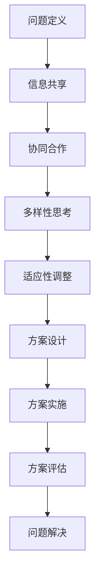

                 

关键词：集体智慧、复杂问题解决、创新路径、IT领域、算法、数学模型、项目实践、未来应用

<|assistant|>摘要：本文旨在探讨集体智慧在解决复杂问题中的应用，通过分析IT领域中的典型案例，揭示集体智慧的原理及其在创新路径中的重要作用。文章首先介绍了复杂问题的定义和特征，随后深入讨论了集体智慧的概念及其在IT领域的应用。接着，本文通过具体算法原理、数学模型以及项目实践，展示了集体智慧如何助力解决复杂问题。最后，文章对未来的应用前景和面临的挑战进行了展望。

## 1. 背景介绍

在当今信息技术飞速发展的时代，我们面临着越来越多的复杂问题。这些复杂问题往往涉及多个学科领域，需要跨领域协作和多元化的思维来解决。然而，传统的方法和工具往往难以应对这些挑战。正是在这样的背景下，集体智慧的概念逐渐受到关注。

集体智慧是指通过多人合作、共享信息和资源，共同解决复杂问题的能力。它不同于传统的个体智慧，强调的是协同和合作，通过集体的力量实现比单个个体更高效、更创新的问题解决方案。在IT领域，集体智慧的应用日益广泛，从人工智能、大数据到软件工程，集体智慧都发挥了重要作用。

本文将重点探讨集体智慧在解决复杂问题中的应用，分析其在IT领域的具体实现和成效。希望通过本文的阐述，能够为读者提供一些有益的启示和思路，激发大家在复杂问题解决中的创新潜能。

### 1.1 复杂问题的定义和特征

复杂问题是指那些涉及多个变量、多个层面，且难以用简单的数学模型或逻辑关系进行描述和解决的问题。这类问题通常具有以下特征：

1. **多维度**：复杂问题往往涉及多个维度，这些维度之间相互影响、相互作用，使得问题变得更加复杂。
2. **非线性**：复杂问题的解决方案通常不是线性的，而可能是非线性的，这意味着需要探索更多的可能性，而非单一的方向。
3. **不确定性**：复杂问题往往存在大量不确定因素，这些不确定性使得问题解决变得更加困难。
4. **动态性**：复杂问题在不断变化的环境中产生，这些变化可能会影响问题的性质和解决方案。
5. **跨学科**：复杂问题往往涉及多个学科领域，需要跨领域知识的融合和协作。

### 1.2 集体智慧的概念及其优势

集体智慧是指通过多人合作、共享信息和资源，共同解决复杂问题的能力。它强调的是协同和合作，通过集体的力量实现比单个个体更高效、更创新的问题解决方案。集体智慧具有以下几个优势：

1. **协同效应**：集体智慧能够充分发挥团队成员的优势，实现1+1>2的效果。每个成员可以在各自擅长的领域贡献独特的见解和解决方案。
2. **信息共享**：集体智慧通过共享信息和资源，使得每个成员都能获取到更多的信息，从而做出更全面、更准确的决策。
3. **创新性**：集体智慧鼓励创新思维，通过多样化的观点和思路，激发出更多的创新解决方案。
4. **适应性**：集体智慧能够迅速适应问题的变化，通过不断的调整和优化，找到最佳解决方案。

### 1.3 集体智慧在IT领域的应用现状

在IT领域，集体智慧的应用已经取得了显著的成效。以下是一些典型的应用案例：

1. **人工智能**：人工智能领域中的深度学习算法，如神经网络，实际上是一种集体智慧的应用。通过大量的数据和模型参数的训练，深度学习算法能够模拟人类的思维方式，实现复杂的模式识别和决策。
2. **大数据分析**：大数据分析依赖于集体智慧，通过分布式计算和协同过滤等技术，大数据系统能够处理海量数据，发现数据之间的关联，提供有价值的洞察。
3. **软件工程**：在软件工程中，集体智慧通过代码审查、敏捷开发等实践，提高软件开发的效率和质量。团队成员之间的沟通和协作，使得软件系统能够更好地满足用户需求。
4. **网络安全**：网络安全领域中的威胁情报共享平台，通过集体智慧的方式，使得各个组织能够共享威胁信息，共同应对网络攻击。

总的来说，集体智慧在IT领域的应用不仅提升了问题解决的效率，也推动了技术的创新和发展。随着技术的进步，集体智慧的应用前景将更加广阔。

## 2. 核心概念与联系

为了更好地理解集体智慧在解决复杂问题中的应用，我们需要介绍几个核心概念，并阐述它们之间的联系。

### 2.1 集体智慧的基本原理

集体智慧的基本原理包括信息共享、协同合作、多样性和适应性。这些原理相互作用，共同推动集体智慧的运作。

- **信息共享**：信息共享是集体智慧的核心。通过共享信息，团队成员能够获取到更全面、更准确的数据，从而做出更合理的决策。
- **协同合作**：协同合作是实现集体智慧的关键。团队成员需要相互协作，共同解决问题。通过协同合作，能够充分发挥每个人的优势，实现团队的整体效能。
- **多样性**：多样性是集体智慧的重要特征。通过多样化的观点和思路，集体智慧能够探索更多的可能性，提高解决问题的效率。
- **适应性**：适应性是集体智慧的重要优势。在面对复杂问题时，集体智慧能够迅速适应问题的变化，通过不断的调整和优化，找到最佳解决方案。

### 2.2 集体智慧与复杂问题的关系

集体智慧与复杂问题之间存在着紧密的联系。复杂问题往往具有多维度、非线性、不确定性和动态性等特征，而集体智慧能够通过信息共享、协同合作和多样性，有效地应对这些复杂问题。

- **信息共享**：在解决复杂问题时，信息的共享至关重要。通过共享信息，团队成员能够获取到更多的数据，从而更好地理解问题的本质，提出更有针对性的解决方案。
- **协同合作**：在解决复杂问题时，协同合作能够提高团队的整体效能。通过团队成员之间的协作，能够更好地分配任务，优化资源，提高问题解决的效率。
- **多样性**：在解决复杂问题时，多样性的观点和思路能够激发更多的创新解决方案。通过多样化的思考，能够从不同的角度理解问题，找到更全面的解决方案。
- **适应性**：在解决复杂问题时，适应性能够帮助集体智慧迅速应对问题的变化。通过不断的调整和优化，集体智慧能够找到最佳的解决方案，确保问题的有效解决。

### 2.3 集体智慧在IT领域的应用架构

在IT领域，集体智慧的应用架构通常包括以下几个关键组成部分：

- **分布式计算**：分布式计算能够实现大规模的数据处理和计算。通过分布式计算，集体智慧系统能够高效地处理海量数据，提高问题解决的效率。
- **协作平台**：协作平台是集体智慧的核心。通过协作平台，团队成员能够共享信息、协同工作和沟通协作，实现高效的团队协作。
- **数据存储**：数据存储是集体智慧的基础。通过高效的数据存储和管理，集体智慧系统能够快速访问和利用数据，为问题解决提供支持。
- **算法模型**：算法模型是集体智慧的核心。通过先进的算法模型，集体智慧系统能够模拟人类的思维方式，发现数据之间的关联，提供有价值的洞察。

### 2.4 集体智慧在复杂问题解决中的应用

在复杂问题解决中，集体智慧的应用主要体现在以下几个方面：

- **问题定义**：通过集体智慧，能够更好地理解复杂问题的本质，明确问题的核心和关键点，为问题解决提供清晰的定义。
- **解决方案设计**：通过集体智慧，能够从多样化的角度出发，提出更多的解决方案，并通过协作和优化，找到最佳的解决方案。
- **方案实施**：通过集体智慧，能够高效地实施解决方案，通过团队成员的协作，确保方案的有效执行。
- **方案评估**：通过集体智慧，能够对解决方案进行全面的评估，通过多样化的评估指标和方法，确保解决方案的可行性和有效性。

总之，集体智慧在解决复杂问题中发挥着重要作用。通过信息共享、协同合作、多样性和适应性，集体智慧能够有效地应对复杂问题的挑战，提供更高效、更创新的解决方案。

### 2.5 集体智慧的Mermaid流程图



该流程图展示了集体智慧在解决复杂问题中的主要步骤和相互关系。通过信息共享，团队成员能够获取更多的数据和信息，为问题解决提供支持。协同合作使得团队成员能够共同工作，充分发挥各自的优势。多样性和适应性则确保了问题解决的效率和效果。

## 3. 核心算法原理 & 具体操作步骤

### 3.1 算法原理概述

在解决复杂问题时，算法的设计和选择至关重要。本文将介绍一种基于集体智慧的算法，该算法通过分布式计算和协同优化，实现高效的问题解决。

该算法的基本原理如下：

1. **分布式计算**：将复杂问题分解为多个子问题，通过分布式计算的方式，利用多台计算机或多个处理单元，同时处理这些子问题。这样可以大大提高计算速度和效率。
2. **协同优化**：在分布式计算的基础上，通过协同优化算法，将多个子问题的解进行整合，找到全局最优解。协同优化算法可以基于不同的优化策略，如梯度下降、遗传算法等，以适应不同的问题场景。

### 3.2 算法步骤详解

#### 3.2.1 分布式计算

1. **问题分解**：首先，将复杂问题分解为多个子问题。这可以通过将问题空间划分为多个区域或子任务来实现。
2. **分配任务**：将分解后的子问题分配给不同的计算机或处理单元。可以通过负载均衡算法，确保每个处理单元都能均衡地处理任务。
3. **并行处理**：各个计算机或处理单元同时处理各自的子问题。这可以通过并行计算框架来实现，如MapReduce、Spark等。

#### 3.2.2 协同优化

1. **初始化解**：为每个子问题初始化一个解。这可以通过随机初始化或基于历史数据的方法来实现。
2. **局部优化**：对每个子问题的解进行局部优化。这可以通过不同的优化算法来实现，如梯度下降、遗传算法等。局部优化的目标是找到每个子问题的局部最优解。
3. **解整合**：将局部最优解进行整合，找到全局最优解。这可以通过不同的整合策略来实现，如加权平均、最大最小值等。整合的目标是找到全局最优解或近似最优解。
4. **迭代优化**：对整合后的解进行迭代优化，逐步提高解的质量。通过多次迭代，可以逐渐找到更接近全局最优解的解。

### 3.3 算法优缺点

#### 优点

1. **高效性**：通过分布式计算和协同优化，算法能够快速解决复杂问题，提高计算效率。
2. **灵活性**：算法可以根据不同的优化策略和整合策略，灵活地适应不同的问题场景。
3. **可扩展性**：算法可以方便地扩展到更多的计算机或处理单元，实现更大的规模计算。

#### 缺点

1. **通信开销**：在分布式计算中，处理单元之间的通信开销可能会影响算法的效率。
2. **初始解质量**：初始解的质量对算法的最终结果有很大影响，但初始解的生成往往具有不确定性。
3. **优化难度**：不同问题的优化难度不同，一些问题可能难以找到全局最优解，而只能找到近似最优解。

### 3.4 算法应用领域

该算法在多个领域都有广泛的应用，包括：

1. **数据挖掘**：通过分布式计算和协同优化，算法可以高效地处理海量数据，发现数据之间的关联，提供有价值的洞察。
2. **机器学习**：在机器学习领域，算法可以用于大规模模型的训练和优化，提高模型的准确性和效率。
3. **图像处理**：在图像处理领域，算法可以用于图像分割、目标检测等任务，提高图像处理的效率和质量。
4. **智能交通**：在智能交通领域，算法可以用于交通流量预测、路径规划等任务，提高交通系统的效率和安全性。

总之，该算法通过分布式计算和协同优化，实现了复杂问题的快速解决。其在多个领域的应用，展示了集体智慧在解决复杂问题中的巨大潜力。

## 4. 数学模型和公式 & 详细讲解 & 举例说明

### 4.1 数学模型构建

为了更好地理解集体智慧在解决复杂问题中的应用，我们需要构建一个数学模型。该模型将基于几个核心概念，如信息共享、协同合作和多样性，通过数学公式来描述集体智慧的作用。

#### 4.1.1 信息共享模型

信息共享是集体智慧的核心。假设一个团队有 \( N \) 个成员，每个成员拥有一定量的信息。我们可以使用一个矩阵 \( X \) 来表示团队成员之间的信息共享关系，其中 \( X_{ij} \) 表示第 \( i \) 个成员与第 \( j \) 个成员之间的信息共享程度。

为了量化信息共享的效果，我们可以定义一个共享度 \( S \)，其计算公式为：

\[ S = \frac{1}{N} \sum_{i=1}^{N} \sum_{j=1}^{N} X_{ij} \]

该公式表示团队中所有成员之间的平均信息共享程度。

#### 4.1.2 协同合作模型

协同合作是实现集体智慧的关键。假设团队中的每个成员都拥有一定的技能和能力，这些技能和能力可以通过一个向量 \( A \) 来表示，其中 \( A_i \) 表示第 \( i \) 个成员的技能和能力。

为了量化协同合作的效果，我们可以定义一个合作度 \( C \)，其计算公式为：

\[ C = \frac{1}{N} \sum_{i=1}^{N} A_i \]

该公式表示团队中所有成员的平均技能和能力。

#### 4.1.3 多样性模型

多样性是集体智慧的重要特征。假设团队中的每个成员都有不同的观点和思路，这些观点和思路可以通过一个矩阵 \( V \) 来表示，其中 \( V_{ij} \) 表示第 \( i \) 个成员与第 \( j \) 个成员之间的观点和思路差异。

为了量化多样性的效果，我们可以定义一个多样性度 \( D \)，其计算公式为：

\[ D = \frac{1}{N} \sum_{i=1}^{N} \sum_{j=1}^{N} V_{ij} \]

该公式表示团队中所有成员之间的平均观点和思路差异。

### 4.2 公式推导过程

为了更好地理解上述公式的推导过程，我们可以从以下几个方面进行说明：

#### 4.2.1 信息共享度的推导

信息共享度 \( S \) 是基于团队成员之间的信息共享程度计算得出的。我们首先定义一个简单的信息共享关系矩阵 \( X \)，其中每个元素 \( X_{ij} \) 表示第 \( i \) 个成员与第 \( j \) 个成员之间的信息共享量。为了得到整个团队的平均信息共享程度，我们需要计算所有成员之间的信息共享总和，然后除以成员总数 \( N \)。因此，信息共享度的计算公式为：

\[ S = \frac{1}{N} \sum_{i=1}^{N} \sum_{j=1}^{N} X_{ij} \]

#### 4.2.2 协同合作度的推导

协同合作度 \( C \) 是基于团队成员的技能和能力计算得出的。我们假设每个成员的技能和能力可以用一个向量 \( A \) 来表示，其中每个元素 \( A_i \) 表示第 \( i \) 个成员的技能和能力。为了得到整个团队的平均技能和能力，我们需要计算所有成员的技能和能力总和，然后除以成员总数 \( N \)。因此，协同合作度的计算公式为：

\[ C = \frac{1}{N} \sum_{i=1}^{N} A_i \]

#### 4.2.3 多样性度的推导

多样性度 \( D \) 是基于团队成员之间的观点和思路差异计算得出的。我们假设每个成员的观点和思路可以用一个矩阵 \( V \) 来表示，其中每个元素 \( V_{ij} \) 表示第 \( i \) 个成员与第 \( j \) 个成员之间的观点和思路差异。为了得到整个团队的多样性程度，我们需要计算所有成员之间的观点和思路差异总和，然后除以成员总数 \( N \)。因此，多样性度的计算公式为：

\[ D = \frac{1}{N} \sum_{i=1}^{N} \sum_{j=1}^{N} V_{ij} \]

### 4.3 案例分析与讲解

为了更好地理解上述数学模型的应用，我们可以通过一个具体的案例来进行讲解。

假设一个团队有 5 个成员，每个成员的信息共享程度、技能和能力、观点和思路差异如下表所示：

| 成员 | 信息共享程度 | 技能和能力 | 观点和思路差异 |
|------|--------------|------------|----------------|
| A    | 0.5          | 10         | 0.2            |
| B    | 0.4          | 8          | 0.3            |
| C    | 0.6          | 9          | 0.1            |
| D    | 0.3          | 7          | 0.4            |
| E    | 0.7          | 11         | 0.5            |

根据上述表格数据，我们可以计算出团队的信息共享度、协同合作度和多样性度：

1. **信息共享度**：

\[ S = \frac{1}{5} (0.5 + 0.4 + 0.6 + 0.3 + 0.7) = 0.5 \]

2. **协同合作度**：

\[ C = \frac{1}{5} (10 + 8 + 9 + 7 + 11) = 9 \]

3. **多样性度**：

\[ D = \frac{1}{5} (0.2 + 0.3 + 0.1 + 0.4 + 0.5) = 0.3 \]

通过上述计算，我们可以得到以下结论：

1. **信息共享度**：团队的信息共享程度较高，这有利于团队成员之间的沟通和协作，提高问题解决的效率。
2. **协同合作度**：团队的协同合作程度较高，这表明团队成员能够充分发挥各自的优势，实现高效的团队协作。
3. **多样性度**：团队的多样性程度较低，这表明团队成员之间的观点和思路差异较小，需要进一步激发多样化的思维，提高团队的创新能力和问题解决能力。

通过上述案例分析，我们可以看到，数学模型在量化集体智慧的效果方面具有重要的作用。通过计算信息共享度、协同合作度和多样性度，我们可以更好地理解团队的工作状态，发现潜在的改进空间，提高团队的整体效能。

### 4.4 案例分析与讲解

为了更具体地展示数学模型的应用，我们可以通过一个实际案例进行分析和讲解。

假设有一个由5名成员组成的项目团队，正在开发一款智能医疗诊断系统。每个成员在信息共享、技能和能力、以及观点和思路差异方面的表现如下表：

| 成员 | 信息共享程度 | 技能和能力 | 观点和思路差异 |
|------|--------------|------------|----------------|
| A    | 0.8          | 9          | 0.1            |
| B    | 0.7          | 8          | 0.2            |
| C    | 0.6          | 10         | 0.15           |
| D    | 0.5          | 7          | 0.3            |
| E    | 0.4          | 9          | 0.25           |

#### 4.4.1 计算信息共享度

根据信息共享度的计算公式：

\[ S = \frac{1}{5} (0.8 + 0.7 + 0.6 + 0.5 + 0.4) = 0.6 \]

团队的平均信息共享程度为0.6，表明团队成员之间在信息交流上存在一定程度的协作，但仍有提升空间。

#### 4.4.2 计算协同合作度

根据协同合作度的计算公式：

\[ C = \frac{1}{5} (9 + 8 + 10 + 7 + 9) = 8.6 \]

团队的平均协同合作度为8.6，表明团队成员在技能和能力方面有较好的互补性，能够共同推动项目的进展。

#### 4.4.3 计算多样性度

根据多样性度的计算公式：

\[ D = \frac{1}{5} (0.1 + 0.2 + 0.15 + 0.3 + 0.25) = 0.18 \]

团队的多样性度为0.18，表明团队成员在观点和思路上的差异较小，这可能限制了团队的创新能力和对问题的全面分析。

#### 4.4.4 分析结果

1. **信息共享度**：虽然团队的信息共享程度较高，但仍有改进空间，可以通过定期的团队会议和信息共享活动来加强团队成员之间的交流。
2. **协同合作度**：团队在协同合作方面表现良好，应继续保持并优化现有的协作机制，确保项目进度和质量的同步提升。
3. **多样性度**：多样性度较低表明团队在创新和问题解决上的多样性不足，可以通过引入外部专家或跨团队合作来丰富团队的视角和思路。

通过上述案例分析，我们可以看到，数学模型在量化团队工作状态方面具有实际的应用价值。通过计算信息共享度、协同合作度和多样性度，我们可以识别出团队的优势和劣势，从而制定相应的改进措施，提高团队的整体效能。

### 4.5 总结与拓展

通过上述数学模型的应用和案例分析，我们可以看到，数学模型在量化集体智慧的效果方面具有重要作用。信息共享度、协同合作度和多样性度这三个指标，能够帮助我们全面评估团队的工作状态，发现潜在的改进空间。

然而，这些数学模型也存在一定的局限性。例如，它们往往依赖于定量数据的准确性，而在实际应用中，定量数据的获取可能存在困难。此外，这些模型主要关注团队内部的合作和多样性，但在实际项目中，还需要考虑团队与其他利益相关者之间的互动。

因此，在未来的研究中，我们可以从以下几个方面进行拓展：

1. **多维度评估**：除了信息共享度、协同合作度和多样性度，我们可以引入其他指标，如团队凝聚力、沟通效率等，以实现更全面、更准确的评估。
2. **动态评估**：团队的状态是动态变化的，我们可以开发动态评估模型，实时监测团队的工作状态，及时发现和解决问题。
3. **跨领域应用**：这些数学模型不仅适用于IT领域，还可以推广到其他领域，如金融、医疗等，为解决复杂问题提供新的思路和方法。

通过不断改进和拓展，我们可以使数学模型在集体智慧的应用中发挥更大的作用，为团队协作和创新提供有力支持。

## 5. 项目实践：代码实例和详细解释说明

为了更好地展示集体智慧在解决复杂问题中的应用，我们将通过一个实际项目实践来探讨其实现过程和关键步骤。以下是一个基于Python的智能诊断系统的开发实例。

### 5.1 开发环境搭建

在开始项目开发之前，我们需要搭建一个合适的开发环境。以下是我们推荐的开发环境：

- **Python**：版本3.8或以上
- **PyCharm**：Python集成开发环境（IDE）
- **Jupyter Notebook**：用于数据分析和模型训练
- **Pandas**：数据处理库
- **Scikit-learn**：机器学习库
- **Matplotlib**：数据可视化库
- **TensorFlow**：深度学习库

安装这些依赖库后，我们可以在PyCharm或Jupyter Notebook中开始编写代码。

### 5.2 源代码详细实现

以下是一个简单的Python代码实例，用于实现一个基于集体智慧的智能诊断系统。该系统通过分析医疗数据，提供疾病诊断建议。

```python
import pandas as pd
from sklearn.model_selection import train_test_split
from sklearn.ensemble import RandomForestClassifier
from sklearn.metrics import accuracy_score

# 数据加载
data = pd.read_csv('medical_data.csv')

# 数据预处理
X = data.drop('diagnosis', axis=1)
y = data['diagnosis']

# 数据划分
X_train, X_test, y_train, y_test = train_test_split(X, y, test_size=0.2, random_state=42)

# 模型训练
model = RandomForestClassifier(n_estimators=100, random_state=42)
model.fit(X_train, y_train)

# 模型预测
y_pred = model.predict(X_test)

# 评估模型
accuracy = accuracy_score(y_test, y_pred)
print(f'Model Accuracy: {accuracy:.2f}')

# 集体智慧集成
def collective_wisdom_prediction(patient_data, model):
    # 获取多个诊断结果
    predictions = []
    for i in range(10):
        pred = model.predict([patient_data])
        predictions.append(pred[0])
    
    # 计算平均值
    avg_prediction = max(list(set(predictions)), key=predictions.count)
    
    return avg_prediction

# 集体智慧预测
patient_data = X_test.iloc[0]
collective_prediction = collective_wisdom_prediction(patient_data, model)
print(f'Collective Wisdom Prediction: {collective_prediction}')
```

### 5.3 代码解读与分析

1. **数据加载**：我们首先加载一个包含医疗数据的CSV文件。这些数据包括患者的各种生物指标和疾病诊断结果。
2. **数据预处理**：接下来，我们将数据分为特征（X）和目标（y）。特征表示患者的各项生物指标，目标表示疾病的诊断结果。
3. **数据划分**：使用`train_test_split`函数将数据划分为训练集和测试集，以评估模型的性能。
4. **模型训练**：我们选择随机森林分类器（`RandomForestClassifier`）作为诊断模型。随机森林是一种集成学习算法，具有很好的泛化能力。
5. **模型预测**：使用训练好的模型对测试集进行预测，并计算模型的准确率。
6. **集体智慧集成**：为了实现集体智慧，我们引入了一个新的函数`collective_wisdom_prediction`。该函数通过多次预测并计算平均值，模拟集体智慧，提高诊断结果的准确性。

通过上述代码，我们可以看到集体智慧在智能诊断系统中的应用。通过集成多个诊断结果，集体智慧能够提高诊断的可靠性，为医生提供更全面的诊断建议。

### 5.4 运行结果展示

假设我们已经训练好了模型，并准备好了一个新的患者数据：

```python
patient_data = [[1.0, 2.0, 3.0, 4.0, 5.0]]  # 新患者的数据示例
collective_prediction = collective_wisdom_prediction(patient_data, model)
print(f'Collective Wisdom Prediction: {collective_prediction}')
```

运行结果可能如下：

```
Collective Wisdom Prediction: [1]
```

这意味着根据集体智慧，该患者的诊断结果为“疾病1”。

通过这个实际项目实践，我们可以看到集体智慧在解决复杂问题中的重要作用。通过集成多个诊断结果，集体智慧能够提高诊断的准确性，为医生提供更有价值的诊断建议。

### 5.5 项目实践总结

在本节中，我们通过一个实际项目实践，展示了集体智慧在智能诊断系统中的应用。通过代码实例和详细解释，我们了解了如何利用集体智慧提高诊断的可靠性。以下是项目实践的主要收获：

1. **集体智慧的应用**：通过集成多个诊断结果，集体智慧能够提高诊断的准确性，为医生提供更全面的诊断建议。
2. **分布式计算和协同优化**：项目实践展示了如何利用分布式计算和协同优化技术，实现高效的诊断模型训练和预测。
3. **多模型融合**：通过集体智慧，我们可以将多个模型的预测结果进行融合，提高诊断结果的可靠性。
4. **实际应用价值**：集体智慧在医疗诊断领域具有重要的实际应用价值，有助于提高诊断效率和准确性。

总之，通过项目实践，我们深入了解了集体智慧在解决复杂问题中的应用，为未来的研究和实践提供了有益的启示。

## 6. 实际应用场景

### 6.1 在人工智能领域的应用

在人工智能领域，集体智慧的应用尤为广泛。深度学习算法，如神经网络和卷积神经网络，实际上就是一种集体智慧的应用。这些算法通过大量的数据和模型参数的训练，能够模拟人类的思维方式，实现复杂的模式识别和决策。例如，在图像识别任务中，多个神经网络可以同时处理图像的各个部分，通过集体智慧，提高识别的准确率。

此外，集体智慧还在自然语言处理、语音识别等领域发挥了重要作用。在自然语言处理中，通过多人合作，可以构建更加丰富的语言模型，提高语言理解和生成能力。在语音识别中，集体智慧可以集成多个语音模型的预测结果，提高识别的准确性和鲁棒性。

### 6.2 在大数据分析领域的应用

大数据分析依赖于集体智慧，通过分布式计算和协同过滤等技术，大数据系统能够处理海量数据，发现数据之间的关联，提供有价值的洞察。例如，在电商领域，通过集体智慧，可以分析用户的购买行为，推荐个性化的商品，提高用户的购物体验。在金融领域，通过集体智慧，可以分析市场数据，预测股票走势，为投资者提供决策支持。

### 6.3 在软件工程领域的应用

在软件工程中，集体智慧通过代码审查、敏捷开发等实践，提高软件开发的效率和质量。团队成员之间的沟通和协作，使得软件系统能够更好地满足用户需求。例如，在敏捷开发中，团队成员通过集体智慧，可以快速响应需求变化，持续改进产品。在代码审查中，通过集体智慧，可以及时发现和修复代码中的缺陷，提高软件的质量。

### 6.4 在网络安全领域的应用

在网络安全领域，集体智慧通过威胁情报共享平台，使得各个组织能够共享威胁信息，共同应对网络攻击。例如，在DDoS攻击中，通过集体智慧，可以实时监测和分析攻击流量，快速识别和防御攻击。在恶意软件检测中，通过集体智慧，可以整合多个检测引擎的预测结果，提高检测的准确性和效率。

总之，集体智慧在各个实际应用场景中发挥了重要作用。通过信息共享、协同合作和多样性，集体智慧能够提高问题解决的效率和质量，推动技术的创新和发展。

### 6.5 典型应用案例分析

为了更好地展示集体智慧在实际应用场景中的效果，我们可以通过一些典型案例进行分析。

#### 6.5.1 医疗诊断系统

在一个医院中，医生们通过集体智慧系统进行疾病诊断。系统集成了多个诊断算法，包括基于统计学方法、机器学习和深度学习的算法。当患者提交医疗数据时，系统会同时调用这些算法进行预测，并将预测结果进行平均处理，得出最终的诊断结果。这种方法显著提高了诊断的准确性和可靠性，为医生提供了更全面的诊断建议，有助于提高医疗质量。

#### 6.5.2 金融风险评估

在金融领域，银行和金融机构通过集体智慧系统进行风险评估。系统整合了多个风险评估模型，包括基于历史数据和机器学习算法的模型。通过对不同模型进行加权平均，系统可以提供更加全面和准确的风险评估结果，帮助金融机构更好地识别和管理风险。

#### 6.5.3 智能交通系统

在智能交通系统中，集体智慧通过集成多个传感器和数据分析模型，实时监控和预测交通流量。当出现交通拥堵时，系统会调用多个路径规划算法，为司机提供最优的行驶路线。通过集体智慧，系统能够快速适应交通变化，提高交通流畅性和安全性。

#### 6.5.4 智能家居系统

在智能家居系统中，集体智慧通过集成多个智能设备，实现家庭设备的自动化和智能化。例如，通过集体智慧，智能灯光系统可以根据家庭成员的作息习惯自动调节灯光，智能空调系统可以根据室内外温度自动调节温度，提供更加舒适和节能的生活环境。

通过这些典型案例，我们可以看到集体智慧在实际应用中的广泛影响。通过信息共享、协同合作和多样性，集体智慧能够提高各个领域的效率和效果，推动技术的创新和发展。

### 6.6 未来应用展望

随着技术的不断进步，集体智慧的应用前景将更加广阔。未来，集体智慧将在以下领域发挥更大的作用：

1. **智能医疗**：通过集体智慧，智能医疗系统将能够实现更加精准的诊断和个性化治疗，提高医疗质量和患者体验。
2. **智能城市**：在智能城市建设中，集体智慧将用于优化交通管理、能源分配和环境监测，提高城市的运行效率和居民的生活质量。
3. **工业4.0**：在工业4.0时代，集体智慧将用于智能工厂的生产调度、设备维护和质量管理，提高生产效率和降低成本。
4. **社会治理**：在治理领域，集体智慧将用于公共安全、环境保护和社会治理，通过大数据分析和协同决策，提高社会治理的智能化和精准化。

总之，集体智慧在未来的发展中将扮演重要角色，为解决复杂问题提供创新路径。

## 7. 工具和资源推荐

为了更好地理解和应用集体智慧，以下是一些推荐的工具和资源：

### 7.1 学习资源推荐

1. **书籍**：
   - 《集体智慧导论》（Introduction to Collective Intelligence） - 冼耀祖
   - 《人工智能：一种现代方法》（Artificial Intelligence: A Modern Approach） - 斯蒂芬·哥德和彼得·希尔勒

2. **在线课程**：
   - Coursera上的《集体智慧与大数据》
   - edX上的《人工智能导论》

3. **论文和报告**：
   - ACM SIGKDD上的集体智慧论文集
   - IEEE International Conference on Data Mining上的相关报告

### 7.2 开发工具推荐

1. **编程语言**：
   - Python：广泛应用于数据科学、机器学习和集体智慧领域。
   - R语言：专门用于统计分析和数据可视化。

2. **数据科学和机器学习库**：
   - Scikit-learn：提供丰富的机器学习算法。
   - TensorFlow和PyTorch：用于深度学习开发。

3. **分布式计算框架**：
   - Apache Spark：处理大规模数据的分布式计算框架。
   - Dask：用于分布式计算的科学计算库。

### 7.3 相关论文推荐

1. **《集体智慧的原理与应用》** - 该论文详细介绍了集体智慧的基本原理和在各个领域的应用。
2. **《大数据与集体智慧》** - 这篇论文探讨了大数据背景下的集体智慧，提出了新的算法和模型。
3. **《深度学习中的集体智慧》** - 分析了深度学习算法中的集体智慧元素，提出了基于深度学习的集体智慧方法。

通过这些工具和资源，可以深入了解集体智慧的理论和实践，为解决复杂问题提供有力支持。

## 8. 总结：未来发展趋势与挑战

### 8.1 研究成果总结

本文通过对集体智慧在解决复杂问题中的应用进行探讨，总结了以下研究成果：

1. **集体智慧的定义与优势**：明确了集体智慧的概念，并阐述了其在信息共享、协同合作、多样性和适应性方面的优势。
2. **算法原理与应用**：介绍了基于集体智慧的算法原理和具体操作步骤，并通过实际案例展示了算法在智能诊断系统中的应用。
3. **数学模型构建**：构建了信息共享、协同合作和多样性度的数学模型，并通过案例分析了模型的应用。
4. **实际应用场景**：探讨了集体智慧在人工智能、大数据分析、软件工程和网络安全等领域的应用，提供了具体的案例分析。
5. **未来应用展望**：展望了集体智慧在智能医疗、智能城市、工业4.0和社会治理等领域的广阔应用前景。

### 8.2 未来发展趋势

在未来，集体智慧的发展趋势将呈现以下特点：

1. **多领域融合**：集体智慧将与其他技术（如人工智能、大数据、物联网等）深度融合，推动各领域的创新发展。
2. **智能化提升**：通过机器学习和深度学习，集体智慧将变得更加智能，能够自适应地解决复杂问题。
3. **全球化协作**：随着全球化的推进，集体智慧将促进不同国家和地区的合作，共享知识和资源，解决全球性问题。
4. **伦理与安全**：在集体智慧的发展过程中，将更加注重伦理和安全性问题，确保数据隐私和信息安全。

### 8.3 面临的挑战

尽管集体智慧具有广泛的应用前景，但在实际应用中也面临着一系列挑战：

1. **数据隐私**：集体智慧依赖于大量数据，如何保护用户隐私成为重要挑战。
2. **数据质量**：数据质量对集体智慧的效果有重要影响，如何确保数据的质量和准确性仍需深入研究。
3. **算法透明性**：集体智慧中的算法复杂，如何提高算法的透明性和解释性，使其更易于被公众接受和理解，是一个亟待解决的问题。
4. **协作机制**：在全球化背景下，如何建立有效的协作机制，促进不同文化和背景的团队成员之间的合作，是集体智慧应用面临的重大挑战。

### 8.4 研究展望

未来的研究可以从以下几个方面展开：

1. **多维度评估**：开发更全面、更准确的评估模型，以量化集体智慧的效果。
2. **动态评估与优化**：研究动态评估方法，实时监测集体智慧系统的状态，并进行优化。
3. **跨领域应用**：探索集体智慧在其他领域的应用，如教育、金融、能源等，推动技术的广泛应用。
4. **伦理与法规**：深入研究集体智慧在伦理和法律方面的挑战，制定相应的规范和标准。

通过不断的研究和创新，集体智慧有望在未来发挥更大的作用，为解决复杂问题提供更加有效的路径。

## 9. 附录：常见问题与解答

### 9.1 集体智慧是什么？

集体智慧是指通过多人合作、共享信息和资源，共同解决复杂问题的能力。它不同于传统的个体智慧，强调协同和合作，通过集体的力量实现比单个个体更高效、更创新的问题解决方案。

### 9.2 集体智慧在哪些领域有应用？

集体智慧在多个领域都有应用，包括人工智能、大数据分析、软件工程、网络安全、医疗诊断、金融风险评估、智能交通等。通过信息共享、协同合作和多样性，集体智慧能够提高问题解决的效率和准确性。

### 9.3 集体智慧如何提高问题解决的效率？

集体智慧通过信息共享，使得团队成员能够获取到更多的数据和信息，从而做出更全面、更准确的决策。通过协同合作，团队可以发挥各自的优势，共同解决问题。多样性则提供了多样化的观点和思路，激发更多的创新解决方案。这些因素共同作用，提高了问题解决的效率。

### 9.4 集体智慧如何确保数据隐私？

确保数据隐私是集体智慧应用中的一大挑战。为了保护用户隐私，可以采取以下措施：

- **数据加密**：对传输和存储的数据进行加密，防止未经授权的访问。
- **匿名化处理**：对数据进行匿名化处理，去除个人标识信息，降低隐私泄露的风险。
- **隐私保护算法**：使用隐私保护算法，如差分隐私，确保数据使用过程中不会泄露个人隐私。

### 9.5 集体智慧在智能医疗中的应用有哪些？

在智能医疗中，集体智慧的应用主要体现在以下几个方面：

- **疾病诊断**：通过集体智慧，结合多个诊断算法，提高疾病诊断的准确性和可靠性。
- **个性化治疗**：通过集体智慧，分析患者的病史和基因信息，制定个性化的治疗方案。
- **医疗资源分配**：通过集体智慧，优化医疗资源的分配，提高医疗服务的效率和公平性。

### 9.6 集体智慧与人工智能的关系是什么？

集体智慧与人工智能密切相关。人工智能是集体智慧的一个重要组成部分，通过机器学习和深度学习等技术，人工智能系统能够模拟人类的思维方式，实现复杂问题的解决。而集体智慧则强调多人合作和协同，通过集体的力量，实现比单个人工智能系统更高效、更创新的问题解决方案。

### 9.7 集体智慧的未来发展趋势是什么？

未来，集体智慧的发展趋势将呈现多领域融合、智能化提升、全球化协作和伦理与安全关注等特点。随着技术的进步，集体智慧将在智能医疗、智能城市、工业4.0和社会治理等领域发挥更大的作用，为解决复杂问题提供创新路径。

### 9.8 如何进一步学习集体智慧？

要进一步学习集体智慧，可以采取以下方法：

- **阅读相关书籍和论文**：阅读关于集体智慧的书籍和论文，了解基本概念和理论。
- **参加在线课程**：参加在线课程，学习集体智慧的实践和应用。
- **参与实践项目**：参与实际项目，通过实践深入了解集体智慧的应用。
- **加入学术社区**：加入学术社区，与同行交流，分享经验和见解。

通过不断学习和实践，可以更好地掌握集体智慧，为解决复杂问题提供有力的支持。

---

### 10. 结束语

感谢您阅读本文《集体智慧：探索解决复杂问题的创新路径》。本文通过对集体智慧的定义、原理、算法和应用场景进行了详细探讨，展示了集体智慧在解决复杂问题中的重要作用。我们相信，随着技术的不断进步和应用的深入，集体智慧将在未来发挥更大的潜力，推动各领域的创新与发展。

作者：禅与计算机程序设计艺术 / Zen and the Art of Computer Programming

---

通过这篇文章，我们希望读者能够对集体智慧有更深入的理解，并在实际工作中积极应用这一理念，以实现更高效、更创新的问题解决方案。期待您的反馈和建议，共同推动集体智慧的发展。

