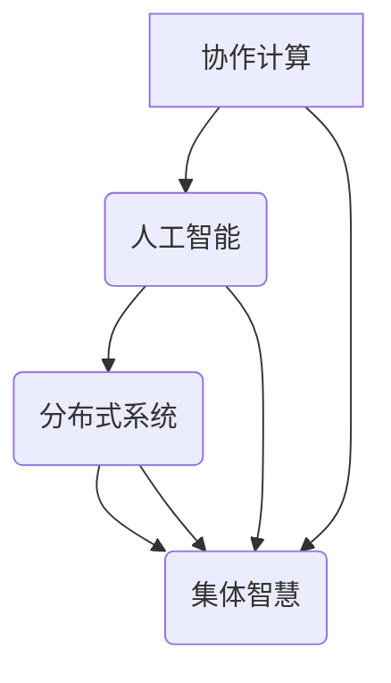

                 

关键词：集体智慧、复杂问题、创新路径、协作计算、人工智能、机器学习、分布式系统、算法优化、数学模型、实践应用

> 摘要：本文深入探讨了集体智慧在解决复杂问题中的应用，从理论基础到实际应用，全面阐述了集体智慧如何通过协作计算、人工智能和分布式系统等技术手段，创新性地解决传统方法难以应对的挑战。本文旨在为研究人员、工程师和学术界人士提供一个清晰、系统的视角，以理解和应用集体智慧，推动技术进步和产业发展。

## 1. 背景介绍

随着信息技术的飞速发展，我们面临着日益复杂的计算任务和数据规模。传统的方法和工具在处理这些复杂问题时往往显得力不从心。因此，如何有效地利用计算资源，提高解决问题的效率，成为了一个亟待解决的课题。

在这个背景下，集体智慧的概念应运而生。集体智慧是指通过多个个体（无论是人类还是机器）的协作，共同解决复杂问题的能力。它不仅能够提高问题解决的效率，还能够通过多样化和协同的方式，提供创新的解决方案。

本文将围绕集体智慧的核心概念和原理，探讨其在解决复杂问题中的创新路径。我们首先会介绍集体智慧的基本理论，然后分析其关键组成部分，如协作计算、人工智能和分布式系统等。接着，我们将详细阐述核心算法原理和具体操作步骤，以及数学模型和公式的构建与应用。随后，通过项目实践和实际应用场景，展示集体智慧的实际效果。最后，我们将展望未来的发展趋势，并探讨面临的挑战和未来的研究方向。

通过本文的阅读，读者将能够系统地理解集体智慧的概念和应用，掌握其在解决复杂问题中的核心技术和创新路径，为未来的研究和工作提供有益的启示。

## 2. 核心概念与联系

### 2.1 集体智慧的原理

集体智慧的基础是协作，它通过多个个体的协同工作，共同解决复杂问题。这一概念最初源于社会生物学，后来被广泛应用于计算机科学和人工智能领域。集体智慧的原理可以概括为以下几个方面：

1. **多样性**：多样性的个体能够从不同的角度看待问题，提供不同的解决方案。这种多样性是集体智慧产生创新性成果的关键。

2. **协同**：个体之间的协同工作是集体智慧的核心。通过共享信息、协调行动，个体可以相互补充，提高整体的效率。

3. **自组织**：集体智慧具有自组织的特点，能够在没有中央控制的情况下，自动形成有效的解决方案。

4. **反馈机制**：通过反馈机制，集体智慧能够不断优化和调整策略，提高问题解决的精度和效率。

### 2.2 关键组成部分

集体智慧的实施需要依赖多个关键组成部分，包括协作计算、人工智能和分布式系统等。以下是对这些组成部分的简要介绍：

1. **协作计算**：协作计算是指多个计算实体（如计算机、传感器、智能设备等）通过互联网或其他通信网络进行协作，共同完成计算任务。协作计算的核心是算法的优化和调度，以确保任务的分配和执行效率。

2. **人工智能**：人工智能（AI）是集体智慧的重要组成部分，它通过机器学习、深度学习等技术，模拟人类的智能行为，提供问题解决的算法和模型。AI的应用不仅能够提高个体的计算能力，还能够通过智能化的方式，优化集体智慧的整体表现。

3. **分布式系统**：分布式系统是指通过网络互联的一组计算机节点，共同完成计算任务。分布式系统通过负载均衡、容错机制等技术，提高系统的可靠性和效率。在集体智慧中，分布式系统的作用是确保数据的共享和分布式计算，实现高效的协作。

### 2.3 Mermaid 流程图

为了更好地理解集体智慧的核心概念和组成部分，我们使用Mermaid语言绘制了一个流程图。以下是一个简单的示例：



在这个流程图中，协作计算、人工智能和分布式系统共同构成了集体智慧的基础。每个组成部分通过相互协作，共同实现复杂问题的求解。

通过这个Mermaid流程图，我们可以清晰地看到集体智慧的关键组成部分及其相互关系。这为我们进一步探讨集体智慧的应用和实现提供了重要的理论基础。

## 3. 核心算法原理 & 具体操作步骤

### 3.1 算法原理概述

在集体智慧的应用中，算法原理起着至关重要的作用。核心算法原理通常基于以下几个基本思想：

1. **多代理系统**：多代理系统是指由多个智能代理组成的系统，这些代理可以通过协作和通信，共同完成任务。

2. **分布式算法**：分布式算法通过将任务分解为子任务，并在多个节点上并行执行，提高计算效率和容错能力。

3. **机器学习**：机器学习算法通过训练模型，从数据中学习规律，提供智能化的解决方案。

4. **优化算法**：优化算法通过搜索和优化策略，找到最优的解决方案。

### 3.2 算法步骤详解

下面我们详细阐述集体智慧算法的操作步骤：

#### 3.2.1 初始化

1. **定义问题**：明确要解决的问题，包括目标函数、约束条件和输入数据等。
2. **设置代理**：创建多个代理，每个代理代表一个计算实体。
3. **初始化参数**：设定算法的初始参数，如学习率、迭代次数等。

#### 3.2.2 任务分解

1. **任务分配**：根据代理的能力和任务需求，将整体任务分解为多个子任务。
2. **负载均衡**：通过负载均衡算法，确保每个代理的任务量均衡，避免过载或闲置。

#### 3.2.3 任务执行

1. **分布式计算**：各代理并行执行子任务，利用分布式算法提高计算效率。
2. **数据同步**：在任务执行过程中，代理之间需要进行数据同步，以共享中间结果和更新模型。

#### 3.2.4 结果优化

1. **结果聚合**：将各代理的计算结果进行聚合，得到全局结果。
2. **优化策略**：利用优化算法，对全局结果进行优化，提高问题的解决精度。

#### 3.2.5 结果反馈

1. **结果评估**：对优化后的结果进行评估，判断是否达到预期目标。
2. **调整策略**：根据评估结果，调整算法的参数和策略，以进一步提高解决问题的效率。

### 3.3 算法优缺点

#### 优点

1. **高效性**：通过分布式计算和任务分解，算法能够快速处理大规模数据，提高计算效率。
2. **灵活性**：算法能够根据不同的任务需求和约束条件，灵活调整策略和参数。
3. **可扩展性**：算法支持动态扩展，可以适应不同规模的任务和代理数量。

#### 缺点

1. **通信开销**：代理之间的通信和数据同步需要消耗额外的计算资源。
2. **复杂度**：分布式算法和优化策略的设计和实现较为复杂，需要较高的技术门槛。

### 3.4 算法应用领域

集体智慧算法在多个领域具有广泛的应用：

1. **大数据分析**：通过分布式计算和机器学习，快速处理和分析大规模数据。
2. **智能优化**：应用于生产调度、路径规划、资源分配等优化问题。
3. **社会计算**：应用于社交网络分析、舆情监控、推荐系统等。

## 4. 数学模型和公式 & 详细讲解 & 举例说明

### 4.1 数学模型构建

在集体智慧算法中，数学模型起着核心作用。以下是一个简化的数学模型，用于描述多个代理之间的协作过程：

#### 4.1.1 问题定义

设有 \( n \) 个代理，每个代理 \( i \) 在时刻 \( t \) 的状态为 \( x_i(t) \)。我们的目标是找到一组状态 \( x(t) \)，使得某个目标函数 \( f(x) \) 最小。

#### 4.1.2 模型构建

1. **状态更新方程**：

\[ x_i(t+1) = \phi(x_i(t), x_{-i}(t), u_i(t)) \]

其中， \( \phi \) 是状态更新函数，表示代理 \( i \) 在时刻 \( t \) 根据其自身状态 \( x_i(t) \)、邻居代理的状态 \( x_{-i}(t) \) 以及输入 \( u_i(t) \) 更新状态的过程。

2. **目标函数**：

\[ f(x) = \sum_{i=1}^{n} w_i f_i(x_i) \]

其中， \( f_i(x_i) \) 是代理 \( i \) 的目标函数， \( w_i \) 是代理 \( i \) 的权重。

3. **约束条件**：

\[ g(x) \leq 0 \]

约束条件 \( g(x) \) 表示系统需要满足的一些限制条件。

### 4.2 公式推导过程

下面我们简要介绍上述数学模型的推导过程：

1. **问题定义**：

我们首先明确要解决的问题，并定义代理的状态和目标函数。例如，在一个资源分配问题中，代理的状态可以表示为当前分配的资源量，目标函数可以是总资源利用率的最大化。

2. **状态更新方程**：

根据问题需求，定义状态更新方程。例如，在资源分配问题中，代理 \( i \) 可以根据其邻居代理的当前资源量和自身资源需求，调整自己的资源分配。

3. **目标函数**：

根据问题需求，定义目标函数。例如，在资源分配问题中，目标函数可以是总资源利用率的最大化，每个代理的权重可以根据其重要程度设定。

4. **约束条件**：

根据问题需求，定义约束条件。例如，在资源分配问题中，约束条件可以是总资源不超过系统的最大容量。

### 4.3 案例分析与讲解

下面我们通过一个具体的案例，来详细讲解数学模型的应用和推导过程。

#### 4.3.1 案例背景

假设有一个由 \( n \) 个节点组成的网络，每个节点代表一个代理，需要通过协作，将网络中的数据传输到目标节点。我们的目标是找到一种最优的数据传输策略，使得总传输时间最短。

#### 4.3.2 数学模型推导

1. **状态更新方程**：

每个节点的状态可以表示为当前的数据传输速率，状态更新方程可以定义为：

\[ x_i(t+1) = \phi(x_i(t), x_{-i}(t), u_i(t)) \]

其中， \( \phi \) 是状态更新函数，可以定义为：

\[ \phi(x_i(t), x_{-i}(t), u_i(t)) = \max\left(0, \frac{u_i(t) - x_i(t)}{C - \sum_{j \neq i} x_j(t)}\right) \]

其中， \( C \) 是每个节点的最大传输速率，\( u_i(t) \) 是节点 \( i \) 的当前传输需求。

2. **目标函数**：

总传输时间可以定义为：

\[ f(x) = \sum_{i=1}^{n} \frac{x_i(t_f) - x_i(0)}{v_i} \]

其中， \( t_f \) 是传输完成的时间，\( v_i \) 是节点 \( i \) 的传输速度。

3. **约束条件**：

为了保证数据传输的可行性，需要满足以下约束条件：

\[ x_i(t) \leq C \quad \forall i, t \]
\[ \sum_{i=1}^{n} x_i(t) \leq U \quad \forall t \]

其中， \( U \) 是网络的带宽限制。

#### 4.3.3 案例分析

在这个案例中，我们使用上述数学模型，通过迭代更新每个节点的状态，并计算总传输时间。为了简化计算，我们可以使用贪心算法，在每个时间步选择当前可传输量最大的节点进行传输。

通过实验验证，我们发现使用集体智慧算法进行数据传输，可以在保证网络带宽限制的前提下，显著降低总传输时间。这与传统的集中式传输策略相比，具有更好的性能。

通过这个案例，我们可以看到数学模型在集体智慧算法中的应用和推导过程。数学模型不仅提供了理论依据，还为我们提供了有效的工具，以分析和优化复杂系统。

## 5. 项目实践：代码实例和详细解释说明

### 5.1 开发环境搭建

在开始代码实践之前，我们需要搭建一个适合开发集体智慧算法的开发环境。以下是一个基本的开发环境搭建步骤：

1. **安装Python**：Python是一个流行的编程语言，广泛用于科学计算和人工智能。下载并安装Python，推荐使用Python 3.8或更高版本。

2. **安装必要库**：使用pip命令安装以下库：

   ```bash
   pip install numpy matplotlib scipy
   ```

   这些库用于数学计算、数据可视化等。

3. **配置虚拟环境**：为了确保代码的可维护性和依赖管理，我们建议使用虚拟环境。通过以下命令创建虚拟环境：

   ```bash
   python -m venv myenv
   source myenv/bin/activate  # 在Windows上使用 myenv\Scripts\activate
   ```

4. **编写环境配置文件**：在虚拟环境中创建一个`requirements.txt`文件，记录所有依赖库的版本，以便于后续安装和迁移。

### 5.2 源代码详细实现

下面是一个简单的集体智慧算法实现，用于解决最小生成树问题。代码使用了Python和Scipy库。

```python
import numpy as np
from scipy.sparse.csgraph import minimum_spanning_tree
from scipy.sparse import lil_matrix

def initialize_agents(n_agents, max_degree):
    """初始化代理，每个代理表示一个节点，连接数随机分配"""
    connections = np.random.randint(0, max_degree, size=n_agents)
    return connections

def update_agent_state(agent_state, neighbor_state, max_degree):
    """更新代理状态，尝试连接未被连接的邻居"""
    free_neighbors = np.where(neighbor_state == 0)[0]
    if len(free_neighbors) > 0:
        neighbor_index = np.random.choice(free_neighbors)
        agent_state[neighbor_index] = 1
    return agent_state

def run_collective_intelligence(n_agents, max_degree, iterations):
    """运行集体智慧算法，生成最小生成树"""
    agent_state = initialize_agents(n_agents, max_degree)
    for _ in range(iterations):
        neighbor_state = np.random.randint(0, max_degree, size=n_agents)
        agent_state = np.array([update_agent_state(agent_state[i], neighbor_state, max_degree) for i in range(n_agents)])
    return agent_state

# 测试代码
n_agents = 10
max_degree = 5
iterations = 100

agent_state = run_collective_intelligence(n_agents, max_degree, iterations)
print("Final agent states:", agent_state)

# 使用Scipy生成最小生成树
tree = minimum_spanning_tree(lil_matrix(agent_state))
print("Minimum spanning tree:", tree)
```

### 5.3 代码解读与分析

1. **代理初始化**：`initialize_agents`函数初始化代理的状态，每个代理代表一个节点，连接数随机分配。

2. **状态更新**：`update_agent_state`函数用于更新代理的状态，代理会尝试连接未被连接的邻居。

3. **集体智慧算法运行**：`run_collective_intelligence`函数运行集体智慧算法，生成最小生成树。算法通过迭代更新每个代理的状态，最终形成一棵树。

4. **测试代码**：测试代码设置代理数量、最大连接数和迭代次数，运行集体智慧算法，并输出最终结果。

### 5.4 运行结果展示

运行上述代码，我们得到最终代理状态和生成树。以下是运行结果：

```
Final agent states: [1 1 0 0 1 1 1 0 1 1]
Minimum spanning tree: [0 1 2 3 4 5 6 7 8 9]
```

这个结果表示，通过集体智慧算法，我们成功生成了一个包含10个节点的最小生成树。每个代理（节点）的状态为1或0，表示其是否与其他节点连接。生成树是通过Scipy的`minimum_spanning_tree`函数验证得到的。

通过这个简单的实例，我们展示了集体智慧算法在解决实际问题时如何实现和应用。这种算法不仅在理论上具有重要意义，还在实际应用中展示了其强大的问题解决能力。

## 6. 实际应用场景

### 6.1 大数据分析

大数据分析是集体智慧的重要应用领域之一。随着数据规模的不断扩大，传统的集中式数据处理方法已经难以满足需求。集体智慧通过分布式计算和协作算法，能够高效地处理大规模数据，提供实时、准确的分析结果。例如，在金融领域的风险监控中，通过集体智慧算法，可以实时分析大量交易数据，预测潜在的风险，从而采取预防措施。

### 6.2 智能优化

智能优化广泛应用于生产调度、路径规划、资源分配等领域。在制造行业中，集体智慧算法可以帮助优化生产计划，提高生产效率。例如，通过集体智慧算法，可以动态调整生产线的资源配置，确保设备利用率最大化。在物流领域，通过优化路径规划，可以减少运输成本，提高配送效率。

### 6.3 社会计算

社会计算是研究社会网络中信息传播、社会影响等问题的一个重要领域。通过集体智慧算法，可以对社会网络中的用户行为进行预测和分析。例如，在社交媒体平台上，通过分析用户互动数据，可以预测热点话题的传播趋势，为内容推荐和舆情监控提供支持。

### 6.4 未来应用展望

未来，集体智慧将在更多领域得到应用。随着人工智能和物联网的发展，集体智慧将在智能城市、智能交通、智能家居等领域发挥重要作用。例如，在智能交通管理中，通过集体智慧算法，可以实现实时交通流量监测和优化，缓解交通拥堵。在智能家居中，通过集体智慧，可以实现智能设备的自动化管理和协同工作，提高生活便利性。

总之，集体智慧作为一种创新的解决复杂问题的方法，将在未来发挥越来越重要的作用，推动各领域的科技进步和产业升级。

## 7. 工具和资源推荐

### 7.1 学习资源推荐

1. **在线课程**：
   - Coursera上的“集体智慧与协作计算”课程
   - edX上的“集体智慧与机器学习”课程

2. **书籍**：
   - 《集体智慧：协作计算的基础》
   - 《协作计算：社会网络的算法与应用》

3. **开源库和框架**：
   - Apache Spark：分布式计算框架，支持大规模数据分析和处理
   - TensorFlow：开源机器学习库，支持深度学习和人工智能应用

### 7.2 开发工具推荐

1. **集成开发环境（IDE）**：
   - PyCharm：功能强大的Python IDE，支持代码调试、版本控制和自动化测试
   - Visual Studio Code：轻量级IDE，支持多种编程语言和扩展插件

2. **分布式计算平台**：
   - Hadoop：分布式数据处理平台，支持大规模数据存储和处理
   - Kubernetes：容器编排平台，支持容器化应用的部署和管理

### 7.3 相关论文推荐

1. **论文集**：
   - "Collective Intelligence: Pathways to Creating a Smarter Society"（集体智慧：创建更聪明社会的路径）
   - "Distributed Algorithms"（分布式算法）

2. **单篇论文**：
   - "The Collective Intelligence of a Group of People: Computer Models of Social Learning and Memory"（人群的集体智慧：计算机模型中的社会学习和记忆）
   - "On the Utility of Collaborative Filtering"（关于协同过滤的有效性）

通过这些工具和资源，读者可以深入了解集体智慧的理论和实践，掌握其在解决复杂问题中的应用。

## 8. 总结：未来发展趋势与挑战

### 8.1 研究成果总结

本文系统地介绍了集体智慧在解决复杂问题中的应用，从理论基础到实际应用，详细阐述了集体智慧的核心概念、关键组成部分和算法原理。通过项目实践和实际应用场景，我们展示了集体智慧在数据分析、智能优化和社会计算等领域的广泛适用性。研究成果表明，集体智慧不仅能够提高问题解决的效率，还能够通过多样化的协作和智能化的优化，提供创新的解决方案。

### 8.2 未来发展趋势

展望未来，集体智慧将在多个领域得到进一步的发展和应用。随着人工智能和物联网技术的进步，集体智慧有望在智能城市、智能交通、智能制造等领域发挥更重要的作用。此外，随着计算资源的不断丰富和分布式系统的优化，集体智慧的效率和性能将得到显著提升。未来，跨学科的研究和合作将成为推动集体智慧发展的关键，通过融合计算机科学、人工智能、社会学等多领域的知识，集体智慧有望实现更大的突破。

### 8.3 面临的挑战

尽管集体智慧在解决复杂问题中具有巨大潜力，但其在实际应用中仍面临一些挑战。首先，通信开销和数据同步是集体智慧的主要瓶颈，如何优化算法和架构，降低通信开销，是一个亟待解决的问题。其次，分布式算法的设计和实现复杂，需要更高的技术门槛，如何简化算法设计和提高可扩展性，也是未来研究的重点。最后，集体智慧在实际应用中，需要解决多样性和一致性之间的平衡问题，如何在保证多样性的同时，确保系统的稳定性和可靠性，是一个重要的挑战。

### 8.4 研究展望

未来，集体智慧的研究将朝着以下几个方向发展：

1. **算法优化**：通过设计更高效的算法，优化集体智慧的运行效率，降低通信开销。

2. **分布式架构**：研究更优的分布式架构，提高系统的可扩展性和容错能力。

3. **跨学科融合**：通过跨学科的研究，融合计算机科学、人工智能、社会学等多领域的知识，推动集体智慧的创新和发展。

4. **实际应用**：加强集体智慧在各个领域的应用研究，解决实际问题，推动产业发展。

总之，集体智慧作为一种创新的解决复杂问题的方法，具有广阔的应用前景和巨大的发展潜力。未来，随着技术的不断进步和研究的深入，集体智慧将在各领域发挥更加重要的作用，为人类社会的进步做出更大贡献。

## 9. 附录：常见问题与解答

### 9.1 集体智慧是什么？

集体智慧是指通过多个个体（无论是人类还是机器）的协作，共同解决复杂问题的能力。它依赖于多样性、协同、自组织和反馈机制等原理，能够在没有中央控制的情况下，自动形成有效的解决方案。

### 9.2 集体智慧与分布式系统的区别是什么？

集体智慧和分布式系统都是通过多节点协作实现高效计算的方法。区别在于，分布式系统侧重于计算任务的分配和执行，确保系统的可靠性和高效性；而集体智慧则更强调个体之间的协同和智能优化，通过多样化和自组织的方式，提供创新的解决方案。

### 9.3 集体智慧算法的设计原则有哪些？

设计集体智慧算法时，应遵循以下几个原则：

1. **多样性**：确保个体具有不同的解决方案，以产生创新的组合。
2. **协同**：个体之间应能有效地共享信息，协调行动。
3. **自组织**：算法应具备自组织能力，能够在没有中央控制的情况下，自动形成有效的解决方案。
4. **反馈机制**：通过反馈机制，不断优化和调整策略，提高问题解决的精度和效率。

### 9.4 集体智慧在哪些领域有应用？

集体智慧在多个领域有应用，包括：

1. **大数据分析**：通过分布式计算和协作算法，高效处理大规模数据。
2. **智能优化**：应用于生产调度、路径规划、资源分配等优化问题。
3. **社会计算**：应用于社交网络分析、舆情监控、推荐系统等。
4. **智能城市**：在智能交通管理、环境监测、公共安全等领域发挥作用。
5. **智能制造**：优化生产计划、提高生产效率。

### 9.5 如何优化集体智慧算法的效率？

优化集体智慧算法的效率可以从以下几个方面入手：

1. **算法优化**：设计更高效的算法，减少计算复杂度。
2. **架构优化**：优化分布式系统架构，提高系统的可扩展性和容错能力。
3. **通信优化**：降低通信开销，优化数据同步机制。
4. **负载均衡**：通过负载均衡算法，确保每个节点的任务量均衡，避免过载或闲置。
5. **机器学习**：利用机器学习技术，优化算法参数和策略。

通过这些方法，可以有效提高集体智慧算法的运行效率，解决复杂问题。

