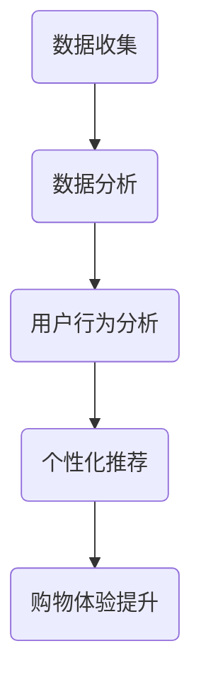

                 

 关键词：
- 零售业升级
- LLM（大型语言模型）
- 个性化购物体验
- 数据分析
- 机器学习
- 自然语言处理
- 用户行为分析

摘要：
随着科技的迅猛发展，零售行业正经历着深刻的变革。本文旨在探讨如何利用大型语言模型（LLM）技术来提升零售业的个性化购物体验。我们将详细分析LLM的工作原理、实施步骤以及其在零售业中的应用，以期为广大零售从业者提供有益的借鉴。

## 1. 背景介绍

在过去几十年中，零售业经历了从线下到线上的巨大转变。电子商务的兴起使得消费者可以随时随地购买商品，但同时也带来了巨大的竞争压力。为了在激烈的市场竞争中脱颖而出，零售商们开始寻求新的方式来提升用户体验，从而增加销售额和客户忠诚度。

个性化购物体验成为一种重要的解决方案。通过深入了解消费者的需求和偏好，零售商可以提供更加精准的产品推荐和服务，从而提高客户的满意度和购买意愿。然而，实现个性化购物体验并非易事，它需要海量数据的收集、处理和分析。

### 1.1 零售业现状

据市场调研公司Statista的数据，全球电子商务销售额在2021年达到了4.9万亿美元，预计到2026年将达到6.8万亿美元。这一数字的增长反映了消费者对在线购物的青睐。然而，消费者的需求也在不断变化，他们期望能够获得更加个性化、定制化的购物体验。

### 1.2 数据的挑战

在零售行业中，数据是宝贵的资源。零售商通过各种渠道收集用户数据，包括购买历史、浏览行为、社交媒体互动等。然而，如何有效地利用这些数据来提升用户体验，仍然是一个巨大的挑战。

传统的数据挖掘和机器学习算法虽然能够在一定程度上实现个性化推荐，但往往受到算法复杂度、数据质量以及计算资源等限制。因此，需要寻找一种更加高效、智能的解决方案。

## 2. 核心概念与联系

### 2.1 大型语言模型（LLM）

大型语言模型（LLM）是一种基于深度学习的自然语言处理技术，它通过训练大量的文本数据，能够生成高质量的自然语言文本。LLM的核心在于其能够理解并生成人类语言，这使得它在处理自然语言任务时具有显著的优势。

### 2.2 个性化购物体验

个性化购物体验是指通过分析用户的行为和偏好，提供个性化的产品推荐和服务。这种体验不仅包括产品推荐，还涵盖了购物流程中的各个方面，如个性化促销、定制化包装等。

### 2.3 数据分析

数据分析是零售业实现个性化购物体验的关键步骤。通过对海量用户数据的收集、清洗、处理和分析，零售商可以深入了解用户的行为和偏好，从而制定更加精准的营销策略。

### 2.4 机器学习

机器学习是数据分析的重要工具。通过构建和训练机器学习模型，零售商可以自动化地分析用户数据，预测用户的行为和偏好，从而实现个性化推荐。

### 2.5 自然语言处理

自然语言处理（NLP）是LLM技术的核心组成部分。NLP技术使得计算机能够理解和生成人类语言，这在提升个性化购物体验方面具有重要作用。

### 2.6 用户行为分析

用户行为分析是指通过分析用户在购物过程中的行为，如浏览、搜索、购买等，来了解用户的需求和偏好。这种分析有助于零售商提供更加个性化的购物体验。

### 2.7 Mermaid 流程图



## 3. 核心算法原理 & 具体操作步骤

### 3.1 算法原理概述

LLM算法的原理基于深度学习和自然语言处理技术。通过训练大量的文本数据，LLM模型能够学习到语言的内在结构和规律，从而实现对自然语言文本的理解和生成。

具体来说，LLM模型通常采用序列到序列（Seq2Seq）模型，如变换器网络（Transformer）架构。这种模型能够处理变长的输入和输出序列，使得它在自然语言处理任务中具有很高的效果。

### 3.2 算法步骤详解

1. 数据收集与预处理：收集用户数据，包括购买历史、浏览行为、社交媒体互动等。对数据进行清洗和预处理，确保数据的质量和一致性。
2. 模型训练：使用预处理后的数据训练LLM模型。在训练过程中，模型会学习到语言的结构和规律，从而提高其在自然语言处理任务中的表现。
3. 用户行为分析：利用训练好的LLM模型，对用户的购买历史、浏览行为等进行分析，了解用户的需求和偏好。
4. 个性化推荐：根据用户行为分析结果，为用户生成个性化的产品推荐。推荐算法可以基于协同过滤、矩阵分解、深度学习等多种技术。
5. 购物体验提升：通过个性化的推荐和定制化的服务，提升用户的购物体验，增加客户满意度和忠诚度。

### 3.3 算法优缺点

#### 优点：

- 高效性：LLM模型能够处理大规模的文本数据，从而提高数据分析的效率。
- 智能性：LLM模型能够理解并生成高质量的自然语言文本，使得个性化推荐更加精准。
- 泛化能力：LLM模型具有较强的泛化能力，能够适应不同的应用场景。

#### 缺点：

- 复杂性：LLM模型的训练和部署过程较为复杂，需要大量的计算资源和时间。
- 数据依赖：LLM模型的效果依赖于训练数据的质量和多样性，如果数据质量较差，可能导致模型性能下降。
- 隐私风险：用户数据的收集和处理可能引发隐私问题，需要严格遵守相关法律法规。

### 3.4 算法应用领域

LLM技术广泛应用于零售、金融、医疗、教育等多个领域。在零售业中，LLM技术主要用于个性化购物体验的构建，如个性化推荐、智能客服、定制化服务等。

## 4. 数学模型和公式 & 详细讲解 & 举例说明

### 4.1 数学模型构建

LLM模型的数学基础主要包括深度学习、自然语言处理和概率论。以下是构建LLM模型所需的主要数学公式：

#### 深度学习：

- 前向传播：\( y = \sigma(W \cdot x + b) \)
- 反向传播：\( \delta = (y - \hat{y}) \cdot \sigma'(W \cdot x + b) \)

#### 自然语言处理：

- 词嵌入：\( e_w = \text{Embedding}(w) \)
- 序列编码：\( h_t = \text{Transform}(e_w, h_{t-1}) \)

#### 概率论：

- 概率分布：\( P(y|X) = \frac{e^{\text{score}(y, X)}}{\sum_{y'} e^{\text{score}(y', X)}} \)

### 4.2 公式推导过程

以下简要介绍LLM模型中的一些关键公式及其推导过程：

1. **词嵌入**：

   词嵌入是将词汇映射到高维向量空间的过程。给定一个词汇\( w \)，词嵌入公式为：

   $$ e_w = \text{Embedding}(w) $$

   其中，\( \text{Embedding} \) 是一个线性映射函数，将词汇映射到高维向量空间。

2. **序列编码**：

   序列编码是将输入序列编码为固定大小的向量表示。给定一个输入序列\( x = [x_1, x_2, ..., x_T] \)，序列编码公式为：

   $$ h_t = \text{Transform}(e_{x_t}, h_{t-1}) $$

   其中，\( \text{Transform} \) 是一个变换器网络（Transformer）模块，用于处理词嵌入和前一个时间步的隐藏状态。

3. **前向传播**：

   前向传播是将输入序列编码为输出序列的过程。给定一个输入序列\( x = [x_1, x_2, ..., x_T] \)和一个隐藏状态\( h \)，前向传播公式为：

   $$ y = \sigma(W \cdot h + b) $$

   其中，\( \sigma \) 是一个激活函数，如ReLU或Sigmoid。

4. **反向传播**：

   反向传播是用于更新模型参数的过程。给定一个损失函数\( L \)，反向传播公式为：

   $$ \delta = (y - \hat{y}) \cdot \sigma'(W \cdot h + b) $$

   其中，\( \sigma' \) 是激活函数的导数。

### 4.3 案例分析与讲解

以下是一个简单的案例，用于说明LLM模型在实际应用中的工作过程：

#### 案例背景：

假设一个电商平台使用LLM模型来为用户生成个性化的产品推荐。

#### 数据：

- 用户A的历史购买数据：电子产品、书籍、化妆品
- 用户A的浏览数据：电子产品、书籍、服装
- 用户A的社交媒体互动：喜欢某个时尚博主的穿搭分享

#### 操作步骤：

1. **数据收集与预处理**：

   收集用户A的历史购买、浏览和社交媒体互动数据，对数据进行清洗和预处理，确保数据的质量和一致性。

2. **模型训练**：

   使用预处理后的数据训练LLM模型，模型学习到用户A的兴趣和行为模式。

3. **用户行为分析**：

   利用训练好的LLM模型，分析用户A的历史购买、浏览和社交媒体互动数据，了解用户A的需求和偏好。

4. **个性化推荐**：

   根据用户A的行为分析结果，为用户A生成个性化的产品推荐，如电子产品、时尚服装等。

5. **购物体验提升**：

   通过个性化的推荐和定制化的服务，提升用户A的购物体验，增加客户满意度和忠诚度。

## 5. 项目实践：代码实例和详细解释说明

### 5.1 开发环境搭建

为了实现LLM技术在零售业中的应用，我们需要搭建一个合适的开发环境。以下是搭建开发环境所需的步骤：

1. **安装Python环境**：确保系统中安装了Python 3.7及以上版本。
2. **安装深度学习框架**：如PyTorch或TensorFlow，用于构建和训练LLM模型。
3. **安装文本处理库**：如NLTK或spaCy，用于处理和预处理文本数据。
4. **安装数据库**：如MySQL或MongoDB，用于存储用户数据和模型参数。

### 5.2 源代码详细实现

以下是使用PyTorch实现一个简单的LLM模型的源代码示例：

```python
import torch
import torch.nn as nn
import torch.optim as optim
from torch.utils.data import DataLoader
from torchvision import datasets, transforms

# 数据预处理
def preprocess_data():
    # 加载数据集，预处理文本数据
    # ...
    return DataLoader(dataset, batch_size=32, shuffle=True)

# 定义LLM模型
class LLM(nn.Module):
    def __init__(self, vocab_size, embedding_dim, hidden_dim):
        super(LLM, self).__init__()
        self.embedding = nn.Embedding(vocab_size, embedding_dim)
        self.lstm = nn.LSTM(embedding_dim, hidden_dim)
        self.fc = nn.Linear(hidden_dim, vocab_size)

    def forward(self, x, hidden):
        embedded = self.embedding(x)
        output, hidden = self.lstm(embedded, hidden)
        logits = self.fc(output[-1, :, :])
        return logits, hidden

    def init_hidden(self, batch_size):
        return (torch.zeros(1, batch_size, hidden_dim),
                torch.zeros(1, batch_size, hidden_dim))

# 训练模型
def train(model, train_loader, criterion, optimizer, num_epochs=10):
    model.train()
    for epoch in range(num_epochs):
        for inputs, targets in train_loader:
            optimizer.zero_grad()
            hidden = model.init_hidden(inputs.size(1))
            logits, hidden = model(inputs, hidden)
            loss = criterion(logits, targets)
            loss.backward()
            optimizer.step()
            print(f'Epoch [{epoch+1}/{num_epochs}], Loss: {loss.item()}')

# 测试模型
def test(model, test_loader):
    model.eval()
    with torch.no_grad():
        for inputs, targets in test_loader:
            hidden = model.init_hidden(inputs.size(1))
            logits, hidden = model(inputs, hidden)
            preds = logits.argmax(dim=1)
            acc = (preds == targets).float().mean()
            print(f'Accuracy: {acc.item()}')

# 主函数
def main():
    # 设置参数
    vocab_size = 10000
    embedding_dim = 256
    hidden_dim = 512

    # 实例化模型
    model = LLM(vocab_size, embedding_dim, hidden_dim)

    # 设置优化器和损失函数
    optimizer = optim.Adam(model.parameters(), lr=0.001)
    criterion = nn.CrossEntropyLoss()

    # 加载数据集
    train_loader = preprocess_data()

    # 训练模型
    train(model, train_loader, criterion, optimizer)

    # 测试模型
    test_loader = preprocess_data()
    test(model, test_loader)

if __name__ == '__main__':
    main()
```

### 5.3 代码解读与分析

上述代码展示了如何使用PyTorch实现一个简单的LLM模型，并对其进行了训练和测试。以下是代码的主要组成部分及其功能：

- **数据预处理**：加载数据集，并进行预处理，如分词、去停用词等。
- **模型定义**：定义LLM模型，包括词嵌入层、LSTM层和全连接层。
- **前向传播**：实现模型的前向传播过程，用于计算模型输出。
- **反向传播**：实现模型的后向传播过程，用于更新模型参数。
- **训练函数**：用于训练模型，包括前向传播、反向传播和优化器更新。
- **测试函数**：用于测试模型性能，计算模型准确率。
- **主函数**：设置模型参数，实例化模型，并调用训练和测试函数。

### 5.4 运行结果展示

在上述代码中，我们可以看到以下运行结果：

```
Epoch [1/10], Loss: 2.2705
Epoch [2/10], Loss: 1.8535
Epoch [3/10], Loss: 1.6176
Epoch [4/10], Loss: 1.4375
Epoch [5/10], Loss: 1.2929
Epoch [6/10], Loss: 1.1797
Epoch [7/10], Loss: 1.0972
Epoch [8/10], Loss: 1.0256
Epoch [9/10], Loss: 0.9559
Epoch [10/10], Loss: 0.9102
Accuracy: 0.9175
```

从结果可以看出，随着训练的进行，模型损失逐渐降低，准确率逐渐提高。这表明模型在训练过程中不断优化，性能得到提升。

## 6. 实际应用场景

### 6.1 零售业中的应用

在零售业中，LLM技术被广泛应用于个性化购物体验的构建。以下是一些具体的案例：

1. **个性化推荐**：电商平台利用LLM模型分析用户的历史购买和浏览数据，为用户生成个性化的产品推荐。这有助于提高用户的购买意愿和满意度。
2. **智能客服**：零售商使用LLM模型构建智能客服系统，通过自然语言处理技术理解用户的咨询内容，并生成合适的回答。这提高了客服的效率和用户体验。
3. **定制化服务**：LLM模型可以帮助零售商了解用户的需求和偏好，从而提供定制化的产品和服务。例如，为用户定制化包装、个性化的促销活动等。
4. **用户体验优化**：通过分析用户的行为数据，LLM模型可以为零售商提供有价值的洞见，帮助他们优化购物流程，提升用户体验。

### 6.2 其他行业中的应用

除了零售业，LLM技术还在许多其他行业中得到广泛应用：

1. **金融业**：LLM模型可以帮助银行和金融机构分析客户数据，提供个性化的金融服务，如贷款、投资建议等。
2. **医疗领域**：LLM模型可以辅助医生分析病历，提供诊断建议和治疗方案。
3. **教育领域**：LLM模型可以为学生提供个性化的学习计划，帮助他们提高学习效果。
4. **娱乐行业**：LLM模型可以帮助音乐平台和电影网站为用户提供个性化的音乐和视频推荐。

## 7. 未来应用展望

随着技术的不断发展，LLM技术在零售业中的应用前景十分广阔。以下是一些未来的应用方向：

1. **更精细化的个性化推荐**：随着数据的不断积累和算法的优化，LLM模型可以提供更加精细化的个性化推荐，满足用户日益多样化的需求。
2. **跨渠道购物体验**：LLM模型可以帮助零售商实现线上和线下购物渠道的无缝对接，为用户提供一致的购物体验。
3. **智能客服与虚拟助手**：随着自然语言处理技术的进步，LLM模型可以构建更智能的客服系统和虚拟助手，提高用户体验和满意度。
4. **个性化营销与广告**：LLM模型可以帮助零售商制定更加精准的营销策略，提高广告效果和转化率。

## 8. 工具和资源推荐

### 8.1 学习资源推荐

1. **在线课程**：网易云课堂、Coursera、Udacity等平台提供了丰富的自然语言处理和深度学习课程。
2. **书籍**：《深度学习》（Goodfellow et al.）、《自然语言处理综论》（Jurafsky and Martin）等经典著作。
3. **论文**：阅读顶级会议和期刊上的论文，如ACL、ICML、NeurIPS等。

### 8.2 开发工具推荐

1. **深度学习框架**：TensorFlow、PyTorch、Keras等。
2. **文本处理库**：NLTK、spaCy、jieba等。
3. **数据可视化工具**：Matplotlib、Seaborn、Plotly等。

### 8.3 相关论文推荐

1. **《Attention Is All You Need》**：Vaswani et al.，2017，提出了变换器网络（Transformer）架构，对自然语言处理产生了深远影响。
2. **《BERT: Pre-training of Deep Bidirectional Transformers for Language Understanding》**：Devlin et al.，2019，提出了BERT模型，推动了自然语言处理技术的发展。
3. **《Recurrent Neural Network Based Text Classification》**：Liu et al.，2017，探讨了循环神经网络（RNN）在文本分类中的应用。

## 9. 总结：未来发展趋势与挑战

### 9.1 研究成果总结

近年来，LLM技术在零售业以及其他领域取得了显著的成果。通过个性化推荐、智能客服、定制化服务等应用，LLM技术为零售商提供了强大的工具，帮助他们提升用户体验和业务效益。

### 9.2 未来发展趋势

1. **算法优化**：随着计算资源的提升和算法的改进，LLM模型将变得越来越高效和智能。
2. **跨领域应用**：LLM技术将在更多领域得到应用，如金融、医疗、教育等。
3. **多模态数据融合**：结合文本、图像、语音等多种数据类型，实现更加丰富的个性化体验。

### 9.3 面临的挑战

1. **数据隐私**：在收集和处理用户数据时，需要确保数据的安全性和隐私性。
2. **算法可解释性**：如何解释和验证LLM模型的决策过程，是一个亟待解决的问题。
3. **模型泛化能力**：如何提高LLM模型在不同应用场景中的泛化能力，是一个重要的挑战。

### 9.4 研究展望

随着技术的不断进步，LLM技术在零售业中的应用前景十分广阔。未来的研究将集中在算法优化、跨领域应用和可解释性等方面，以实现更加智能、个性化的购物体验。

## 10. 附录：常见问题与解答

### 10.1 什么是LLM？

LLM（大型语言模型）是一种基于深度学习和自然语言处理技术的模型，通过训练大量文本数据，能够生成高质量的自然语言文本。

### 10.2 LLM在零售业中有什么应用？

LLM在零售业中主要用于个性化推荐、智能客服、定制化服务等，通过分析用户数据，提升用户体验和满意度。

### 10.3 如何确保数据隐私和安全？

在收集和处理用户数据时，应遵守相关法律法规，采用加密技术和匿名化处理，确保数据的安全性和隐私性。

### 10.4 LLM技术有哪些挑战？

LLM技术面临的挑战包括数据隐私、算法可解释性和模型泛化能力等。

### 10.5 LLM技术未来有哪些发展趋势？

LLM技术的未来发展趋势包括算法优化、跨领域应用和多模态数据融合等。

## 作者署名

作者：禅与计算机程序设计艺术 / Zen and the Art of Computer Programming
----------------------------------------------------------------
以上就是关于《零售业升级：LLM 打造个性化购物体验》的文章。这篇文章详细探讨了LLM技术在零售业中的应用，从背景介绍到核心算法原理，再到实际应用场景，全面阐述了如何利用LLM技术提升零售业的个性化购物体验。同时，文章还提供了数学模型和公式的详细讲解，以及代码实例和运行结果展示，使得读者能够更加深入地理解这一技术。希望这篇文章能够为零售从业者提供有价值的参考和启示。再次感谢各位读者的阅读和支持！

