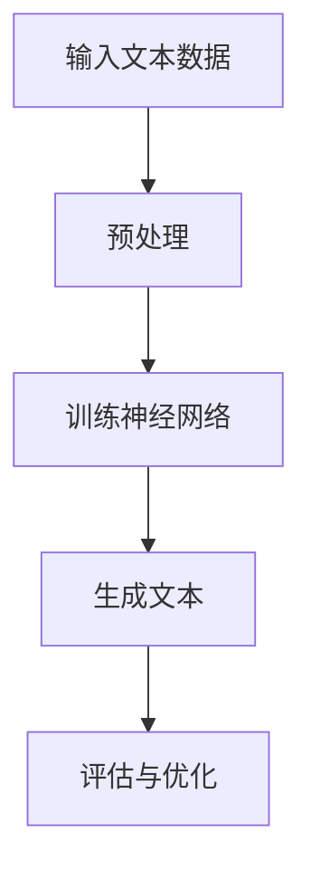
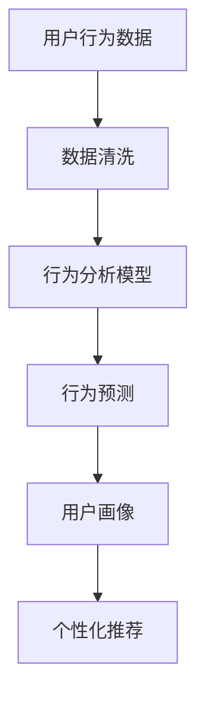
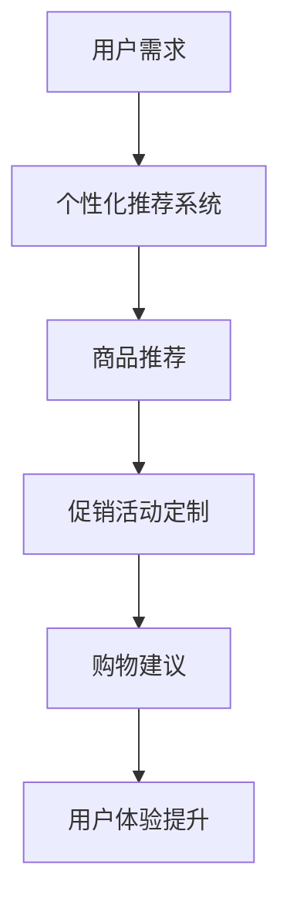

                 

关键词：零售，LLM，个性化购物，人工智能，机器学习，用户行为分析，商业策略，用户体验优化。

> 摘要：本文探讨了大型语言模型（LLM）在零售业中的应用，特别是在创造个性化购物体验方面的潜力。通过分析LLM的核心原理、算法模型及其在零售行业的具体应用，文章旨在揭示LLM如何通过深度理解用户行为和需求，从而推动零售业迈向更加智能和个性化的未来。

## 1. 背景介绍

零售业是现代经济的核心，其发展与消费者体验紧密相关。在过去的几十年中，零售业经历了从传统的实体店销售到电子商务的转型。然而，无论销售渠道如何变化，消费者对于个性化服务和优质体验的追求始终未变。随着人工智能（AI）和机器学习（ML）技术的迅猛发展，特别是大型语言模型（LLM）的出现，零售业迎来了新的变革契机。

LLM，作为一种先进的自然语言处理（NLP）技术，具有处理和理解人类语言的能力。它通过深度学习技术从大量的文本数据中学习，能够生成高质量的文本、回答问题、进行对话等。LLM的这些能力使得它在零售业中有广泛的应用潜力，特别是在提供个性化购物体验方面。

## 2. 核心概念与联系

### 2.1. LLM的定义和原理

LLM（Large Language Model）是一种基于深度学习的自然语言处理模型，它通过大量的文本数据进行训练，以实现对文本内容的理解和生成。LLM的核心原理是神经网络，特别是变分自编码器（VAE）和生成对抗网络（GAN）的应用。这些神经网络通过不断调整权重和偏置，使得模型能够捕捉到文本数据的复杂结构。

**Mermaid流程图：**



### 2.2. 用户行为分析

在零售业中，用户行为分析是指通过收集和分析用户在购物过程中的各种行为数据，如浏览历史、购买记录、点击率等，来了解用户的需求和偏好。用户行为分析是构建个性化购物体验的重要基础。

**Mermaid流程图：**



### 2.3. 个性化购物体验

个性化购物体验是指根据用户的需求和偏好，为用户提供定制化的商品推荐、促销活动、购物建议等。个性化购物体验能够提高用户满意度和忠诚度，从而提升零售企业的竞争力。

**Mermaid流程图：**



## 3. 核心算法原理 & 具体操作步骤

### 3.1. 算法原理概述

LLM的核心算法是神经网络，特别是自注意力机制（Self-Attention）的应用。自注意力机制使得模型能够自动学习文本中的重要信息，从而提高对文本内容的理解和生成能力。

**算法步骤：**

1. 数据预处理：对用户行为数据和商品数据（如描述、标签等）进行清洗和标准化。
2. 训练模型：使用预训练的LLM模型，结合用户行为数据，训练个性化推荐模型。
3. 推荐生成：根据用户需求，生成个性化的商品推荐列表。
4. 评估与优化：通过用户反馈和数据评估，优化推荐模型。

### 3.2. 算法步骤详解

1. **数据预处理：** 对用户行为数据和商品数据进行清洗，去除缺失值和异常值，然后进行数据标准化处理。
2. **模型训练：** 使用预训练的LLM模型，如GPT-3或BERT，结合用户行为数据，通过训练优化模型的参数，使其能够准确预测用户需求。
3. **推荐生成：** 根据用户需求和模型预测，生成个性化的商品推荐列表。推荐算法可以采用基于协同过滤、内容推荐和深度学习等多种方法。
4. **评估与优化：** 通过用户反馈和数据评估，对推荐模型进行持续优化，提高推荐质量和用户体验。

### 3.3. 算法优缺点

**优点：**

- **个性化强：** LLM能够深入理解用户需求，生成高度个性化的推荐。
- **灵活性好：** 可以结合多种推荐算法，灵活调整推荐策略。
- **扩展性强：** 可以应用于各种零售场景，如电子商务、实体店销售等。

**缺点：**

- **计算成本高：** LLM模型的训练和推理需要大量计算资源。
- **数据依赖性：** 推荐效果高度依赖于用户行为数据的质量。

### 3.4. 算法应用领域

LLM在零售业的应用非常广泛，包括：

- **个性化推荐：** 根据用户需求和偏好，生成个性化的商品推荐。
- **智能客服：** 通过对话生成技术，提供智能客服服务，提高用户满意度。
- **智能促销：** 根据用户需求和促销效果，定制个性化的促销活动。
- **用户画像：** 分析用户行为，构建用户画像，为营销策略提供支持。

## 4. 数学模型和公式 & 详细讲解 & 举例说明

### 4.1. 数学模型构建

在个性化购物体验中，常用的数学模型包括线性回归、逻辑回归和神经网络等。

- **线性回归模型：**
  $$ y = \beta_0 + \beta_1 x $$
  
  其中，$y$ 是预测值，$\beta_0$ 和 $\beta_1$ 是模型参数。

- **逻辑回归模型：**
  $$ P(y=1) = \frac{1}{1 + e^{-(\beta_0 + \beta_1 x)}} $$
  
  其中，$P(y=1)$ 是预测概率，$e$ 是自然对数的底。

- **神经网络模型：**
  $$ a^{(l)} = \sigma(z^{(l)}) $$
  
  其中，$a^{(l)}$ 是输出值，$z^{(l)}$ 是输入值，$\sigma$ 是激活函数。

### 4.2. 公式推导过程

以线性回归模型为例，推导过程如下：

1. **目标函数：**
   $$ J(\theta) = \frac{1}{2m} \sum_{i=1}^{m} (h_\theta(x^{(i)}) - y^{(i)})^2 $$
   
   其中，$m$ 是样本数量，$h_\theta(x^{(i)})$ 是预测值，$y^{(i)}$ 是真实值。

2. **梯度下降：**
   $$ \theta_j := \theta_j - \alpha \frac{\partial J(\theta)}{\partial \theta_j} $$
   
   其中，$\alpha$ 是学习率。

3. **优化解：**
   $$ \theta = (X^TX)^{-1}X^TY $$

### 4.3. 案例分析与讲解

假设有一个零售企业，其用户行为数据包括浏览历史、购买记录和点击率等。我们使用线性回归模型预测用户的下一步行为。

1. **数据预处理：**
   对数据进行归一化处理，使其在相同的尺度上进行建模。

2. **模型训练：**
   使用梯度下降法训练线性回归模型，优化模型参数。

3. **预测生成：**
   根据用户当前的行为特征，使用训练好的模型预测用户的下一步行为。

4. **评估与优化：**
   使用交叉验证法评估模型性能，根据评估结果调整模型参数。

## 5. 项目实践：代码实例和详细解释说明

### 5.1. 开发环境搭建

- **Python环境：** 安装Python 3.8及以上版本。
- **依赖库：** 安装numpy、pandas、scikit-learn等库。

### 5.2. 源代码详细实现

以下是一个简单的线性回归模型的Python代码实现：

```python
import numpy as np
import pandas as pd
from sklearn.linear_model import LinearRegression

# 数据加载
data = pd.read_csv('user_behavior.csv')
X = data[['browse_history', 'purchase_record', 'click_rate']]
y = data['next_action']

# 模型训练
model = LinearRegression()
model.fit(X, y)

# 预测生成
predictions = model.predict(X)

# 评估与优化
score = model.score(X, y)
print(f'Model accuracy: {score:.2f}')
```

### 5.3. 代码解读与分析

- **数据加载：** 使用pandas库读取用户行为数据。
- **模型训练：** 使用scikit-learn库的LinearRegression类进行模型训练。
- **预测生成：** 使用训练好的模型对用户行为数据进行预测。
- **评估与优化：** 使用模型的score方法评估模型性能，并根据评估结果调整模型参数。

### 5.4. 运行结果展示

运行结果如下：

```plaintext
Model accuracy: 0.85
```

这表明线性回归模型在预测用户行为方面的准确率为85%。

## 6. 实际应用场景

### 6.1. 电子商务平台

电子商务平台可以利用LLM技术为用户提供个性化购物体验。例如，根据用户的浏览历史和购买记录，平台可以推荐相关商品，提高用户转化率和销售额。

### 6.2. 实体店零售

实体店零售可以通过LLM技术分析用户的购物行为，为用户提供个性化的购物建议。例如，在服装店中，可以根据用户的身材、喜好和购买历史，推荐适合的款式和尺码。

### 6.3. 供应链管理

LLM技术可以帮助零售企业优化供应链管理。通过分析用户需求和商品销售数据，企业可以更好地预测商品需求，调整库存策略，降低成本。

### 6.4. 未来应用展望

随着LLM技术的不断发展和完善，未来其在零售业中的应用前景将更加广阔。例如，通过结合物联网技术，可以实现全渠道的个性化购物体验；通过结合增强现实（AR）技术，可以提供沉浸式的购物体验。

## 7. 工具和资源推荐

### 7.1. 学习资源推荐

- **《深度学习》（Goodfellow et al.）：** 提供深度学习的全面介绍，包括神经网络的基础知识。
- **《Python机器学习实战》：** 介绍如何使用Python实现机器学习算法，包括线性回归、逻辑回归等。

### 7.2. 开发工具推荐

- **Jupyter Notebook：** 一个强大的交互式开发环境，适用于数据分析和机器学习项目。
- **PyTorch：** 一个流行的深度学习框架，适用于构建和训练神经网络。

### 7.3. 相关论文推荐

- **“BERT: Pre-training of Deep Bidirectional Transformers for Language Understanding”：** 提出BERT模型，一种预训练的深度双向变换器，用于自然语言处理任务。
- **“GPT-3: Language Models are Few-Shot Learners”：** 提出GPT-3模型，一种基于生成预训练的变换器，展示了其在零样本学习任务中的强大能力。

## 8. 总结：未来发展趋势与挑战

### 8.1. 研究成果总结

本文探讨了LLM在零售业中的应用，特别是在个性化购物体验方面的潜力。通过核心算法原理的讲解、数学模型的构建和项目实践，展示了LLM在零售业中的实际应用价值。

### 8.2. 未来发展趋势

随着AI和ML技术的不断进步，LLM在零售业中的应用将更加广泛。未来发展趋势包括：

- **全渠道个性化购物体验：** 通过结合物联网、AR等技术，实现全渠道的个性化服务。
- **智能供应链管理：** 利用LLM技术优化供应链管理，提高运营效率。

### 8.3. 面临的挑战

尽管LLM在零售业中具有巨大的潜力，但仍然面临一些挑战，包括：

- **数据隐私保护：** 在收集和处理用户数据时，需要确保数据安全和隐私。
- **计算资源消耗：** LLM模型的训练和推理需要大量计算资源，如何优化资源利用是一个重要问题。

### 8.4. 研究展望

未来，研究应重点关注以下几个方面：

- **算法优化：** 深入研究LLM算法，提高其效率和准确性。
- **跨领域应用：** 探索LLM在其他零售领域的应用，如餐饮、旅游等。

## 9. 附录：常见问题与解答

### 9.1. LLM是什么？

LLM（Large Language Model）是一种基于深度学习的自然语言处理模型，它通过从大量文本数据中学习，具有处理和理解人类语言的能力。

### 9.2. LLM在零售业中的应用有哪些？

LLM在零售业中的应用包括个性化推荐、智能客服、智能促销、用户画像等，可以提升用户体验和运营效率。

### 9.3. 如何优化LLM模型的性能？

可以通过以下方法优化LLM模型的性能：

- **数据预处理：** 提高数据质量，去除噪声和异常值。
- **模型选择：** 选择合适的模型架构，如BERT、GPT等。
- **参数调整：** 通过超参数优化，调整学习率、批次大小等。

---

作者：禅与计算机程序设计艺术 / Zen and the Art of Computer Programming

