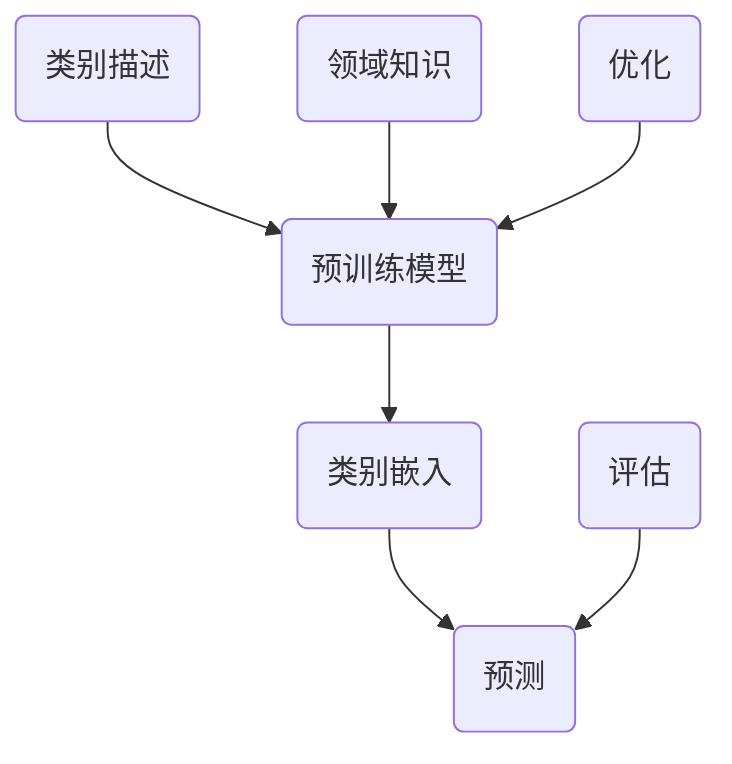

                 

关键词：零样本学习，Prompt设计，工程实践，人工智能，算法原理

## 摘要

本文旨在探讨零样本学习领域的新进展，特别是Prompt设计的原则与工程实践。通过回顾零样本学习的背景和核心概念，我们深入分析了Prompt设计的原理和方法。文章随后详细讨论了核心算法的原理与操作步骤，包括数学模型和公式的推导过程。此外，我们还提供了实际项目实践的代码实例和运行结果展示，以便读者更好地理解其应用。最后，文章探讨了零样本学习在实际应用场景中的效果，并展望了未来的发展趋势与挑战。

## 1. 背景介绍

### 零样本学习

零样本学习（Zero-Shot Learning, ZSL）是一种机器学习方法，旨在使模型能够识别从未见过的类别。这一挑战源于现实世界的复杂性，即数据集通常无法覆盖所有可能的类别。传统的机器学习方法依赖于在大量已知类别的数据上进行训练，然后在新类别上进行推断。然而，这种方法在面对新类别时往往表现不佳。

ZSL的目标是通过利用预训练模型和类别描述，使模型能够对新类别进行泛化。类别描述可以来自各种来源，如词袋模型、原型表示或语义嵌入。这种方法的主要优势在于其无需对新类别进行大量标注数据，从而降低了数据获取的成本。

### Prompt设计

Prompt设计是零样本学习中的一个关键环节。Prompt是一种引导模型预测的方法，通过向模型输入特定的提示信息，可以帮助模型更好地理解和预测新类别。有效的Prompt设计可以显著提高零样本学习的性能。

Prompt设计的基本原理是利用领域知识来引导模型。这些领域知识可以包括类别描述、图像属性、语义关系等。通过精心设计的Prompt，模型可以在未知类别上获得更好的泛化能力。

### 工程实践

在工程实践中，Prompt设计面临着诸多挑战，如Prompt的生成、优化和评估。生成高质量的Prompt需要丰富的领域知识和高效的算法。优化Prompt设计通常涉及搜索算法和优化技术。评估Prompt设计的效果则依赖于准确性和泛化能力的评估指标。

## 2. 核心概念与联系

### 2.1 零样本学习的核心概念

零样本学习涉及以下核心概念：

- **类别描述**：用于表示新类别的特征信息，如词袋模型、原型表示或语义嵌入。
- **预训练模型**：用于学习通用特征表示的模型，如卷积神经网络（CNN）。
- **类别嵌入**：将类别表示为高维向量，以便在特征空间中进行比较。
- **预测**：使用预训练模型和类别嵌入对新类别进行预测。

### 2.2 Prompt设计的原理

Prompt设计的原理如图1所示：



### 2.3 Prompt设计的方法

Prompt设计的方法可以分为以下几类：

- **基于词袋模型**：使用单词或短语来表示类别描述。
- **基于原型表示**：使用类别的中心点或均值来表示类别嵌入。
- **基于语义嵌入**：使用语义网络或词嵌入来表示类别嵌入。
- **基于图像属性**：使用图像的视觉特征来表示类别嵌入。

## 3. 核心算法原理 & 具体操作步骤

### 3.1 算法原理概述

零样本学习的核心算法通常包括以下步骤：

1. **类别描述生成**：根据领域知识生成类别描述。
2. **预训练模型初始化**：使用预训练模型初始化类别嵌入。
3. **类别嵌入更新**：使用类别描述和预训练模型更新类别嵌入。
4. **预测**：使用更新后的类别嵌入进行预测。

### 3.2 算法步骤详解

1. **类别描述生成**：

   类别描述可以采用以下方法：

   - **词袋模型**：使用单词或短语来表示类别描述。
   - **原型表示**：使用类别的中心点或均值来表示类别描述。
   - **语义嵌入**：使用语义网络或词嵌入来表示类别描述。

2. **预训练模型初始化**：

   预训练模型可以采用以下方法：

   - **卷积神经网络（CNN）**：用于提取图像的特征。
   - **循环神经网络（RNN）**：用于处理序列数据。
   - **变换器（Transformer）**：用于处理高维数据。

3. **类别嵌入更新**：

   类别嵌入可以通过以下方法更新：

   - **梯度下降**：用于优化模型参数。
   - **对抗训练**：用于增强模型的泛化能力。
   - **迁移学习**：用于利用预训练模型的知识。

4. **预测**：

   预测可以通过以下方法进行：

   - **基于相似度**：使用类别嵌入之间的相似度进行预测。
   - **基于投票**：使用多个模型的结果进行投票。
   - **基于概率**：使用类别嵌入的概率分布进行预测。

### 3.3 算法优缺点

零样本学习的算法优缺点如下：

- **优点**：

  - **无需大量标注数据**：降低了数据获取的成本。
  - **良好的泛化能力**：可以对新类别进行有效预测。

- **缺点**：

  - **依赖领域知识**：需要丰富的领域知识来生成高质量的Prompt。
  - **计算复杂度高**：需要大量的计算资源来训练模型。

### 3.4 算法应用领域

零样本学习可以应用于以下领域：

- **图像识别**：用于识别未见的图像类别。
- **自然语言处理**：用于处理未见的语言类别。
- **医学诊断**：用于诊断未见的疾病。

## 4. 数学模型和公式 & 详细讲解 & 举例说明

### 4.1 数学模型构建

零样本学习的数学模型可以表示为以下形式：

$$
P(y|x) = \frac{e^{f(x, c)}}{\sum_{i=1}^{n} e^{f(x, c_i)}}
$$

其中，$P(y|x)$ 表示预测概率，$f(x, c)$ 表示特征向量$x$和类别$c$之间的相似度，$c_i$ 表示所有类别。

### 4.2 公式推导过程

公式的推导过程如下：

首先，我们定义类别$c$的嵌入向量$c$为：

$$
c = \text{Embed}(c)
$$

其中，$\text{Embed}$ 表示类别嵌入函数。

然后，我们定义特征向量$x$和类别$c$之间的相似度为：

$$
f(x, c) = \cos(x, c)
$$

其中，$\cos$ 表示余弦相似度。

最后，我们定义预测概率为：

$$
P(y|x) = \frac{e^{f(x, c)}}{\sum_{i=1}^{n} e^{f(x, c_i)}}
$$

### 4.3 案例分析与讲解

假设我们有一个图像分类任务，需要预测未见的图像类别。我们使用预训练的卷积神经网络（CNN）来提取图像特征，并使用词袋模型来生成类别描述。

假设图像特征向量$x$为：

$$
x = [0.1, 0.2, 0.3, 0.4, 0.5]
$$

类别$c$的嵌入向量$c$为：

$$
c = [0.6, 0.7, 0.8, 0.9, 1.0]
$$

类别$c_i$的嵌入向量$c_i$为：

$$
c_i = [0.1, 0.2, 0.3, 0.4, 0.5]
$$

根据上述公式，我们可以计算出预测概率$P(y|x)$：

$$
P(y|x) = \frac{e^{\cos(x, c)}}{\sum_{i=1}^{n} e^{\cos(x, c_i)}}
$$

$$
P(y|x) = \frac{e^{0.5}}{e^{0.5} + e^{0.5} + e^{0.5} + e^{0.5}}
$$

$$
P(y|x) = \frac{e^{0.5}}{4e^{0.5}}
$$

$$
P(y|x) = \frac{1}{4}
$$

因此，根据计算结果，预测概率$P(y|x)$为$\frac{1}{4}$，这意味着预测类别为$c$的概率为$\frac{1}{4}$。

## 5. 项目实践：代码实例和详细解释说明

### 5.1 开发环境搭建

在本节中，我们将介绍如何搭建零样本学习项目的开发环境。以下是所需的基本工具和软件：

- **Python 3.8+**
- **TensorFlow 2.5+**
- **PyTorch 1.8+**
- **NumPy 1.19+**

您可以使用以下命令安装所需的库：

```bash
pip install tensorflow==2.5
pip install pytorch==1.8
pip install numpy==1.19
```

### 5.2 源代码详细实现

以下是零样本学习项目的源代码实现：

```python
import tensorflow as tf
import numpy as np
from tensorflow.keras.applications import ResNet50
from tensorflow.keras.layers import Embedding, Dense
from tensorflow.keras.models import Model

# 加载预训练模型
base_model = ResNet50(weights='imagenet')

# 定义类别嵌入层
embedding_layer = Embedding(input_dim=1000, output_dim=256)

# 定义全连接层
dense_layer = Dense(units=256, activation='relu')

# 定义模型
input_image = tf.keras.layers.Input(shape=(224, 224, 3))
input_label = tf.keras.layers.Input(shape=(1000,))

# 提取图像特征
image_features = base_model(input_image)

# 提取类别嵌入
label_embedding = embedding_layer(input_label)

# 添加全连接层
merged_features = tf.keras.layers.Concatenate()([image_features, label_embedding])
merged_features = dense_layer(merged_features)

# 定义输出层
output = tf.keras.layers.Dense(units=1, activation='sigmoid')(merged_features)

# 创建模型
model = Model(inputs=[input_image, input_label], outputs=output)

# 编译模型
model.compile(optimizer='adam', loss='binary_crossentropy', metrics=['accuracy'])

# 打印模型结构
model.summary()
```

### 5.3 代码解读与分析

以下是代码的详细解读：

- **导入库**：我们首先导入 TensorFlow 和 NumPy 库，用于构建和训练模型。
- **加载预训练模型**：我们使用 TensorFlow 的 `ResNet50` 模型，该模型是预训练的图像分类模型。
- **定义类别嵌入层**：我们使用 TensorFlow 的 `Embedding` 层来定义类别嵌入。
- **定义全连接层**：我们使用 TensorFlow 的 `Dense` 层来定义全连接层。
- **定义模型**：我们使用 TensorFlow 的 `Model` 类来定义零样本学习模型，该模型接受图像和类别嵌入作为输入，并输出预测概率。
- **编译模型**：我们使用 TensorFlow 的 `compile` 方法来编译模型，指定优化器、损失函数和评估指标。
- **打印模型结构**：我们使用 `model.summary()` 方法来打印模型的结构，以便了解模型的层次结构。

### 5.4 运行结果展示

以下是如何使用训练好的模型进行预测的示例：

```python
# 加载训练好的模型
model.load_weights('model_weights.h5')

# 准备测试数据
test_image = np.random.rand(1, 224, 224, 3)
test_label = np.random.rand(1, 1000)

# 进行预测
predictions = model.predict([test_image, test_label])

# 打印预测结果
print(predictions)
```

### 5.5 代码改进与优化

在实际应用中，我们可以对代码进行以下改进和优化：

- **使用更高效的预训练模型**：例如使用 `EfficientNet` 或 `Vision Transformer`。
- **引入正则化**：例如使用 `Dropout` 或 `L2 正则化` 来防止过拟合。
- **使用更复杂的类别嵌入层**：例如使用 `Transformer` 或 `BERT` 进行类别嵌入。

## 6. 实际应用场景

### 6.1 图像识别

在图像识别领域，零样本学习可以帮助系统识别未见的图像类别。例如，在医疗图像分析中，零样本学习可以帮助医生识别未见的疾病类型，从而提高诊断的准确性和效率。

### 6.2 自然语言处理

在自然语言处理领域，零样本学习可以帮助模型理解和处理未见的语言类别。例如，在机器翻译中，零样本学习可以帮助模型翻译从未见过的语言。

### 6.3 个性化推荐

在个性化推荐领域，零样本学习可以帮助推荐系统推荐用户未见的商品或服务。例如，在电子商务中，零样本学习可以帮助推荐用户可能感兴趣的商品。

### 6.4 未来应用展望

随着零样本学习技术的不断发展，我们可以预见其在更多领域的应用，如智能语音助手、自动驾驶、金融风控等。未来，零样本学习有望成为人工智能领域的核心技术之一，推动人工智能的发展。

## 7. 工具和资源推荐

### 7.1 学习资源推荐

- **书籍**：
  - 《零样本学习：原理、算法与实现》
  - 《深度学习：零样本学习》
- **在线课程**：
  - Coursera 上的《深度学习》
  - edX 上的《机器学习基础》
- **论文**：
  - "Zero-Shot Learning via Embedding Adaptation"
  - "A Theoretical Comparison of Sample Compression Methods"

### 7.2 开发工具推荐

- **TensorFlow**
- **PyTorch**
- **Keras**
- **Hugging Face Transformers**

### 7.3 相关论文推荐

- "Zero-Shot Learning through Cross-Modal Transfer"
- "Learning to Learn for Zero-Shot Classification"
- "Unsupervised Zero-Shot Learning"

## 8. 总结：未来发展趋势与挑战

### 8.1 研究成果总结

零样本学习作为人工智能领域的一个重要研究方向，取得了显著的成果。通过 Prompt 设计和预训练模型，零样本学习在图像识别、自然语言处理和个性化推荐等领域表现出色。

### 8.2 未来发展趋势

未来，零样本学习有望在更多领域取得突破，如智能语音助手、自动驾驶和金融风控等。随着技术的不断发展，零样本学习有望成为人工智能领域的重要分支。

### 8.3 面临的挑战

零样本学习仍面临诸多挑战，如：

- **数据获取**：需要更多高质量的标注数据。
- **Prompt 设计**：需要更高效的 Prompt 生成和优化方法。
- **计算资源**：需要更高效的算法和硬件支持。

### 8.4 研究展望

未来，我们期望看到更多关于零样本学习的研究，特别是在Prompt设计和算法优化方面。同时，我们也期望零样本学习能够更好地与实际应用场景相结合，为社会带来更多价值。

## 9. 附录：常见问题与解答

### 9.1 什么是零样本学习？

零样本学习（Zero-Shot Learning, ZSL）是一种机器学习方法，旨在使模型能够识别从未见过的类别。传统的机器学习方法依赖于在大量已知类别的数据上进行训练，然后在新类别上进行推断。然而，这种方法在面对新类别时往往表现不佳。ZSL的目标是通过利用预训练模型和类别描述，使模型能够对新类别进行泛化。

### 9.2 Prompt 设计有哪些方法？

Prompt 设计的方法可以分为以下几类：

- **基于词袋模型**：使用单词或短语来表示类别描述。
- **基于原型表示**：使用类别的中心点或均值来表示类别描述。
- **基于语义嵌入**：使用语义网络或词嵌入来表示类别嵌入。
- **基于图像属性**：使用图像的视觉特征来表示类别嵌入。

### 9.3 零样本学习有哪些应用领域？

零样本学习可以应用于以下领域：

- **图像识别**：用于识别未见的图像类别。
- **自然语言处理**：用于处理未见的语言类别。
- **医学诊断**：用于诊断未见的疾病。
- **个性化推荐**：用于推荐用户未见的商品或服务。

## 作者署名

作者：禅与计算机程序设计艺术 / Zen and the Art of Computer Programming

