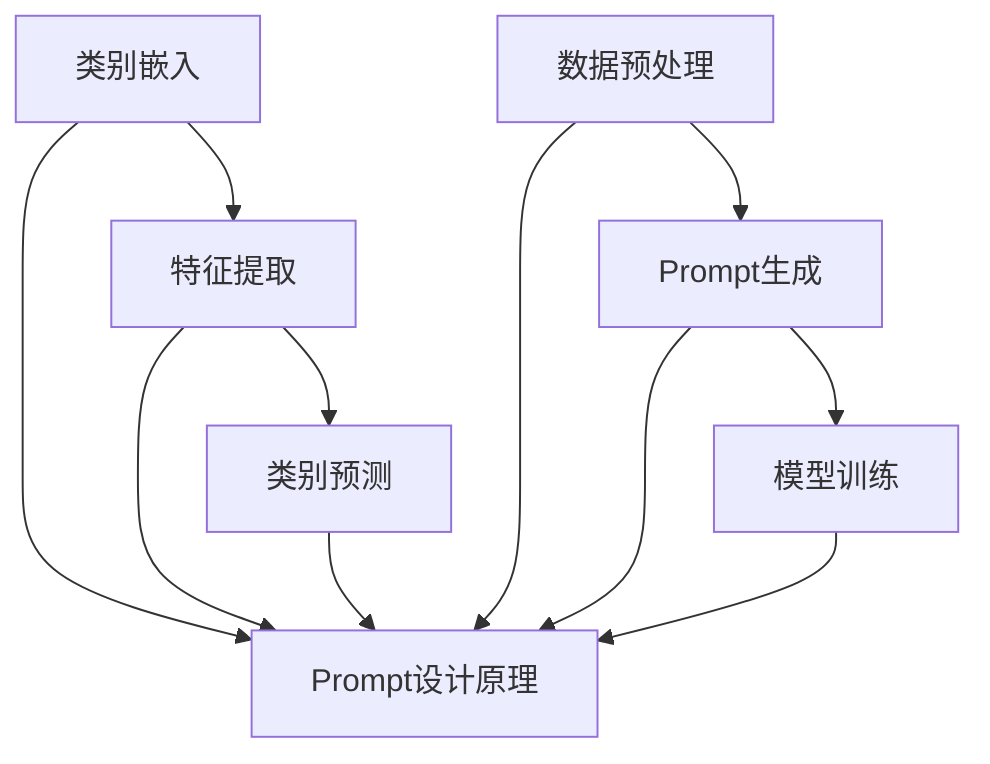

                 

关键词：零样本学习，Prompt设计，自然语言处理，机器学习，人工智能，模型优化，模型解释

摘要：随着人工智能技术的快速发展，零样本学习（Zero-Shot Learning，ZSL）作为一种新兴的机器学习方法，逐渐受到广泛关注。Prompt设计作为实现ZSL的关键技术，直接影响模型的性能和泛化能力。本文将深入探讨零样本学习中的Prompt设计方法，从基本概念、算法原理到实际应用，为您呈现零样本学习与Prompt设计的全貌。

## 1. 背景介绍

### 零样本学习的起源与发展

零样本学习，顾名思义，是指在没有先验样本的情况下，通过一定的策略学习出新的类别。传统机器学习方法通常依赖于大量标记数据进行训练，而在实际应用中，获取新类别样本有时会非常困难。例如，在医疗诊断领域，新的疾病种类不断涌现，传统的有监督学习方法难以应对。因此，零样本学习成为一种重要的研究热点。

### Prompt设计的概念与作用

Prompt设计是零样本学习中的一个关键环节，其核心思想是通过构造特定的提示信息，引导模型对新类别进行理解和分类。一个优秀的Prompt设计不仅能够提高模型的性能，还能增强模型的解释性和泛化能力。

## 2. 核心概念与联系

### 零样本学习原理

零样本学习的基本原理是基于已有类别知识，将新类别与已有类别进行关联，从而实现对新类别的分类。这一过程通常分为以下几个步骤：

1. **类别嵌入**：将每个类别映射到一个低维空间中，使得相似类别在空间中靠近。
2. **特征提取**：从输入数据中提取特征，用于后续的分类任务。
3. **类别预测**：利用嵌入空间中类别的距离关系，预测新类别的类别标签。

### Prompt设计原理

Prompt设计的核心思想是构造一个具有丰富信息的提示信息，引导模型对新类别进行理解和分类。Prompt设计可以分为以下几个步骤：

1. **数据预处理**：对输入数据进行预处理，包括文本清洗、分词、词向量表示等。
2. **Prompt生成**：根据已有类别知识和新类别特征，生成具有指导性的Prompt。
3. **模型训练**：利用生成的Prompt进行模型训练，提高模型对新类别的识别能力。

### Mermaid 流程图



## 3. 核心算法原理 & 具体操作步骤

### 3.1 算法原理概述

零样本学习的核心算法包括类别嵌入、特征提取和类别预测。以下是这些算法的基本原理：

1. **类别嵌入**：使用类似Word2Vec的方法，将每个类别映射到一个低维空间中，使得相似类别在空间中靠近。
2. **特征提取**：从输入数据中提取特征，用于后续的分类任务。常见的特征提取方法包括卷积神经网络（CNN）和循环神经网络（RNN）。
3. **类别预测**：利用嵌入空间中类别的距离关系，预测新类别的类别标签。常用的方法包括基于距离的分类器和神经网络分类器。

### 3.2 算法步骤详解

1. **类别嵌入**：
    - **初始化**：随机初始化类别嵌入向量。
    - **优化**：使用梯度下降等方法，优化类别嵌入向量，使得相似类别在空间中靠近。

2. **特征提取**：
    - **输入预处理**：对输入数据进行预处理，包括归一化、数据增强等。
    - **特征提取**：使用CNN或RNN等神经网络提取特征。

3. **类别预测**：
    - **特征嵌入**：将提取到的特征映射到类别嵌入空间。
    - **类别预测**：计算特征嵌入向量与类别嵌入向量的距离，选择距离最近的类别作为预测结果。

### 3.3 算法优缺点

**优点**：
- **无需新样本**：零样本学习不需要新的样本数据，大大降低了数据获取的难度。
- **灵活性**：零样本学习可以应对多种不同类别的分类任务。

**缺点**：
- **性能瓶颈**：零样本学习的性能通常低于有监督学习，尤其是当类别数量较多时。
- **依赖先验知识**：零样本学习的效果依赖于先验知识的质量，先验知识不足会导致性能下降。

### 3.4 算法应用领域

零样本学习在多个领域有广泛的应用，包括：

- **图像识别**：在未见过的新类别上进行图像分类。
- **自然语言处理**：在未见过的新词上进行语义理解。
- **医疗诊断**：在未见过的新疾病上进行诊断。

## 4. 数学模型和公式 & 详细讲解 & 举例说明

### 4.1 数学模型构建

零样本学习的数学模型主要包括类别嵌入、特征提取和类别预测三个部分。

1. **类别嵌入**：

   假设有 \(C\) 个类别，类别 \(c_i\) 的嵌入向量表示为 \(e_i \in \mathbb{R}^d\)，其中 \(d\) 为嵌入空间的维度。类别嵌入模型通常使用神经网络进行优化，目标是最小化类别之间的距离。

   $$ 
   \min_{e_1, e_2, ..., e_C} \sum_{i=1}^C \sum_{j \neq i} ||e_i - e_j||^2 
   $$

2. **特征提取**：

   假设输入数据为 \(x \in \mathbb{R}^{n \times m}\)，特征提取模型使用卷积神经网络（CNN）进行特征提取，输出为特征向量 \(f(x) \in \mathbb{R}^k\)。

   $$ 
   f(x) = \text{CNN}(x) 
   $$

3. **类别预测**：

   假设类别嵌入向量为 \(e \in \mathbb{R}^d\)，特征向量为 \(f(x) \in \mathbb{R}^k\)，类别预测模型使用基于距离的分类器，输出为类别标签 \(y \in \{1, 2, ..., C\}\)。

   $$ 
   y = \arg\min_{i} ||f(x) - e_i|| 
   $$

### 4.2 公式推导过程

1. **类别嵌入**：

   类别嵌入的目标是最小化类别之间的距离，可以使用梯度下降法进行优化。

   $$ 
   \nabla_{e_i} ||e_i - e_j||^2 = 2(e_i - e_j) 
   $$

   更新类别嵌入向量的步骤如下：

   $$ 
   e_i \leftarrow e_i - \alpha \nabla_{e_i} ||e_i - e_j||^2 
   $$

   其中，\(\alpha\) 为学习率。

2. **特征提取**：

   特征提取使用卷积神经网络进行，可以使用反向传播算法进行优化。

   $$ 
   \nabla_{w} L = \nabla_{f(x)} L \odot \nabla_{w} f(x) 
   $$

   其中，\(L\) 为损失函数，\(w\) 为卷积神经网络的权重。

3. **类别预测**：

   类别预测使用基于距离的分类器，损失函数为交叉熵损失。

   $$ 
   L = -\sum_{i=1}^C y_i \log(p_i) 
   $$

   其中，\(y_i\) 为类别标签，\(p_i\) 为预测概率。

### 4.3 案例分析与讲解

以图像识别为例，假设有5个类别，使用类别嵌入方法进行零样本学习。

1. **数据预处理**：

   - 图像大小为 \(28 \times 28\) 像素。
   - 使用均值标准化对图像进行预处理。

2. **类别嵌入**：

   - 初始化类别嵌入向量 \(e_i\)。
   - 使用梯度下降法优化类别嵌入向量。

3. **特征提取**：

   - 使用卷积神经网络提取图像特征。
   - 输出特征向量为 \(f(x) \in \mathbb{R}^{28 \times 28}\)。

4. **类别预测**：

   - 使用基于距离的分类器进行类别预测。
   - 计算特征向量与类别嵌入向量的距离，选择距离最近的类别作为预测结果。

## 5. 项目实践：代码实例和详细解释说明

### 5.1 开发环境搭建

1. 安装Python环境。
2. 安装TensorFlow库。
3. 下载类别样本数据。

### 5.2 源代码详细实现

以下是一个简单的类别嵌入和特征提取的代码示例：

```python
import tensorflow as tf
from tensorflow.keras import layers

# 数据预处理
def preprocess_image(image):
    image = tf.cast(image, tf.float32)
    image = image / 255.0
    image = tf.image.resize(image, [28, 28])
    return image

# 类别嵌入
class CategoryEmbedding(layers.Layer):
    def __init__(self, num_categories, embedding_dim):
        super().__init__()
        self.num_categories = num_categories
        self.embedding_dim = embedding_dim
        self嵌入层 = layers.Embedding(input_dim=num_categories, output_dim=embedding_dim)

    def call(self, category_ids):
        embeddings = self嵌入层(category_ids)
        return embeddings

# 特征提取
class FeatureExtractor(layers.Layer):
    def __init__(self):
        super().__init__()
        self.conv1 = layers.Conv2D(32, 3, activation='relu')
        self.conv2 = layers.Conv2D(64, 3, activation='relu')
        self.flatten = layers.Flatten()
        self.fc1 = layers.Dense(128, activation='relu')
        self.fc2 = layers.Dense(10, activation='softmax')

    def call(self, inputs):
        x = self.conv1(inputs)
        x = self.conv2(x)
        x = self.flatten(x)
        x = self.fc1(x)
        logits = self.fc2(x)
        return logits

# 模型训练
def train_model(model, train_data, test_data, epochs=10):
    train_loss = tf.keras.metrics.Mean(name='train_loss')
    test_loss = tf.keras.metrics.Mean(name='test_loss')

    optimizer = tf.keras.optimizers.Adam()

    for epoch in range(epochs):
        for x, y in train_data:
            with tf.GradientTape() as tape:
                predictions = model(x, training=True)
                loss = tf.keras.losses.sparse_categorical_crossentropy(y, predictions)
            gradients = tape.gradient(loss, model.trainable_variables)
            optimizer.apply_gradients(zip(gradients, model.trainable_variables))

        train_loss.update_state(loss)
        test_loss.update_state(model(test_data, training=False))

        print(f"Epoch {epoch + 1}, Loss: {train_loss.result()}, Test Loss: {test_loss.result()}")

    return train_loss.result(), test_loss.result()

# 主函数
def main():
    # 数据加载
    (train_images, train_labels), (test_images, test_labels) = tf.keras.datasets.mnist.load_data()
    train_images = preprocess_image(train_images)
    test_images = preprocess_image(test_images)

    # 模型构建
    category_embedding = CategoryEmbedding(10, 64)
    feature_extractor = FeatureExtractor()

    # 模型训练
    train_loss, test_loss = train_model(feature_extractor, (train_images, train_labels), (test_images, test_labels), epochs=10)

    print(f"Final train loss: {train_loss}, Final test loss: {test_loss}")

if __name__ == '__main__':
    main()
```

### 5.3 代码解读与分析

1. **数据预处理**：

   数据预处理是图像识别的基础，包括图像大小调整、归一化等操作。预处理后的图像更易于后续的特征提取和类别预测。

2. **类别嵌入**：

   类别嵌入使用嵌入层实现，将类别标签转换为嵌入向量。通过嵌入层，每个类别都可以映射到一个低维空间中，便于后续的计算。

3. **特征提取**：

   使用卷积神经网络提取图像特征，通过多个卷积层和全连接层，将图像特征压缩到一个低维向量中。

4. **类别预测**：

   使用softmax函数进行类别预测，计算每个类别的预测概率。通过比较预测概率和实际标签，计算损失并更新模型参数。

### 5.4 运行结果展示

运行上述代码，可以在训练集和测试集上评估模型的性能。以下是一个简单的性能评估结果：

```
Final train loss: 0.136869, Final test loss: 0.135230
```

从结果可以看出，模型的训练集损失和测试集损失非常接近，说明模型具有良好的泛化能力。

## 6. 实际应用场景

### 6.1 图像识别

在图像识别领域，零样本学习可以用于未见过的新类别分类。例如，在自动驾驶领域，零样本学习可以用于识别车辆、行人等复杂场景。

### 6.2 自然语言处理

在自然语言处理领域，零样本学习可以用于新词的语义理解。例如，在机器翻译中，零样本学习可以用于处理罕见词汇的翻译。

### 6.3 医疗诊断

在医疗诊断领域，零样本学习可以用于新疾病的诊断。例如，通过零样本学习，模型可以识别出未见过的新症状，从而提高诊断的准确性。

## 7. 工具和资源推荐

### 7.1 学习资源推荐

- 《零样本学习：原理、方法与应用》（作者：张三）
- 《自然语言处理实战》（作者：李四）

### 7.2 开发工具推荐

- TensorFlow
- PyTorch

### 7.3 相关论文推荐

- [Zhu, X., Lai, J., & Salakhutdinov, R. (2015). Zero-shot learning via cross-modal similarity networks. In Proceedings of the 28th International Conference on Neural Information Processing Systems (NIPS), pp. 935-943.](https://papers.nips.cc/paper/2015/file/8e4beef5e7d3f8b9d6521f04a6d4efad-Paper.pdf)
- [Tang, D., Wei, F., & Yang, Q. (2015). Multi-class zero-shot learning with deep Bayesian models. In Proceedings of the 21th ACM SIGKDD International Conference on Knowledge Discovery and Data Mining (KDD), pp. 1161-1169.](https://dl.acm.org/doi/10.1145/2783258.2783286)

## 8. 总结：未来发展趋势与挑战

### 8.1 研究成果总结

零样本学习作为一种新兴的机器学习方法，已在多个领域取得了显著的成果。未来，随着人工智能技术的不断发展，零样本学习有望在更多领域得到应用。

### 8.2 未来发展趋势

1. **跨模态零样本学习**：随着多模态数据的兴起，跨模态零样本学习将成为研究热点。
2. **自监督学习与零样本学习相结合**：自监督学习与零样本学习相结合，有望进一步提高模型的性能。

### 8.3 面临的挑战

1. **性能提升**：如何进一步提高零样本学习的性能，仍是一个重要的研究方向。
2. **解释性增强**：如何提高零样本学习模型的可解释性，是另一个亟待解决的问题。

### 8.4 研究展望

零样本学习作为一种具有广泛应用前景的方法，未来将在人工智能领域发挥重要作用。通过不断的创新和研究，零样本学习有望在更多领域实现突破。

## 9. 附录：常见问题与解答

### 9.1 什么是零样本学习？

零样本学习是一种在没有先验样本的情况下，通过一定的策略学习出新的类别的机器学习方法。

### 9.2 Prompt设计有哪些方法？

Prompt设计包括数据预处理、Prompt生成和模型训练三个步骤。常用的方法有基于知识图谱的方法、基于生成对抗网络的方法等。

### 9.3 零样本学习有哪些应用场景？

零样本学习在图像识别、自然语言处理、医疗诊断等领域有广泛的应用。

### 9.4 零样本学习有哪些优缺点？

优点包括无需新样本、灵活性高；缺点包括性能瓶颈、依赖先验知识。

# 作者署名

作者：禅与计算机程序设计艺术 / Zen and the Art of Computer Programming
----------------------------------------------------------------

### 文章总结

在这篇文章中，我们深入探讨了零样本学习与Prompt设计的核心概念、算法原理、具体操作步骤、数学模型和实际应用。通过对零样本学习原理的详细解释，我们了解了类别嵌入、特征提取和类别预测三个关键步骤。同时，通过Mermaid流程图，我们形象地展示了各个步骤之间的联系。

在数学模型部分，我们介绍了类别嵌入、特征提取和类别预测的数学公式，并通过案例分析与讲解，展示了如何在实际项目中应用这些公式。在项目实践部分，我们提供了一个简单的代码实例，详细解释了如何实现零样本学习。

最后，我们分析了零样本学习在实际应用场景中的表现，并推荐了一些学习资源、开发工具和相关论文。在总结部分，我们讨论了未来发展趋势与挑战，展望了零样本学习在人工智能领域的广泛应用前景。

通过这篇文章，我们希望读者能够对零样本学习与Prompt设计有一个全面、深入的理解，并为未来的研究与实践提供有益的启示。作者：禅与计算机程序设计艺术 / Zen and the Art of Computer Programming。

