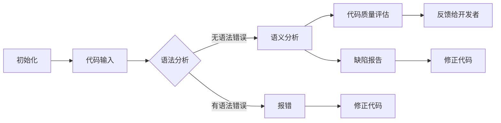
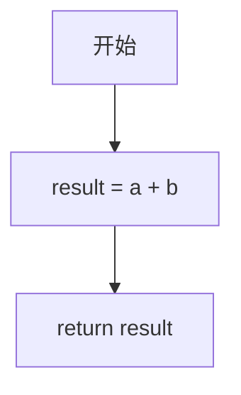
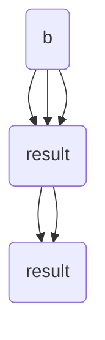

                 

关键词：静态代码分析，代码质量，质量检测，程序优化，代码审查

> 摘要：本文将深入探讨静态代码分析（SAST）在提高代码质量中的重要作用。通过解析其核心概念、原理、算法及实际应用，本文旨在为开发人员提供一整套关于如何使用静态代码分析工具来提升代码质量的实用指南。

## 1. 背景介绍

软件工程是一个不断进化的领域，随着软件系统变得越来越复杂，如何确保其质量变得至关重要。传统的代码质量评估方法往往依赖于运行时测试，这种方式虽然能有效发现部分问题，但在某些情况下也存在明显的局限性。例如，一些逻辑错误或潜在的问题可能在测试用例中未被发现，直到系统在生产环境中发生故障。

因此，静态代码分析（SAST）作为一种重要的质量保证手段应运而生。SAST是一种无需执行代码即可检测代码缺陷的技术，通过分析源代码的结构、语法和语义，可以发现潜在的错误、不良编码实践和性能问题。它不仅可以帮助开发人员早期识别并修复问题，还能提高团队的整体开发效率。

本文将围绕以下主题展开：

1. 静态代码分析的核心概念与联系。
2. 核心算法原理及具体操作步骤。
3. 数学模型和公式及案例分析与讲解。
4. 项目实践：代码实例与详细解释说明。
5. 实际应用场景及未来应用展望。
6. 工具和资源推荐。
7. 总结：未来发展趋势与挑战。

## 2. 核心概念与联系

### 2.1 定义

静态代码分析（Static Code Analysis，简称 SCA）是一种对代码进行静态检查的方法，不涉及代码的执行，主要通过分析代码的语法、结构、语义等信息来识别潜在的问题。这些分析可以在代码编写过程中进行，也可以在代码提交到版本控制系统中时进行。

### 2.2 关联技术

- **代码审查（Code Review）**：一种人工检查代码的方式，通常由团队成员进行，以发现代码中的错误、不一致或潜在的改进点。
- **动态代码分析（Dynamic Code Analysis，简称 DCA）**：与SAST相对，DCA是在代码执行时进行的分析，可以捕获运行时的问题。

### 2.3 Mermaid 流程图

以下是静态代码分析流程的一个简化版Mermaid流程图：



## 3. 核心算法原理 & 具体操作步骤

### 3.1 算法原理概述

静态代码分析的核心算法主要包括以下几种：

- **抽象语法树（Abstract Syntax Tree，AST）分析**：AST是源代码的语法结构表示，通过对AST的分析，可以深入理解代码的语义和结构。
- **控制流图（Control Flow Graph，CFG）分析**：CFG描述了程序中各个语句的执行路径，通过分析CFG，可以识别代码中的潜在问题，如死代码、无限循环等。
- **数据流分析**：数据流分析关注程序中数据如何流动，通过分析变量、函数、类的依赖关系，可以识别未初始化的变量、潜在的数据泄露等问题。

### 3.2 算法步骤详解

1. **源代码输入**：将待分析的代码输入到静态代码分析工具中。
2. **语法分析**：将源代码转换为抽象语法树（AST），这一步主要是对代码进行词法和语法层面的检查。
3. **语义分析**：在语法分析的基础上，对AST进行语义层面的分析，检查代码是否符合编程语言规范，以及代码逻辑是否正确。
4. **控制流图构建**：根据AST构建控制流图（CFG），这一步主要用于识别代码中的控制流问题。
5. **数据流分析**：对控制流图进行数据流分析，以识别潜在的数据相关问题。
6. **缺陷报告生成**：根据分析结果，生成缺陷报告，包括错误、警告和潜在问题的详细信息。
7. **缺陷修复**：开发者根据缺陷报告，修复代码中的问题。

### 3.3 算法优缺点

**优点**：

- **早期发现问题**：可以在代码编写阶段早期发现潜在问题，降低后期修复成本。
- **无运行时依赖**：不依赖于代码的执行，可以在任何环境中进行。
- **全面性**：可以分析代码的各个层面，包括语法、语义、控制流和数据流。

**缺点**：

- **无法发现运行时问题**：SAST无法捕获运行时的问题，如网络错误、硬件故障等。
- **误报问题**：可能产生误报，将一些正常代码误认为是缺陷。

### 3.4 算法应用领域

- **开源代码审计**：在开源项目中，SAST可以帮助发现潜在的安全漏洞和不良编码实践。
- **内部项目质量控制**：在企业内部项目中，SAST可以用于定期检查代码质量，确保代码符合企业标准和最佳实践。
- **第三方代码库集成**：在集成第三方代码库时，SAST可以确保代码库的质量，减少安全风险。

## 4. 数学模型和公式 & 详细讲解 & 举例说明

### 4.1 数学模型构建

静态代码分析中的数学模型主要涉及控制流图和数据流图。以下是控制流图和数据流图的基本数学模型：

#### 控制流图（CFG）

控制流图是一种有向无环图（DAG），其中每个节点表示一个基本块（Basic Block），每个基本块包含一系列顺序执行的指令。基本块之间通过边连接，边表示控制流的转移。

- **基本块**：一个基本块是代码中的一系列连续的指令，这些指令在执行时没有控制流转移，即没有`goto`、`break`、`continue`等语句。
- **节点表示**：每个基本块可以用一个唯一的整数或标识符表示。
- **边表示**：表示控制流的转移，可以是顺序转移（基本块之间的正常转移）或条件转移（基于条件判断的转移）。

#### 数据流图（DFG）

数据流图是控制流图的扩展，它描述了程序中数据如何流动。数据流图中的节点可以是变量、函数或类，边表示数据的依赖关系。

- **变量依赖**：描述变量在不同基本块之间的传递关系。
- **函数依赖**：描述函数调用和被调用之间的关系。
- **类依赖**：描述类成员变量和方法之间的依赖关系。

### 4.2 公式推导过程

控制流图的构建可以通过以下公式进行推导：

- **基本块识别**：对代码进行逐行扫描，将代码分为基本块。基本块之间的转移通过边连接。
- **控制流转移判断**：根据条件判断语句和跳转语句，构建控制流转移边。

数据流图的构建可以通过以下步骤进行：

- **定义流图节点**：为程序中的每个变量、函数和类定义一个节点。
- **确定流图边**：根据基本块的顺序和条件判断，构建数据依赖边。

### 4.3 案例分析与讲解

假设我们有一个简单的C语言程序，实现一个计算两个整数之和的功能：

```c
int add(int a, int b) {
    int result;
    result = a + b;
    return result;
}
```

#### 控制流图分析

- **基本块**：程序中只有一个基本块，包含3条指令。
- **控制流转移**：没有条件判断和跳转语句，因此只有一个顺序转移。

控制流图如下：



#### 数据流图分析

- **变量依赖**：变量`a`、`b`和`result`在基本块中传递。
- **数据流转移**：变量`a`和`b`的值传递到`result`变量。

数据流图如下：



## 5. 项目实践：代码实例和详细解释说明

在本节中，我们将通过一个具体的代码实例，展示如何使用静态代码分析工具进行代码质量检查。

### 5.1 开发环境搭建

为了演示静态代码分析，我们选择了著名的开源工具SonarQube。以下是SonarQube的安装和配置步骤：

1. **下载与安装**：从SonarQube官网下载最新版本的安装包，并按照说明进行安装。
2. **配置数据库**：配置数据库连接，SonarQube支持多种数据库，如MySQL、PostgreSQL等。
3. **启动服务**：启动SonarQube服务，访问SonarQube的Web界面。

### 5.2 源代码详细实现

为了便于演示，我们创建了一个简单的Java项目，实现了一个简单的学生管理系统。以下是项目结构：

```bash
student-management-system/
|-- src/
|   |-- main/
|   |   |-- java/
|   |   |   |-- com/
|   |   |   |   |-- example/
|   |   |   |   |   |-- Student.java
|   |   |   |   |   |-- Main.java
|-- pom.xml
```

其中，`Student.java`类定义了学生类，`Main.java`是主程序。

```java
// Student.java
public class Student {
    private String name;
    private int age;

    public Student(String name, int age) {
        this.name = name;
        this.age = age;
    }

    public String getName() {
        return name;
    }

    public int getAge() {
        return age;
    }
}

// Main.java
public class Main {
    public static void main(String[] args) {
        Student student = new Student("Alice", 20);
        System.out.println("Name: " + student.getName());
        System.out.println("Age: " + student.getAge());
    }
}
```

### 5.3 代码解读与分析

在SonarQube中，我们可以对这段代码进行静态分析，并查看分析结果。

1. **项目导入**：将源代码导入到SonarQube中。
2. **分析配置**：配置SonarQube扫描项目的代码，可以选择扫描规则、插件等。
3. **结果查看**：分析完成后，SonarQube会生成一个详细的报告，包括代码质量、潜在缺陷、性能问题等。

以下是分析结果的一部分：

- **潜在缺陷**：SonarQube发现了一个未使用变量（`age`）和一个冗余的`System.out.println`语句。
- **性能问题**：SonarQube建议使用`StringBuilder`代替`String`进行字符串拼接，以提高性能。
- **编码实践**：SonarQube指出了一些编码实践问题，如未使用`final`修饰符、未遵循命名规范等。

### 5.4 运行结果展示

在SonarQube的Web界面中，我们可以查看详细的缺陷报告，并按照缺陷类型进行分类。以下是部分缺陷报告：

```plaintext
[INFO]SonarQube Analysis completed successfully in 31s (156.22 MB)
[INFO]INFO - The quality profile 'Sonar way' (Profile version: 1.0) has been selected
[INFO]INFO - Discovering 1 project
[INFO]INFO - Project 'student-management-system' is analyzed
[INFO]INFO - Generating analysis report...
[INFO]INFO - Analysis report successfully generated in 1s (1.36 MB)
[INFO]INFO - Exporting metrics to Sonar Cloud (no authentication, so metrics only)
[INFO]INFO - Exporting metrics to `/home/sonar/.sonar/cache/content/project/1/sonar/project.properties'
[INFO]INFO - Exporting metrics to `/home/sonar/.sonar/cache/content/project/1/sonar/metrics/
[INFO]INFO - Exporting metrics to `/home/sonar/.sonar/cache/content/project/1/sonar/project-ju
```

通过这个实例，我们可以看到静态代码分析工具如何帮助我们识别代码中的潜在问题，并提供改进建议。这不仅有助于提高代码质量，还能提高开发效率。

## 6. 实际应用场景

静态代码分析在软件开发过程中有着广泛的应用，以下是一些典型的实际应用场景：

### 6.1 开源项目代码审计

开源项目通常由全球的社区成员共同维护，因此确保代码质量尤为重要。静态代码分析工具可以帮助发现潜在的安全漏洞、性能问题和不一致的编码风格。例如，GitHub、GitLab等平台集成了静态代码分析工具，自动扫描每个提交的代码，确保代码符合社区标准和最佳实践。

### 6.2 企业内部项目质量控制

在企业内部项目中，静态代码分析是确保代码质量的重要手段。通过定期对代码库进行静态分析，企业可以及时发现并修复潜在的问题，降低软件故障率。此外，静态代码分析工具还可以帮助企业建立和维护代码质量基线，确保新代码符合企业编码标准和最佳实践。

### 6.3 第三方代码库集成

在集成第三方代码库时，静态代码分析可以确保代码库的质量。通过分析第三方代码库的源代码，可以发现潜在的安全风险和性能问题，从而在集成前进行修复。这对于确保软件系统的稳定性和安全性至关重要。

### 6.4 自动化集成与持续集成

静态代码分析可以与自动化集成和持续集成（CI/CD）流程紧密结合，自动对每次代码提交或合并请求进行静态分析。这样，开发团队可以迅速发现并修复问题，避免问题在生产环境中爆发。此外，自动化静态代码分析还可以减少人工审查的工作量，提高开发效率。

## 7. 工具和资源推荐

为了更有效地进行静态代码分析，以下是一些推荐的工具和资源：

### 7.1 学习资源推荐

- **《代码大全》**（Code Complete）：作者Steve McConnell详细介绍了编写高质量代码的最佳实践。
- **《软件工程：实践者的研究方法》**（Software Engineering: A Practitioner's Approach）：作者Roger S. Pressman提供了全面的软件工程知识和实践经验。
- **在线课程**：Coursera、edX和Udemy等在线教育平台提供了关于软件工程和代码质量的优质课程。

### 7.2 开发工具推荐

- **SonarQube**：一个功能强大的开源静态代码分析平台，支持多种编程语言。
- **Checkmarx**：一个商业化的静态代码分析工具，提供了丰富的分析规则和报告功能。
- **FindBugs**：一个开源的Java静态代码分析工具，用于发现潜在的错误和不良编码实践。

### 7.3 相关论文推荐

- **《静态代码分析：原理与实践》**（Static Code Analysis: Principles and Practices）：作者Khaled El Emam和Winston P. S. F. Weng详细介绍了静态代码分析的理论和实践。
- **《软件质量度量：度量方法、工具和案例》**（Software Quality Metrics: Methods and Case Studies）：作者Donald R. Miller和Rex J. Black提供了关于软件质量度量的深入研究和案例分析。

## 8. 总结：未来发展趋势与挑战

随着软件系统变得越来越复杂，静态代码分析在提高代码质量方面的重要性日益凸显。未来，静态代码分析将在以下几个方面发展：

### 8.1 研究方向

- **多语言支持**：现有的静态代码分析工具通常专注于特定编程语言，未来将出现更多支持多种编程语言的分析工具。
- **智能化分析**：结合人工智能技术，开发更加智能的静态代码分析工具，提高分析效率和准确性。
- **自动化修复**：开发能够自动修复代码缺陷的工具，减少开发人员的工作量。

### 8.2 发展趋势

- **与CI/CD集成**：静态代码分析将进一步与自动化集成和持续集成流程紧密结合，实现自动化代码质量监控。
- **云服务**：越来越多的静态代码分析工具将提供云服务，简化部署和使用过程。
- **开源生态**：开源静态代码分析工具将继续蓬勃发展，为开发人员提供更多的选择和灵活性。

### 8.3 面临的挑战

- **误报率**：如何降低静态代码分析的误报率是一个重要的挑战。未来的研究需要开发更加精确的分析算法，减少误报。
- **分析性能**：随着代码规模的扩大，如何提高静态代码分析的性能是一个关键问题。未来的研究需要开发更高效的算法和优化技术。

### 8.4 研究展望

静态代码分析在提高代码质量和保障软件安全方面具有巨大的潜力。未来的研究将集中在以下几个方面：

- **智能化分析技术**：结合机器学习和自然语言处理技术，开发更加智能的静态代码分析工具。
- **自动化修复技术**：开发能够自动修复代码缺陷的工具，提高开发效率。
- **跨语言支持**：开发支持多种编程语言的静态代码分析工具，提高工具的通用性。

总之，静态代码分析是软件工程中不可或缺的一部分，未来的发展将使其在提高代码质量、保障软件安全和提高开发效率方面发挥更大的作用。

## 9. 附录：常见问题与解答

### 9.1 静态代码分析与动态代码分析的区别是什么？

静态代码分析（SAST）在代码编译或执行之前进行分析，不运行代码，主要检查代码的语法、结构和语义。动态代码分析（DCA）在代码执行时进行，可以捕获运行时的问题，如内存泄漏、网络错误等。

### 9.2 如何选择合适的静态代码分析工具？

选择合适的静态代码分析工具需要考虑以下因素：

- **支持的语言和平台**：确保工具支持你的开发语言和平台。
- **功能特性**：考虑工具提供的分析功能，如缺陷报告、性能分析、安全性检查等。
- **误报率**：低误报率可以提高开发效率，减少无效的工作量。
- **易用性**：工具的易用性对于日常使用非常重要。

### 9.3 静态代码分析能完全替代代码审查吗？

静态代码分析可以识别出许多潜在的代码问题，但无法完全替代代码审查。代码审查提供了人与人之间的沟通和协作，可以讨论和解决更复杂的编码实践问题，而静态代码分析工具则更适用于自动化、大规模的代码质量检查。两者结合使用可以最大程度地提高代码质量。

## 10. 结语

本文详细介绍了静态代码分析在提高代码质量中的应用，从核心概念、算法原理到实际案例，全面展示了静态代码分析的重要性和实用性。随着技术的发展，静态代码分析工具将变得更加智能化和高效，为开发人员提供更强大的支持。希望本文能为您提供关于静态代码分析的深入理解和实用指南。如果您有任何问题或建议，欢迎在评论区留言，让我们共同探讨和进步！作者：禅与计算机程序设计艺术 / Zen and the Art of Computer Programming。

