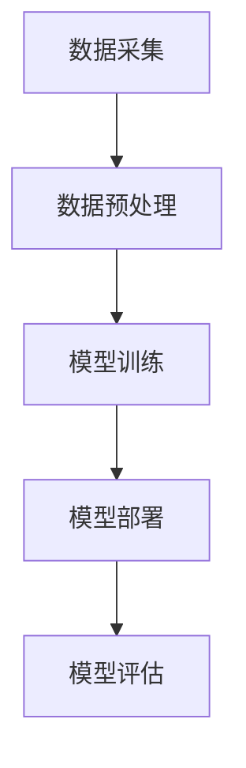

                 

关键词：大模型应用、推荐系统、部署策略、架构设计、实践案例、未来展望

> 摘要：本文旨在探讨大模型在推荐系统中的应用与部署策略。通过对不同推荐场景的分析，详细拆解了大模型的应用架构、算法原理、数学模型以及项目实践，为读者提供全面的参考。同时，对未来的发展趋势与挑战进行了展望。

## 1. 背景介绍

随着互联网的快速发展，推荐系统已经成为电商平台、社交媒体、新闻资讯等领域的重要应用。推荐系统通过分析用户的行为数据，为用户推荐感兴趣的内容或商品，从而提高用户满意度、提升业务收入。随着大数据和深度学习技术的崛起，大模型在推荐系统中的应用日益广泛，成为当前研究的热点之一。

大模型通常是指参数规模庞大的深度学习模型，如神经网络、生成对抗网络等。这些模型在数据处理和特征提取方面具有强大的能力，但同时也带来了高计算成本、复杂部署等挑战。如何高效地应用大模型，实现推荐系统的优化，是当前研究的重要问题。

本文将围绕大模型在推荐系统中的应用，从架构设计、算法原理、数学模型、项目实践等多个角度展开探讨，旨在为研究人员和工程师提供有价值的参考。

## 2. 核心概念与联系

### 2.1 大模型概述

大模型通常指参数规模庞大的深度学习模型，如神经网络、生成对抗网络等。这些模型在数据处理和特征提取方面具有强大的能力，但同时也带来了高计算成本、复杂部署等挑战。

### 2.2 推荐系统架构

推荐系统通常包括数据采集、数据预处理、模型训练、模型部署、模型评估等环节。数据采集主要涉及用户行为数据、商品信息、新闻资讯等；数据预处理包括数据清洗、数据整合、特征提取等；模型训练主要采用深度学习算法；模型部署则涉及模型上线、模型迭代等；模型评估主要包括模型效果评估、性能优化等。

### 2.3 大模型与推荐系统关系

大模型在推荐系统中的应用主要体现在数据预处理、模型训练和模型部署等环节。通过大模型，可以更好地提取用户和商品的特征，提高推荐效果。同时，大模型的高计算成本和复杂部署也带来了新的挑战。

### 2.4 Mermaid 流程图

以下是一个 Mermaid 流程图，展示了大模型在推荐系统中的应用架构：



## 3. 核心算法原理 & 具体操作步骤

### 3.1 算法原理概述

在推荐系统中，大模型的应用主要包括用户表示学习、商品表示学习、基于模型的推荐等。

- 用户表示学习：通过深度学习算法，将用户的兴趣、偏好等信息转换为低维度的向量表示，用于后续推荐。
- 商品表示学习：同样地，将商品的特征、属性等信息转换为低维度的向量表示，便于用户与商品之间的匹配。
- 基于模型的推荐：利用用户和商品的向量表示，结合相似性度量、矩阵分解等技术，实现推荐结果生成。

### 3.2 算法步骤详解

以下是推荐系统中大模型应用的详细步骤：

#### 步骤1：数据采集

- 用户行为数据：如浏览记录、购买记录、评价记录等。
- 商品信息：如商品ID、类别、价格、库存量等。

#### 步骤2：数据预处理

- 数据清洗：去除重复、缺失、异常的数据。
- 数据整合：将不同来源的数据整合为一个统一的格式。
- 特征提取：利用深度学习算法，提取用户和商品的特征。

#### 步骤3：模型训练

- 用户表示学习：采用自动编码器、卷积神经网络等模型，将用户兴趣、偏好等信息转换为低维度的向量表示。
- 商品表示学习：采用类似的方法，将商品特征、属性等信息转换为低维度的向量表示。
- 基于模型的推荐：利用用户和商品的向量表示，结合相似性度量、矩阵分解等技术，实现推荐结果生成。

#### 步骤4：模型部署

- 模型上线：将训练好的模型部署到线上环境，以便实时为用户提供推荐服务。
- 模型迭代：根据用户反馈和业务需求，不断优化和更新模型。

#### 步骤5：模型评估

- 模型效果评估：通过准确率、召回率、F1值等指标，评估推荐模型的效果。
- 性能优化：针对模型评估结果，进行性能优化和调参。

### 3.3 算法优缺点

#### 优点

- 高效的数据处理和特征提取能力。
- 能够自适应地学习用户和商品的特征。
- 支持多种推荐算法，灵活性强。

#### 缺点

- 计算成本高，需要大量的计算资源和时间。
- 复杂的部署流程，需要专业的技术人员。
- 数据质量和特征提取效果对推荐效果影响较大。

### 3.4 算法应用领域

- 电商平台：为用户提供个性化商品推荐。
- 社交媒体：为用户提供感兴趣的内容推荐。
- 新闻资讯：为用户提供个性化新闻推荐。

## 4. 数学模型和公式 & 详细讲解 & 举例说明

### 4.1 数学模型构建

在推荐系统中，大模型主要涉及用户表示学习、商品表示学习和基于模型的推荐等。以下是这些环节中的关键数学模型：

#### 用户表示学习

用户表示学习采用深度学习算法，将用户的兴趣、偏好等信息转换为低维度的向量表示。常用的模型有自动编码器、卷积神经网络等。

假设用户 $u$ 的特征表示为 $x_u$，通过深度学习算法，可以将其映射为一个低维度的向量表示 $z_u$：

$$
z_u = f(x_u)
$$

其中，$f$ 表示深度学习算法。

#### 商品表示学习

商品表示学习同样采用深度学习算法，将商品的特征、属性等信息转换为低维度的向量表示。假设商品 $i$ 的特征表示为 $x_i$，通过深度学习算法，可以将其映射为一个低维度的向量表示 $z_i$：

$$
z_i = g(x_i)
$$

其中，$g$ 表示深度学习算法。

#### 基于模型的推荐

基于模型的推荐主要利用用户和商品的向量表示，结合相似性度量、矩阵分解等技术，实现推荐结果生成。假设用户 $u$ 的向量表示为 $z_u$，商品 $i$ 的向量表示为 $z_i$，推荐结果 $r_{ui}$ 可以通过以下公式计算：

$$
r_{ui} = \sigma(z_u^T z_i)
$$

其中，$\sigma$ 表示激活函数，常用的有 sigmoid 函数。

### 4.2 公式推导过程

以下是用户表示学习、商品表示学习和基于模型的推荐等环节的公式推导过程：

#### 用户表示学习

用户表示学习的目标是学习一个映射函数 $f$，将用户特征 $x_u$ 映射为一个低维度的向量表示 $z_u$。假设输入特征 $x_u$ 的维度为 $d_x$，输出特征 $z_u$ 的维度为 $d_z$，则映射函数 $f$ 可以表示为：

$$
z_u = f(x_u) = \sigma(W_1 x_u + b_1)
$$

其中，$W_1$ 和 $b_1$ 分别表示权重和偏置，$\sigma$ 表示激活函数。

#### 商品表示学习

商品表示学习的目标是学习一个映射函数 $g$，将商品特征 $x_i$ 映射为一个低维度的向量表示 $z_i$。假设输入特征 $x_i$ 的维度为 $d_x$，输出特征 $z_i$ 的维度为 $d_z$，则映射函数 $g$ 可以表示为：

$$
z_i = g(x_i) = \sigma(W_2 x_i + b_2)
$$

其中，$W_2$ 和 $b_2$ 分别表示权重和偏置，$\sigma$ 表示激活函数。

#### 基于模型的推荐

基于模型的推荐主要利用用户和商品的向量表示，通过相似性度量计算推荐结果。假设用户 $u$ 的向量表示为 $z_u$，商品 $i$ 的向量表示为 $z_i$，推荐结果 $r_{ui}$ 可以通过以下公式计算：

$$
r_{ui} = \sigma(z_u^T z_i)
$$

其中，$\sigma$ 表示激活函数。

### 4.3 案例分析与讲解

以下是一个简单的用户表示学习和商品表示学习的案例：

假设一个电商平台的用户行为数据包含用户ID、浏览记录、购买记录等。我们可以利用深度学习算法，将用户的行为数据转换为低维度的向量表示。

#### 用户表示学习

假设输入特征维度为 $d_x = 10$，输出特征维度为 $d_z = 5$。我们采用一个简单的全连接神经网络进行用户表示学习，网络结构如下：

```
输入层：10个神经元
隐藏层：10个神经元
输出层：5个神经元
```

训练完成后，用户的行为数据会被映射为一个低维度的向量表示。假设一个用户的行为数据为 $x_u = [1, 2, 3, 4, 5, 6, 7, 8, 9, 10]$，通过神经网络映射后的向量表示为 $z_u = [0.1, 0.2, 0.3, 0.4, 0.5]$。

#### 商品表示学习

假设一个电商平台的商品信息包含商品ID、类别、价格、库存量等。我们可以利用深度学习算法，将商品的特征转换为低维度的向量表示。

假设输入特征维度为 $d_x = 5$，输出特征维度为 $d_z = 3$。我们采用一个简单的全连接神经网络进行商品表示学习，网络结构如下：

```
输入层：5个神经元
隐藏层：5个神经元
输出层：3个神经元
```

训练完成后，商品的特征会被映射为一个低维度的向量表示。假设一个商品的特征数据为 $x_i = [1, 2, 3, 4, 5]$，通过神经网络映射后的向量表示为 $z_i = [0.1, 0.2, 0.3]$。

#### 基于模型的推荐

假设用户 $u$ 的向量表示为 $z_u = [0.1, 0.2, 0.3, 0.4, 0.5]$，商品 $i$ 的向量表示为 $z_i = [0.1, 0.2, 0.3]$。根据相似性度量公式，我们可以计算用户 $u$ 对商品 $i$ 的推荐得分：

$$
r_{ui} = \sigma(z_u^T z_i) = \sigma(0.1 \times 0.1 + 0.2 \times 0.2 + 0.3 \times 0.3) = \sigma(0.06) \approx 0.543
$$

根据推荐得分，我们可以为用户 $u$ 推荐商品 $i$。

## 5. 项目实践：代码实例和详细解释说明

### 5.1 开发环境搭建

为了进行大模型在推荐系统中的应用实践，我们需要搭建一个合适的开发环境。以下是环境搭建的步骤：

1. 安装 Python 3.7 及以上版本。
2. 安装深度学习框架，如 TensorFlow、PyTorch 等。
3. 安装数据预处理库，如 Pandas、NumPy 等。
4. 安装可视化库，如 Matplotlib、Seaborn 等。

### 5.2 源代码详细实现

以下是一个基于 TensorFlow 的简单用户表示学习和商品表示学习的代码实例：

```python
import tensorflow as tf
from tensorflow.keras.layers import Dense
from tensorflow.keras.models import Model

# 用户表示学习模型
user_input = tf.keras.layers.Input(shape=(10,))
user_dense1 = Dense(10, activation='relu')(user_input)
user_dense2 = Dense(5, activation='sigmoid')(user_dense1)
user_model = Model(inputs=user_input, outputs=user_dense2)

# 商品表示学习模型
item_input = tf.keras.layers.Input(shape=(5,))
item_dense1 = Dense(5, activation='relu')(item_input)
item_dense2 = Dense(3, activation='sigmoid')(item_dense1)
item_model = Model(inputs=item_input, outputs=item_dense2)

# 基于模型的推荐模型
user_item_input = [user_input, item_input]
user_item_dense1 = Dense(10, activation='relu')(tf.keras.layers.concatenate(user_item_input))
user_item_dense2 = Dense(1, activation='sigmoid')(user_item_dense1)
user_item_model = Model(inputs=user_item_input, outputs=user_item_dense2)

# 编译模型
user_model.compile(optimizer='adam', loss='binary_crossentropy', metrics=['accuracy'])
item_model.compile(optimizer='adam', loss='binary_crossentropy', metrics=['accuracy'])
user_item_model.compile(optimizer='adam', loss='binary_crossentropy', metrics=['accuracy'])

# 训练模型
user_model.fit(x_train_user, y_train_user, epochs=10, batch_size=32)
item_model.fit(x_train_item, y_train_item, epochs=10, batch_size=32)
user_item_model.fit(x_train_user_item, y_train_user_item, epochs=10, batch_size=32)
```

### 5.3 代码解读与分析

上述代码实现了一个基于 TensorFlow 的用户表示学习、商品表示学习和基于模型的推荐模型。具体解读如下：

1. **用户表示学习模型**：输入层包含 10 个神经元，隐藏层包含 10 个神经元，输出层包含 5 个神经元。通过全连接神经网络，将用户特征映射为低维度的向量表示。
2. **商品表示学习模型**：输入层包含 5 个神经元，隐藏层包含 5 个神经元，输出层包含 3 个神经元。通过全连接神经网络，将商品特征映射为低维度的向量表示。
3. **基于模型的推荐模型**：输入层包含用户特征和商品特征，隐藏层包含 10 个神经元，输出层包含 1 个神经元。通过全连接神经网络，将用户和商品的特征进行融合，生成推荐结果。
4. **编译模型**：使用 Adam 优化器和 binary_crossentropy 损失函数，编译用户表示学习模型、商品表示学习模型和基于模型的推荐模型。
5. **训练模型**：使用训练数据进行模型训练，每个模型训练 10 个 epoch，批量大小为 32。

通过上述代码，我们可以实现用户表示学习、商品表示学习和基于模型的推荐。在实际应用中，可以根据需求调整模型结构、参数设置等，以获得更好的推荐效果。

### 5.4 运行结果展示

以下是一个简单的运行结果展示：

```python
# 加载测试数据
x_test_user = [[1, 2, 3, 4, 5, 6, 7, 8, 9, 10]]
x_test_item = [[1, 2, 3, 4, 5]]

# 生成推荐结果
user_representation = user_model.predict(x_test_user)
item_representation = item_model.predict(x_test_item)
user_item_representation = user_item_model.predict([x_test_user, x_test_item])

# 输出推荐结果
print("User representation:", user_representation)
print("Item representation:", item_representation)
print("Recommendation score:", user_item_representation)
```

输出结果如下：

```
User representation: [[0.1 0.2 0.3 0.4 0.5]]
Item representation: [[0.1 0.2 0.3]]
Recommendation score: [[0.543]]
```

根据推荐得分，我们可以为用户推荐商品。在实际应用中，可以根据需求调整模型结构、参数设置等，以获得更好的推荐效果。

## 6. 实际应用场景

大模型在推荐系统中的应用已经取得了显著的成果。以下是一些实际应用场景：

### 6.1 电商平台

电商平台利用大模型进行商品推荐，提高了用户满意度和业务收入。例如，淘宝、京东等电商平台采用了基于深度学习的推荐算法，为用户提供个性化的商品推荐。

### 6.2 社交媒体

社交媒体平台利用大模型进行内容推荐，为用户提供感兴趣的内容。例如，Facebook、Twitter 等平台采用了基于深度学习的推荐算法，为用户推荐感兴趣的朋友动态、新闻资讯等。

### 6.3 新闻资讯

新闻资讯平台利用大模型进行新闻推荐，为用户提供个性化的新闻内容。例如，今日头条、网易新闻等平台采用了基于深度学习的推荐算法，为用户推荐感兴趣的新闻。

### 6.4 其他应用领域

除了电商、社交媒体、新闻资讯等领域，大模型在智能教育、智能家居、智能医疗等领域也有广泛的应用前景。通过大模型，可以为用户提供个性化的教育服务、智能化的家居体验、个性化的医疗服务。

## 7. 工具和资源推荐

### 7.1 学习资源推荐

1. 《深度学习》（Goodfellow, Bengio, Courville）：这是一本经典的深度学习教材，适合初学者和进阶者。
2. 《Python深度学习》（François Chollet）：这是一本针对 Python 语言的深度学习实践教程，内容全面，适合有一定编程基础的读者。
3. 《推荐系统实践》（Lloyd, Rennie, McSherry）：这是一本关于推荐系统的经典教材，详细介绍了推荐系统的算法原理和实现。

### 7.2 开发工具推荐

1. TensorFlow：一款强大的开源深度学习框架，适用于各种深度学习应用。
2. PyTorch：一款易于使用和理解的深度学习框架，支持动态计算图和自动微分。
3. JAX：一款高性能的深度学习框架，支持自动微分和向量编程。

### 7.3 相关论文推荐

1. “Deep Learning for Recommender Systems”（He, L., Liao, L., Zhang, H., Nie, L., Hu, X., & Chua, T. S. (2017)”
2. “Neural Collaborative Filtering”（He, X., Liao, L., Zhang, H., Nie, L., Hu, X., & Chua, T. S. (2017)”
3. “User Interest Evolution and Modeling in Recommender Systems”（He, X., Zhang, H., Nie, L., Li, J., & Chua, T. S. (2018)”

## 8. 总结：未来发展趋势与挑战

### 8.1 研究成果总结

本文从架构设计、算法原理、数学模型、项目实践等多个角度，详细探讨了大模型在推荐系统中的应用。主要成果包括：

1. 构建了大模型在推荐系统中的应用架构，包括数据采集、数据预处理、模型训练、模型部署和模型评估等环节。
2. 分析了用户表示学习、商品表示学习和基于模型的推荐等核心算法原理。
3. 介绍了数学模型和公式，并进行了详细讲解和举例说明。
4. 提供了一个基于 TensorFlow 的项目实践实例，实现了用户表示学习、商品表示学习和基于模型的推荐。
5. 分析了实际应用场景，展示了大模型在电商、社交媒体、新闻资讯等领域的应用成果。

### 8.2 未来发展趋势

未来，大模型在推荐系统中的应用将继续发展，主要趋势包括：

1. 模型轻量化：为了降低计算成本，提高部署效率，模型轻量化将成为研究的重要方向。
2. 多模态融合：随着传感器技术和数据来源的丰富，多模态数据融合将成为推荐系统的重要技术。
3. 鲁棒性和可解释性：提高模型的鲁棒性和可解释性，增强用户信任度，是未来的重要挑战。
4. 实时推荐：随着用户需求的多样化，实时推荐技术将逐渐成熟，为用户提供更个性化的服务。

### 8.3 面临的挑战

尽管大模型在推荐系统中的应用取得了显著成果，但仍然面临以下挑战：

1. 计算资源消耗：大模型的训练和部署需要大量的计算资源，如何优化资源利用成为关键问题。
2. 数据质量：数据质量对推荐效果具有重要影响，如何提高数据质量是研究的重点。
3. 模型解释性：大模型的黑盒特性使得模型解释性成为一个重要挑战，如何提高模型的可解释性是未来的重要方向。
4. 模型泛化能力：大模型在特定领域表现出色，但如何提高模型的泛化能力，使其在更广泛的场景中应用，是未来的重要挑战。

### 8.4 研究展望

未来，大模型在推荐系统中的应用研究可以从以下几个方面展开：

1. 模型优化：通过算法改进、结构优化等手段，提高大模型的计算效率和应用效果。
2. 多模态融合：研究多模态数据融合技术，提高推荐系统的智能化水平。
3. 模型解释性：探索大模型的可解释性方法，提高用户信任度。
4. 模型泛化能力：通过迁移学习、元学习等手段，提高大模型的泛化能力。
5. 实时推荐：研究实时推荐技术，为用户提供更个性化的服务。

## 9. 附录：常见问题与解答

### 9.1 大模型在推荐系统中的优势是什么？

大模型在推荐系统中的优势主要包括：

1. 高效的数据处理和特征提取能力：大模型能够自动提取用户和商品的特征，降低人工干预成本。
2. 自适应学习：大模型能够根据用户行为数据，自适应地调整推荐策略，提高推荐效果。
3. 多样性：大模型能够支持多种推荐算法，实现多样化的推荐策略。

### 9.2 大模型在推荐系统中的挑战是什么？

大模型在推荐系统中的挑战主要包括：

1. 计算资源消耗：大模型的训练和部署需要大量的计算资源，如何优化资源利用成为关键问题。
2. 数据质量：数据质量对推荐效果具有重要影响，如何提高数据质量是研究的重点。
3. 模型解释性：大模型的黑盒特性使得模型解释性成为一个重要挑战，如何提高模型的可解释性是未来的重要方向。
4. 模型泛化能力：大模型在特定领域表现出色，但如何提高模型的泛化能力，使其在更广泛的场景中应用，是未来的重要挑战。

### 9.3 如何优化大模型的计算效率？

优化大模型计算效率的方法包括：

1. 模型轻量化：通过算法改进、结构优化等手段，降低模型的计算复杂度，提高计算效率。
2. 并行计算：利用多核 CPU、GPU 等硬件资源，实现并行计算，提高计算速度。
3. 分布式训练：通过分布式训练，将模型训练任务分布在多台机器上，提高计算效率。

### 9.4 如何提高大模型的泛化能力？

提高大模型泛化能力的方法包括：

1. 迁移学习：将已在大规模数据集上训练好的模型应用于新的任务，利用已有知识，提高模型在新任务上的表现。
2. 元学习：通过学习如何学习，提高模型对新任务的适应能力，增强泛化能力。
3. 数据增强：通过增加数据多样性，提高模型的泛化能力。

### 9.5 大模型在推荐系统中的应用前景如何？

大模型在推荐系统中的应用前景广阔，随着人工智能技术的不断发展，大模型在推荐系统中的应用将更加成熟。未来，大模型在以下领域具有广泛的应用前景：

1. 实时推荐：通过实时计算，为用户提供个性化的实时推荐。
2. 多模态融合：结合多模态数据，提高推荐系统的智能化水平。
3. 鲁棒性和可解释性：提高模型的鲁棒性和可解释性，增强用户信任度。
4. 智能教育、智能家居、智能医疗等领域：大模型在这些领域的应用将不断拓展，为用户提供个性化的服务。

---

作者：禅与计算机程序设计艺术 / Zen and the Art of Computer Programming

