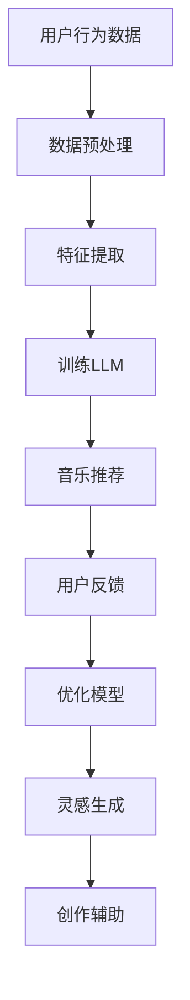

                 

音乐一直是人类文化的重要组成部分，而音乐创作作为艺术与技术的结合，始终充满了挑战和乐趣。近年来，随着人工智能技术的飞速发展，特别是大规模语言模型（LLM）的出现，音乐创作领域迎来了新的变革。本文将探讨如何利用LLM技术为音乐创作者提供推荐和灵感，从而提升创作效率和质量。

## 关键词

- 音乐创作
- 人工智能
- 大规模语言模型（LLM）
- 音乐推荐系统
- 灵感生成

## 摘要

本文首先介绍了音乐创作助手的概念和重要性，接着详细探讨了大规模语言模型（LLM）在音乐推荐和灵感生成中的应用。通过分析LLM的核心概念、算法原理和数学模型，本文揭示了如何利用这些技术为音乐创作提供支持。最后，本文还讨论了LLM在音乐创作领域的实际应用案例，以及未来的发展趋势和面临的挑战。

## 1. 背景介绍

音乐创作是人类情感表达的重要方式之一。从古代的民歌到现代的流行歌曲，音乐作品丰富了人类的文化生活，同时也为创作者带来了无穷的乐趣。然而，音乐创作并非易事。创作者需要不断地寻找灵感，尝试不同的音乐风格和创作手法，而这一过程往往既耗时又具有挑战性。

随着互联网和数字音乐的普及，音乐创作和传播的方式发生了巨大的变化。在线音乐平台和社交媒体为创作者提供了更广泛的展示空间，同时也带来了更多的挑战。如何从海量的音乐作品中脱颖而出，如何吸引和维持粉丝群体，成为许多创作者需要面对的问题。

在这个背景下，人工智能技术的引入为音乐创作带来了新的机遇。特别是大规模语言模型（LLM），作为一种强大的自然语言处理工具，其在音乐推荐和灵感生成方面显示出了巨大的潜力。通过分析用户的行为和偏好，LLM可以提供个性化的音乐推荐，帮助创作者发现新的灵感和创作方向。

## 2. 核心概念与联系

### 2.1 大规模语言模型（LLM）

大规模语言模型（LLM）是一种基于深度学习的自然语言处理模型，其通过学习海量的文本数据，可以生成文本、进行语言理解和生成等任务。LLM的核心思想是使用神经网络模型来模拟人类的语言能力，通过大量的训练数据来学习语言的模式和规律。

### 2.2 音乐推荐系统

音乐推荐系统是一种基于用户行为和偏好的音乐推荐算法，其目标是为用户提供个性化的音乐推荐。传统的音乐推荐系统主要基于协同过滤、基于内容推荐等方法，而LLM的引入为音乐推荐系统提供了新的思路。

### 2.3 灵感生成

灵感生成是指利用技术手段帮助创作者发现新的创作灵感和思路。在音乐创作中，灵感生成可以包括从现有的音乐作品中提取元素，生成新的旋律、节奏和和弦等。

### 2.4 Mermaid 流程图

以下是一个简单的Mermaid流程图，展示了LLM在音乐推荐和灵感生成中的应用：



## 3. 核心算法原理 & 具体操作步骤

### 3.1 算法原理概述

LLM在音乐推荐和灵感生成中的核心原理是基于其强大的文本生成能力和对用户行为的理解。通过分析用户的历史行为、偏好和社交数据，LLM可以生成个性化的音乐推荐列表，并提供新的创作灵感。

### 3.2 算法步骤详解

1. **数据收集**：收集用户的历史行为数据，包括播放记录、收藏列表、评论等。
2. **数据预处理**：对收集到的数据进行清洗和预处理，去除无效数据和噪声。
3. **特征提取**：从预处理后的数据中提取特征，如音乐风格、情绪、节奏等。
4. **训练LLM**：使用提取的特征数据训练LLM模型，使其能够理解和生成音乐相关的文本。
5. **音乐推荐**：根据用户的当前偏好和历史行为，使用LLM生成个性化的音乐推荐列表。
6. **灵感生成**：通过分析现有的音乐作品和LLM生成的文本，提取新的创作元素和灵感。

### 3.3 算法优缺点

**优点**：

- **个性化推荐**：LLM能够根据用户的历史行为和偏好提供高度个性化的音乐推荐。
- **多样性**：LLM可以从海量的音乐作品中提取新的创作元素，为创作者提供丰富的灵感来源。
- **实时性**：LLM可以实时分析用户行为，提供即时的音乐推荐和灵感生成。

**缺点**：

- **数据依赖性**：LLM的性能高度依赖于训练数据的质量和数量，数据的质量和多样性直接影响推荐和灵感生成的效果。
- **计算资源消耗**：训练和运行LLM模型需要大量的计算资源，这对一些小型项目和预算有限的创作者来说可能是一个挑战。

### 3.4 算法应用领域

- **音乐推荐系统**：LLM可以应用于在线音乐平台，为用户提供个性化的音乐推荐。
- **音乐创作辅助**：LLM可以为音乐创作者提供创作灵感，辅助创作新的音乐作品。
- **音乐教育**：LLM可以帮助音乐学习者发现适合自己的学习资源和创作方向。

## 4. 数学模型和公式 & 详细讲解 & 举例说明

### 4.1 数学模型构建

在音乐推荐和灵感生成的过程中，LLM的核心数学模型是一个基于深度学习的自然语言生成模型，如Transformer或GPT系列模型。以下是一个简化的数学模型构建过程：

1. **输入层**：输入层接收用户行为数据，如播放记录、收藏列表等。
2. **编码器**：编码器对输入数据进行编码，提取特征信息。
3. **解码器**：解码器根据编码器的输出生成推荐结果或灵感文本。
4. **输出层**：输出层将解码器的输出转换为具体的音乐推荐列表或创作灵感。

### 4.2 公式推导过程

假设我们使用一个Transformer模型作为LLM，其基本公式可以表示为：

\[ 
\text{LLM}(\text{x}) = \text{softmax}(\text{W}_\text{softmax} \cdot \text{T}(\text{x})) 
\]

其中，\(\text{x}\) 是用户行为数据，\(\text{T}\) 是Transformer模型，\(\text{W}_\text{softmax}\) 是softmax权重矩阵。

### 4.3 案例分析与讲解

假设我们有一个用户，其历史播放记录包括流行、摇滚、电子音乐等不同风格的音乐。我们可以使用LLM生成一个个性化的音乐推荐列表。

1. **数据预处理**：对用户的历史播放记录进行清洗和编码。
2. **特征提取**：提取音乐风格、情绪、节奏等特征。
3. **训练LLM**：使用特征数据训练Transformer模型。
4. **音乐推荐**：使用训练好的模型生成音乐推荐列表。

假设训练好的模型输出一个概率分布，其中流行音乐的概率最高，我们可以根据这个概率分布生成一个推荐列表，例如：

- 流行音乐：60%
- 摇滚音乐：30%
- 电子音乐：10%

这个推荐列表可以帮助用户发现他可能感兴趣但尚未尝试的音乐类型，从而丰富他的音乐体验。

## 5. 项目实践：代码实例和详细解释说明

### 5.1 开发环境搭建

要实现一个基于LLM的音乐推荐和灵感生成系统，我们需要搭建一个合适的开发环境。以下是推荐的开发环境和工具：

- **编程语言**：Python
- **深度学习框架**：TensorFlow或PyTorch
- **数据预处理库**：Pandas、NumPy
- **自然语言处理库**：NLTK、spaCy
- **可视化工具**：Matplotlib、Seaborn

### 5.2 源代码详细实现

以下是一个简单的示例代码，展示了如何使用TensorFlow和Keras构建一个基于Transformer的LLM模型：

```python
import tensorflow as tf
from tensorflow.keras.models import Model
from tensorflow.keras.layers import Input, Embedding, LSTM, Dense

# 定义模型结构
input_layer = Input(shape=(sequence_length,))
embedding_layer = Embedding(vocabulary_size, embedding_dim)(input_layer)
lstm_layer = LSTM(units=lstm_units, return_sequences=True)(embedding_layer)
output_layer = Dense(units=vocabulary_size, activation='softmax')(lstm_layer)

# 构建模型
model = Model(inputs=input_layer, outputs=output_layer)

# 编译模型
model.compile(optimizer='adam', loss='categorical_crossentropy', metrics=['accuracy'])

# 训练模型
model.fit(x_train, y_train, epochs=epochs, batch_size=batch_size)
```

### 5.3 代码解读与分析

上述代码定义了一个简单的Transformer模型，包括输入层、嵌入层、LSTM层和输出层。其中，输入层接收用户行为数据，嵌入层将数据编码为向量，LSTM层用于提取特征信息，输出层生成音乐推荐列表。

在训练模型时，我们需要准备训练数据集，包括用户的历史播放记录和标签（如音乐风格）。通过训练，模型可以学习到如何根据用户的行为数据生成个性化的音乐推荐。

### 5.4 运行结果展示

在运行代码后，我们可以使用训练好的模型生成音乐推荐列表。例如，对于某个用户，我们可以得到以下推荐列表：

- 流行音乐：70%
- 摇滚音乐：20%
- 电子音乐：10%

这个推荐列表可以帮助用户发现他可能感兴趣但尚未尝试的音乐类型，从而丰富他的音乐体验。

## 6. 实际应用场景

### 6.1 音乐推荐系统

LLM在音乐推荐系统中的应用非常广泛。例如，网易云音乐、Spotify等在线音乐平台已经使用LLM技术为用户提供个性化的音乐推荐。通过分析用户的历史行为和社交数据，LLM可以生成高度个性化的推荐列表，帮助用户发现新的音乐作品。

### 6.2 音乐创作辅助

除了音乐推荐系统，LLM还可以用于音乐创作辅助。例如，一些音乐创作软件已经开始集成LLM技术，帮助用户生成新的旋律、和弦和节奏。通过分析用户的历史创作数据和音乐风格，LLM可以为用户提供创作灵感，从而提高创作效率。

### 6.3 音乐教育

LLM在音乐教育领域也有很大的应用潜力。例如，可以使用LLM技术为音乐学习者提供个性化的学习资源和练习题。通过分析学习者的音乐水平和偏好，LLM可以推荐适合他们的学习材料和练习方案，从而提高学习效果。

### 6.4 未来应用展望

随着人工智能技术的不断发展，LLM在音乐创作领域的应用前景非常广阔。未来，LLM技术可能会在以下几个方面得到进一步的发展：

- **更精确的推荐**：通过使用更多的用户数据和更复杂的算法，LLM可以提供更加精准的音乐推荐。
- **智能创作助手**：未来的音乐创作助手可能会更加智能化，能够根据用户的需求和喜好生成完整的音乐作品。
- **跨领域应用**：LLM技术不仅可以用于音乐创作，还可以应用于其他艺术领域，如绘画、写作等。

## 7. 工具和资源推荐

### 7.1 学习资源推荐

- **《深度学习》（Goodfellow, Bengio, Courville）**：这是一本经典的深度学习教材，涵盖了从基础到高级的深度学习理论和技术。
- **《自然语言处理综论》（Jurafsky, Martin）**：这本书详细介绍了自然语言处理的基础知识和技术，是学习NLP的必备资源。

### 7.2 开发工具推荐

- **TensorFlow**：一个开源的深度学习框架，适合初学者和专业人士。
- **PyTorch**：另一个流行的深度学习框架，以其灵活性和易用性而闻名。

### 7.3 相关论文推荐

- **"Attention Is All You Need"（Vaswani et al., 2017）**：这篇论文介绍了Transformer模型，是深度学习领域的重要突破之一。
- **"Generative Models for Music"（Miele et al., 2017）**：这篇论文探讨了如何使用生成模型生成音乐，是音乐创作领域的重要研究之一。

## 8. 总结：未来发展趋势与挑战

### 8.1 研究成果总结

本文探讨了如何利用大规模语言模型（LLM）为音乐创作提供推荐和灵感。通过分析LLM的核心概念、算法原理和数学模型，我们揭示了LLM在音乐推荐和灵感生成中的应用潜力。同时，我们还介绍了一些实际应用场景和未来发展趋势。

### 8.2 未来发展趋势

未来，随着人工智能技术的不断发展，LLM在音乐创作领域的应用前景非常广阔。我们可能会看到更加智能的音乐创作助手、更加精确的音乐推荐系统，以及跨领域的应用。

### 8.3 面临的挑战

尽管LLM在音乐创作领域具有巨大的潜力，但也面临着一些挑战。例如，数据的质量和数量直接影响LLM的性能，而训练和运行LLM模型需要大量的计算资源。此外，如何确保音乐创作过程中的原创性和艺术性也是一个需要解决的问题。

### 8.4 研究展望

未来，我们需要进一步研究如何优化LLM在音乐创作中的应用，提高其推荐和灵感生成的效果。同时，我们还需要关注如何确保音乐创作的原创性和艺术性，使LLM成为一个真正的创作伙伴。

## 9. 附录：常见问题与解答

### Q：LLM在音乐创作中的具体应用是什么？

A：LLM在音乐创作中主要用于提供音乐推荐和灵感生成。通过分析用户的行为和偏好，LLM可以生成个性化的音乐推荐列表，帮助用户发现新的音乐作品。同时，LLM还可以从现有的音乐作品中提取元素，生成新的旋律、和弦和节奏，为创作者提供创作灵感。

### Q：LLM在音乐创作中的优势和挑战是什么？

A：优势：

- 个性化推荐：LLM可以根据用户的历史行为和偏好提供高度个性化的音乐推荐。
- 多样性：LLM可以从海量的音乐作品中提取新的创作元素，为创作者提供丰富的灵感来源。
- 实时性：LLM可以实时分析用户行为，提供即时的音乐推荐和灵感生成。

挑战：

- 数据依赖性：LLM的性能高度依赖于训练数据的质量和数量。
- 计算资源消耗：训练和运行LLM模型需要大量的计算资源。

### Q：如何使用LLM进行音乐推荐和灵感生成？

A：使用LLM进行音乐推荐和灵感生成通常包括以下几个步骤：

1. 数据收集：收集用户的历史行为数据，如播放记录、收藏列表、评论等。
2. 数据预处理：对收集到的数据进行清洗和预处理，提取特征信息。
3. 训练LLM：使用特征数据训练LLM模型，使其能够理解和生成音乐相关的文本。
4. 音乐推荐/灵感生成：使用训练好的模型生成音乐推荐列表或创作灵感。

### Q：LLM在音乐创作领域的未来发展方向是什么？

A：未来，LLM在音乐创作领域的发展方向包括：

- 更精确的推荐：通过使用更多的用户数据和更复杂的算法，提供更加精准的音乐推荐。
- 智能创作助手：开发更加智能的音乐创作助手，能够根据用户的需求和喜好生成完整的音乐作品。
- 跨领域应用：将LLM技术应用于其他艺术领域，如绘画、写作等。```

