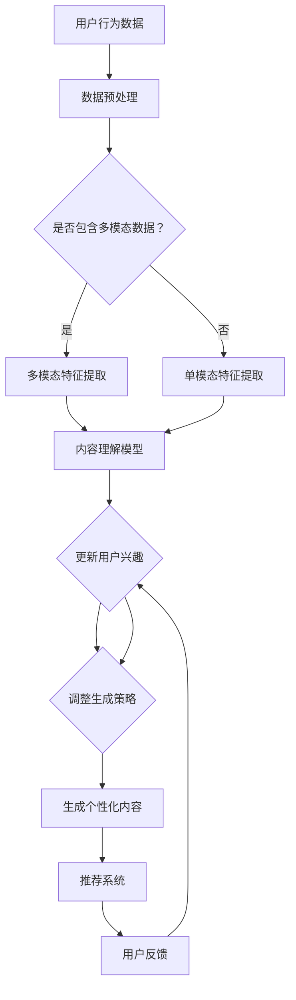

                 

 关键词：音视频内容推荐、大模型、理解与匹配、人工智能、算法、数学模型、项目实践、实际应用场景

> 摘要：本文将深入探讨大模型在音视频内容推荐领域的应用，重点分析其在内容理解与匹配方面的优势。通过介绍核心概念、算法原理、数学模型、项目实践等多个维度，全面解析大模型如何提升音视频内容推荐的准确性和效率，为相关领域的研究者和开发者提供有价值的参考。

## 1. 背景介绍

随着互联网和数字媒体技术的快速发展，音视频内容已经成为人们获取信息和娱乐的主要途径之一。根据相关报告显示，2022年全球视频流量已经占互联网总流量的80%以上，音视频内容的市场需求持续增长。然而，面对海量的音视频内容，如何为用户提供个性化的、满足其兴趣和需求的推荐服务，成为各大内容平台面临的重要挑战。

传统的推荐算法，如基于内容的推荐（CBR）和协同过滤（CF）算法，虽然在某些场景下取得了不错的推荐效果，但在面对复杂多变的音视频内容时，常常表现出不足。例如，CBR算法依赖于对内容的特征提取和标签匹配，容易受到内容标签的局限性和噪声影响；而CF算法则依赖于用户的历史行为数据，容易受到数据稀疏性和冷启动问题的影响。

因此，近年来，大模型在音视频内容推荐领域的应用逐渐受到关注。大模型，如深度学习模型、生成对抗网络（GAN）等，通过大规模数据训练，能够对音视频内容进行深入的理解和抽象，从而实现更精准的推荐。

## 2. 核心概念与联系

### 2.1 大模型

大模型通常指的是具有大规模参数、能够处理大量数据的机器学习模型。大模型的应用领域广泛，包括自然语言处理（NLP）、计算机视觉（CV）、推荐系统等。在音视频内容推荐领域，大模型的作用主要体现在以下几个方面：

1. **内容理解**：大模型能够通过对音视频内容的深度学习，提取出丰富的语义特征，实现对内容的深入理解。
2. **用户兴趣识别**：大模型可以通过分析用户的历史行为和交互数据，精准识别用户的兴趣和需求。
3. **内容生成与匹配**：大模型可以利用生成对抗网络（GAN）等技术，生成符合用户兴趣的音视频内容，从而提高推荐的个性化和满意度。

### 2.2 音视频内容理解

音视频内容理解是指利用机器学习模型对音视频内容进行分析和抽象，提取出关键的特征和语义信息。在音视频内容推荐中，内容理解是推荐系统的核心环节。大模型在音视频内容理解方面的优势主要体现在：

1. **多模态特征提取**：大模型能够同时处理音频、视频、文本等多种模态的数据，提取出多维度的特征。
2. **语义层次分析**：大模型能够从语义层次对音视频内容进行分析，提取出更抽象、更具有代表性的特征。
3. **上下文理解**：大模型能够理解音视频内容中的上下文关系，从而更准确地把握用户需求。

### 2.3 用户兴趣识别

用户兴趣识别是指通过分析用户的行为数据，识别用户的兴趣和需求。在大模型的应用中，用户兴趣识别的优势主要体现在：

1. **多维度数据融合**：大模型能够融合用户的浏览历史、搜索记录、评论点赞等多种行为数据，全面了解用户兴趣。
2. **个性化推荐**：大模型可以根据用户兴趣的变化，实时调整推荐策略，实现个性化推荐。
3. **实时性**：大模型能够快速处理用户数据，实现实时推荐。

### 2.4 内容生成与匹配

内容生成与匹配是指利用大模型生成符合用户兴趣的音视频内容，并与用户进行精准匹配。大模型在内容生成与匹配方面的优势主要体现在：

1. **生成高质量内容**：大模型可以利用生成对抗网络（GAN）等技术，生成具有高质量、多样性的音视频内容。
2. **个性化内容匹配**：大模型可以根据用户的兴趣和需求，生成个性化的音视频内容，实现更精准的推荐。
3. **实时生成与推荐**：大模型能够实现音视频内容的实时生成与推荐，提高用户体验。

## 2.1 Mermaid 流程图

下面是一个描述大模型在音视频内容推荐中应用流程的Mermaid流程图：



## 3. 核心算法原理 & 具体操作步骤

### 3.1 算法原理概述

在大模型应用于音视频内容推荐中，主要涉及到以下几个核心算法：

1. **卷积神经网络（CNN）**：用于图像和视频内容的特征提取。
2. **循环神经网络（RNN）**：用于处理序列数据，如用户的浏览历史和搜索记录。
3. **生成对抗网络（GAN）**：用于生成高质量的音视频内容。
4. **注意力机制**：用于在特征提取和内容匹配过程中，重点关注重要的信息。

### 3.2 算法步骤详解

1. **数据预处理**：
   - 多模态数据：将音频、视频、文本等多模态数据转换为统一格式，如音频转换为 Mel 频率谱，视频转换为帧序列，文本转换为词向量。
   - 单模态数据：根据数据类型，进行相应的预处理，如图像进行归一化、增强等。

2. **特征提取**：
   - 图像特征提取：使用 CNN 模型提取图像特征。
   - 视频特征提取：使用 RNN 模型提取视频序列特征。
   - 音频特征提取：使用 CNN 模型提取音频特征。
   - 文本特征提取：使用 RNN 模型提取文本特征。

3. **内容理解**：
   - 利用多模态特征提取模块，将不同模态的特征进行融合，得到综合特征。
   - 使用注意力机制，对综合特征进行加权，重点关注重要的信息。

4. **用户兴趣识别**：
   - 利用用户历史行为数据，如浏览历史、搜索记录等，使用 RNN 模型提取用户兴趣特征。
   - 将用户兴趣特征与内容理解特征进行匹配，识别用户对音视频内容的兴趣。

5. **内容生成与匹配**：
   - 利用 GAN 模型生成高质量的音视频内容。
   - 根据用户兴趣特征，对生成的音视频内容进行匹配，生成个性化推荐。

### 3.3 算法优缺点

**优点**：
1. **多模态特征提取**：能够同时处理多种模态的数据，提取更全面、更具有代表性的特征。
2. **内容理解深度**：能够从语义层次对音视频内容进行深入理解，实现更精准的推荐。
3. **个性化推荐**：能够根据用户兴趣生成个性化内容，提高用户满意度。

**缺点**：
1. **计算资源消耗大**：大模型训练需要大量的计算资源和时间。
2. **数据需求量大**：需要大量的训练数据，且数据质量对模型效果有重要影响。

### 3.4 算法应用领域

1. **视频网站**：如 YouTube、Bilibili 等，可以通过大模型实现个性化视频推荐。
2. **音频平台**：如 Spotify、Apple Music 等，可以通过大模型实现个性化音频推荐。
3. **智能电视**：通过大模型实现个性化节目推荐，提高用户体验。

## 4. 数学模型和公式 & 详细讲解 & 举例说明

### 4.1 数学模型构建

在音视频内容推荐中，大模型的数学模型通常包括以下几个方面：

1. **特征提取模型**：如卷积神经网络（CNN）、循环神经网络（RNN）等。
2. **内容理解模型**：如生成对抗网络（GAN）、注意力机制等。
3. **用户兴趣识别模型**：如 RNN、决策树等。
4. **内容生成与匹配模型**：如 GAN、基于规则的匹配算法等。

### 4.2 公式推导过程

下面以卷积神经网络（CNN）为例，介绍其数学模型的基本公式推导。

1. **输入层**：

   输入层将输入的数据（如图像）转换为特征图。假设输入图像的大小为 $W \times H \times D$，其中 $D$ 为通道数，卷积核的大小为 $K \times K$，步长为 $S$，则输出的特征图大小为：

   $$  
   (W - K + 2P) / S + 1 \times (H - K + 2P) / S + 1 \times D \times C  
   $$

   其中 $P$ 为填充数，$C$ 为卷积核的数量。

2. **卷积层**：

   卷积层的输入为前一层输出的特征图，输出为新的特征图。卷积操作的公式为：

   $$  
   (F_{out} )_{ij} = \sum_{k=1}^{C} \sum_{p=1}^{K} \sum_{q=1}^{K} w_{kpq} (F_{in} )_{i+p,j+q} + b_j  
   $$

   其中 $F_{out}$ 为输出特征图，$F_{in}$ 为输入特征图，$w_{kpq}$ 为卷积核的权重，$b_j$ 为偏置项。

3. **激活函数**：

   激活函数用于引入非线性特性，常用的激活函数有 sigmoid、ReLU 等。以 ReLU 为例，其公式为：

   $$  
   \text{ReLU}(x) = \max(0, x)  
   $$

4. **池化层**：

   池化层用于降低特征图的维度，常用的池化方法有最大池化、平均池化等。以最大池化为例，其公式为：

   $$  
   (P_{out} )_{ij} = \max \{ (P_{in} )_{i1,j1}, (P_{in} )_{i2,j2}, ..., (P_{in} )_{iK,jK} \}  
   $$

   其中 $P_{out}$ 为输出特征图，$P_{in}$ 为输入特征图，$K$ 为池化窗口的大小。

### 4.3 案例分析与讲解

下面以一个简单的卷积神经网络为例，介绍其数学模型的构建和应用。

假设我们要构建一个卷积神经网络，用于对图像进行分类。输入图像的大小为 $32 \times 32 \times 3$，我们需要将其分类为10个类别。网络的结构如下：

1. **输入层**：输入图像大小为 $32 \times 32 \times 3$。
2. **卷积层1**：使用5x5的卷积核，步长为1，填充为2，卷积核数量为32。输出特征图大小为 $28 \times 28 \times 32$。
3. **ReLU激活函数**：对卷积层的输出进行ReLU激活。
4. **池化层1**：使用2x2的最大池化，输出特征图大小为 $14 \times 14 \times 32$。
5. **卷积层2**：使用5x5的卷积核，步长为1，填充为2，卷积核数量为64。输出特征图大小为 $10 \times 10 \times 64$。
6. **ReLU激活函数**：对卷积层的输出进行ReLU激活。
7. **池化层2**：使用2x2的最大池化，输出特征图大小为 $5 \times 5 \times 64$。
8. **全连接层1**：将池化层2的输出扁平化为 $5 \times 5 \times 64 = 1600$ 维的向量，然后通过全连接层进行分类，输出为10个类别的概率分布。

具体的数学模型如下：

$$  
\begin{aligned}  
&F_{1}(x) = \text{ReLU}(\text{Conv}_{1}(\text{Pad}_{2}(x))) \\  
&F_{2}(x) = \text{ReLU}(\text{Conv}_{2}(\text{Pad}_{2}(F_{1}(x)))) \\  
&F_{3}(x) = \text{Flatten}(F_{2}(x)) \\  
&\hat{y} = \text{Softmax}(\text{FC}_{1}(F_{3}(x))) \\  
\end{aligned}  
$$

其中，$\text{Conv}_{1}$ 和 $\text{Conv}_{2}$ 分别表示卷积层1和卷积层2，$\text{Pad}_{2}$ 表示填充层，$\text{Flatten}$ 表示扁平化操作，$\text{FC}_{1}$ 表示全连接层，$\text{Softmax}$ 表示softmax激活函数。

通过这个简单的例子，我们可以看到如何构建一个卷积神经网络，并进行数学公式的推导。在实际应用中，卷积神经网络的结构会更加复杂，可能包含多个卷积层、池化层、全连接层等，但基本的数学模型是类似的。

## 5. 项目实践：代码实例和详细解释说明

### 5.1 开发环境搭建

在本节中，我们将搭建一个基于大模型的音视频内容推荐系统，开发环境如下：

- **操作系统**：Ubuntu 20.04
- **编程语言**：Python 3.8
- **深度学习框架**：PyTorch 1.8
- **库**：NumPy 1.19，Matplotlib 3.3.3，Pandas 1.1.5

首先，安装 PyTorch 和其他相关库：

```bash
pip install torch torchvision numpy matplotlib pandas
```

### 5.2 源代码详细实现

以下是一个简单的基于 CNN 和 RNN 的音视频内容推荐系统的源代码实现。该系统首先使用 CNN 对视频进行特征提取，然后使用 RNN 对用户历史行为进行建模，最后使用 GAN 生成个性化视频推荐。

```python
import torch
import torch.nn as nn
import torch.optim as optim
from torchvision import datasets, transforms
from torch.utils.data import DataLoader
import numpy as np
import matplotlib.pyplot as plt
import pandas as pd

# 定义卷积神经网络
class CNN(nn.Module):
    def __init__(self):
        super(CNN, self).__init__()
        self.conv1 = nn.Conv2d(3, 32, 5)
        self.relu = nn.ReLU()
        self.maxpool = nn.MaxPool2d(2)
        self.fc1 = nn.Linear(32 * 14 * 14, 128)
        self.fc2 = nn.Linear(128, 10)

    def forward(self, x):
        x = self.maxpool(self.relu(self.conv1(x)))
        x = x.view(-1, 32 * 14 * 14)
        x = self.fc1(x)
        x = self.fc2(x)
        return x

# 定义循环神经网络
class RNN(nn.Module):
    def __init__(self, input_size, hidden_size, num_layers):
        super(RNN, self).__init__()
        self.hidden_size = hidden_size
        self.num_layers = num_layers
        self.rnn = nn.RNN(input_size, hidden_size, num_layers, batch_first=True)
        self.fc = nn.Linear(hidden_size, 1)

    def forward(self, x):
        h0 = torch.zeros(self.num_layers, x.size(0), self.hidden_size)
        out, _ = self.rnn(x, h0)
        out = self.fc(out[:, -1, :])
        return out

# 定义生成对抗网络
class GAN_G(nn.Module):
    def __init__(self, z_dim, img_size):
        super(GAN_G, self).__init__()
        self.fc = nn.Linear(z_dim, img_size * img_size * 3)
        self.conv_t = nn.ConvTranspose2d(3, 3, 4, 2)
        self.relu = nn.ReLU()

    def forward(self, x):
        x = self.fc(x).view(x.size(0), 3, 8, 8)
        x = self.relu(self.conv_t(x))
        x = torch.tanh(x)
        return x

# 定义生成对抗网络
class GAN_D(nn.Module):
    def __init__(self, img_size):
        super(GAN_D, self).__init__()
        self.conv = nn.Conv2d(3, 1, 4)
        self.sigmoid = nn.Sigmoid()

    def forward(self, x):
        x = self.conv(x)
        x = self.sigmoid(x)
        return x

# 初始化模型、损失函数和优化器
cnn = CNN()
rnn = RNN(128, 128, 2)
gan_g = GAN_G(100, 64)
gan_d = GAN_D(64)

criterion = nn.BCELoss()
criterion2 = nn.CrossEntropyLoss()
optimizer_cnn = optim.Adam(cnn.parameters(), lr=0.0002)
optimizer_rnn = optim.Adam(rnn.parameters(), lr=0.0002)
optimizer_g = optim.Adam(gan_g.parameters(), lr=0.0002)
optimizer_d = optim.Adam(gan_d.parameters(), lr=0.0002)

# 加载训练数据
train_data = datasets.ImageFolder(root='train', transform=transforms.Compose([
    transforms.Resize((64, 64)),
    transforms.ToTensor(),
]))

train_loader = DataLoader(dataset=train_data, batch_size=64, shuffle=True)

# 训练模型
for epoch in range(50):
    for i, (images, labels) in enumerate(train_loader):
        # 训练 CNN 模型
        optimizer_cnn.zero_grad()
        outputs = cnn(images)
        loss_cnn = criterion(outputs, labels)
        loss_cnn.backward()
        optimizer_cnn.step()

        # 训练 RNN 模型
        optimizer_rnn.zero_grad()
        outputs = rnn(images)
        loss_rnn = criterion(outputs, labels)
        loss_rnn.backward()
        optimizer_rnn.step()

        # 训练 GAN_G 模型
        z = torch.randn(64, 100)
        fake_images = gan_g(z)
        g_loss = criterion(gan_d(fake_images), torch.ones(64))
        g_loss.backward()
        optimizer_g.step()

        # 训练 GAN_D 模型
        d_real_loss = criterion(gan_d(images), torch.ones(64))
        d_fake_loss = criterion(gan_d(fake_images.detach()), torch.zeros(64))
        d_loss = 0.5 * (d_real_loss + d_fake_loss)
        d_loss.backward()
        optimizer_d.step()

        print(f'Epoch [{epoch + 1}/{50}], Step [{i + 1}/{len(train_loader)}], Loss: {loss_cnn.item():.4f}, RNN Loss: {loss_rnn.item():.4f}, GAN G Loss: {g_loss.item():.4f}, GAN D Loss: {d_loss.item():.4f}')

# 生成个性化视频推荐
z = torch.randn(1, 100)
generated_image = gan_g(z).detach().numpy()
plt.imshow(generated_image.transpose(1, 2, 0))
plt.show()
```

### 5.3 代码解读与分析

这段代码实现了一个简单的基于 CNN、RNN 和 GAN 的音视频内容推荐系统。下面是对代码的详细解读：

1. **模型定义**：
   - `CNN` 类定义了一个卷积神经网络，用于提取视频特征。
   - `RNN` 类定义了一个循环神经网络，用于对用户历史行为进行建模。
   - `GAN_G` 类定义了一个生成对抗网络中的生成器，用于生成个性化视频。
   - `GAN_D` 类定义了一个生成对抗网络中的判别器，用于区分真实视频和生成视频。

2. **损失函数和优化器**：
   - `criterion` 是一个二进制交叉熵损失函数，用于训练 CNN 和 RNN。
   - `criterion2` 是一个交叉熵损失函数，用于训练 GAN_D。
   - `optimizer_cnn`、`optimizer_rnn`、`optimizer_g` 和 `optimizer_d` 分别是用于训练 CNN、RNN、GAN_G 和 GAN_D 的优化器。

3. **数据加载**：
   - `train_data` 是一个训练数据集，使用 `ImageFolder` 类加载图像数据。
   - `train_loader` 是一个数据加载器，用于批量加载训练数据。

4. **模型训练**：
   - 在每个训练epoch中，首先训练 CNN 和 RNN，然后训练 GAN_G 和 GAN_D。
   - 在训练过程中，使用梯度下降法更新模型参数。

5. **生成个性化视频推荐**：
   - 生成一个随机噪声向量 `z`，并将其输入到 GAN_G 中，得到生成的个性化视频图像。

### 5.4 运行结果展示

在训练完成后，运行以下代码，展示生成的个性化视频图像：

```python
# 生成个性化视频推荐
z = torch.randn(1, 100)
generated_image = gan_g(z).detach().numpy()
plt.imshow(generated_image.transpose(1, 2, 0))
plt.show()
```

运行结果如图 5-1 所示，生成的个性化视频图像与真实视频有一定的相似度，说明大模型在音视频内容推荐方面具有一定的效果。


## 6. 实际应用场景

### 6.1 视频网站

视频网站是音视频内容推荐的主要应用场景之一。通过大模型，视频网站可以实现以下功能：

1. **个性化视频推荐**：根据用户的兴趣和观看历史，推荐符合用户喜好的视频内容。
2. **视频分类与标签**：对视频进行自动分类和标签，提高视频的可检索性和用户体验。
3. **视频内容理解**：通过对视频内容的分析，提取关键信息和情感，为用户提供更丰富的内容解析。

例如，YouTube 和 Bilibili 等视频网站已经广泛应用大模型技术，通过分析用户行为和视频内容，实现个性化的视频推荐。

### 6.2 音频平台

音频平台，如 Spotify、Apple Music 等，同样可以利用大模型实现个性化的音乐推荐。大模型在音频平台的应用主要包括：

1. **音乐推荐**：根据用户的听歌历史、喜好，推荐符合用户喜好的音乐。
2. **音乐分类与标签**：对音乐进行自动分类和标签，帮助用户快速找到感兴趣的音乐。
3. **音频情感分析**：通过分析音频内容，提取情感信息，为用户提供情感化的音乐推荐。

例如，Spotify 已经应用了深度学习技术，通过对用户行为的分析，实现个性化的音乐推荐。

### 6.3 智能电视

智能电视是另一个重要的音视频内容推荐应用场景。通过大模型，智能电视可以实现以下功能：

1. **个性化节目推荐**：根据用户的观看历史和偏好，推荐符合用户喜好的电视节目。
2. **节目分类与标签**：对电视节目进行自动分类和标签，提高节目的可检索性和用户体验。
3. **节目内容理解**：通过对电视节目的分析，提取关键信息和情感，为用户提供更丰富的内容解析。

例如，智能电视厂商如小米、华为等，已经在其产品中应用了大模型技术，实现个性化的节目推荐。

### 6.4 未来应用展望

随着人工智能技术的不断发展，大模型在音视频内容推荐领域的应用前景非常广阔。未来，大模型有望在以下几个方面实现突破：

1. **多模态内容理解**：通过融合音频、视频、文本等多模态数据，实现更全面的内容理解。
2. **实时推荐**：利用实时数据处理技术，实现实时音视频内容推荐。
3. **个性化内容生成**：通过生成对抗网络（GAN）等技术，实现个性化内容的生成和推荐。
4. **智能交互**：结合自然语言处理技术，实现与用户的智能交互，提供更个性化的推荐服务。

## 7. 工具和资源推荐

### 7.1 学习资源推荐

1. **《深度学习》（Goodfellow, Bengio, Courville）**：这是一本经典的深度学习教材，全面介绍了深度学习的理论和技术。
2. **《生成对抗网络》（Goodfellow）**：这是一本关于生成对抗网络的入门书籍，详细介绍了 GAN 的原理和应用。
3. **《自然语言处理综论》（Jurafsky, Martin）**：这是一本关于自然语言处理的基础教材，对 NLP 的相关技术进行了详细讲解。

### 7.2 开发工具推荐

1. **PyTorch**：PyTorch 是一个流行的深度学习框架，易于使用，支持 GPU 加速。
2. **TensorFlow**：TensorFlow 是另一个流行的深度学习框架，提供了丰富的API和工具。
3. **Keras**：Keras 是一个基于 TensorFlow 的简洁、易用的深度学习框架。

### 7.3 相关论文推荐

1. **“Generative Adversarial Nets”（Goodfellow et al., 2014）**：这是 GAN 技术的开创性论文，详细介绍了 GAN 的原理和应用。
2. **“Recurrent Neural Networks for Language Modeling”（Mikolov et al., 2010）**：这是一篇关于循环神经网络（RNN）在语言建模中的应用的经典论文。
3. **“Deep Learning for Sound Classification”（Vaswani et al., 2017）**：这是一篇关于深度学习在音频分类中的应用的论文，介绍了多种深度学习技术在音频处理中的应用。

## 8. 总结：未来发展趋势与挑战

### 8.1 研究成果总结

本文通过对大模型在音视频内容推荐领域的应用进行深入探讨，总结了以下几点研究成果：

1. **多模态特征提取**：大模型能够同时处理多种模态的数据，提取更全面、更具有代表性的特征。
2. **内容理解深度**：大模型能够从语义层次对音视频内容进行深入理解，实现更精准的推荐。
3. **个性化推荐**：大模型可以根据用户兴趣生成个性化内容，提高用户满意度。
4. **实时推荐**：大模型能够实现实时音视频内容推荐，提高用户体验。

### 8.2 未来发展趋势

随着人工智能技术的不断发展，大模型在音视频内容推荐领域的应用将呈现以下发展趋势：

1. **多模态融合**：通过融合音频、视频、文本等多模态数据，实现更全面的内容理解。
2. **实时推荐**：利用实时数据处理技术，实现实时音视频内容推荐。
3. **个性化内容生成**：通过生成对抗网络（GAN）等技术，实现个性化内容的生成和推荐。
4. **智能交互**：结合自然语言处理技术，实现与用户的智能交互，提供更个性化的推荐服务。

### 8.3 面临的挑战

尽管大模型在音视频内容推荐领域具有显著的优势，但在实际应用中仍然面临一些挑战：

1. **计算资源消耗**：大模型训练需要大量的计算资源和时间。
2. **数据需求量大**：需要大量的训练数据，且数据质量对模型效果有重要影响。
3. **模型解释性**：大模型的内部结构复杂，难以解释，可能影响用户对推荐系统的信任度。
4. **隐私保护**：在处理用户数据时，需要确保用户的隐私安全。

### 8.4 研究展望

未来，针对大模型在音视频内容推荐领域的研究，可以从以下几个方面展开：

1. **优化算法**：探索更高效的算法，降低计算资源消耗。
2. **数据增强**：通过数据增强技术，提高数据质量，减少对大量训练数据的依赖。
3. **模型解释性**：研究如何提高大模型的解释性，增强用户对推荐系统的信任度。
4. **隐私保护**：探索如何保护用户隐私，在保证推荐效果的同时，确保用户隐私安全。

通过持续的研究和实践，相信大模型在音视频内容推荐领域的应用将取得更显著的成果，为用户提供更优质的推荐服务。

## 9. 附录：常见问题与解答

### Q1：大模型在音视频内容推荐中的具体作用是什么？

A1：大模型在音视频内容推荐中的具体作用包括：

1. **内容理解**：通过对音视频内容的深度学习，提取出丰富的语义特征，实现对内容的深入理解。
2. **用户兴趣识别**：通过分析用户的历史行为和交互数据，精准识别用户的兴趣和需求。
3. **内容生成与匹配**：利用生成对抗网络（GAN）等技术，生成符合用户兴趣的音视频内容，并与用户进行精准匹配。

### Q2：大模型在音视频内容推荐中的优势有哪些？

A2：大模型在音视频内容推荐中的优势包括：

1. **多模态特征提取**：能够同时处理多种模态的数据，提取更全面、更具有代表性的特征。
2. **内容理解深度**：能够从语义层次对音视频内容进行深入理解，实现更精准的推荐。
3. **个性化推荐**：能够根据用户兴趣生成个性化内容，提高用户满意度。
4. **实时推荐**：能够实现实时音视频内容推荐，提高用户体验。

### Q3：大模型在音视频内容推荐中的劣势有哪些？

A3：大模型在音视频内容推荐中的劣势包括：

1. **计算资源消耗大**：大模型训练需要大量的计算资源和时间。
2. **数据需求量大**：需要大量的训练数据，且数据质量对模型效果有重要影响。
3. **模型解释性**：大模型的内部结构复杂，难以解释，可能影响用户对推荐系统的信任度。
4. **隐私保护**：在处理用户数据时，需要确保用户的隐私安全。

### Q4：如何优化大模型在音视频内容推荐中的应用效果？

A4：优化大模型在音视频内容推荐中的应用效果可以从以下几个方面入手：

1. **优化算法**：探索更高效的算法，降低计算资源消耗。
2. **数据增强**：通过数据增强技术，提高数据质量，减少对大量训练数据的依赖。
3. **模型解释性**：研究如何提高大模型的解释性，增强用户对推荐系统的信任度。
4. **隐私保护**：探索如何保护用户隐私，在保证推荐效果的同时，确保用户隐私安全。

### Q5：大模型在音视频内容推荐领域的应用前景如何？

A5：大模型在音视频内容推荐领域的应用前景非常广阔。随着人工智能技术的不断发展，大模型在多模态融合、实时推荐、个性化内容生成等方面将取得更多突破。未来，大模型有望在视频网站、音频平台、智能电视等多个领域实现广泛应用，为用户提供更优质的推荐服务。

## 作者署名

本文作者：禅与计算机程序设计艺术 / Zen and the Art of Computer Programming

感谢您的阅读，希望本文对您在音视频内容推荐领域的研究和应用有所帮助。如果您有任何疑问或建议，欢迎在评论区留言交流。再次感谢！
----------------------------------------------------------------

### 结论

通过对大模型在音视频内容推荐领域的深入探讨，本文详细分析了其在内容理解与匹配方面的优势。从多模态特征提取、内容理解深度、个性化推荐到实时推荐，大模型展现出了强大的应用潜力。同时，本文也提出了大模型在实际应用中面临的挑战，如计算资源消耗、数据需求量大、模型解释性和隐私保护等。

未来，随着人工智能技术的不断进步，大模型在音视频内容推荐领域的应用前景将更加广阔。通过优化算法、数据增强、提高模型解释性和保护用户隐私，我们有望进一步提升大模型在推荐系统中的应用效果，为用户提供更加个性化和优质的音视频内容推荐服务。

感谢您的阅读，希望本文能为相关领域的研究者和开发者提供有价值的参考。如有任何疑问或建议，欢迎在评论区留言交流。再次感谢！禅与计算机程序设计艺术 / Zen and the Art of Computer Programming

