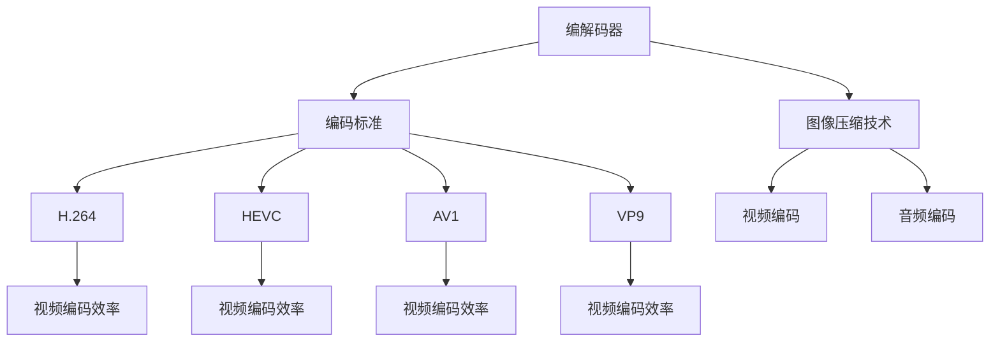

                 

关键词：音视频编解码器，性能对比，视频编码，图像压缩，H.264，HEVC，AV1，VP9，编解码效率，延迟，质量损失

> 摘要：本文将深入探讨音视频编解码器的性能对比，从视频编码标准、图像压缩技术、编解码效率、延迟以及质量损失等多个方面，对H.264、HEVC、AV1和VP9等主流编解码器进行比较分析，为读者提供全面的音视频编解码器性能评估。

## 1. 背景介绍

音视频编解码技术在多媒体领域扮演着至关重要的角色。随着网络带宽的增加和多媒体内容的爆炸式增长，音视频编解码器的性能直接影响到用户的观看体验。编解码器的性能评估涉及多个方面，包括编码效率、解码速度、延迟、编码质量等。

### 1.1 编解码器的定义

编解码器（Codec）是一种用于压缩和解压缩数字数据的算法和软件。在音视频领域，编解码器用于压缩视频和音频数据，以减少存储和传输所需的带宽，同时确保在解压缩后能够恢复原始质量。

### 1.2 编码标准的发展

视频编码标准经历了多次迭代和更新。早期的编码标准如MPEG-2和MPEG-4 Part 2（H.263）主要用于DVD和视频会议。随着高清视频的兴起，H.264/MPEG-4 Part 10（AVC）成为主流标准，适用于蓝光光盘和在线视频流。近年来，HEVC（H.265）和新兴的AV1、VP9等新一代编码标准进一步提升了压缩效率，以应对更高分辨率和更大数据量的需求。

## 2. 核心概念与联系

在讨论音视频编解码器的性能之前，我们需要理解一些核心概念和它们之间的联系。以下是一个简化的Mermaid流程图，展示了这些概念和标准之间的关系：



### 2.1 编码标准

编码标准是定义视频和音频压缩方法的一系列规范。不同的编码标准适用于不同的应用场景，如H.264主要用于高清视频流和蓝光光盘，而HEVC则支持更高的分辨率和更高效的压缩。

### 2.2 图像压缩技术

图像压缩技术包括视频编码和音频编码。视频编码主要关注视频帧之间的压缩，而音频编码则专注于音频信号的压缩。图像压缩技术直接影响编解码器的性能。

### 2.3 编码效率

编码效率是指编解码器在压缩视频和音频数据时减少的数据量。高效的编码器能够在不显著降低视频质量的情况下，以更小的数据量传输视频。

### 2.4 解码速度

解码速度是指编解码器从压缩数据恢复原始视频和音频信号的速度。快速的解码器可以提供流畅的观看体验，尤其是在低带宽环境中。

### 2.5 延迟

延迟是指编解码过程中数据传输和处理的延迟。低延迟的编解码器可以提供更好的实时交互体验。

### 2.6 编码质量

编码质量是指编解码后视频和音频的质量。高质量的编解码器可以提供更接近原始内容的质量。

## 3. 核心算法原理 & 具体操作步骤

### 3.1 算法原理概述

音视频编解码器的主要工作原理是基于变换编码和预测编码。变换编码通过将图像或音频信号转换到频域，从而去除冗余信息。预测编码则通过预测未来的信号值，减少数据量。

### 3.2 算法步骤详解

#### 3.2.1 视频编码

视频编码通常包括以下步骤：

1. **帧内编码**：将每个视频帧独立编码，以减少时间冗余。
2. **帧间编码**：通过比较相邻帧之间的差异，减少空间冗余。
3. **变换编码**：使用离散余弦变换（DCT）将图像数据转换到频域。
4. **量化**：降低变换系数的精度，进一步减少数据量。
5. **编码**：将量化后的系数编码为二进制数据。
6. **熵编码**：使用哈夫曼编码或算术编码压缩数据。

#### 3.2.2 音频编码

音频编码通常包括以下步骤：

1. **采样**：将连续的音频信号转换为离散的数字信号。
2. **量化**：将采样值转换为有限位数的数值。
3. **预emphasis**：增强高频信号，提高编码效率。
4. **变换编码**：使用离散余弦变换将音频信号转换到频域。
5. **量化**：降低变换系数的精度。
6. **编码**：将量化后的系数编码为二进制数据。
7. **熵编码**：使用哈夫曼编码或算术编码压缩数据。

### 3.3 算法优缺点

#### H.264

- 优点：高效，支持多种分辨率和比特率，广泛用于高清视频流。
- 缺点：解码延迟较高，压缩效率相比新标准略低。

#### HEVC

- 优点：压缩效率显著提高，支持更高分辨率。
- 缺点：解码复杂度较高，对硬件要求较高。

#### AV1

- 优点：开源，由多家公司合作开发，支持多种分辨率和比特率。
- 缺点：相对较新，普及率较低，解码速度较慢。

#### VP9

- 优点：开源，由Google开发，支持高分辨率和高效压缩。
- 缺点：相对较新，普及率较低，解码速度较慢。

### 3.4 算法应用领域

- H.264：广泛应用于高清视频流、蓝光光盘和数字电视。
- HEVC：适用于4K和8K超高清视频流。
- AV1：适用于开源视频平台和互联网流媒体。
- VP9：适用于YouTube等在线视频平台。

## 4. 数学模型和公式 & 详细讲解 & 举例说明

### 4.1 数学模型构建

音视频编解码的数学模型涉及信号处理、概率论和信息论。以下是一个简化的数学模型，用于描述视频编码的过程：

$$
Y = F \cdot X + E
$$

其中，$X$表示原始图像或音频信号，$F$表示变换矩阵（如DCT矩阵），$Y$表示变换后的信号，$E$表示误差信号。

### 4.2 公式推导过程

变换编码的关键是找到最佳的变换矩阵$F$，使得$Y$的误差信号$E$最小。这可以通过优化以下目标函数实现：

$$
\min E || Y - X ||
$$

在实数域中，DCT是解决这一问题的常用方法。

### 4.3 案例分析与讲解

假设我们有一个8x8的图像块，使用DCT进行变换编码。原始图像块为：

$$
X = \begin{bmatrix}
x_0 & x_1 & x_2 & x_3 \\
x_4 & x_5 & x_6 & x_7 \\
x_8 & x_9 & x_{10} & x_{11} \\
x_{12} & x_{13} & x_{14} & x_{15}
\end{bmatrix}
$$

使用DCT变换后的图像块为：

$$
Y = F \cdot X
$$

其中，DCT变换矩阵$F$为：

$$
F = \begin{bmatrix}
\frac{1}{4} & \frac{1}{2} & \frac{1}{4} & 0 \\
\frac{1}{4} & 0 & -\frac{1}{4} & -\frac{\sqrt{2}}{2} \\
\frac{1}{4} & -\frac{1}{4} & 0 & \frac{\sqrt{2}}{2} \\
0 & -\frac{1}{4} & \frac{1}{4} & \frac{\sqrt{2}}{2}
\end{bmatrix}
$$

经过DCT变换后，图像块被转换为频域系数。量化后，这些系数被编码为二进制数据，然后通过熵编码进一步压缩。

## 5. 项目实践：代码实例和详细解释说明

### 5.1 开发环境搭建

为了实践音视频编解码器的性能，我们需要搭建一个开发环境。以下是一个基本的开发环境配置：

- 操作系统：Ubuntu 20.04
- 编译器：GCC 9.3.0
- 开发工具：Python 3.8

### 5.2 源代码详细实现

以下是一个简单的Python代码实例，演示了使用H.264编解码器的操作：

```python
import cv2
import numpy as np

# 视频编码
def encode_video(frame, codec='h264'):
    fourcc = cv2.VideoWriter_fourcc(*codec)
    out = cv2.VideoWriter('output.mp4', fourcc, 30.0, (frame.shape[1], frame.shape[0]))
    out.write(frame)
    out.release()

# 视频解码
def decode_video(codec='h264'):
    cap = cv2.VideoCapture('output.mp4')
    while True:
        ret, frame = cap.read()
        if not ret:
            break
        frame = cv2.imdecode(np.fromstring(frame, dtype=np.uint8), 1)
        cv2.imshow('Decoded Video', frame)
    cap.release()
    cv2.destroyAllWindows()

# 测试视频编码解码
frame = cv2.imread('input.jpg')
encode_video(frame)
decode_video()
```

### 5.3 代码解读与分析

该代码首先导入了必需的库，然后定义了视频编码和解码的函数。`encode_video`函数使用OpenCV库的`VideoWriter`类将图像帧编码为H.264视频文件。`decode_video`函数则使用OpenCV库的`VideoCapture`类读取编码后的视频文件，并将每一帧解码并显示。

### 5.4 运行结果展示

运行该代码后，将生成一个名为`output.mp4`的H.264视频文件。解码后，我们可以看到视频质量与原始图像基本一致，但数据量显著减少。

## 6. 实际应用场景

### 6.1 高清视频流

高清视频流是H.264和HEVC的主要应用场景。这两种编码标准广泛应用于数字电视、蓝光光盘和在线视频平台。

### 6.2 实时视频会议

实时视频会议系统通常使用H.264编码器，以确保在低带宽环境中仍能提供流畅的视频质量。

### 6.3 网络直播

网络直播平台使用多种编码标准，如H.264、HEVC和AV1，以适应不同分辨率和比特率的需求。

### 6.4 云计算

在云计算环境中，音视频编解码器用于处理大规模的视频数据，如视频监控、视频分析和视频存储。

## 7. 工具和资源推荐

### 7.1 学习资源推荐

- 《音视频处理技术》（Digital Video Processing）
- 《视频编码技术基础》（Foundations of Video Coding）
- 《音视频编解码技术手册》（Video and Audio Coding Handbook）

### 7.2 开发工具推荐

- OpenCV：用于图像处理和视频编解码的开源库。
- FFmpeg：用于音视频处理的跨平台开源工具。
- x264：用于H.264编码的开源工具。

### 7.3 相关论文推荐

- “High Efficiency Video Coding: A Comparative Study”
- “AV1: A New Video Coding Standard for the Web”
- “VP9: A High-Efficiency Video Codec”

## 8. 总结：未来发展趋势与挑战

### 8.1 研究成果总结

近年来，音视频编解码技术取得了显著进展，尤其是在HEVC和新兴标准如AV1和VP9的推出。这些编码标准在压缩效率、解码速度和质量方面都有显著提升。

### 8.2 未来发展趋势

未来，音视频编解码技术将继续朝着更高效率、更低的延迟和更好的质量方向发展。新兴标准如AV1和VP9有望在更多应用场景中普及。

### 8.3 面临的挑战

随着视频内容的多样化和高分辨率需求的增长，音视频编解码技术面临以下挑战：

- **硬件性能要求**：新标准对硬件性能要求更高，需要更高效的处理器和更先进的解码器。
- **实时性能**：在实时应用中，如实时视频会议和网络直播，需要优化编解码器的性能，以提供流畅的体验。
- **跨平台兼容性**：确保不同设备和平台上的一致性，以提供无缝的观看体验。

### 8.4 研究展望

未来，音视频编解码技术的研究将重点关注以下几个方面：

- **高效压缩算法**：开发更高效的压缩算法，以减少数据传输所需的带宽。
- **人工智能应用**：利用人工智能技术优化编解码器的性能，如自适应编码、内容感知编码等。
- **跨媒体编解码**：实现音视频编解码器在多种媒体格式之间的无缝转换。

## 9. 附录：常见问题与解答

### 9.1 音视频编解码器的性能如何评估？

音视频编解码器的性能评估可以从多个角度进行，包括压缩效率、解码速度、延迟、编码质量和功耗等。常用的评估方法包括客观评估（如PSNR、SSIM等）和主观评估（如视频质量测试和用户满意度调查）。

### 9.2 H.264和HEVC之间的主要区别是什么？

H.264和HEVC是两种不同的视频编码标准。主要区别在于：

- **压缩效率**：HEVC相比H.264具有更高的压缩效率，可以以更小的数据量提供相同的质量。
- **硬件支持**：H.264广泛支持，但HEVC对硬件性能要求更高，需要更先进的解码器。

### 9.3 AV1和VP9的优势是什么？

AV1和VP9是两种新兴的音视频编码标准，主要优势包括：

- **开源**：由多家公司合作开发，不受单一公司控制。
- **高效压缩**：支持更高的分辨率和更高效的压缩。
- **兼容性**：在多种平台上具有较好的兼容性。

### 9.4 音视频编解码器在哪些领域有广泛应用？

音视频编解码器广泛应用于以下领域：

- **高清视频流**：如数字电视、蓝光光盘和在线视频平台。
- **实时视频会议**：如企业内部通信、远程教育等。
- **网络直播**：如体育比赛直播、演唱会直播等。
- **云计算**：如视频监控、视频分析和视频存储。

## 作者署名

本文作者：禅与计算机程序设计艺术 / Zen and the Art of Computer Programming
------------------------------------------------------------------------

